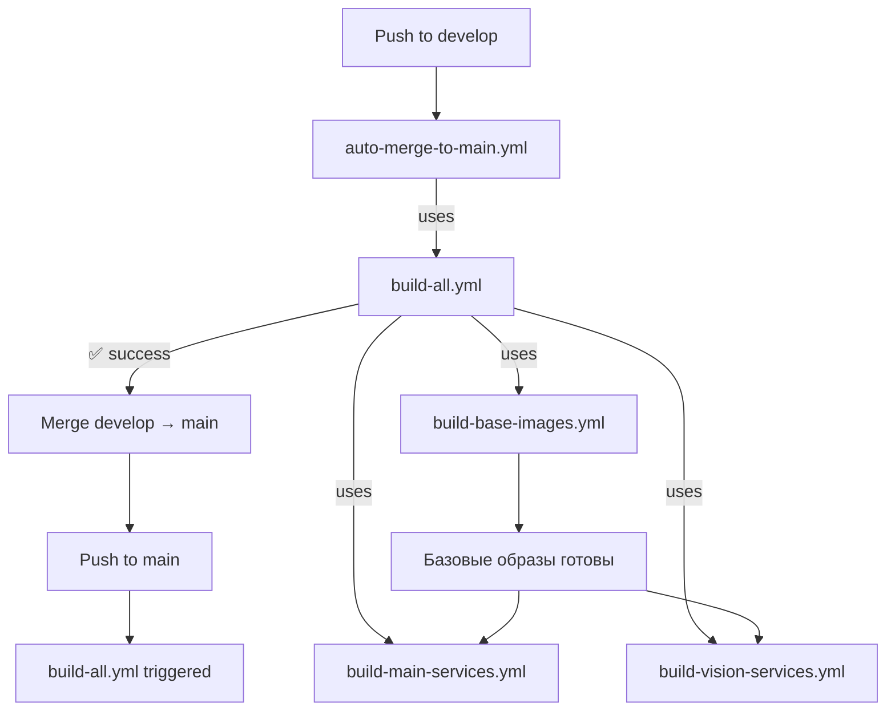

# GitHub Actions Workflows Guide

## 📋 Обзор

Проект использует 6 GitHub Actions workflow для CI/CD:

1. **auto-merge-to-main.yml** - автомерж develop → main после успешной сборки
2. **build-all.yml** - полная сборка всех образов
3. **build-base-images.yml** - базовые образы (ros2-zenoh, rtabmap, depthai, pcl)
4. **build-main-services.yml** - сервисы Main Pi (robot-state-publisher, rtabmap)
5. **build-vision-services.yml** - сервисы Vision Pi (oak-d, lslidar, apriltag)
6. **validate-docker-compose.yml** - валидация docker-compose файлов

## 🔄 Git Flow с автоматическим мерджем

### Схема работы

```
develop → push → build-all → успех → auto-merge → main → build-all
```

**Процесс:**
1. Разработчик пушит в `develop`
2. Запускается **auto-merge-to-main.yml**:
   - Запускает полную сборку всех образов
   - Если сборка успешна → автоматически мержит в `main`
   - Если сборка упала → мердж не происходит
3. После мерджа в `main` запускается автосборка

**Преимущества:**
- ✅ `main` всегда стабильный (только проверенный код)
- ✅ Нет ручного мерджа
- ✅ CI/CD полностью автоматизирован

### auto-merge-to-main.yml

**Триггеры:**
- ✅ `push` to `develop` - автоматически при пуше в develop

**Что делает:**
1. Запускает `build-all.yml` для проверки сборки
2. Если успешно → мержит `develop` в `main` (fast-forward или merge commit)
3. После мерджа → автоматически запускается сборка `main`

**Важно:** Мердж происходит ТОЛЬКО если все образы собрались успешно!

## 🚀 Как запускать сборки

### Вручную через GitHub UI

1. Перейти на вкладку **Actions** в репозитории
2. Выбрать нужный workflow слева:
   - **Build All Docker Images** - собрать всё
   - **Build Base Docker Images** - только базовые образы
   - **Build Main Pi Services** - только Main Pi
   - **Build Vision Pi Services** - только Vision Pi
3. Нажать **Run workflow** → выбрать ветку → **Run workflow**

### Автоматически по расписанию

**build-all.yml** запускается автоматически:
- **Каждый день в 3:00 UTC (6:00 МСК)**
- **При пуше в `main`** (после автомерджа из develop)
- Собирает ВСЕ образы (базовые + сервисы)

## 🏗️ Структура workflow



### build-all.yml

**Триггеры:**
- ✅ `push` to `main` - автосборка при пуше в main
- ✅ `workflow_dispatch` - ручной запуск
- ✅ `workflow_call` - вызов из других workflow (auto-merge)
- ✅ `schedule: '0 3 * * *'` - ежедневно в 3:00 UTC

**Что делает:**
1. Запускает `build-base-images.yml`
2. Параллельно запускает `build-main-services.yml` и `build-vision-services.yml`
3. Проверяет успешность всех сборок

### build-base-images.yml

**Триггеры:**
- ✅ `workflow_dispatch` - ручной запуск
- ✅ `workflow_call` - вызов из `build-all.yml`

**Собирает:**
- `rob_box_base:ros2-zenoh-{ros_distro}-{tag}`
- `rob_box_base:rtabmap-{ros_distro}-{tag}`
- `rob_box_base:depthai-{ros_distro}-{tag}`
- `rob_box_base:pcl-{ros_distro}-{tag}`

**Платформа:** `linux/arm64` (Raspberry Pi)

### build-main-services.yml

**Триггеры:**
- ✅ `workflow_dispatch` - ручной запуск
- ✅ `workflow_call` - вызов из `build-all.yml`

**Собирает:**
- `rob_box:robot-state-publisher-{ros_distro}-{tag}`
- `rob_box:rtabmap-{ros_distro}-{tag}`

**Платформа:** `linux/arm64` (Raspberry Pi)

### build-vision-services.yml

**Триггеры:**
- ✅ `workflow_dispatch` - ручной запуск
- ✅ `workflow_call` - вызов из `build-all.yml`

**Собирает:**
- `rob_box:oak-d-{ros_distro}-{tag}`
- `rob_box:lslidar-{ros_distro}-{tag}`
- `rob_box:apriltag-{ros_distro}-{tag}`

**Платформа:** `linux/arm64` (Raspberry Pi)

## 🏷️ Теги Docker образов

Теги генерируются автоматически на основе ветки:

| Ветка | Tag | Пример |
|-------|-----|--------|
| `main` | `latest` | `lslidar-humble-latest` |
| `develop` | `dev` | `lslidar-humble-dev` |
| `release/v1.0.0` | `rc-v1.0.0` | `lslidar-humble-rc-v1.0.0` |
| `hotfix/fix-name` | `hotfix-fix-name` | `lslidar-humble-hotfix-fix-name` |

**Формат тега:** `{service}-{ros_distro}-{branch_tag}`

Где:
- `{service}` - название сервиса (oak-d, lslidar, robot-state-publisher и т.д.)
- `{ros_distro}` - версия ROS 2 (humble, jazzy, kilted)
- `{branch_tag}` - тег ветки (latest, dev, rc-v1.0.0)

## ⚙️ ROS 2 Version Management

Текущая версия ROS 2 задаётся переменной `ROS_DISTRO` в каждом workflow:

```yaml
env:
  ROS_DISTRO: humble  # Изменить при переходе на другую версию ROS 2 (jazzy, kilted)
```

**Для перехода на новую версию ROS 2:**
1. Изменить `ROS_DISTRO: humble` → `ROS_DISTRO: jazzy` во всех 4 workflow
2. Обновить базовые образы в `docker/base/*/Dockerfile` (FROM ros:jazzy)
3. Запустить полную пересборку через `build-all.yml`

## 🔧 Изменение расписания

Чтобы изменить время ночной сборки, отредактируй `build-all.yml`:

```yaml
schedule:
  - cron: '0 3 * * *'  # Минуты Часы День Месяц День_недели (UTC)
```

**Примеры:**
- `'0 2 * * *'` - каждый день в 2:00 UTC (5:00 МСК)
- `'0 3 * * 1'` - каждый понедельник в 3:00 UTC
- `'0 3 */2 * *'` - каждые 2 дня в 3:00 UTC

## 📊 Мониторинг сборок

1. Перейти на вкладку **Actions**
2. Выбрать workflow слева
3. Увидишь список всех запусков:
   - ✅ Зелёная галочка - успех
   - ❌ Красный крестик - ошибка
   - 🟡 Жёлтый круг - в процессе
4. Кликнуть на запуск → увидишь детали каждого job

## ❓ FAQ

### Почему сборка не запускается при push?

Сборки настроены **ТОЛЬКО** на ручной запуск и по расписанию. Это сделано чтобы:
- Не тратить ресурсы GitHub Actions на каждый коммит
- Контролировать когда и что собирается
- Избежать долгих ожиданий при разработке

### Как собрать только один сервис?

Используй отдельные workflow:
- Только Vision Pi → **Build Vision Pi Services**
- Только Main Pi → **Build Main Pi Services**
- Только базовые образы → **Build Base Docker Images**

### Сколько времени занимает полная сборка?

Примерное время на GitHub Actions (ARM64 через QEMU):
- Базовые образы: ~30-40 минут
- Main Pi сервисы: ~15-20 минут
- Vision Pi сервисы: ~20-25 минут
- **Полная сборка: ~1 час**

### Можно ли запускать на других ветках?

Да! При ручном запуске можно выбрать любую ветку через UI:
1. Actions → выбрать workflow
2. Run workflow → выбрать ветку из выпадающего списка
3. Run workflow

### Как посмотреть собранные образы?

Образы публикуются в GitHub Container Registry:
- https://github.com/krikz?tab=packages
- Или: https://ghcr.io/krikz/rob_box_base
- Или: https://ghcr.io/krikz/rob_box

## 🚨 Troubleshooting

### Ошибка "No space left on device"

ARM64 сборка через QEMU требует много места. GitHub Actions даёт 14GB.

**Решение:** workflow уже настроен на очистку Docker кеша между сборками:
```yaml
docker system prune -af --volumes
```

### Ошибка "authentication required"

GitHub Actions не может пушить образы в ghcr.io.

**Решение:** проверь что в Settings → Actions → General установлено:
- Workflow permissions: **Read and write permissions**

### Долгая сборка

ARM64 сборка медленнее из-за QEMU эмуляции.

**Оптимизации:**
- ✅ Используется `buildx` с кешированием слоёв
- ✅ Параллельная сборка сервисов (Main Pi || Vision Pi)
- ✅ Многоступенчатые Dockerfile с минимизацией слоёв
