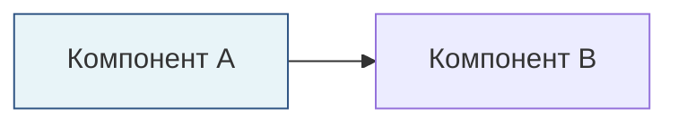

# Инструкции GitHub Copilot для проекта Rob Box

## 🎯 Обзор проекта

**Rob Box (РОББОКС)** — это проект автономного колёсного ровера, построенного на ROS 2 Humble с использованием двух компьютеров Raspberry Pi 4. Робот оснащён возможностями SLAM, голосового взаимодействия, LED-дисплеев и интеграции датчиков для задач доставки в помещениях.

### Ключевые технологии
- **ROS 2 Humble Hawksbill** — фреймворк Robot Operating System
- **Zenoh DDS** — оптимизированное промежуточное ПО для сетевого взаимодействия (rmw_zenoh_cpp)
- **RTAB-Map** — система SLAM с RGB-D + 2D LiDAR
- **Docker + Docker Compose** — контейнеризованная архитектура
- **Python 3.10+** — основной язык программирования
- **C++** — критичные по производительности компоненты

### Аппаратная архитектура
- **Main Pi** (10.1.1.10 eth0 / 10.1.1.20 wlan0) — RTAB-Map SLAM, навигация, управление VESC
- **Vision Pi** (10.1.1.11 eth0 / 10.1.1.21 wlan0) — камера OAK-D, LSLIDAR N10, AprilTag, микрофон ReSpeaker

---

## 📂 Структура проекта

```
rob_box_project/
├── .github/                    # GitHub Actions workflows и CI/CD
│   ├── workflows/              # Workflows сборки, тестирования, линтинга
│   └── copilot-instructions.md # Этот файл
├── docker/                     # Docker инфраструктура
│   ├── base/                   # Базовые образы (ros2-zenoh, rtabmap, depthai, pcl)
│   ├── main/                   # Сервисы Main Pi (rtabmap, nav2, zenoh-router)
│   └── vision/                 # Сервисы Vision Pi (oak-d, lslidar, apriltag, voice)
├── src/                        # ROS 2 пакеты (исходный код)
│   ├── rob_box_voice/          # Голосовой ассистент (STT, TTS, диалог, команды)
│   ├── rob_box_perception/     # Ноды восприятия (health monitor, context aggregator)
│   ├── rob_box_description/    # URDF модель робота
│   ├── rob_box_bringup/        # Launch файлы для полной системы
│   ├── rob_box_animations/     # Система LED анимаций
│   ├── led_matrix_driver/      # Драйвер LED матриц
│   └── vesc_nexus/             # Контроллер моторов VESC (git submodule)
├── docs/                       # Полная документация
│   ├── architecture/           # Дизайн системы, аппаратная и программная архитектура
│   ├── development/            # Руководства для разработчиков (AGENT_GUIDE.md критически важен!)
│   ├── guides/                 # Руководства пользователя (настройка, устранение неполадок)
│   └── packages/               # Документация по пакетам
└── scripts/                    # Утилитарные скрипты
```

---

## 🔑 Критически важные файлы для ознакомления перед внесением изменений

### 1. **AGENT_GUIDE.md** ⭐ ОБЯЗАТЕЛЬНО ПРОЧИТАТЬ ПЕРВЫМ
**Расположение:** `docs/development/AGENT_GUIDE.md`
**Назначение:** Полное руководство для AI агентов с примерами, архитектурой Docker, настройкой Zenoh, рабочими процессами развёртывания

**Прочитайте это перед:**
- Любыми изменениями Docker
- Модификацией конфигураций
- Добавлением новых сервисов
- Отладкой сетевых проблем

### 2. **DOCKER_STANDARDS.md** ⭐ ОБЯЗАТЕЛЬНО ДЛЯ РАБОТЫ С DOCKER
**Расположение:** `docs/development/DOCKER_STANDARDS.md`
**Назначение:** Организация файлов Docker, правила монтирования томов, критические антипаттерны

**Ключевые правила:**
- ❌ **НИКОГДА** не используйте `COPY config/` в Dockerfile — конфиги монтируются через volumes!
- ❌ **НИКОГДА** не используйте `COPY scripts/` в Dockerfile — скрипты монтируются через volumes!
- ✅ **ТОЛЬКО** используйте Dockerfile для `RUN apt-get install`, `RUN git clone`, `RUN colcon build`
- Все сервисы используют `network_mode: host` и зависят от `zenoh-router`

### 3. **PYTHON_STYLE_GUIDE.md**
**Расположение:** `docs/development/PYTHON_STYLE_GUIDE.md`
**Назначение:** Стандарты кодирования Python, соглашения об именовании, паттерны ROS 2

**Стандарты:**
- Используйте `black` (длина строки 120) для форматирования
- Используйте `isort` для сортировки импортов
- Используйте `flake8` для линтинга
- Аннотации типов обязательны для публичных API
- Docstrings следуют стилю Google

### 4. **CI_CD_PIPELINE.md**
**Расположение:** `docs/CI_CD_PIPELINE.md`
**Назначение:** GitHub Actions workflows, автоматические сборки Docker, стратегии слияния

**Рабочий процесс:**
- `feature/*` → авто-слияние в `develop` (сборка изменённых сервисов)
- `develop` → авто-слияние в `main` (сборка ВСЕХ сервисов)
- Docker образы с тегами `*-humble-latest` (main), `*-humble-dev` (develop)

---

## 🐳 Правила разработки Docker

### Лучшие практики Dockerfile

```dockerfile
# ✅ ХОРОШО - Установка пакетов в Dockerfile
FROM rob_box_base:ros2-zenoh
RUN apt-get update && apt-get install -y \
    ros-humble-nav2-msgs \
    ros-humble-sensor-msgs \
    && rm -rf /var/lib/apt/lists/*

# ✅ ХОРОШО - Сборка ROS пакетов
WORKDIR /workspace
COPY src/rob_box_voice ./src/rob_box_voice
RUN . /opt/ros/humble/setup.sh && \
    colcon build --packages-select rob_box_voice

# ❌ ПЛОХО - НЕ копируйте конфиги (они монтируются через volumes!)
COPY config/ /config/  # НЕПРАВИЛЬНО! Требует пересборки при изменении конфига
```

### Паттерны docker-compose.yaml

```yaml
services:
  my_service:
    image: ghcr.io/krikz/rob_box:my-service-humble-latest
    container_name: my_service
    network_mode: host  # ✅ ВСЕГДА используйте host сеть
    environment:
      - ROS_DOMAIN_ID=0
      - RMW_IMPLEMENTATION=rmw_zenoh_cpp  # ✅ ВСЕГДА используйте Zenoh
      - ZENOH_CONFIG=/config/zenoh_session_config.json5
      - LD_LIBRARY_PATH=/opt/ros/humble/opt/zenoh_cpp_vendor/lib:/opt/ros/humble/lib
    volumes:
      - ./config:/config:ro  # ✅ Монтировать директорию config
      - ./scripts:/scripts:ro  # ✅ Монтировать директорию scripts
    depends_on:
      - zenoh-router  # ✅ ВСЕГДА зависит от zenoh-router
    restart: unless-stopped
```

### Организация файлов

```
docker/vision/
├── docker-compose.yaml           # Оркестрация сервисов
├── config/                       # ✅ Все конфиги здесь (монтируются, не копируются)
│   ├── zenoh_router_config.json5
│   ├── zenoh_session_config.json5
│   └── oak-d/                    # Конфиги специфичные для сервиса
│       └── camera_params.yaml
├── scripts/                      # ✅ Все скрипты здесь (монтируются, не копируются)
│   ├── update_and_restart.sh     # Утилитарные скрипты
│   └── oak-d/                    # Скрипты специфичные для сервиса
│       └── start_oak_d.sh
└── oak-d/                        # ✅ ТОЛЬКО Dockerfile (без конфигов/скриптов)
    └── Dockerfile
```

---

## 🐍 Стандарты кодирования Python

### Шаблон структуры файла

```python
#!/usr/bin/env python3
"""
Docstring модуля: Краткое описание того, что делает этот модуль.

Подробное объяснение функциональности, паттернов использования и примеров.
"""

# Импорты стандартной библиотеки
import os
import sys
from typing import List, Optional

# Импорты сторонних библиотек
import rclpy
from rclpy.node import Node
from std_msgs.msg import String

# Локальные импорты
from rob_box_voice.utils import audio_utils


class MyNode(Node):
    """
    Краткое описание класса.
    
    Подробное объяснение назначения, функциональности и поведения ноды.
    
    Атрибуты:
        sample_rate (int): Частота дискретизации аудио в Гц
        publisher: ROS 2 publisher для сообщений
    
    Пример:
        >>> node = MyNode()
        >>> rclpy.spin(node)
    """
    
    def __init__(self) -> None:
        """Инициализация ноды с параметрами и publishers."""
        super().__init__('my_node')
        
        # Объявление параметров
        self.declare_parameter('sample_rate', 16000)
        self.sample_rate = self.get_parameter('sample_rate').value
        
        # Создание publishers
        self.publisher = self.create_publisher(String, '/topic', 10)
        
        self.get_logger().info('Нода инициализирована')
    
    def process_data(self, data: bytes) -> str:
        """
        Обработка входных данных и возврат результата.
        
        Args:
            data: Сырые байты для обработки
            
        Returns:
            Обработанная строка результата
            
        Raises:
            ValueError: Если data пустые
        """
        if not data:
            raise ValueError("Данные не могут быть пустыми")
        return data.decode('utf-8')


def main(args=None):
    """Главная точка входа."""
    rclpy.init(args=args)
    node = MyNode()
    
    try:
        rclpy.spin(node)
    except KeyboardInterrupt:
        pass
    finally:
        node.destroy_node()
        rclpy.shutdown()


if __name__ == '__main__':
    main()
```

### Соглашения об именовании

- **Переменные/функции:** `snake_case` (например, `sample_rate`, `process_audio()`)
- **Классы:** `PascalCase` (например, `AudioNode`, `ReSpeakerInterface`)
- **Константы:** `SCREAMING_SNAKE_CASE` (например, `MAX_BUFFER_SIZE`, `DEFAULT_RATE`)
- **Имена нод ROS 2:** `snake_case` (например, `'audio_node'`, `'dialogue_node'`)
- **Приватные атрибуты:** `_protected_var`, `__private_var`

### Логирование (НЕ используйте print())

```python
# ✅ ХОРОШО - Используйте ROS 2 logger
self.get_logger().debug('Детальная отладочная информация')
self.get_logger().info('Сообщение о нормальной работе')
self.get_logger().warn('Предупреждение о потенциальной проблеме')
self.get_logger().error('Произошла ошибка, но восстановимая')
self.get_logger().fatal('Критическая ошибка, невозможно продолжить')

# ❌ ПЛОХО - Не используйте print()
print('Это сообщение')  # НИКОГДА не делайте это в ROS нодах!
```

---

## 🤖 Специфичные паттерны ROS 2

### Объявление параметров

```python
# ✅ ХОРОШО - Объявите со значениями по умолчанию, затем получите значения
self.declare_parameter('sample_rate', 16000)
self.declare_parameter('device_name', 'default_device')
self.sample_rate = self.get_parameter('sample_rate').value
self.device_name = self.get_parameter('device_name').value

# Добавить callback параметров для динамической реконфигурации
self.add_on_set_parameters_callback(self.parameters_callback)
```

### Соглашение об именовании топиков

```python
# Именование топиков ROS 2 следует паттерну: /<namespace>/<topic_name>
# ✅ ХОРОШО - Ясное, иерархическое именование
'/audio/audio'              # Сырые аудио данные
'/audio/vad'                # Voice Activity Detection
'/audio/speech_detected'    # Событие обнаружения речи
'/dialogue/text'            # Текстовый вывод диалога
'/led/animation'            # Команды LED анимации

# ❌ ПЛОХО - Неясное или плоское именование
'/audio'                    # Слишком общее
'/my_topic'                 # Не описательное
'/AudioData'                # Неправильный регистр
```

### Quality of Service (QoS)

```python
from rclpy.qos import QoSProfile, ReliabilityPolicy, DurabilityPolicy

# Для данных датчиков реального времени (можно потерять старые сообщения)
sensor_qos = QoSProfile(
    reliability=ReliabilityPolicy.BEST_EFFORT,
    durability=DurabilityPolicy.VOLATILE,
    depth=10
)

# Для важных событий (не должны терять сообщения)
event_qos = QoSProfile(
    reliability=ReliabilityPolicy.RELIABLE,
    durability=DurabilityPolicy.TRANSIENT_LOCAL,
    depth=10
)
```

---

## 🌐 Сеть и Zenoh

### Соглашение об IP-адресах

- **Ethernet (eth0):** Используется для передачи данных между Pi
  - Main Pi: `10.1.1.10`
  - Vision Pi: `10.1.1.11`
- **WiFi (wlan0):** Используется для SSH доступа и управления
  - Main Pi: `10.1.1.20`
  - Vision Pi: `10.1.1.21`

### Конфигурация Zenoh

Все ноды ROS 2 используют промежуточное ПО Zenoh с этими переменными окружения:

```yaml
environment:
  - RMW_IMPLEMENTATION=rmw_zenoh_cpp
  - ZENOH_CONFIG=/config/zenoh_session_config.json5
  - ROS_AUTOMATIC_DISCOVERY_RANGE=LOCALHOST
  - ZENOH_ROUTER_CHECK_ATTEMPTS=10
  - LD_LIBRARY_PATH=/opt/ros/humble/opt/zenoh_cpp_vendor/lib:/opt/ros/humble/lib
```

**Важно:** Всегда используйте Ethernet IP (10.1.1.10, 10.1.1.11) в конфигурациях Zenoh роутера, НЕ WiFi IP!

---

## 📊 Система мониторинга

### Обзор

Rob Box использует легковесный стек мониторинга для наблюдения за состоянием системы и логами:

- **Grafana** (порт 3000) — веб-дашборд для визуализации
- **Prometheus** (порт 9090) — сбор метрик
- **Loki** (порт 3100) — агрегация логов
- **cAdvisor** (порт 8080) — метрики контейнеров на обоих Pi
- **Promtail** (порт 9080) — пересылка логов

### Быстрый старт

```bash
# Включить мониторинг
cd ~/rob_box_project/docker/main && ./scripts/enable_monitoring.sh
cd ~/rob_box_project/docker/vision && ./scripts/enable_monitoring.sh

# Доступ к Grafana
http://10.1.1.10:3000  (admin/robbox)

# Отключить мониторинг
cd ~/rob_box_project/docker/main && ./scripts/disable_monitoring.sh
cd ~/rob_box_project/docker/vision && ./scripts/disable_monitoring.sh
```

### Использование ресурсов

- **Main Pi:** ~320МБ RAM (простой), ~570МБ RAM (активность)
- **Vision Pi:** ~70МБ RAM (простой), ~120МБ RAM (активность)

### Когда использовать мониторинг

**Включать когда:**
- ✅ Отладка проблем производительности
- ✅ Нагрузочное тестирование
- ✅ Настройка новых функций
- ✅ Удалённая работа робота

**Отключать когда:**
- ✅ Автономная работа (экономия ресурсов)
- ✅ Нужна максимальная производительность
- ✅ Необходима экономия батареи

### Документация

- [Руководство по системе мониторинга](../docs/guides/MONITORING_SYSTEM.md) — полная документация
- [Краткий справочник](../docs/MONITORING_QUICK_REF.md) — справочник команд

---

## 🔐 Безопасность и управление секретами

### API ключи и учётные данные

**КРИТИЧНО:** Никогда не коммитьте API ключи или секреты в git!

```bash
# ✅ ХОРОШО - Используйте файл .env.secrets (в gitignore)
docker/vision/.env.secrets:
  DEEPSEEK_API_KEY=ваш_ключ_здесь
  YANDEX_API_KEY=ваш_ключ_здесь
  YANDEX_FOLDER_ID=ваша_папка_здесь

# В docker-compose.yaml
services:
  voice-assistant:
    env_file:
      - .env.secrets  # Загрузка секретов из файла

# ❌ ПЛОХО - Захардкоженные секреты
environment:
  - DEEPSEEK_API_KEY=sk-1234567890abcdef  # НИКОГДА НЕ ДЕЛАЙТЕ ТАК!
```

### Записи .gitignore

Убедитесь, что эти записи есть в `.gitignore`:
```
.env.secrets
*.env.local
*_secrets.yaml
```

---

## 🧪 Тестирование и обеспечение качества

### Pre-commit хуки

Проект использует pre-commit хуки для автоматических проверок качества:

```bash
# Установить один раз
pip install pre-commit
pre-commit install

# Запустить все проверки вручную
pre-commit run --all-files
```

### Инструменты линтинга

```bash
# Форматирование Python кода (автоматическое)
black src/rob_box_voice/ --line-length=120

# Сортировка импортов (автоматическая)
isort src/rob_box_voice/ --profile black

# Проверка качества кода
flake8 src/rob_box_voice/ --max-line-length=120

# Проверка YAML файлов
yamllint -c .yamllint.yml docker/
```

### Запуск тестов

```bash
# Тесты ROS 2 пакетов
cd /workspace
colcon test --packages-select rob_box_voice
colcon test-result --verbose

# Модульные тесты Python (если используется pytest)
pytest src/rob_box_voice/test/
```

---

## 🚀 Рабочий процесс разработки

### Добавление новой функции

1. **Создать feature ветку из develop:**
   ```bash
   git checkout develop
   git pull origin develop
   git checkout -b feature/my-awesome-feature
   ```

2. **Внести изменения, следуя стандартам:**
   - Прочитать соответствующую документацию (AGENT_GUIDE.md, DOCKER_STANDARDS.md)
   - Следовать руководству по стилю Python
   - Обновить документацию при необходимости
   - Добавить тесты для новой функциональности

3. **Тестировать локально:**
   ```bash
   # Собрать Docker образ (если нужно)
   cd docker/vision/oak-d
   docker build -t test:local .
   
   # Запустить линтеры
   black --check src/
   flake8 src/
   yamllint docker/
   ```

4. **Закоммитить и запушить:**
   ```bash
   git add .
   git commit -m "feat: add awesome feature for navigation"
   git push origin feature/my-awesome-feature
   ```

5. **GitHub Actions автоматически:**
   - Собирает изменённые сервисы
   - Запускает линтеры и тесты
   - Создаёт Docker образы с тегом `*-humble-test`
   - Авто-сливается в `develop` при успехе

### Соглашение о сообщениях коммитов

Используйте [Conventional Commits](https://www.conventionalcommits.org/):

```
<type>(<scope>): <subject>

<body>

<footer>
```

**Типы:**
- `feat`: Новая функция
- `fix`: Исправление ошибки
- `docs`: Только документация
- `style`: Стиль кода (форматирование, без изменения логики)
- `refactor`: Рефакторинг кода
- `perf`: Улучшение производительности
- `test`: Добавление тестов
- `chore`: Обслуживание (зависимости, CI/CD)

**Примеры:**
```
feat(voice): add command node for navigation integration

Реализует command_node.py для обработки навигационных команд
из системы диалогов. Публикует в /cmd_vel для движения робота.

Closes #42

---

fix(docker): add missing nav2-msgs dependency to voice-assistant

Command_node голосового ассистента требует пакет nav2_msgs.
Добавлено в apt-get install в Dockerfile.

---

docs(readme): update hardware specifications

Добавлены детали ReSpeaker Mic Array v2.0 и ESP32 sensor hub.
```

---

## 🔍 Отладка и устранение неполадок

### Доступ к Raspberry Pi через SSH

**ВАЖНО:** Всегда используйте `sshpass` для автоматизированных SSH команд (пароль 'open'):

```bash
# Vision Pi
sshpass -p 'open' ssh ros2@10.1.1.21

# Main Pi
sshpass -p 'open' ssh ros2@10.1.20

# Выполнить удалённую команду без интерактивного входа
sshpass -p 'open' ssh ros2@10.1.1.21 'docker ps'
```

### Отладка Docker контейнеров

```bash
# Проверить статус контейнера
docker ps

# Просмотреть логи
docker logs oak-d --tail 100

# Следить за логами в реальном времени
docker logs -f rtabmap

# Выполнить команду внутри контейнера
docker exec -it oak-d bash

# Проверить топики ROS 2 внутри контейнера
docker exec oak-d ros2 topic list
docker exec oak-d ros2 topic echo /camera/rgb/image_raw
```

### Скрипты мониторинга

```bash
# Vision Pi - Общий системный мониторинг
cd ~/rob_box_project/docker
./monitor_system.sh

# Vision Pi - Мониторинг камеры в реальном времени
cd ~/rob_box_project/docker/vision
./realtime_monitor.sh

# Vision Pi - Диагностика камеры
cd ~/rob_box_project/docker/vision
./diagnose.sh

# Локальная машина - Полная диагностика потока данных
cd /path/to/rob_box_project/docker
wsl bash ./diagnose_data_flow.sh
```

### Распространённые проблемы и решения

**Проблема:** "Did not receive data since 5 seconds" в RTAB-Map
**Решение:** Запустите `diagnose_data_flow.sh` для проверки коммуникации Vision Pi → Main Pi

**Проблема:** Пересборка Docker образа занимает 5-10 минут после изменения конфига
**Решение:** Конфиги должны быть в `docker/*/config/` и монтироваться через volumes, НЕ копироваться в Dockerfile

**Проблема:** ModuleNotFoundError для ROS пакета
**Решение:** Добавьте отсутствующий пакет в Dockerfile: `RUN apt-get install -y ros-humble-<имя-пакета>`

**Проблема:** Проблемы подключения Zenoh
**Решение:** Проверьте, что все сервисы зависят от `zenoh-router` и используют правильную конфигурацию сессии

---

## 📝 Стандарты документации

### Когда обновлять документацию

Обновляйте документацию когда вы:
- Добавляете новые функции или сервисы
- Изменяете архитектуру Docker
- Модифицируете конфигурационные файлы
- Исправляете значительные ошибки
- Изменяете процедуры развёртывания

### Структура документации

```
docs/
├── architecture/          # Дизайн системы, спецификации железа
├── development/           # Руководства для разработчиков (здесь находятся AI руководства!)
├── guides/                # Руководства пользователя (настройка, эксплуатация)
├── packages/              # Документация по пакетам
└── reports/               # Отчёты об исследованиях, исправления
```

### Диаграммы и визуализация

**⭐ КРИТИЧНО: Всегда используйте Mermaid для диаграмм!**

- ✅ **ИСПОЛЬЗУЙТЕ Mermaid** для всех архитектурных диаграмм, flowcharts, sequence diagrams
- ❌ **НЕ ИСПОЛЬЗУЙТЕ ASCII-арт** для новых диаграмм (┌─┐│└┘├┤)
- ✅ **SVG output** - GitHub автоматически рендерит Mermaid в SVG
- ✅ **Единая цветовая схема** - см. `docs/MERMAID_DIAGRAMS.md`

**Примеры:**


**Полное руководство:** [docs/MERMAID_DIAGRAMS.md](../docs/MERMAID_DIAGRAMS.md)

### Написание хорошей документации

**ДЕЛАЙТЕ:**
- Используйте чёткий, лаконичный язык
- Включайте примеры кода
- Добавляйте примеры командной строки с ожидаемым выводом
- Используйте эмодзи для визуальной иерархии (⭐ ✅ ❌ 🔧 📝)
- **Используйте Mermaid для диаграмм** (не ASCII-арт)
- Ссылайтесь на связанную документацию

**НЕ ДЕЛАЙТЕ:**
- Писать стены текста без примеров
- Использовать расплывчатый язык ("может работать", "вероятно")
- Пропускать случаи ошибок и граничные условия
- Забывать обновлять README.md при значительных изменениях
- **Использовать ASCII-арт для диаграмм** (используйте Mermaid)

---

## 🎯 Краткий справочник по распространённым задачам

### Развернуть обновлённый код на Raspberry Pi

```bash
# Vision Pi
sshpass -p 'open' ssh ros2@10.1.1.21 \
  'cd ~/rob_box_project/docker/vision && ./update_and_restart.sh'

# Main Pi
sshpass -p 'open' ssh ros2@10.1.1.20 \
  'cd ~/rob_box_project/docker/main && ./update_and_restart.sh'
```

### Добавить новый пакет ROS 2

```bash
# 1. Создать структуру пакета
cd src/
ros2 pkg create --build-type ament_python my_package \
  --dependencies rclpy std_msgs

# 2. Добавить в Dockerfile
RUN apt-get install -y ros-humble-my-dependency

# 3. Собрать в Dockerfile
COPY src/my_package ./src/my_package
RUN . /opt/ros/humble/setup.sh && \
    colcon build --packages-select my_package

# 4. Добавить в docker-compose.yaml с правильными volumes
```

### Добавить новый Docker сервис

Следуйте рабочему процессу в `DOCKER_STANDARDS.md` раздел "Workflow для добавления нового сервиса"

---

## 🔗 Ссылки на связанную документацию

**Критические материалы:**
- [AGENT_GUIDE.md](../docs/development/AGENT_GUIDE.md) — полное руководство для AI агентов
- [DOCKER_STANDARDS.md](../docs/development/DOCKER_STANDARDS.md) — правила организации Docker
- [PYTHON_STYLE_GUIDE.md](../docs/development/PYTHON_STYLE_GUIDE.md) — стандарты кодирования Python

**Архитектура:**
- [SYSTEM_OVERVIEW.md](../docs/architecture/SYSTEM_OVERVIEW.md) — полная архитектура системы
- [HARDWARE.md](../docs/architecture/HARDWARE.md) — спецификации оборудования
- [SOFTWARE.md](../docs/architecture/SOFTWARE.md) — детали программного стека

**Разработка:**
- [BUILD_OPTIMIZATION.md](../docs/development/BUILD_OPTIMIZATION.md) — оптимизация сборки Docker
- [LINTING_GUIDE.md](../docs/development/LINTING_GUIDE.md) — настройка и использование линтинга
- [TESTING_GUIDE.md](../docs/development/TESTING_GUIDE.md) — лучшие практики тестирования

**Эксплуатация:**
- [CI_CD_PIPELINE.md](../docs/CI_CD_PIPELINE.md) — GitHub Actions workflows
- [TROUBLESHOOTING.md](../docs/guides/TROUBLESHOOTING.md) — распространённые проблемы и решения

---

## 💡 Советы для эффективной помощи AI

### Перед написанием кода

1. **Прочитайте AGENT_GUIDE.md** — он содержит критический контекст проекта
2. **Проверьте существующие паттерны** — посмотрите на похожие файлы в кодовой базе
3. **Просмотрите последние коммиты** — поймите недавние изменения: `git log -10 --oneline`
4. **Проверьте документацию** — особенно для Docker и стандартов Python

### При предложении изменений

1. **Будьте конкретны** — ссылайтесь на точные пути файлов и номера строк
2. **Показывайте примеры** — включайте фрагменты кода до/после
3. **Объясняйте почему** — не только что изменить, но и почему это лучше
4. **Учитывайте влияние** — потребуется ли пересборка Docker? Изменения конфигов?

### Обработка ошибок

1. **Цитируйте точные ошибки** — копируйте полные сообщения об ошибках со стек-трейсами
2. **Предоставляйте контекст** — что вы пытались сделать? Какой Pi? Какой контейнер?
3. **Показывайте что пробовали** — перечислите уже предпринятые шаги отладки
4. **Сначала проверьте логи** — `docker logs <контейнер>` часто раскрывает проблему

### Предложения по тестированию

1. **Сначала тестируйте локально** — не полагайтесь на CI/CD для базового тестирования
2. **Проверяйте все затронутые системы** — изменения могут влиять на оба Pi
3. **Проверяйте инструментами мониторинга** — используйте предоставленные скрипты для валидации
4. **Следите за использованием ресурсов** — мониторьте CPU, память, сеть на Raspberry Pi

---

## 📚 Глоссарий специфичных для проекта терминов

**Термины, которые вы встретите:**

- **Vision Pi / Main Pi** — два компьютера Raspberry Pi 4 в роботе
- **Zenoh** — Zero Overhead Network Protocol — оптимизированное DDS промежуточное ПО
- **RTAB-Map** — Real-Time Appearance-Based Mapping — система SLAM
- **OAK-D** — OpenCV AI Kit with Depth — стерео камера от Luxonis
- **LSLIDAR N10** — 2D LiDAR сканер для картографии
- **ReSpeaker** — USB массив микрофонов для голосового ассистента
- **VESC** — Vedder Electronic Speed Controller — контроллеры моторов
- **AprilTag** — система маркеров для локализации
- **VAD** — Voice Activity Detection — обнаружение голосовой активности
- **DoA** — Direction of Arrival — направление источника звука
- **STT** — Speech-to-Text — преобразование речи в текст
- **TTS** — Text-to-Speech — преобразование текста в речь
- **QoS** — Quality of Service — надёжность коммуникации ROS 2

---

**Последнее обновление:** Октябрь 2025
**Поддерживается:** Командой проекта Rob Box
**По вопросам:** См. существующие Issues или создайте новый в GitHub
