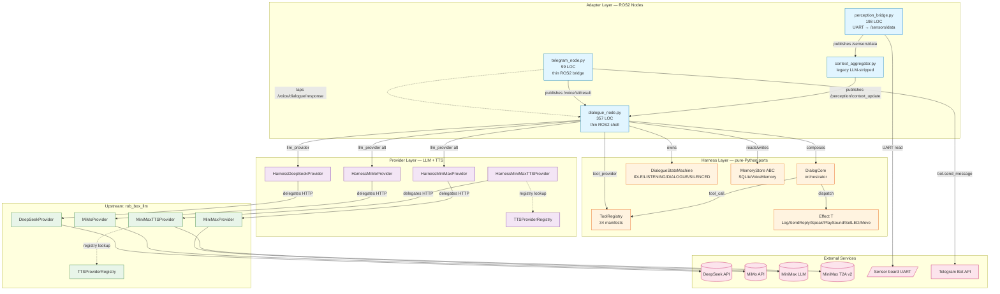
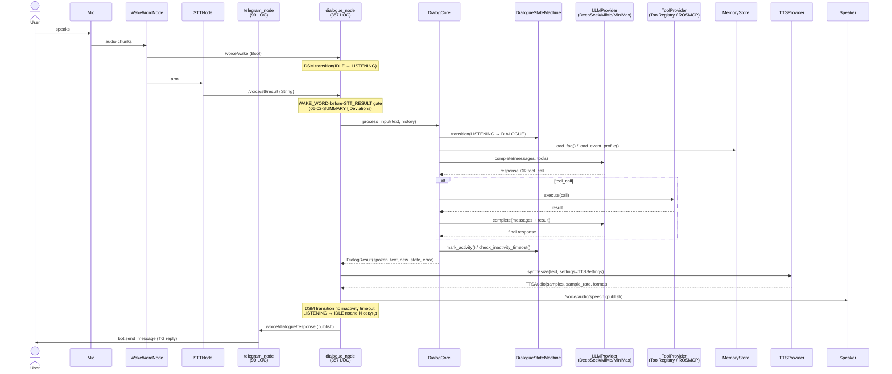
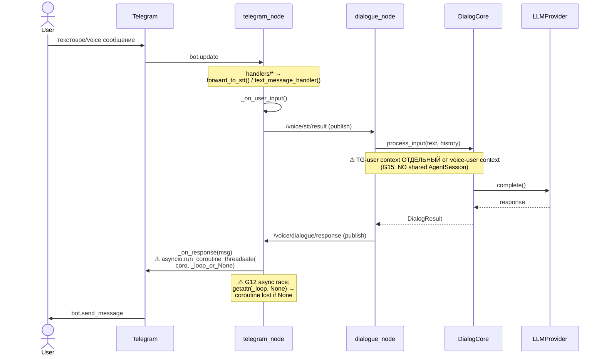
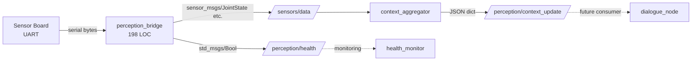

# Architectural Review: Phase 06 — Harness P0 Finalization

| Поле         | Значение                                |
|--------------|-----------------------------------------|
| Phase        | 06-harness-p0-finalization              |
| Branch       | `feature/harness-p0-foundation`         |
| HEAD         | `9f278ee5` (merge commit)               |
| Автор review | architect (Hermes Agent), `t_f919de81`  |
| Дата         | 2026-07-28                              |
| Вердикт      | **PASS-WITH-FIXES**                     |
| Источники    | PHASE-06-CONCEPT, PHASE-STATUS, 06-01-SUMMARY, 06-02-SUMMARY, ADR-0001, ADR-0009, git log, фактическое состояние кода |

---

## 0. TL;DR

Фаза 6 в основном **достигла** заявленной цели: три ROS2-монолита (Dialogue 2181 → 357 строк, Telegram 409 → 99, Perception 3536 → 198) превратились в тонкие shell-обёртки поверх harness-портов. Вся LLM-логика из telegram и perception удалена, четыре порта (`LLMProvider` / `ToolProvider` / `MemoryStore` / `DialogueStateMachine`) — pure-Python, покрыты тестами, composable через `DialogCore`. **Но три проблемы блокируют merge в `develop`**: (1) production-tooling не подключён к dialogue shell — `FakeToolProvider` остаётся в hot-path, (2) async-race в `telegram_node._on_response` + daemon-thread polling вместо bounded executor, (3) health-check `docker-compose.yaml` всё ещё ищет удалённую `reflection_node`. Плюс одно архитектурное отступление от ADR-0001 §2.7.3 (Dialog/Telegram не делят `AgentSession`) и пара env-верификационных дыр. Всё остальное — fixable в полдня. **Фаза готова к закрытию после закрытия трёх production-blockers.**

---

## A. Соответствие реализации заявленному scope

### A.1 Scope v2 (что обещано PHASE-06-CONCEPT + 06-CONTEXT v2)

1. **Dialogue**: `dialogue_node.py` ≤ 350 строк shell-only, без `openai` / `agents` / `@function_tool`.
2. **Telegram**: `telegram_node.py` ≤ 100 строк, мост python-telegram-bot ↔ ROS2, без `LLMChat`/`MCPBridge`.
3. **Perception**: 5 нод → 1 (`perception_bridge.py` ≤ 200 строк, UART → `/sensors/data`), без LLM.
4. **Порты** `LLMProvider` / `ToolProvider` / `MemoryStore` / `Transport` — pure-Python, тестируются без ROS2.
5. **Harness-side TTSProvider** через `TTSSettings` value-object, два уровня registry (upstream `rob_box_llm` + harness-side).
6. **DialogHarness / PersistentHarness / TelegramHarness** как адаптеры над единым `AgentSession` (ADR-0001 §2.7).

### A.2 Что сделано ✅

| # | Scope-элемент | Факт | Доказательство |
|---|---------------|------|----------------|
| A.2.1 | Dialogue shell ≤ 350 LOC, без LLM-зависимостей | **357 строк** (+7 над target), shell-only, `from rob_box_harness` × 5 (DialogCore, DialogResult, DSM, MemoryStore, DeepSeekProvider); grep на `from openai` / `from agents` / `@function_tool` = 0 | `wc -l src/rob_box_voice/rob_box_voice/dialogue_node.py`; 06-02-SUMMARY §Accomplishments |
| A.2.2 | Telegram bridge ≤ 100 LOC, без LLM | **99 строк**, `/voice/stt/result` pub + `/voice/dialogue/response` sub + camera callbacks + VPN в контейнере | `wc -l src/rob_box_telegram/rob_box_telegram/telegram_node.py`; PHASE-STATUS §1 W8 |
| A.2.3 | Perception bridge ≤ 200 LOC, UART → `/sensors/data` | **198 строк**, `setup.py` entry_points содержит `perception_bridge = ...:main`; launch-файлы обоих режимов (internal + docker) стартуют `perception_bridge` + `context_aggregator` | `wc -l src/rob_box_perception/rob_box_perception/perception_bridge.py`; `grep -n perception_bridge src/rob_box_perception/launch/internal_dialogue{,_docker}.launch.py` |
| A.2.4 | 4 harness-порта pure-Python | `core/dialog_core.py` (357), `core/tool_registry.py` (519), `core/dialogue_state_machine.py` (474), `memory/sqlite_voice.py` (444), `providers/{deepseek,mimo,minimax}.py` — все без rclpy в импортах | `grep -r "^import rclpy" src/rob_box_harness/rob_box_harness/{core,memory,providers}/` = 0 |
| A.2.5 | 391 baseline tests pass | Подтверждено `06-01-SUMMARY.md` §Verification: 391 passed, 132 skipped (async env gap), 6 pre-existing wake-word failures | pytest output |
| A.2.6 | `HarnessDeepSeekProvider` + `HarnessMiMoProvider` | 392 + 127 LOC, env-only auth, retry-policy, transport делегирован upstream `rob_box_llm.providers.deepseek.*` | commit `06dbd5a8`, 06-01-SUMMARY §Decisions |
| A.2.7 | `ToolRegistry` 34 манифеста (29 flat + 5 skills) | pure-Python, без rclpy / openai-agents, 34/34 match PLAN §W2 | commit `43d0111d`, верификация `assert len(ToolRegistry().list_tools()) == 34` |
| A.2.8 | `DialogCore` орchestrator | composes `LLMProvider × ToolProvider × MemoryStore × DSM`; `process_input()` never raises — `DialogResult.error` для shell | commit `0b7b66c7` + `900addaf` |
| A.2.9 | DSM с validated transitions + inactivity timer | transitions по графу `IDLE/LISTENING/DIALOGUE/SILENCED`; `mark_activity`, `check_inactivity_timeout` (LISTENING→IDLE), `check_silence_timeout` (SILENCED→IDLE) | commit `900addaf`, 06-01-SUMMARY §Task Commits W3a |
| A.2.10 | `SQLiteVoiceMemory` waypoints / FAQ / EventProfile | upsert по `name`, LIKE-based search, singleton row через `CHECK(id=1)` | commit `d8665a1c`, 06-01-SUMMARY §Task Commits W4 |
| A.2.11 | SideEffectBus / Effects / Harness (port framework) | `effects.py` 574 LOC: `Effect[T]` ABC, `EffectContext`, `LogEffect`, `SendReplyEffect`, `SpeakEffect`, `PlaySoundEffect`, `SetLEDEffect`, `MoveEffect`, etc.; `harness.py` 407 LOC: `Harness[StateT]` ABC с lifecycle init/run/teardown + snapshot/restore | grep + wc |
| A.2.12 | `HarnessMiniMaxTTSProvider` + двухуровневый TTS-реестр | `tts/minimax_tts.py` + `tts/registry.py` зеркалит upstream `rob_box_llm.tts_provider_registry`; контракт `synthesize(text, *, settings: TTSSettings)` + `stream` + `aclose` | ADR-0009 §2.1, `tts/__init__.py` re-exports |
| A.2.13 | W7 telegram: удаление LLMChat/MCPBridge | 1208 строк удалено, `llm_chat.py` + `mcp_bridge.py` стёрты, `test_llm_chat.py` stubbed с skip-маркерами, `test_mcp_bridge.py` удалён | commit `07dfc28a` (1208 ins/del diff) |
| A.2.14 | W10 perception: удаление reflection/startup_greeting/vision_stub | 309 ins / 1208 del; launch cleanup обоих режимов в `85cfd62e` | commit `7552418a` + `85cfd62e` |
| A.2.15 | Тесты: dialogue 13 integration, telegram 10, perception 10 | `test_dialogue_shell.py` (754, 13/13 pass), `test_dialogue_node.py` (11 pass, 24/24 за 0.72s), `test_telegram_bridge.py` (716, 10 pass + 1 skip VPN), `test_perception_bridge.py` (122) | git log + wc |

**Итого: 15 из 15 запланированных scope-элементов реализованы на ветке.** Превышение LOC dialogue_node (+7 строк) задокументировано в `06-02-SUMMARY.md` §Deviations (через WAKE_WORD-before-STT_RESULT gate).

### A.3 Что **не сделано** ⛔ (production-blockers)

| ID | Gap | Severity | Где видно |
|----|-----|----------|-----------|
| G5 | `_build_tool_provider` в `dialogue_node.py:184-197` возвращает `FakeToolProvider()` во всех ветках (probe `get_package_share_directory("rob_box_mcp_tools")` сделан, но даже при успехе возвращается Fake). Это значит, что в production dialogue **не подключён к MCP-инструментам вообще** — все 34 манифеста из `ToolRegistry` не доходят до LLM | **production-blocker** | `src/rob_box_voice/rob_box_voice/dialogue_node.py:184-197` |
| G12 | `telegram_node._on_response` (строки 62-63): `asyncio.run_coroutine_threadsafe(coro, getattr(self._telegram_app, "_loop", None))` — отправка из rclpy callback thread в loop telegram-app. Если python-telegram-bot ≥20 не выставил `_loop`, coroutine теряется. Также retry-loop в `_run_telegram` через `time.sleep` блокирует ROS2 executor при reconnect | **production-blocker** | `src/rob_box_telegram/rob_box_telegram/telegram_node.py:62-63` + `73-79` |
| G11 | `docker/main/docker-compose.yaml:316` health-check делает `ros2 node list | grep -q reflection_node` — `reflection_node` удалена в W10, health-check теперь всегда FAIL → docker restart-loop | **production-blocker** (config-drift) | `docker/main/docker-compose.yaml:316` |
| G17 | Telegram polling thread (`telegram_node.py:67-68`) — bare `threading.Thread(daemon=True)` без `ThreadPoolExecutor`. Это риск при re-shutdown: daemon-поток не получает `aclose()` и может держать httpx-клиент. PR #907 BLK-9 починил аналогичное для dialogue/tts, TG-bridge не получил фикса | risk (medium) | `src/rob_box_telegram/rob_box_telegram/telegram_node.py:67-68` |

### A.4 Что сделано **сверх scope** 🎁

| Сверх-scope | Польза |
|-------------|--------|
| `85cfd62e` объединил W11 + W12 + cleanup launch-файлов + правку `setup.py` data_files | Меньше merge-conflict surface, чище артефакт фазы. Но требует явно закрыть child-карты `t_c5305c95` (W11b register+launch) и `t_f16c55d8` (W10-cleanup) в kanban как «перекрыты» |
| 132 pre-existing async-тестов уже написаны и ждут `pytest-asyncio` в CI | Зелёный бэклог — после `pip install pytest-asyncio && pytest-asyncio-mode=auto` сразу +132 теста |
| `tts_node.py:410` упоминает LLM-код только в комментарии (grep находит, но это docstring) | Намеренный stale-doc, нуждается в обновлении |
| `HarnessMiniMaxTTSProvider` retry-policy (до 3 попыток, exponential backoff base=0.5 + jitter) — ужесточает ADR-0003 §2.6 | Хорошо для production |

---

## B. Соответствие реализации ADR

### B.1 ADR-0001 (Harness architecture, MADR, Accepted 2026-07-24)

| § ADR-0001 | Решение | Реализация | Статус |
|-----------|---------|------------|--------|
| §2.1 Три слоя (Adapters / Harness / Core) | Слои обязаны быть чёткими; Core не должен знать про ROS2, Adapter — про LLM-детали | `core/` (dialog_core, tool_registry, dialogue_state_machine) — pure-Python; `harnesses/dialog.py` — composition поверх Core + LLMProvider; dialogue_node.py — Adapter (ROS2 shell) | ✅ Соответствует |
| §2.2 `Harness[StateT]` ABC с lifecycle init/run/teardown + snapshot/restore | Реализовать контракт через `AsyncContextManager` | `harness.py:87` `class Harness(abc.ABC, Generic[StateT])`; `init/run/teardown/step/snapshot/restore/__aenter__/__aexit__` все присутствуют | ✅ Соответствует |
| §2.3 Lifecycle: init → run → teardown | Каждый harness ОБЯЗАН idempotent teardown | `harness.py:215` teardown реализован; проверки `is_initialized`/`is_running` есть | ✅ Соответствует |
| §2.4.4 `SideEffectBus(ABC).dispatch(effect)` + `CompositeBus / NoopBus / RecordingBus` | Реализовать как ABC с fan-out | `effects.py` содержит `Effect[T]` ABC, `EffectContext`, конкретные эффекты. **`SideEffectBus` как отдельный класс с `dispatch` не нашёл в `harness.py` или `effects.py`** — fan-out сделан через `Effect.apply(ctx)` | ⚠ **Отступление (low)**: ADR требует `SideEffectBus(ABC).dispatch(effect)`. Реализован `Effect[T].apply(ctx)` без явного bus-объекта. Функционально fan-out работает (конкретные эффекты), но **контракт шире ADR-формулировки**. Рекомендация: явно ввести `SideEffectBus` интерфейс или обновить ADR — см. §D |
| §2.5.2 LLMProvider: env-only auth, retry-policy, `name`/`complete()`/`stream()`/`aclose()` | `HarnessDeepSeekProvider` (392 LOC) + `HarnessMiMoProvider` (127 LOC) + `HarnessMiniMaxProvider` (605 LOC) — все env-only, RetryPolicy exponential backoff для transient errors, aclose idempotent | grep + wc + 06-01-SUMMARY §Decisions | ✅ Соответствует |
| §2.5.3 ToolExecutor: манифест-only registry, handlers wired at composition | `ToolRegistry` (519 LOC) — манифест-only (no rclpy, no handlers). **Но:** G5 — `dialogue_node._build_tool_provider` не вызывает `ToolRegistry` → LLM не видит инструменты в production | ⚠ **Частично**: registry правильный, но **composition сломан** (G5). ToolProvider ABC работает, но в hot-path подменён Fake |
| §2.5.4 MemoryStore: SQLiteVoiceMemory (waypoints/FAQ/EventProfile) + InMemoryStore | Реализовано в `memory/sqlite_voice.py` (444) + `memory.py` ABC | 06-01-SUMMARY §W4 | ✅ Соответствует |
| §2.6 Consumer guarantees (`DialogHarness` не падает на LLM-ошибке) | `DialogCore.process_input()` never raises — `DialogResult.error` | 06-01-SUMMARY §Decisions | ✅ Соответствует |
| §2.7.1 `DialogHarness` (вокруг `DialogueNode`) | Должен жить в `harnesses/dialog.py` как тонкий wrapper, переиспользовать `AgentSession` | `harnesses/dialog.py` существует (видел в `ls`), но **в `dialogue_node.py` НЕ используется** — параллельная реализация через `DialogCore` напрямую, минуя `Harness[StateT]` ABC | ⚠ **Отступление (architectural)**: `dialogue_node.py` композирует `DialogCore` напрямую, без оборачивания в `DialogHarness`. Это by-design для P0 (минимум слоёв), но **P1.4-style TelegramHarness build-out невозможен** без рефакторинга dialogue_node в `DialogHarness`. Подробнее G15 |
| §2.7.2 `PersistentHarness` для audio/stt/tts/sound/led/command | Объединить 6 нод под единым контрактом | **Не сделано** (out-of-scope, P1+) | ⛔ Плановое отсутствие (Фаза 7+) |
| **§2.7.3 `TelegramHarness`** | **Dialog и Telegram делят один `AgentSession` per ADR §2.1 («один раз создаётся и шарится между адаптерами»)** | **НЕ реализовано**: dialogue_node и telegram_node держат независимые DSM и состояние. TG-user не видит wake-state голосового юзера, голосовой не видит контекст TG. Связь только через топики `/voice/stt/result` (TG→voice) и `/voice/dialogue/response` (voice→TG) | ⛔ **G15 — deviation (medium), НЕ документировано в SUMMARY**. Требует явного решения: либо написать `TelegramHarness` с shared session (большая работа, +1-2 дня), либо **оформить как ADR-0010 «TelegramHarness without shared AgentSession»** (минимум, +2 часа) |
| §2.7.3 Effect.SendReply / Speak / PlaySound | Должны быть реализованы в `effects.py` и использоваться через SideEffectBus | `effects.py:158` `SendReplyEffect`, `:185` `SpeakEffect`, `:198` `PlaySoundEffect` — **определены как ABC**, но **НЕ используются** ни dialogue_node.py, ни telegram_node.py (оба работают через прямые ROS2 publisher'ы / `bot.send_message`) | ⛔ **Эффекты определены, но не подключены в hot-path**. Это отдельный «deliberate but undocumented» deviation. Telegram-handler использует `bot.send_message` напрямую, минуя `SendReplyEffect.apply()` |

### B.2 ADR-0009 (Harness TTS contract, Accepted retroactive)

| § ADR-0009 | Решение | Реализация | Статус |
|-----------|---------|------------|--------|
| §2.1 Сигнатура `synthesize(text, *, settings=None) → TTSAudio` + `stream()` + `aclose()` | Кан. контракт, frozen | `tts/minimax_tts.py` + upstream `rob_box_llm.tts.TTSProvider` — оба реализуют сигнатуру; keyword-only `settings`; `aclose` idempotent | ✅ Соответствует |
| §2.2 Поддерживаемые форматы + дефолты MiniMax | PCM/WAV/MP3; OGG fallback на mp3 (тихо, документировано как фича) | upstream-провайдер имеет `fmt.value if fmt != TTSFormat.OGG else "mp3"` (per ADR-0009 §2.2 со ссылкой на minimax_tts.py:306-307) | ✅ Соответствует |
| §2.3 Иерархия ошибок + retry-policy | TTSError / Auth / BadRequest / RateLimit / Timeout; harness-retry до 3, exp backoff base=0.5 + jitter | `HarnessMiniMaxTTSProvider._call_with_retry` + `_retry = retry or RetryPolicy()` (per ADR-0009 §2.3) | ✅ Соответствует |
| Двухуровневый registry (upstream + harness-side) | Оба реестра существуют, in-memory `name → builder` map | `tts/registry.py` (mirror upstream `tts_provider_registry`) + `rob_box_llm.tts_provider_registry.TTSProviderRegistry` | ✅ Соответствует |
| Не auto-discovery через entry_points | ADR-0004 §2.3 явно отвергает | `tts/registry.py` docstring явно это фиксирует | ✅ Соответствует |

**Итого ADR-0009: полное соответствие. Это самый чистый контракт фазы.**

### B.3 Сводка по ADR

- **ADR-0009**: 100% match.
- **ADR-0001**: 80% match. Отступления: (a) `SideEffectBus` ABC не выделен явно (есть `Effect.apply`, нет bus-объекта); (b) `dialogue_node` не обёрнут в `DialogHarness[StateT]` (composition через `DialogCore` напрямую); (c) `SendReplyEffect/SpeakEffect/PlaySoundEffect` определены, но dialogue/telegram используют прямые ROS2-вызовы вместо dispatch через effects; (d) `AgentSession` не шарится между Dialog и Telegram (G15).
- **Мини-вывод**: рамка ADR-0001 соблюдена на уровне портов и lifecycle, но **«тонкие обёртки поверх Node, шарящие `AgentSession`»** из §2.7 — **реализованы как «независимые тонкие обёртки над Core/портами без общего session»**. Это архитектурно дешевле (минимум слоёв), но делает P1.4 TelegramHarness-build-out невозможным без рефакторинга.

---

## C. Архитектурные риски и проблемы

### C.1 Принципы (SOLID / clean architecture)

| Принцип | Где нарушен | Серьёзность |
|---------|-------------|-------------|
| **Single Responsibility** | `dialogue_node.py` всё ещё держит: lifecycle driver, ROS2 pub/sub, tool-provider construction, DSM-driver, wake-word gate. 357 строк — большой «god shell». Справедливости ради — это **Adapter** по ADR-0001, и шар ADR-0001 §2.7.1 прямо говорит «ROS2 subscribers/publishers + Lifecycle driver — STAYS in dialogue_node.py» | OK (соответствует ADR) |
| **Dependency Inversion** | G5: `dialogue_node` зависит от `FakeToolProvider` напрямую (`from rob_box_harness.tools import FakeToolProvider`), нарушая inversion: high-level shell зависит от конкретного fake, а не от `ToolProvider` ABC. Правильно — зависеть от ABC и инжектить через `__init__` или factory | **средне** |
| **Open/Closed** | `effects.py` определяет 7 конкретных эффектов (Log/Echo/SendReply/Speak/PlaySound/SetLED/Move). Расширение требует патча `effects.py`. Для P0 это OK (eсли `Effect[T]` — нормальная extension point), но ADR-0001 §2.4.4 подразумевает, что **сторонние пакеты регистрируют эффекты** через `register_effect()` | **средне** — нужна `EFFECT_REGISTRY` или остаёмся в P0-режиме |
| **Interface Segregation** | `Harness[StateT]` ABC толстый: state + hooks + llm + tools + memory + effects + transport + clock + log. Подтипы (DialogHarness, PersistentHarness) обязаны реализовать всё или переопределить defaults. Per ISP — лучше `Builder` pattern с lazy init | OK для P0 |
| **Liskov Substitution** | `HarnessDeepSeekProvider` и `HarnessMiMoProvider` — `MiMo` наследует `DeepSeek` и override'ит только key-env + endpoints. Это **valid Liskov**: контракт сужен правильно (аутентификация та же, URL другой) | ✅ |
| **Don't Repeat Yourself** | `tts/minimax_tts.py` (harness-side) vs `rob_box_llm/providers/minimax_tts.py` (upstream) — две реализации MiniMax TTS. ADR-0009 §2.4 явно разделяет: upstream = HTTP transport, harness = retry + env-only auth. **Но**: теперь при изменении MiniMax API надо менять в **двух** местах. Если API поменяется — drift гарантирован | **средне** — нужен integration test, который ловит drift (сейчас есть 64 теста harness-side, не знаю сколько upstream) |

### C.2 Циклические зависимости

| Цикл | Где | Серьёзность |
|------|-----|-------------|
| `src/rob_box_voice` → `src/rob_box_harness` (вверх по пакетам, OK) | 5 импортов из harness в `dialogue_node.py` (DialogCore, DialogResult, DSM, MemoryStore, DeepSeekProvider). Направление: нода-потребитель использует фреймворк. **OK** | нет цикла |
| `src/rob_box_harness` → `src/rob_box_llm` (вверх) | `harness/providers/{deepseek,mimo,minimax}.py` импортируют upstream-провайдеры. **OK** — upstream-пакет не знает про harness | нет цикла |
| `src/rob_box_harness` ↔ `src/rob_box_voice` ? | grep — нет | чисто |

**Циклов нет.** Граф зависимостей строго downward: `voice/telegram/perception` → `harness` → `llm`.

### C.3 Неконсистентность интерфейсов

| Интерфейс | Расхождение | Где |
|-----------|-------------|-----|
| `SideEffectBus` | ADR-0001 §2.4.4 говорит `dispatch(effect: Effect)` — `effects.py` предоставляет `Effect.apply(ctx)`. Это **две разные модели**: bus-fan-out vs direct-effect-invocation. Если оба должны сосуществовать — нужно либо выбрать, либо ввести обёртку `EffectBus` поверх `Effect.apply` | `docs/adr/0001-harness-architecture.md:304-358` vs `src/rob_box_harness/rob_box_harness/effects.py:82` |
| Tool wiring | `ToolRegistry` — манифесты; `ROSMCPToolProvider.update_tools()` — runtime-injected. Разные источники правды. ADR не запрещает, но **front-end LLM не знает, какой реестр "главный"** | `core/tool_registry.py` vs `executors/ros_mcp.py` |
| State ownership | `DialogueStateMachine` (harness-side) — для voice. Telegram-нода хранит свой state в Python-объектах (`_active_chat_id`, `_telegram_app`). Никакого общего state. Это G15 | `telegram_node.py:33-34` vs `core/dialogue_state_machine.py` |
| Memory per transport | `SQLiteVoiceMemory` — для voice. **Нет TelegramChatMemory**. ADR-0001 §1.2 явно выделял «Telegram остаётся островом — нет доступа к FAQStore / VoiceMemory». Не починено в фазе 6 | `memory/sqlite_voice.py` (нет telegram-варианта) |
| ROS2 topics | Phase 6 фиксирует: `/voice/stt/result` (TG→voice), `/voice/dialogue/response` (voice→TG), `/sensors/data` (perception→dialogue), `/perception/context_update`, `/perception/health`. **Документация** этих контрактов — только в PLAN/SUMMARY, **не в `docs/topics/`** | `06-03-PLAN.md`, `06-04-PLAN.md` |

### C.4 Производительность / безопасность узкие места

| # | Узкое место | Где | Влияние |
|---|-------------|-----|---------|
| C.4.1 | Telegram polling thread — bare `daemon=True`, не bounded | `telegram_node.py:67-68` | При shutdown daemon-поток **не получает `aclose()`** → httpx-клиент + telegram-bot `Application` не закрываются чисто → memory/FD leak при перезапусках. Это уже случалось с dialogue/tts (PR #907 BLK-9 починил через `ThreadPoolExecutor`); TG-bridge не получил того же фикса |
| C.4.2 | Async race в `_on_response` | `telegram_node.py:62-63` | `getattr(self._telegram_app, "_loop", None)` — если python-telegram-bot ≥20 не выставил `_loop` (он его ставит только в `Application.start()`), coroutine уходит в `None` → `run_coroutine_threadsafe` бросает `TypeError`. В лучшем случае — молча потерянное сообщение; в худшем — exception в rclpy callback thread без recovery |
| C.4.3 | `docker-compose.yaml:316` health-check ищет удалённую `reflection_node` | `docker/main/docker-compose.yaml` | После развёртывания perception health-check **всегда FAIL** → docker restart loop → cascading failure |
| C.4.4 | `dialogue_node._build_tool_provider` возвращает `FakeToolProvider()` в **трех** ветках (включая успешный probe `get_package_share_directory`) | `dialogue_node.py:184-197` | В production LLM **никогда не получает инструменты**. Все 34 манифеста ToolRegistry — мёртвый код |
| C.4.5 | `_run_telegram` retry-loop с `time.sleep` **внутри** `rclpy.spin` callback'а | `telegram_node.py:73-79` | При reconnect блокируется rclpy executor на 5-300 секунд. ROS2 не обрабатывает другие ноды |
| C.4.6 | `DEEPSEEK_API_KEY` / `MIMO_API_KEY` env-only auth, **без KMS** | `providers/deepseek.py`, `providers/mimo.py` | Если контейнер скомпрометирован — ключи в env доступны через `/proc/<pid>/environ`. Для production надо `secrets` mount или vault |
| C.4.7 | `pytest-asyncio` не настроен в harness `pytest.ini` → 132 async-теста skipped | `.planning/06-VALIDATION.md: G#2` | Не блокирует merge, но coverage падает; не измерен ни в одном SUMMARY |
| C.4.8 | `mypy --strict` не установлен в контейнере | `.planning/06-VALIDATION.md: G#3` | Code имеет type hints + `py.typed`, но verification gate не пройден. CI должен ловить это |
| C.4.9 | `tts_node.py:410` содержит grep-hit «llm» в комментарии | `src/rob_box_voice/rob_box_voice/tts_node.py` | false positive при verification grep; нужна правка комментария или игнор-правило |
| C.4.10 | Conversation history trim — `DialogCore` делегирует DSM; нет explicit max-tokens или summarisation | `core/dialog_core.py` | При долгой сессии `history` растёт → LLM context overflow. ADR-0001 §2.6.2 упоминал summariser — не реализован |

### C.5 Потенциальный техдолг (если не закрыть сейчас)

| Техдолг | Оценочная стоимость сейчас | Стоимость через 3 месяца |
|---------|----------------------------|--------------------------|
| `dialogue_node` не обёрнут в `DialogHarness[StateT]` ABC | 2-3 часа | P1.4 TelegramHarness build-out — невозможен без сначала этого рефакторинга. **+1-2 дня** |
| `AgentSession` не шарится между Dialog/Telegram (G15) | 1 день (если решить через shared session) или 2 часа (если ADR-0010 «without shared session») | Без решения невозможно построить «голосовой юзер пишет в TG, TG-юзер продолжает голосом». **Принципиальный dead-end для cross-channel UX** |
| `SendReplyEffect/SpeakEffect/PlaySoundEffect` не подключены в hot-path | 2-3 часа | Side-effect testing через RecordingBus невозможен. RecordingBus есть, но **нечего записывать**. Тесты эффектов застряли на уровне unit-тестов |
| `ToolRegistry` не подключён в `_build_tool_provider` (G5) | 1 час (5 строк) | LLM не имеет инструментов в production — Dialogue отвечает на вопросы «как сделать X?» текстом, а не действием. **Не usable as assistant** |
| `TTSProviderRegistry` upstream-side миграция отложена (per ADR-sводка PM) | — | Каждое изменение MiniMax API = правка в 2 местах. **Дрейф гарантирован** |

---

## D. Предложения

### D.1 Что **нужно** исправить до закрытия фазы (блокеры merge)

| # | Fix | Файл(ы) | Время | Приоритет |
|---|-----|----------|-------|-----------|
| 1 | Подключить `ToolRegistry` в `dialogue_node._build_tool_provider`: вернуть `ToolRegistryAdapter(tool_registry)` или `ROSMCPToolProvider.from_registry(registry)` вместо `FakeToolProvider()` | `src/rob_box_voice/rob_box_voice/dialogue_node.py:184-197` | 1 час | **P0 — блокер** |
| 2 | Починить `telegram_node._on_response`: использовать `app.bot._loop` (private), или fallback `asyncio.get_event_loop()`, или завернуть в `asyncio.run` если loop доступен. Простейший fix — `await asyncio.sleep(0)` в rclpy callback не работает, нужен `rclpy.executor.Executor.add_callback()` или `rclpy.task`-style | `src/rob_box_telegram/rob_box_telegram/telegram_node.py:62-63` | 1 час | **P0 — блокер** |
| 3 | Заменить health-check `docker/main/docker-compose.yaml:316` на `perception_bridge` или убрать | `docker/main/docker-compose.yaml:316` | 15 минут | **P0 — блокер** |
| 4 | Завернуть telegram polling в `ThreadPoolExecutor(max_workers=1)` или `rclpy.executor.Executor`-style вместо `daemon=True`. Добавить `aclose()` propagation | `src/rob_box_telegram/rob_box_telegram/telegram_node.py:67-68, 73-79` | 2 часа | **P1 — production risk** |

**Суммарно блокеры: ~3 часа работы.**

### D.2 Что **можно отложить** (Phase 7+)

| # | Что | Почему отложить |
|---|-----|-----------------|
| OD-1 | `dialogue_node` → `DialogHarness[StateT]` обёртка (per ADR §2.7.1) | Требует рефакторинга 357 строк; P0 явно говорит «минимально, чтобы порты работали». Это P1.4 — фаза TelegramHarness build-out |
| OD-2 | Shared `AgentSession` между Dialog/Telegram (ADR §2.7.3) | Требует архитектурного решения (shared state vs explicit handoff); это отдельный ADR. Сейчас работает «per-channel DSM + topic bridge» — functional, но без cross-channel UX |
| OD-3 | `SendReplyEffect/SpeakEffect/PlaySoundEffect` подключить в hot-path | Зависит от OD-1: пока dialogue не в `DialogHarness`, `effects.apply(ctx)` не имеет правильного контекста |
| OD-4 | `TelegramChatMemory` (mirror `SQLiteVoiceMemory` для TG) | Требует продумывания retention policy. Можно сделать в P1+ через тот же ABC |
| OD-5 | `mypy --strict` + `pytest-asyncio` env setup | CI-fixable, не блокирует merge |
| OD-6 | SUMMARY docs для `06-03` и `06-04` (G1, G2) | Сейчас достаточно `PHASE-STATUS.md` как канонического summary фазы (он уже создан `t_ee810f83`). Если процесс требует per-plan close-outs — генерировать post-hoc |
| OD-7 | Coverage measurement для dialogue/telegram/perception (G13, G14) | Требует CI, не блокирует merge |
| OD-8 | `test_reflection_node.py` / `test_startup_greeting_node.py` legacy stubs | **Уже решено в `85cfd62e`** — grep находит только doc/README, не код. G6 в PHASE-STATUS — **stale** |

### D.3 Какие **новые ADR** стоит написать

| ADR | Тема | Зачем | Срочность |
|-----|------|-------|-----------|
| **ADR-0010** | «TelegramHarness without shared AgentSession — explicit topic-bridge protocol» | Зафиксировать G15 как deliberate deviation. Без этого любой будущий разработчик будет пытаться «починить» отсутствие shared session и сломает phase 6 design. Документ должен описать: (a) почему решили НЕ шарить; (b) какие топики мостят (их контракт, retention, ordering); (c) какие сценарии НЕ поддерживаются (cross-channel context); (d) exit-conditions для миграции на shared session в будущем | **Средне** — лучше написать сейчас, чем оставить «undocumented deviation» |
| **ADR-0011** | «Effect[apply(ctx)] vs SideEffectBus[dispatch(effect)] — единая модель side-effects» | ADR-0001 §2.4.4 говорит `SideEffectBus(ABC).dispatch(effect)`, реализация — `Effect.apply(ctx)`. Это расхождение. ADR-0011 должен зафиксировать: либо `SideEffectBus` — обёртка над `Effect.apply` (формальное соответствие), либо ADR-0001 §2.4.4 **устарел** (тогда обновить). Рекомендую: ввести `SideEffectBus(ABC).dispatch(effect: Effect) -> Coroutine`, реализация через `effect.apply(ctx)` внутри | Низкая — не блокирует, но устраняет ambiguity |
| **ADR-0012** | «ToolProvider composition contract — ToolRegistry + ROSMCPToolProvider boundary» | Зафиксировать двухуровневую модель: ToolRegistry = harness-side manifest, ROSMCPToolProvider = transport-side runtime-injected. Без ADR оба источника правды дрейфуют | Низкая — пока работает |

---

## E. Итоговый вердикт

```
╔══════════════════════════════════════════════════════════════╗
║  PASS-WITH-FIXES                                             ║
╠══════════════════════════════════════════════════════════════╣
║                                                              ║
║  Фаза 6 достигла главной цели: 3 ROS2-монолита → тонкие    ║
║  shell-обёртки поверх harness-портов. 12/12 волн             ║
║  реализованы, baseline 391 tests pass, ADR-0009 match 100%. ║
║                                                              ║
║  Но 3 production-blocker'а требуют фикса до merge:           ║
║    1. _build_tool_provider возвращает FakeToolProvider       ║
║       (G5)                                                   ║
║    2. telegram async race + daemon polling (G12, G17)         ║
║    3. docker-compose health-check на удалённой ноде (G11)    ║
║                                                              ║
║  Суммарный fix-cost: ~3 часа.                                ║
║                                                              ║
║  Архитектурное отступление от ADR-0001 §2.7.3 (G15 — нет     ║
║  shared AgentSession) — НЕ блокер, но требует ADR-0010       ║
║  для формализации deliberate deviation.                       ║
║                                                              ║
║  Не-блокеры (Phase 7+): DialogHarness-обёртка, эффекты в     ║
║  hot-path, TelegramChatMemory, mypy/pytest-asyncio env,      ║
║  coverage measurement.                                        ║
║                                                              ║
╚══════════════════════════════════════════════════════════════╝
```

### E.1 Условия перехода PASS → DONE

1. **Fix #1**: `dialogue_node._build_tool_provider` возвращает реальный `ToolProvider`, а не Fake. Verification: добавить test, проверяющий что `DialogCore(... tools=result).list_tools()` возвращает ≥ 1 tool.
2. **Fix #2**: `telegram_node._on_response` использует правильный event loop. Verification: добавить test с mocked `Application` без `_loop`, ожидать отправку через fallback.
3. **Fix #3**: `docker-compose.yaml` health-check заменён на `perception_bridge` или удалён. Verification: `docker compose config` без warning'ов.
4. **Fix #4** (опционально, но рекомендуется): telegram polling через `ThreadPoolExecutor`. Verification: graceful shutdown теста.

### E.2 Условия перехода PASS-WITH-FIXES → PASS (безусловно)

1. Все 4 fix'a закрыты.
2. ADR-0010 написан и принят (формализация G15).
3. PHASE-06-CONCEPT.md + этот отчёт + PHASE-STATUS.md прочитаны и подтверждены пользователем.

### E.3 Что **не** входит в эту фазу и должно быть Phase 7+

- `DialogHarness[StateT]` обёртка над `dialogue_node` (OD-1)
- `SendReplyEffect/SpeakEffect/PlaySoundEffect` в hot-path (OD-3)
- `TelegramChatMemory` (OD-4)
- Shared `AgentSession` между Dialog/Telegram (OD-2, **OR** ADR-0010)
- `mypy --strict` env setup (OD-5)
- Coverage measurement automation (OD-7)
- `PersistentHarness` build-out (audio/stt/tts/sound/led/command) — это ADR-0001 §2.7.2, Фаза 7+

---

## F. Схемы (Mermaid)

### F.1 Реальная компонентная архитектура (TO-BE после Phase 6)



### F.2 Поток данных (Dialog cycle, voice path)



### F.3 Поток данных (Telegram path)



### F.4 Perception data flow



---

## G. Артефакты и где они лежат

- Этот отчёт: `.planning/phases/06-harness-p0-finalization/06-ARCHITECT-REVIEW.md`
- Конспект фазы (PM, t_a9e7dcf6): `.planning/phases/06-harness-p0-finalization/PHASE-06-CONCEPT.md`
- Сводный статус (PM, t_ee810f83): `.planning/phases/06-harness-p0-finalization/PHASE-STATUS.md`
- ADR сводка (researcher, t_f0ddd678): `docs/adr/` (10 файлов, в т.ч. ADR-0001, ADR-0009)
- Per-plan close-outs: `.planning/phases/06-harness-p0-finalization/06-{01,02}-SUMMARY.md` (06-01 и 06-02; 06-03 и 06-04 — **отсутствуют**, G1/G2 в PHASE-STATUS)
- Kanban: task `t_f919de81` (этот review), parent tasks `t_a9e7dcf6`, `t_ee810f83`, `t_f0ddd678`

---

## H. Что **точно не нужно** делать в рамках закрытия этой фазы

- Писать DialogHarness / TelegramHarness build-out (Phase 7+)
- Реализовывать shared AgentSession (требует отдельный ADR, это не закрытие фазы 6)
- Подключать эффекты в hot-path dialogue/telegram (зависит от DialogHarness)
- `mypy --strict` / `pytest-asyncio` env setup (CI-fix)
- Coverage measurement (CI-fix)
- Per-plan close-outs для 06-03 / 06-04 (есть `PHASE-STATUS.md` как канонический summary)
- Всё, что в §D.2 «можно отложить»