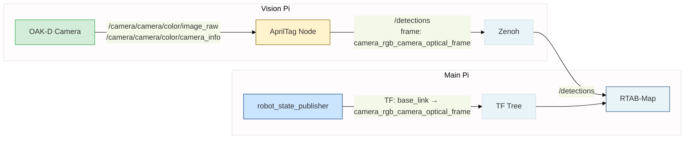

# AprilTag TF Transform Fix - 2025-11-10

## 🐛 Проблема

После последнего изменения в логах RTAB-Map появилась ошибка:

```
[rtabmap-2] [ERROR] MsgConversion.cpp:1943::landmarksFromROS() Cannot transform tag pose from "camera_rgb_camera_optical_frame" frame to "base_link" frame!
[rtabmap-2] [ WARN] MsgConversion.cpp:2000::getTransform() Could not find a connection between 'base_link' and 'camera_rgb_camera_optical_frame' because they are not part of the same tree.
```

## 🔍 Причина

1. **Несоответствие фреймов в URDF**: URDF использовал фреймы `camera_color_optical_frame`, но depthai_ros_driver публикует camera_info с фреймом `camera_rgb_camera_optical_frame`
2. **Отсутствие TF связи**: robot_state_publisher не публиковал правильные фреймы камеры
3. **Неправильные топики**: AprilTag подписывался на несуществующие топики `/camera/rgb/*`
4. **Несоответствие топиков детекций**: AprilTag публиковал на `/apriltag/detections`, а RTAB-Map ожидал `/detections`

## ✅ Решение

### 1. Обновлены фреймы камеры в URDF

**src/rob_box_description/urdf/rob_box.xacro**

Переименованы фреймы согласно конвенции depthai_ros_driver:

| Было | Стало |
|------|-------|
| `camera_color_frame` | `camera_rgb_camera_frame` |
| `camera_color_optical_frame` | `camera_rgb_camera_optical_frame` |
| `camera_depth_frame` | `camera_stereo_camera_frame` |
| `camera_depth_optical_frame` | `camera_stereo_camera_optical_frame` |

### 2. Исправлены топики в AprilTag launch файле

**docker/vision/oak-d/launch/oakd_with_apriltag.launch.py**

```python
# БЫЛО:
remappings=[
    ('image_rect', '/camera/rgb/image_raw'),  # ❌ Несуществующий топик
    ('camera_info', '/camera/rgb/camera_info'),  # ❌ Несуществующий топик
]

# СТАЛО:
remappings=[
    ('image_rect', '/camera/camera/color/image_raw'),  # ✅ Правильный топик
    ('camera_info', '/camera/camera/color/camera_info'),  # ✅ Правильный топик
    ('detections', '/detections'),  # ✅ Переназначен для RTAB-Map
]
```

### 3. Обновлена документация

**docs/architecture/SOFTWARE.md**

Добавлена полная иерархия TF фреймов камеры:

```
camera_link
└── camera
    ├── camera_rgb_camera_frame
    │   └── camera_rgb_camera_optical_frame
    ├── camera_stereo_camera_frame
    │   └── camera_stereo_camera_optical_frame
    └── camera_imu_frame
```

## 📋 Технические детали

### Конвенция именования depthai_ros_driver

depthai_ros_driver использует следующую схему именования фреймов:

- `<camera_name>_link` - физический корпус камеры
- `<camera_name>` - intermediate frame
- `<camera_name>_rgb_camera_frame` - RGB camera frame
- `<camera_name>_rgb_camera_optical_frame` - RGB optical frame (с поворотом для ROS convention)
- `<camera_name>_stereo_camera_frame` - Stereo/Depth camera frame
- `<camera_name>_stereo_camera_optical_frame` - Stereo optical frame

Поскольку имя камеры = `camera`, фреймы:
- `camera_rgb_camera_optical_frame` ← используется в camera_info и AprilTag
- `camera_stereo_camera_optical_frame`

### Поток данных



## 🚀 Развертывание

### Main Pi (robot_state_publisher)

```bash
cd ~/rob_box_project/docker/main
docker-compose down robot-state-publisher
docker-compose pull robot-state-publisher
docker-compose up -d robot-state-publisher
```

### Vision Pi (OAK-D + AprilTag)

```bash
cd ~/rob_box_project/docker/vision
docker-compose down oak-d
docker-compose pull oak-d
docker-compose up -d oak-d
```

### Проверка

```bash
# На Main Pi - проверить TF дерево
docker exec rtabmap ros2 run tf2_tools view_frames

# Проверить что camera_rgb_camera_optical_frame связан с base_link
docker exec rtabmap ros2 run tf2_ros tf2_echo base_link camera_rgb_camera_optical_frame

# Проверить топики AprilTag
docker exec -it oak-d ros2 topic list | grep detections
# Ожидаемый вывод: /detections

# Проверить логи RTAB-Map (ошибка должна исчезнуть)
docker logs rtabmap --tail 50 | grep "Cannot transform"
```

## ✨ Результат

После исправления:
- ✅ robot_state_publisher публикует TF для `camera_rgb_camera_optical_frame`
- ✅ AprilTag получает изображения с камеры
- ✅ AprilTag публикует детекции на `/detections` в фрейме `camera_rgb_camera_optical_frame`
- ✅ RTAB-Map может преобразовать позу тега из `camera_rgb_camera_optical_frame` в `base_link`
- ✅ Ошибка "Cannot transform tag pose" исчезла

## 📚 Связанные документы

- [APRILTAG_INTEGRATION_QUICKREF.md](APRILTAG_INTEGRATION_QUICKREF.md) - Быстрый справочник по интеграции AprilTag
- [docs/architecture/SOFTWARE.md](docs/architecture/SOFTWARE.md) - Полная документация программного стека
- [src/rob_box_description/urdf/rob_box.xacro](src/rob_box_description/urdf/rob_box.xacro) - URDF модель робота

---

**Автор**: GitHub Copilot  
**Дата**: 2025-11-10  
**PR**: [#TBD](https://github.com/krikz/rob_box_project/pull/TBD)
