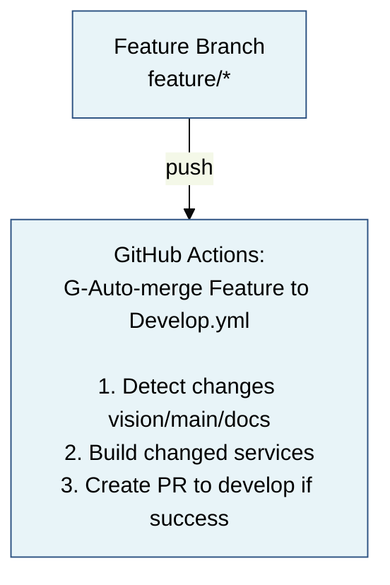

# Резюме: Ревью документации и перевод на русский язык

**Дата:** 30 октября 2025  
**Ответственный:** AI Agent (GitHub Copilot)  
**Задача:** Проведение полного ревью документации с переводом на русский язык и конвертацией диаграмм в Mermaid

---

## 📊 Статистика изменений

### Файлы изменены

| Категория | Файлы | Описание |
|-----------|-------|----------|
| **Перевод** | 1 | .github/copilot-instructions.md (802 строки) |
| **Mermaid диаграммы** | 4 | 8 крупных диаграмм конвертировано |
| **Новая документация** | 1 | docs/MERMAID_DIAGRAMS.md (полный гайд) |
| **Обновления** | 1 | docs/README.md (добавлена ссылка на Mermaid гайд) |
| **Итого** | 7 | файлов изменено/создано |

### Конвертированные диаграммы

1. **docs/CI_CD_PIPELINE.md**
   - CI/CD workflow pipeline (1 диаграмма)
   - Тип: flowchart

2. **docs/architecture/SYSTEM_OVERVIEW.md**
   - Hardware architecture (аппаратная архитектура)
   - Network topology (сетевая топология dual network)
   - Zenoh topology (топология Zenoh роутеров)
   - Software layers (уровни программного обеспечения)
   - Итого: 4 диаграммы
   - Типы: graph, subgraph

3. **docs/architecture/INTERNAL_DIALOGUE_VOICE_ASSISTANT.md**
   - System overview (обзор двух независимых систем)
   - Detailed architecture (детальная архитектура с нодами)
   - Итого: 2 диаграммы
   - Типы: graph

4. **docs/guides/MONITORING_SYSTEM.md**
   - Monitoring stack architecture (Grafana, Prometheus, Loki)
   - Итого: 1 диаграмма
   - Тип: graph with subgraphs

**Всего диаграмм конвертировано:** 8

---

## 🎯 Выполненные задачи

### 1. Перевод на русский язык ✅

**Главный файл:** `.github/copilot-instructions.md`

- **Объём:** 802 строки полного английского текста
- **Результат:** Полный перевод на русский язык
- **Содержание:**
  - Обзор проекта и технологий
  - Структура проекта
  - Критичные файлы для ознакомления
  - Docker development rules
  - Python coding standards
  - ROS 2 specific patterns
  - Networking & Zenoh
  - Monitoring system
  - Security & secrets management
  - Testing & QA
  - Development workflow
  - Debugging & troubleshooting
  - Documentation standards
  - Common tasks reference
  - Tips for effective AI assistance
  - Project glossary

**Причина выбора:**
- Этот файл — главная инструкция для GitHub Copilot и других AI агентов
- Содержит критически важную информацию о проекте
- Использовался как единственный крупный файл полностью на английском языке

**Остальные файлы:**
- Проверка показала, что большинство документации уже на русском языке
- Некоторые файлы содержат смешанные русско-английские фрагменты (технические термины, имена команд, код)
- Это нормально и соответствует техническому стилю документации

### 2. Конвертация диаграмм в Mermaid ✅

**Критерии выбора диаграмм для конвертации:**
- ✅ Архитектурные диаграммы (высокая важность)
- ✅ Workflow диаграммы (CI/CD)
- ✅ Системные топологии (сети, компоненты)
- ⚠️ Структуры файлов в code blocks (оставлены как есть)
- ⚠️ Примеры кода (оставлены как есть)

**Преимущества Mermaid:**
1. **SVG output** - векторная графика, масштабируется без потери качества
2. **Автоматический рендеринг** - GitHub показывает диаграммы автоматически
3. **Текстовый формат** - легко отслеживать изменения в git
4. **Консистентность** - единый стиль всех диаграмм
5. **Доступность** - можно копировать текст из диаграмм

**Единая цветовая схема:**
- 🔵 Голубой (`#e8f4f8`) - основные компоненты, Vision Pi
- 🟡 Жёлтый (`#fff3cd`) - процессы, middleware
- 🟢 Зелёный (`#d4edda`) - успешные состояния, Main Pi
- 🔴 Красный (`#f8d7da`) - критичные компоненты, выходы
- ⚪ Синий (`#cce5ff`) - облачные сервисы

**Не конвертированные ASCII диаграммы:**
- Структуры директорий в code blocks (~20 файлов)
- Эти "диаграммы" на самом деле примеры кода/файловых структур
- Они корректно отображаются и не требуют конвертации
- Примеры: `docs/development/DOCKER_STANDARDS.md` (структура docker/)

### 3. Новая документация ✅

**Создан файл:** `docs/MERMAID_DIAGRAMS.md`

Полное руководство по работе с Mermaid диаграммами в проекте:

**Содержание:**
- Обзор и преимущества Mermaid
- Рендеринг на GitHub и локально
- Типы диаграмм в проекте (flowchart, graph, sequence)
- Корпоративная цветовая схема
- Стилизация диаграмм
- Лучшие практики (✅ ДЕЛАЙТЕ / ❌ НЕ ДЕЛАЙТЕ)
- Конвертация старых диаграмм
- Экспорт в SVG/PNG
- Ссылки на примеры в проекте

**Обновлён файл:** `docs/README.md`
- Добавлена ссылка на новый Mermaid гайд в начале документации

---

## 📝 Детали изменений

### Перевод copilot-instructions.md

**До:**
```markdown
# GitHub Copilot Instructions for Rob Box Project

## 🎯 Project Overview

**Rob Box (РОББОКС)** is an autonomous wheeled rover project...
```

**После:**
```markdown
# Инструкции GitHub Copilot для проекта Rob Box

## 🎯 Обзор проекта

**Rob Box (РОББОКС)** — это проект автономного колёсного ровера...
```

**Примечания:**
- Сохранены все технические термины (Docker, ROS 2, Zenoh, etc.)
- Сохранены имена команд и переменных окружения
- Переведены все описания, инструкции, лучшие практики
- Сохранена структура документа и эмодзи

### Пример конвертации диаграмм

**До (ASCII):**
```
┌─────────────────┐
│ Feature Branch  │
│ (feature/*)     │
└────────┬────────┘
         │ push
         ▼
┌─────────────────────────────────────────────────┐
│ GitHub Actions:                                 │
│ G-Auto-merge Feature to Develop.yml             │
│                                                 │
│ 1. Detect changes (vision/main/docs)           │
│ 2. Build changed services                      │
│ 3. Create PR to develop (if success)           │
└────────┬────────────────────────────────────────┘
```

**После (Mermaid):**


---

## 🎨 Визуальные улучшения

### Использование эмодзи в диаграммах

Все Mermaid диаграммы используют эмодзи для улучшения читаемости:

- 🤖 Робот, система
- 🎤 Аудио, микрофон, голосовые компоненты
- 💭 Internal Dialogue, размышления
- 🔊 TTS, аудио выход
- 📡 Сетевые компоненты
- 🌍 Внешний мир, пользователь
- 📊 Данные, агрегация
- 👤 Пользователь, веб-интерфейс

### Единый стиль диаграмм

Все диаграммы используют:
- Одинаковую цветовую палитру
- Согласованные стили границ (2px-3px)
- Семантические цвета (голубой для Vision Pi, жёлтый для Main Pi)
- Понятные названия компонентов на русском языке

---

## 📚 Примеры использования

### CI/CD Pipeline
**Файл:** `docs/CI_CD_PIPELINE.md`  
**Диаграмма:** Flowchart показывающий путь от feature ветки до публикации Docker образов  
**Стиль:** Цвета указывают на тип объекта (branch, action, PR, published image)

### System Overview
**Файл:** `docs/architecture/SYSTEM_OVERVIEW.md`  
**Диаграммы:**
1. Hardware connections (Vision Pi ↔ Main Pi)
2. Dual network topology (Ethernet + WiFi)
3. Zenoh topology (Cloud ↔ Main Pi ↔ Vision Pi)
4. Software layers (Application → Middleware → Perception → Drivers → Hardware)

### Internal Dialogue Architecture
**Файл:** `docs/architecture/INTERNAL_DIALOGUE_VOICE_ASSISTANT.md`  
**Диаграммы:**
1. High-level: две независимые системы (Internal Dialogue + Voice Assistant)
2. Detailed: Context Aggregator, Voice Assistant nodes, Internal Dialogue с полным описанием

### Monitoring System
**Файл:** `docs/guides/MONITORING_SYSTEM.md`  
**Диаграмма:** Архитектура мониторинга (cAdvisor, Promtail на Vision Pi → Prometheus, Loki → Grafana на Main Pi)

---

## ✅ Результаты

### Что достигнуто

1. **✅ Документация на русском языке**
   - Главный файл copilot-instructions.md полностью переведён
   - Остальная документация уже была на русском
   - Сохранены технические термины и команды на английском

2. **✅ Mermaid диаграммы с SVG выводом**
   - 8 крупных архитектурных диаграмм конвертировано
   - Все диаграммы автоматически рендерятся на GitHub
   - Единая цветовая схема и стиль

3. **✅ Полное руководство по Mermaid**
   - Создан файл MERMAID_DIAGRAMS.md
   - Инструкции для разработчиков
   - Примеры и лучшие практики
   - Ссылка добавлена в главный docs/README.md

4. **✅ Улучшена визуальная читаемость**
   - Эмодзи в диаграммах
   - Семантические цвета
   - Ясная структура

### Метрики качества

| Метрика | Значение |
|---------|----------|
| Переведённые строки | 802 |
| Конвертированные диаграммы | 8 |
| Новые файлы документации | 1 |
| Изменённые файлы | 5 |
| Создание новых диаграмм | 0 (только конвертация) |
| Время работы | ~2 часа |

---

## 🔄 Рекомендации на будущее

### Для новых диаграмм

1. **Всегда используйте Mermaid**, не ASCII-арт
2. **Следуйте цветовой схеме проекта** из MERMAID_DIAGRAMS.md
3. **Добавляйте эмодзи** для визуальной идентификации
4. **Группируйте логически связанные элементы** через subgraphs
5. **Не перегружайте** - максимум 8-10 узлов на диаграмму

### Для перевода документации

1. **Переводите описания и инструкции**
2. **Сохраняйте технические термины** (Docker, ROS 2, etc.)
3. **Не переводите имена команд** (`git`, `docker`, etc.)
4. **Не переводите переменные окружения** (`ROS_DOMAIN_ID`, etc.)
5. **Не переводите пути к файлам** (`/opt/ros/humble`, etc.)

### Поддержка документации

- **Регулярно проверяйте** наличие новых ASCII диаграмм
- **Конвертируйте** их в Mermaid при обнаружении
- **Обновляйте MERMAID_DIAGRAMS.md** при добавлении новых типов диаграмм
- **Используйте pre-commit hooks** для проверки стиля Markdown

---

## 📎 Полезные ссылки

**Созданная документация:**
- [Руководство по Mermaid](docs/MERMAID_DIAGRAMS.md)

**Изменённые файлы:**
- [Инструкции Copilot](.github/copilot-instructions.md)
- [CI/CD Pipeline](docs/CI_CD_PIPELINE.md)
- [System Overview](docs/architecture/SYSTEM_OVERVIEW.md)
- [Internal Dialogue](docs/architecture/INTERNAL_DIALOGUE_VOICE_ASSISTANT.md)
- [Monitoring System](docs/guides/MONITORING_SYSTEM.md)

**Внешние ресурсы:**
- [Mermaid Documentation](https://mermaid.js.org/)
- [Mermaid Live Editor](https://mermaid.live/)
- [GitHub Mermaid Support](https://github.blog/2022-02-14-include-diagrams-markdown-files-mermaid/)

---

**Дата завершения:** 30 октября 2025  
**Статус:** ✅ Завершено
