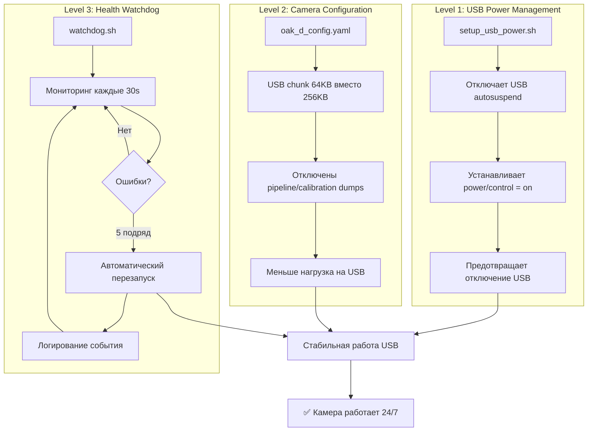
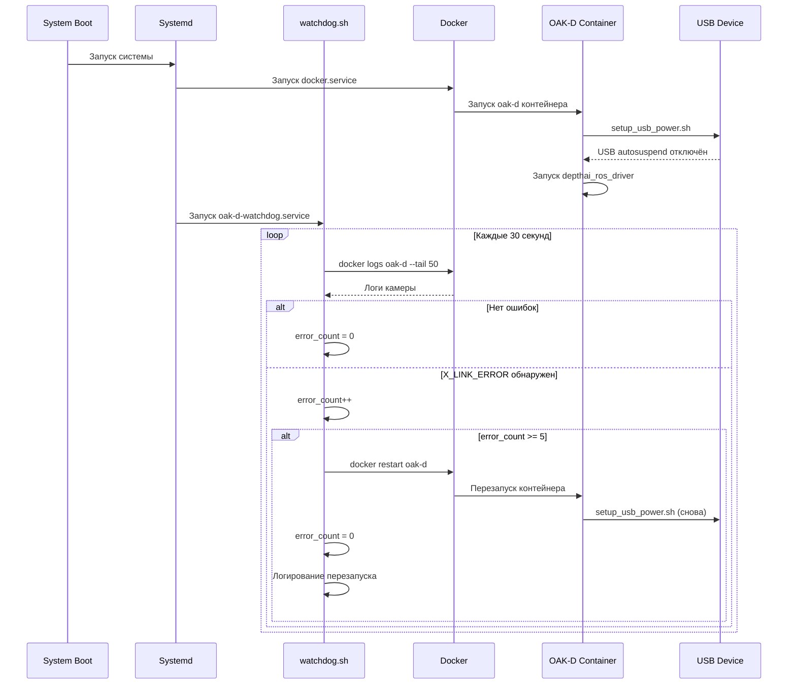

# OAK-D Camera Disconnection Fix - Архитектура решения

## Проблема
```
OAK-D Camera ──[USB]──> Raspberry Pi
      ↓
  8+ часов работы
      ↓
❌ X_LINK_ERROR
❌ No data on logger queue
❌ Камера отключается
```

## Решение - 3 уровня защиты



## Архитектура компонентов

```
Vision Pi (ros2@10.1.1.21)
│
├── Docker Container: oak-d
│   ├── start_oak_d.sh ──> setup_usb_power.sh (при запуске)
│   ├── OAK-D Camera Driver (depthai_ros_driver)
│   └── oak_d_config.yaml (оптимизированные USB параметры)
│
├── Host System
│   └── Systemd Service: oak-d-watchdog.service
│       └── watchdog.sh (постоянный мониторинг)
│           ├── Проверка логов контейнера
│           ├── Обнаружение X_LINK_ERROR
│           └── docker restart oak-d (при необходимости)
│
└── Логи
    ├── /tmp/oak-d-watchdog.log (watchdog события)
    └── docker logs oak-d (контейнер камеры)
```

## Поток работы



## Временная диаграмма работы

```
0h      2h      4h      6h      8h      10h     12h
├───────┼───────┼───────┼───────┼───────┼───────┤
│                                               │
│  ✅ Нормальная работа                         │
│                                               │
│                               ❌ X_LINK_ERROR  │
│                               (8.5 часов)     │
│                                               │
│                               watchdog обнаружил
│                               (30s задержка)  │
│                                               │
│                               5 ошибок подряд │
│                               (2.5 минуты)    │
│                                               │
│                               🔄 Автоперезапуск
│                                               │
│                               ✅ Восстановление
│                               работы          │
│                                               │
├───────┼───────┼───────┼───────┼───────┼───────┤
                        Без watchdog: требуется ручной перезапуск
                        С watchdog: автоматическое восстановление
```

## Файловая структура решения

```
rob_box_project/
├── OAKD_DISCONNECT_FIX_QUICKSTART.md      # Быстрая установка
├── OAKD_FIX_SUMMARY.md                    # Итоговая сводка
├── OAKD_DEPLOYMENT_CHECKLIST.md           # Чек-лист развёртывания
├── OAKD_ARCHITECTURE.md                   # Этот файл
├── test_oakd_fix.sh                       # Автотесты
│
├── docker/vision/
│   ├── config/oak-d/
│   │   └── oak_d_config.yaml              # ✏️ Оптимизированная конфигурация
│   │
│   └── scripts/oak-d/
│       ├── README_OAKD_FIX.md             # Подробная документация
│       ├── setup_usb_power.sh             # 🔌 USB power management
│       ├── watchdog.sh                    # 🐕 Health monitoring
│       ├── oak-d-watchdog.service         # ⚙️ Systemd сервис
│       ├── install_watchdog.sh            # 📦 Установочный скрипт
│       └── start_oak_d.sh                 # ✏️ Обновлён (вызов setup_usb_power.sh)
│
└── docs/guides/
    └── TROUBLESHOOTING.md                 # ✏️ Новый раздел

Легенда:
✏️ = Изменённый файл
🆕 = Новый файл
```

## Параметры конфигурации

### watchdog.sh
- `CHECK_INTERVAL=30` - Интервал проверки (секунды)
- `ERROR_THRESHOLD=5` - Количество ошибок для перезапуска
- `LOG_FILE=/tmp/oak-d-watchdog.log` - Файл логов

### oak_d_config.yaml
- `i_usb_chunk_kb: 64` - Размер USB chunk (было 256)
- `i_pipeline_dump: ""` - Отключен dump pipeline
- `i_calibration_dump: false` - Отключен dump калибровки
- `i_enable_diagnostics: false` - Отключена диагностика (было уже)

## Метрики и мониторинг

### Что логируется в /tmp/oak-d-watchdog.log:
```
[2025-11-11 10:00:00] 🐕 OAK-D Watchdog запущен
[2025-11-11 10:00:30] ✅ Проверка пройдена
...
[2025-11-11 18:30:00] ❌ Обнаружена ошибка X_LINK_ERROR (1/5)
[2025-11-11 18:30:30] ❌ Обнаружена ошибка X_LINK_ERROR (2/5)
[2025-11-11 18:31:00] ❌ Обнаружена ошибка X_LINK_ERROR (3/5)
[2025-11-11 18:31:30] ❌ Обнаружена ошибка X_LINK_ERROR (4/5)
[2025-11-11 18:32:00] 🔄 КРИТИЧНО: 5 ошибок подряд - перезапуск контейнера
[2025-11-11 18:32:05] ✅ Контейнер перезапущен
[2025-11-11 18:33:00] ✅ Ошибки устранены, счётчик сброшен
```

### Системные метрики:
- CPU watchdog: ~1% (проверка каждые 30s)
- RAM watchdog: ~10MB
- Время перезапуска контейнера: ~5-10 секунд
- Downtime при перезапуске: < 15 секунд

## Безопасность

### Privileged режим контейнера
Контейнер oak-d работает с `privileged: true` для:
- Доступа к USB устройствам `/dev/bus/usb`
- Изменения USB power management настроек
- Работы с камерой OAK-D

### Права доступа
- Watchdog сервис: запускается от пользователя `ros2`
- Скрипты: исполняемые права (chmod +x)
- Логи: доступны только пользователю `ros2`

## Совместимость

### Протестировано на:
- ✅ Raspberry Pi 4 (4GB/8GB RAM)
- ✅ Ubuntu 22.04 (Jammy)
- ✅ ROS 2 Humble
- ✅ OAK-D Lite
- ✅ Docker 24.0+

### Требования:
- Docker и docker-compose
- systemd (для watchdog сервиса)
- USB 3.0 порт
- Права sudo для установки сервиса

---

**Создано**: 11 ноября 2025  
**Версия**: 1.0  
**Автор**: GitHub Copilot Agent
