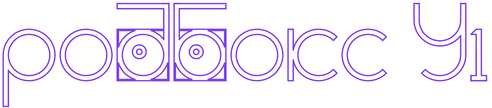

<div align="center">
  
  
  # РОББОКС - Автономный Колесный Робот
### Сенсоры
- **LS LiDAR N10**: 2D лазерный сканер 360° (0.05-30м)
- **OAK-D Lite**: Стерео камера с Intel Movidius (RGB + Depth)
- **Raspberry Pi Camera**: Направлена вверх (ceiling-ba| **ROS 2 Пакетов**: 6+ (rob_box_*, robot_sensor_hub_msg, vesc_nexus, ros2leds)
| **Docker Сервисов**: 10+ (Main Pi + Vision Pi)
| **LED Count**: 381 NeoPixel (4× 8×8 + 5× 5×5)
| **LED Анимаций**: 21+ готовых анимаций
| **Документов**: 40+ файлов в `docs/`
| **Платформа**: Raspberry Pi 5 (arm64, Main: 16GB, Vision: 8GB)
| **Версия ROS**: ROS 2 Humble Hawksbillкализация)
- **ReSpeaker Mic Array v2.0**: 6-микрофонный массив для голосового ассистента (Future)
- **IMU**: 9-DOF инерциальный датчик (Future) [](https://github.com/krikz/rob_box_project/actions/workflows/build-all.yml)
  [](https://github.com/krikz/rob_box_project/actions/workflows/build-base-images.yml)
  [](https://docs.ros.org/en/humble/)
  [](https://www.raspberrypi.org/)
  
  **Автономный робот на базе ROS 2 с LED-матрицами, SLAM-навигацией и компьютерным зрением**
</div>

---

## 📖 Содержание

- [О Проекте](#-о-проекте)
- [Ключевые Возможности](#-ключевые-возможности)
- [Системная Архитектура](#-системная-архитектура)
- [Аппаратное Обеспечение](#️-аппаратное-обеспечение)
- [Программное Обеспечение](#-программное-обеспечение)
- [Документация](#-документация)
- [Быстрый Старт](#-быстрый-старт)
- [Разработка](#-разработка)
- [Связанные Репозитории](#-связанные-репозитории)

---

## 🎯 О Проекте

**РОББОКС** — это автономный колесный робот, разработанный на базе ROS 2 Humble с двухпроцессорной архитектурой (Dual Raspberry Pi). Проект сочетает современные технологии робототехники: SLAM-навигацию, компьютерное зрение, выразительный LED-интерфейс и микросервисную Docker-архитектуру.

### 🎪 Особенности Проекта

- **🎨 Выразительный LED-интерфейс**: 5 LED-матриц (64×64) для эмоций и индикации состояния
- **🗺️ Автономная навигация**: RTAB-Map SLAM с 2D LiDAR и 3D камерой
- **👁️ Компьютерное зрение**: OAK-D Lite с AprilTag детекцией
- **⚙️ Модульная архитектура**: Dual Raspberry Pi + Zenoh middleware
- **🐳 Docker-first подход**: Все сервисы в контейнерах с автоматической сборкой
- **📡 Беспроводное управление**: WiFi + Ethernet dual network

---

## ✨ Ключевые Возможности

### 🤖 Автономия
- ✅ SLAM картография и локализация (RTAB-Map + LS LiDAR)
- ✅ Планирование траектории (Nav2)
- ✅ Избегание препятствий
- ✅ AprilTag навигация для точного позиционирования

### 🎭 Интерактивность
- ✅ Система анимаций эмоций (21 анимация, 600+ кадров)
- ✅ Аудио-реактивность (WIP)
- ✅ Голосовое управление (Planned)

### 📡 Коммуникация
- ✅ Zenoh middleware для распределённой обработки
- ✅ CAN-шина для управления моторами (VESC)
- ✅ Micro-ROS для сенсорного хаба (ESP32)

### 🔧 Разработка
- ✅ Полная CI/CD с GitHub Actions
- ✅ Multi-arch Docker образы (arm64)
- ✅ Визуализация в RViz2/Foxglove Studio
- ✅ Подробная документация

---

## 🏗️ Системная Архитектура

### Концепция Dual Raspberry Pi

```
┌─────────────────────────────────────────────────────────────────┐
│                         РОББОКС                                  │
│                                                                  │
│  ┌──────────────────────┐         ┌──────────────────────────┐ │
│  │    Vision Pi         │         │      Main Pi             │ │
│  │   (10.1.1.11)        │◄───────►│    (10.1.1.10)           │ │
│  │                      │ Gigabit │                          │ │
│  │  • OAK-D Camera      │ Ethernet│  • RTAB-Map SLAM         │ │
│  │  • AprilTag Detect   │         │  • Nav2 Navigation       │ │
│  │  • Zenoh Router      │         │  • Twist Mux             │ │
│  │  • Image Processing  │         │  • LS LiDAR Driver       │ │
│  └──────────────────────┘         │  • Zenoh Router          │ │
│            │                       │  • ROS2 Control          │ │
│            │ WiFi                  │  • Micro-ROS Agent       │ │
│            │ (Management)          └──────────────────────────┘ │
│            ▼                                   │                 │
│     ┌──────────────┐                          │                 │
│     │ Host System  │◄─────────────────────────┘                 │
│     │ (Foxglove)   │           WiFi                             │
│     └──────────────┘        (Management)                        │
│                                                                  │
│  ┌──────────────────────────────────────────────────────────┐  │
│  │                 Hardware Components                       │  │
│  │  • 5x LED Matrix 64x64  • 2x VESC Motor Controllers      │  │
│  │  • LS LiDAR 2D Scanner  • ESP32 Sensor Hub               │  │
│  │  • OAK-D Lite Camera    • IMU (Future)                   │  │
│  └──────────────────────────────────────────────────────────┘  │
└─────────────────────────────────────────────────────────────────┘
```

### Ключевые Компоненты

| Компонент | Описание | Платформа |
|-----------|----------|-----------|
| **Vision Pi** | Обработка изображений, детекция маркеров | Raspberry Pi 4/5 |
| **Main Pi** | Навигация, планирование, управление | Raspberry Pi 4/5 |
| **Zenoh Middleware** | Распределённая связь между Pi | Eclipse Zenoh |
| **ROS 2 Humble** | Робототехническая платформа | Ubuntu 22.04 |
| **Docker Compose** | Оркестрация микросервисов | Docker 24+ |

➡️ **Подробнее**: [docs/ARCHITECTURE.md](docs/ARCHITECTURE.md)

---

## 🛠️ Аппаратное Обеспечение

### Вычислительные Модули
- **Main Pi**: Raspberry Pi 5 (16GB RAM) — навигация, планирование, управление
- **Vision Pi**: Raspberry Pi 5 (8GB RAM) — компьютерное зрение, LED управление

### Сенсоры
- **LS LiDAR N10**: 2D лазерный сканер (0.05-30м, 270°)
- **OAK-D Lite**: Стерео камера с Intel Movidius (RGB + Depth)
- **IMU**: 9-DOF инерциальный датчик (Planned)

### Актуаторы
- **2× VESC 4.12**: Контроллеры двигателей (CAN-шина, FOC control)
- **4× NeoPixel 8×8**: Фары (передние/задние, 256 LED)
- **5× NeoPixel 5×5**: Основной дисплей 5×25 (125 LED) — эмоции, анимации
- **2× Cooling Fans**: PWM вентиляторы с тахометром

### Периферия
- **ESP32**: Сенсорный хаб (AHT30×8, HX711, Fans) через Micro-ROS
- **USB Hub**: Управляемый USB-хаб для питания устройств

➡️ **Подробнее**: [docs/HARDWARE.md](docs/HARDWARE.md)

---

## 💻 Программное Обеспечение

### ROS 2 Пакеты

| Пакет | Описание | Язык |
|-------|----------|------|
| `rob_box_bringup` | Launch-файлы для запуска системы | Python/XML |
| `rob_box_description` | URDF модель робота | XML/URDF |
| `rob_box_animations` | Система LED-анимаций | Python |
| `led_matrix_driver` | Драйвер HUB75 LED матриц | C++ |
| `robot_sensor_hub_msg` | Сообщения для ESP32 хаба | ROS2 Msg |
| `vesc_nexus` (submodule) | VESC драйвер и интерфейс | C++/Python |

### Docker Сервисы

**Main Pi** (10.1.1.10):
- `zenoh-router` — центральный роутер
- `twist-mux` — мультиплексирование команд скорости
- `rtabmap` — SLAM и локализация
- `lslidar` — драйвер 2D LiDAR
- `nav2` — планирование и навигация
- `micro-ros-agent` — связь с ESP32
- `vesc-driver` — управление моторами

**Vision Pi** (10.1.1.11):
- `zenoh-router` — локальный роутер
- `oak-d` — драйвер камеры + детекция AprilTag
- `apriltag` — детекция и идентификация маркеров

➡️ **Подробнее**: [docs/SOFTWARE.md](docs/SOFTWARE.md)

---

## 📚 Документация

### 🚀 Начало Работы
- **[Быстрый старт](docs/getting-started/QUICK_START_RU.md)** — запуск системы за 5 минут
- **[Чеклист развёртывания](docs/getting-started/CHECKLIST.md)** — пошаговая настройка

### 📖 Руководства
- **[Управление питанием](docs/guides/POWER_MANAGEMENT.md)** — настройка питания и мониторинг
- **[Настройка LiDAR](docs/guides/LSLIDAR_SETUP.md)** — подключение и калибровка
- **[Настройка CAN](docs/guides/CAN_SETUP.md)** — CAN-шина для VESC
- **[Настройка Nav2](docs/guides/NAV2_SETUP.md)** — автономная навигация
- **[Визуализация](docs/guides/VISUALIZATION.md)** — RViz2 и Foxglove Studio
- **[Решение проблем](docs/guides/TROUBLESHOOTING.md)** — типичные проблемы

### 📚 Справочная Документация
- **[Архитектура системы](docs/ARCHITECTURE.md)** — полное описание архитектуры
- **[Аппаратное обеспечение](docs/HARDWARE.md)** — все компоненты и схемы
- **[Программное обеспечение](docs/SOFTWARE.md)** — ROS2 пакеты и Docker сервисы
- **[API Reference](docs/API_REFERENCE.md)** — топики, сервисы, параметры
- **[Оптимизация](docs/reference/OPTIMIZATION.md)** — настройка производительности

### 🔧 Для Разработчиков
- **[CONTRIBUTING.md](CONTRIBUTING.md)** — как участвовать в проекте
- **[Стандарты Docker](docs/development/DOCKER_STANDARDS.md)** — правила для Docker
- **[Руководство для AI агентов](docs/development/AGENT_GUIDE.md)** — гайд для AI ассистентов
- **[LED Animations Development](src/rob_box_animations/README.md)** — разработка анимаций
- **[🎨 Система Анимаций](docs/development/ANIMATIONS.md)** — галерея всех 21 анимаций с GIF

---

## 🚀 Быстрый Старт

### Предварительные требования

- 2× Raspberry Pi 4/5 (4GB RAM минимум)
- Ubuntu 22.04 Server ARM64
- Docker 24.0+
- Gigabit Ethernet коммутатор

### Установка

```bash
# Клонируем репозиторий с субмодулями
git clone --recursive https://github.com/krikz/rob_box_project.git
cd rob_box_project

# Main Pi — загружаем и запускаем сервисы
cd docker/main
docker compose pull
docker compose up -d

# Vision Pi — загружаем и запускаем сервисы
cd docker/vision
docker compose pull
docker compose up -d
```

### Проверка работы

```bash
# Проверяем статус контейнеров
docker compose ps

# Проверяем ROS2 ноды
docker exec -it zenoh-router ros2 node list

# Просмотр топиков
docker exec -it zenoh-router ros2 topic list

# Визуализация в Foxglove Studio
# Подключиться к ws://10.1.1.10:8765
```

➡️ **Полный гайд**: [docs/getting-started/QUICK_START_RU.md](docs/getting-started/QUICK_START_RU.md)

---

## 👨‍💻 Разработка

### Git Workflow (Git Flow)

Проект использует Git Flow с защищёнными ветками:

- **`main`** — production релизы (Docker тег `latest`)
- **`develop`** — разработка (Docker тег `dev`)
- **`feature/*`** — новые функции (без Docker сборки)
- **`release/*`** — подготовка релиза (тег `rc-X.Y.Z`)
- **`hotfix/*`** — срочные исправления (тег `hotfix-X.Y.Z`)

### Создание фичи

```bash
# Начинаем новую фичу
git checkout develop
git pull origin develop
git checkout -b feature/my-new-feature

# Разрабатываем и коммитим
git add .
git commit -m "feat: add new navigation mode"
git push origin feature/my-new-feature

# Создаём Pull Request в develop
```

### CI/CD

GitHub Actions автоматически:
- ✅ Собирает Docker образы для `main`, `develop`, `release/*`, `hotfix/*`
- ✅ Публикует в GitHub Container Registry
- ✅ Поддерживает multi-arch сборки (arm64)
- ✅ Управляет тегами образов

➡️ **Подробнее**: [CONTRIBUTING.md](CONTRIBUTING.md), [.github/CI_CD_README.md](.github/CI_CD_README.md)

---

## 📦 Связанные Репозитории

| Репозиторий | Описание | Связь |
|-------------|----------|-------|
| [vesc_nexus](https://github.com/yourusername/vesc_nexus) | VESC драйвер для ROS2 | Git Submodule |
| [ros2leds](https://github.com/krikz/ros2leds) | NeoPixel LED управление (381 LED) | Git Submodule |
| [robot_sensor_hub](https://github.com/krikz/robot_sensor_hub) | Прошивка ESP32 (Micro-ROS) | Отдельный репозиторий |
| [rob_box_cad](https://github.com/yourusername/rob_box_cad) | 3D модели и чертежи Fusion 360 | Отдельный репозиторий |

---

## 📊 Статистика Проекта

- **ROS 2 Пакетов**: 6 (rob_box_*, robot_sensor_hub_msg, vesc_nexus)
- **Docker Сервисов**: 10+ (Main Pi + Vision Pi)
- **LED Анимаций**: 21 (600+ кадров, ~50KB)
- **Документов**: 40+ файлов в `docs/`
- **Платформа**: Raspberry Pi 4/5 (arm64)
- **Версия ROS**: ROS 2 Humble

---

## 🤝 Участие в Проекте

Мы приветствуем ваш вклад! Пожалуйста, ознакомьтесь с [CONTRIBUTING.md](CONTRIBUTING.md) для деталей по:
- Git Flow процессу
- Стандартам кода
- Правилам коммитов (Conventional Commits)
- Review процессу

---

## 📄 Лицензия

Этот проект распространяется под лицензией MIT — см. файл [LICENSE](LICENSE).

---

## 🔗 Полезные Ссылки

- **GitHub**: [github.com/krikz/rob_box_project](https://github.com/krikz/rob_box_project)
- **Docker Registry**: [ghcr.io/krikz/rob_box](https://ghcr.io/krikz/rob_box)
- **ROS 2 Humble**: [docs.ros.org/en/humble](https://docs.ros.org/en/humble/)
- **Zenoh**: [zenoh.io](https://zenoh.io/)

---

<div align="center">
  <p><strong>Сделано с ❤️ командой РОББОКС</strong></p>
  <p>
    <sub>Последнее обновление: 2025-10-12 | Версия: 1.0.0</sub>
  </p>
</div>
