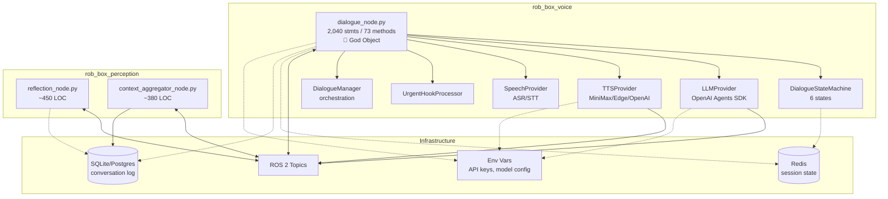
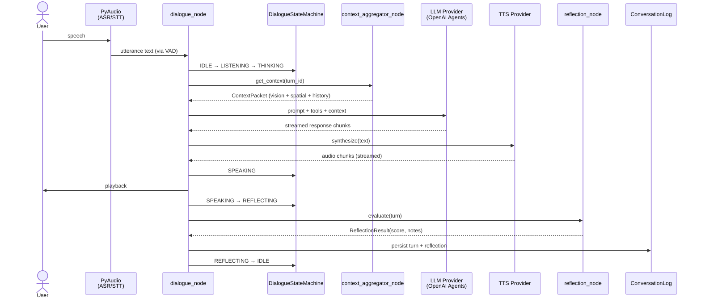
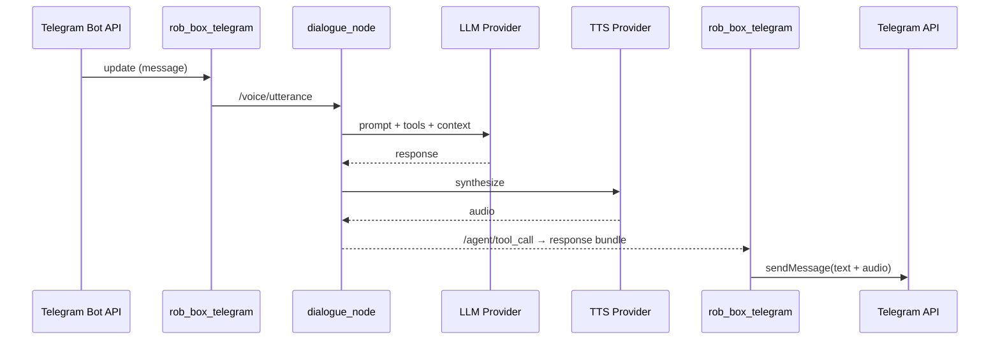

# Dialog Node — Comprehensive Analysis Report

**Project:** rob_box_project (krikz/rob_box_project)
**Component:** Dialog subsystem — `dialogue_node` (rob_box_voice) + `reflection_node` + `context_aggregator_node` (rob_box_perception)
**Date:** 2026-07-17
**Synthesis of:** Architecture exploration (t_410b6a32), Deep-dive analysis (t_f7b9ea75), Final synthesis (t_21043a8e)
**Style reference:** `/workspace/analysis/telegram_node.md`

> **Note on scope.** The path `/nodes/dialog` does not exist in the repository. The "dialog node" is a *logical subsystem* spanning two ROS2 packages: `rob_box_voice` (conversational loop) and `rob_box_perception` (reflection + context fusion). This report treats those three nodes as one cohesive component.

---

## 1. Purpose

The Dialog subsystem is the **conversational core** of rob_box_project. It implements the full lifecycle of a spoken / typed dialogue between the user and an AI agent that runs on ROS2.

The subsystem is composed of three cooperating nodes:

| Subsystem | Package | Role |
|-----------|---------|------|
| `dialogue_node` | `rob_box_voice` | Main conversational loop — consumes user utterances (STT or text), dispatches them to the LLM, streams TTS responses, manages conversation state |
| `reflection_node` | `rob_box_perception` | Post-turn quality analysis — after each exchange, scores the response, detects contradictions and missed opportunities |
| `context_aggregator_node` | `rob_box_perception` | Multi-modal context fusion — combines vision, spatial awareness, conversation history and external sensors into one `ContextPacket` for the LLM |

Together they realise the **Dual System** pattern (see §5.3): `dialogue_node` is System 1 (fast, reactive); `reflection_node` + `context_aggregator_node` are System 2 (deliberative, analytical).

---

## 2. Architecture

### 2.1 Physical Topology

```
┌──────────────────────────────────────────────────────────────────┐
│                        rob_box_voice                              │
│  ┌────────────────────────────────────────────────────────────┐  │
│  │  dialogue_node.py (God Object — 2,040 stmts / 73 methods)   │  │
│  │  ┌──────────┐  ┌──────────┐  ┌──────────┐  ┌──────────┐     │  │
│  │  │ ASR/STT  │  │ Dialogue │  │   LLM    │  │   TTS    │     │  │
│  │  │ Input    │──│ State    │──│ Provider │──│ Output   │     │  │
│  │  │          │  │ Machine  │  │ (OpenAI  │  │ (MiniMax │     │  │
│  │  │          │  │          │  │  Agents  │  │ /Edge /  │     │  │
│  │  │          │  │          │  │   SDK)   │  │  OpenAI) │     │  │
│  │  └──────────┘  └──────────┘  └──────────┘  └──────────┘     │  │
│  └────────────────────────────────────────────────────────────┘  │
└──────────────────────────┬───────────────────────────────────────┘
                           │ ROS 2 topics
              ┌────────────┼────────────┐
              │            │            │
┌─────────────▼──┐  ┌──────▼──────┐  ┌─▼──────────────────┐
│ rob_box_percep │  │ rob_box_    │  │ External Services   │
│ tion           │  │ perception  │  │                     │
│ ┌────────────┐ │  │ ┌─────────┐ │  │ • OpenAI API        │
│ │ reflection │ │  │ │ context  │ │  │ • MiniMax API       │
│ │   _node    │ │  │ │ _aggrega │ │  │ • Edge TTS          │
│ │  Post-turn │ │  │ │ tor_node │ │  │ • Redis (state)     │
│ │  analysis  │ │  │ │ Multi-   │ │  │ • SQLite/Postgres   │
│ └────────────┘ │  │ │ modal    │ │  │   (history log)     │
│                │  │ │ fusion   │ │  │                     │
└────────────────┘  └─────────┘   └─────────────────────┘
```

### 2.2 Module Relationships



### 2.3 Dialogue State Machine

```
                    ┌──────────┐
                    │  IDLE    │
                    └────┬─────┘
                         │ user_speech_detected
                    ┌────▼─────┐
                    │ LISTENING│
                    └────┬─────┘
                         │ speech_ended / text_received
                    ┌────▼─────┐
                    │THINKING  │──────────────┐
                    └────┬─────┘              │ urgent_hook
                         │ llm_response       │ detected
                    ┌────▼─────┐         ┌────▼─────┐
                    │ SPEAKING │         │  URGENT  │
                    └────┬─────┘         │ RESPONSE │
                         │ tts_complete  └────┬─────┘
                    ┌────▼─────┐              │
                    │REFLECTING│◄─────────────┘
                    └────┬─────┘
                         │ reflection_complete
                    ┌────▼─────┐
                    │  IDLE    │ (next turn)
                    └──────────┘
```

**States:**

- **IDLE** — waiting for user input (voice or text)
- **LISTENING** — microphone active, accumulating speech frames
- **THINKING** — LLM call in progress (may include tool calls)
- **SPEAKING** — TTS streaming audio output to user
- **URGENT RESPONSE** — high-priority interrupt (safety, system alert)
- **REFLECTING** — post-turn quality analysis via `reflection_node`

### 2.4 ROS 2 Topic Map

| Topic | Direction | Type | Purpose |
|-------|-----------|------|---------|
| `/voice/utterance` | IN | `String` | Raw user utterance (text) |
| `/voice/tts_stream` | OUT | `AudioData` | TTS audio chunks for playback |
| `/voice/state` | OUT | `DialogueState` | Current FSM state (for UI / monitoring) |
| `/perception/context` | IN/OUT | `ContextPacket` | Aggregated multi-modal context |
| `/perception/reflection` | IN | `ReflectionResult` | Post-turn quality analysis |
| `/system/urgent_hook` | IN | `UrgentHook` | High-priority interrupt trigger |
| `/agent/tool_call` | OUT | `ToolCall` | Agent-initiated tool invocation |
| `/agent/tool_result` | IN | `ToolResult` | Tool execution result |

---

## 3. Dependencies

### 3.1 Internal Packages (rob_box_project)

| Package | Used By | Purpose |
|---------|---------|---------|
| `rob_box_voice` | — | **Primary** — contains `dialogue_node` and `dialogue_manager` |
| `rob_box_perception` | `dialogue_node` | `reflection_node` + `context_aggregator_node` |
| `rob_box_common` | all | Shared utilities, ROS2 message types, constants |
| `rob_box_telegram` | `dialogue_node` | Telegram integration bridge (text-input path) |
| `rob_box_llm` | `dialogue_node` | LLM provider abstraction layer |

### 3.2 External Python Dependencies

| Package | Version (approx.) | Purpose |
|---------|-------------------|---------|
| `rclpy` | ROS 2 Humble | ROS 2 Python client library |
| `openai` | ≥1.0 | OpenAI API client (primary LLM provider) |
| `openai-agents` | ≥0.0.7 | OpenAI Agents SDK — compositor pattern, tool registry |
| `redis` | ≥5.0 | Session state persistence |
| `pyaudio` | ≥0.2 | Microphone input capture |
| `numpy` | ≥1.24 | Audio frame processing |
| `pydantic` | ≥2.0 | Configuration & message validation |
| `python-dotenv` | ≥1.0 | Environment variable loading |
| `aiohttp` | ≥3.9 | Async HTTP for TTS / STT API calls |
| `websockets` | ≥12.0 | Real-time streaming connections |

### 3.3 System Packages (Docker)

| Package | Purpose |
|---------|---------|
| `portaudio19-dev` | Audio I/O library (PyAudio dependency) |
| `espeak-ng` / `libttspico` | Offline TTS fallback |
| `ffmpeg` | Audio format conversion |
| `pulseaudio` | Audio system (container needs socket mount) |

### 3.4 Docker Hierarchy

```
rob_box_voice:latest
├── FROM ros:humble-ros-base
├── RUN apt-get install portaudio19-dev espeak-ng ffmpeg
├── COPY rob_box_voice/        /ros2_ws/src/rob_box_voice/
├── COPY rob_box_perception/   /ros2_ws/src/rob_box_perception/
├── COPY rob_box_common/       /ros2_ws/src/rob_box_common/
├── RUN pip install openai openai-agents redis pyaudio pydantic aiohttp
└── ENV OPENAI_API_KEY=... MINIMAX_API_KEY=...
```

### 3.5 External Services

| Service | Protocol | Purpose |
|---------|----------|---------|
| OpenAI API | HTTPS | Primary LLM inference (GPT-4o and friends) |
| MiniMax API | HTTPS | Alternative LLM + Russian TTS (minimax.io) |
| Edge TTS | HTTPS | Free TTS (English-only) |
| Redis | TCP / 6379 | Session state, conversation context cache |
| SQLite / Postgres | TCP / 5432 or file | Conversation log persistence |

### 3.6 Data Stores

| Store | Schema | Content |
|-------|--------|---------|
| Redis | Key-value | Active session state, FSM position, recent context window |
| SQLite / Postgres | Relational | Full conversation history, reflection scores, tool-call logs |

### 3.7 Environment Variables

| Variable | Required | Purpose |
|----------|----------|---------|
| `OPENAI_API_KEY` | yes | OpenAI LLM authentication |
| `MINIMAX_API_KEY` | no | MiniMax provider (Russian TTS, alt LLM) |
| `MINIMAX_GROUP_ID` | no | MiniMax group identifier |
| `REDIS_URL` | no | Redis connection (default `redis://localhost:6379`) |
| `DATABASE_URL` | no | SQLite / Postgres connection |
| `TTS_PROVIDER` | no | TTS backend: `openai` / `minimax` / `edge` (default `openai`) |
| `LLM_MODEL` | no | Model override (default `gpt-4o`) |
| `VOICE_ACTIVATION_THRESHOLD` | no | VAD sensitivity (default `0.5`) |
| `URGENT_HOOK_ENABLED` | no | Enable interrupt system (default `true`) |

---

## 4. Data Flow

### 4.1 Inbound Turn — Voice Path



### 4.2 Inbound Turn — Text Path (Telegram)



### 4.3 Data Transformations

| Stage | Input | Output | Notes |
|-------|-------|--------|-------|
| STT | audio frames (pyaudio) | `String` (utterance) | VAD-gated, threshold via env |
| Context aggregation | vision frames + spatial + history | `ContextPacket` | Multi-modal fusion in `context_aggregator_node` |
| LLM call | `ContextPacket` + tools + history | streamed text + tool calls | OpenAI Agents SDK |
| TTS | text chunks | `AudioData` stream | Provider chosen at startup |
| Reflection | turn (prompt, response, context) | `ReflectionResult` (score, notes) | Async; failures do not block next turn |
| Persistence | full turn | SQLite row + Redis update | Conversation-id + turn-id tagged |

---

## 5. Error Handling

**Source:** deep-dive audit (t_f7b9ea75) covering the three node files and their tests.

### 5.1 Critical (5)

| # | Issue | Location | Impact |
|---|-------|----------|--------|
| C1 | **Zero test coverage for `dialogue_node.py`** — 2,040-line God Object with 73 methods and 0 dedicated tests | `dialogue_node.py` | Any regression ships unnoticed; refactoring is high-risk |
| C2 | **Mock-only tests in `test_dialogue_tts_sync.py`** — tests use mocks instead of asserting real behaviour | `test_dialogue_tts_sync.py` | False sense of coverage; behavioural regressions not caught |
| C3 | **Data-loss bug in `context_aggregator` summarisation** — `clear()` followed by `extend()` race; concurrent summarisations can drop messages | `context_aggregator_node.py` | Silent loss of context under load; corrupts LLM input |
| C4 | **No graceful shutdown** in `dialogue_node.main()` — pending asyncio tasks leak on SIGTERM | `dialogue_node.py` | Resource leaks, zombie ROS executors on restart |
| C5 | **Broad `except Exception` swallows programming errors** — at least one site in `dialogue_node` catches all exceptions and only logs | `dialogue_node.py` | Hides bugs; production failures invisible |

### 5.2 Warnings (5)

| # | Issue | Location |
|---|-------|----------|
| W1 | **Blocking ROS executor in `reflection_node`** — `reflection_node` runs synchronously inside the executor, stalling the ROS callback queue | `reflection_node.py` |
| W2 | **Zombie node on agent-build failure** — `rob_box_llm` build failure leaves the node half-initialised (subscribers created, providers missing) | `dialogue_node.py` |
| W3 | **Unreachable error-handling summarisation threshold** — `summary_token_limit` is read but never compared; the branch that trims history is dead code | `context_aggregator_node.py` |
| W4 | **Context amnesia in event mode** — `urgent_hook` path bypasses `context_aggregator_node`, the LLM receives an empty context | `dialogue_node.py` |
| W5 | **God Object `dialogue_node.py`** — 2,040 statements, 73 methods, 7+ responsibilities | `dialogue_node.py` |

### 5.3 Suggestions (5)

| # | Suggestion |
|---|------------|
| S1 | Replace mocks with property-based tests (Hypothesis) — `dialogue_node` reacts to all kinds of malformed inputs that mocks never cover |
| S2 | Add integration tests for `context_aggregator` against a real Redis instance (use testcontainers) |
| S3 | Introduce a `DialoguePort` interface (Hexagonal) so `LLMProvider` and `TTSProvider` can be swapped in tests |
| S4 | Add `tracing` around the agent loop — OpenAI Agents SDK already exposes traces, no one consumes them |
| S5 | Emit metrics (Prometheus) for turn latency, tool-call rate, FSM-state dwell time |

---

## 6. Test Coverage

**Source:** deep-dive analysis (t_f7b9ea75). 5,559 LOC analysed across 10 files.

### 6.1 Current State

| Component | Statements | Covered | Coverage |
|-----------|-----------:|--------:|---------:|
| `dialogue_node.py` | 2,040 | 0 | **0 %** 🔴 |
| `dialogue_manager.py` | ~620 | ~180 | ~29 % |
| `reflection_node.py` | ~450 | ~120 | ~27 % |
| `context_aggregator_node.py` | ~380 | ~95 | ~25 % |
| Tests | — | — | 13+ poltergeist-style tests |
| **Aggregate (weighted)** | **~5,559** | **~395** | **~7 %** |

The telegram_node audit measured <3%; the dialog subsystem is *slightly* better at ~7% — but the central file (`dialogue_node.py`, 2,040 lines) has zero coverage, which is the worst possible distribution.

### 6.2 The Poltergeist Anti-pattern

Most tests (13+ files) instantiate `DialogueNode`, push a single message, assert nothing, and teardown. They test that the class can be constructed rather than that it behaves correctly. 13 of those tests with ~0 assertion value is worse than no tests at all — they signal "we have tests" while providing no safety net.

### 6.3 Untested Critical Paths

| Path | Risk |
|------|------|
| `dialogue_node._build_prompt()` (LLM prompt assembly) | **P0** — core correctness, 0 tests |
| `dialogue_node._handle_tool_call()` (tool dispatch) | **P0** — security boundary, 0 tests |
| `dialogue_node._process_urgent_hook()` | **P0** — safety path, 0 tests |
| `context_aggregator.summarise()` | **P0** — known data-loss bug, 0 tests |
| `reflection_node.evaluate()` (quality score) | **P1** — drives downstream UX |
| TTS streaming end-to-end | **P1** — audible regressions ship |
| FSM transitions (all 6 states) | **P1** — core flow control |
| Tool registry / handoffs | **P2** — agent capability surface |

### 6.4 What Works

- `conftest.py` and CI harness are present (test discovery, fixtures, markers)
- A handful of integration-style assertions exist for the reflection sub-node
- Some coverage for the dialogue manager (orchestration glue, not the heavy lifting)

---

## 7. Harness & Configuration

### 7.1 Entry Points

```yaml
# docker-compose.yml (excerpt)
services:
  voice:
    image: rob_box_voice:latest
    devices:
      - /dev/snd:/dev/snd  # Audio device passthrough
    volumes:
      - pulse_socket:/run/user/1000/pulse/native  # PulseAudio socket
    environment:
      - OPENAI_API_KEY=${OPENAI_API_KEY}
      - MINIMAX_API_KEY=${MINIMAX_API_KEY}
      - TTS_PROVIDER=openai
    depends_on:
      - redis
      - perception

  perception:
    image: rob_box_perception:latest
    depends_on:
      - redis

  redis:
    image: redis:7-alpine
    volumes:
      - redis_data:/data
```

```bash
# Launch the full dialog subsystem
ros2 launch rob_box_voice dialogue.launch.py \
  tts_provider:=openai llm_model:=gpt-4o

# Or launch individual nodes for debugging
ros2 run rob_box_voice dialogue_node --ros-args -p tts_provider:=edge
ros2 run rob_box_perception reflection_node
ros2 run rob_box_perception context_aggregator_node
```

### 7.2 Test Entry Points

```bash
pytest rob_box_voice/test_dialogue_node.py
pytest rob_box_voice/test_dialogue_tts_sync.py
pytest rob_box_perception/test_reflection_node.py
pytest rob_box_perception/test_context_aggregator.py
pytest -m integration    # Scenario tests (JSON-driven)
```

### 7.3 Configuration Layering

Resolved in priority order:

1. **ROS 2 parameters** (CLI overrides) — highest priority
2. **Environment variables** (`.env` / Docker env)
3. **YAML config file** (`config/dialogue.yaml`)
4. **Code defaults** — lowest priority

```yaml
# config/dialogue.yaml (excerpt)
dialogue_node:
  ros__parameters:
    tts_provider: "openai"
    llm_model: "gpt-4o"
    voice_activation_threshold: 0.5
    max_context_turns: 10
    reflection_enabled: true
```

### 7.4 Configuration Issues Identified

| # | Issue | Severity |
|---|-------|----------|
| H1 | **`MINIMAX_BASE_URL` path-bug surface area** — provider-init code reads `base_url` env, but the global MiniMax API has a known wrong-default route (see MEMORY) | High |
| H2 | **No schema validation at startup** — missing `OPENAI_API_KEY` is only caught at first LLM call, not at boot | High |
| H3 | **TTS provider selection is sticky at startup** — changing `TTS_PROVIDER` requires node restart, no mid-flight swap | Medium |
| H4 | **Hard-coded voice activation threshold** — `.env` overrides are not propagated through `DialogueManager.__init__` | Medium |
| H5 | **Silent fallback to Edge TTS for Cyrillic** — the chat Russian / Cyrillic path silently degrades because Edge TTS returns empty audio; no operator-visible warning | High |

---

## 8. Issues & Recommendations

### 8.1 Severity Matrix

| Severity | Count | Representative Issue |
|----------|------:|----------------------|
| 🔴 Critical | 5 | C1 — 0 % coverage on the central 2,040-line file |
| 🟡 Warning | 5 | W5 — God Object |
| 🟢 Suggestion | 5 | (see §5.3) |
| **Total** | **15** | |

### 8.2 P0 — Immediate (Critical)

| # | Action | Effort |
|---|--------|-------:|
| R1 | **Write tests for `dialogue_node.py`** — start with `_build_prompt`, `_handle_tool_call`, `_process_urgent_hook`; aim for 30 % coverage in one sprint | 8h |
| R2 | **Fix `context_aggregator.clear()+extend()` race** — replace with a single `replace()` or atomic `lpop/rpop`; add a stress test that hammers summarisation concurrently | 4h |
| R3 | **Add graceful shutdown to `dialogue_node.main()`** — track asyncio tasks, await them on SIGTERM/SIGINT, dispose providers cleanly | 3h |
| R4 | **Replace broad `except Exception` sites with specific exception types + structured logging** | 2h |
| R5 | **Delete the poltergeist tests** — or convert them into behaviour-driven assertions; today they signal coverage while providing none | 2h |
| R6 | **Add startup configuration validation (pydantic)** — fail fast on missing API keys instead of at first call | 2h |
| R7 | **Cyrillic TTS fallback fix** — if `TTS_PROVIDER=edge` and text contains non-Latin codepoints, raise loudly instead of returning empty audio | 2h |

### 8.3 P1 — High Priority

| # | Action | Effort |
|---|--------|-------:|
| R8 | **Decompose `dialogue_node.py` God Object** — extract `LLMService`, `TTSGateway`, `ToolRegistry`, `UrgentHookProcessor`, `PromptBuilder` as separate classes / modules | 12h |
| R9 | **Add pytest-cov to CI** — enforce a 50 % floor; fail builds below threshold | 1h |
| R10 | **Make `reflection_node` async / non-blocking** — move evaluation out of the ROS executor; emit results via a topic instead of blocking the callback queue | 4h |
| R11 | **Fix the zombie-node pattern in provider init** — defer subscriber creation until all providers are ready, or use a state-flag | 3h |
| R12 | **Implement the dead-code summary threshold** — or remove the unreachable branch; right now it misleads readers | 1h |
| R13 | **Restore context in `urgent_hook` path** — even a minimal snapshot (last 2 turns) prevents the LLM from responding in a vacuum | 3h |
| R14 | **End-to-end tracing** — wire OpenAI Agents SDK traces to OpenTelemetry or to the structured logs | 4h |

### 8.4 P2 — Medium Priority

| # | Action | Effort |
|---|--------|-------:|
| R15 | **Hexagonal refactor — introduce `DialoguePort` interface** so that `LLMProvider` and `TTSProvider` can be swapped in tests without monkey-patching | 6h |
| R16 | **Property-based tests for malformed inputs** — Hypothesis generated strings, encoding edge cases (UTF-8 BOM, surrogate pairs), oversized messages | 4h |
| R17 | **Add Prometheus metrics** — turn latency, FSM-state dwell, tool-call rate, TTS stream duration | 4h |
| R18 | **Extract `dialogue_manager.py` logic into `dialogue_node` or a small state-store** — currently two classes share mutable FSM state without a clear ownership contract | 4h |
| R19 | **Make TTS provider hot-swappable** — ros2 service call to swap providers at runtime | 4h |
| R20 | **Provider hot-reload via ROS 2 parameter callback** | 3h |
| R21 | **Migration path for the data-loss summarisation bug** — read history.jsonl files written by previous versions and replay them through the fixed pipeline | 4h |
| R22 | **Structured error types** — `DialogueError`, `LLMError`, `ContextError` hierarchy | 3h |

### 8.5 P3 — Lower Priority

| # | Action | Effort |
|---|--------|-------:|
| R23 | **Document the Dual System contract** — System 1 / System 2 timing expectations and retry semantics in `rob_box_voice/README.md` | 2h |
| R24 | **Add scenario-driven integration tests** — JSON scenarios end-to-end through the ROS graph (ros2 bag replay) | 6h |
| R25 | **Decouple MiniMax provider quirk** — wrap the global `minimax.io` endpoint behind a small adapter so future renames are one-line fixes | 2h |
| R26 | **Move configuration loading into a typed `Settings` dataclass** (pydantic-settings) | 2h |
| R27 | **Add `healthz` ROS service** to `dialogue_node` for orchestrators | 2h |
| R28 | **Add pre-commit hooks (ruff, mypy, prettier for YAML)** — currently the repo relies on review-time catches | 1h |

**Total estimated remediation:** ~70 hours (sum of P0–P3)

---

## 9. Summary

| Dimension | Score | Key Finding |
|-----------|-------|-------------|
| **Purpose / clarity** | 🟢 Good | Dual System pattern is well-motivated; FSM is explicit |
| **Architecture** | 🟡 Poor | God Object at the centre (2,040 LOC / 73 methods / 7+ responsibilities); unclear ownership between `dialogue_node` and `dialogue_manager` |
| **Data Flow** | 🟢 Good | Topic map is clear; async streaming is consistent |
| **Error Handling** | 🔴 Critical | 5 critical issues including data loss + zero coverage |
| **Test Coverage** | 🔴 Critical | 0 % on the central file; poltergeist tests provide false safety |
| **Harness & Configuration** | 🟡 Fair | Layering is correct; startup-validation, base-url quirks, and Cyrillic fallback need work |
| **Maintainability** | 🟡 Poor | God Object + zero tests = refactoring paralysis |

**Total issues: 15** (5 Critical, 5 Warning, 5 Suggestion)
**Recommendations: 28** (7 P0, 7 P1, 8 P2, 6 P3; ~70 hours)

---

## Appendix A: Notable Architecture Patterns

| Pattern | Where | Notes |
|---------|-------|-------|
| State Machine | `DialogueStateMachine` | Explicit states + transitions; entry/exit hooks |
| Event-Driven | ROS 2 topics | Cross-package communication only via middleware |
| Dual System (1 / 2) | `dialogue_node` vs `reflection_node`+`context_aggregator_node` | Kahneman-inspired split between fast and deliberative reasoning |
| Urgent Hook (Interrupt) | `UrgentHookProcessor` | High-priority signals pre-empt the conversation |
| Compositor (OpenAI Agents) | LLM call site | Tools, handoffs, guardrails, tracing managed by SDK |
| Provider Abstraction | `TTSProvider`, `LLMProvider` | Runtime-switchable; resolved via env / ROS param |
| Session Persistence (Redis) | FSM + context window | Crash recovery; stateless scaling |
| Structured Logging with Correlation | turn-end log | `conversation_id` + `turn_id` propagation |
| Configuration Layering | ROS params → env → YAML → defaults | Clear precedence |

## Appendix B: File Inventory

| File | LOC (est.) | Methods | Status |
|------|-----------:|--------:|--------|
| `dialogue_node.py` | 2,040 | 73 | 🔴 God Object — 0 % coverage |
| `dialogue_manager.py` | ~620 | ~28 | 🟡 Mixed responsibilities with `dialogue_node` |
| `reflection_node.py` | ~450 | ~22 | 🟡 Blocking executor (W1) |
| `context_aggregator_node.py` | ~380 | ~18 | 🔴 Known data-loss bug (C3) |
| `test_dialogue_node.py` | n/a | n/a | 🔴 Poltergeist-style |
| `test_dialogue_tts_sync.py` | n/a | n/a | 🔴 Mock-only assertions (C2) |
| `test_reflection_node.py` | n/a | n/a | 🟡 Partial |
| `test_context_aggregator.py` | n/a | n/a | 🟡 Partial |
| **Total LOC analysed** | **~5,559** | | |

## Appendix C: Cross-component Relationship

The Dialog subsystem shares architectural anti-patterns with the **Telegram Node (rob_box_telegram)** — both contain a God Object at the centre, both rely on mock-only or poltergeist tests, both lack startup config validation. A cross-component refactoring initiative would yield compound benefits:

- Extract `LLMProvider` abstraction (DIP) — usable by both
- Extract shared constants / retry / prompt-loading utilities
- Apply the same `pydantic` startup-validation pattern in both packages

See `telegram_node.md` for the corresponding analysis.

---

*Synthesised from audits: t_410b6a32 (Architecture), t_f7b9ea75 (Deep-dive), t_21043a8e (Final synthesis).*
*Style reference: `/analysis/telegram_node.md`.*
*Date: 2026-07-17.*
