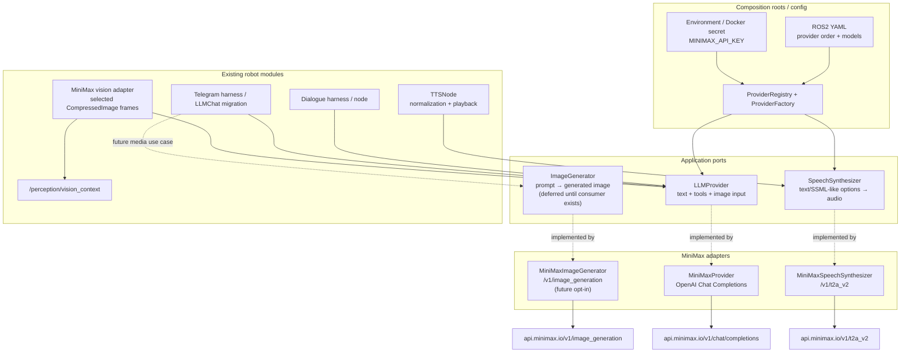

# Архитектура подключения MiniMax-провайдера

> Проектный документ для PR [#907](https://github.com/krikz/rob_box_project/pull/907).
> Архитектурное решение зафиксировано в [ADR-0002](../docs/adr/0002-minimax-provider.md).

## 1. Резюме решения

Добавляем **MiniMax** как ещё один адаптер существующего порта `LLMProvider`, не создавая отдельный LLM-стек и не меняя ROS2-контракты. Для OpenAI-compatible Chat Completions используется глобальный endpoint `https://api.minimax.io/v1` и модель `MiniMax-M3`.

Важно: **MiniMax и Xiaomi MiMo — разные провайдеры**. Уже добавленный в PR #907 `MiMoProvider` работает с `api.xiaomimimo.com`; он не является MiniMax-интеграцией.

Мультимодальные возможности разделяются по ответственности:

- text, tool calling, streaming и **понимание изображений** остаются в `LLMProvider`;
- TTS подключается к существующему `TTSNode` через отдельный порт `SpeechSynthesizer`;
- image generation не добавляется в `LLMProvider`: для неё нужен отдельный `ImageGenerator`, когда появится подтверждённый потребитель (первый кандидат — Telegram);
- непрерывная обработка видеопотока остаётся локальной задачей perception/AI HAT; MiniMax используется только для редкого семантического анализа выбранных кадров.

Это Ports & Adapters без нового сервиса, брокера, CQRS или event sourcing.

## 2. Контекст PR #907 и текущее состояние

PR #907 (`feature/harness-p0-foundation` → `develop`) на момент анализа содержит P0-фундамент:

- `src/rob_box_llm/rob_box_llm/provider.py` — `LLMProvider` с `complete()` и `stream()`;
- `LLMMessage`, `LLMResponse`, `LLMChunk`, `LLMSettings`, `ToolCall`, `ToolResult`;
- `src/rob_box_llm/rob_box_llm/providers/deepseek.py` — общий `_OpenAICompatibleProvider` и `DeepSeekProvider`;
- `src/rob_box_llm/rob_box_llm/providers/mimo.py` — Xiaomi MiMo;
- `FakeLLMProvider` и offline unit-тесты;
- типизированная иерархия `ProviderError`;
- `docs/adr/0001-harness-architecture.md` — целевая архитектура харнесов.

### 2.1 Ограничения текущего контракта

Текущий контракт пригоден для text-only MiniMax, но ещё не для vision:

1. `LLMMessage.content` имеет тип `str`; OpenAI-compatible vision требует упорядоченный список content parts (`text`, `image_url`).
2. `_to_openai_messages()` всегда сериализует `content` как строку.
3. У провайдера нет декларативного описания поддерживаемых возможностей.
4. `LLMSettings.extra` позволяет передать MiniMax-специфичные параметры, но не должно становиться основным публичным API.
5. Текущий streaming adapter передаёт текстовые delta, но не собирает streaming tool-call deltas. До исправления этого ограничения streaming + tools нельзя объявлять поддержанным.

### 2.2 Существующие потребители

- `DialogueNode` инициализирует OpenAI Agents SDK сам и хранит собственный `PROVIDERS` (`deepseek`, `mimo`).
- `Telegram LLMChat` самостоятельно строит HTTP-запросы и также хранит собственный `PROVIDERS`.
- `ProviderManager` в `rob_box_voice.llm` — legacy-реализация; новый P0-модуль намеренно её пока не заменяет.
- `VisionStubNode` подписывается на `sensor_msgs/CompressedImage` и публикует JSON в `/perception/vision_context`.
- `TTSNode` напрямую реализует Yandex TTS и Silero fallback, а затем публикует/проигрывает аудио.

Следовательно, безопасный путь — сначала расширить общий порт и добавить адаптер, затем переключать потребителей через конфигурацию. Нельзя добавлять третий независимый MiniMax-клиент в `DialogueNode` или `LLMChat`.

## 3. Бизнес-проблема и критерии простоты

### Что решаем

- единый MiniMax-провайдер для voice и Telegram без копипаста HTTP-клиента;
- возможность давать агенту семантический контекст выбранного кадра;
- опциональный облачный TTS с сохранением существующего локального fallback;
- конфигурируемое переключение провайдера без правки исходного кода;
- безопасное хранение ключа вне git.

### Самая простая альтернатива

Добавить `"minimax"` в словари `PROVIDERS` у `DialogueNode` и `LLMChat`. Это быстро, но создаёт две реализации сериализации, ошибок, vision-content и retry. Третья копия появится в perception. Цена поддержки выше краткосрочной экономии.

### Что будет, если не делать сейчас

Text-only MiniMax можно подключить локально за несколько строк, но каждая следующая возможность — vision, fallback, usage, TTS — закрепит дублирование. PR #907 уже создаёт правильную точку расширения, поэтому адаптер дешевле добавить до миграции потребителей.

## 4. Целевая архитектура



### Почему не один «универсальный MiniMaxProvider»

Chat, TTS и image generation имеют разные запросы, ответы, таймауты и потребителей. Добавление `generate_image()` и `synthesize()` в `LLMProvider` нарушит Interface Segregation: `DeepSeekProvider` будет обязан реализовать неподдерживаемые методы, а `DialogueNode` получит ненужные зависимости.

Общими остаются только конфигурация endpoint/ключа, наблюдаемость и отображение ошибок. Порты остаются capability-specific.

## 5. Изменения контракта `LLMProvider`

### 5.1 Backward-compatible multimodal content

Предлагаемая форма контракта (псевдокод, не готовая реализация):

```python
@dataclass(frozen=True)
class TextPart:
    text: str

@dataclass(frozen=True)
class ImagePart:
    source: str | bytes       # https/data URL либо байты CompressedImage
    media_type: str           # image/jpeg, image/png, image/webp, image/gif
    detail: str = "default"   # low | default | high

MessagePart = TextPart | ImagePart
MessageContent = str | tuple[MessagePart, ...]

@dataclass(frozen=True)
class LLMMessage:
    role: str
    content: MessageContent
    # остальные существующие поля без изменения
```

Инварианты:

- существующий `LLMMessage(role="user", content="text")` продолжает работать;
- parts остаются упорядоченными;
- `ImagePart` валидирует MIME type, detail и размер до сетевого вызова;
- bytes кодируются адаптером в data URL; URL не скачивается библиотекой без необходимости;
- `tool` и `assistant` messages не принимают image parts на первом этапе;
- в логи не попадают base64 и исходные кадры.

Стандартная OpenAI-compatible сериализация content parts должна находиться в общей реализации, а не только в MiniMax-классе. Это позволит подключать другие vision-capable провайдеры без изменения доменного контракта.

### 5.2 Capability introspection

Добавляется не абстрактное свойство с консервативным default, чтобы не сломать `DeepSeekProvider`, `MiMoProvider` и `FakeLLMProvider`:

```python
@dataclass(frozen=True)
class ProviderCapabilities:
    text: bool = True
    streaming_text: bool = False
    tools: bool = False
    streaming_tools: bool = False
    image_input: bool = False

class LLMProvider(ABC):
    @property
    def capabilities(self) -> ProviderCapabilities:
        return ProviderCapabilities()
```

`MiniMaxProvider(MiniMax-M3)` объявляет `text`, `streaming_text`, `tools`, `image_input`. `streaming_tools` включается только после тестов агрегации tool-call delta.

Capability проверяется до вызова API. `ProviderCapabilities` описывает максимум адаптера, а `capabilities_for(model)`/request validator сужает его для фактически выбранной модели. Это обязательно, потому что image input поддерживает `MiniMax-M3`, но не должен автоматически считаться доступным при `LLMSettings.model="MiniMax-M2.7"`. При несовместимом запросе возвращается типизированная `CapabilityUnavailableError`, а fallback выбирает только совместимый адаптер. Существующие DeepSeek/MiMo adapters в M0 также получают явные декларации покрытых тестами capabilities; default нужен только для fail-safe поведения неизвестных/сторонних реализаций.

### 5.3 MiniMax-specific параметры

Базовые настройки остаются в `LLMSettings`. MiniMax-специфичные параметры (`thinking`, `reasoning_split`, `max_completion_tokens`) на первом этапе задаются defaults адаптера и при необходимости передаются через `settings.extra`.

Правила:

- `settings.extra` не может переопределять `model`, `messages`, `stream` или credentials;
- для latency-sensitive voice default — `thinking={"type": "disabled"}`;
- для agentic/tool сценария значение конфигурируется, но полная assistant response должна сохраняться в history, как требует MiniMax для multi-turn tool use;
- reasoning не публикуется в TTS и Telegram пользователю;
- после стабилизации часто используемые параметры можно типизировать отдельным `MiniMaxOptions`, не раздувая общий `LLMSettings`.

## 6. Адаптер `MiniMaxProvider`

Предлагаемый путь: `src/rob_box_llm/rob_box_llm/providers/minimax.py`.

Класс наследуется от `_OpenAICompatibleProvider`, но MiniMax-специфика изолируется в hooks:

- `name = "minimax"`;
- `DEFAULT_BASE_URL = "https://api.minimax.io/v1"`;
- `DEFAULT_MODEL = "MiniMax-M3"`;
- capability declaration;
- default thinking policy;
- проверка мультимодальных ограничений;
- отображение MiniMax `base_resp.status_code`, если HTTP 200 содержит прикладную ошибку;
- сохранение полного assistant message для tool-call history на уровне будущего session/harness, без утечки raw SDK object в persistence.

Нельзя переиспользовать Anthropic endpoint в текущем адаптере: `_OpenAICompatibleProvider` построен на `AsyncOpenAI`. Использование `https://api.minimax.io/anthropic` потребует второго SDK и не даёт измеримой выгоды текущим потребителям.

## 7. Маппинг возможностей MiniMax на модули робота

| Возможность | Порт / адаптер | Текущий потребитель | Решение |
|---|---|---|---|
| Text chat | `LLMProvider` / `MiniMaxProvider` | Dialogue, Telegram | Поддержать сразу после расширения factory/config |
| Tool calling | `LLMProvider` | AgentSession/Dialogue/Telegram | Non-streaming сначала; сохранять полную assistant message |
| Streaming text | `LLMProvider.stream` | Dialogue | Разрешить без tools; fallback только до первого chunk |
| Image input / vision | тот же `LLMProvider`, `ImagePart` | `rob_box_perception` | Анализ выбранного кадра, публикация прежнего context schema |
| Image generation | отдельный `ImageGenerator` | подтверждённого runtime-потребителя пока нет; возможен Telegram | Не смешивать с perception; реализацию отложить до use case |
| TTS | `SpeechSynthesizer` / `MiniMaxSpeechSynthesizer` | `TTSNode` | Opt-in cloud provider, существующие Yandex/Silero остаются |

### 7.1 Vision / image input

MiniMax vision не заменяет YOLO и не должен получать каждый кадр камеры:

- локальная детекция нужна для low-latency и safety-critical поведения;
- cloud vision имеет latency, стоимость и зависит от сети;
- отправка полного видеопотока создаёт privacy и bandwidth риск.

Предлагаемый адаптер perception:

1. получает `CompressedImage`;
2. выбирает кадр по явному запросу или с низкой частотой;
3. проверяет TTL, MIME type и размер (MiniMax: до 10 MB на изображение);
4. формирует `LLMMessage` из `TextPart + ImagePart`;
5. вызывает `LLMProvider.complete()` с timeout/cancellation;
6. публикует JSON в существующий `/perception/vision_context` с полями `timestamp`, `source="minimax"`, `summary`/`scene_description`, `is_stub=false`;
7. при ошибке не публикует выдуманный контекст и не блокирует локальный perception.

ROS2 topic и базовая JSON-схема остаются совместимыми. Это защищает уже смерженные фазы.

### 7.2 Image generation

Image generation (`POST /v1/image_generation`, model `image-01`) — это создание медиа, а не восприятие окружения. Подключать её к `/perception/vision_context` неправильно.

Пока нет дисплея/печати/подтверждённой команды, самый простой выбор — только зафиксировать будущий порт `ImageGenerator` и не поставлять runtime-код. При появлении Telegram-команды адаптер должен возвращать bytes или durable artifact, потому что MiniMax URL живёт 24 часа. Генерация должна быть отдельным tool с auth/rate-limit и явным пользовательским запросом.

### 7.3 TTS

Перед добавлением MiniMax в `TTSNode` из него извлекается минимальный порт:

```python
class SpeechSynthesizer(Protocol):
    def synthesize(self, request: SpeechRequest) -> AudioResult: ...
```

`SpeechRequest` содержит text, voice, speed, volume, pitch и language; `AudioResult` — bytes/PCM, sample rate, channels и format. Адаптеры:

- `YandexSpeechSynthesizer` — существующий gRPC-код;
- `SileroSpeechSynthesizer` — существующий offline-код;
- `MiniMaxSpeechSynthesizer` — `POST /v1/t2a_v2`, модель `speech-2.8-turbo` как latency-oriented default или `speech-2.8-hd` для качества.

Первый этап MiniMax TTS — non-streaming HTTP. WebSocket/streaming добавляется только после измерения TTFA и после того, как playback pipeline научится принимать chunks. Аудио нормализуется в существующем TTSNode; ROS topics `/voice/dialogue/response`, `/voice/audio/speech`, `/voice/tts/state`, `/voice/tts/finished` не меняются.

Fallback TTS при opt-in: `minimax → yandex → silero`. По умолчанию сохраняется текущее поведение `yandex → silero`, поэтому добавление адаптера не меняет голос робота.

## 8. Конфигурация, секреты и factory

### 8.1 Конфигурационная модель

Не расширяем словари `PROVIDERS` в каждой ноде. В composition root вводится реестр provider id → factory. Концептуальный YAML:

```yaml
llm:
  provider_order: [minimax, mimo, deepseek]
  providers:
    minimax:
      model: MiniMax-M3
      base_url: https://api.minimax.io/v1
      api_key_env: MINIMAX_API_KEY
      timeout_sec: 90
      thinking: disabled

tts:
  provider_order: [yandex, silero]  # MiniMax включается явно
  providers:
    minimax:
      model: speech-2.8-turbo
      voice_id: <configured-system-voice-id>
      api_key_env: MINIMAX_API_KEY
```

На время миграции сохраняются старые flat ROS2-параметры `provider`, `model`, `base_url`, `fallback_model`. Factory переводит их во внутреннюю конфигурацию; потребители не читают env и не создают SDK client самостоятельно.

### 8.2 Секреты

- основной источник: Docker secret/env `MINIMAX_API_KEY`;
- `LLM_API_KEY` допускается как legacy fallback только на переходный период;
- ключ не хранится в ROS YAML, `.env.example`, логах, exceptions, snapshots или `LLMResponse.raw`;
- example-файл содержит только placeholder;
- `api_key` constructor argument сохраняется для unit-тестов и локального DI;
- production startup делает fail-fast для выбранного cloud provider, но отсутствие MiniMax key не ломает запуск, если MiniMax не выбран;
- ротация ключа выполняется заменой secret и перезапуском, а не коммитом.

### 8.3 Fallback

Fallback — decorator над портом, а не логика внутри MiniMax adapter:

- порядок конфигурируется отдельно для LLM и TTS;
- переключение разрешено для timeout, connection error, 429/квоты и configurable 5xx;
- auth error, invalid request, content safety и capability mismatch не ретраятся вслепую;
- мультимодальный запрос идёт только к провайдеру с `image_input=true`;
- streaming fallback разрешён только до первого опубликованного chunk;
- один provider вызывается не более одного раза за turn без отдельной retry policy;
- circuit breaker не нужен на первом этапе: достаточно bounded retry, метрик и cooldown in memory.

Fallback между моделями одного провайдера и fallback между провайдерами — разные политики. Существующий `fallback_model` можно сохранить, но provider fallback задаётся `provider_order`.

## 9. Ошибки, observability и безопасность

Все MiniMax ошибки отображаются в существующую иерархию:

- 401/прикладной auth code → `AuthError`;
- 429/rate limit/quota → `RateLimitError`;
- network/timeout → `TimeoutError`;
- safety/content policy → `ContentFilterError`;
- неподдерживаемый media request → `CapabilityUnavailableError`;
- прочие ответы → `ProviderError`.

Логируем: provider, model, capability, duration, attempt, status class, request/trace id, input/output token usage, image byte size/detail, TTS character/audio duration. Не логируем: API key, полный prompt/history, base64, изображения, синтезированное аудио и reasoning.

Минимальные метрики:

- `llm_requests_total{provider,capability,outcome}`;
- `llm_latency_seconds{provider,capability}`;
- `llm_fallback_total{from,to,reason}`;
- `llm_tokens_total{provider,direction}`;
- `tts_requests_total{provider,outcome}`;
- `tts_time_to_audio_seconds{provider}`.

## 10. Фазы внутри PR #907

Все фазы выполняются в одной feature-ветке и одном PR, но каждая должна быть additive и иметь отдельный набор тестов. Новая фаза не переписывает файлы предыдущей без изменения контракта и тестов.

### M0 — контракт, без изменения runtime

- добавить content parts и capability introspection в `rob_box_llm`;
- сохранить string-content API;
- добавить validation и offline tests;
- не трогать Dialogue/Telegram/ROS topics.

Gate: существующие тесты `rob_box_llm`, `rob_box_core` проходят без изменений потребителей.

### M1 — MiniMax text/tool adapter

- добавить `providers/minimax.py`;
- добавить fake-client tests для complete, stream, tools, errors, settings;
- экспортировать класс из package `__init__`;
- не включать provider по умолчанию.

Gate: нет сетевых тестов и секретов; текущие DeepSeek/MiMo snapshots не меняются.

### M2 — registry, config и fallback decorator

- добавить provider registry/factory рядом с shared LLM layer;
- резолвить secrets только в composition root;
- добавить fallback с capability filtering;
- legacy `ProviderManager` не удалять.

Gate: unit-тесты порядка, классификации ошибок и «не fallback после первого chunk».

### M3 — миграция потребителей под feature flag

- Dialogue и Telegram получают `LLMProvider` через DI/factory;
- старые параметры переводятся adapter layer;
- переключение на `minimax` — только конфигом;
- legacy пути остаются до parity/e2e.

Gate: e2e text/tool сценарии для текущих MiMo/DeepSeek и нового MiniMax; прежние defaults сохранены.

### M4 — vision adapter

- добавить image part serialization;
- perception adapter анализирует выбранные кадры;
- сохранить `/perception/vision_context` и schema compatibility;
- rate limit, TTL, cancellation и payload limits обязательны.

Gate: offline test с фиктивным JPEG и fake provider; при network error нет fabricated context.

### M5 — TTS adapter, opt-in

- извлечь `SpeechSynthesizer` без изменения ROS interface/playback;
- обернуть существующие Yandex/Silero реализации;
- добавить MiniMax non-streaming adapter;
- default chain оставить `yandex → silero`.

Gate: golden metadata tests для sample rate/format, fallback tests, существующие TTS tests.

### M6 — image generation только при принятом use case

- определить `ImageGenerator` и consumer contract;
- хранить результат как bytes/durable artifact, не 24-hour URL;
- добавить Telegram tool либо иной явный output adapter.

Если use case не принят, M6 исключается из PR: отсутствие неиспользуемого runtime-кода является осознанным KISS-решением.

## 11. Точки расширения и защита уже смерженных фаз

1. Публичный `LLMProvider` расширяется backward-compatible value objects и default capabilities; существующие сигнатуры методов сохраняются.
2. Каждый новый provider — новый файл + export; общая OpenAI-реализация меняется только через покрытый hook/serializer.
3. Provider selection находится в registry/factory, а не в нодах.
4. Capability-specific код не добавляется в `DialogueNode`.
5. ROS topics и payload schemas не переименовываются в provider PR.
6. Новый provider никогда не становится default в том же commit, где впервые добавлен.
7. Legacy `ProviderManager`, `DialogueNode.PROVIDERS` и `LLMChat.PROVIDERS` удаляются только после parity-тестов всех потребителей.
8. Fallback не скрывает contract/config ошибки и не выдаёт частично сгенерированный второй ответ после начала stream.
9. MiniMax feature commits не rebase/squash предыдущие фазы PR до review; конфликтующие изменения в shared contract согласуются через ADR.

## 12. Trade-off анализ

| Решение | Польза | Цена | Если не делать сейчас |
|---|---|---|---|
| Расширить `LLMMessage`, а не сделать MiniMax-only request | Один vision contract для всех providers | Больше value objects и validation | Vision API размножится по потребителям |
| Capability introspection | Безопасный fallback и fail-fast | Ещё один объект в public API | Ошибки будут обнаруживаться после сетевого вызова |
| Отдельный TTS port | Тестируемость и смена cloud/local adapters | Небольшой рефакторинг TTSNode | MiniMax TTS станет третьей веткой большого `if` |
| Отложить image generation consumer | Нет мёртвого кода | Возможность не доступна сразу | Ничего не ломается; добавить позже дёшево |
| OpenAI-compatible MiniMax API | Переиспользование текущего SDK/base class | Не используем все преимущества Anthropic API | Второй SDK усложнит P0 без бизнес-выгоды |
| In-process registry/fallback | KISS, достаточно для одного робота | Нет distributed circuit breaker | Текущая нагрузка не оправдывает сервис/broker |

## 13. Критерии приёмки

- `MiniMaxProvider` реализует существующие `complete()` и `stream()` и экспортируется публично.
- Text-only вызовы существующих providers не меняют сериализацию.
- Image input работает только для объявленной capability и модели `MiniMax-M3`.
- Нет API keys или media payloads в git/логах.
- Fallback детерминирован, ограничен и учитывает capability.
- Dialogue/Telegram выбирают provider через config/factory, а не через новый локальный HTTP-код.
- Vision не отправляет непрерывный поток и сохраняет `/perception/vision_context`.
- TTS addition opt-in; default `yandex → silero` и ROS topics сохранены.
- Unit-тесты полностью offline; optional live smoke test запускается только вручную при наличии `MINIMAX_API_KEY`.
- Документация и ADR обновляются в том же PR.

## 14. Источники

- PR #907: https://github.com/krikz/rob_box_project/pull/907
- ADR-0001: `docs/adr/0001-harness-architecture.md`
- MiniMax OpenAI SDK: https://platform.minimax.io/docs/api-reference/text-openai-api
- MiniMax Chat Completions: https://platform.minimax.io/docs/api-reference/text-chat-openai
- MiniMax model invocation/endpoints: https://platform.minimax.io/docs/guides/text-generation
- MiniMax models: https://platform.minimax.io/docs/guides/models-intro
- MiniMax image generation: https://platform.minimax.io/docs/guides/image-generation
- MiniMax TTS HTTP: https://platform.minimax.io/docs/api-reference/speech-t2a-http

## 9.1 TTS-специфичные детали (см. ADR-0003)

Этот документ покрывает MiniMax **в целом** (LLM/TTS/image-gen).
TTS-специфичные вопросы — маппинг `TTSSettings` ↔ MiniMax T2A v2 body,
контракт выходных данных `/voice/audio/speech`, retry-стратегия
на стороне `tts_node`, sync vs streaming решение (sync) и raw-bytes
vs base64 (raw hex-decode) — вынесены в отдельные документы:

- [`docs/adr/0003-minimax-tts-architecture.md`](docs/adr/0003-minimax-tts-architecture.md) — ADR с обоснованием решений и trade-offs.
- [`docs/architecture/minimax-tts-architecture.md`](docs/architecture/minimax-tts-architecture.md) — реализационный справочник: полные таблицы маппинга, цепочки преобразований, схема конфигурации.
- [`docs/diagrams/minimax-tts-sequence.mmd`](docs/diagrams/minimax-tts-sequence.mmd) — sequence-диаграмма end-to-end потока.

**Ключевые решения, зафиксированные в ADR-0003:**

1. Retry-loop реализуется **в tts_node, не в провайдере** (провайдер остаётся чистой raise-on-fail функцией).
2. Контракт топика `/voice/audio/speech` **не меняется** — `int16 LE PCM` через `audio_common_msgs/AudioData`, как у Yandex-пути.
3. Автоматический fallback MiniMax → Yandex → Silero **не делается** — пользователь явно выбрал MiniMax через `provider=minimax`, ошибка пробрасывается наверх.
4. Streaming v1 возвращает **один терминальный `TTSChunk`** (буферизует SSE); true chunk-per-frame через WebSocket — отложен в фазу M5/M6.
5. MiniMax отдаёт hex-encoded PCM — декодируется в `bytes.fromhex()`; альтернативы (base64/multipart) отклонены.
