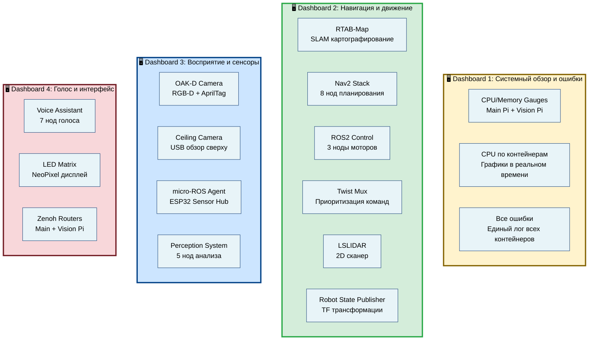
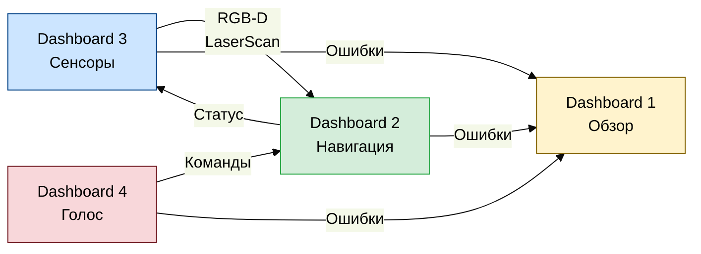

# Карта распределения нод по дашбордам

Визуальная схема распределения ROS 2 нод по четырем демонстрационным дашбордам.

## 📊 Схема распределения



## 🎯 Детальная карта нод

### Dashboard 1: Системный обзор и ошибки

**Тип:** Мониторинг инфраструктуры  
**Обновление:** 10 секунд

| Компонент | Метрики | Источник |
|-----------|---------|----------|
| Main Pi CPU | Gauge (%) | Prometheus |
| Main Pi Memory | Gauge (%) | Prometheus |
| Vision Pi CPU | Gauge (%) | Prometheus |
| Vision Pi Memory | Gauge (%) | Prometheus |
| CPU по контейнерам | Timeseries | cAdvisor |
| Все ошибки | Logs | Loki |

---

### Dashboard 2: Навигация и движение

**Контейнеры:** 6  
**Ноды:** ~18

```
rtabmap [Main Pi]
├── rtabmap (SLAM core)
├── rtabmapviz (visualizer)
└── icp_odometry (ICP одометрия)

nav2 [Main Pi]
├── bt_navigator (behavior tree)
├── controller_server (DWB контроллер)
├── planner_server (планировщик пути)
├── smoother_server (сглаживание пути)
├── waypoint_follower (следование точкам)
├── lifecycle_manager (менеджер жизненного цикла)
├── velocity_smoother (сглаживание скорости)
└── behavior_server (поведенческие действия)

ros2-control [Main Pi]
├── ros2_control_node (main node)
├── diff_drive_controller (differential drive)
└── joint_state_broadcaster (публикация состояний)

twist-mux [Main Pi]
└── twist_mux (мультиплексор команд)

lslidar [Main Pi]
└── lslidar_node (N10 LiDAR драйвер)

robot-state-publisher [Main Pi]
└── robot_state_publisher (TF публикация)
```

---

### Dashboard 3: Восприятие и сенсоры

**Контейнеры:** 4  
**Ноды:** ~10

```
oak-d [Vision Pi]
├── oak (OAK-D camera driver)
├── oakd (camera publisher)
└── apriltag_node (AprilTag detector)

ceiling-camera [Vision Pi]
├── usb_cam (USB camera driver)
└── ceiling_camera (camera publisher)


perception [Main Pi]
├── health_monitor (система мониторинга)
├── context_aggregator (агрегатор контекста)
├── reflection_node (внутренний диалог)
├── vision_stub (обработка видео)
└── startup_greeting (приветствие)
```

---

### Dashboard 4: Голос и интерфейс

**Контейнеры:** 4  
**Ноды:** ~10

```
voice-assistant [Vision Pi]
├── audio_node (обработка аудио ReSpeaker)
├── led_node (LED индикаторы ReSpeaker)
├── dialogue_node (диалоговая система DeepSeek)
├── tts_node (синтез речи Silero v4)
├── stt_node (распознавание речи Vosk)
├── sound_node (звуковые эффекты)
└── command_node (команды навигации)

led-matrix [Vision Pi]
└── led_matrix_compositor (NeoPixel LED)

zenoh-router [Main Pi]
└── zenoh (DDS router)

zenoh-router-vision [Vision Pi]
└── zenoh (DDS router)
```

---

## 📍 Физическое расположение нод

### Main Pi (10.1.1.10)
- **Навигация:** rtabmap, nav2, robot-state-publisher, twist-mux, lslidar
- **Управление:** ros2-control
- **Восприятие:** perception (health, context, reflection)

### Vision Pi (10.1.1.11)
- **Камеры:** oak-d, ceiling-camera
- **Голос:** voice-assistant (7 nodes)
- **Интерфейс:** led-matrix
- **Связь:** zenoh-router-vision

---

## 🔄 Поток данных между дашбордами



**Легенда:**
- Dashboard 1 — агрегация метрик и ошибок со всех систем
- Dashboard 2 — потребляет данные сенсоров и голосовые команды
- Dashboard 3 — поставляет сенсорные данные для навигации
- Dashboard 4 — отправляет голосовые команды в навигацию

---

## 🎨 Цветовая кодировка

Для быстрого визуального различения дашбордов:

| Dashboard | Цвет границы | HEX | Назначение |
|-----------|-------------|-----|------------|
| Dashboard 1 | 🟨 Желтый | #856404 | Системный обзор |
| Dashboard 2 | 🟩 Зеленый | #28a745 | Навигация |
| Dashboard 3 | 🟦 Синий | #004085 | Восприятие |
| Dashboard 4 | 🟥 Красный | #721c24 | Голос |

---

## 📊 Статистика нод

| Категория | Контейнеров | Нод | Ключевые топики |
|-----------|-------------|-----|-----------------|
| **Навигация** | 6 | ~18 | /scan, /odom, /cmd_vel, /map |
| **Восприятие** | 4 | ~10 | /camera/*, /detections, /imu |
| **Голос** | 4 | ~10 | /audio/*, /dialogue/*, /led/* |
| **Всего** | 14 | ~38 | ~50+ топиков |

---

## 🔍 Использование

### Быстрый поиск ноды

**Навигация:**
```bash
# Найти ноду в Dashboard 2
ros2 node list | grep -E "(rtabmap|nav2|control|twist|lidar|state)"
```

**Восприятие:**
```bash
# Найти ноду в Dashboard 3
ros2 node list | grep -E "(oak|camera|health|context|reflection|vision)"
```

**Голос:**
```bash
# Найти ноду в Dashboard 4
ros2 node list | grep -E "(audio|led|dialogue|tts|stt|sound|command|zenoh)"
```

### Отладка по дашбордам

**Проблемы с движением?** → Смотрите Dashboard 2 (Навигация)  
**Проблемы с камерой?** → Смотрите Dashboard 3 (Восприятие)  
**Проблемы с голосом?** → Смотрите Dashboard 4 (Голос)  
**Общие ошибки?** → Смотрите Dashboard 1 (Обзор)

---

**Автор:** Rob Box Team  
**Дата:** 2025-11-01  
**Версия:** 1.0
