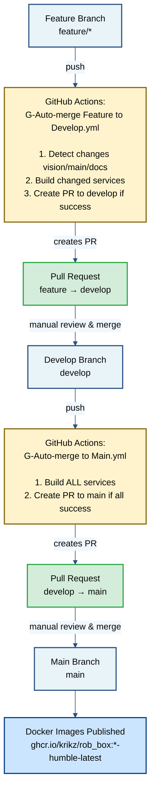

# CI/CD Pipeline Documentation

Автоматизированная система сборки и деплоя для rob_box_project.

## Документация

- **[Deployment Workflow Guide](DEPLOYMENT_WORKFLOW.md)** - Подробное руководство по automated deployment
- Этот документ - Overview CI/CD системы

## Архитектура Pipeline



## Workflows

### Naming Convention

Все workflows следуют единой схеме именования:

- **G-** prefix - GitHub Actions workflows (`runs-on: ubuntu-latest`)
  - Сборка на облачных runners GitHub
  - Публикация в `ghcr.io`
  - Медленнее, но не требует локальной инфраструктуры

- **L-** prefix - Local self-hosted runner workflows (`runs-on: self-hosted`)
  - Сборка на локальном build machine
  - Публикация в локальный registry (`localhost:5000`)
  - В 10-20x быстрее для Raspberry Pi
  - Требует настроенный build machine

**Примеры:**
- `G-Build Base Images.yml` - сборка базовых образов на GitHub Actions
- `L-Build Base Images.yml` - сборка базовых образов на локальном runner
- `G-Build All Services.yml` - полная сборка на GitHub Actions
- `L-Build All Services.yml` - полная сборка на локальном runner

### 1. Create PR Feature to Develop

**Файл:** `.github/workflows/G-Auto-merge Feature to Develop.yml`

**Триггер:**
```yaml
push:
  branches:
    - 'feature/**'
    - 'feat/**'
    - 'copilot/**'
```

**Логика:**
1. **Detect Changes** - определяет какие сервисы изменились
   - Vision Pi (`docker/vision/**`)
   - Main Pi (`docker/main/**`)
   - Documentation (`docs/**`)

2. **Conditional Build** - собирает только изменённые сервисы
   - `build-vision` - если изменились Vision Pi сервисы
   - `build-main` - если изменились Main Pi сервисы
   - Пропускает сборку если изменилась только документация

3. **Create Pull Request** - после успешной сборки
   - Проверяет, существует ли уже PR
   - Создаёт новый PR если его нет
   - Добавляет label `autobuild`
   - Включает информацию о собранных компонентах

**Результат:**
- Создаётся PR: feature ветка → `develop`
- Docker images: `*-humble-test`
- PR готов для ревью и ручного мерджа
- Feature ветка НЕ удаляется автоматически

### 2. Create PR Develop to Main

**Файл:** `.github/workflows/G-Auto-merge to Main.yml`

**Триггер:**
```yaml
push:
  branches:
    - develop
```

**Логика:**
1. **Build All Services** - собирает ВСЕ сервисы через `G-Build All Services.yml`
   - Base images (ros2-zenoh)
   - Vision Pi (oak-d, lslidar, apriltag, led-matrix, voice-assistant)
   - Main Pi (micro-ros-agent, zenoh-router)

2. **Create Pull Request** - если ВСЕ сборки успешны
   - Проверяет, существует ли уже PR
   - Создаёт новый PR если его нет
   - Добавляет labels `release` и `autobuild`
   - Включает полный список собранных сервисов

**Результат:**
- Создаётся PR: `develop` → `main`
- Docker images: `*-humble-dev` (для тестирования перед релизом)
- PR готов для ревью и ручного мерджа
- После мерджа в main будут созданы образы `*-humble-latest`

### 3. Build Vision Services (GitHub Actions)

**Файл:** `.github/workflows/G-Build Vision Pi Services.yml`

**Сервисы:**
- `oak-d` - OAK-D camera
- `lslidar` - LSLIDAR N10
- `led-matrix` - NeoPixel LED matrix driver
- `voice-assistant` - Voice assistant + animations
- `perception` - Perception nodes

**Платформа:** `linux/arm64` (Raspberry Pi 5)
**Runner:** `ubuntu-latest` (GitHub Actions)

### 4. Build Main Services (GitHub Actions)

**Файл:** `.github/workflows/G-Build Main Pi Services.yml`

**Сервисы:**
- `robot-state-publisher` - Robot state publisher
- `rtabmap` - RTAB-Map SLAM
- `twist-mux` - Twist multiplexer
- `micro-ros-agent` - micro-ROS bridge
- `ros2-control` - ROS 2 Control
- `nav2` - Nav2 navigation stack
- `lslidar` - LSLIDAR N10 driver
- `perception` - Perception nodes

**Платформа:** `linux/arm64` (Raspberry Pi 5)
**Runner:** `ubuntu-latest` (GitHub Actions)

### 5. Build Base Images (GitHub Actions)

**Файл:** `.github/workflows/G-Build Base Images.yml`

**Образы:**
- `ros2-zenoh` - ROS 2 Humble + Zenoh middleware
- `rtabmap` - RTAB-Map base image
- `depthai` - DepthAI для OAK-D камеры
- `pcl` - Point Cloud Library для лидаров

**Платформа:** `linux/arm64` (Raspberry Pi 5)
**Runner:** `ubuntu-latest` (GitHub Actions)
**Registry:** `ghcr.io/krikz/rob_box_base`

### 6. Build All Services (GitHub Actions)

**Файл:** `.github/workflows/G-Build All Services.yml`

**Назначение:** Полная сборка всех образов проекта на GitHub Actions

**Вызывает workflows:**
- `G-Build Base Images.yml`
- `G-Build Main Pi Services.yml`
- `G-Build Vision Pi Services.yml`

**Триггеры:**
- `push` в ветку `main` (автоматически)
- `workflow_dispatch` (ручной запуск)
- `workflow_call` (вызов из других workflows)
- `schedule` (ночная сборка в 3:00 UTC)

### 7. Build Base Images (Local Runner)

**Файл:** `.github/workflows/L-Build Base Images.yml`

**Образы:**
- `ros2-zenoh` - ROS 2 Humble + Zenoh middleware
- `rtabmap` - RTAB-Map base image
- `depthai` - DepthAI для OAK-D камеры
- `pcl` - Point Cloud Library для лидаров

**Платформа:** `linux/arm64` (Raspberry Pi 5)
**Runner:** `self-hosted` (локальный build machine)
**Registry:** `localhost:5000/krikz/rob_box_base` + `ghcr.io/krikz/rob_box_base`
**Особенности:**
- Использует локальный APT cache (`http://host.docker.internal:3142`)
- В 2-3x быстрее чем GitHub Actions
- Публикует в локальный registry для быстрого pull на Raspberry Pi

### 8. Build Vision Services (Local Runner)

**Файл:** `.github/workflows/L-Build Vision Pi Services.yml`

Аналог `G-Build Vision Pi Services.yml`, но:
- Собирается на локальном build machine
- Использует локальный APT cache
- Публикует в `localhost:5000`

### 9. Build Main Services (Local Runner)

**Файл:** `.github/workflows/L-Build Main Pi Services.yml`

Аналог `G-Build Main Pi Services.yml`, но:
- Собирается на локальном build machine
- Использует локальный APT cache
- Публикует в `localhost:5000`

### 10. Build All Services (Local Runner)

**Файл:** `.github/workflows/L-Build All Services.yml`

**Назначение:** Полная сборка всех образов на локальном build machine

**Вызывает workflows:**
- `L-Build Base Images.yml` (опционально, если `build_base_images=true`)
- `L-Build Main Pi Services.yml`
- `L-Build Vision Pi Services.yml`

**Триггеры:**
- `workflow_dispatch` (только ручной запуск)

**Inputs:**
- `build_base_images` (boolean, default: `false`) - собирать ли базовые образы
- `push_to_registry` (boolean, default: `true`) - публиковать ли в локальный registry

**Особенности:**
- В 10-20x быстрее для Raspberry Pi (локальный pull)
- Требует настроенный build machine с self-hosted runner

### 11. Build Single Service (Local Runner)

**Файл:** `.github/workflows/L-Build Single Service.yml`

**Назначение:** Оперативная сборка одного выбранного сервиса на локальном build machine

**Триггеры:**
- `workflow_dispatch` (только ручной запуск)

**Inputs:**
- `branch` (string, required) - ветка для сборки (например, `main`, `develop`, `feature/xyz`)
- `pi_type` (choice, required) - тип Pi: `main`, `vision`, или `base`
- `service` (string, required) - название сервиса для сборки
- `push_to_registry` (boolean, default: `true`) - публиковать ли в локальный registry
- `create_issue_on_failure` (boolean, default: `true`) - создавать GitHub issue при ошибке сборки

**Доступные сервисы:**

Main Pi:
- `robot-state-publisher` / `robot_state_publisher`
- `rtabmap`
- `twist-mux` / `twist_mux`
- `micro-ros-agent` / `micro_ros_agent`
- `ros2-control` / `ros2_control`
- `nav2`
- `lslidar`
- `perception`
- `zenoh-router`

Vision Pi:
- `oak-d`
- `led-matrix` / `led_matrix`
- `ceiling-camera`
- `voice-assistant` / `voice_assistant`
- `apriltag`
- `zenoh-router`

Base images:
- `ros2-zenoh`
- `rtabmap`
- `depthai`
- `pcl`

**Особенности:**
- Позволяет быстро пересобрать один конкретный образ без сборки всех сервисов
- Автоматически определяет все параметры сборки (Dockerfile, контекст, базовый образ) на основе выбранного сервиса
- Поддерживает выбор произвольной ветки для сборки
- Идеально для итеративной разработки и быстрого тестирования изменений
- Экономит время: сборка одного сервиса занимает 1-5 минут вместо 30-60 минут для всех сервисов
- Автоматически создает GitHub issue при ошибке сборки с детальной информацией

**Пример использования:**
1. Открыть GitHub Actions в репозитории
2. Выбрать workflow "L: Build Single Service"
3. Нажать "Run workflow"
4. Заполнить параметры:
   - Branch: `develop`
   - Pi type: `vision`
   - Service: `voice-assistant`
   - Push to registry: `true`
   - Create issue on failure: `true`
5. Запустить workflow

### 12. Deploy and Verify (Manual Deployment)

**Файл:** `.github/workflows/L-Deploy and Verify.yml`

**Назначение:** Автоматизированный деплой и проверка работоспособности робота

**Триггер:**
- `workflow_dispatch` (только ручной запуск)

**Inputs:**
- `branch` - ветка для деплоя (main/develop/feature/test)
- `environment` - целевое окружение (production/staging/test)
- `registry_source` - источник Docker образов (skip/github/local)
- `dry_run` - сухой прогон без реального деплоя

**Процесс:**
1. SSH подключение к обоим Pi
2. Остановка контейнеров (`docker compose down`)
3. Обновление кода из выбранной ветки (`git pull`)
4. Загрузка свежих Docker образов (`docker compose pull`)
5. Запуск контейнеров (`docker compose up -d`)
6. Проверка здоровья контейнеров
7. Анализ логов на ошибки
8. Проверка ROS2 топиков
9. Автоматическое создание GitHub Issue при проблемах

**Issue Assignment:**
- Критические ошибки → @krikz (label: `bug`, `critical`, `deployment`)
- Предупреждения → @krikz (label: `bug`, `deployment`)

**Подробная документация:** См. [DEPLOYMENT_WORKFLOW.md](DEPLOYMENT_WORKFLOW.md)

## Docker Image Tags

### Tag Naming Convention

```
ghcr.io/krikz/rob_box:<service>-<distro>-<version>
```

**Примеры:**
- `ghcr.io/krikz/rob_box:voice-assistant-humble-latest`
- `ghcr.io/krikz/rob_box:voice-assistant-humble-dev`
- `ghcr.io/krikz/rob_box:voice-assistant-humble-test`
- `ghcr.io/krikz/rob_box:voice-assistant-humble-abc1234` (SHA)

### Tags по веткам

| Ветка | Tag | Описание | Env файл |
|-------|-----|----------|----------|
| `main` | `humble-latest` | Продакшн, стабильная версия | `.env.main` |
| `develop` | `humble-dev` | Development, тестирование | `.env.develop` |
| `feature/*` | `humble-test` | Feature testing | `.env.feature` |
| `release/X.X.X` | `humble-rc-X.X.X` | Release candidate | `.env.develop` + override |
| `hotfix/*` | `humble-hotfix-X.X.X` | Hotfix | `.env.main` + override |
| SHA commit | `humble-<sha>` | Специфичная версия | - |

### Автоматическое управление тегами

Docker-compose файлы теперь используют переменные окружения для определения тегов:

```yaml
services:
  voice-assistant:
    image: ${SERVICE_IMAGE_PREFIX}:voice-assistant-${ROS_DISTRO}-${IMAGE_TAG}
```

**Настройка тегов для текущей ветки:**

```bash
# Автоматически определить ветку и установить правильный IMAGE_TAG
source scripts/set-docker-tags.sh

# Или вручную установить нужный тег
export IMAGE_TAG=dev  # или latest, test, rc-1.0.0
```

**Готовые конфигурации в env файлах:**

- `docker/.env.main` → `IMAGE_TAG=latest` (production)
- `docker/.env.develop` → `IMAGE_TAG=dev` (development)
- `docker/.env.feature` → `IMAGE_TAG=test` (testing)

## Workflow для разработчика

### Создание новой фичи

```bash
# 1. Создать feature ветку от develop
git checkout develop
git pull origin develop
git checkout -b feature/my-awesome-feature

# 2. Разработка
# ... внести изменения ...

# 3. Коммит и push
git add .
git commit -m "feat: add awesome feature"
git push origin feature/my-awesome-feature

# 4. GitHub Actions автоматически:
#    - Соберёт изменённые сервисы
#    - Создаст Pull Request в develop
#    - PR будет помечен label 'autobuild'

# 5. После ревью:
#    - Проверить изменения в PR
#    - Сделать merge PR вручную через GitHub UI
#    - Удалить feature ветку (опционально)
```

**Результат:** Pull Request создан автоматически, но merge требует ручного подтверждения.

### Релиз в production

```bash
# 1. Убедиться что develop стабилен
# - Протестировать на реальном железе
# - Проверить все сервисы

# 2. Merge всех feature PRs в develop
#    - Проверить что все PR прошли ревью
#    - Сделать merge через GitHub UI

# 3. Push в develop (если изменения были локальные)
git checkout develop
git pull
git push origin develop

# 4. GitHub Actions автоматически:
#    - Соберёт ВСЕ сервисы
#    - Создаст Pull Request в main
#    - PR будет помечен labels 'release' и 'autobuild'

# 5. Перед релизом:
#    - Проверить PR develop → main
#    - Протестировать образы с тегом -dev
#    - Убедиться что всё готово к продакшн

# 6. Сделать merge PR вручную через GitHub UI
#    - Это запустит сборку образов с тегом -latest
```

**Результат:** Pull Request создан автоматически, но merge в main требует ручного подтверждения перед релизом.

### Создание релиза с версией

После успешного мерджа в `main`, создайте тег релиза:

```bash
# 1. Убедиться что вы на ветке main с последними изменениями
git checkout main
git pull origin main

# 2. Создать релиз автоматически (интерактивный режим)
./scripts/create_release.sh

# Скрипт:
# - Найдёт последнюю версию из git тегов
# - Предложит выбрать тип релиза (major/minor/patch)
# - Автоматически вычислит следующую версию
# - Создаст аннотированный git тег
# - Опционально отправит тег в GitHub

# 3. Альтернативно: создать релиз в автоматическом режиме
./scripts/create_release.sh minor   # для minor релиза
./scripts/create_release.sh major   # для major релиза
./scripts/create_release.sh patch   # для patch релиза

# 4. После создания тега, создать GitHub Release
# Перейти на: https://github.com/krikz/rob_box_project/releases/new
# Или использовать GitHub CLI:
gh release create v1.2.0 --generate-notes
```

**Семантическое версионирование:**
- **Major (X.0.0)** - несовместимые изменения API
- **Minor (x.Y.0)** - новая функциональность, обратно совместимо  
- **Patch (x.y.Z)** - исправления ошибок

### Hotfix

```bash
# 1. Создать hotfix ветку от main
git checkout main
git pull origin main
git checkout -b hotfix/critical-fix

# 2. Исправление
# ... внести изменения ...

# 3. Коммит и push
git add .
git commit -m "fix: critical bug"
git push origin hotfix/critical-fix

# 4. Создать PR в main вручную
# 5. После мерджа в main - cherry-pick в develop
git checkout develop
git cherry-pick <commit-hash>
git push origin develop
```

## Ручное управление

### Управление Pull Requests

После успешной сборки автоматически создаются PRs, которые нужно мерджить вручную:

**Feature → Develop:**
1. Перейти в GitHub → Pull Requests
2. Найти PR с label `autobuild`
3. Проверить изменения
4. Нажать "Merge pull request"
5. Опционально удалить feature ветку

**Develop → Main:**
1. Перейти в GitHub → Pull Requests
2. Найти PR с labels `release` и `autobuild`
3. Проверить все изменения с последнего релиза
4. Протестировать образы с тегом `-dev`
5. Нажать "Merge pull request" когда готово к релизу

### Отключить автоматическое создание PR

Если нужно отключить автоматическое создание PR, закомментировать trigger в workflow:

```yaml
# Отключить создание PR для feature веток
on:
  push:
    branches:
      - 'DISABLED-feature/**'  # Добавить DISABLED-
```

### Ручной trigger сборки

```bash
# Через GitHub CLI
gh workflow run "G-Build Vision Pi Services.yml" --ref develop

# Или через web interface
# GitHub → Actions → Build Vision Pi Services → Run workflow
```

### Откат изменений

```bash
# Откатить develop к предыдущему коммиту
git checkout develop
git reset --hard HEAD~1
git push origin develop --force

# Откатить main (ОСТОРОЖНО!)
git checkout main
git reset --hard <commit-hash>
git push origin main --force

# Лучше создать revert commit
git checkout main
git revert <bad-commit-hash>
git push origin main
```

## Мониторинг Pipeline

### GitHub Actions UI

1. Перейти на GitHub → Actions
2. Выбрать workflow
3. Просмотреть историю запусков
4. Проверить логи

### Уведомления

Настроить GitHub Notifications:
- Settings → Notifications
- Watch repository
- Custom: Actions

### Статусы

Проверить статус сборки:
```bash
# Через GitHub CLI
gh run list --workflow="G-Build Vision Pi Services.yml"

# Последний статус
gh run view --log
```

## Troubleshooting

### Feature ветка не создаёт PR

**Причины:**
1. Сборка упала - проверить логи в Actions
2. PR уже существует для этой ветки
3. Workflow disabled - проверить `.github/workflows/`

**Решение:**
```bash
# Проверить логи workflow
gh run list --workflow="G-Auto-merge Feature to Develop.yml"

# Создать PR вручную если нужно
gh pr create --base develop --head feature/my-feature \
  --title "feat: my feature" \
  --body "Manual PR creation"
```

### Develop не создаёт PR в main

**Причины:**
1. Хотя бы одна сборка упала - все сервисы должны собираться
2. PR уже существует
3. Workflow не запустился

**Решение:**
```bash
# Проверить что всё собирается
gh workflow run "G-Build All Services.yml" --ref develop

# Проверить статус
gh run list --workflow="G-Auto-merge to Main.yml"

# Создать PR вручную если нужно
gh pr create --base main --head develop \
  --title "chore: release to main" \
  --body "Manual release PR"
```

### PR создан но не мерджится автоматически

**Это нормальное поведение!** После изменений workflow больше НЕ делает автоматический merge.

**Действия:**
1. Перейти в GitHub UI
2. Найти созданный PR
3. Проверить изменения
4. Сделать merge вручную когда готово

### Docker образы не публикуются

**Причины:**
1. Нет прав на ghcr.io
2. Сборка упала
3. Wrong platform (должен быть linux/arm64)

**Решение:**
```bash
# Проверить секреты
gh secret list

# Проверить permissions в workflow
# permissions:
#   contents: read
#   packages: write
```

### Неправильные теги Docker образов

**Проблема:** docker-compose использует `-latest` образы вместо `-dev` или `-test`

**Решение:**
```bash
# Автоматическая настройка на основе текущей ветки
cd /path/to/rob_box_project
source scripts/set-docker-tags.sh

# Проверить что IMAGE_TAG установлен правильно
echo $IMAGE_TAG

# Или вручную установить нужный тег
export IMAGE_TAG=dev
```

## Локальная разработка и сборка

### Локальная сборка Docker образов

Для ускорения разработки можно собирать образы локально, не дожидаясь GitHub Actions:

```bash
# Собрать один сервис
./scripts/local-build.sh voice-assistant

# Собрать все Vision Pi сервисы
./scripts/local-build.sh vision

# Собрать все Main Pi сервисы
./scripts/local-build.sh main

# Собрать все сервисы
./scripts/local-build.sh all

# Собрать для конкретной платформы
./scripts/local-build.sh voice-assistant linux/amd64
```

**Примечание:** Локальная сборка создаёт образы с тегом `IMAGE_TAG=local`. Они будут использованы если запустить `docker-compose` с `IMAGE_TAG=local`.

### Запуск GitHub Actions локально с act

Установите [act](https://github.com/nektos/act) для запуска workflows локально:

```bash
# Установка
brew install act  # macOS
curl https://raw.githubusercontent.com/nektos/act/master/install.sh | sudo bash  # Linux

# Список всех workflows
act -l

# Запуск конкретного workflow (dry run)
act -W ".github/workflows/G-Build Vision Pi Services.yml" -n

# Запуск конкретного job
act -j build-oak-d

# Запуск с секретами
echo "GITHUB_TOKEN=ghp_xxx" > .secrets
act --secret-file .secrets
```

**Важно:** 
- Сборка ARM64 образов на x86_64 будет очень медленной через QEMU
- Для разработки рекомендуется использовать `./scripts/local-build.sh` вместо act
- act полезен для тестирования логики workflows, но не для реальной сборки образов

### Быстрая итерация при разработке

**Сценарий 1: Разработка на x86_64, деплой на Raspberry Pi**

```bash
# 1. Настроить теги для текущей ветки
source scripts/set-docker-tags.sh

# 2. Собрать образ для x86_64 (быстрая разработка)
IMAGE_TAG=local ./scripts/local-build.sh voice-assistant linux/amd64

# 3. Протестировать локально
cd docker/vision
IMAGE_TAG=local docker-compose up voice-assistant

# 4. Запушить изменения - GitHub Actions соберёт для ARM64
git add .
git commit -m "feat: update voice assistant"
git push

# 5. Через ~10 минут образ с правильным тегом будет на ghcr.io
# 6. На Raspberry Pi выполнить:
ssh ros2@10.1.1.21
cd ~/rob_box_project/docker/vision
source ../../scripts/set-docker-tags.sh
docker-compose pull voice-assistant
docker-compose up -d voice-assistant
```

**Сценарий 2: Разработка непосредственно на Raspberry Pi**

```bash
# 1. SSH на Raspberry Pi
ssh ros2@10.1.1.21

# 2. Перейти в проект
cd ~/rob_box_project

# 3. Настроить теги
source scripts/set-docker-tags.sh

# 4. Собрать образ локально (нативный ARM64)
IMAGE_TAG=local ./scripts/local-build.sh voice-assistant

# 5. Запустить
cd docker/vision
IMAGE_TAG=local docker-compose up -d voice-assistant

# 6. Проверить логи
docker logs -f voice-assistant
```

### Переключение между окружениями

```bash
# Production (main branch images)
source scripts/set-docker-tags.sh  # автоматически определит main
cd docker/vision && docker-compose pull && docker-compose up -d

# Development (develop branch images)
export IMAGE_TAG=dev
cd docker/vision && docker-compose pull && docker-compose up -d

# Local testing (locally built images)
export IMAGE_TAG=local
cd docker/vision && docker-compose up -d

# Specific version
export IMAGE_TAG=rc-1.0.0
cd docker/vision && docker-compose pull && docker-compose up -d
```

## Best Practices

1. **Feature ветки:**
   - Короткие имена: `feature/voice-assistant`, `feat/led-fix`
   - Одна фича - одна ветка
   - Регулярно rebase на develop

2. **Коммиты:**
   - Conventional commits: `feat:`, `fix:`, `docs:`, `refactor:`
   - Описательные сообщения
   - Один логический change на коммит

3. **Тестирование:**
   - Тестировать локально перед push
   - Использовать `-dev` образы для staging
   - Проверять на реальном железе перед main

4. **Деплой:**
   - Develop → staging/testing
   - Main → production
   - Rollback через release tags

## Build Machine Infrastructure (Локальная сборка)

### Обзор

**Проблема:** Сборка образов на GitHub Actions и загрузка на Raspberry Pi через интернет занимает 25-35 минут.

**Решение:** Build machine в локальной сети (10.1.1.x) с:
- GitHub Actions self-hosted runner (локальная сборка)
- Docker Registry (локальное хранилище образов)
- APT Cacher NG (кэш пакетов)

**Результат:** Обновление Raspberry Pi занимает 3-5 минут (10-20x быстрее).

### Архитектура с Build Machine

```
┌─────────────────────────────────────────────────────────┐
│ GitHub Repository                                       │
│ (код, workflows, issues)                                │
└────────┬────────────────────────────────────────────────┘
         │
         ▼
┌─────────────────────────────────────────────────────────┐
│ Build Machine (10.1.1.5) - Локальная сеть              │
│                                                         │
│ ┌──────────────────┐  ┌──────────────┐  ┌────────────┐│
│ │ GitHub Runner    │  │ Registry     │  │ APT Cache  ││
│ │ (self-hosted)    │  │ :5000        │  │ :3142      ││
│ │ - Builds locally │  │ - Fast pull  │  │ - Cached   ││
│ │ - Uses APT cache │  │ - No internet│  │   packages ││
│ └────────┬─────────┘  └──────┬───────┘  └────────────┘│
└──────────┼────────────────────┼─────────────────────────┘
           │                    │
           ├────────────────────┤
           │                    │
   ┌───────▼─────┐      ┌───────▼─────┐
   │ Main Pi     │      │ Vision Pi   │
   │ 10.1.1.20   │      │ 10.1.1.21   │
   │ pull: 30sec │      │ pull: 30sec │
   └─────────────┘      └─────────────┘
```

### Установка Build Machine

```bash
# 1. На build machine
git clone https://github.com/krikz/rob_box_project.git
cd rob_box_project/docker/build

# 2. Настройка GitHub токена
cp .env.secrets.example .env.secrets
nano .env.secrets  # Добавить GITHUB_TOKEN

# 3. Запуск инфраструктуры
./scripts/setup.sh

# 3.1. Для x86_64: настроить QEMU для кросс-компиляции
# sudo apt-get install -y qemu-user-static binfmt-support
# docker run --rm --privileged multiarch/qemu-user-static --reset -p yes
# docker buildx create --name multiarch --driver docker-container --use

# 4. Проверка
./scripts/check_status.sh
```

**Документация:** `docker/build/README.md`, `docker/build/QUICKSTART.md`

**Примечание:** Build machine может работать на x86_64 или ARM64. На x86_64 образы кросс-компилируются через QEMU (медленнее, но всё равно быстрее GitHub Actions).

### Настройка Raspberry Pi для Build Machine

```bash
# На каждом Raspberry Pi
BUILD_MACHINE_IP=10.1.1.5 ./configure_raspberry_pi.sh
```

Скрипт настроит:
- Docker для pull из локального registry
- APT для использования локального кэша

### Использование в CI/CD

#### Вариант 1: Self-Hosted Runner (рекомендуется)

Измените workflow для использования self-hosted runner:

```yaml
jobs:
  build-oak-d:
    runs-on: self-hosted  # ← было: ubuntu-latest
    
    steps:
      - name: Build Docker image
        uses: docker/build-push-action@v5
        with:
          # Сборка происходит локально на build machine
          # APT cache используется автоматически
          # Результат попадает в локальный registry
```

**Преимущества:**
- ✅ 10-20x быстрее pull на Raspberry Pi
- ✅ 3-5x быстрее сборка (APT cache)
- ✅ Работает без интернета
- ✅ Экономия трафика

#### Вариант 2: Hybrid (GitHub + Local Registry)

Оставить сборку на GitHub Actions, но дублировать в локальный registry:

```yaml
jobs:
  build-oak-d:
    runs-on: ubuntu-latest  # Сборка на GitHub
    
    steps:
      - name: Build and push to ghcr.io
        uses: docker/build-push-action@v5
        with:
          push: true
          tags: ghcr.io/krikz/rob_box:oak-d-humble-latest
      
      # Дополнительно: копирование в локальный registry
      - name: Copy to local registry
        if: github.ref == 'refs/heads/main'
        run: |
          # Выполнится на build machine через self-hosted runner
          docker pull ghcr.io/krikz/rob_box:oak-d-humble-latest
          docker tag ghcr.io/krikz/rob_box:oak-d-humble-latest \
                     10.1.1.5:5000/krikz/rob_box:oak-d-humble-latest
          docker push 10.1.1.5:5000/krikz/rob_box:oak-d-humble-latest
```

### Мониторинг Build Machine

```bash
# Статус сервисов
cd ~/rob_box_project/docker/build
./scripts/check_status.sh

# Логи GitHub runner
docker logs -f build-github-runner

# Образы в registry
curl http://10.1.1.5:5000/v2/_catalog | jq

# Статистика APT cache
curl http://10.1.1.5:3142/acng-report.html

# Веб-интерфейсы
open http://10.1.1.5:8080  # Registry UI
open http://10.1.1.5:3142  # APT Cache Report
```

### Сравнение производительности

| Операция | GitHub Actions | Build Machine | Ускорение |
|----------|----------------|---------------|-----------|
| Сборка образа (1GB) | 15-20 мин | 5-8 мин | **2-3x** |
| Pull на Pi (1GB) | 10-15 мин | 30-60 сек | **10-20x** |
| Полное обновление | 25-35 мин | 3-5 мин | **7-10x** |

### Troubleshooting

**Runner не запускается:**
```bash
docker logs build-github-runner
# Проверить GITHUB_TOKEN в .env.secrets
```

**Raspberry Pi не может pull:**
```bash
# На Pi проверить конфигурацию
cat /etc/docker/daemon.json
sudo systemctl restart docker
```

**APT cache не работает:**
```bash
# На Pi проверить proxy
cat /etc/apt/apt.conf.d/02proxy
# Должно быть: Acquire::http::Proxy "http://10.1.1.5:3142";
```

### Maintenance

```bash
# Обновление build machine
./scripts/update_and_restart.sh

# Очистка старых образов
./scripts/cleanup_registry.sh --dry-run  # Просмотр
./scripts/cleanup_registry.sh --all      # Удаление

# Очистка APT cache (освобождение места)
docker exec build-apt-cache rm -rf /var/cache/apt-cacher-ng/*
```

## Дополнительная информация

- **Docker README:** `docker/vision/README.md`
- **Deployment Guide:** `docker/vision/DEPLOYMENT.md`
- **Architecture:** `docs/ARCHITECTURE.md`
- **Build Machine:** `docker/build/README.md`, `docker/build/QUICKSTART.md`
