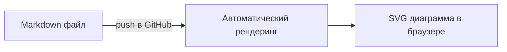
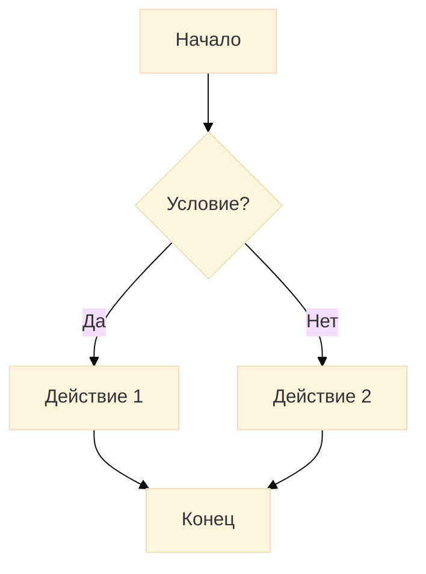
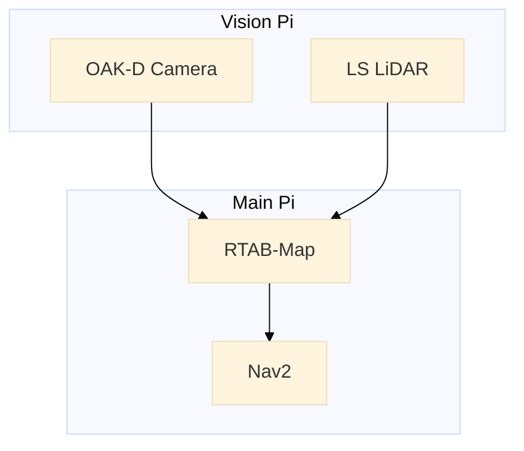
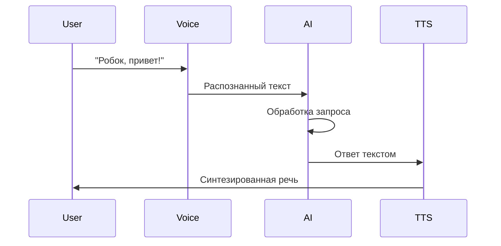
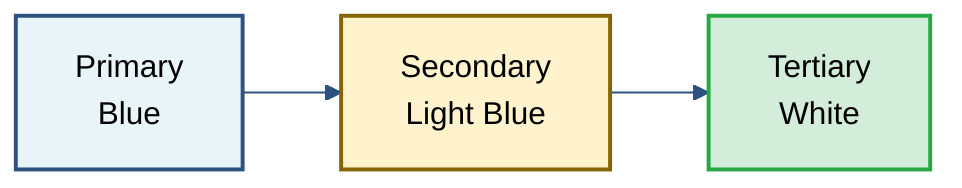
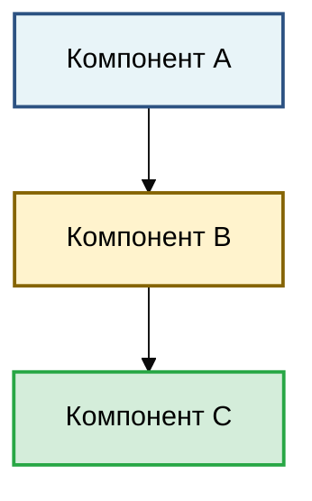
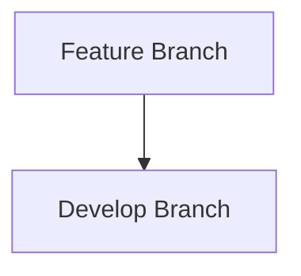

# Руководство по Mermaid диаграммам в документации

## Обзор

Вся документация проекта Rob Box использует **Mermaid** для визуализации архитектурных диаграмм, схем потоков данных и других технических иллюстраций.

### Преимущества Mermaid

✅ **Текстовый формат** - легко редактировать и отслеживать изменения в git  
✅ **Автоматический рендеринг** - GitHub автоматически отображает диаграммы  
✅ **SVG вывод** - векторная графика, масштабируется без потери качества  
✅ **Консистентность** - единый стиль всех диаграмм в проекте  
✅ **Доступность** - можно копировать текст из диаграмм  

## Рендеринг Mermaid

### GitHub
GitHub автоматически рендерит Mermaid диаграммы в файлах `.md`:



**Поддерживаемые места:**
- ✅ README.md файлы
- ✅ Документация в папке docs/
- ✅ Pull Request описания
- ✅ Issues комментарии
- ✅ Wiki страницы

### Локальный просмотр

**Visual Studio Code:**
1. Установить расширение "Markdown Preview Mermaid Support"
2. Открыть `.md` файл
3. Нажать `Ctrl+Shift+V` для предпросмотра

**Другие редакторы:**
- **JetBrains IDEs** (PyCharm, WebStorm): встроенная поддержка
- **Obsidian**: встроенная поддержка
- **Typora**: встроенная поддержка

**Браузер:**
- Использовать [Mermaid Live Editor](https://mermaid.live/) для тестирования

## Типы диаграмм в проекте

### 1. Flowchart (Блок-схемы)

**Используется для:** CI/CD пайплайны, потоки данных, алгоритмы



**Пример в проекте:** `docs/CI_CD_PIPELINE.md`

### 2. Graph (Графы)

**Используется для:** Архитектура системы, связи компонентов



**Пример в проекте:** `docs/architecture/SYSTEM_OVERVIEW.md`

### 3. Sequence Diagrams (Диаграммы последовательности)

**Используется для:** ROS 2 взаимодействия, протоколы обмена данными



## Стилизация диаграмм

### Корпоративная цветовая схема

Проект использует единую цветовую палитру:



### Семантические цвета

| Цвет | Hex | Использование |
|------|-----|---------------|
| 🔵 Голубой | `#e8f4f8` | Основные компоненты, Vision Pi |
| 🟡 Жёлтый | `#fff3cd` | Процессы, промежуточное ПО |
| 🟢 Зелёный | `#d4edda` | Успешные состояния, Main Pi |
| 🔴 Красный | `#f8d7da` | Критичные компоненты, выходы |
| ⚪ Синий | `#cce5ff` | Облачные сервисы, внешние системы |

### Пример с полной стилизацией



## Лучшие практики

### ✅ ДЕЛАЙТЕ

1. **Используйте эмодзи для визуальной идентификации:**
   ```
   🤖 Робот, 🎤 Аудио, 📡 Сеть, 💾 База данных
   ```

2. **Добавляйте описания к связям:**
   ```mermaid
   graph LR
       A -->|HTTP POST| B
   ```

3. **Группируйте логически связанные элементы:**
   ```mermaid
   graph TB
       subgraph "Vision Pi"
           Camera
           LiDAR
       end
   ```

4. **Используйте согласованную терминологию:**
   - Vision Pi / Main Pi (не Pi1/Pi2)
   - RTAB-Map (не rtabmap или RTABMap)

### ❌ НЕ ДЕЛАЙТЕ

1. **Не перегружайте диаграммы:**
   - Максимум 8-10 узлов на диаграмме
   - Разделите сложные диаграммы на несколько простых

2. **Не используйте ASCII-арт:**
   ```
   ❌ ПЛОХО:
   ┌──────┐
   │ Node │
   └──────┘
   
   ✅ ХОРОШО:
   ```mermaid
   graph LR
       A[Node]
   ```
   ```

3. **Не забывайте про читаемость:**
   - Используйте короткие, понятные названия
   - Добавляйте переносы строк в длинных текстах: `<br/>`

## Конвертация старых диаграмм

Если вы нашли ASCII-арт диаграмму, конвертируйте её в Mermaid:

**Было (ASCII-арт текст):**
```text
┌─────────┐
│ Feature │
└────┬────┘
     │
     ▼
┌─────────┐
│ Develop │
└─────────┘
```

**Стало (Mermaid код):**
~~~markdown

~~~

**Результат рендеринга:**


## Экспорт в SVG/PNG

### Через Mermaid CLI

```bash
# Установка
npm install -g @mermaid-js/mermaid-cli

# Экспорт в SVG
mmdc -i diagram.mmd -o diagram.svg

# Экспорт в PNG
mmdc -i diagram.mmd -o diagram.png
```

### Через Mermaid Live Editor

1. Открыть https://mermaid.live/
2. Вставить код диаграммы
3. Скачать как SVG или PNG

## Ссылки

**Официальная документация:**
- [Mermaid Documentation](https://mermaid.js.org/)
- [Mermaid Live Editor](https://mermaid.live/)
- [GitHub: Mermaid Support](https://github.blog/2022-02-14-include-diagrams-markdown-files-mermaid/)

**Примеры в проекте:**
- [CI/CD Pipeline](CI_CD_PIPELINE.md) - flowchart
- [System Overview](architecture/SYSTEM_OVERVIEW.md) - graphs и subgraphs
- [Internal Dialogue](architecture/INTERNAL_DIALOGUE_VOICE_ASSISTANT.md) - сложные потоки

---

**Последнее обновление:** Октябрь 2025  
**Автор:** Rob Box Project Team
