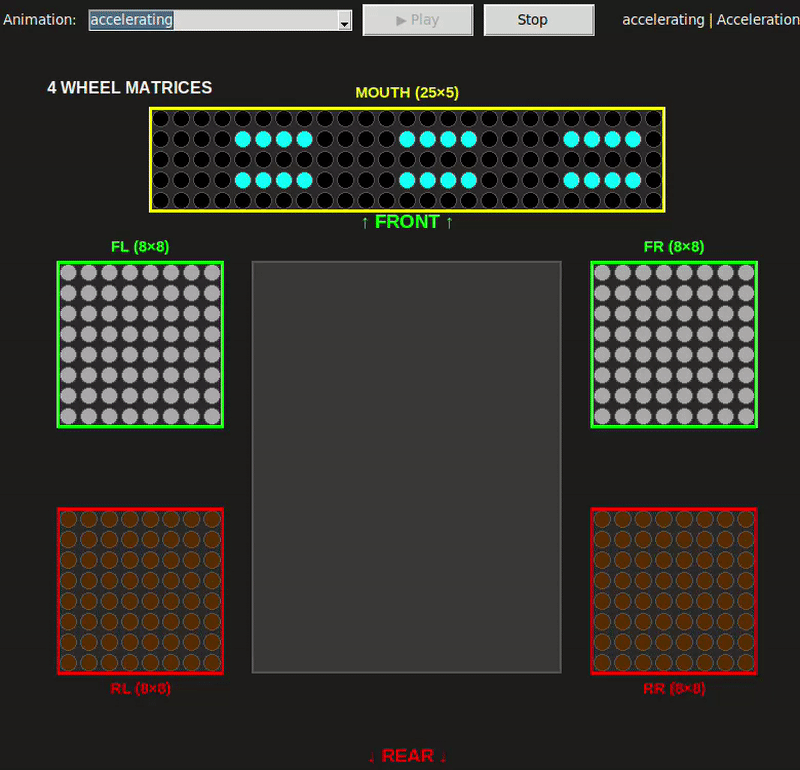
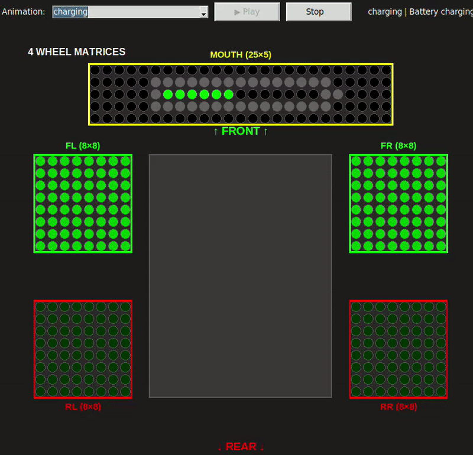
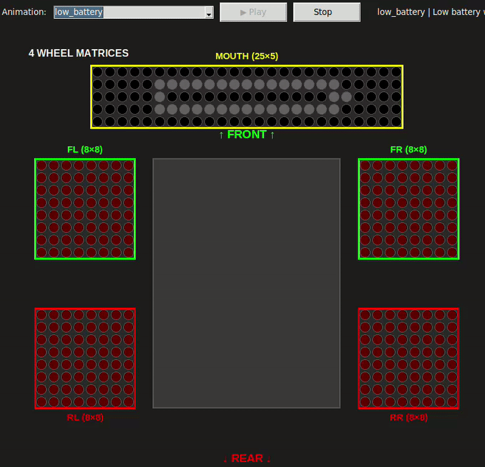

# 📚 Документация Rob Box Project

> Автономный робот на ROS 2 с LED матрицами, SLAM навигацией и голосовым управлением

**Версия**: 2025-10-11 | **ROS 2**: Humble | **Платформа**: Raspberry Pi 4/5

---

## 🚀 Быстрый старт

Начните здесь, если вы впервые работаете с проектом:

- **[⚡ Быстрый старт](getting-started/QUICK_START_RU.md)** - Запуск системы за 10 минут
- **[✅ Чеклист запуска](getting-started/CHECKLIST.md)** - Контрольный список для проверки системы

---

## 📦 Аппаратные системы (Hardware)

### 🎨 LED Matrix System
**5 WS2812B матриц**: 4× 8×8 (колёса) + 1× 25×5 (дисплей) = 381 LED

- **[LED Matrix Integration](reference/LED_MATRIX_INTEGRATION.md)** - Топология, подключение, ROS 2 интерфейс
- **[🎨 Animations Gallery](development/animations/README.md)** ⭐ - 21 анимация с GIF превью
  - 4 Emergency (police, ambulance, fire_truck, road_service)
  - 4 Navigation (turn_left, turn_right, braking, accelerating)
  - 8 Emotions (happy, sad, angry, surprised, thinking, talking, victory, idle)
  - 5 System (sleep, wakeup, charging, low_battery, error)

  

### 🔌 Sensor Hub (ESP32)
**ESP32-S3** micro-ROS узел с I2C датчиками и SPI контроллерами

- **[Sensor Hub Integration](reference/SENSOR_HUB_INTEGRATION.md)** - Архитектура, протоколы связи, датчики
- **[Testing Sensor Hub](guides/TESTING_SENSOR_HUB.md)** - Тестирование датчиков

**Датчики:**
- MPU6050 (IMU - акселерометр/гироскоп)
- BMP280 (давление/температура)
- VL53L0X ToF (лазерный дальномер)
- Кнопки, энкодеры

### ⚙️ Моторы и управление
**4× VESC моторконтроллера** через CAN bus

- **[VESC Integration](reference/VESC_INTEGRATION.md)** - Интеграция VESC, CAN протокол, ros2_control
- **[CAN Setup Guide](guides/CAN_SETUP.md)** - Настройка CAN интерфейса

### 📡 Сенсоры локализации
**LSLIDAR N10** + **OAK-D Lite** + **Raspberry Pi Camera**

- **[LSLIDAR Setup](guides/LSLIDAR_SETUP.md)** - Настройка лазерного сканера LSLIDAR N10
- **[RTAB-Map LiDAR Config](reference/RTABMAP_LIDAR_CONFIG.md)** ⭐ - 2D SLAM с лазерным сканером

### 🔧 Механика
**Rocker-bogie** подвеска, 4 колеса 10" (230mm)

- **[Fusion 360 Final Measurements](reference/FUSION360_FINAL_MEASUREMENTS.md)** - Итоговые параметры робота
- **[Fusion 360 Measurements](reference/FUSION360_MEASUREMENTS.md)** - Детальный анализ URDF
- **[Fusion 360 STL Analysis](reference/FUSION360_STL_ANALYSIS.md)** - Анализ STL мешей

**Параметры:**
- База (wheelbase): 390 мм
- Колея (track): 289 мм
- Радиус колеса: 115 мм

---

## 💻 Программные системы (Software)

### 🤖 ROS 2 Humble
**Dual Raspberry Pi** архитектура с Zenoh middleware

- **[Architecture](reference/ARCHITECTURE.md)** - Полная архитектура системы
  - Топология сети (Main Pi + Vision Pi)
  - ROS 2 граф нод и топиков
  - Аппаратная конфигурация
- **[ROS2 Control Architecture](reference/ROS2_CONTROL_ARCHITECTURE.md)** - Система управления

### 🗺️ Навигация и SLAM
**RTAB-Map** для одновременной локализации и картографирования

- **[RTAB-Map LiDAR Config](reference/RTABMAP_LIDAR_CONFIG.md)** ⭐ - Конфигурация для 2D LiDAR
- **[RTAB-Map Analysis](development/RTABMAP_ANALYSIS.md)** - Детальный анализ RTAB-Map
- **[Nav2 Setup](guides/NAV2_SETUP.md)** - Настройка Nav2 навигации
- **[Nav2 Video Analysis](reference/NAV2_VIDEO_ANALYSIS.md)** - Анализ видеоматериалов

### 👁️ Компьютерное зрение
**OAK-D Lite** камера с Intel Movidius MyriadX

- **[Optimization](reference/OPTIMIZATION.md)** - Детальная оптимизация OAK-D
  - Снижение разрешения и FPS
  - Конфигурация CycloneDDS
  - Настройка RTAB-Map
- **[Optimization Summary](reference/OPTIMIZATION_SUMMARY.md)** - Краткое резюме оптимизации

### 🎥 Визуализация
**RViz2** для отладки и мониторинга

- **[Visualization Guide](guides/VISUALIZATION.md)** - Проверка URDF модели в RViz

---

## 🌐 Сетевые системы (Networking)

### 🔗 Zenoh Middleware
**rmw_zenoh_cpp** для ROS 2 - распределённая pub/sub система

- **[Zenoh Video Guide](reference/ZENOH_VIDEO_GUIDE.md)** - Конспект видео про Zenoh
- **[Zenoh Power Optimization](reference/ZENOH_POWER_OPTIMIZATION.md)** - Оптимизация энергопотребления

**Топология:**
```
Vision Pi (10.1.1.11) ──┐
                         ├─> Zenoh Router ──> Main Pi (10.1.1.10)
External Server (7447) ──┘
```

### 🚗 CAN Bus
**SocketCAN** для связи с VESC моторконтроллерами

- **[CAN Setup Guide](guides/CAN_SETUP.md)** - Полная настройка CAN интерфейса
- **[VESC Integration](reference/VESC_INTEGRATION.md)** - CAN протокол VESC

### 📶 WiFi / Ethernet
**Dual interface** для надёжности

- Ethernet (10.1.1.x): Основной канал
- WiFi (10.1.1.2x): Резервный канал

---

## ⚡ Система питания

### 🔋 Raspberry Pi 5 Power Management
Управление питанием, мониторинг, троттлинг

- **[Power Management](guides/POWER_MANAGEMENT.md)** ⭐ - Полное руководство по питанию RPi5
  - Режимы питания (USB-A, USB-C PD, GPIO, официальный адаптер)
  - Симптомы недостаточного питания и троттлинга
  - Программные и аппаратные решения
  - Рекомендации для rob_box_project

- **[Power Monitoring Scripts](guides/POWER_MONITORING_SCRIPTS.md)** - Скрипты мониторинга
  - `check_power_status.sh` - полная проверка состояния
  - `check_usb_devices.sh` - анализ USB устройств
  - `monitor_power_live.sh` - мониторинг в реальном времени

---

## 🛠️ Документация для разработчиков

### 📖 Основные руководства

- **[AGENT_GUIDE.md](development/AGENT_GUIDE.md)** ⭐ - Критически важно для AI!
  - Обзор системы и топология сети
  - Структура Docker проекта
  - Доступ к Raspberry Pi
  - **Критические правила для Dockerfiles**
  - Инструментарий мониторинга

- **[DOCKER_STANDARDS.md](development/DOCKER_STANDARDS.md)** - Правила работы с Docker
  - Структура файлов и папок
  - Стандарты volumes и environment
  - Workflow добавления сервисов
  - Валидация конфигурации

- **[BUILD_OPTIMIZATION.md](development/BUILD_OPTIMIZATION.md)** - Ускорение разработки
  - Volume mounting вместо COPY
  - Структура config/ и scripts/
  - Правила для Dockerfiles
  - Быстрое применение изменений (2-5 сек вместо 5-10 мин)

### 🔬 Анализ и ревью

- **[CODE_REVIEW_2025-10-11.md](development/CODE_REVIEW_2025-10-11.md)** - Полный аудит проекта
- **[DEVCONTAINERS_ANALYSIS.md](development/DEVCONTAINERS_ANALYSIS.md)** - Анализ devcontainers

### 🎨 LED Animations Development

- **[🎨 Animations README](development/animations/README.md)** ⭐ - Полная документация
  - Галерея всех 21 анимаций (GIF превью)
  - Технические детали и форматы
  - Разработка новых анимаций
  - История изменений (v2.5)

- **[Animation Improvements](development/animations/ANIMATION_IMPROVEMENTS_2025-01-11.md)** - Улучшения анимаций
- **[Animation Fixes](development/animations/ANIMATION_FIXES_2025-01-11.md)** - Исправления
- **[Animation Final Check](development/animations/ANIMATION_FINAL_CHECK_2025-10-11.md)** - Финальная проверка
- **[Talking Animation v2](development/animations/TALKING_ANIMATION_V2.md)** - Talking анимация v2

---

## 🧰 Утилиты и помощь

### 🐚 Bash Aliases
- **[Bash Aliases](guides/BASH_ALIASES.md)** - Удобные алиасы для работы с проектом

### 🩺 Диагностика
- **[Troubleshooting](guides/TROUBLESHOOTING.md)** - Решение проблем
- **[System Tuning](reference/SYSTEM_TUNING.md)** - Тюнинг операционной системы

### 📋 Contributing
- **[CONTRIBUTING.md](../CONTRIBUTING.md)** - Как участвовать в проекте
  - Git Flow стратегия (main, develop, feature/*, fix/*)
  - Docker образы и теги
  - Conventional Commits

---

## 📊 Структура документации

```
docs/
├── getting-started/     # 🚀 Быстрый старт и первые шаги
│   ├── QUICK_START_RU.md
│   └── CHECKLIST.md
│
├── guides/              # 📖 Пошаговые руководства для пользователей
│   ├── POWER_MANAGEMENT.md
│   ├── POWER_MONITORING_SCRIPTS.md
│   ├── LSLIDAR_SETUP.md
│   ├── CAN_SETUP.md
│   ├── NAV2_SETUP.md
│   ├── MICROROS_SETUP.md
│   ├── VISUALIZATION.md
│   ├── TESTING_SENSOR_HUB.md
│   ├── BASH_ALIASES.md
│   └── TROUBLESHOOTING.md
│
├── reference/           # 📚 Справочная и техническая информация
│   ├── ARCHITECTURE.md
│   ├── ROS2_CONTROL_ARCHITECTURE.md
│   ├── LED_MATRIX_INTEGRATION.md
│   ├── SENSOR_HUB_INTEGRATION.md
│   ├── VESC_INTEGRATION.md
│   ├── RTABMAP_LIDAR_CONFIG.md
│   ├── FUSION360_FINAL_MEASUREMENTS.md
│   ├── FUSION360_MEASUREMENTS.md
│   ├── FUSION360_STL_ANALYSIS.md
│   ├── OPTIMIZATION.md
│   ├── OPTIMIZATION_SUMMARY.md
│   ├── ZENOH_VIDEO_GUIDE.md
│   ├── ZENOH_POWER_OPTIMIZATION.md
│   ├── SYSTEM_TUNING.md
│   └── NAV2_VIDEO_ANALYSIS.md
│
└── development/         # 🔧 Документация для разработчиков
    ├── AGENT_GUIDE.md
    ├── DOCKER_STANDARDS.md
    ├── BUILD_OPTIMIZATION.md
    ├── CODE_REVIEW_2025-10-11.md
    ├── DEVCONTAINERS_ANALYSIS.md
    ├── RTABMAP_ANALYSIS.md
    └── animations/
        ├── README.md
        ├── ANIMATION_IMPROVEMENTS_2025-01-11.md
        ├── ANIMATION_FIXES_2025-01-11.md
        ├── ANIMATION_FINAL_CHECK_2025-10-11.md
        └── TALKING_ANIMATION_V2.md
```

---

## 📈 Статистика проекта

- **Документов**: 39 файлов в docs/
- **LED Анимаций**: 21 (600+ кадров, ~50KB)
- **ROS 2 пакетов**: 6 (rob_box_*, robot_sensor_hub_msg, vesc_nexus)
- **Docker образов**: 3 (base, main, vision)
- **Поддерживаемых платформ**: arm64 (Raspberry Pi 4/5)

---

## 🔗 Полезные ссылки

- **GitHub**: [github.com/krikz/rob_box_project](https://github.com/krikz/rob_box_project)
- **Docker Registry**: [ghcr.io/krikz/rob_box](https://ghcr.io/krikz/rob_box)
- **Main README**: [../README.md](../README.md)
- **Quick Reference**: [../QUICK_REFERENCE.md](../QUICK_REFERENCE.md)

---

**Последнее обновление**: 2025-10-11  
**Версия документа**: 2.0.0  
**Автор**: КУКОРЕКЕН  
**Проект**: rob_box_project
