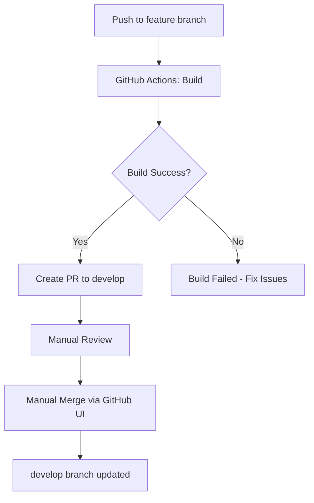
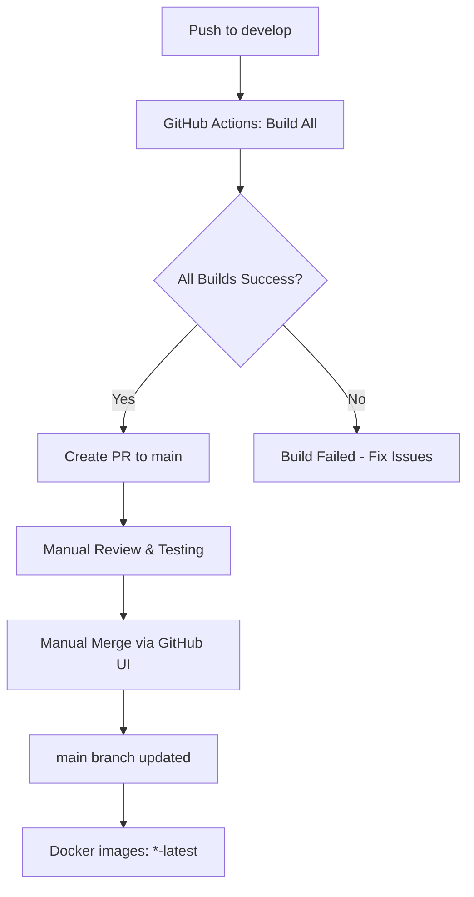

# GitHub Actions Workflow Changes

## Проблема

Автоматические merge workflow'ы выполняли прямое слияние веток без создания Pull Request для ревью:
- Feature ветки автоматически мерджились в `develop`
- `develop` автоматически мерджился в `main`

Это создавало риски:
- Невозможность проверить изменения перед merge
- Отсутствие контроля над тем, что попадает в production
- Автоматические merge могли происходить даже при неожиданных изменениях

## Решение

Изменены workflow'ы для использования **Pull Request-based подхода**:

### 1. Feature → Develop (auto-merge-feature-to-develop.yml)

**Было:**
- Автоматический merge в develop после сборки
- Автоматическое удаление feature ветки

**Стало:**
- Автоматическое **создание Pull Request** в develop
- PR помечается label `autobuild`
- Feature ветка остаётся (не удаляется)
- **Требуется ручной merge** через GitHub UI

### 2. Develop → Main (auto-merge-to-main.yml)

**Было:**
- Автоматический merge в main после сборки всех сервисов
- Автоматическое создание release tag
- Срабатывал на workflow_run (каскадные автомерджи)

**Стало:**
- Автоматическое **создание Pull Request** в main
- PR помечается labels `release` и `autobuild`
- Убран trigger workflow_run (нет каскадных срабатываний)
- **Требуется ручной merge** через GitHub UI перед релизом

## Новый Workflow

### Разработка Feature



**Шаги:**
1. Разработчик пушит в `feature/*` или `copilot/*` ветку
2. GitHub Actions собирает изменённые сервисы
3. При успешной сборке создаётся PR в `develop`
4. **Разработчик проверяет PR**
5. **Разработчик делает merge вручную** когда готово

### Релиз в Production



**Шаги:**
1. Feature PRs мерджатся в `develop`
2. GitHub Actions собирает **все** сервисы
3. При успешной сборке создаётся PR в `main`
4. **Команда проверяет PR и тестирует образы `-dev`**
5. **Команда делает merge вручную** когда готово к релизу
6. После merge строятся production образы `-latest`

## Преимущества

✅ **Контроль**: Все merge требуют ручного подтверждения
✅ **Ревью**: Возможность проверить все изменения перед merge
✅ **Безопасность**: Нет риска случайного автоматического деплоя в production
✅ **Прозрачность**: Все изменения видны в PR с полным контекстом
✅ **Гибкость**: Можно отложить merge, запросить изменения, или закрыть PR

## Как использовать

### Мердж Feature в Develop

1. Перейти в **GitHub → Pull Requests**
2. Найти PR с label `autobuild`
3. Проверить изменения:
   - Какие файлы изменились
   - Какие сервисы были собраны
   - Логи сборки (ссылка в PR)
4. Если всё ОК: нажать **"Merge pull request"**
5. Опционально удалить feature ветку

### Мердж Develop в Main (Release)

1. Перейти в **GitHub → Pull Requests**
2. Найти PR с labels `release` и `autobuild`
3. **Тщательно проверить**:
   - Все изменения с последнего релиза
   - Протестировать образы с тегом `-dev` на staging
   - Убедиться что всё готово к production
4. Если всё ОК: нажать **"Merge pull request"**
5. Это запустит сборку production образов `-latest`

## Отличия от старого подхода

| Аспект | Старый подход | Новый подход |
|--------|---------------|--------------|
| Merge | Автоматический | Ручной через PR |
| Контроль | Минимальный | Полный |
| Ревью | Нет | Обязательный |
| Feature ветки | Удаляются авто | Остаются |
| Production | Авто-деплой | Контролируемый релиз |
| Откат | Сложный | Через revert PR |

## Troubleshooting

### PR не создаётся автоматически

**Проверить:**
- Сборка прошла успешно? (GitHub Actions → Build logs)
- PR уже существует для этой ветки?
- Workflow включён? (`.github/workflows/` не изменён?)

**Решение:**
```bash
# Создать PR вручную
gh pr create --base develop --head feature/my-branch \
  --title "feat: my feature" \
  --body "Description"
```

### Нужно срочно вернуть автоматический merge

**Не рекомендуется**, но если очень нужно:

1. Временно откатить изменения workflow:
```bash
git revert <commit-hash-этого-изменения>
git push
```

2. Или изменить workflow чтобы делать автоматический merge после создания PR

## Дополнительная информация

- **CI/CD Pipeline**: `docs/CI_CD_PIPELINE.md`
- **GitHub Actions**: `.github/workflows/`
- **Issue трекер**: GitHub Issues

---

**Дата изменений**: 2025-10-23
**Автор**: GitHub Copilot Agent
**Версия**: 1.0
