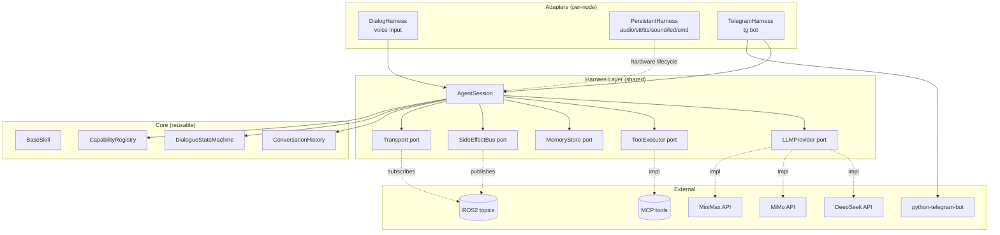
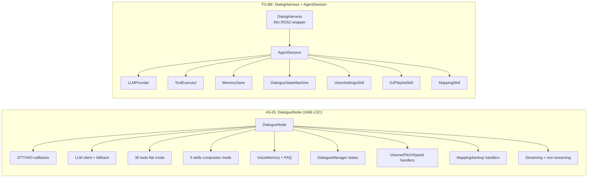
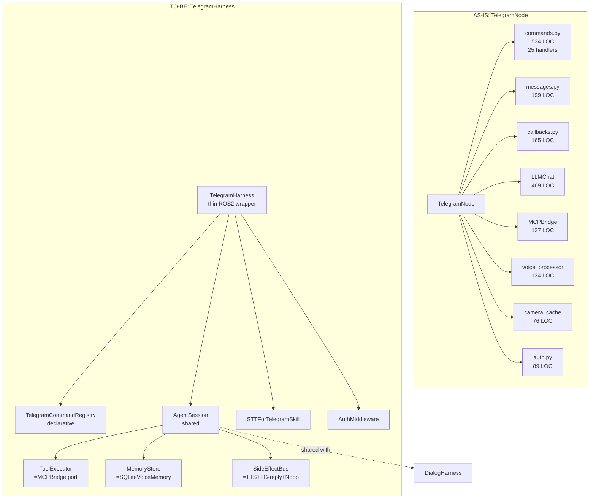
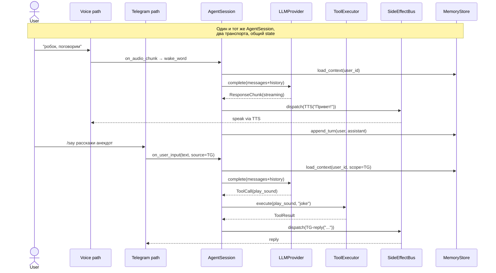
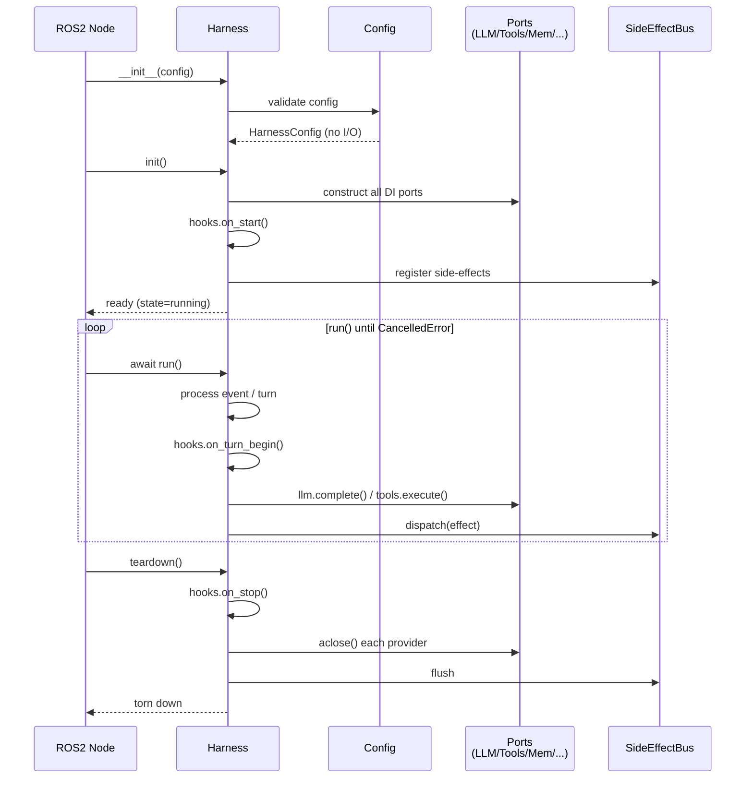

# ADR-0001: Целевая архитектура харнесов для dialog / persistent / telegram нод

| Поле         | Значение                                                                  |
|--------------|---------------------------------------------------------------------------|
| Статус       | **Accepted**                                                              |
| Дата         | 2026-07-24 (обновлён 2026-07-24, исходно 2026-07-18)                      |
| Автор        | architect (Hermes Agent)                                                  |
| Формат       | MADR (Markdown Any Decision Record)                                       |
| Контекст     | refactoring task `t_8c0ae7dd`; Kanban `t_04c1b342`                        |
| Родители     | `t_0f7b815c` (as-is анализ), `t_ebdc4c99` (best-practices research)       |
| Потомки      | `t_ace66f51` (implementation), `t_2bf98118`, `t_35cfe938`, `t_a701d101`   |
| Связанные ADR | [ADR-0002](0002-minimax-provider.md) (MiniMax + LLMProvider), [ADR-0007](0007-minimax-tts-integration-final.md) (TTS), [ADR-0008](0008-tts-provider-extension-points-landed.md) (TTS extension points) |

---

## 1. Контекст и проблема

### 1.1 Что такое «харнесы» в этом проекте

В РОББОКС три ROS2-ноды несут основную **диалоговую** и **операторскую** нагрузку и при этом исторически писались разными людьми, в разное время и с разной степенью покрытия тестами:

- **`DialogueNode`** (`src/rob_box_voice/rob_box_voice/dialogue_node.py`, ~2466 строк, 9% coverage) — голосовой ассистент на OpenAI Agents SDK + DeepSeek/MiMo. Управляет стримом ответов, очередями реплик, инструментами, навыками-сабагентами, wake-word gate, состояниями `IDLE / LISTENING / DIALOGUE / SILENCED`.
- **`PersistentNode`-семейство** (`audio_node`, `stt_node`, `tts_node`, `sound_node`, `led_node`, `command_node` в `src/rob_box_voice/`, ~25–80 KB каждый) — долгоживущие ноды для захвата аудио, распознавания, синтеза, эффектов, светодиодов и навигационных команд. Каждая сама держит состояние и взаимодействует с ROS2-топиками.
- **`TelegramNode`** (`src/rob_box_telegram/rob_box_telegram/telegram_node.py`, 407 строк, ~2300 строк с хендлерами, 0% coverage) — обёртка над `python-telegram-bot` + ROS2-мост. Имеет LLMChat, MCPBridge, CameraCache и набор handler-функций (`commands.py` — 534 строки, `messages.py` — 199 строк, `callbacks.py` — 165 строк).

**«Харнесами»** мы называем **тонкие обёртки поверх этих нод**, которые инкапсулируют: внешние зависимости (LLM-провайдер, Telegram API, аудио-устройство), общие паттерны (state machine, retry, observability, side-effect isolation) и жизненный цикл (startup/shutdown/lifecycle). Цель — единый контракт, скрывающий детали каждой конкретной ноды и дающий переиспользуемый слой для тестов, мониторинга и расширения.

### 1.2 Известные проблемы (из as-is анализа `t_0f7b815c`)

1. **Гигантский DialogueNode**: 1331 statement, 1152 не покрыты тестами. Один класс держит и стрим, и инструменты, и состояние диалога, и обработку wake word, и интеграцию с памятью/FAQ.
2. **Дублирование LLM-логики**: и `dialogue_node.py`, и `telegram/llm_chat.py`, и `mcp_bridge.py`, и `rob_box_mcp_tools/llm_adapter.py` каждый по-своему создают LLM-клиент и обрабатывают tool-calls.
3. **Telegram не имеет моста к voice-пайплайну**: пользователь телеграма может отправить текст — и пойдёт отдельный LLM, не имеющий доступа к `VoiceMemory` / `FAQStore`, истории пользователя, контексту сессии.
4. **Отсутствие абстракции side-effect**: обращения к Telegram API, TTS, sound, LED перемешаны с бизнес-логикой — невозможно тестировать без моков на уровне ROS2.
5. **Side-effects не изолированы**: «куда отправить текст» определяется ad-hoc (параметр `tts_pub`, прямой вызов `publish_tts` из обработчика). Некуда подменить получателя в тестах.
6. **Нет единого state-store**: диалог живёт в памяти `DialogueManager`, история — в `VoiceMemory` (SQLite), но синхронизация ручная.
7. **Tool execution sync/async race**: `LLMToolCallAdapter` имеет и sync, и async варианты; какой используется, зависит от ноды и непрозрачно.

### 1.3 Best-practices из исследования `t_ebdc4c99`

Сводная таблица из отчёта покрывает 6 систем (Hermes, LangGraph, LlamaIndex Workflows, AutoGen, CrewAI, Haystack) × 13 аспектов. Ключевые паттерны, релевантные нам:

| Паттерн                              | Где встречается                                   | Что берём                                       |
|--------------------------------------|---------------------------------------------------|-------------------------------------------------|
| **Ports & Adapters**                 | Hermes Agent, LangGraph nodes                     | LLM-порт, Tool-порт, Transport-порт (TG/STT)    |
| **Capability registry**              | Hermes tools/registry.py                          | Реестр инструментов + capability introspection   |
| **State container**                  | LangGraph `StateGraph`, Haystack pipelines        | Единый объект `SessionState` с reducer'ами       |
| **Lifecycle hooks**                  | Hermes gateway hooks, LangGraph runtime           | `on_start / on_turn / on_tool / on_error / on_stop` |
| **Provider abstraction**             | Hermes runtime_provider, LlamaIndex               | `LLMProvider` (deepseek / mimo / …)             |
| **Streaming chunk + structured event** | Hermes, Haystack                                | `ResponseChunk` + `ToolCall` события            |
| **Human-in-the-loop checkpoint**     | LangGraph interrupt, AutoGen                      | Для wake-word gate, команды «помолчи»           |
| **Side-effect wrapper**              | Haystack `OutputAdapter`, Hermes tools            | `Effect[T] = Callable[[T], None]`                |
| **Threaded bridge to async runtime** | Hermes gateway                                   | Шаблон для TG-loop ↔ ROS2-callbacks             |
| **Run history / replay**             | LangGraph checkpoint, Hermes sessions             | Для тестов и отладки диалога                    |

### 1.4 Бизнес-проблема, которую мы решаем

Без харнесов:

- Каждая нода при добавлении нового сценария (мульти-юзер, голос + TG, vision + dialog) требует **N копипастов** одного и того же кода инициализации LLM/MCP/State.
- Тесты пишутся только верхнего уровня через `unittest.mock` на ROS2, и **только 9% диалоговой ноды** покрыто — это не лечится без разделения ответственностей.
- Telegram остаётся «островом»: его нельзя подключить к общему диалоговому стейту, его инструменты нельзя переиспользовать.

С харнесами:

- Один раз определяем контракт «агент-сессия», и все три ноды становятся **конкретными адаптерами** к нему.
- Тесты становятся дешёвыми: подменяем порты (LLM/MCP/TG/STT) на in-memory fake'и.
- Новые интерфейсы (web, Slack, CLI) — это **новый адаптер**, не новый класс.

### 1.5 Связь с источниками истины

- **SPEC_CURRENT** ([../../SPEC_CURRENT.md](../../SPEC_CURRENT.md)) определяет текущее состояние проекта и ближайшие шаги (PR #907 → merge → реализация этого ADR).
- **ROADMAP** ([../../.planning/ROADMAP.md](../../.planning/ROADMAP.md)) описывает общий многофазный план проекта, в который этот ADR встраивается как технический артефакт фазы «Реализация харнесов».
- Подробный тактический план — в [../../refactoring-plan.md](../../refactoring-plan.md) (Proposed, приложение к этому ADR).

---

## 2. Принятое решение

### 2.1 Высокоуровневая целевая архитектура

Вводим **три слоя**:

```
┌──────────────────────────────────────────────────────────────────────┐
│  ADAPTERS LAYER — конкретные интерфейсы пользователя                 │
│  ┌─────────────────┐ ┌─────────────────┐ ┌─────────────────────────┐ │
│  │ DialogAdapter   │ │ PersistentAdapters│ │ TelegramAdapter          │ │
│  │ (voice input)   │ │ (audio/stt/tts/  │ │ (python-telegram-bot →   │ │
│  │                 │ │  sound/led/cmd)  │ │  ROS2)                   │ │
│  └────────┬────────┘ └────────┬─────────┘ └────────────┬────────────┘ │
│           └───────────────────┴────────────────────────┘              │
│                              │ uses                                  │
│                              ▼                                       │
│  HARNESS LAYER — единые контракты (Ports & Adapters)                 │
│  ┌────────────────────────────────────────────────────────────────┐  │
│  │  AgentSession   — state, history, lifecycle hooks              │  │
│  │  Ports:                                                       │  │
│  │    • LLMProvider (deepseek / mimo / minimax)                  │  │
│  │    • ToolExecutor (MCP-bridge или fake)                       │  │
│  │    • MemoryStore (VoiceMemory / TelegramChatMemory / Fake)    │  │
│  │    • SideEffectBus (TTS / Sound / LED / TG-reply / noop)      │  │
│  │    • Transport (STT events / TG events / Keyboard events)     │  │
│  │  Skills registry — композиция суб-агентов (sub-handlers)     │  │
│  └────────────────────────────────────────────────────────────────┘  │
│                              │ uses                                  │
│                              ▼                                       │
│  CORE LAYER — переиспользуемая доменная логика                       │
│  ┌────────────────────────────────────────────────────────────────┐  │
│  │  BaseSkill (ABC)        — OpenAI Agents SDK wrapper            │  │
│  │  DialogueStateMachine   — IDLE/LISTENING/DIALOGUE/SILENCED     │  │
│  │  ConversationHistory    — turns + context window + summariser  │  │
│  │  Effect[T] / SideEffectBus                                       │  │
│  │  CapabilityRegistry      — что доступно данному пользователю   │  │
│  └────────────────────────────────────────────────────────────────┘  │
└──────────────────────────────────────────────────────────────────────┘
```

**Ключевая идея**: ROS2-нода остаётся «тонкой обёрткой» (sub/publish + lifecycle), а вся доменная логика — внутри `AgentSession`, который создаётся один раз и шарится между адаптерами.

### 2.2 Интерфейс `Harness` (главный контракт)

Базовый класс реализует **контракт жизненного цикла** и предоставляет порты. Псевдокод (см. реализацию в `src/rob_box_llm/rob_box_llm/...`):

```python
# Псевдокод — показывает форму API, не финальный код
from typing import Generic, TypeVar, AsyncContextManager
from dataclasses import dataclass

StateT = TypeVar("StateT")  # параметризованный dataclass с reducer'ами


class Harness(Generic[StateT], AsyncContextManager["Harness[StateT]"]):
    """Базовый контракт любого харнеса (dialog / persistent / telegram).

    Реализации ОБЯЗАНЫ:
      * в __init__ — только конфиг (no I/O, no network);
      * в init() — DI: построить провайдеры, подписаться на ROS2-топики,
        поднять ресурсы;
      * в run() — основной цикл обработки событий (один логический
        шаг / turn);
      * в teardown() — освободить всё, что инициализировали в init(),
        идемпотентно (повторный teardown — no-op);
      * в snapshot()/restore() — для тестов и реплея.
    """

    # --- Поля ---
    state: StateT                            # изменяемый dataclass с reducer'ами
    hooks: LifecycleHooks                    # on_start / on_turn / on_tool / on_error / on_stop
    llm: LLMProvider                         # порт
    tools: ToolExecutor                      # порт
    memory: MemoryStore                      # порт
    effects: SideEffectBus                   # порт
    transport: Transport                     # порт (ROS2 / fake)
    clock: Clock                             # системные часы (DI для тестов)
    log: LoggerAdapter                       # структурный логгер

    # --- Lifecycle (см. §2.3) ---
    async def init(self) -> None: ...
    async def run(self) -> None: ...
    async def teardown(self) -> None: ...

    # --- Управление (для тестов / отладки) ---
    def snapshot(self) -> SessionSnapshot: ...
    def restore(self, snapshot: SessionSnapshot) -> None: ...


class LifecycleHooks:
    """Точки расширения жизненного цикла. Каждый hook — опциональный.

    Семантика:
      on_start        — ДО первого turn; здесь подписываемся на топики,
                        инициализируем дефолтные настройки, прогреваем кэш.
      on_turn_begin   — перед каждым user_input / audio_chunk.
      on_tool_call    — перед execute(call); можно veto (raise) для блокировки.
      on_tool_result  — после execute(call); можно санитизировать результат.
      on_response_chunk — на каждый streaming chunk (для метрик / TTS chunking).
      on_error        — на любом ошибке; default — propagate; здесь можно
                        превратить ContentFilterError в дружелюбный ответ.
      on_stop         — перед teardown; финальный flush логов / history.
    """
    on_start: Hook[None] | None = None
    on_turn_begin: Hook[InputEvent] | None = None
    on_tool_call: Hook[ToolCall] | None = None
    on_tool_result: Hook[ToolResult] | None = None
    on_response_chunk: Hook[LLMChunk] | None = None
    on_error: Hook[Exception] | None = None
    on_stop: Hook[None] | None = None
```

`StateT` — параметризованный dataclass с reducer'ами (по примеру LangGraph `StateGraph`), чтобы каждый адаптер мог описать своё подмножество полей (`wake_active`, `silenced_until`, `dialogue_id`, `user_id`, `chat_id`).

### 2.3 Жизненный цикл харнеса (init / run / teardown)

```
   ┌────────────┐  init()  ┌────────────┐  run()  ┌────────────┐  teardown()
   │  __init__  │────────▶│   Init     │────────▶│    Run     │────────▶ done
   │  (config)  │         │ (DI/res)   │         │  (loop)    │
   └────────────┘         └────────────┘         └─────┬──────┘
                                                     │
                                                     │ exception
                                                     ▼
                                                ┌────────────┐
                                                │ on_error() │
                                                │ + teardown │
                                                └────────────┘
```

**Фазы детально:**

| Фаза | Гарантии | Что разрешено | Что запрещено |
|------|----------|---------------|---------------|
| `__init__(config)` | Только валидация параметров и сохранение полей. Никакого I/O. | Парсинг конфига, дефолты, проверка `isinstance` | Сетевые вызовы, чтение файлов, логирование в Redis |
| `init()` | Идемпотентен: повторный вызов — no-op. Создаёт все порты (`llm`, `tools`, `memory`, `effects`, `transport`). | Подписки на ROS2-топики, открытие БД, HTTP-клиент, `hook.on_start` | Бизнес-логика, обработка событий |
| `run()` | Основной цикл. Каждый шаг = `await harness.step()` или `await self.on_event(...)`. Прерывается по `CancelledError`. | Приём событий, вызов LLM, `dispatch(effect)`, `tool.execute`, `memory.append_turn` | Долгие блокирующие `time.sleep` |
| `teardown()` | Идемпотентен: повторный вызов — no-op. Закрывает всё, что открыл `init()`. | Закрытие HTTP/БД, отписки, `hook.on_stop`, flush логов | Сетевые вызовы, требующие ответа |

**Правила**:

1. `init()` обязательно идемпотентен — несколько вызовов не приводят к двойным подпискам или двойным HTTP-клиентам.
2. `teardown()` ОБЯЗАТЕЛЬНО вызывается даже при исключении (см. ниже `async with`).
3. Между `init()` и `teardown()` харнес находится в состоянии `running` — попытка `init()` повторно бросает `RuntimeError`.
4. Использование предпочтительно через `async with harness:` — это гарантирует `teardown()` при исключении.

```python
# Канонический сценарий (DialogHarness как тонкая ROS2-нода)
class DialogHarnessNode(rclpy.node.Node):
    def __init__(self) -> None:
        super().__init__("dialog_harness_node")
        self._harness = DialogHarness(config=load_config())

    async def start(self) -> None:
        async with self._harness as h:
            await h.run()  # блокирует до Ctrl+C / CancelledError
```

**Кто вызывает lifecycle:**

- **DialogHarness** — `DialogueNode` (ROS2 spin loop).
- **PersistentHarness** — каждая из `audio/stt/tts/sound/led/command` нод (ROS2 spin loop).
- **TelegramHarness** — `python-telegram-bot` `Application.run_polling()`, который вызывает `init()` ДО старта polling и `teardown()` через `post_shutdown` hook.

### 2.4 Точки расширения для провайдеров (extension points)

Контракт `Harness` определяет **минимальный** и **полный** набор портов. Провайдеры подменяются через DI в `init()`.

#### 2.4.1 LLMProvider (текст / инструменты / vision)

Псевдоконтракт (реальный код — `src/rob_box_llm/rob_box_llm/provider.py`):

```python
# Псевдокод
class LLMProvider(ABC):
    name: str
    @property
    def capabilities(self) -> ProviderCapabilities: ...

    async def complete(
        self,
        messages: Iterable[LLMMessage],
        *,
        tools: Iterable[Mapping[str, Any]] = (),
        settings: LLMSettings | None = None,
    ) -> LLMResponse: ...

    async def stream(
        self,
        messages: Iterable[LLMMessage],
        *,
        tools: Iterable[Mapping[str, Any]] = (),
        settings: LLMSettings | None = None,
    ) -> AsyncIterator[LLMChunk]: ...

    async def aclose(self) -> None: ...
```

**Реализации** (по расширяемости): `FakeLLMProvider` (тесты) → `DeepSeekProvider`, `MiMoProvider` (прод) → `MiniMaxProvider` (см. §2.6).

#### 2.4.2 ToolProvider (исполнение инструментов)

```python
# Псевдокод
class ToolProvider(ABC):
    """Исполнитель инструментов. Развязан с LLM по контракту: на входе
    ToolCall, на выходе ToolResult (или ToolError); менеджер tool-calls
    живёт в адаптере, не в провайдере."""

    async def discover(self) -> tuple[ToolSpec, ...]: ...
    async def execute(self, call: ToolCall) -> ToolResult: ...
    async def aclose(self) -> None: ...
```

**Реализации**: `MCPBridgeProvider` (production, через ROS2-топик `/mcp/execute`), `LocalSkillProvider` (in-process skills), `FakeToolProvider` (тесты).

#### 2.4.3 MemoryStore

```python
class MemoryStore(ABC):
    async def load_recent(self, scope: str, *, limit: int = 20) -> list[Turn]: ...
    async def append_turn(self, scope: str, turn: Turn) -> None: ...
    async def save_fact(self, scope: str, fact: Fact) -> None: ...
    async def search_facts(self, scope: str, query: str, *, top_k: int = 5) -> list[Fact]: ...
```

#### 2.4.4 SideEffectBus (композиция внешних эффектов)

```python
class SideEffectBus(ABC):
    async def dispatch(self, effect: Effect) -> None: ...

class Effect(ABC, Generic[T]):
    """Чистая декларация действия: 'отправить текст в TTS', 'мигнуть LED',
    'ответить в Telegram'. Side-effect изолирован в одном месте, чтобы
    тесты могли подставить NoopBus или RecordingBus."""
    async def apply(self, ctx: EffectContext) -> T: ...
```

**Реализации**: `CompositeBus(TTS+Sound+LED+TG-reply)`, `NoopBus` (тесты), `RecordingBus` (replay).

#### 2.4.5 Transport (источник событий)

```python
class Transport(ABC):
    """Нормализует 'как событие попадает в сессию' (STT / TG / keyboard)."""
    async def on_stt_result(self, text: str, *, confidence: float) -> None: ...
    async def on_vad(self, event: VadEvent) -> None: ...
    async def on_telegram_update(self, update: TelegramUpdate) -> None: ...
    async def on_key_event(self, event: KeyEvent) -> None: ...
```

**Реализации**: `ROS2Transport` (production), `FakeTransport` (тесты, прямой вызов методов).

#### 2.4.6 Clock (DI для тестов времени)

```python
class Clock(ABC):
    def now(self) -> datetime: ...
    async def sleep(self, seconds: float) -> None: ...
    def monotonic(self) -> float: ...
```

**Реализации**: `SystemClock`, `MockClock` (тесты).

#### 2.4.7 SnapshotStore (для vision / camera cache)

```python
class SnapshotStore(ABC):
    async def put(self, key: str, payload: bytes, *, ttl: timedelta) -> None: ...
    async def get_latest(self, key: str) -> bytes | None: ...
```

#### 2.4.8 Правила совместимости провайдеров

| Расширение | Что должно поддерживать | Что запрещено |
|------------|------------------------|---------------|
| Новый `LLMProvider` | `complete()`, `stream()`, `capabilities()`, `aclose()` | Менять `LLMMessage` / `LLMChunk` shape |
| Новый `ToolProvider` | `discover()`, `execute(call)`, `aclose()` | Делать I/O в `__init__` |
| Новый `MemoryStore` | Все 4 метода, идемпотентный `append_turn` | Синхронный API (всё async) |
| Новый `SideEffectBus` | `dispatch(effect)`, fan-out в downstream | Прямой вызов `node.publish(...)` |
| Новый `Transport` | Все 4 хука как `async no-op` | Блокирующие `time.sleep` |

### 2.5 Формат конфигурации

Конфигурация — YAML-файл + переменные окружения для секретов. Точка входа: `rob_box_llm.config.load_config(path: str | Path) -> HarnessConfig`.

#### 2.5.1 Схема (псевдокод)

```yaml
# harness.config.yaml
harness:
  kind: dialog              # dialog | persistent | telegram
  name: dialog_node_main
  state:
    wake_active: true
    silenced_until: null
    dialogue_id: null

llm:
  provider: minimax         # deepseek | mimo | minimax | fake
  model: MiniMax-M3
  fallback:                 # chain: первый доступный по capability
    - deepseek
    - mimo
  settings:
    temperature: 0.7
    max_tokens: 1024
    timeout_s: 30
    extra:
      thinking: disabled

tools:
  provider: mcp_bridge
  endpoint: /mcp/execute
  timeout_s: 10
  max_concurrent: 4

memory:
  backend: sqlite           # sqlite | in_memory | redis
  path: ~/.rob_box/voice.db
  ttl_days: 30

effects:
  bus: composite             # composite | noop | recording
  composite:
    - tts
    - sound
    - led
    - telegram_reply

transport:
  kind: ros2                 # ros2 | fake
  topics:
    stt_result: /voice/stt/result
    vad: /audio/vad
    telegram: /telegram/updates

logging:
  level: INFO
  redact:
    - MINIMAX_API_KEY
    - DEEPSEEK_API_KEY
  format: structured         # structured | plain
```

#### 2.5.2 Преобразование в код

```python
# Псевдокод
@dataclass(frozen=True)
class HarnessConfig:
    harness: HarnessKind
    state: dict[str, Any]
    llm: LLMConfig
    tools: ToolConfig
    memory: MemoryConfig
    effects: EffectsConfig
    transport: TransportConfig
    logging: LoggingConfig

def load_config(path: str | Path) -> HarnessConfig:
    raw = yaml.safe_load(Path(path).read_text())
    secrets = _load_secrets_from_env()  # MINIMAX_API_KEY, etc.
    return HarnessConfig.from_dict(raw, secrets=secrets)
```

#### 2.5.3 Правила

1. **Секреты — только ENV**, никогда в YAML. В YAML — плейсхолдеры (`${MINIMAX_API_KEY}`), которые подставляются в `load_config()`.
2. **Capability-driven fallback**: если `llm.model` или `llm.provider` заявлен как vision-capable, `ToolProvider.discover()` вернёт vision-tools; иначе fallback на `fallback[]` подбирается по `ProviderCapabilities`.
3. **Парциальный override**: `load_config()` поддерживает «слои» — базовый `config/base.yaml` + окружение `config/pi-main.yaml`, последний выигрывает.
4. **Валидация на старте**: `init()` обязан выбрасывать `ConfigError` при неконсистентной конфигурации (например, `kind=persistent` + `llm.model=minimax-m3` — LLM там вообще не нужен).
5. **Hot reload не делаем** — перезапуск ноды проще, честнее и тестируется прямее.

#### 2.5.4 Карта ENV-переменных

| ENV | Назначение | Кто читает | Обязательность |
|-----|-----------|-----------|----------------|
| `MINIMAX_API_KEY` | API key MiniMax | `MiniMaxProvider` constructor | для MiniMax |
| `MINIMAX_GROUP_ID` | Group ID для MiniMax | `MiniMaxTTSProvider` constructor | для TTS |
| `DEEPSEEK_API_KEY` | DeepSeek key | `DeepSeekProvider` constructor | для DeepSeek |
| `MIMO_API_KEY` | MiMo key | `MiMoProvider` constructor | для MiMo |
| `ROB_BOX_CONFIG_PATH` | путь к YAML | `load_config()` | обязательно |
| `ROB_BOX_LOG_LEVEL` | переопределяет `logging.level` | `LoggerAdapter` | нет |
| `ROB_BOX_DISABLE_NETWORK` | dry-run, тесты | `MiniMaxProvider.__init__` (raise) | нет |

ENV имеют приоритет **ниже** прямого `LLMProvider(api_key=...)` в коде и **выше** YAML-ссылок `${...}` (если YAML = пустая строка, а ENV задан — берётся ENV).

### 2.6 Требования к MiniMax-провайдеру как первому реальному бэкенду

MiniMax выбран первым production-бэкендом для `LLMProvider` порта, потому что:

1. **Глобальный endpoint** `https://api.minimax.io/v1` стабильно работает через OpenAI-compatible API; не требует Anthropic SDK.
2. **Multimodal**: `MiniMax-M3` принимает `ImagePart` в `MessageContent` (vision). Это нужно для vision-усиленного диалога (картинка + текст).
3. **Уже есть в реестре**: `MiniMaxProvider` (см. `src/rob_box_llm/rob_box_llm/providers/minimax.py`, ADR-0002) реализует контракт `LLMProvider` через `_OpenAICompatibleProvider`.
4. **Секреты под контролем**: `MINIMAX_API_KEY` хранится в Docker secrets / `.env.secrets`, никогда в git.

#### 2.6.1 Контрактные требования (минимум)

`MiniMaxProvider` ДОЛЖЕН:

| # | Требование | Где проверяется |
|---|-----------|-----------------|
| M1 | Реализовать `LLMProvider.complete()` и `stream()` | `test_minimax_provider.py` |
| M2 | Сообщать `capabilities.image_input=True` только для vision-моделей (`*M3*`, `*vision*`); для остальных — `False` | `capabilities_for(model)` unit-тесты |
| M3 | Бросать `CapabilityUnavailableError` ДО сетевого вызова, если `tools=True` запрошен на модели без tools | `test_minimax_tools_capability.py` |
| M4 | Переводить `base_resp.status_code != 0` (envelope MiniMax) в `ProviderError` / `RateLimitError` / `ContentFilterError` | `test_minimax_errors.py` |
| M5 | Не логировать `Authorization` header — обрабатывать `MiniMaxRedactedLogFilter` | `test_minimax_logging.py` |
| M6 | Ограничить размер `ImagePart` до `MINIMAX_MAX_IMAGE_BYTES` (10 MB по умолчанию) | `test_minimax_image_size_limit.py` |
| M7 | Требовать `MINIMAX_API_KEY` через ENV или явный `api_key=`; fallback на YAML-секрет запрещён | `test_minimax_auth.py` |
| M8 | Сообщать `name="minimax"` для идентификации в ошибках и в capability fallback | `test_provider_name.py` |
| M9 | Быть дефолтом `False` — продовый provider выбирается через `llm.provider` в YAML | `test_default_not_minimax.py` |
| M10 | `aclose()` корректно закрывает HTTP-клиент (особенно при streaming) | `test_minimax_aclose.py` |

#### 2.6.2 Гарантии, которые `Consumer` (DialogHarness) получает

- `LLMProvider` всегда стабильно в `LLMResponse` / `LLMChunk` shape — caller пишет код независимо от вендора.
- Capability-фильтрация в fallback wrapper (P1) — если запрошен vision, а текущий провайдер не умеет, fallback не «падает» в HTTP 400, а переключается на другого провайдера.
- Typed errors — `RateLimitError`, `TimeoutError`, `AuthError`, `ContentFilterError`, `CapabilityUnavailableError` (см. `src/rob_box_llm/rob_box_llm/errors.py`).
- Полная async-only семантика — никакого блокирующего I/O.

#### 2.6.3 Чего MiniMax НЕ делает (явные «не»)

- **Не хранит состояние сессии** — `MemoryStore` остаётся ответственностью робота.
- **Не используется для streaming tool-calls** — `streaming_tools=False`; для tool-call пути DialogHarness вызывает `complete()` (без стрима).
- **Не используется для perception-critical path** — MiniMax vision только для семантического анализа выбранных кадров, не для real-time safety.
- **Не выбран дефолтом продового провайдера** — `llm.provider: deepseek` остаётся дефолтом до явного opt-in по конфигу (см. ADR-0002 §4 «TTS меняет голос по умолчанию» — тот же принцип).

### 2.7 Целевой вид трёх харнесов

#### 2.7.1 `DialogHarness` (вокруг `DialogueNode`)

**Что остаётся снаружи (тонкая нода)**:
- ROS2 subscribers: `/voice/stt/result`, `/audio/vad`, `/voice/tts/finished`
- ROS2 publishers: `/voice/dialogue/response`, `/voice/dialogue/state`, `/voice/sound/trigger`
- Lifecycle: `__init__ / destroy_node`

**Что переезжает внутрь**:
- LLM-клиент + fallback → в `LLMProvider`
- 30 инструментов / 5 skills → в `ToolExecutor` + `SkillRegistry`
- `DialogueManager` + состояния → в `DialogueStateMachine` (часть Core)
- `voice_memory`, `faq_store` → в `MemoryStore` (портируемый)
- `_ask_llm_streaming` / `_ask_llm_non_streaming` / `_handle_volume_command` / … → в `AgentSession.on_user_input` + skill'ы
- `voice_processor`-подобная логика → отдельный навык `VoiceSettingsSkill`

**Границы**:
- `DialogHarness` **знает** про wake-word и STT/VAD события — это его транспорт.
- `DialogHarness` **не знает** про Telegram и про то, откуда пришёл пользователь.

#### 2.7.2 `PersistentHarness` (унификация audio/stt/tts/sound/led/command)

**Что остаётся снаружи (каждая нода)**:
- Свой единственный «главный» метод — `run_hardware_loop()` или `process(ros_msg)`.
- Параметры ROS2 + состояние устройства.

**Что переезжает внутрь** (общий `PersistentHarness`):
- `HardwareLifecycle` — connect / disconnect / health-check / restart-on-error (сейчас каждый пишет сам).
- `StatePublisher` — единый формат `State { name, status, last_error, uptime, … }` на топик `/<node>/state`.
- `Clock` — единый интерфейс замера времени для тестов (DI в конструктор).
- `LoggerAdapter` — `get_logger()` + structured fields.
- `ParameterGuard` — declare + validate + reload (через `parameters_callback`).

**Границы**:
- `PersistentHarness` — **не** LLM-агент. Это «железный» харнес: только lifecycle и state.
- Не пытаемся вынести специфику устройств (ReSpeaker, Yandex gRPC) — это инвариант конкретной ноды.

#### 2.7.3 `TelegramHarness` (вокруг `TelegramNode`)

**Что остаётся снаружи (тонкая нода)**:
- ROS2 subscribers: `/camera/...`, `/rtabmap/grid_prob_map`, `/mcp/result`, `/mcp/tools`
- ROS2 publishers: `/voice/tts/request`, `/cmd_vel_web`, `/mcp/execute`
- python-telegram-bot `Application` + handlers (но handlers становятся тоньше — см. ниже)

**Что переезжает внутрь**:
- `LLMChat` (469 строк) → `LLMProvider` (порт) + сериализация истории в `MemoryStore`
- `MCPBridge` (137 строк) → `ToolExecutor` (порт) с request/response correlation
- `commands.py` (534 строки, 25 хендлеров) → `TelegramCommandRegistry` (декларативно: команда → skill)
- `messages.py` (199 строк) → единый `text_message_handler` → `AgentSession.on_user_input`
- `voice_processor.py` (134 строки) → отдельный навык `STTForTelegramSkill` (обёртка Yandex STT)
- `camera_cache.py` (76 строк) → `SnapshotStore` (порт, может иметь TG- и Vision- реализации)
- `auth.py` (89 строк) → middleware на уровне dispatcher'а

**Границы**:
- `TelegramHarness` **не знает** про wake-word и STT в голосовом смысле — он отвечает за команды/сообщения.
- Voice через TG идёт через **отдельный skill** (транскрипция + тот же `AgentSession`).

### 2.8 Ключевые порты и их реализации (сводка)

| Порт               | Контракт (минимум)                                    | Реализации по умолчанию                                     |
|--------------------|--------------------------------------------------------|------------------------------------------------------------|
| `LLMProvider`      | `complete(messages, tools, settings)`, `stream(...)`  | `DeepSeekProvider`, `MiMoProvider`, `MiniMaxProvider`, `FakeLLMProvider` (tests) |
| `ToolProvider`     | `discover()`, `execute(call: ToolCall) → ToolResult`  | `MCPBridgeProvider`, `LocalSkillProvider`, `FakeToolProvider` |
| `MemoryStore`      | `append_turn / load_recent / save_fact / search_facts` | `SQLiteVoiceMemory`, `InMemoryStore` (tests), `RedisStore` (future) |
| `SideEffectBus`    | `dispatch(effect: Effect)`                            | `CompositeBus(TTS+Sound+LED+TG-reply)`, `NoopBus` (tests), `RecordingBus` (replay) |
| `Transport`        | `on_stt_result / on_vad / on_tg_update / on_key_event` | `ROS2Transport`, `FakeTransport` (tests)                   |
| `Clock`            | `now() / sleep(seconds) / monotonic()`                | `SystemClock`, `MockClock` (тесты)                         |
| `SnapshotStore`    | `put / get_latest(key, ttl)`                          | `CameraCache`, `InMemorySnapshots`                         |

### 2.9 Диаграммы (mermaid)

#### 2.9.1 Целевая архитектура (высокоуровневая)



#### 2.9.2 Сравнение as-is → to-be (DialogNode)



#### 2.9.3 Telegram: текущий vs целевой



#### 2.9.4 Sequence: один пользователь пишет и голосом, и в Telegram



#### 2.9.5 Lifecycle sequence (init / run / teardown)



### 2.10 Правила изоляции side-effects (главный trade-off)

| Решение                              | Альтернатива                         | Почему выбрано                                                                  |
|--------------------------------------|--------------------------------------|---------------------------------------------------------------------------------|
| **Все внешние эффекты — через `SideEffectBus`** | Прямой вызов `publish_tts`, `bot.send_message` | Даёт единственную точку для тестов (NoopBus), записи (RecordingBus) и fan-out (TTS + TG-reply). Без этого харнесы не тестируемы. |
| **Telegram-специфика — middleware, а не дублирование LLM** | Копия LLM-стека в `telegram/llm_chat.py` | Переиспользуем `LLMProvider`. История — общая, чтобы TG-юзер и голосовой юзер видели один контекст. |
| **Persistent-ноды — без общего LLM-слоя** | Пытаться запихнуть всё в один `AgentSession` | У них другая ответственность (аппаратура). Общий только lifecycle/clock/logger. |

---

## 3. Альтернативы, которые мы рассмотрели и отвергли

### 3.1 «Единый базовый класс `BaseRosNode` для всех нод»

**Идея**: один большой ABC с lifecycle, logging, params.

**Почему отвергли**:
- AudioNode (ReSpeaker, threading, VAD), TTSNode (gRPC streaming), TelegramNode (asyncio loop) слишком разные по жизненному циклу.
- Заставит каждую ноду реализовывать методы, которые ей не нужны (LLM, Memory).
- Тестирование упирается в поднятие всего ABC, а не конкретного порта.
- Принцип KISS: лучше несколько маленьких композируемых харнесов, чем один большой.

**Trade-off**: больше файлов, но выше когнитивная локальность каждого харнесса.

### 3.2 «Event Sourcing для всего диалога»

**Идея**: каждый диалог — append-only лог событий, текущее состояние — fold.

**Почему отвергли**:
- На текущей нагрузке (1 юзер × 1 робот) — overkill. Event-sourced системы оправданы, когда нужны time-travel, multi-actor replay и масштабирование чтения. У нас нет ни того, ни другого.
- Существенно увеличивает стоимость каждой фичи: чтобы добавить новый ивент, нужны сериализатор, проекция, миграция.
- VoiceMemory уже даёт нам «лог + поиск»; этого достаточно.

**Когда пересмотреть**: если появится мульти-юзер, мульти-робот, или веб-дашборд с историей диалогов.

### 3.3 «CQRS: разделить command/query пути»

**Идея**: отдельная read-модель для отображения состояния, отдельная write-модель для действий.

**Почему отвергли**:
- У нас ~30 RPS, монолитная БД, нет смысла в разнесении read/write.
- SideEffectBus + MemoryStore уже дают чистое разделение.

**Когда пересмотреть**: если нагрузка вырастет на порядок и потребуется горизонтальное масштабирование.

### 3.4 «Полный микросервисный переход»

**Идея**: каждая нода — отдельный контейнер, общение через Zenoh/broker.

**Почему отвергли**:
- Уже сейчас ROS2 + топики дают loose coupling. Микросервисы прибавят сетевую сложность без выгоды.
- Организация — 2–3 разработчика; overhead на DevOps/observability/k8s не окупится.

**Когда пересмотреть**: когда появится вторая физическая платформа робота.

### 3.5 «Всё на LangGraph / AutoGen»

**Идея**: взять готовый фреймворк для оркестрации агентов.

**Почему отвергли (для core)**:
- Сейчас весь agent-loop написан на `agents` SDK от OpenAI + собственный `BaseSkill`. Это работает и покрывает наши кейсы.
- LangGraph/AutoGen — про **граф состояний**, а у нас скорее **request-response с побочными эффектами**. Переход принёс бы больше зависимости, чем выгоды.
- Но: **порты** (`LLMProvider`, `ToolExecutor`, `MemoryStore`) проектируем так, чтобы при желании миграция была возможна (т. е. не зашиваемся на конкретный SDK).

**Когда пересмотреть**: если потребуются сложные graph-of-agents сценарии (multi-agent debate, tree-of-thought).

### 3.6 «Один общий LLM для всех нод через единый сервис»

**Идея**: вынести LLM в отдельный микросервис, остальные ноды ходят по HTTP.

**Почему отчасти применим (как будущее)**:
- Сейчас LLM-клиент дублируется в `dialogue_node.py`, `telegram/llm_chat.py`, `mcp_bridge.py`, `llm_adapter.py`. Это явный code smell.
- Мы НЕ выделяем микросервис, а выделяем `LLMProvider` порт + единственную реализацию в shared-модуле (`rob_box_llm`). Остальные ноды импортируют.
- Если потом понадобится отдельный сервис — порт уже готов, можно подменить реализацию.

### 3.7 «Сделать MiniMax дефолтом для прод»

**Идея**: поскольку MiniMax уже подключён, использовать его как дефолт в продовом YAML.

**Почему отвергли**:
- Default-провайдер должен быть проверен в долгой эксплуатации (`DeepSeek` уже там); MiniMax только подключается.
- ADR-0002 §4 явно требует «default остаётся Yandex → Silero» для TTS; для LLM тот же принцип — opt-in по конфигу.
- Безопаснее: если MiniMax упадёт, у продового стенда уже есть `fallback[]` chain на DeepSeek/MiMo.

**Когда пересмотреть**: после 1+ месяца стабильной работы MiniMax в проде.

---

## 4. Последствия

### 4.1 Положительные

1. **Тестируемость**: подменяем порты на in-memory fake'и → unit-тесты без поднятия ROS2/LLM/Telegram. Целевое покрытие `dialogue_node.py` ≥ 60% (REFACTORING-PLAN §7).
2. **Переиспользование**: TG-юзер и голосовой юзер делят `AgentSession`, историю, инструменты. Один skill доступен обоим каналам.
3. **Расширяемость**: новый канал (Web, Slack) = новый адаптер + reuse всего остального. LLM-провайдер (MiniMax, DeepSeek, MiMo) — это просто подмена `LLMProvider` в конфиге.
4. **Side-effect discipline**: единственная точка записи, можно логировать/мокать/реплеить.
5. **Прозрачность**: `AgentSession.snapshot()` даёт state для дашборда и тестов.
6. **MiniMax без копипаста**: единый `LLMProvider` порт + `MiniMaxProvider` — текст/vision/tools живут в одной реализации, переиспользуются во всех харнесах.

### 4.2 Отрицательные / риски

1. **Больше слоёв** — кривая входа для нового разработчика. Митигируем ADR + примерами в `docs/`.
2. **Индirection** — простой «`node.publish(...)`» становится `node.effects.dispatch(TTS(...))`. Митигируем адаптером, который для тривиальных кейсов сокращает запись.
3. **Риск «premature abstraction»** — мы делаем харнесы до того, как появился второй пользователь каждого порта. Митигируем: **первый шаг — DialogHarness** (покрытие 9% — самое больное), TG — второй, Persistent — третий и минимальный.
4. **Backwards-compat**: текущие ROS2-топики и поведение не меняются в P0/P1 фазах. Контракт топиков — инвариант.
5. **Зависимость от MiniMax global endpoint**: если `api.minimax.io` упадёт, провайдер бросает `RateLimitError` или `TimeoutError` — без `fallback` chain харнес застрянет. Митигируем обязательным `llm.fallback[]` в YAML.
6. **Vision payload size**: MiniMax лимитирует размер картинки (10 MB engineering default). Превышение → `CapabilityUnavailableError` или `BadRequestError`. Митигируем валидацией в `ImagePart.__post_init__`.

### 4.3 Нейтральные

1. **Имя контракта**: `AgentSession` остаётся именем главного объекта, нота до этого ADR — `Harness` (этот ADR формализует); оба имени валидны, миграция постепенная.
2. **Rob_box_llm становится общей зависимостью** для `rob_box_voice`, `rob_box_telegram`, `rob_box_mcp_tools` (раньше каждый держал свой LLM-клиент). Версия `0.2.1` уже содержит `LLMProvider`, `TTSProvider`, ошибки — синхронизировано с ADR-0002, ADR-0003, ADR-0008.
3. **Status code `minimax` envelope**: `base_resp.status_code` обрабатывается в `MiniMaxProvider._post_process_response` — добавленная сложность, не видимая снаружи.
4. **Capability registry**: не заводим отдельный класс `CapabilityUnavailableError` для шима между портами (обсуждалось в ADR-0002 review) — типизированного `ProviderError` подкласса достаточно.

### 4.4 Что НЕ входит в этот ADR

- Изменения ROS2-топиков (другая ADR, когда понадобится).
- Переход на новый LLM/SDK.
- Мульти-юзер / мульти-робот.
- Web-дашборд для диалогов.
- Image generation через MiniMax (см. ADR-0002 §6 — отдельный consumer use case).
- Distributed LLM service (см. §3.6 — отложено).

---

## 5. План внедрения (краткий обзор)

Подробный план — в `docs/refactoring-plan.md`. Здесь — резюме:

| Фаза | Содержание                                                              | Риск | Длительность |
|------|--------------------------------------------------------------------------|------|--------------|
| P0   | Базовые порты (`LLMProvider`, `Clock`, `LoggerAdapter`) в shared-модуле  | низкий | 3–5 дней   |
| P0   | `DialogHarness` — извлечение `DialogueManager` + `VoiceMemory`-обёртки   | низкий | 5–7 дней   |
| P1   | `AgentSession` + `SideEffectBus` + `ToolExecutor` порт                  | средний | 7–10 дней  |
| P1   | `DialogHarness` v2 — полная миграция `dialogue_node.py` в skill'ы        | средний | 10–14 дней |
| P1   | `TelegramHarness` v1 — `commands.py` → `TelegramCommandRegistry`         | средний | 5–7 дней   |
| P2   | `PersistentHarness` — единый lifecycle/state-publisher                  | низкий | 5–7 дней   |
| P2   | `TelegramHarness` v2 — общий `AgentSession` с голосовым                  | средний | 7–10 дней  |
| P2   | Snapshot/observability hooks + e2e тесты через `AgentSession`           | средний | 5–7 дней   |

**Критерий приёмки**: покрытие `dialogue_node.py` ≥ 60%, `telegram_node.py` ≥ 60%, e2e-сценарий «voice → LLM → telegram reply» работает через общий `AgentSession`.

**Связь с ROADMAP**: фазы P0–P2 настоящего ADR соответствуют общему «Milestone 3 — реализация харнесов» в [`.planning/ROADMAP.md`](../../.planning/ROADMAP.md) (см. SPEC_CURRENT §2 «Этап C — дальнейшее развитие», направления C1–C4).

---

## 6. Ссылки

- As-is анализ: `docs/analysis/current-nodes.md` (`t_0f7b815c`, ветка `feature/analysis-current-nodes`)
- Best-practices research: `docs/research/harness-best-practices.md` (`t_ebdc4c99`)
- Интерфейсы текущих нод: `docs/reports/PERSISTENT_NODES_INTERFACES.md`
- Имплементация: `t_ace66f51` (Kanban)
- Тактический план: [../../refactoring-plan.md](../../refactoring-plan.md) (приложение к этому ADR)
- Источник истины: [../../SPEC_CURRENT.md](../../SPEC_CURRENT.md), [../../.planning/ROADMAP.md](../../.planning/ROADMAP.md)
- Реализация `LLMProvider`: `src/rob_box_llm/rob_box_llm/provider.py`
- Реализация `MiniMaxProvider`: `src/rob_box_llm/rob_box_llm/providers/minimax.py` (см. ADR-0002)
- Реализация `TTSProvider`: `src/rob_box_llm/rob_box_llm/tts.py` (см. ADR-0003, ADR-0008)
- Формат ADR: MADR (https://adr.github.io/madr/), подобран как более структурированная альтернатива Nygard; базовая ссылка — https://github.com/joelparkerhenderson/architecture_decision_records

---

*Готово к ревью. План рефакторинга — в `docs/refactoring-plan.md`.*
