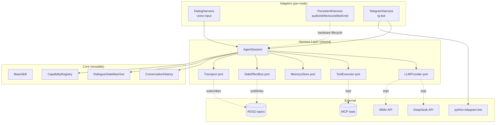
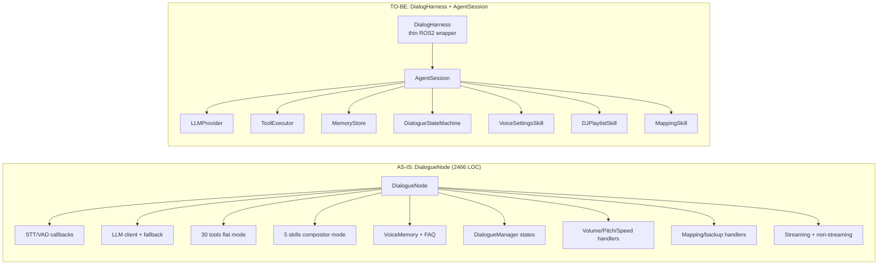
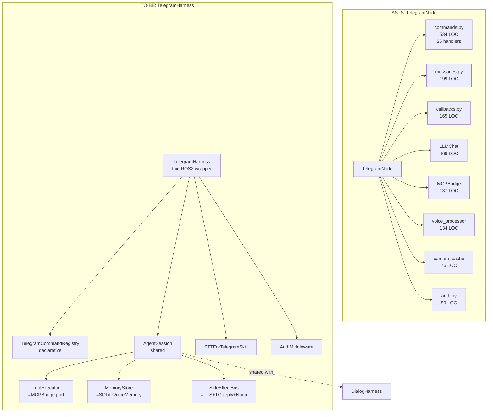
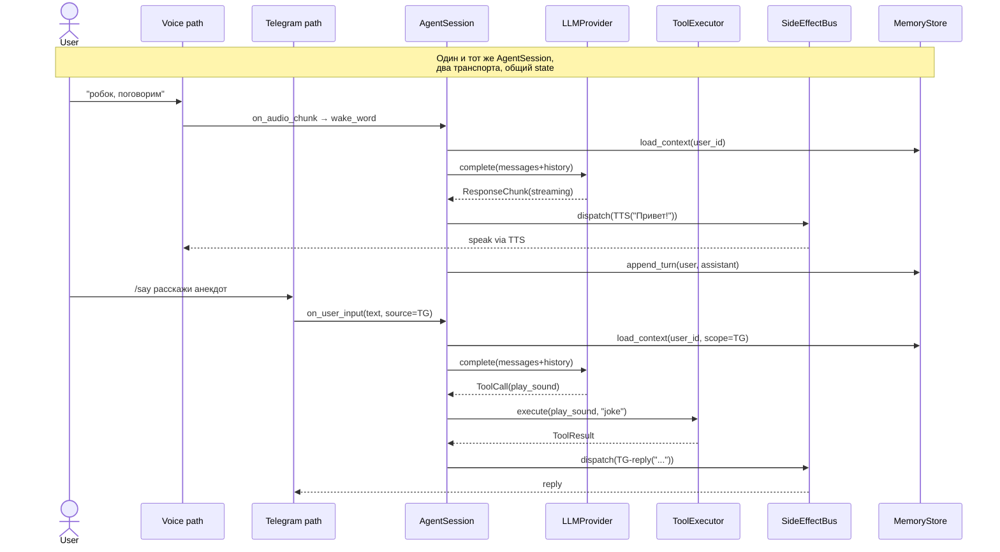

# ADR-0001: Целевая архитектура харнесов для dialog / persistent / telegram нод

| Поле         | Значение                                                                  |
|--------------|---------------------------------------------------------------------------|
| Статус       | Proposed                                                                  |
| Дата         | 2026-07-18                                                                |
| Автор        | architect (Hermes Agent)                                                  |
| Заменяет     | —                                                                         |
| Заменяется   | —                                                                         |
| Контекст     | refactoring task `t_8c0ae7dd`                                             |
| Родители     | `t_0f7b815c` (as-is анализ), `t_ebdc4c99` (best-practices research)       |
| Потомки      | `t_ace66f51` (implementation)                                             |

---

## 1. Контекст и проблема

### 1.1 Что такое «харнесы» в этом проекте

В РОББОКС три ROS2-ноды несут основную **диалоговую** и **операторскую** нагрузку и при этом исторически писались разными людьми, в разное время и с разной степенью покрытия тестами:

- **`DialogueNode`** (`src/rob_box_voice/rob_box_voice/dialogue_node.py`, ~2466 строк, 9% coverage) — голосовой ассистент на OpenAI Agents SDK + DeepSeek/MiMo. Управляет стримом ответов, очередями реплик, инструментами, навыками-сабагентами, wake-word gate, состояниями `IDLE / LISTENING / DIALOGUE / SILENCED`.
- **`PersistentNode`-семейство** (`audio_node`, `stt_node`, `tts_node`, `sound_node`, `led_node`, `command_node` в `src/rob_box_voice/`, ~25–80 KB каждый) — долгоживущие ноды для захвата аудио, распознавания, синтеза, эффектов, светодиодов и навигационных команд. Каждая сама держит состояние и взаимодействует с ROS2-топиками.
- **`TelegramNode`** (`src/rob_box_telegram/rob_box_telegram/telegram_node.py`, 407 строк, ~2300 строк с хендлерами, 0% coverage) — обёртка над `python-telegram-bot` + ROS2-мост. Имеет LLMChat, MCPBridge, CameraCache и набор handler-функций (`commands.py` — 534 строки, `messages.py` — 199 строк, `callbacks.py` — 165 строк).

**«Харнесами»** мы называем **тонкие обёртки поверх этих нод**, которые инкапсулируют: внешние зависимости (LLM-провайдер, Telegram API, аудио-устройство), общие паттерны (state machine, retry, observability, side-effect isolation) и жизненный цикл (startup/shutdown/lifecycle). Цель — единый контракт, скрывающий детали каждой конкретной ноды и дающий переиспользуемый слой для тестов, мониторинга и расширения.

### 1.2 Известные проблемы (из as-is анализа `t_0f7b815c`)

1. **Гигантский DialogueNode**: 1331 statement, 1152 не покрыты тестами. Один класс держит и стрим, и инструменты, и состояние диалога, и обработку wake word, и интеграцию с памятью/FAQ.
2. **Дублирование LLM-логики**: и `dialogue_node.py`, и `telegram/llm_chat.py`, и `mcp_bridge.py`, и `rob_box_mcp_tools/llm_adapter.py` каждый по-своему создают LLM-клиент и обрабатывают tool-calls.
3. **Telegram не имеет моста к voice-пайплайну**: пользователь телеграма может отправить текст — и пойдёт отдельный LLM, не имеющий доступа к `VoiceMemory` / `FAQStore`, истории пользователя, контексту сессии.
4. **Отсутствие абстракции side-effect**: обращения к Telegram API, TTS, sound, LED перемешаны с бизнес-логикой — невозможно тестировать без моков на уровне ROS2.
5. **Side-effects не изолированы**: «куда отправить текст» определяется ad-hoc (параметр `tts_pub`, прямой вызов `publish_tts` из обработчика). Некуда подменить получателя в тестах.
6. **Нет единого state-store**: диалог живёт в памяти `DialogueManager`, история — в `VoiceMemory` (SQLite), но синхронизация ручная.
7. **Tool execution sync/async race**: `LLMToolCallAdapter` имеет и sync, и async варианты; какой используется, зависит от ноды и непрозрачно.

### 1.3 Best-practices из исследования `t_ebdc4c99`

Сводная таблица из отчёта покрывает 6 систем (Hermes, LangGraph, LlamaIndex Workflows, AutoGen, CrewAI, Haystack) × 13 аспектов. Ключевые паттерны, релевантные нам:

| Паттерн                              | Где встречается                                   | Что берём                                       |
|--------------------------------------|---------------------------------------------------|-------------------------------------------------|
| **Ports & Adapters**                 | Hermes Agent, LangGraph nodes                     | LLM-порт, Tool-порт, Transport-порт (TG/STT)    |
| **Capability registry**              | Hermes tools/registry.py                          | Реестр инструментов + capability introspection   |
| **State container**                  | LangGraph `StateGraph`, Haystack pipelines        | Единый объект `SessionState` с reducer'ами       |
| **Lifecycle hooks**                  | Hermes gateway hooks, LangGraph runtime           | `on_start / on_turn / on_tool / on_error / on_stop` |
| **Provider abstraction**             | Hermes runtime_provider, LlamaIndex               | `LLMProvider` (deepseek / mimo / …)             |
| **Streaming chunk + structured event** | Hermes, Haystack                                | `ResponseChunk` + `ToolCall` события            |
| **Human-in-the-loop checkpoint**     | LangGraph interrupt, AutoGen                      | Для wake-word gate, команды «помолчи»           |
| **Side-effect wrapper**              | Haystack `OutputAdapter`, Hermes tools            | `Effect[T] = Callable[[T], None]`                |
| **Threaded bridge to async runtime** | Hermes gateway                                   | Шаблон для TG-loop ↔ ROS2-callbacks             |
| **Run history / replay**             | LangGraph checkpoint, Hermes sessions             | Для тестов и отладки диалога                    |

### 1.4 Бизнес-проблема, которую мы решаем

Без харнесов:

- Каждая нода при добавлении нового сценария (мульти-юзер, голос + TG, vision + dialog) требует **N копипастов** одного и того же кода инициализации LLM/MCP/State.
- Тесты пишутся только верхнего уровня через `unittest.mock` на ROS2, и **только 9% диалоговой ноды** покрыто — это не лечится без разделения ответственностей.
- Telegram остаётся «островом»: его нельзя подключить к общему диалоговому стейту, его инструменты нельзя переиспользовать.

С харнесами:

- Один раз определяем контракт «агент-сессия», и все три ноды становятся **конкретными адаптерами** к нему.
- Тесты становятся дешёвыми: подменяем порты (LLM/MCP/TG/STT) на in-memory fake'и.
- Новые интерфейсы (web, Slack, CLI) — это **новый адаптер**, не новый класс.

---

## 2. Решение

### 2.1 Высокоуровневая целевая архитектура

Вводим **три слоя**:

```
┌──────────────────────────────────────────────────────────────────────┐
│  ADAPTERS LAYER — конкретные интерфейсы пользователя                 │
│  ┌─────────────────┐ ┌─────────────────┐ ┌─────────────────────────┐ │
│  │ DialogAdapter   │ │ PersistentAdapters│ │ TelegramAdapter          │ │
│  │ (voice input)   │ │ (audio/stt/tts/  │ │ (python-telegram-bot →   │ │
│  │                 │ │  sound/led/cmd)  │ │  ROS2)                   │ │
│  └────────┬────────┘ └────────┬─────────┘ └────────────┬────────────┘ │
│           └───────────────────┴────────────────────────┘              │
│                              │ uses                                  │
│                              ▼                                       │
│  HARNESS LAYER — единые контракты (Ports & Adapters)                 │
│  ┌────────────────────────────────────────────────────────────────┐  │
│  │  AgentSession   — state, history, lifecycle hooks              │  │
│  │  Ports:                                                       │  │
│  │    • LLMProvider (deepseek / mimo / mock)                     │  │
│  │    • ToolExecutor (MCP-bridge или fake)                       │  │
│  │    • MemoryStore (VoiceMemory / TelegramChatMemory / Fake)    │  │
│  │    • SideEffectBus (TTS / Sound / LED / TG-reply / noop)      │  │
│  │    • Transport (STT events / TG events / Keyboard events)     │  │
│  │  Skills registry — композиция суб-агентов (sub-handlers)     │  │
│  └────────────────────────────────────────────────────────────────┘  │
│                              │ uses                                  │
│                              ▼                                       │
│  CORE LAYER — переиспользуемая доменная логика                       │
│  ┌────────────────────────────────────────────────────────────────┐  │
│  │  BaseSkill (ABC)        — OpenAI Agents SDK wrapper            │  │
│  │  DialogueStateMachine   — IDLE/LISTENING/DIALOGUE/SILENCED     │  │
│  │  ConversationHistory    — turns + context window + summariser  │  │
│  │  Effect[T] / SideEffectBus                                       │  │
│  │  CapabilityRegistry      — что доступно данному пользователю   │  │
│  └────────────────────────────────────────────────────────────────┘  │
└──────────────────────────────────────────────────────────────────────┘
```

**Ключевая идея**: ROS2-нода остаётся «тонкой обёрткой» (sub/publish + lifecycle), а вся доменная логика — внутри `AgentSession`, который создаётся один раз и шарится между адаптерами.

### 2.2 Контракт `AgentSession` (новый, главный интерфейс)

```python
# Не код проекта, а псевдоконтракт — показывает форму API
class AgentSession(Generic[StateT]):
    state: StateT
    hooks: LifecycleHooks
    llm: LLMProvider
    tools: ToolExecutor
    memory: MemoryStore
    effects: SideEffectBus

    async def on_user_input(self, text: str, source: InputSource) -> SessionResult: ...
    async def on_audio_chunk(self, chunk: AudioData) -> None: ...
    async def on_event(self, event: SystemEvent) -> None: ...
    def snapshot(self) -> SessionSnapshot: ...        # для тестов и отладки
    def replay(self, snapshot: SessionSnapshot) -> None: ...

class LifecycleHooks:
    on_start, on_turn_begin, on_tool_call, on_tool_result, on_response_chunk, on_error, on_stop
```

`StateT` — параметризованный dataclass с reducer'ами (по примеру LangGraph `StateGraph`), чтобы каждый адаптер мог описать своё подмножество полей (`wake_active`, `silenced_until`, `dialogue_id`, `user_id`, `chat_id`).

### 2.3 Целевой вид трёх харнесов

#### 2.3.1 `DialogHarness` (вокруг `DialogueNode`)

**Что остаётся снаружи (тонкая нода)**:
- ROS2 subscribers: `/voice/stt/result`, `/audio/vad`, `/voice/tts/finished`
- ROS2 publishers: `/voice/dialogue/response`, `/voice/dialogue/state`, `/voice/sound/trigger`
- Lifecycle: `__init__ / destroy_node`

**Что переезжает внутрь**:
- LLM-клиент + fallback → в `LLMProvider`
- 30 инструментов / 5 skills → в `ToolExecutor` + `SkillRegistry`
- `DialogueManager` + состояния → в `DialogueStateMachine` (часть Core)
- `voice_memory`, `faq_store` → в `MemoryStore` (портируемый)
- `_ask_llm_streaming` / `_ask_llm_non_streaming` / `_handle_volume_command` / … → в `AgentSession.on_user_input` + skill'ы
- `voice_processor`-подобная логика → отдельный навык `VoiceSettingsSkill`

**Границы**:
- `DialogHarness` **знает** про wake-word и STT/VAD события — это его транспорт.
- `DialogHarness` **не знает** про Telegram и про то, откуда пришёл пользователь.

#### 2.3.2 `PersistentHarness` (унификация audio/stt/tts/sound/led/command)

**Что остаётся снаружи (каждая нода)**:
- Свой единственный «главный» метод — `run_hardware_loop()` или `process(ros_msg)`.
- Параметры ROS2 + состояние устройства.

**Что переезжает внутрь** (общий `PersistentHarness`):
- `HardwareLifecycle` — connect / disconnect / health-check / restart-on-error (сейчас каждый пишет сам).
- `StatePublisher` — единый формат `State { name, status, last_error, uptime, … }` на топик `/<node>/state`.
- `Clock` — единый интерфейс замера времени для тестов (DI в конструктор).
- `LoggerAdapter` — `get_logger()` + structured fields.
- `ParameterGuard` — declare + validate + reload (через `parameters_callback`).

**Границы**:
- `PersistentHarness` — **не** LLM-агент. Это «железный» харнес: только lifecycle и state.
- Не пытаемся вынести специфику устройств (ReSpeaker, Yandex gRPC) — это инвариант конкретной ноды.

#### 2.3.3 `TelegramHarness` (вокруг `TelegramNode`)

**Что остаётся снаружи (тонкая нода)**:
- ROS2 subscribers: `/camera/...`, `/rtabmap/grid_prob_map`, `/mcp/result`, `/mcp/tools`
- ROS2 publishers: `/voice/tts/request`, `/cmd_vel_web`, `/mcp/execute`
- python-telegram-bot `Application` + handlers (но handlers становятся тоньше — см. ниже)

**Что переезжает внутрь**:
- `LLMChat` (469 строк) → `LLMProvider` (порт) + сериализация истории в `MemoryStore`
- `MCPBridge` (137 строк) → `ToolExecutor` (порт) с request/response correlation
- `commands.py` (534 строки, 25 хендлеров) → `TelegramCommandRegistry` (декларативно: команда → skill)
- `messages.py` (199 строк) → единый `text_message_handler` → `AgentSession.on_user_input`
- `voice_processor.py` (134 строки) → отдельный навык `STTForTelegramSkill` (обёртка Yandex STT)
- `camera_cache.py` (76 строк) → `SnapshotStore` (порт, может иметь TG- и Vision- реализации)
- `auth.py` (89 строк) → middleware на уровне dispatcher'а

**Границы**:
- `TelegramHarness` **не знает** про wake-word и STT в голосовом смысле — он отвечает за команды/сообщения.
- Voice через TG идёт через **отдельный skill** (транскрипция + тот же `AgentSession`).

### 2.4 Ключевые интерфейсы (Ports)

| Порт               | Контракт (минимум)                                    | Реализации по умолчанию                                     |
|--------------------|--------------------------------------------------------|------------------------------------------------------------|
| `LLMProvider`      | `complete(messages, tools, settings)`, `stream(...)`  | `DeepSeekProvider`, `MiMoProvider`, `FakeLLMProvider` (tests) |
| `ToolExecutor`     | `execute(call: ToolCall) → ToolResult`                | `MCPBridgeExecutor`, `LocalSkillExecutor`, `FakeToolExecutor` |
| `MemoryStore`      | `append_turn / load_recent / save_fact / search_facts` | `SQLiteVoiceMemory`, `InMemoryStore` (tests), `RedisStore` (future) |
| `SideEffectBus`    | `dispatch(effect: Effect)`                            | `CompositeBus(TTS+Sound+LED+TG-reply)`, `NoopBus` (tests), `RecordingBus` (replay) |
| `Transport`        | `on_stt_result / on_vad / on_tg_update / on_key_event` | `ROS2Transport`, `FakeTransport` (tests)                   |
| `Clock`            | `now() / sleep(seconds) / monotonic()`                | `SystemClock`, `MockClock` (тесты)                         |
| `SnapshotStore`    | `put / get_latest(key, ttl)`                          | `CameraCache`, `InMemorySnapshots`                         |

### 2.5 Диаграммы (mermaid)

#### 2.5.1 Целевая архитектура (высокоуровневая)



#### 2.5.2 Сравнение as-is → to-be (DialogNode)



#### 2.5.3 Telegram: текущий vs целевой



#### 2.5.4 Sequence: один пользователь пишет и голосом, и в Telegram



### 2.6 Правила изоляции side-effects (главный trade-off)

| Решение                              | Альтернатива                         | Почему выбрано                                                                  |
|--------------------------------------|--------------------------------------|---------------------------------------------------------------------------------|
| **Все внешние эффекты — через `SideEffectBus`** | Прямой вызов `publish_tts`, `bot.send_message` | Даёт единственную точку для тестов (NoopBus), записи (RecordingBus) и fan-out (TTS + TG-reply). Без этого харнесы не тестируемы. |
| **Telegram-специфика — middleware, а не дублирование LLM** | Копия LLM-стека в `telegram/llm_chat.py` | Переиспользуем `LLMProvider`. История — общая, чтобы TG-юзер и голосовой юзер видели один контекст. |
| **Persistent-ноды — без общего LLM-слоя** | Пытаться запихнуть всё в один `AgentSession` | У них другая ответственность (аппаратура). Общий только lifecycle/clock/logger. |

---

## 3. Альтернативы, которые мы рассмотрели и отвергли

### 3.1 «Единый базовый класс `BaseRosNode` для всех нод»

**Идея**: один большой ABC с lifecycle, logging, params.

**Почему отвергли**:
- AudioNode (ReSpeaker, threading, VAD), TTSNode (gRPC streaming), TelegramNode (asyncio loop) слишком разные по жизненному циклу.
- Заставит каждую ноду реализовывать методы, которые ей не нужны (LLM, Memory).
- Тестирование упирается в поднятие всего ABC, а не конкретного порта.
- Принцип KISS: лучше несколько маленьких композируемых харнесов, чем один большой.

**Trade-off**: больше файлов, но выше когнитивная локальность каждого харнесса.

### 3.2 «Event Sourcing для всего диалога»

**Идея**: каждый диалог — append-only лог событий, текущее состояние — fold.

**Почему отвергли**:
- На текущей нагрузке (1 юзер × 1 робот) — overkill. Event-sourced системы оправданы, когда нужны time-travel, multi-actor replay и масштабирование чтения. У нас нет ни того, ни другого.
- Существенно увеличивает стоимость каждой фичи: чтобы добавить новый ивент, нужны сериализатор, проекция, миграция.
- VoiceMemory уже даёт нам «лог + поиск»; этого достаточно.

**Когда пересмотреть**: если появится мульти-юзер, мульти-робот, или веб-дашборд с историей диалогов.

### 3.3 «CQRS: разделить command/query пути»

**Идея**: отдельная read-модель для отображения состояния, отдельная write-модель для действий.

**Почему отвергли**:
- У нас ~30 RPS, монолитная БД, нет смысла в разнесении read/write.
- SideEffectBus + MemoryStore уже дают чистое разделение.

**Когда пересмотреть**: если нагрузка вырастет на порядок и потребуется горизонтальное масштабирование.

### 3.4 «Полный микросервисный переход»

**Идея**: каждая нода — отдельный контейнер, общение через Zenoh/broker.

**Почему отвергли**:
- Уже сейчас ROS2 + топики дают loose coupling. Микросервисы прибавят сетевую сложность без выгоды.
- Организация — 2–3 разработчика; overhead на DevOps/observability/k8s не окупится.

**Когда пересмотреть**: когда появится вторая физическая платформа робота.

### 3.5 «Всё на LangGraph / AutoGen»

**Идея**: взять готовый фреймворк для оркестрации агентов.

**Почему отвергли (для core)**:
- Сейчас весь agent-loop написан на `agents` SDK от OpenAI + собственный `BaseSkill`. Это работает и покрывает наши кейсы.
- LangGraph/AutoGen — про **граф состояний**, а у нас скорее **request-response с побочными эффектами**. Переход принёс бы больше зависимости, чем выгоды.
- Но: **порты** (`LLMProvider`, `ToolExecutor`, `MemoryStore`) проектируем так, чтобы при желании миграция была возможна (т. е. не зашиваемся на конкретный SDK).

**Когда пересмотреть**: если потребуются сложные graph-of-agents сценарии (multi-agent debate, tree-of-thought).

### 3.6 «Один общий LLM для всех нод через единый сервис»

**Идея**: вынести LLM в отдельный микросервис, остальные ноды ходят по HTTP.

**Почему отчасти применим (как будущее)**:
- Сейчас LLM-клиент дублируется в `dialogue_node.py`, `telegram/llm_chat.py`, `mcp_bridge.py`, `llm_adapter.py`. Это явный code smell.
- Мы НЕ выделяем микросервис, а выделяем `LLMProvider` порт + единственную реализацию в shared-модуле (`rob_box_llm`). Остальные ноды импортируют.
- Если потом понадобится отдельный сервис — порт уже готов, можно подменить реализацию.

---

## 4. Последствия

### 4.1 Положительные

1. **Тестируемость**: подменяем порты на in-memory fake'и → unit-тесты без поднятия ROS2/LLM/Telegram.
2. **Переиспользование**: TG-юзер и голосовой юзер делят `AgentSession`, историю, инструменты. Один skill доступен обоим каналам.
3. **Расширяемость**: новый канал (Web, Slack) = новый адаптер + reuse всего остального.
4. **Side-effect discipline**: единственная точка записи, можно логировать/мокать/реплеить.
5. **Прозрачность**: `AgentSession.snapshot()` даёт state для дашборда и тестов.

### 4.2 Отрицательные / риски

1. **Больше слоёв** — кривая входа для нового разработчика. Митигируем ADR + примерами в `docs/`.
2. **Индirection** — простой «`node.publish(...)`» становится `node.effects.dispatch(TTS(...))`. Митигируем адаптером, который для тривиальных кейсов сокращает запись.
3. **Риск «premature abstraction»** — мы делаем харнесы до того, как появился второй пользователь каждого порта. Митигируем: **первый шаг — DialogHarness** (покрытие 9% — самое больное), TG — второй, Persistent — третий и минимальный.
4. **Backwards-compat**: текущие ROS2-топики и поведение не меняются в P0/P1 фазах. Контракт топиков — инвариант.

### 4.3 Что НЕ входит в этот ADR

- Изменения ROS2-топиков (другая ADR, когда понадобится).
- Переход на новый LLM/SDk.
- Мульти-юзер / мульти-робот.
- Web-дашборд для диалогов.

---

## 5. План внедрения (краткий обзор)

Подробный план — в `docs/refactoring-plan.md`. Здесь — резюме:

| Фаза | Содержание                                                              | Риск | Длительность |
|------|--------------------------------------------------------------------------|------|--------------|
| P0   | Базовые порты (`LLMProvider`, `Clock`, `LoggerAdapter`) в shared-модуле  | низкий | 3–5 дней   |
| P0   | `DialogHarness` — извлечение `DialogueManager` + `VoiceMemory`-обёртки   | низкий | 5–7 дней   |
| P1   | `AgentSession` + `SideEffectBus` + `ToolExecutor` порт                  | средний | 7–10 дней  |
| P1   | `DialogHarness` v2 — полная миграция `dialogue_node.py` в skill'ы        | средний | 10–14 дней |
| P1   | `TelegramHarness` v1 — `commands.py` → `TelegramCommandRegistry`         | средний | 5–7 дней   |
| P2   | `PersistentHarness` — единый lifecycle/state-publisher                  | низкий | 5–7 дней   |
| P2   | `TelegramHarness` v2 — общий `AgentSession` с голосовым                  | средний | 7–10 дней  |
| P2   | Snapshot/observability hooks + e2e тесты через `AgentSession`           | средний | 5–7 дней   |

**Критерий приёмки**: покрытие `dialogue_node.py` ≥ 60%, `telegram_node.py` ≥ 60%, e2e-сценарий «voice → LLM → telegram reply» работает через общий `AgentSession`.

---

## 6. Ссылки

- As-is анализ: `docs/analysis/current-nodes.md` (`t_0f7b815c`, ветка `feature/analysis-current-nodes`)
- Best-practices research: `docs/research/harness-best-practices.md` (`t_ebdc4c99`)
- Интерфейсы текущих нод: `docs/reports/PERSISTENT_NODES_INTERFACES.md`
- Имплементация: `t_ace66f51` (Kanban)
- Формат ADR: Nygard (https://github.com/joelparkerhenderson/architecture_decision_records)

---

*Готово к ревью. План рефакторинга — в `docs/refactoring-plan.md`.*
