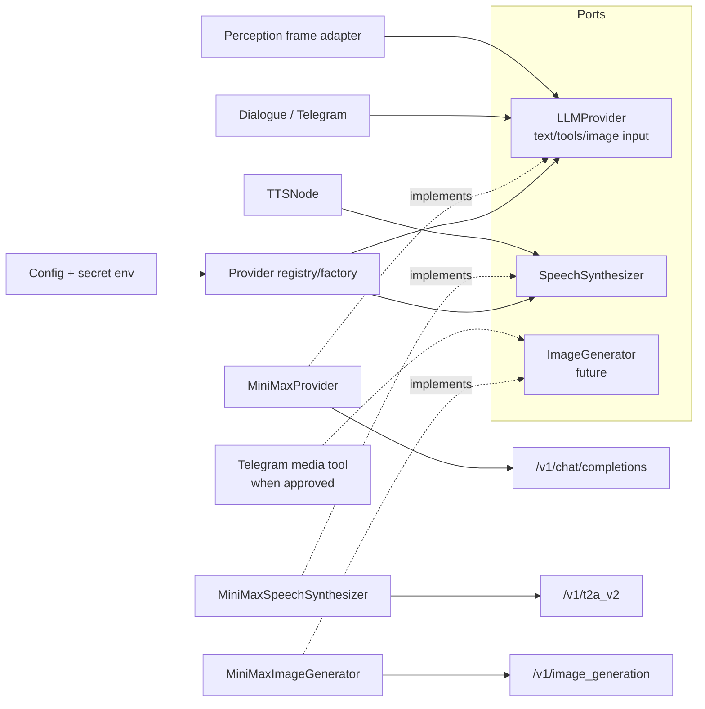

# ADR-0002: Capability-segregated интеграция MiniMax

| Поле | Значение |
|---|---|
| Статус | Proposed |
| Дата | 2026-07-20 |
| Контекст | PR [#907](https://github.com/krikz/rob_box_project/pull/907) |
| Связан с | [ADR-0001](0001-harness-architecture.md), [`architecture/minimax-provider.md`](../../architecture/minimax-provider.md) |
| Заменяет | — |
| Заменяется | — |

## Контекст

PR #907 вводит общий модуль `rob_box_llm` с портом `LLMProvider`, OpenAI-compatible base adapter и реализациями DeepSeek/Xiaomi MiMo. Нужен новый глобальный MiniMax-провайдер с text/tool/streaming и image-input, а также понятный путь для image generation и TTS.

MiniMax предоставляет разные API:

- OpenAI-compatible `POST https://api.minimax.io/v1/chat/completions` для `MiniMax-M3`, включая image input;
- `POST /v1/image_generation` для image generation;
- `POST /v1/t2a_v2` и WebSocket API для TTS.

Текущий `LLMProvider` принимает только строковый `LLMMessage.content`. `DialogueNode`, Telegram `LLMChat`, perception и `TTSNode` пока создают/используют внешние клиенты независимо. Если добавить MiniMax напрямую в каждую ноду, появятся новые копии конфигурации, сериализации, ошибок и fallback.

## Решение

1. Реализовать `MiniMaxProvider` как адаптер существующего `LLMProvider` поверх OpenAI-compatible API и `_OpenAICompatibleProvider`.
2. Backward-compatible расширить `LLMMessage.content`: строка остаётся валидной, а для vision добавляется упорядоченная композиция `TextPart`/`ImagePart`.
3. Добавить `ProviderCapabilities` с консервативными defaults и model-aware validation. `MiniMax-M3` поддерживает image input, но override на M2.x не наследует эту capability. Существующие DeepSeek/MiMo adapters явно декларируют только возможности, подтверждённые их тестами. Fallback выбирает только provider, способный обработать конкретный запрос.
4. Не добавлять TTS и image generation methods в `LLMProvider`:
   - TTS реализует отдельный `SpeechSynthesizer` port в voice layer;
   - image generation получит отдельный `ImageGenerator` port только вместе с подтверждённым consumer use case.
5. Выбирать provider через registry/factory в composition root. API key берётся из `MINIMAX_API_KEY`; production secrets не хранятся в ROS YAML или git.
6. Сохранить существующие ROS2 topics, payload schemas и defaults. Новый provider включается только конфигурацией.
7. Fallback реализовать decorator-ом над портом, а не внутри MiniMax adapter. Streaming fallback возможен только до первого chunk.
8. MiniMax vision использовать для редкого semantic frame analysis; continuous/safety-critical perception остаётся локальным.

## Обоснование по decision framework

### Какую бизнес-проблему решает

Даёт voice, Telegram и perception один заменяемый MiniMax client, позволяет подключить vision/TTS без копипаста и сохраняет возможность отката на существующие providers.

### Самая простая альтернатива

Добавить `minimax` в локальные словари `DialogueNode.PROVIDERS` и `LLMChat.PROVIDERS`. Эта альтернатива приемлема только для одноразового text smoke test, но не для production: vision serializer, error mapping и secret resolution пришлось бы реализовывать несколько раз.

### Complexity vs benefit

Добавляются content parts, capabilities и factory — это умеренная сложность. Выгода измерима: offline unit-тесты одного адаптера, единое error mapping, один config path, capability-aware fallback и отсутствие изменений ROS interface.

### Что будет, если не делать сейчас

Текущий text-only код продолжит работать. Но миграция после того, как MiniMax появится в трёх нодах, станет дороже и рискованнее. PR #907 — минимальная точка стоимости, потому что shared provider port только вводится и потребители ещё не мигрированы.

## Рассмотренные альтернативы

### A. Один универсальный provider с `complete`, `synthesize`, `generate_image`

Отклонено. Нарушает Interface Segregation и заставляет text-only providers поддерживать бессмысленные методы. Chat, audio и image API имеют разные lifecycle, error model и consumers.

### B. Отдельный MiniMax ROS2 service/microservice

Отклонено. Один робот и текущая нагрузка не оправдывают отдельный deployment, network hop, service discovery и observability stack. In-process adapter с DI проще. Выделение сервиса можно пересмотреть при нескольких роботах или независимом масштабировании media workloads.

### C. Anthropic-compatible MiniMax API

Отложено. MiniMax рекомендует этот API для advanced reasoning, но проект уже использует OpenAI SDK и OpenAI-compatible tool schemas. Второй SDK в P0 увеличит сложность без необходимой бизнес-выгоды. Порт позволяет заменить adapter позже.

### D. Отправлять каждый camera frame в MiniMax

Отклонено из-за latency, bandwidth, стоимости, privacy и зависимости safety path от интернета. Cloud vision допускается только по событию или с жёстким rate limit.

### E. Сразу реализовать image generation

Отложено до подтверждённого потребителя. Image generation не является perception. Без Telegram/display/tool use case код будет неиспользуемым. Порт проектируется отдельно, но runtime adapter добавляется вместе с consumer.

### F. Event bus/CQRS для переключения capabilities

Отклонено как overengineering. Registry + decorator fallback достаточно; ROS2 уже обеспечивает транспортную развязку между нодами.

## Последствия

### Положительные

- MiniMax подключается без нового LLM-стека.
- Мультимодальный message contract пригоден для других providers.
- Fallback не отправляет image request в text-only provider.
- TTS и image generation не загрязняют LLM interface.
- ROS contracts и текущие defaults остаются стабильными.
- Unit-тесты не требуют сети или реального ключа.

### Отрицательные

- Публичный provider API получает новые value objects.
- Для TTS нужен небольшой предварительный рефакторинг большого `TTSNode`.
- До миграции потребителей временно сосуществуют legacy manager/dictionaries и новый registry.
- OpenAI-compatible API не раскрывает все преимущества Anthropic-compatible thinking.

### Риски и mitigation

| Риск | Mitigation |
|---|---|
| Сломать text-only consumers | `str` остаётся допустимым content; compatibility tests |
| Утечка изображений/ключа | redaction, запрет payload logging, env/Docker secret |
| Дублированный ответ при fallback | fallback только до первого stream chunk |
| Cloud vision блокирует robot loop | async call, timeout/cancellation, bounded sampling |
| TTS меняет голос по умолчанию | MiniMax opt-in; default остаётся Yandex → Silero |
| Provider-specific options раздувают общий API | временно validated `LLMSettings.extra`, позднее локальный options object |
| Следующие фазы PR ломают предыдущие | additive commits, feature flags, gates и сохранение legacy paths до parity |

## Границы решения

Не входят в ADR:

- изменение ROS2 topic names;
- continuous video upload;
- image/video generation workflow без consumer;
- distributed provider service;
- хранение media/reasoning в conversation memory;
- автоматическое включение MiniMax в production defaults.

## План внедрения и gates

1. Контракт: content parts + capabilities; существующие tests green.
2. MiniMax chat adapter: fake SDK tests; provider не default.
3. Registry/factory/fallback: классификация ошибок и capability filtering.
4. Consumer migration: feature flag и parity для DeepSeek/MiMo.
5. Vision: selected-frame adapter с прежним `/perception/vision_context`.
6. TTS: `SpeechSynthesizer`, non-streaming MiniMax opt-in, прежние ROS topics.
7. Image generation: только после принятия consumer use case.

Полные точки расширения и acceptance criteria описаны в [`architecture/minimax-provider.md`](../../architecture/minimax-provider.md).

## Когда пересмотреть решение

- несколько роботов независимо масштабируют LLM/media traffic;
- Anthropic-compatible interleaved thinking даёт измеримое качество;
- streaming TTS заметно улучшает end-to-end latency;
- появляется подтверждённый image-generation consumer;
- cloud vision становится частью safety-critical path — в этом случае решение следует не расширять, а заменить локальной/edge моделью с формальными SLO.

## Источники

- MiniMax OpenAI SDK: https://platform.minimax.io/docs/api-reference/text-openai-api
- MiniMax Chat Completions: https://platform.minimax.io/docs/api-reference/text-chat-openai
- MiniMax endpoint/model invocation: https://platform.minimax.io/docs/guides/text-generation
- MiniMax image generation: https://platform.minimax.io/docs/guides/image-generation
- MiniMax TTS HTTP: https://platform.minimax.io/docs/api-reference/speech-t2a-http
