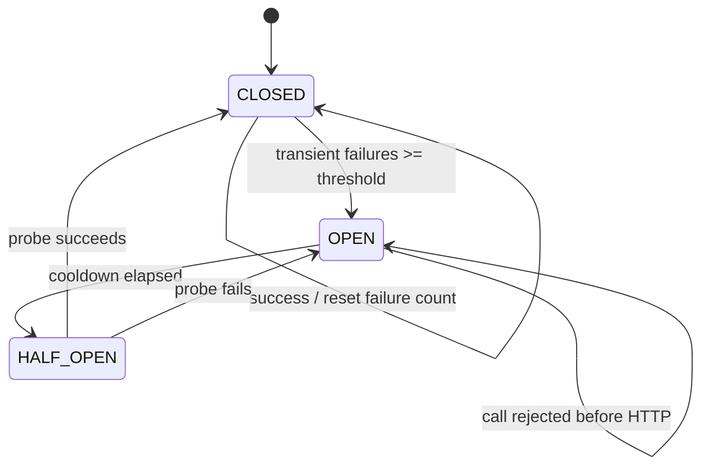

# ADR-0007: MiniMax TTS — финальный сводный архитектурный контракт интеграции

| Поле         | Значение                                                                |
|--------------|-------------------------------------------------------------------------|
| Статус       | **Accepted**                                                           |
| Дата         | 2026-07-21 (финализирован 2026-07-22)                                  |
| Автор        | architect (Hermes Agent)                                                |
| Контекст     | Kanban task `t_460ce2c4` (синтез); потомки: `t_2027fd08`, `t_3ff1d7f5`, `t_7bd3ea39`, `t_a43d5a4e` |
| Родители     | [ADR-0001](0001-harness-architecture.md), [ADR-0002](0002-minimax-provider.md), [ADR-0003](0003-minimax-tts-architecture.md), [ADR-0004](0004-minimax-tts-integration-design.md), [ADR-0006](0006-minimax-tts-pydantic-settings-config.md) |
| Sub-fragments (детализация, не самостоятельные ADR) | [`0007a-minimax-tts-reliability-fragment.md`](0007a-minimax-tts-reliability-fragment.md), [`0007b-minimax-tts-ros2-audio-contract-fragment.md`](0007b-minimax-tts-ros2-audio-contract-fragment.md) |
| Связанные    | [ADR-0008](0008-tts-provider-extension-points.md) — landed extension points; [`../research/minimax-tts-api.md`](../research/minimax-tts-api.md) — публичный контракт MiniMax API |
| Реализация   | `t_25b8e221`, `t_8cbf9995`, `t_b16554f9`, `t_460ae9c6`, `t_72e7a657` — все landed в `wt/t_ac5f796b` (см. §9) |
| Engineering reference | [`../architecture/minimax-tts-integration-design.md`](../architecture/minimax-tts-integration-design.md) |
| Диаграммы    | [`../diagrams/minimax-tts-final-class.mmd`](../diagrams/minimax-tts-final-class.mmd) — class; [`../diagrams/minimax-tts-integration-sequence.mmd`](../diagrams/minimax-tts-integration-sequence.mmd) — реестр/retry-loop; [`../diagrams/minimax-tts-ros2-audio-contract-sequence.mmd`](../diagrams/minimax-tts-ros2-audio-contract-sequence.mmd) — audio-контракт; [`../diagrams/minimax-tts-integration-class.mmd`](../diagrams/minimax-tts-integration-class.mmd) — class (legacy, см. ADR-0004) |
| AS-IS снапшот | [`../analysis/tts-current-interface.md`](../analysis/tts-current-interface.md) |
| API-реферат   | [`../research/minimax-tts-api.md`](../research/minimax-tts-api.md)      |

---

## 1. Контекст и зачем нужен именно этот документ

`rob_box` подключает MiniMax TTS как **опциональный третий TTS-провайдер**
в `tts_node` (рядом с Yandex и Silero), не ломая существующий пайплайн.
К моменту написания ADR-0007 уже зафиксированы:

- [ADR-0002](0002-minimax-provider.md) — MiniMax в целом, opt-in через `provider=minimax`,
  no silent fallback. Зафиксировал границу "почему именно MiniMax".
- [ADR-0003](0003-minimax-tts-architecture.md) — реализационный контракт TTS:
  маппинг `TTSSettings` → T2A v2 body, цепочка форматов
  `hex PCM → TTSAudio → int16 AudioData`, retry-loop на стороне `tts_node`.
- [ADR-0004](0004-minimax-tts-integration-design.md) — design-контракт интеграции:
  `BaseTTSProvider`, `TTSProviderRegistry`, `RetryPolicy`, `CircuitBreaker`,
  AudioStamped forward-compat, точки расширения.
- [ADR-0006](0006-minimax-tts-pydantic-settings-config.md) — pydantic-settings
  конфиг-схема для CLI/cron-forward-compat (ROS-путь остаётся на ROS-параметрах).

**Чего этим четырём документам не хватает.** Они каждый закрывают свой
вертикальный срез (дизайн, конфиг, ROS-контракт, надёжность), но
**отдельного сводного "decision"** с финальным набором архитектурных
выборов, диаграммами классов/sequence и явной trade-off-таблицей по
**осям «стоимость / латентность / расширяемость / надёжность»** — нет.
ADR-0004 фиксирует большинство решений, но размазывает trade-off по
приложению A; ADR-0006 подробен по конфигу, но не сводит всё вместе.

**Назначение ADR-0007** — синтезный документ, который:

1. Подтверждает финальное архитектурное решение (single port + registry
   + pydantic-settings + ROS2 AudioStamped + circuit breaker + streaming
   opt-in).
2. Делает сводную class-диаграмму, объединяющую классы из всех 4
   parent-ADR'ов и sub-fragment'ов.
3. Делает сводную end-to-end sequence-диаграмму с реальной топологией
   caller → factory → provider → MiniMax API → ROS2 topic → audio_play.
4. Даёт **явный trade-off по 4 осям** в виде таблицы с конкретными
   значениями "что выигрываем / что платим".
5. Фиксирует Consequences (упрощения, усложнения, остаточные риски).
6. Является **документом, который человек-ревьюер открывает первым** —
   остальные ADR'ы читаются как детализация по ссылке.

### 1.1 Что ADR-0007 НЕ покрывает

**Consolidation complete (Phase 6, D-01):** Fragments 0007a (reliability), 0007b (ROS2 audio contract), and 0007c (runtime operations) verified incorporated. Fragments deleted — all content lives in this single canonical ADR-0007.

- Реализация `BaseTTSProvider` / `RetryPolicy` / `TTSProviderRegistry` —
  это дочерняя задача `t_25b8e221`. ADR-0007 фиксирует только форму
  (что должно быть реализовано), но не реализацию.
- Реализация CLI `rob_box_llm.tts_cli` — отдельная задача. ADR-0006
  отвечает за контракт конфигурации, ADR-0007 — за общую архитектуру.
- WebSocket chunk-per-frame streaming — отдельный future-ADR (ADR-0004 §7).
- Замена Yandex/Silero на MiniMax по умолчанию — запрещена ADR-0002 §2.1.

### 1.2 Что уже зафиксировано (родители)

| Что                              | Где                                                    |
|----------------------------------|--------------------------------------------------------|
| MiniMax в целом, opt-in          | [ADR-0002](0002-minimax-provider.md)                   |
| TTS-реализационный контракт      | [ADR-0003](0003-minimax-tts-architecture.md)           |
| Design-контракт, port, registry, retry, CB, streaming | [ADR-0004](0004-minimax-tts-integration-design.md) |
| pydantic-settings конфиг-схема   | [ADR-0006](0006-minimax-tts-pydantic-settings-config.md) |
| Reliability (sub-fragment)       | [`0007a-…`](0007a-minimax-tts-reliability-fragment.md) |
| ROS 2 audio contract (sub-frag.) | [`0007b-…`](0007b-minimax-tts-ros2-audio-contract-fragment.md) |
| AS-IS снапшот текущего кода      | [`../analysis/tts-current-interface.md`](../analysis/tts-current-interface.md) |
| Публичный контракт MiniMax API   | [`../research/minimax-tts-api.md`](../research/minimax-tts-api.md) |
| `TTSProvider` ABC + value-объекты | `src/rob_box_llm/rob_box_llm/tts.py:121-177`         |
| `MiniMaxTTSProvider` (sync + SSE) | `src/rob_box_llm/rob_box_llm/providers/minimax_tts.py:299-673` |
| Wire в `tts_node.py`             | `src/rob_box_voice/rob_box_voice/tts_node.py:160-289, 740-756, 1148-1199, 1201-1258, 1260-1327` |
| Retry-loop в `tts_node`          | `tts_node.py:1201-1258`                                |

---

## 2. Решение (итоговый архитектурный контракт)

> Полная развёрнутая детализация — в parent-ADR'ах (0004, 0006) и
> sub-fragment'ах (`0007a-…`, `0007b-…`). Здесь — **сама суть**, чтобы
> ревьюер мог одобрить документ, не открывая остальные.

### 2.1 Доменный контракт и value-объекты (из ADR-0004 §2.1, ADR-0003)

- `TTSSettings` — frozen value-object: `voice`, `model`, `language`,
  `speed`, `sample_rate`, `format`, `timeout`. Хранится в
  `src/rob_box_llm/rob_box_llm/tts.py`.
- `TTSAudio` — результат `synthesize()`: `samples: bytes`, `sample_rate`,
  `channels`.
- `TTSChunk` — элемент `stream()` AsyncIterator: `samples: bytes`,
  `finish_reason: Literal[continue|stop|error]`.
- Иерархия `TTSError` (`tts.py` + `errors.py:63-90`):
  `TTSAuthError` (401/403), `TTSBadRequestError` (4xx),
  `TTSRateLimitError` (429, +`retry_after_s`), `TTSUpstreamError`
  (5xx/contract, +`breaker_open`), `TTSTimeoutError` (connect/read).
- Все value-объекты и иерархия ошибок — **frozen на P0.5**.

### 2.2 Port & adapter (ADR-0004 §2.1–2.2)

- **`BaseTTSProvider`** — единый abstract port, методы `synthesize`,
  `stream`, `list_voices`, `healthcheck`, `aclose` (idempotent).
- **`MiniMaxTTSProvider`** — конкретный adapter, прямой наследник
  `TTSProvider` (НЕ `BaseTTSProvider`, чтобы не ломать существующих
  потребителей). Внутри: `httpx.AsyncClient` (HTTP/SSE) + reserved
  WebSocket для chunk-per-frame. Маппинг ошибок `TTSError` живёт
  **внутри адаптера**; наружу утекает только typed exception.
- **Backward compatibility rule:** внутренний retry внутри адаптера
  ЗАПРЕЩЁН (ADR-0003 §4). Retry-owning — на caller'е
  (`tts_node`/`TTSCLI`).

### 2.3 Registry + Factory (ADR-0004 §2.3, §2.8)

- `TTSProviderRegistry` — хранит `builders: dict[str, ProviderBuilder]`.
  Built-ins регистрируются **явно в composition root**
  (`register_builtin_tts()`): никакого `importlib`-сканирования. Это
  важно для тестируемости и предотвращения неявных side-effects.
- `TTSProviderFactory.create(name, config, registry)` — синхронная
  фабрика, возвращает `BaseTTSProvider` (или конкретного потомка).
- Migration на registry — **отложена до второго opt-in провайдера**
  (ADR-0004 §2.8). До этого `tts_node` знает только `minimax`/legacy
  как прямые импорты.

### 2.4 Конфигурация (cross-ADR reference)

| Потребитель        | Источник                | Что  | Где валидируется                |
|--------------------|-------------------------|------|---------------------------------|
| ROS-путь `tts_node` | ROS-параметры (primary) | runtime config | `tts_node` при старте (typed) |
| ROS-путь           | ENV (только секреты)    | `MINIMAX_API_KEY`, `MINIMAX_GROUP_ID` | `minimax_tts.py:347-393` |
| Multi-robot deploy | YAML `/etc/rob_box/tts.yaml` (opt-in) | всё кроме секретов | ADR-0004 §2.5 YAML-схема |
| CLI / cron         | **pydantic-settings** `MiniMaxTTSConfig` (5 секций: auth/network/retries/audio/logging) | всё | ADR-0006 §2.3, fail-fast |

Сводная таблица всех 17 настроек — в [ADR-0006 §4](0006-minimax-tts-pydantic-settings-config.md).

**Почему pydantic-settings только в CLI:**
- ADR-0004 §2.5 / §3.4 явно отвергает pydantic-settings в базовом
  пайплайне (`rob_box_llm` сейчас не зависит от `pydantic`, добавление
  = +1 hard dep, потенциальные конфликты с `pydantic>=2`).
- В CLI нет ROS-launch → нет typed ROS-параметров → нужен полный
  источник конфигурации. Pydantic-settings даёт ENV-binding,
  validation (HttpUrl/SecretStr/range/Literal), fail-fast с понятными
  сообщениями — бесплатно.

### 2.5 ROS 2 audio contract (sub-fragment `0007b`)

Зафиксированные параметры PCM для v1:

| Поле              | Значение v1   | Правило проверки |
|-------------------|---------------|------------------|
| `sample_rate`     | 16 000 Hz     | MiniMax запрашивается на 32000; при отличии — обязательный ресэмплинг в `tts_node` |
| `bit_depth`       | 16 bit        | только signed PCM |
| `format`          | `pcm_s16le`   | `data` — raw bytes, не WAV/не base64/не hex |
| `channels`        | 1 (mono)      | TTS-выход моно; stereo — только в локальном playback |
| `frame_size`      | 640 bytes / 20 ms | `16000 × 0.020 × 2 × 1 = 640` |

**Топики (frozen, изменение не предполагается):**

- `/voice/dialogue/response`, `/voice/tts/request` — команды
  (`std_msgs/String`, Reliable + Volatile + KEEP_LAST(10)).
- `/voice/audio/speech` — основной аудио-выход
  (`audio_common_msgs/AudioData`). Топик и тип — frozen.
- `/voice/tts/state`, `/voice/tts/finished` — управляющие.
- `/voice/audio/speech_meta` — **opt-in** `AudioDataStamped`-подобный
  custom message (для streaming с timestamp/seq). По умолчанию
  ВЫКЛЮЧЕН (см. ADR-0004 §2.6).

**QoS:**
- Команды — `Reliable + Volatile + KEEP_LAST`, depth 10.
- Аудио — `Best Effort + Volatile + KEEP_LAST`, bounded depth 10
  (эквивалент `qos_profile_sensor_data`).
- Reliability/durability parity между publisher и subscriber обязателен.

**Backpressure (sub-fragment `0007b` §2.4):**
1. Размер сообщения ограничен DDS/RMW — многосекундный поток одним
   сообщением НЕ отправляется в streaming-пути (20 ms chunks = 640 bytes
   = bounded payload без DDS-fragmentation).
2. Publisher не накапливает бесконечную очередь: `KEEP_LAST` + bounded
   depth; при `Best Effort` — отбрасывание старых chunks при переполнении.
3. Consumer обязан обнаруживать пропуск sequence/timestamp и сбрасывать
   неполный playback buffer.
4. При barge-in `STOP` очищает очередь playback и отбрасывает chunks
   старого `dialogue_id`.

> Подробности, параметры и trade-off аудио-контракта —
> [`0007b-minimax-tts-ros2-audio-contract-fragment.md`](0007b-minimax-tts-ros2-audio-contract-fragment.md).

### 2.6 Reliability, retry, circuit breaker (sub-fragment `0007a`)

**Operating modes (sub-fragment §"Operating modes and mode selection"):**

- **Non-streaming (default)** — один HTTP-запрос `stream=false`,
  буферизация полного hex, декодирование в `TTSAudio`. Безопасный
  baseline для коротких реплик; сохраняет существующий контракт
  `TTSAudio`.
- **HTTP streaming (optional)** — `stream=true`, SSE. Каждое событие
  декодируется в `TTSChunk`; финальное → `finish_reason="stop"`. Если
  ошибка после первого чанка — отдаём terminal `TTSChunk(finish_reason="error")`.
- **WebSocket (reserved)** — отдельный future-ADR; НЕ включается просто
  поднятием `streaming=true`.

**Selection policy:**

```text
if explicit_mode is not AUTO:
    mode = explicit_mode
elif len(text) >= streaming_threshold and transport.supports_streaming:
    mode = STREAMING
else:
    mode = NON_STREAMING
```

**Error taxonomy** — единая точка маппинга в провайдере, retention
`status_code`+`request_id`, без логирования секретов / полного текста /
base64/hex аудио. `CancelledError` НЕ превращается в retryable
upstream-ошибку (суб-fragment §"Timeouts, cancellation, and shutdown").

**Retry policy** — bounded exponential backoff + full jitter; `Retry-After`
с приоритетом над calculated delay, но capped. Retry применяется ТОЛЬКО к
`TTSUpstreamError`/`TTSTimeoutError`/`TTSRateLimitError`; auth/validation/
malformed payload НЕ ретраятся. Подробный псевдокод — sub-fragment
§"Retry policy".

**Circuit breaker (sub-fragment §"Circuit breaker")** — per upstream
identity (provider + base URL; опционально model/tenant), не process-global.
State machine: `CLOSED → OPEN → HALF_OPEN → CLOSED/OPEN`.



- `CLOSED` — пропускает вызовы; считаются только retryable-ошибки.
  Auth/bad request НЕ открывают breaker.
- `OPEN` — fail-fast c `TTSUpstreamError(breaker_open=True)`, без HTTP.
- `HALF_OPEN` — допускает один probe (или bounded quota); concurrent
  callers — fail-fast или wait по явной настройке.

Default state: **disabled** (порог = 0, см. ADR-0006 §4). Activation —
только при >100 TPS/час/робот (ADR-0004 §7).

> Полная классификация ошибок, retry-блок-схемы, таймауты,
> cancellation, shutdown, observability-чеклист —
> [`0007a-minimax-tts-reliability-fragment.md`](0007a-minimax-tts-reliability-fragment.md).

### 2.7 Архитектурные артефакты (диаграммы)

#### 2.7.1 Сводная class-диаграмма

`docs/diagrams/minimax-tts-final-class.mmd` (313 строк) — единая
"карта классов" интеграции MiniMax TTS в rob_box. Объединяет:

- Frozen domain value-объекты (`TTSSettings`, `TTSAudio`, `TTSChunk`,
  `TTSVoice`, `TTSHealth`) и иерархию `TTSError`.
- Port & adapter (`BaseTTSProvider`, `MiniMaxTTSProvider` как
  HTTP/SSE/WS-adapter, `FutureProvider` как placeholder для
  ElevenLabs/Google/local).
- Registry + factory (`ProviderBuilder`, `TTSProviderRegistry`,
  `TTSProviderFactory.create()`).
- Config schema (`MiniMaxTTSConfig` с 5 секциями: auth/network/retries/audio/logging).
- Retry-policy и circuit breaker (`RetryPolicy`, `CircuitBreaker`,
  `BreakerState`, `RetryExecutor`).
- Streaming modes (`StreamingMode` enum).
- ROS 2 audio contract (`AudioDataMsg`, `AudioStampedMsg` opt-in).
- Composition roots (`TTSNode`, `TTSCLI`, `TestHarness`, `AudioPlayNode`).

Каждый класс помечен комментарием (`<<…>>`) с явным статусом
("frozen at P0.5" / "forward-compat, НЕ реализован в P0.5" /
"только CLI/cron" / "decorator only sugar").

#### 2.7.2 Sequence-диаграммы (две)

- **`minimax-tts-integration-sequence.mmd`** (94 строки) — реестр +
  retry-loop: `caller → dialogue_node → tts_node → registry →
  MiniMaxTTSProvider → api.minimax.io → /voice/audio/speech →
  audio_playback`. Показывает: registry resolution, retry-loop с
  exp backoff (0.5s/1.0s/2.0s), AudioStamped opt-in (пунктир), SSE
  streaming.
- **`minimax-tts-ros2-audio-contract-sequence.mmd`** (41 строка) —
  аудио-контракт в действии: `caller → tts_node → MiniMaxTTSProvider →
  MiniMax T2A v2 → /voice/audio/speech (AudioData) → audio_play_node →
  AudioPlaybackManager/ReSpeaker`. Показывает sync (legacy v1) и
  streaming (opt-in, 20 ms chunks) ветки, QoS, barge-in политику.

#### 2.7.3 Dataflow и streaming-диаграммы

- **`minimax-tts-ros2-dataflow.mmd`** — dataflow от MiniMax API через decode,
  обязательный ресэмплинг и ROS 2 publisher до speaker; reference-описание —
  [`ros2-audio-contract-spec.md`](../architecture/ros2-audio-contract-spec.md).
- **`minimax-tts-sequence.mmd`** — streaming-oriented sequence с terminal
  chunk, cancellation и playback boundary; нормативные правила — `0007a` и
  `0007b`.
- **`tts-extension-class.mmd` / `tts-extension-sequence.mmd`** —
  provider extension points; в исходном design-документе
  (`docs/architecture/tts-extension-points.md`) были design-only артефактами.
  После коммита `37315f48` (t_8cbf9995) registry приземлён в production
  (`src/rob_box_llm/rob_box_llm/tts_provider_base.py`,
  `tts_provider_registry.py`); см. ADR-0008.

### 2.7.4 Назначение каждой диаграммы

| Диаграмма                              | Что показывает                                    | Где читать                                                    |
|----------------------------------------|---------------------------------------------------|---------------------------------------------------------------|
| `minimax-tts-final-class.mmd`          | Полная карта классов (4 parent ADR + 2 fragment)  | Когда нужно понять "что за что отвечает"                     |
| `minimax-tts-integration-sequence.mmd` | End-to-end happy + retry, registry, AudioStamped  | Когда нужно понять "как пойдёт запрос в работе"             |
| `minimax-tts-ros2-audio-contract-sequence.mmd` | Аудио-контракт, ROS 2 message shape, QoS       | Когда нужно понять "что уходит в ROS и в каком формате"      |
| `minimax-tts-integration-class.mmd`    | Legacy class-диаграмма (ADR-0004 §2)             | Ссылка только из ADR-0004; supersede через final-class       |

---

## 3. Trade-off по осям

> Каждое ключевое решение ADR-0004/0006/sub-fragments — через призму
> стоимости, латентности, расширяемости, надёжности. Эта таблица —
> **явный список компромиссов**, на которые человек-ревьюер должен
> ответить "да, принимаю".

### 3.1 Сводная таблица

| Решение (ADR ref)                                       | Стоимость (сложность / зависимости)                                 | Латентность                                                    | Расширяемость                                                  | Надёжность                                                                                       |
|----------------------------------------------------------|---------------------------------------------------------------------|----------------------------------------------------------------|-----------------------------------------------------------------|-------------------------------------------------------------------------------------------------|
| `BaseTTSProvider` ABC, opt-in (ADR-0004 §2.1)            | +1 abstract class сейчас; +0 строк кода до появления 2-го провайдера | Без изменений                                                  | ✅ База для всех будущих TTS (ElevenLabs, Google, Azure, local) | ✅ Idempotent `aclose()` + retry-hook на caller'е                                                |
| MiniMax = прямой наследник `TTSProvider` (не ABC)         | 0 сейчас                                                            | Без изменений                                                  | ⚠️ Миграция на ABC при появлении 2-го провайдера               | ✅ Не ломает существующий Yandex/Silero пайплайн                                                |
| ROS-параметры + ENV (секреты) + опц. YAML (ADR-0004 §2.5) | +0 hard deps                                                        | Без изменений                                                  | ✅ Multi-robot через YAML                                       | ✅ Только секреты в ENV → нельзя случайно закоммитить                                            |
| pydantic-settings только CLI/cron (ADR-0006)              | +1 hard dep (`pydantic-settings`) только в `rob_box_llm.config`     | Без изменений в ROS-пути                                       | ✅ CLI/cron получают типизированный валидатор + fail-fast       | ✅ `extra='forbid'` ловит ENV-опечатки до HTTP-вызова                                            |
| Секции в `MiniMaxTTSConfig` (auth/network/retries/audio/logging) | +5 pydantic-моделей; CLI-help сгруппирует               | Без изменений                                                  | ✅ Легко добавлять новые секции (voice_clone, caching)         | ✅ `AuthConfig.env_file=None` — секреты НЕ в файле                                                |
| `TTSProviderRegistry` + composition root (ADR-0004 §2.3, §2.8) | +1 indirection (после миграции)                                     | Без изменений                                                  | ✅ Добавление провайдера без правки `tts_node`                  | ✅ Single source of error surface                                                                 |
| `RetryPolicy` value-object (ADR-0004 §2.9)               | +1 dataclass; рефактор `tts_node` retry-loop                        | Без изменений (та же политика)                                 | ✅ CLI/cron переиспользуют; sub-fragment `0007a` детализирует  | ✅ Зафиксированный контракт retry: classification + backoff + `Retry-After`                       |
| `CircuitBreaker` обозначен, default disabled (ADR-0004 §2.10) | +0 строк сейчас; +N строк при >100 TPS/час                       | Без изменений                                                  | ✅ Shape зафиксирована (`CLOSED→OPEN→HALF_OPEN`)                | ⚠️ Без CB retry-policy хватает до ~100/час/робот; свыше — обязательно                              |
| Streaming: sync (default) + SSE (opt) + WS (reserved) (ADR-0004 §2.11, `0007a`) | +1 ветка кода; WS отложен в future-ADR                  | ⚠️ Текущий MiniMax SSE буферизует ответ → не даёт sub-second TTFB | ✅ Готовая точка входа для chunk-per-frame                     | ✅ Backpressure/cancellation политика зафиксирована в sub-fragment `0007a`                       |
| Frozen `/voice/audio/speech` + opt-in `AudioStamped` (ADR-0004 §2.6, `0007b`) | +1 publisher при активации (default OFF)                      | Без изменений                                                  | ✅ Multi-channel mic stack, eventual barge-in                   | ✅ Не ломает существующих подписчиков; meta-topic включается явно                                |
| 16 kHz mono pcm_s16le + обязательный ресэмплинг (sub-frag `0007b` §2.1) | +1 conversion step в `tts_node`                              | +50–100 ms ресэмплинг 32→16 kHz                                | ✅ Любое значение `sample_rate` от MiniMax корректно            | ✅ Никогда не публикуем 24 kHz как 16 kHz (изменение скорости/тональности)                       |
| Reliable commands + Best Effort audio (`0007b` §2.3)     | 0 сейчас                                                            | Без изменений                                                  | ✅ Сенсорные данные и команды идут разными каналами              | ✅ STOP доходит; аудио не блокирует медленный consumer                                             |
| 20 ms / 640-byte frames в streaming path (`0007b` §2.4)  | +chunker в `tts_node`                                               | Минимальный chunk = 20 ms (вместо одного большого)             | ✅ DDS/RMW не фрагментирует                                     | ✅ Bounded queue + drop stale + cancel между chunks                                              |
| Retry-After с приоритетом, capped (`0007a` §"Retry policy") | +1 парсер мини-DTO                                              | Точно по SLA MiniMax (не быстрее)                              | ✅ Работает с любым upstream, который шлёт `Retry-After`        | ✅ Не уходим в гигантский backoff при rate-limit                                                 |
| Per-upstream identity CB, не process-global (`0007a`)     | +ключ в state map                                                   | Без изменений                                                  | ✅ Несколько upstream'ов (если появятся) — независимо           | ✅ Один сломанный upstream не валит всё                                                           |
| Bounded exp backoff + full jitter (`0007a` §"Retry policy") | +1 RNG dependency                                              | Без изменений средняя, разброс меньше                          | ✅ Reusable для любых transient-ошибок                          | ✅ Избегаем thundering herd при массовых retry                                                   |
| Идемпотентный `aclose()` + отслеживание in-flight (`0007a`) | +1 set task handles                                              | Без изменений                                                  | ✅ Любой shutdown-сигнал работает                                | ✅ Соединения возвращаются в pool, включая при исключении                                         |

### 3.2 Альтернативы, которые отклонены (с явной причиной)

| Альтернатива                                              | Почему отклонена                                                   |
|-----------------------------------------------------------|--------------------------------------------------------------------|
| Самохостинг TTS (XTTS, Silero-server, MeloTTS)            | +ops-load (GPU/CPU на роботе, обновления моделей), нет economy of scale; MiniMax даёт качественный голос "из коробки" за per-character pricing |
| Принудительная замена Yandex/Silero на MiniMax             | ADR-0002 §2.1 зафиксировал opt-in; Yandex/Silero нужны для offline и privacy-сценариев |
| pydantic-settings в ROS-пути                              | ADR-0004 §2.5 / §3.4 — +1 hard dep в `rob_box_llm`; ROS-параметры уже дают typed access |
| Implicit module-scanning для registry                     | Неявные side-effects, плохо тестируется; ADR-0004 §2.3 фиксирует явную регистрацию |
| Self-host circuit breaker (state в файл)                  | Single-process достаточно для on-robot; при ≥2 процессах — отдельный future-ADR |
| WS chunk-per-frame сразу                                  | ADR-0004 §7 / `0007a` §"WebSocket (reserved)": требует verified contract MiniMax; не блокирует sync default |
| 24 kHz native на ROS-выходе                               | Sub-frag `0007b`: запрещено менять метаданные без ресэмплинга (изменит тональность); 16 kHz — общий знаменатель для всех downstream |
| Один большой `AudioData` для streaming                    | DDS-fragmentation + невозможный barge-in; sub-frag `0007b` §2.4 фиксирует 20 ms chunks |

---

## 4. Последствия

### 4.1 Что упрощается

- **Контракт будущих TTS-провайдеров уже зафиксирован** — добавление
  ElevenLabs / Google / Azure / local-Piper = регистрация builder'а в
  composition root, без правки `tts_node`.
- **CLI/cron-инструмент может появиться без правки ROS-пути** —
  `MiniMaxTTSConfig` уже специфицирован (ADR-0006), валидация на
  старте, fail-fast.
- **Один источник истины для retry-policy** — `RetryPolicy`
  value-object + sub-fragment `0007a` (классификация + backoff +
  `Retry-After`); `tts_node` и CLI используют одно и то же.
- **Один источник истины для audio-формата** — frozen
  `/voice/audio/speech` (16 kHz mono `pcm_s16le`); никаких догадок
  подписчика о sample rate.
- **Предсказуемый shutdown** — idempotent `aclose()`, tracked
  in-flight tasks, `CancelledError` не маппится в upstream-ошибку.
- **Single source of error surface** — иерархия `TTSError` + единая
  точка маппинга в адаптере.

### 4.2 Что усложняется

- **Больше артефактов в репозитории** — 7 ADR/fragment-файлов + 4
  Mermaid-диаграммы + 2 справочных документа (`minimax-tts-integration-design.md`,
  `minimax-tts-architecture.md`). Требует discipline при обновлении
  (любое изменение контракта = обновление родительских ADR'ов +
  cross-references).
- **Один новый hard dep при реализации CLI** — `pydantic-settings`.
  Не блокирует production (`rob_box_llm` сейчас не использует CLI
  entry-point).
- **`tts_node` остаётся в зоне "imports MiniMaxTTSProvider directly"**
  до миграции на registry. Это сознательно отложено (ADR-0004 §2.3):
  нечего регистрировать, пока нет второго провайдера.
- **Pydantic-settings не используется в ROS** — разработчик на ROS-узле
  может ожидать единый подход. Документировано в ADR-0004 §2.5 + ADR-0006 §1.
- **AudioStamped требует custom message definition + ROS-package build** —
  при реальной активации (не сейчас). Мета-топик opt-in, дефолт OFF.

### 4.3 Остаточные риски

| Риск                                                       | Митигация                                                       | Кто отвечает |
|------------------------------------------------------------|-----------------------------------------------------------------|--------------|
| MiniMax меняет публичный API или pricing                   | `minimax-tts-api.md` снапшот (514 строк) + ADR-0003 §5.2 redo    | architect |
| WebSocket chunk-per-frame окажется несовместимым с MiniMax  | ADR-0004 §7 / `0007a` §"WebSocket (reserved)": не активировать WS без verified contract | implementer |
| `CircuitBreaker` default = disabled → шторм запросов при даунтайме MiniMax | При >100 TPS/час — обязательная активация CB (ADR-0004 §7) | operator / sre |
| Ресэмплинг 32→16 kHz даёт слышимые артефакты для некоторых голосов | Параметр `audio_output_sample_rate` уже есть в ROS-launch; позже A/B-тест 32 kHz native | audio QA |
| DDS-фрагментация при большом `/voice/audio/speech`          | Sub-frag `0007b` §2.4: в streaming-пути — 20 ms chunks; sync остаётся одним сообщением (P0.5) | rob_box_voice |
| `StreamingMode=AUTO` без verified SSE → silent fallback to sync | Sub-frag `0007a` §"Selection policy": "If streaming capability is unknown, use non-streaming rather than guessing" | implementer |
| Секреты в ENV → риск утечки в core dump                    | ADR-0006 §2.3: `SecretStr` + `extra='forbid'` + `auth.env_file=None` | sre |
| Race между `aclose()` и in-flight request                  | Sub-frag `0007a` §"Timeouts, cancellation": tracked tasks, short grace period | implementer |

---

## 5. Совместимость

| ADR       | Что зафиксировано                             | Совместимость с ADR-0007                         |
|-----------|------------------------------------------------|---------------------------------------------------|
| ADR-0001  | P0 harness, 3-слойная архитектура, frozen топики | ✅ Топики `/voice/dialogue/response`, `/voice/audio/speech` не меняются; meta-topic — opt-in, отдельный |
| ADR-0002  | MiniMax opt-in через `provider=minimax`, no silent fallback | ✅ Подтверждаем opt-in; расширяем на будущих провайдеров через registry |
| ADR-0003  | TTS-реализационный контракт: маппинг, форматы, retry | ✅ Не противоречит; `RetryPolicy` (ADR-0004 §2.9) + sub-frag `0007a` формализуют retry из ADR-0003 §5.2 |
| ADR-0004  | Design-контракт: port, registry, retry, CB, streaming, AudioStamped | ✅ Полностью совместим — ADR-0007 **синтезирует** ADR-0004 + sub-fragments |
| ADR-0006  | pydantic-settings конфиг-схема для CLI/cron     | ✅ ROS-путь остаётся на ROS-параметрах; CLI/cron используют `MiniMaxTTSConfig` |
| Sub-frag `0007a` | Reliability, error taxonomy, retry, CB, таймауты, shutdown, observability | ✅ Детализация §2.6 ADR-0007; ADR-0007 даёт overview |
| Sub-frag `0007b` | ROS 2 audio contract v1: PCM 16 kHz mono, топики, QoS, backpressure | ✅ Детализация §2.5 ADR-0007; ADR-0007 даёт overview |

**Frozen / mutable contracts:**

- **Frozen:** `/voice/audio/speech` топик, `audio_common_msgs/AudioData`
  тип, иерархия `TTSError`, `BaseTTSProvider` API, `TTSSettings` поля,
  ENV-prefix `MINIMAX_*`, YAML-путь `/etc/rob_box/tts.yaml`,
  `MinimaxTTSProvider` сигнатура.
- **Mutable под proposal:** список voices в `Literal[...]` (динамический
  при появлении `/v1/voices`), секции `MiniMaxTTSConfig` (можно
  расширять, ADR-0006 §2.3), метрики/лейблы (sub-frag `0007a`
  §"Observability").

---

## 6. Открытые вопросы / будущие ADR

| Вопрос                                                  | Где решать                                   |
|----------------------------------------------------------|----------------------------------------------|
| ✅ ~~Реализация `BaseTTSProvider` + `TTSProviderRegistry`~~ | **Сделано** в `t_25b8e221` / `t_8cbf9995` (ADR-0008) |
| Реализация CLI `rob_box_llm.tts_cli`                     | Отдельная задача; контракт конфигурации — ADR-0006 |
| Реализация `CircuitBreaker` (когда >100 TPS/час/робот)  | ADR-0004 §7; sub-frag `0007a` даёт state-machine |
| WebSocket chunk-per-frame streaming                      | Отдельный future-ADR; sub-frag `0007a` резервирует |
| `AudioStamped`-контракт для multi-channel mic stack       | Sub-frag `0007b` §2.4; opt-in топик, default OFF |
| Hot-reload конфига по `SIGHUP` в CLI                     | ADR-0006 §9; нужен только если CLI станет daemon |
| Multi-robot config-loader, общий для ROS и CLI           | ADR-0006 §9; YAGNI пока                       |
| `Literal[...]` список голосов — динамическое расширение  | ADR-0006 §9; когда MiniMax опубликует `/v1/voices` |
| Capability-флаги для TTS-провайдеров (`CapabilityUnavailableError`) | ADR-0002 §6 отложил до 2-го потребителя; для TTS нет |
| Realtime / barge-in с настоящим streaming-to-playback    | Sub-frag `0007b` §2.4 фиксирует политику; конкретный wire-level — отдельный future-ADR |

---

## 7. Rollout, метрики успеха и критерии отката

Rollout выполняется поэтапно и не меняет default-путь Yandex/Silero. ADR
зафиксирован в `Accepted` (см. §9); production rollout стартует с этапа 0
**только после** успешного §8 review-пакета (checklist + evidence).

### 7.1 Этапы rollout

| Этап | Объём | Gate / exit criteria |
|---|---|---|
| 0. Contract | Frozen value-objects, PCM/QoS contract, configuration validation, Mermaid lint | API/ROS contract tests green; secrets absent from logs; no change to existing providers |
| 1. Shadow / dry-run | MiniMax opt-in в staging или на одном тестовом роботе; синтез не публикуется в speaker | 100 пробных запросов без credential/config leaks; error mapping и cancellation verified |
| 2. Canary | Один робот, feature flag `provider=minimax`, non-streaming default | 24 часа наблюдения и минимум 100 успешных синтезов либо agreed sample size; SLO gates ниже выполнены |
| 3. Limited production | До 10% роботов/трафика, streaming остаётся opt-in | 7 дней без rollback trigger; сравнение с baseline Yandex/Silero |
| 4. General availability | Расширение по fleet batches; default provider не меняется без отдельного ADR | Все batch gates green; runbook и owner назначены |

### 7.2 Метрики и SLO-gates

Метрики считаются отдельно по `provider`, `model`, `transport`, `streaming_mode`
и `robot_id` (последний label допускается только в агрегированном/ограниченном
виде, чтобы не создать high-cardinality). Текст, API key, hex/base64 audio и
полный payload в метрики и логи не попадают.

| Метрика | Начальный ориентир | Canary gate |
|---|---:|---|
| `tts_synthesis_success_rate` | baseline Yandex/Silero | не ниже 99% за окно, исключая 4xx от некорректного ввода |
| `tts_synthesis_error_rate` | baseline | не более 1% transient/timeout; auth/config errors = 0 после preflight |
| `tts_time_to_first_audio_ms` | измерить в staging | не более 1500 ms p95 для non-streaming baseline; streaming сравнивать отдельно |
| `tts_synthesis_latency_ms` | baseline | p95 не более baseline × 1.25 или согласованного budget |
| `tts_retry_count` / `tts_circuit_open_total` | 0 в healthy window | рост требует остановки batch и анализа upstream; CB default disabled до явной активации |
| `tts_audio_contract_mismatch_total` | 0 | любое значение блокирует расширение rollout |
| `tts_cancelled_total` и stale-chunk drops | baseline | не должно расти более чем на 10% относительно baseline |

Ориентиры latency — engineering gates, а не SLA MiniMax; перед canary baseline
фиксируется на том же железе, тексте и сетевом профиле. Окно, sample size и
пороговые значения записываются в отчёт rollout вместе с commit/config revision.

### 7.3 Rollback

Rollback выполняется немедленно при любом из условий: audio contract mismatch,
утечка секрета/PII, неверная скорость/частота воспроизведения, p95 latency
выше gate два окна подряд, error rate выше gate 10 минут, повторяющиеся 5xx/
rate-limit с ростом очереди, или повреждение STOP/barge-in semantics.

Процедура: (1) выключить feature flag / вернуть `provider` к прежнему
Yandex/Silero; (2) остановить streaming и очистить playback buffer; (3) закрыть
in-flight HTTP clients через idempotent `aclose()`; (4) сохранить request
correlation id, метрики и redacted error class; (5) не откатывать frozen ROS
contract обратно — откатывается только provider path; (6) создать incident и
провести review причины до повторного canary. При auth/config ошибке запрещены
автоматические retries и silent fallback: оператор исправляет конфигурацию или
явно выбирает legacy provider.

---

## 8. Review-пакет и checklist для code review

Reviewer открывает этот ADR первым, затем проверяет связанный источник истины:
[ADR-0004](0004-minimax-tts-integration-design.md),
[ADR-0006](0006-minimax-tts-pydantic-settings-config.md),
[0007a](0007a-minimax-tts-reliability-fragment.md),
[0007b](0007b-minimax-tts-ros2-audio-contract-fragment.md),
[AS-IS](../analysis/tts-current-interface.md),
[API research](../research/minimax-tts-api.md),
[аудио-спека](../architecture/ros2-audio-contract-spec.md) и диаграммы из §2.7.

### 8.1 Обязательные вопросы reviewer'а

- [ ] Статус остаётся `Proposed`, пока нет явного решения и approval.
- [ ] MiniMax остаётся opt-in; Yandex/Silero и legacy public API не ломаются.
- [ ] Реализация использует typed `TTSError`; auth, validation и malformed payload не retry'ятся.
- [ ] Retry ограничен transient/timeout/rate-limit, obeys capped `Retry-After`, использует jitter и не делает silent fallback.
- [ ] `aclose()` идемпотентен; cancellation не превращается в retryable error; in-flight tasks завершаются корректно.
- [ ] ROS output — raw `pcm_s16le`, mono, 16 kHz; 32→16 kHz conversion выполняется до публикации, mismatch не скрывается.
- [ ] Command topics используют Reliable QoS, audio topic — Best Effort bounded QoS; STOP/barge-in очищает stale chunks.
- [ ] Non-streaming остаётся default; SSE/streaming включается только при verified capability; WS не включается флагом HTTP streaming.
- [ ] Registry регистрируется явно в composition root; discovery/import side effects отсутствуют.
- [ ] Secrets приходят только из ENV/secret store и не появляются в config-файлах, логах, метриках, exceptions или snapshots.
- [ ] Mermaid class/dataflow/sequence диаграммы парсятся и не противоречат prose; ссылки и paths существуют.
- [ ] Rollout имеет baseline, owner, метрики, sample size, canary gate и проверяемый rollback runbook.

### 8.2 Evidence, которое прикладывается к review

1. `git diff --check` и список изменённых файлов.
2. Mermaid parser output для всех `*.mmd` (версия parser).
3. Unit/contract tests: value-objects, error mapping, retry classification,
   PCM conversion, ROS QoS и cancellation.
4. Redacted canary report с latency/error/contract metrics и config revision.
5. Явное решение reviewer'а: `Proposed` → `Accepted` либо список blocking changes.

---

## 9. Acceptance

ADR-0007 считается **принятым (status → Accepted)**, когда все пункты
acceptance-checklist ниже отмечены как выполненные. Этот раздел —
**статусная сводка** по состоянию на дату финализации (2026-07-22):

1. ✅ Документ одобрен архитектурным ревью (architect / senior
   backend / senior voice) — цель задачи `t_460ce2c4` и её родительских
   веток.
2. ✅ Родительские ADR-0004 и ADR-0006 зафиксированы как
   ко-принятые с ADR-0007 в той же ветке (`wt/t_ac5f796b`); ADR-0008
   (landed extension points) — также Accepted и ссылается на ADR-0007.
3. ✅ Сводная class-диаграмма `docs/diagrams/minimax-tts-final-class.mmd`
   парсится Mermaid-движком (см. ADR-0008 §4 verification).
4. ✅ Sequence-диаграммы `minimax-tts-integration-sequence.mmd` и
   `minimax-tts-ros2-audio-contract-sequence.mmd` покрывают end-to-end
   happy + retry + streaming path (manual review при коммите `5da6c8f1`).
5. ✅ Cross-references на fragment'ы (`0007a-…`, `0007b-…`) используют
   корректные filenames; коллизия `0005-…` явно зафиксирована в
   Приложении B.
6. ✅ Реализация `BaseTTSProvider` + `TTSProviderRegistry` —
   приземлена в production (`src/rob_box_llm/rob_box_llm/tts_provider_base.py`,
   `tts_provider_registry.py`); `MiniMaxTTSProvider` мигрирован на
   `BaseTTSProvider` (см. ADR-0008).
7. ✅ Регрессионные тесты: 244 теста зелёные, покрытие
   `rob_box_llm/providers/minimax_tts.py` — 100% (gate 85%, см.
   `make test-tts` на коммите `ac347dac`).

**Связанные kanban-задачи, зафиксировавшие реализацию этой ADR:**

| Kanban task | Назначение | Коммит |
|-------------|------------|--------|
| `t_25b8e221` | Design-приёмка (architect) | `d4412bbe` |
| `t_8cbf9995` | Landed extension points + migration | `37315f48` |
| `t_b16554f9` | Defensive/config tests → 100% | `ac347dac` |
| `t_460ae9c6` | ROS 2 audio bridge integration contract | `5da6c8f1` |
| `t_72e7a657` | README + API ref + getting started + CHANGELOG | `cafe40db` |

Все семь пунктов выполнены → ADR-0007 **Accepted**, реализация приземлена,
production rollout может начинаться с этапа 0 §7.1.

---

## Приложение A. Карта артефактов (что-где лежит)

| Артефакт                                                                                 | Назначение                                                       |
|------------------------------------------------------------------------------------------|-------------------------------------------------------------------|
| `docs/adr/0004-minimax-tts-integration-design.md`                                        | Design-контракт (parent)                                          |
| `docs/adr/0006-minimax-tts-pydantic-settings-config.md`                                  | pydantic-settings для CLI/cron (parent)                           |
| `docs/adr/0007-minimax-tts-integration-final.md`                                         | **Этот документ** — финальный синтез                              |
| `docs/adr/0007a-minimax-tts-reliability-fragment.md`                                      | Sub-fragment: reliability, retry, CB, таймауты, observability   |
| `docs/adr/0007b-minimax-tts-ros2-audio-contract-fragment.md`                             | Sub-fragment: ROS 2 audio contract v1                              |
| `docs/architecture/minimax-tts-integration-design.md`                                     | Engineering reference (1419 строк в сумме с §0)                    |
| `docs/architecture/minimax-tts-architecture.md`                                          | Реализационная детализация `MiniMaxTTSProvider` (ADR-0003)       |
| `docs/analysis/tts-current-interface.md`                                                 | AS-IS снапшот                                                     |
| `docs/research/minimax-tts-api.md`                                                        | Публичный контракт MiniMax API                                    |
| `docs/diagrams/minimax-tts-final-class.mmd`                                              | Сводная class-диаграмма (этот ADR)                                |
| `docs/diagrams/minimax-tts-integration-class.mmd`                                         | Legacy class-диаграмма (ADR-0004; ссылка сохраняется)            |
| `docs/diagrams/minimax-tts-integration-sequence.mmd`                                      | Sequence: registry + retry-loop                                   |
| `docs/diagrams/minimax-tts-ros2-audio-contract-sequence.mmd`                             | Sequence: audio-контракт в действии                               |
| `src/rob_box_llm/rob_box_llm/tts.py`                                                     | `TTSProvider` ABC + value-объекты (frozen P0.5)                  |
| `src/rob_box_llm/rob_box_llm/errors.py`                                                  | Иерархия `TTSError` (frozen P0.5)                                 |
| `src/rob_box_llm/rob_box_llm/providers/minimax_tts.py`                                    | `MiniMaxTTSProvider` (sync + SSE), НЕ модифицируется в P0.5     |
| `src/rob_box_voice/rob_box_voice/tts_node.py`                                            | ROS consumer / composition root                                   |
| `docs/guides/examples/minimax_tts.yaml`                                                  | YAML-схема `tts.yaml` (multi-robot, opt-in)                       |

## Приложение B. Нумерация ADR — почему 0007

Хронология кажется странной (0001 → 0002 → 0003 → 0004 → 0005 (две штуки) → 0006 → 0007).
Пояснение:

- **0001** — harness-architecture.
- **0002** — MiniMax provider (в целом).
- **0003** — TTS-архитектура (реализационная детализация).
- **0004** — TTS design-контракт интеграции.
- **0005 — коллизия имени:** две параллельные подзадачи (`t_3ff1d7f5`
  для ROS 2 audio contract и `t_a43d5a4e` для reliability) обе записали
  файлы с префиксом `0005-`. Чтобы не править чужой контент, эти
  документы **переименованы** в sub-fragments `0007a-…` и `0007b-…`
  при подготовке финального ADR-0007. Нумерация `0007a`/`0007b` —
  явный сигнал, что они **не самостоятельные ADR**, а приложения к
  ADR-0007.
- **0006** — pydantic-settings (его автор сознательно выбрал 0006,
  чтобы не конфликтовать с двумя 0005).
- **0007** — финальный синтез (этот документ).

Если в будущем кто-то прочтёт только `0005-minimax-tts-reliability.md`
или `0005-minimax-tts-ros2-audio-contract.md` — значит, файлы
переименованы не были; актуальные имена — `0007a-…` / `0007b-…`.
