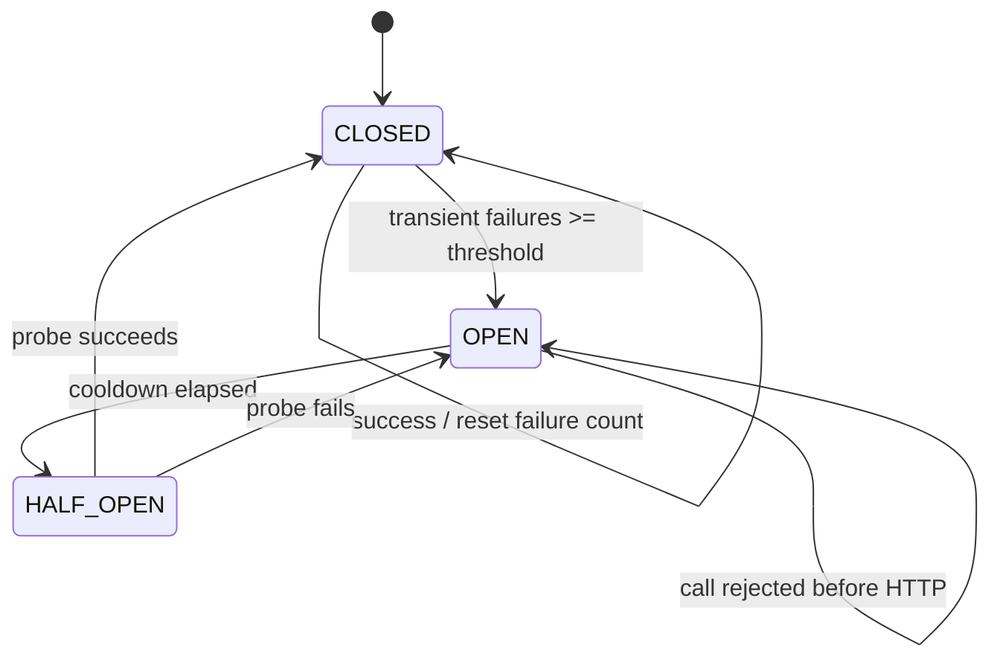

# Sub-fragment 0007a к ADR-0007: надёжность и сетевое взаимодействие MiniMax TTS

Это **не самостоятельный ADR**. Документ детализирует §2.6
**ADR-0007** (финального сводного архитектурного контракта интеграции
MiniMax TTS): операционный контракт для retries, streaming, circuit
breaking, таймаутов, cancellation и observability.

| Поле         | Значение                                                            |
|--------------|----------------------------------------------------------------------|
| Статус       | Sub-fragment к ADR-0007 (Proposed)                                  |
| Дата         | 2026-07-21                                                           |
| Автор        | architect (Hermes Agent)                                              |
| Родитель     | [ADR-0007](0007-minimax-tts-integration-final.md) §2.6               |
| Смежные      | [ADR-0003](0003-minimax-tts-architecture.md), [ADR-0004](0004-minimax-tts-integration-design.md) |
| Сопутствующий sub-fragment | [0007b — ROS 2 audio contract](0007b-minimax-tts-ros2-audio-contract-fragment.md) |

---

> **Design-only:** документ не предполагает изменений production-кода.
> Все уточнения — про форму будущей реализации.

## Scope and invariants

`MiniMaxTTSProvider` remains an opt-in provider. The existing audio contract is
unchanged: `synthesize()` returns a complete `TTSAudio`, while `stream()` yields
`TTSChunk` values and must end with a terminal chunk. A retry must never silently
switch to Yandex/Silero. Callers choose whether to retry the whole operation or
surface the failure.

The provider owns HTTP error mapping and transport cleanup. The caller (currently
`tts_node`) owns retry policy until a shared policy object is introduced. A future
shared policy must preserve the same error semantics.

## Operating modes and mode selection

### Non-streaming (default)

Use one HTTP request with `stream=false` and buffer the response until the full
hex audio payload has been validated and decoded. This is the safest baseline for
short replies and preserves the existing `TTSAudio` contract.

### HTTP streaming (optional compatibility mode)

When the upstream supports `stream=true`, consume the response as SSE (or the
provider's documented event format). Each audio event is decoded into a
`TTSChunk`; a final event produces `finish_reason="stop"`. If an error happens
before the first chunk, raise the mapped domain exception. If it happens after
chunks have been emitted, emit one terminal `TTSChunk(finish_reason="error")` and
stop. The current MiniMax integration may buffer SSE and yield one complete chunk;
that is still streaming at the transport boundary, not low-latency playback.

### WebSocket (reserved)

A persistent WebSocket endpoint is reserved for a future chunk-per-frame provider.
It must not be enabled merely by setting the HTTP streaming flag: connection
lifecycle, backpressure, reconnect, and shutdown semantics require a separate
implementation. WebSocket support is conditional on a verified MiniMax contract;
otherwise the provider falls back to non-streaming or rejects the configuration.

### Selection policy

An explicit `streaming` setting wins. With no explicit setting, choose
non-streaming for short text and streaming only above a configured character
threshold *and* when the selected transport is advertised as supported. The
threshold is an engineering default, not an upstream SLA; make it configurable
and expose the chosen mode in debug/metric attributes. If streaming capability is
unknown, use non-streaming rather than guessing.

```text
if explicit_mode is not AUTO:
    mode = explicit_mode
elif len(text) >= streaming_threshold and transport.supports_streaming:
    mode = STREAMING
else:
    mode = NON_STREAMING
```

## Error taxonomy and mapping

Map errors once, at the provider boundary, and retain status code/request
correlation metadata without logging secrets or complete text.

| Condition | Domain exception | Retryability |
|---|---|---|
| 401/403 or authentication business error | `TTSAuthError` | never |
| 429 / quota throttling | `TTSRateLimitError` | retry only when the operation is safe and budget remains |
| Other 4xx, malformed request, invalid settings | `TTSBadRequestError` | never |
| 5xx upstream response | `TTSUpstreamError` (or existing `TTSError` subtype) | retry |
| connect, DNS, TLS, reset, read timeout | `TTSUpstreamError` / `TTSTimeoutError` | retry |
| malformed successful response | `TTSUpstreamError` | normally never; do not amplify a contract bug |
| local cancellation/shutdown | preserve `CancelledError` | never |
| open breaker | `TTSUpstreamError` with `breaker_open=true` | no HTTP request |

If the codebase uses a different existing class name for upstream failures, keep
that public class and document the alias; do not create incompatible parallel
hierarchies. `Retry-After` is parsed only for rate-limit responses and is bounded
by a configured maximum delay.

## Retry policy

Retries apply to transient transport/5xx failures and, conservatively, to one
rate-limit retry. They do not apply to auth, validation, malformed payload, or
cancellation errors. The operation must be idempotent from the application
perspective; callers must account for possible duplicate upstream billing.

Use a bounded exponential backoff with full jitter:

```python
async def with_retry(operation, policy, *, rng=random.random):
    for attempt in range(policy.max_retries + 1):
        try:
            return await operation()
        except (TTSAuthError, TTSBadRequestError, asyncio.CancelledError):
            raise
        except TTSRateLimitError as exc:
            if attempt >= min(policy.rate_limit_retries, policy.max_retries):
                raise
            delay = min(policy.max_delay_s,
                        retry_after_or_none(exc) or policy.base_delay_s * 2**attempt)
            await asyncio.sleep(rng() * delay)
        except (TTSUpstreamError, TTSTimeoutError) as exc:
            if attempt >= policy.max_retries:
                raise
            cap = min(policy.max_delay_s, policy.base_delay_s * 2**attempt)
            await asyncio.sleep(rng() * cap)
```

`Retry-After` takes precedence over calculated delay when valid, but is still
capped. Do not retry after an arbitrary exception: classify first. Record the
attempt number and final outcome in metrics; log delays and exception classes,
never API keys, group IDs, full prompts, or audio.

## Circuit breaker

The breaker is per upstream identity (at least provider plus base URL; optionally
model/tenant where failure domains differ), not a process-global switch. Thresholds
and windows are configurable. A reasonable initial shape is consecutive or
rolling-window transient failures, an open cooldown, and one or a small bounded
number of half-open probes.



- `CLOSED`: admit calls; count only retryable upstream failures. Auth and bad
  request errors do not open the breaker.
- `OPEN`: fail fast with a domain upstream/breaker-open error until cooldown
  expires. Never queue unbounded work behind the breaker.
- `HALF_OPEN`: admit one probe (or configured small quota); concurrent callers
  fail fast or wait only if explicitly configured. Success closes and resets the
  counter; failure reopens and restarts cooldown.

State transitions must be atomic under the provider's concurrency model. Emit a
state-change metric/log event, and include `breaker_state` in request outcomes.
The breaker complements retry: one logical operation consumes its retry budget,
while repeated failed operations eventually stop reaching MiniMax.

## Timeouts, cancellation, and shutdown

Configure separate connect and read/write/pool timeouts rather than one unlimited
socket timeout. The read timeout must cover an expected audio response but remain
finite. A streaming read timeout applies between events, not to the entire
lifetime of the stream. Pool acquisition also needs a bound to prevent resource
starvation.

Every in-flight task must be tracked by the provider/client owner. On shutdown:

1. mark the provider as closing so new calls fail fast;
2. cancel tracked tasks and close SSE/WebSocket streams;
3. await cancellation with a short shutdown grace period;
4. close an owned HTTP client exactly once; never close an injected client;
5. preserve cancellation (`CancelledError`) instead of mapping it to a retryable
   upstream error.

`aclose()` is idempotent. A timeout or cancellation must release the connection
back to the pool, including when an exception occurs during stream iteration.

## Observability and operational safeguards

Required metrics (labels must be bounded):

- request count by provider, mode, outcome class, and HTTP status class;
- latency histogram, including time-to-first-byte/chunk for streaming;
- retry count and exhausted-retry count by exception class;
- rate-limit count and observed `Retry-After` delay;
- breaker state gauge and transition count;
- in-flight requests and cancellation count.

Structured logs should include provider, mode, attempt, duration, status class,
exception class, and breaker state. Use a request ID/hash for correlation, not raw
text. Never log credentials, `group_id`, full SSML/prompts, response bodies, or
base64/hex audio. Alert on sustained upstream error rate, breaker-open duration,
latency regressions, and abnormal retry volume. These are engineering SLO
signals, not claims about MiniMax's SLA.

## Rollout and verification

Keep non-streaming as the default. Enable streaming and breaker behavior behind
configuration, test with a local HTTP/SSE mock, and verify: no retry for 4xx auth
or validation errors; bounded retries for 5xx/timeouts; `Retry-After` handling;
fast failure while open; exactly one half-open probe; cancellation during an
in-flight request; and idempotent shutdown. Re-check the MiniMax transport and
error contract before enabling WebSocket chunk-per-frame mode.
