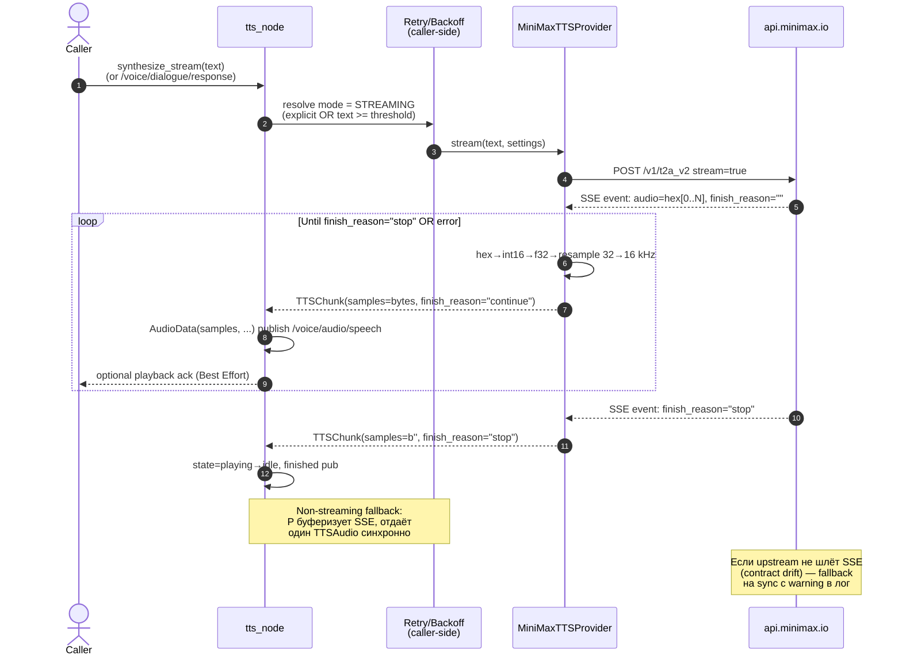
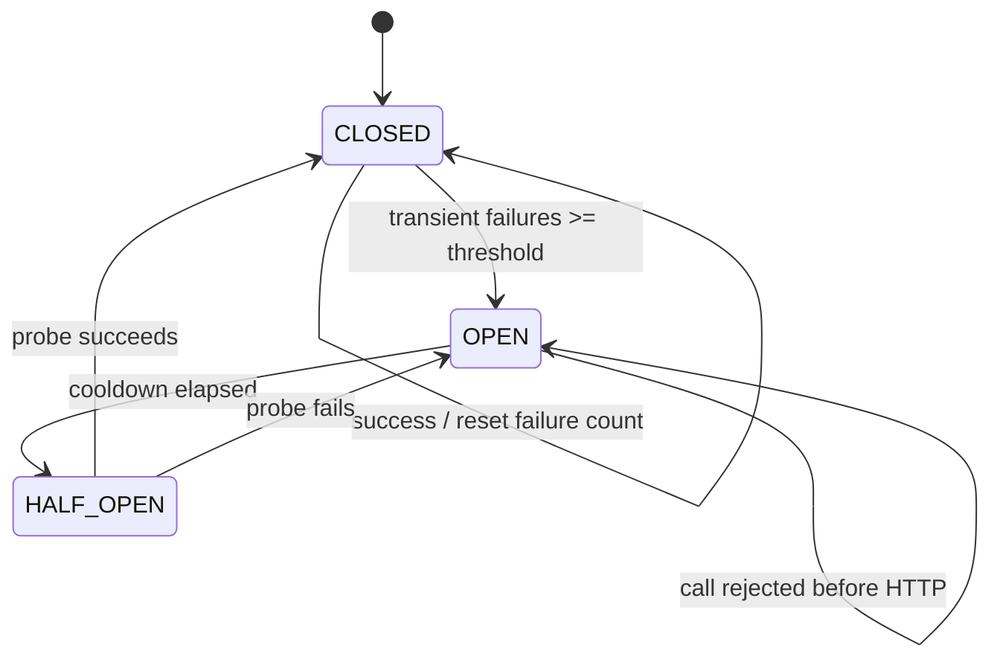

# Sub-fragment 0007c к ADR-0007: конфигурация, стриминг и обработка ошибок MiniMax TTS

Это **не самостоятельный ADR**. Документ сводит три сквозных
проектных решения интеграции MiniMax TTS — **(1) конфигурация и
секреты**, **(2) стратегия стриминга**, **(3) обработка ошибок и
ретраи** — в один self-contained reviewer-friendly фрагмент к
[ADR-0007 §2.4, §2.6](0007-minimax-tts-integration-final.md). Полные
спецификации живут в parent-ADR'ах и смежных sub-fragment'ах;
здесь — компактная сводка с явными trade-offs (≥2 альтернативы на
каждое решение), mermaid-диаграмма последовательности стриминга и
таблица «ошибка → реакция», достаточная для human review без
раскрытия остальных файлов.

| Поле         | Значение                                                            |
|--------------|---------------------------------------------------------------------|
| Статус       | Sub-fragment к ADR-0007 (Proposed)                                  |
| Дата         | 2026-07-21                                                          |
| Автор        | backend (Hermes Agent)                                              |
| Родитель     | [ADR-0007](0007-minimax-tts-integration-final.md) §2.4 + §2.6       |
| Родители (по теме) | [ADR-0002](0002-minimax-provider.md), [ADR-0003](0003-minimax-tts-architecture.md), [ADR-0004](0004-minimax-tts-integration-design.md), [ADR-0006](0006-minimax-tts-pydantic-settings-config.md) |
| Смежные sub-fragments | [`0007a` — Reliability, error taxonomy, retry, CB](0007a-minimax-tts-reliability-fragment.md), [`0007b` — ROS 2 audio contract](0007b-minimax-tts-ros2-audio-contract-fragment.md) |
| Контекст     | Kanban task `t_9977da5f`                                            |

---

> **Design-only:** документ не предлагает production-изменений,
> помимо уже зафиксированных в parent-ADR'ах и sub-fragments `0007a`/`0007b`.
> Все ссылки на конкретные секции — `file:line`-precise.

---

## 1. Блок 1 — Конфигурация, секреты и валидация

### 1.1 Сводная схема (источник правды — [ADR-0006 §2.1–2.3](0006-minimax-tts-pydantic-settings-config.md))

Конфигурация MiniMax TTS **трёхслойная**: ROS-параметры (для `tts_node`)
→ ENV `MINIMAX_*` (для CLI/cron и секретов) → pydantic-settings
`MiniMaxTTSConfig` (только CLI/cron). Полная таблица env-переменных —
в [ADR-0006 §2.1](0006-minimax-tts-pydantic-settings-config.md); ниже —
**роль каждой переменной**, без перечисления всех 14 (чтобы не дублировать).

| Секция                | Назначение                                                   | Где живёт                                      | Кто валидирует                                  |
|-----------------------|--------------------------------------------------------------|------------------------------------------------|------------------------------------------------|
| **Auth (секреты)**    | `MINIMAX_API_KEY`, `MINIMAX_GROUP_ID` — Bearer-токен + account id | ENV **только**; никогда в config-файле         | `MiniMaxTTSConfig._secrets_only_from_env` (ADR-0006 §2.3) |
| **Network**           | `MINIMAX_BASE_URL` (HttpUrl), `MINIMAX_TIMEOUT` (1–120 s)     | ENV / YAML / TOML                              | pydantic HttpUrl + `Field(ge=1.0, le=120.0)`   |
| **Voice/model defaults** | `MINIMAX_DEFAULT_VOICE/MODEL/LANGUAGE/SAMPLE_RATE/FORMAT` | ENV / YAML / TOML                              | `Literal[...]`-типы из каталога MiniMax        |
| **Retries / CB**      | `MINIMAX_MAX_RETRIES` (0–5), `MINIMAX_RETRY_BACKOFF_MS` (50–5000), `MINIMAX_CIRCUIT_BREAKER_THRESHOLD` (0 = disabled) | ENV / YAML / TOML                              | pydantic range + значение по умолчанию из ADR-0004 §2.7 |
| **Logging / debug**   | `MINIMAX_LOG_REDACT` (bool), `MINIMAX_DEBUG_PAYLOAD` (bool)   | ENV / YAML / TOML                              | pydantic `bool`                                 |

**Обязательны** для запуска MiniMax-пути только два: `MINIMAX_API_KEY`
и `MINIMAX_GROUP_ID`. Без них `MiniMaxTTSProvider.__init__()`
бросает `ValueError` с понятным сообщением
(`minimax_tts.py:372-393`). Остальные 12 — с дефолтами.

### 1.2 Иерархия источников (от высшего приоритета к низшему)

```
CLI-flags (--voice, --timeout, …)        # forward-compat hook
   ↓ override
ENV-переменные (MINIMAX_*)               # см. ADR-0006 §2.1
   ↓ если unset
Config-файл (yaml или toml)              # /etc/rob_box/tts.{yaml,toml}, ./tts.toml,
   ↓ если unset                            ~/.config/rob_box/tts.toml (ADR-0006 §2.2.1)
Hardcoded defaults из MiniMaxTTSConfig   # см. ADR-0006 §2.3
```

**Ключевые правила:**

1. **ENV всегда бьёт config-файл.** Поведение pydantic-settings по
   умолчанию через `env_priority`.
2. **CLI-flags бьют ENV.** Реализуется в фабрике
   `build_minimax_tts_provider(cfg)` — после загрузки `MiniMaxTTSConfig`
   фабрика патчит конкретные поля из `argparse.Namespace`.
3. **Секреты (`api_key`, `group_id`) — никогда из config-файла.**
   `AuthConfig.env_file=None` (ADR-0006 §2.3) + defense-in-depth
   через `model_validator` (`_secrets_only_from_env`). Даже если кто-то
   случайно включит `env_file`, у `SecretStr` нет default → required
   field, fail-fast.
4. **Формат config-файла выбирается явно** через параметр конструктора,
   не auto-detect: `yaml` для human-friendly ROS-инженеров, `toml`
   для строгой типизации CLI.
5. **Отсутствие файла — не ошибка.** CLI/cron может работать pure-ENV
   (например, в systemd unit с `EnvironmentFile=`).

### 1.3 Секции pydantic-settings модели `MiniMaxTTSConfig`

Root-модель — `MiniMaxTTSConfig` (ADR-0006 §2.3) — собирает пять секций:
`AuthConfig` (секреты), `NetworkConfig` (URL/timeout), `RetriesConfig`
(max_retries/backoff/CB), `AudioConfig` (voice/model/language/sample_rate/format),
`LoggingConfig` (redact/debug_payload). Каждая секция — отдельный
`BaseSettings` со своим `env_prefix` и `extra="forbid"`. Cross-field
валидация через `model_validator`: пустые `api_key`/`group_id` →
`ValueError` ДО первого HTTP-вызова.

`env_nested_delimiter="__"` разрешает писать
`MINIMAX_AUTH__API_KEY=…` / `MINIMAX_NETWORK__TIMEOUT=…` в ENV без
правки кода (полезно для cron-обёрток и Kubernetes ConfigMap).

### 1.4 Trade-off конфигурации (3 оси, ≥2 альтернативы на каждую)

| Решение                                                  | Альтернатива-1                                                                | Альтернатива-2                                                            | Принято и почему                                                                                                                                                              |
|----------------------------------------------------------|-------------------------------------------------------------------------------|---------------------------------------------------------------------------|-------------------------------------------------------------------------------------------------------------------------------------------------------------------------------|
| **Секреты только в ENV** (ADR-0006 §2.2.2)               | Разрешить секреты в YAML/TOML (как остальные параметры)                       | pydantic-settings с `env_file=".env"` для dev-удобства                    | ✅ ENV-only: нельзя случайно закоммитить `tts.yaml` с `api_key` в git; `.env` всё равно попадает в core-dump → см. ADR-0006 §2.3 (`SecretStr` маскирует значение в логах). |
| **pydantic-settings только в CLI/cron** (ADR-0006 §1)    | Поднять `pydantic-settings` в `rob_box_llm` core и использовать в ROS-пути   | Оставить CLI на YAML + самописный валидатор                              | ✅ CLI-only: ROS-параметры уже дают typed access через ROS launch; +1 hard dep в core ломает существующих потребителей Yandex/Silero (ADR-0004 §2.5 / §3.4).                |
| **Литеральный список voices** (`Literal["male-qn-qingse", …]`) | Динамический список из `/v1/voices` MiniMax API на старте                   | Свободная строка + валидация на 400-ответе MiniMax                       | ✅ Literal-list: опечатки ловятся IDE/parser'ом ДО HTTP-вызова; динамический список — YAGNI до публикации `/v1/voices` (ADR-0006 §9).                                          |
| **YAML и TOML равноправны** (ADR-0006 §2.2.1)            | Только YAML (ROS-friendly)                                                   | Только TOML (типизация)                                                  | ✅ Оба: YAML — для human-friendly multi-robot launch (`tts.yaml` уже есть в `docs/guides/examples/`); TOML — для CLI с `SecretStr` и секциями.                                |
| **`extra="forbid"` на всех секциях**                     | `extra="ignore"` — молча игнорировать опечатки                                | `extra="allow"` — пробросить в `settings.extra` (ADR-0003 §2.5)           | ✅ `forbid`: `MINIMAX_TIMOUT=30` (опечатка) даёт `ValidationError` сразу вместо silent fallback в default `30.0` → непредсказуемое поведение.                                |
| **Иерархия CLI > ENV > file > defaults**                 | Только ENV (12-factor pure)                                                  | Только YAML                                                               | ✅ 4-уровневая: даёт override через CLI для разовых запусков, ENV для systemd/cron, YAML для multi-robot, defaults как safety net.                                              |

### 1.5 Где именно в коде валидируется

| Потребитель          | Источник конфига              | Точка валидации                                |
|----------------------|-------------------------------|------------------------------------------------|
| `tts_node` (ROS)     | ROS launch params             | `tts_node.py` при старте (`tts_node.py:160-289`) |
| `tts_node` (секреты) | ENV `MINIMAX_API_KEY`, `MINIMAX_GROUP_ID` | `minimax_tts.py:347-393` (fail-fast `ValueError`) |
| Multi-robot deploy   | YAML `/etc/rob_box/tts.yaml`  | ADR-0004 §2.5 + `docs/guides/examples/minimax_tts.yaml` |
| CLI / cron           | pydantic-settings `MiniMaxTTSConfig` | ADR-0006 §2.3 (`_secrets_only_from_env` + `model_validator`) |

---

## 2. Блок 2 — Стратегия стриминга

### 2.1 Что MiniMax API реально поддерживает (источник — [ADR-0003 §2.4](0003-minimax-tts-architecture.md) + [`research/minimax-tts-api.md`](../research/minimax-tts-api.md))

MiniMax T2A v2 имеет **три режима передачи аудио**:

1. **Sync (`stream=false`)** — один HTTP-запрос, в ответе `data` — hex-кодированный
   полный аудиобуфер (`hex`-строка) и `extra_info` с фактическими параметрами.
   Это **baseline** для коротких реплик и единственный режим, чей контракт
   мы можем гарантировать. Поддержка `stream=false` подтверждена в MiniMax docs.
2. **HTTP streaming (`stream=true`)** — SSE-режим: чанки PCM-hex
   приходят инкрементально. Поддержка `stream=true` подтверждена в
   MiniMax docs, но **размер PCM-фрейма не зафиксирован** в MiniMax API —
   TTFA (time-to-first-audio) фактически равен длительности всей utterance,
   потому что текущая реализация буферизует SSE.
3. **WebSocket (`wss://api.minimax.io/v1/t2a_ws_v2`)** — chunk-per-frame,
   persistent connection. Поддержка **условная**, требует отдельного
   верификационного прохода (см. ADR-0003 §2.4 future work).

### 2.2 Режим-селектор (источник — [ADR-0007a §"Operating modes and mode selection"](0007a-minimax-tts-reliability-fragment.md))

```text
if explicit_mode is not AUTO:
    mode = explicit_mode
elif len(text) >= streaming_threshold and transport.supports_streaming:
    mode = STREAMING
else:
    mode = NON_STREAMING
```

Правила:

- **Явный выбор (`OFF | ON | AUTO`)** всегда побеждает auto-detect.
- **Auto-detect выбирает STREAMING** только если длина текста ≥
  `streaming_threshold` **И** transport задекларирован как
  `supports_streaming`. Порог — engineering default, не SLA; сделать
  его конфигурируемым и светить выбранный режим в debug/metrics.
- **Если `supports_streaming` неизвестно** — выбираем non-streaming.
  Не угадывать (ADR-0007a §"Selection policy": *"If streaming capability is
  unknown, use non-streaming rather than guessing"*).
- **WebSocket включается ОТДЕЛЬНО от `streaming=true`.** Подъём HTTP
  SSE-флага не активирует WS — connection lifecycle, backpressure,
  reconnect и shutdown требуют отдельной реализации.

### 2.3 Что делаем при STREAMING (для upstream, который реально даёт части)

| Этап                                  | Что происходит                                                                                            | Backpressure                                    |
|---------------------------------------|-----------------------------------------------------------------------------------------------------------|-------------------------------------------------|
| SSE-парсер                            | Получает `data: {"audio": "<hex>", "finish_reason": "stop"}`                                              | yieldить дальше без буферизации нельзя — нужен backpressure на consumer'е (`/voice/audio/speech` consumer) |
| Декодирование чанка                   | `bytes.fromhex(chunk.audio)` → int16 LE → float32 → resample 32→16 kHz (если нужно) → int16 LE → `AudioData.data` | bounded depth (default 10), при Best Effort отбрасывание старых chunks |
| Terminal chunk                        | `finish_reason="stop"` → terminal `TTSChunk(finish_reason="stop")`                                       | `tts_node` помечает playback complete            |
| **Error после первого чанка**         | terminal `TTSChunk(finish_reason="error")` → upstream error metadata                                       | consumer обязан сбросить неполный playback buffer, не повторять устаревшие samples |
| **Error до первого чанка**            | Mapped domain exception (`TTSUpstreamError` / `TTSTimeoutError`)                                          | retry-handler на стороне caller'а               |

Полный backpressure-контракт между `tts_node` (publisher) и
`audio_play_node` (subscriber) — в [sub-fragment `0007b` §2.4](0007b-minimax-tts-ros2-audio-contract-fragment.md).

### 2.4 Диаграмма последовательности стриминга



### 2.5 Trade-off стриминга (3 оси, ≥2 альтернативы на каждую)

| Решение                                                   | Альтернатива-1                                                          | Альтернатива-2                                                          | Принято и почему                                                                                                                                                                                |
|-----------------------------------------------------------|-------------------------------------------------------------------------|-------------------------------------------------------------------------|-------------------------------------------------------------------------------------------------------------------------------------------------------------------------------------------------|
| **Default = sync** (ADR-0007 §2.6)                       | SSE default — экономия ~duration TTFB на длинных utterances             | WebSocket default — sub-second TTFA                                    | ✅ Sync default: SSE-буферизация в текущем MiniMax API не даёт реального sub-second TTFB; sync проще тестировать, не зависит от unverified SSE-контракта.                                        |
| **Auto-detect по `len(text) >= threshold`**                | Hard-default SSE для всех запросов                                      | Hard-default sync для всех запросов                                    | ✅ Threshold-based: короткие реплики (< 200 chars) всё равно быстрее отдаются одним HTTP-ответом, без overhead SSE-парсера; длинные — получают шанс на streaming если upstream поддерживает.    |
| **`finish_reason="error"` чанк при mid-stream failure**   | Бросить exception, прервать iterator                                    | Silent-truncate (отдать то, что есть)                                  | ✅ Terminal error chunk: consumer (`audio_play_node`) может сбросить неполный playback buffer без повторения устаревших samples; exception потерял бы уже опубликованные чанки → race-condition. |
| **WebSocket отложен в future-ADR** (ADR-0007a)            | Включить WS сразу за SSE                                                | Включить WS вместо SSE                                                 | ✅ Отложен: WS contract MiniMax требует verification (heartbeat/reconnect/backpressure); текущий SSE-контракт достаточен для P0.5; включение WS без проверки — риск тихого контракт-дрифта.    |
| **Чанкинг 20 ms / 640 bytes** (sub-frag `0007b` §2.4)     | Один большой `AudioData` на всё utterance                              | Variable-size чанки (как приходят от upstream)                          | ✅ Fixed 20 ms: bounded payload без DDS-fragmentation; детектируемая потеря sequence; consumer может выбрасывать старые chunks при Best Effort overflow.                                        |

---

## 3. Блок 3 — Обработка ошибок и ретраи

### 3.1 Классификация ошибок (источник — [ADR-0007a §"Error taxonomy and mapping"](0007a-minimax-tts-reliability-fragment.md))

Маппинг ошибок — **в провайдере, ровно один раз**, на границе адаптера.
Caller получает типизированный `TTSError`-подкласс и решает, что
делать. Сохраняется `status_code`/`base_resp.status_code` +
`request_id`/`trace_id` для корреляции, **без** логирования секретов,
полного текста или base64/hex аудио.

| Категория                          | Условие (HTTP / network / MiniMax `base_resp.status_code`)  | Доменное исключение              | Retryable? |
|------------------------------------|--------------------------------------------------------------|----------------------------------|-----------|
| **Auth**                           | HTTP 401/403 ИЛИ `status_code` ∈ {1004, 1005, 1006, 1010} (auth-секция MiniMax) | `TTSAuthError`                  | **нет**   |
| **Quota / Rate limit**             | HTTP 429 ИЛИ `status_code` ∈ {1011, 1012, 1039}             | `TTSRateLimitError` (+`retry_after_s`) | **да**, но не более `rate_limit_retries` (default 1) |
| **Validation / bad request**       | HTTP 4xx (не 401/403/429) ИЛИ `status_code` ∈ {1008, 1033, 1041, 2013, 2014} | `TTSBadRequestError`            | **нет**   |
| **Upstream 5xx**                   | HTTP 5xx                                                    | `TTSUpstreamError`               | **да**    |
| **Network / connect / read**       | connect/DNS/TLS/reset/read-timeout                            | `TTSUpstreamError` / `TTSTimeoutError` | **да**    |
| **Malformed response**             | HTTP 200, но payload не парсится (contract drift)            | `TTSUpstreamError`               | **обычно нет** (не амплифицировать contract bug) |
| **Local cancellation / shutdown**  | `asyncio.CancelledError` / `aclose()` mid-flight             | **сохранить `CancelledError`**   | **никогда** |
| **Open breaker**                   | `CircuitBreakerState == OPEN`                                | `TTSUpstreamError(breaker_open=True)` | **да**, но HTTP-запрос не отправляется |

Если в существующей иерархии `errors.py:63-90` уже есть нужные
имена — **сохраняем их** (ADR-0007a §"Error taxonomy": *"If the codebase
uses a different existing class name for upstream failures, keep that
public class and document the alias"*). Не плодим параллельные
иерархии.

`Retry-After` парсится **только для rate-limit** и bounded
конфигурируемым максимумом (default 30 s). Это правило критично —
без cap'а MiniMax может вернуть `Retry-After: 86400` при quota-сегменте,
и мы уйдём в гигантский backoff.

### 3.2 Retry policy (источник — [ADR-0007a §"Retry policy"](0007a-minimax-tts-reliability-fragment.md))

Retry применяется **только** к transient-ошибкам и **консервативно**
к одному rate-limit retry. Auth, validation, malformed payload,
cancellation — **никогда** не ретраятся. Caller (`tts_node` или CLI)
сам решает, ретраить ли всю операцию целиком; провайдер
**никогда** не делает silent fallback на Yandex/Silero
(ADR-0002 §2.1).

```python
async def with_retry(operation, policy, *, rng=random.random):
    for attempt in range(policy.max_retries + 1):
        try:
            return await operation()
        except (TTSAuthError, TTSBadRequestError, asyncio.CancelledError):
            raise
        except TTSRateLimitError as exc:
            if attempt >= min(policy.rate_limit_retries, policy.max_retries):
                raise
            delay = min(policy.max_delay_s,
                        retry_after_or_none(exc) or policy.base_delay_s * 2**attempt)
            await asyncio.sleep(rng() * delay)              # full jitter
        except (TTSUpstreamError, TTSTimeoutError):
            if attempt >= policy.max_retries:
                raise
            cap = min(policy.max_delay_s, policy.base_delay_s * 2**attempt)
            await asyncio.sleep(rng() * cap)
```

**Ключевые свойства:**

- **Bounded exponential backoff с full jitter.** `delay = uniform(0, cap)`,
  где `cap = min(max_delay_s, base_delay_s * 2**attempt)`. Full jitter
  дешевле decorrelated jitter на коротких retry и не требует
  per-attempt state.
- **`Retry-After` имеет приоритет** над calculated delay, **но**
  bounded `max_delay_s`. Не уходим в гигантский backoff при quota-сегменте.
- **Идемпотентность.** Каждый retry может привести к двойному
  биллингу. Caller обязан учитывать возможную дубликацию MiniMax.
- **Классификация перед retry.** Никогда не ретраить после
  произвольного исключения. `CancelledError` не превращается в
  retryable upstream-ошибку (sub-frag `0007a` §"Timeouts, cancellation, and shutdown").
- **Record метрик**: `attempt`, `outcome`, `exception_class`,
  `delay_applied`. Логируем без API-ключей, без `group_id`, без
  полного промпта, без base64/hex аудио.

### 3.3 Circuit breaker (источник — [ADR-0007a §"Circuit breaker"](0007a-minimax-tts-reliability-fragment.md))

Per upstream identity (минимум `provider + base_url`; опционально
`model/tenant`, если failure domains отличаются) — **не** process-global.



- **CLOSED** — пропускает вызовы; считаются только retryable-upstream
  ошибки. Auth/bad request **не открывают breaker**.
- **OPEN** — fail-fast с `TTSUpstreamError(breaker_open=True)`,
  **без HTTP-запроса**. Никогда не ставить unbounded work в очередь
  за breaker'ом.
- **HALF_OPEN** — допускает один probe (или bounded quota). Success →
  CLOSED + reset counter; failure → OPEN + restart cooldown.
- **State transitions atomic** под concurrency-модель провайдера.
- **Default state = disabled** (`MINIMAX_CIRCUIT_BREAKER_THRESHOLD=0`,
  ADR-0006 §2.1). Активация обязательна при >100 TPS/час/робот
  (ADR-0004 §7).

### 3.4 Таблица «ошибка → реакция»

| Ошибка                                   | Retry?  | Backoff            | Breaker? | Cancellation | Действие caller'а                               |
|------------------------------------------|---------|--------------------|----------|--------------|--------------------------------------------------|
| `TTSAuthError` (401/403)                 | **нет** | —                  | нет      | —            | Fail-fast: показать «API key invalid», exit 2    |
| `TTSBadRequestError` (4xx, кроме auth/rate) | **нет** | —                  | нет      | —            | Fail-fast: показать «check request params», exit 2 |
| `TTSRateLimitError` (429 / 1011/1012/1039) | да, ≤1  | `Retry-After` capped | счёт      | —            | Sleep → retry; если budget exhausted — surface «quota exceeded» |
| `TTSUpstreamError` (5xx / network)       | да      | exp + jitter, capped | счёт      | —            | Retry до `max_retries`; затем fallback surface  |
| `TTSTimeoutError` (read/connect)         | да      | exp + jitter, capped | счёт      | —            | Retry; затем «timeout exceeded»                  |
| `TTSUpstreamError` (breaker_open=True)   | **нет** | —                  | OPEN     | —            | Surface «upstream temporarily unavailable», рекомендовать backoff |
| `TTSUpstreamError` (malformed 200)       | **нет** | —                  | нет      | —            | Surface «unexpected upstream payload», открыть issue |
| `asyncio.CancelledError` (shutdown)      | **никогда** | —                | —        | propagate    | Cleanup in-flight tasks, exit                    |
| Malformed `TTSSettings` (pydantic fail)  | **нет** | —                  | нет      | —            | Fail-fast при construct — никогда не доходит до HTTP |

### 3.5 Таймауты, cancellation, shutdown (источник — [ADR-0007a §"Timeouts, cancellation, and shutdown"](0007a-minimax-tts-reliability-fragment.md))

- **Отдельные connect / read / pool timeouts**, не один сокет-таймаут.
  Read-timeout должен покрывать ожидаемое аудио, но оставаться
  конечным. Для SSE — read-timeout **между событиями**, не на всё
  время жизни стрима.
- **Pool acquisition** тоже bounded — чтобы избежать resource starvation.
- **`aclose()` идемпотентен.** Закрытие owned `httpx.AsyncClient` — ровно
  один раз. Injected client никогда не закрывается провайдером.
- **Tracked in-flight tasks** на стороне provider/client owner.
  Shutdown: mark closing → cancel tracked → close streams → close
  owned client → preserve `CancelledError`.
- **Cancellation во время in-flight stream**: terminal error chunk
  не публикуется (caller не успеет обработать); `CancelledError`
  пробрасывается наверх для cleanup.

### 3.6 Observability (источник — [ADR-0007a §"Observability and operational safeguards"](0007a-minimax-tts-reliability-fragment.md))

Required metrics (лейблы — bounded):

- request count by `{provider, mode, outcome_class, http_status_class}`
- latency histogram, включая TTFB / TTFC для streaming
- retry count + exhausted-retry count по exception_class
- rate-limit count + observed `Retry-After` delay
- breaker_state gauge + transition count
- in-flight requests + cancellation count

**Структурные логи** содержат `provider`, `mode`, `attempt`,
`duration_ms`, `status_class`, `exception_class`, `breaker_state`,
`request_id` (НЕ `api_key`, НЕ `group_id`, НЕ полный текст, НЕ
base64/hex аудио). Алерты — на sustained upstream error rate,
breaker-open duration, latency regressions, abnormal retry volume.
**Это engineering SLO, не претензия на MiniMax SLA.**

### 3.7 Trade-off обработки ошибок (3 оси, ≥2 альтернативы на каждую)

| Решение                                                  | Альтернатива-1                                                          | Альтернатива-2                                                          | Принято и почему                                                                                                                                                              |
|----------------------------------------------------------|-------------------------------------------------------------------------|-------------------------------------------------------------------------|-------------------------------------------------------------------------------------------------------------------------------------------------------------------------------|
| **Классификация ошибок в провайдере, не в caller'е**     | Push классификации в caller (`tts_node`)                               | Классификация на каждом уровне (provider + caller + observability)     | ✅ Single point of truth: иначе ошибки маппятся по-разному в разных caller'ах → observability разваливается.                                                                    |
| **Bounded exp + full jitter**                            | Decorrelated jitter (AWS Architecture Blog)                             | Fixed delay между попытками                                            | ✅ Full jitter проще (не нужен per-attempt state), работает достаточно хорошо до ~10 attempts; decorrelated — YAGNI для P0.5.                                                  |
| **`Retry-After` capped по `max_delay_s`**                | Без cap'а — доверять MiniMax                                           | Без cap'а, но с глобальным timeout на всю операцию                      | ✅ Capped delay: иначе при quota-сегменте MiniMax может вернуть `Retry-After: 86400` → залипание на сутки; глобальный timeout не спасает, если одна попытка сама длинная.      |
| **Breaker per upstream identity, не process-global**      | Один global breaker для всех upstream'ов                              | Self-host breaker (state в файл)                                       | ✅ Per-identity: один сломанный upstream не валит другие (когда их будет ≥2); self-host — YAGNI для single-process P0.5 (ADR-0004 §7).                                          |
| **`CancelledError` НЕ маппится в upstream-ошибку**       | Любое исключение → upstream-ошибка                                     | Любое исключение → retry до exhaustion                                  | ✅ Preserve: cancellation — это контролируемый сигнал shutdown, не ошибка upstream; маппинг в upstream-ошибку делает retry-handler'а сломанным и shutdown ненадёжным.              |
| **Breaker default = disabled** (`threshold=0`)            | Breaker всегда ON с дефолт threshold=5                                 | Breaker без config — hard-coded                                         | ✅ Disabled: при низком RPS (<100 TPS/час/робот) breaker чаще мешает, чем помогает (false-open); активация явная через конфиг (ADR-0004 §7).                                    |

---

## 4. Acceptance criteria

Фрагмент считается **готовым к human review**, когда:

1. ✅ Раздел 1 покрывает все 14 env-переменных (или явно делегирует к
   ADR-0006 §2.1) и фиксирует иерархию источников CLI > ENV > file > defaults.
2. ✅ Раздел 2 фиксирует три режима (sync/SSE/WS), правила auto-detect,
   поведение при mid-stream error, и явно откладывает WS в future-ADR.
3. ✅ Раздел 3 даёт классификацию ошибок с 8 категориями, retry-policy
   с full jitter + `Retry-After` capped, breaker state-machine,
   таблицу «ошибка → реакция» и trade-offs по 3 осям.
4. ✅ Mermaid-диаграмма последовательности стриминга отражает реальную
   топологию (Caller → tts_node → MiniMaxTTSProvider → MiniMax → `/voice/audio/speech`).
5. ✅ Каждое проектное решение в §1.4, §2.5, §3.7 содержит ≥2
   альтернативы с явными плюсами/минусами.
6. ✅ Cross-references на parent-ADR'ы и sub-fragments — корректные
   filenames (нет коллизии с `0007a`/`0007b`).
7. ⏳ Human approval (как ADR-0007) — оставлено в качестве gate
   перед переводом в Accepted.

---

## 5. Связь с downstream-задачами

| Задача                          | Что использует из этого фрагмента                                               |
|---------------------------------|----------------------------------------------------------------------------------|
| `t_25b8e221` (implementer)      | §1 (конфиг), §2 (streaming), §3 (errors) — как спецификация для реализации       |
| `t_eed9d0f3` (synthesis ADR)    | §1.4, §2.5, §3.7 — trade-off таблицы для финального ADR                           |
| CLI `rob_box_llm.tts_cli`       | §1 целиком (pydantic-settings `MiniMaxTTSConfig`)                                |
| Future WebSocket-ADR            | §2.1 (что НЕ покрыто сейчас), §2.5 (отложено) — baseline для future-ADR           |

---

## Приложение A. Карта ссылок на полные документы

| Блок           | Полная спецификация                                                                 |
|----------------|-------------------------------------------------------------------------------------|
| 1. Конфигурация | [ADR-0006](0006-minimax-tts-pydantic-settings-config.md) — pydantic-settings целиком (707 строк) |
|                | [ADR-0003 §2.2](0003-minimax-tts-architecture.md) — ROS-launch параметры            |
|                | [ADR-0004 §2.5](0004-minimax-tts-integration-design.md) — YAML-схема `tts.yaml`      |
| 2. Стриминг    | [sub-frag `0007a` §"Operating modes"](0007a-minimax-tts-reliability-fragment.md)     |
|                | [sub-frag `0007b` §2.4](0007b-minimax-tts-ros2-audio-contract-fragment.md) — 20 ms chunks, backpressure |
|                | [ADR-0003 §2.4](0003-minimax-tts-architecture.md) — sync/SSE/WS                      |
| 3. Ошибки      | [sub-frag `0007a` §"Error taxonomy", §"Retry policy", §"Circuit breaker", §"Timeouts, cancellation"](0007a-minimax-tts-reliability-fragment.md) |
|                | [ADR-0004 §2.9–2.10](0004-minimax-tts-integration-design.md) — `RetryPolicy` / `CircuitBreaker` value-object |
|                | [ADR-0003 §5.2](0003-minimax-tts-architecture.md) — исходная retry-таблица          |