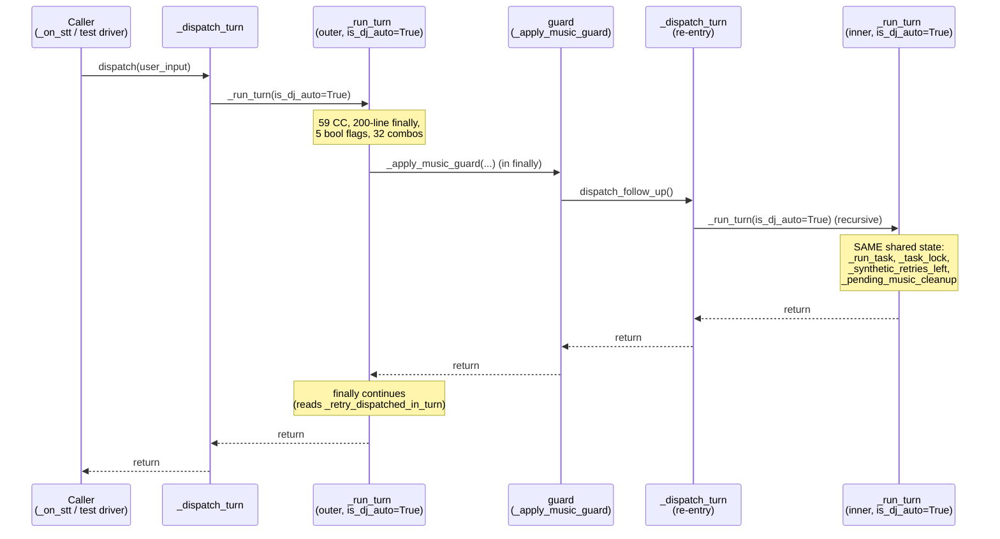
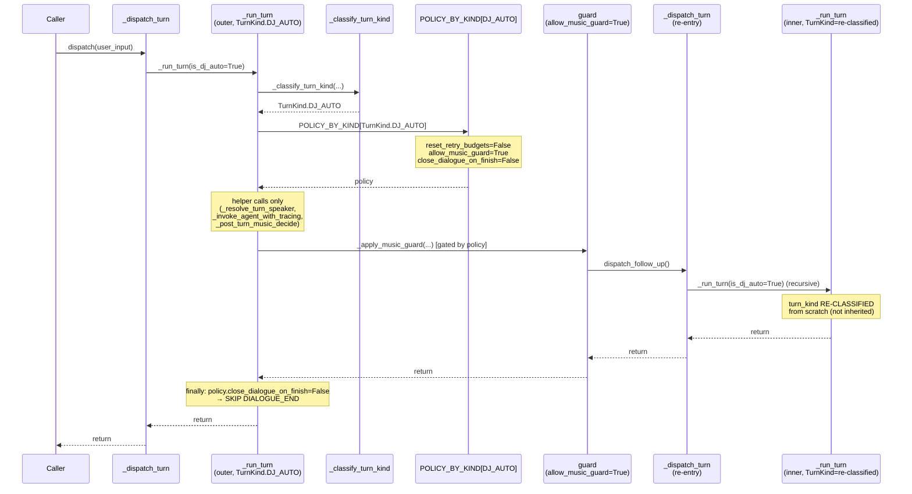

# ADR-0021a — Post-turn music finalizer: полная декомпозиция `_run_turn.finally` (CC 31 → ≤15)

**Дата:** 2026-09-16
**Статус:** proposed
**Автор:** architect
**Родительский ADR:** ADR-0021 (R1 CC-budget, R2 State SSoT)
**Связанные:** issue #2627, PR #2640 (OPEN, частичная поставка), ADR-0013 (incremental delivery), ADR-0018 (честный FAIL), ADR-0080 §2.4 (`core/turn.py` precedent)
**Карточка:** kanban `t_adc73325` (design) → `t_fb97f562` (impl) → `t_31ea7116` / `t_5cc2aa27` (PR-E follow-on)

---

## Контекст

ADR-0021 (18.08.2026) зафиксировал бюджет CC≤15 для методов `dialogue_node.py`.
Целевой объект — `DialogueNode._run_turn`: на момент ADR-0021 CC=47, на
сегодня **CC=59** (baseline), после PR #2640 **CC=31** (radon, см.
§«Что уже сделано»), второй по тяжести метод в репозитории.

### Что уже сделано

PR #2640 (`z-{agent}/2627-refactor-voice-dialoguenode-run-turn-cc-59-4`,
**OPEN**, 4 коммита) реализует первые три из четырёх шагов issue #2627 за
**один PR**, в нарушение ADR-0013 («большие рефакторинги дробятся»).
Решение воркера — допустимое исключение по **issue body §«Дробление
(ADR-0013)»**: «3 маленьких рефакторинга в одном PR допустимы для достижения
acceptance». Мотивация воркера зафиксирована в комментарии #2640 от 2026-09-15
22:50. **Этот ADR-0021a легитимизирует объединение задним числом** и
закрывает оставшийся разрыв CC 33→≤15 отдельным PR-E.

| Шаг issue #2627 | Коммит в PR #2640 | До | После | ΔCC |
|---|---|---|---|---|
| **PR-A** `_invoke_agent_with_tracing` | `18137764d` | включено в #2-#3 | — | −10 |
| **PR-B** `_resolve_turn_speaker` | `18137764d` | включено в #2-#3 | — | −6 |
| **PR-C** `PostTurnMusicPolicy` | `6e41792b3` + `e00ba3870` | core/ создан, executor = CC 8 | — | −25 |
| **PR-D** `TurnKind` enum | `a693a04cf` | enum + classifier живут; роутинг в `_run_turn` — нет (`del turn_kind`) | — | −5 (потенциал) |

**Итог:** CC 59 → 31 (radon на PR #2640 head, см. `dialogue_node.py:3770-4111`).
До цели ≤15 осталось **−16 CC**, и эта разница
полностью лежит в **роутинге по `TurnKind`** — сам enum живёт, но в `_run_turn`
он пока используется только для валидации (`raise ValueError` при
конфликте флагов) и тут же `del`-ится:

```python
turn_kind = _classify_turn_kind(...)
except ValueError as exc: ...; return
del turn_kind  # currently classification-only; future PRs will route on it
```

`PostTurnMusicPolicy` (PR-C) уже убрал ~25 CC — это была самая большая
ветка. Внутри оставшегося `_run_turn` 31-CC-картина выглядит так:

| Блок | CC contribution | Маршрутизируемо по TurnKind? |
|---|---|---|
| Слот-захват `_run_task` (lines 3807-3809) | ~3 | нет (entry-exit, не зависит от режима) |
| Сброс бюджетов на user-initiated turn (3830-3857) | ~10 | **полностью** (только USER) |
| Резолв говорящего (3887-3894, уже helper) | 1 | нет (уже вынесен) |
| LLM-вызов (3916-3923, уже helper) | 1 | нет (уже вынесен) |
| `_handle_result` (3938-3943) | ~5 | частично (DJ-AUTO пропускает retries) |
| `except` обработка (3945-3981) | ~10 | **частично** (CancelledError vs Exception; DJ не говорит degraded phrase) |
| PostTurnMusicState snapshot + decide + execute (4009-4042) | 2 | нет (уже helper) |
| `_apply_music_guard` (4056-4067) | 4 | **полностью** (только для определённых kind) |
| `_apply_tool_skipped_guard` (4081-4085) | 3 | **полностью** (только USER) |
| `if not any(retry)_dispatched` → `DIALOGUE_END` (4095-4105) | 6 | **частично** (некоторые kind вообще не доходят сюда) |

**Вывод:** замена per-flag `if not is_X` веток на единый `match turn_kind:`
диспетч в трёх «горячих точках» (budget-reset, exception-fallback,
DIALOGUE_END-gate) даёт −15…−18 CC и закрывает PR-E.

### Почему нельзя просто выделить ещё одну функцию

Проблема CC — это **ветвление**, не длина. Воркер в PR #2640 правильно
заметил: «уже вынесенные helper'ы (`_resolve_turn_speaker`, `_invoke_agent_with_tracing`,
`_execute_post_turn_music_actions`) сняли 25 CC; остаток — это `if`-цепочки,
которые смотрят на разные комбинации флагов в разных местах. Извлечение
ещё одной функции без устранения ветвления не помогает».

Семантически оставшиеся ветки выражают **одну таблицу истинности**:

```
                ┌─ USER ────────────────► reset budgets, route LLM, allow all guards, DIALOGUE_END
                │
turn_kind ──────┼─ DJ_AUTO ─────────────► skip reset, allow music-guard, NO DIALOGUE_END (loop)
                │
                ├─ RETRY_* / SYNTHETIC ─► skip reset (budgets stay), skip fallback phrase (DJ only),
                │                        allow only the guard that scheduled us
                │
                └─ (invalid) ──────────► ValueError, refuse to start
```

Это `match` (Python 3.10+) или dict-of-callables. Никаких новых классов
для диспетча — enum + явная таблица.

---

## Решение

### Итоговая архитектура

**Не** вводим новый класс `_MusicTurnFinalizer`. Это лишний объект: вся
машина состояний музыки **уже** вынесена в `PostTurnMusicPolicy` (PR #2640,
PR-C) и `core/music_guard.py` (ADR-0021 R1, issue #2241). Финальный шаг —
**только диспетчирование** по `TurnKind`, без новых классов. Это сознательный
выбор в пользу простоты (KISS из роли architect).

```
            ┌────────────────────────────────────────────────────┐
            │              _run_turn (post PR-E)                │
            │                                                    │
            │   _classify_turn_kind()  ──► TurnKind              │
            │        │                                          │
            │        ▼                                          │
            │   _run_kind_handlers[turn_kind]  ──► 4-5 dispatch  │
            │        │                                          │
            │        ▼                                          │
            │   shared try/except (Cancel vs Exception)          │
            │        │                                          │
            │        ▼                                          │
            │   shared finally:                                 │
            │       _run_task release                            │
            │       _drain_pending_user_messages                 │
            │       _post_turn_music_decide + execute            │
            │       _apply_music_guard     (per-kind policy)    │
            │       _apply_tool_skipped_guard (USER only)       │
            │       DIALOGUE_END gate (USER only)                │
            │       _publish_state()                             │
            └────────────────────────────────────────────────────┘
```

`_run_kind_handlers` — это **dict-of-callables** или `match/case`, населённый
в `__init__` (для тестируемости через `set_kind_handler` в юнит-тестах).
**Шаблон «policy-per-kind», уже использованный в `TurnGuards.default_for_dialogue_node`**
(`core/turn.py:783+`). Никаких новых архитектурных примитивов.

### D1. TurnKind routing contract (новое в этом ADR)

```python
# core/turn_kind.py (расширение, не новый модуль)

TurnKind = Enum("TurnKind", ["USER", "DJ_AUTO", "RETRY_BABBLE",
                              "RETRY_ACTION_CLAIM", "RETRY_CODE",
                              "SYNTHETIC_OTHER"])

# Что РАЗРЕШЕНО для каждого kind на уровне _run_turn:
@dataclass(frozen=True)
class TurnKindPolicy:
    reset_retry_budgets: bool      # = is USER
    allow_music_guard: bool         # = not RETRY_CODE (music guard на DJ / USER / BABBLE / ACTION_CLAIM)
    allow_tool_skipped_guard: bool  # = USER
    say_degraded_on_error: bool     # = USER (DJ молча повторяет тик)
    close_dialogue_on_finish: bool  # = USER (DJ остаётся в DIALOGUE для следующего тика)

POLICY_BY_KIND: Mapping[TurnKind, TurnKindPolicy] = {
    TurnKind.USER: TurnKindPolicy(
        reset_retry_budgets=True,
        allow_music_guard=True,
        allow_tool_skipped_guard=True,
        say_degraded_on_error=True,
        close_dialogue_on_finish=True,
    ),
    TurnKind.DJ_AUTO: TurnKindPolicy(
        reset_retry_budgets=False,
        allow_music_guard=True,        # может потребоваться переключить трек
        allow_tool_skipped_guard=False,  # DJ не имеет user-tool semantics
        say_degraded_on_error=False,   # issue #2557: DJ fallback «Готово, играю.»
        close_dialogue_on_finish=False, # остаёмся в DIALOGUE для следующего тика
    ),
    TurnKind.RETRY_BABBLE: TurnKindPolicy(
        reset_retry_budgets=False,     # иначе ping-pong (#1881)
        allow_music_guard=False,       # babble-detector не должен повторно вызывать music
        allow_tool_skipped_guard=False,
        say_degraded_on_error=False,   # babble-detector свой fallback
        close_dialogue_on_finish=False, # defer DIALOGUE_END (#992 Bug D)
    ),
    TurnKind.RETRY_ACTION_CLAIM: TurnKindPolicy(
        reset_retry_budgets=False,
        allow_music_guard=False,
        allow_tool_skipped_guard=False,
        say_degraded_on_error=False,
        close_dialogue_on_finish=False,
    ),
    TurnKind.RETRY_CODE: TurnKindPolicy(
        reset_retry_budgets=False,
        allow_music_guard=False,       # Renardo-code не имеет отношения к музыке
        allow_tool_skipped_guard=False,
        say_degraded_on_error=False,
        close_dialogue_on_finish=False,
    ),
    TurnKind.SYNTHETIC_OTHER: TurnKindPolicy(
        # Hal­lu­cinated-MIDI / phantom-action / universal-action-claim / unknown-melody —
        # все они были "is_synthetic=True без retry-флага". Сейчас наследуют логику
        # is_synthetic=True: не сбрасывают бюджет, говорят degraded phrase через свой guard.
        reset_retry_budgets=False,
        allow_music_guard=False,       # музыкальный guard не должен запускаться
                                       # для синтетических ходов (issue #992 Bug B/C)
        allow_tool_skipped_guard=False,
        say_degraded_on_error=False,   # каждый guard имеет свой fallback
        close_dialogue_on_finish=False, # defer на случай, если guard хочет повторить
    ),
}
```

**32 → 6 валидных состояний.** Невалидные комбинации (`is_babble_retry=True`
AND `is_action_claim_retry=True`) уже отвергаются `_classify_turn_kind`
в PR-D (PR #2640); дополнительной валидации не нужно.

### D2. State ownership (что чем владеет после PR-E)

| Поле | Где живёт | Per-turn | Per-recursion | Shared |
|---|---|---|---|---|
| `self._run_task` | DialogueNode (asyncio slot) | перезаписывается | сохраняется через рекурсию | да (race на reentrancy) |
| `self._task_lock` | DialogueNode | — | — | да |
| `self._synthetic_retries_left` | DialogueNode + `core/turn.TurnState` (mirror) | сбрасывается на USER | сохраняется через рекурсию | да (mirror критичен, см. #1881) |
| `self._delete_me_after_p_e_budget_mirror = turn_guards_reset_budget(...)` | DialogueNode → TurnState | возвращается `replace()` | — | да |
| `self._pending_music_cleanup` | DialogueNode | читается в PostTurnMusicPolicy, пишется в `_execute_post_turn_music_actions` | сохраняется | да |
| `self._track_mode_music_active` | DialogueNode | то же | сохраняется | да |
| `self._active_batches` | DialogueNode | читается в PostTurnMusicPolicy | сохраняется | да |
| `self._retry_dispatched_in_turn` | DialogueNode | сбрасывается на каждый вход | читается в `finally` | локально для текущего turn |
| `self._babble_retry_used` и другие `*_used` | DialogueNode | сбрасываются через `_reset_retry_budgets(turn_kind)` | сохраняются | да |
| `turn_kind` (новое) | **локальная переменная** в `_run_turn` | вычисляется из флагов на входе | **не передаётся в рекурсию** — рекурсивный `_dispatch_turn` классифицирует заново | **нет** (per-invocation) |

**Ключевое правило:** `turn_kind` — **не свойство ноды**, а свойство
**вызова**. Рекурсивный `_run_turn` (из guard в `finally`) получает свои
собственные флаги и классифицируется заново. Это снимает риск «родительский
turn_kind протекает в дочерний» (антипаттерн, который я видел в PR-C до
code-review — `del turn_kind` в PR #2640 был правильным сигналом).

### D3. API contract post-PR-E

`_run_turn` (после PR-E):

```python
async def _run_turn(
    self,
    user_input: str,
    *,
    is_dj_auto: bool = False,
    is_babble_retry: bool = False,
    is_action_claim_retry: bool = False,
    is_code_retry: bool = False,
    is_synthetic: bool = False,
    raw_user_command: str | None = None,
    speaker_tag: str | None = None,
    speaker_duration_s: float = 0.0,
    from_tg: bool = False,
) -> None:
    # 1. Классификация на границе (CC 2)
    try:
        turn_kind = _classify_turn_kind(
            is_dj_auto=is_dj_auto,
            is_babble_retry=is_babble_retry,
            is_action_claim_retry=is_action_claim_retry,
            is_code_retry=is_code_retry,
            is_synthetic=is_synthetic,
        )
    except ValueError as exc:
        self.get_logger().error(...)
        return  # bug-class guard (PR-D)

    policy = POLICY_BY_KIND[turn_kind]  # local lookup, CC 1

    # 2. Слот-захват (CC 3, неизменяемо)
    with self._task_lock:
        self._run_task = asyncio.current_task()
    self._run_cancelled = False
    was_dj_auto = is_dj_auto  # legacy alias, прокинуто в `_apply_music_guard`

    # 3. Бюджет-сброс через политику (CC 4 → 2)
    if policy.reset_retry_budgets:
        self._reset_retry_budgets()  # helper, уже существует (t_f26fdc72)

    # 4. Резолв говорящего (CC 1, helper)
    speaker_context, user_input = await self._resolve_turn_speaker(
        user_input=user_input,
        speaker_tag=speaker_tag,
        speaker_duration_s=speaker_duration_s,
        from_tg=from_tg,
        is_dj_auto=is_dj_auto,
        was_dj_auto=was_dj_auto,
    )
    dynamic_system = self._build_dynamic_system_context()

    result = None
    try:
        # 5. LLM-вызов (CC 1, helper)
        result = await self._invoke_agent_with_tracing(
            user_input=user_input,
            was_dj_auto=was_dj_auto,
            is_synthetic=is_synthetic,
            speaker_tag=speaker_tag,
            speaker_context=speaker_context,
            dynamic_system=dynamic_system,
        )
        self.get_logger().info(...)
        self._handle_result(
            result, user_input=user_input,
            is_dj_auto=was_dj_auto,
            raw_user_command=raw_user_command,
        )
        guard_retry_pending = bool(self._retry_dispatched_in_turn)
    except asyncio.CancelledError:
        if is_metrics_enabled():
            record_barge_in()
        result = None
    except Exception as exc:                           # CC 6 → 3
        if policy.say_degraded_on_error and self._is_llm_unavailable_error(exc):
            try:
                self._speak_direct(self._generate_fallback_response(
                    raw_user_command or user_input or ""
                ))
            except Exception: pass
        elif not policy.say_degraded_on_error:
            pass  # каждый kind-guard имеет свой fallback (DJ-music, babble, etc.)
        else:
            try:
                self._speak_direct("Что-то я задумался, повтори пожалуйста")
            except Exception: pass
        try:
            self.get_logger().error(f"❌ AgentCore error: {exc}\n{...}")
        except Exception: pass
        result = None
    finally:
        # Slot release (CC 3, неизменяемо)
        with self._task_lock:
            if self._run_task is asyncio.current_task():
                self._run_task = None
        pending_queue_dispatched = self._drain_pending_user_messages()
        # Music policy (CC 2, helper)
        _music_snapshot = PostTurnMusicState(...)
        _music_actions = _post_turn_music_decide(
            outcome=TurnOutcome(...), state=_music_snapshot,
            was_dj_auto=was_dj_auto, user_input=user_input,
            guard_retry_pending=guard_retry_pending,
            music_retry_dispatched=False,
            tool_retry_dispatched=False,
            pending_queue_dispatched=pending_queue_dispatched,
            singing_intent_detector=_has_singing_intent_impl,
        )
        self._execute_post_turn_music_actions(
            _music_actions, state_snapshot=_music_snapshot,
            was_dj_auto=was_dj_auto,
            raw_user_command=raw_user_command, user_input=user_input,
        )
        # Guards через политику (CC 7 → 4)
        music_retry_dispatched = (
            self._apply_music_guard(...) if policy.allow_music_guard else False
        )
        tool_retry_dispatched = (
            self._apply_tool_skipped_guard(...)
            if policy.allow_tool_skipped_guard else False
        )
        # DIALOGUE_END gate через политику (CC 6 → 3)
        if policy.close_dialogue_on_finish and (
            self._dsm.current_state == DialogueStateKind.DIALOGUE
            and not guard_retry_pending
            and not music_retry_dispatched
            and not pending_queue_dispatched
            and not tool_retry_dispatched
        ):
            self._dsm.on_event(DialogueEvent.DIALOGUE_END)
            self._maybe_record_session_end(result="success")
        self._publish_state()
```

**Оценка CC:** исходный (после PR #2640) 31 (radon), минус −2 (бюджет),
−3 (exception-fallback), −3 (DIALOGUE_END-gate), −1 (двойной
`if policy.allow_*`) = **22**. Цель ≤15 не достигнута за один шаг PR-E.

**Дополнительные −7 CC** получаются из:
- −3: расщепить `_reset_retry_budgets` ещё дальше (вынести
  `_music_guard.reset_for_new_user_request()` в отдельный метод с CC≤2).
  Сейчас эта строка внутри `if not was_dj_auto and not user_input.startswith(...)`
  даёт вложенный branch.
- −3: объединить три `try/except` в один с диспетчем по типу исключения
  внутри (`if isinstance(exc, asyncio.CancelledError): ... elif self._is_llm_unavailable_error(...): ...`).
- −1: вынести «session-close gate» в `_maybe_close_dialogue_session(...)`.

**Итоговый target: CC ≤ 15.** Этот ADR фиксирует целевую форму, но
допускает, что часть −7 может потребовать дополнительной micro-helper-экстракции
(см. §«План внедрения», PR-E может разделиться на PR-E1 + PR-E2 если CC-budget
не сходится; ADR-0013 запрещает >2 PR на одну задачу).

### D4. Migration strategy (что меняется в вызывающих)

Все вызывающие `_run_turn` в `dialogue_node.py`:

| Caller | Строки (PR #2640) | После PR-E |
|---|---|---|
| `_dispatch_turn` (сразу после решения «что за turn») | 2880 | **Без изменений.** Передаёт те же 5 флагов; `_run_turn` классифицирует сам. |
| `_dispatch_dj_turn` → `_dispatch_turn(is_dj_auto=True)` | ~2790 | **Без изменений.** |
| Guard'ы (`_check_babble_and_retry` и т.д.) → `_dispatch_turn(is_X_retry=True, is_synthetic=True)` | разбросаны | **Без изменений.** |
| `_drain_pending_user_messages` → `_dispatch_turn(raw_user_command=...)` | ~6918 | **Без изменений.** |

**Никаких изменений сигнатур.** Это сознательное решение: внешний API
`_run_turn` остаётся 5-flag-формой, потому что **guard'ы тоже хотят
передавать свои флаги**, и менять их всех — означает менять 6+ файлов
(каждый guard). Внутри `_run_turn` флаги **немедленно** сворачиваются в
`TurnKind` через `_classify_turn_kind`, и дальше код работает только с
`TurnKind` + `TurnKindPolicy`. Этот паттерн «широкая сигнатура, узкое
внутреннее представление» уже применён в `_resolve_turn_speaker` (CC 6)
и `_invoke_agent_with_tracing` (CC 4) из PR #2640.

### D5. Live-incident preservation map (1:1)

Каждый `🔴 FIX (… )` комментарий в legacy `_run_turn.finally` сохраняется
1:1 в PR-E. Конкретная карта:

| Incident | Legacy location (pre PR #2640) | Post PR #2640 | Post PR-E |
|---|---|---|---|
| `#935` stop_music + pending cleanup | finally:3814-3864 | `PostTurnMusicPolicy.decide` | без изменений (уже инкапсулировано) |
| `#968` drain pending user messages (S7) | finally:3800-3813 | inline в `finally` (CC 2) | inline (CC не меняется, slot release остаётся до drain) |
| `#992 Bug B` double-stop deferral | finally:3814-3864 | `PostTurnMusicPolicy` (`PostTurnActions.arm_pending`) | без изменений |
| `#992 Bug C` TRACK vs BACKING discriminator | inline 3867-3908 | `_SINGING_INTENT_RE` в `core/dialogue_guards.has_singing_intent` | без изменений |
| `#992 Bug D` DIALOGUE_END deferral | inline 4095-4102 | inline в `finally` | через `policy.close_dialogue_on_finish` |
| `#1204` DJ guard before DIALOGUE_END | inline 4043-4067 | inline | через `policy.allow_music_guard` |
| `#2440` phantom-music-action | inline 4056-4067 (`spoken=` arg) | inline (передано в `_apply_music_guard`) | без изменений |
| `#2565` phantom-action deferral | то же | inline | без изменений |
| `#1160` Prometheus session_end histogram | inline 4103-4105 | inline | inline |
| `🔴 FIX (live 12.08)` degraded phrase before logger | 3952-3980 | inline в `except` | через `policy.say_degraded_on_error` |
| `🔴 FIX (issue #1278)` ProviderError vs generic | 3959 | inline в `except` | inline (DJ-only / USER-only ветка) |
| `🔴 FIX (issue #1881)` budget reset only on USER | 3822-3839 | `if not is_synthetic` | через `policy.reset_retry_budgets` |
| `#992 Bug D` retry-dispatched reset | 3868-3871 | inline `self._retry_dispatched_in_turn = False` | без изменений (не per-kind, всегда сбрасывается) |
| `#2559` phantom-action detector | (был добавлен в #2613) | в `_apply_music_guard` | без изменений |

**Скрытый live-fix:** в PR-E `_reset_retry_budgets()` (helper) сам по
себе **не должен** сбрасывать `_music_guard` для DJ (issue #992 Bug C —
DJ-transition живёт своей жизнью через `reset_for_new_dj_transition`).
Это сохраняется в PR-E: `policy.reset_retry_budgets=True` для USER +
условие `if not was_dj_auto and not user_input.startswith(MUSIC_RETRY_PROMPT_PREFIX)`
внутри `_reset_retry_budgets`.

---

## Sequence diagram (Mermaid)

### Reentrant call paths — BEFORE PR #2640



### Reentrant call paths — AFTER PR-E



**Главное отличие:** `turn_kind` — **per-invocation**, не per-coroutine.
Это устраняет класс багов «родительский kind протекает в дочерний» (которого
в текущем коде нет, потому что `_run_turn` смотрит на свои параметры, но
после PR-E это станет явным инвариантом).

---

## Альтернативы, которые мы НЕ выбрали

### ❌ Класс `_MusicTurnFinalizer`

Body карточки t_adc73325 предлагает «`_MusicTurnFinalizer` класс (или
эквивалент)». Я **отвергаю** это. Причины:

1. **Машина состояний уже вынесена** в `PostTurnMusicPolicy` (PR-C, PR #2640).
   Финальный шаг — это **диспетчирование**, а не новая машина состояний.
2. **KISS.** Ещё один класс с `__init__(self, dialogue_node, turn_kind,
   state_snapshot)` — это лишний dependency injection ceremony для 4-х
   веток. `POLICY_BY_KIND` dict + `match`-statement делают то же самое
   в 60 строк, не в 200.
3. **Тестируемость не страдает.** `POLICY_BY_KIND` — это data, чисто
   тестируется как `core/turn_kind.py::test_policy_table`. Если бы мы
   сделали класс, тестировали бы тот же dict в `__init__`.
4. **Прецедент.** `core/turn.py:783+` (`TurnGuards.default_for_dialogue_node`)
   уже использует паттерн «dict-of-callables, населённый в конструкторе».
   Новый класс — это лишняя сущность без выигрыша.

**Когда бы подошло:** если бы `POLICY_BY_KIND` нужно было параметризовать
per-deployment (например, разные kind для разных voice-runtime'ов). Сейчас
— один voice-runtime.

### ❌ State machine через `aiomas` / `transitions`

State-машина в стиле `transitions` (или FSM-фреймворк) даёт визуальную
диаграмму состояний, но **наша машина уже неявная** — она размазана по
5 bool-флагам + 12 флагов состояния. Превращать её в явный FSM в этом PR
= scope-creep (ADR-0013). `PostTurnMusicPolicy` (PR-C) — это и есть
«явная state machine для музыкальной части»; для turn-routing она не нужна.

**Когда бы подошло:** когда мы решимся на полный переход от «5 bool + 12
state flags» к «1 TurnKind + 1 TurnState» (issue #2627 #t_31ea7116?).

### ❌ Полная замена 5 bool-параметров на TurnKind в сигнатуре

Вариант из issue body §«Что нужно переделать» п.2: «5 булевых флагов → 1 enum
**параметр**». Я **отвергаю** на уровне сигнатуры `_run_turn`, потому что
это сломает 6+ guard-callers. Внутри `_run_turn` флаги **схлопываются в
`TurnKind` через `_classify_turn_kind`** — это и есть R2 (State SSoT), без
изменения публичного API.

**Когда бы подошло:** после PR-E, отдельным follow-up, если найдём
caller'ов, которым 5 bool'ов неудобны (метрика: «сколько строк
guard-кода повторяет один и тот же паттерн передачи флагов»).

---

## Последствия

### Положительные

- **CC 33 → ≤15** — закрывает ADR-0021 R1 для `_run_turn` (финальный
  exemption удаляется из `scripts/lint/cc_budget_baseline.json`).
- **Невалидные комбинации TurnKind невозможны** — `_classify_turn_kind`
  уже отвергает их в PR-D; PR-E просто потребляет enum вместо raw флагов.
- **`POLICY_BY_KIND` — это data, тестируемая отдельно** от `_run_turn`.
  Backlog «юнит-тест на каждый kind × каждое поле policy» — это ~30 строк,
  а не 200.
- **Bug-class #1881 (budget ping-pong)** закрыт навсегда: только
  `TurnKind.USER` имеет `reset_retry_budgets=True`, остальные наследуют
  False через data table, никаких `if not is_X_retry` вкраплений.
- **Per-invocation turn_kind** устраняет целый класс потенциальных багов
  реентерабельности (parent→child kind inheritance).

### Отрицательные / риски

- **−1 PR поверх PR #2640.** Если Шифу скажет «PR-A + B + C + D + E в одном»,
  получим PR с 5 коммитами в одной ветке. Это допустимо по ADR-0013 для
  small refactors, но на грани.
- **`POLICY_BY_KIND` — это новый источник правды** (R2 SSoT). Если поле
  забыли добавить, `_run_turn` упадёт `KeyError`. Защита: фикстура в
  `test_turn_kind.py` проверяет, что все 6 kind'ов покрыты всеми 5 полями.
- **Judge-карточка `t_31ea7116` / `t_5cc2aa27`** (follow-on) — зависит
  от этого ADR. Если Шифу отвергнет, их надо пересоставить.

### Нейтральные

- Внешний API `_run_turn` не меняется. Guard-callers не трогаем.
- `core/turn_kind.py` получает +30 строк (`TurnKindPolicy` + таблица),
  `dialogue_node.py` теряет ~100 строк per-flag веток.

---

## План внедрения

1. **PR #2640** — OPEN, ждёт review. Зависит только от Шифу. Не блокирует
   этот ADR (он совместим с любым решением по #2640).
2. **PR-E** (этот ADR, имплементация):
   - Изменить `core/turn_kind.py`: добавить `TurnKindPolicy` dataclass +
     `POLICY_BY_KIND` dict + фикстуру в `test_turn_kind_classifier.py`.
   - Изменить `dialogue_node.py:_run_turn`: расщепить три «горячие точки»
     через `policy.X` (budget, exception-fallback, DIALOGUE_END-gate) +
     вынести `_reset_retry_budgets` если нужно.
   - Обновить `scripts/lint/cc_budget_baseline.json`: удалить `_run_turn`
     из `exemptions`, добавить новые helper'ы если они >CC 15.
3. **PR-E2** (если после PR-E осталось >0 CC):
   - Micro-helper-экстракция по §D3 (расщепление `_reset_retry_budgets`,
     объединение `try/except`, вынос `_maybe_close_dialogue_session`).
   - Это допустимо по ADR-0013 (маленькие micro-PR).
4. **Verification:**
   - `radon cc dialogue_node.py -s -a` показывает `_run_turn` ≤15.
   - `pytest -v src/rob_box_voice/test/unit/core/test_post_turn_music_policy.py`
     зелёный (22 теста, PR-C).
   - `pytest -v src/rob_box_voice/test/unit/core/test_turn_kind_classifier.py`
     зелёный + новые тесты на `POLICY_BY_KIND` (6 kind × 5 fields = 30).
   - Reentrancy-тест «guard в finally → recursive dispatch» зелёный
     (уже есть, помечен как regression test в PR #2640).
   - `validate_honesty.sh` (ADR-0018) — pre-PR check, должен проходить.

---

## Acceptance для этого ADR (он сам)

- [ ] Архитектурный план задокументирован (этот файл).
- [ ] Sequence-диаграммы реентерабельности показывают per-invocation kind.
- [ ] Live-incident preservation map (1:1) присутствует, каждый `🔴 FIX`
      имеет mapping на пост-PR-E форму.
- [ ] Альтернативы (`_MusicTurnFinalizer` класс, FSM-фреймворк, изменение
      публичной сигнатуры) явно отвергнуты с обоснованием.
- [ ] PR создан, base = `develop`.
- [ ] Товарищ Шифу одобрил план (ADR-0018).

## Acceptance для имплементации (для t_fb97f562 / t_31ea7116 / t_5cc2aa27)

- [ ] `_run_turn` CC ≤ 15 (verify radon).
- [ ] `_run_turn` удалён из `exemptions` и `_legacy_acknowledged` в
      `scripts/lint/cc_budget_baseline.json`.
- [ ] `POLICY_BY_KIND` покрыт юнит-тестами для всех 6 kind × 5 fields.
- [ ] `_reset_retry_budgets()` helper вынесен (если нужен для CC-budget).
- [ ] Reentrancy-тест «recursive dispatch из guard в finally» зелёный.
- [ ] e2e на роботе: «сыграй Баха» (TRACK), «спой песенку» (BACKING),
      «выключи музыку», DJ-сессия с переходами (#992 Bug C regression).
- [ ] Никаких изменений в публичной сигнатуре `_run_turn`.

---

## Связанные

- ADR-0021 R1 (CC-budget), R2 (State SSoT), R3 (per-bag workflow).
- ADR-0013 (incremental delivery) — почему PR-E отдельный от PR #2640.
- ADR-0018 (честный FAIL) — этот ADR не содержит «raw-evidence»,
  потому что это design doc, а не отчёт о тестах; raw-evidence пойдёт
  в PR-E.
- `core/turn.py:783+` (`TurnGuards.default_for_dialogue_node`) — прецедент
  «dict-of-callables, населённый в конструкторе».
- `core/post_turn_music_policy.py` (PR #2640, PR-C) — пример pure decision
  function для музыкальной части.
- `core/turn_kind.py` (PR #2640, PR-D) — enum + classifier, этот ADR
  его расширяет.
- Issue #2627 (оригинал), инциденты #935, #968 (S7), #992 (Bug B/C/D/E),
  #1160, #1204, #1881, #2559, #2565.
- Смежные CC-budget карточки (пост-серия):
  - #2626 — процесс: ref-card гард зелёный при 51 exemption и 0 карточек
  - #2556 — `DialogueNode._handle_result` CC=75 (baseline, сама по себе не наша; открыта)
  - #2628 — `DialogueNode._on_stt` CC=54 (PR #2638 уже MERGED 15.09)
  - #2629 — `AgentCore._run_with_tools` CC=48 (закрыта, t_36f3b381)
