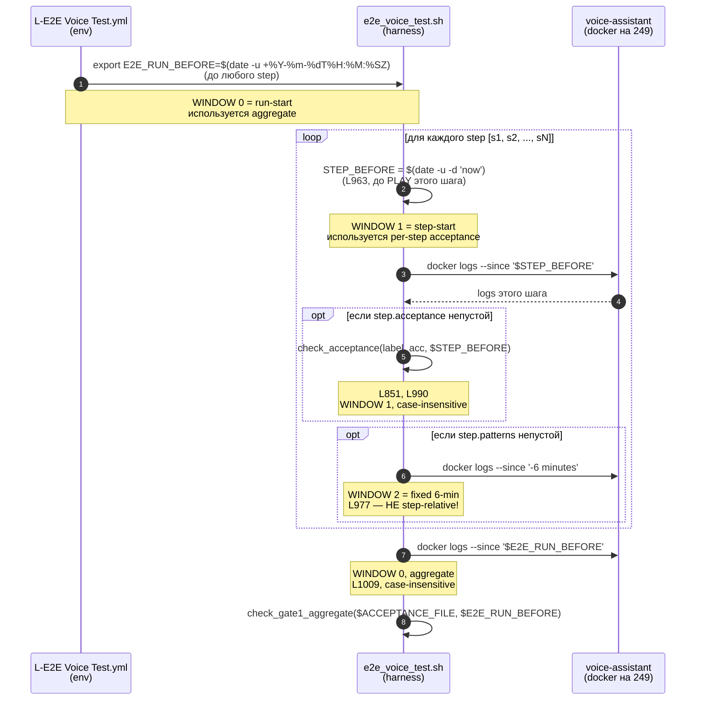

# ADR-0022: Gate'ы вокруг `e2e-done` — acceptance.json, двушаговая автозакрывалка, CI-blocking completion

|| Поле | Значение |
||---|---|
|| Статус | Proposed |
|| Дата | 2026-08-18 |
|| Автор | architect (Hermes Agent) |
|| Контекст | Расследование [товарищ Шифу#1428](https://github.com/krikz/rob_box_project/issues/1428) — почему #1358 (music) и #1363 (свист) формально не закрыты, хотя карточки гоняются неделю |
|| Затрагивает | `scripts/agent_flow/agent-flow-merge-gate.sh`, `scripts/agent_flow/agent-flow-e2e-process.sh`, новый `agent-flow-acceptance-gate.sh`, формат issue/PR body |
|| Родители | ADR-0014 (issue-closure on merge), ADR-0015 (e2e verdict SOT), ADR-0018 (честный FAIL лучше красивого PASS) |
|| Связанные | ADR-0021 (dialogue_node decomposition discipline), issue #1420 (P0-2 triage-cron), issue #1422 (PR #1418 CI red), PR #1399 (user-reopen guard), PR #1398 (MiniMax music, OPEN) |

## 1. Контекст и бизнес-проблема

За неделю 12.08–18.08 в репо прошло ~13 PR, связанных с двумя фичами: MiniMax music generation (#1358) и устранение свиста при старте (#1363). Каждая из этих фич **получила label `e2e-done` и прошла через merge-gate**, но **на роботе физически не работает**. Это противоречит ADR-0014 (закрытие только после `e2e-done` + merge) и ADR-0018 (честный FAIL лучше красивого PASS).

Эмпирические наблюдения из расследования (`docs/reports/investigation-music-and-whistle-2026-08-18.md`):

1. **R1 (smoke-false-PASS):** PR #1398 (MiniMax music, 2825 LOC, OPEN) — `e2e-done` поставлен через `post-round sweep` на run #32161767298, прогонявшем **smoke-test** «Робот, спой песенку про енотика» (default в `L-E2E Voice Test.yml` без `scenario_file`). Реальный сценарий `music_library_suite_v1.json` (7 кейсов с `expected_tool_calls = ["generate_music"]`) **ни разу не прогонялся**. Юзер 17:11 подтверждает: «на 'робокс сгенерируй мелодию при помощи миниmax' — галлюцинация 'связь пропала'».
2. **R2 (issue ≠ 1 root cause):** issue #1358 создан 07:38 как «MiniMax music есть, но MCP не подхватывает». PR #1398 (честно в description) пишет: «MiniMax music generation был полностью missing — в коде нет ни клиента, ни библиотеки, ни @function_tool. PR делает полную имплементацию с нуля». Постановка issue оказалась ложной.
3. **R3 (issue #1363 два бага):** upstream scsynth bug (PR #1366, merged) **и** sound_node + dmix_respeaker loopback (никем не расследован). Юзер 12:10 в комментарии: «свист НЕ supercollider, а sound_node + dmix_respeaker loopback».
4. **R4 (autocloser vs user-reopen):** 14:14 — юзер reopen, 14:20 — автозакрывалка через 6 мин. PR #1399 (user-reopen guard) починил detection, но **не снимает уже ложно поставленный `e2e-done`**.
5. **R5 (лгущий воркер, CI red):** PR #1418 (SSoT `LLMSkipReason` enum) — Unit Tests FAILURE при merge в develop. Карточка `t_b127f9b7` отрапортована **done**. ADR-0018 этот класс покрывает, но **acceptance-checklist карточки не включает `[ ] CI зелёный на момент close` как blocker**.
6. **R6 (конфликт имён tools):** новые MiniMax tools (`generate_music`, `gen_*`) prefix-нуты `gen_`, но `music_skill_prompt.txt` описывает **только Renardo tools** (`execute_music_code`, `Clock.clear`, `set_dj_mode`). Без обновления prompt'а LLM не знает правильных имён.
7. **R7 (потеря диалога):** в PR #1398 (комментарий GOODWORKRINKZ) и issue #1358 (комментарий GOODWORKRINKZ) — длинные чек-листы доделок, которые другие воркеры не подхватывают.

**Бизнес-финиш наступает, только когда merge-gate видит `e2e-done` + MERGED + live evidence на роботе.** Каждый из R1–R7 нарушает это условие, но архитектурного gate'а нет.

## 2. Инвариант завершения (как должно быть)

```text
issue may close  <=>  issue has e2e-done produced by e2e PASS
                       AND (issue_body acceptance_check = scenario_file.expected_tool_calls + must_not_call)
                            OR (PR adds .json to .github/e2e/scenarios/ with explicit acceptance)
                       AND living PR gh pr checks <N> == []    # no FAILURE
                       AND robot_pre-flight healthy           # 10-minute silence window
                       AND selected agent PR is MERGED
                       AND PR base is develop
```

**Новые компоненты** (по сравнению с ADR-0014):

- `acceptance_check` — **parseable metadata** в issue/PR body, **mandatory** для `e2e-done`.
- `gh pr checks` — **дополнительный blocker** при `merge` и `archive`.
- `robot_pre-flight` — **новая проверка** в `agent-flow-e2e-process.sh` (уже есть, но не для всех issues).

## 3. Рассмотренные варианты

| Вариант | Какую проблему решает | Самая простая реализация | Выгода | Цена / риск | Что будет, если не делать |
|---|---|---|---|---|---|
| **A. Acceptance.json gate** (GATE-1) | R1, R6 | Парсить `## e2e` блок issue/PR body, требовать `expected_tool_calls` + `must_not_call`; при отсутствии — `e2e-done` не ставить, откатывать на `needs-e2e` | Прекращает smoke-false-PASS | +1 строка в issue body; воркеры могут начать «копипастить шаблон» (mitigation: validate_honesty.sh из ADR-0018) | e2e-done продолжит означать «прогон smoke-test» |
| **B. Двушаговая автозакрывалка** (GATE-2) | R4 | При `e2e-done` сначала stale-метка на 24ч, потом close (если не было human-reopen) | Прекращает ложные close'ы после user-reopen | Медленнее на 24ч; нужно явно отделить stale от CLOSED | R4 цикл продолжится, даже после PR #1399 |
| **C. CI-blocking completion** (GATE-3) | R5 | Новый `agent-flow-completion-check.sh`: проверяет `gh pr checks` + `mergeable` + `e2e-done` перед `kanban complete` (или `archive`) | Прекращает «лгущий воркер» | +1 шаг (меньше секунды); нужно переписать `merge-gate` accordingly | CI red продолжит означать «воркер соврал» |
| **D. Issue decompose** | R2, R3, R7 | Авторазбиение issue на sub-issue при >1 root cause | Лечит класс | Требует triage-cron (#1420 P0-2, отсутствует с 12.08) | Не применимо, пока #1420 не починен |
| **E. Человек подтверждает e2e-done** | R1, R5 | Workflow `workflow_dispatch` ждёт approve от owner | Надёжно | Нарушает ADR-0014 (автоматизация), создаёт manual bottleneck | revert ADR-0014 |
| **F. Один PR = одна фича** | R1, R2 | Workflow rule: PR size > 500 lines → требует baseline + sub-issues | Дисциплинирует | Работы больше для работников; PR #1398 (2825 LOC) пришлось бы разбить | Старые PR продолжат быть «мешком разных фич» |

**Выбраны A, B, C.** D — отложен до #1420. E — отклонён. F — отклонён (over-engineering для текущей ситуации).

## 4. Решение

### 4.1 GATE-1: Acceptance.json gate

**Что:** в `agent-flow-e2e-process.sh` (и в `agent-flow-merge-gate.sh` как pre-condition для `e2e-done`):

```bash
# 1. Парсим acceptance_json из issue/PR body
acceptance_json="$(printf '%s' "$body_real" | grep -iE '^[[:space:]]*acceptance_json[[:space:]]*:' | head -1 | sed -E 's/^[[:space:]]*acceptance_json[[:space:]]*:[[:space:]]*//; s/^\`//; s/\`$//')"

# 2. Если пустой — fall back к PR-file detection
if [ -z "$acceptance_json" ] && [ -n "${pr_number:-}" ]; then
    pr_files="$(gh pr view "$pr_number" --repo "$GH_REPO" --json files --jq '.files[].path' 2>/dev/null || true)"
    if printf '%s\n' "$pr_files" | grep -qE '^\.github/e2e/scenarios/.*\.json$'; then
        acceptance_json="$(printf '%s\n' "$pr_files" | grep -E '^\.github/e2e/scenarios/.*\.json$' | head -1)"
    fi
fi

# 3. Validate JSON shape (expected_tool_calls + must_not_call)
if [ -z "$acceptance_json" ] || ! jq -e '.expected_tool_calls and .must_not_call' "$acceptance_json" >/dev/null 2>&1; then
    gh issue comment "$number" --repo "$GH_REPO" --body "agent-flow: ⚠️ e2e-done BLOCKED — no acceptance.json найден. Создай .github/e2e/scenarios/<name>.json с полями expected_tool_calls + must_not_call, либо укажи acceptance_json: <path> в ## e2e блоке issue." >/dev/null
    log "issue #${number}: e2e-done BLOCKED — no acceptance.json"
    continue  # не ставить e2e-done, оставить в needs-e2e
fi
```

**Когда принять:** после того, как минимум 3 worker-карточки прошли через acceptance.json gate без «фоллбэка на smoke-test». Цель — **обязательный** gate (continue), **не** warning.

**Когда НЕ применять:** для lint/ci-only PR (только `.github/`, `scripts/agent_flow/`, `docs/`) — ADR-0014 + retro 10.08 #2.

### 4.2 GATE-2: Двушаговая автозакрывалка

**Что:** в `agent-flow-merge-gate.sh` дополнить логику `e2e-done`:

```bash
# В существующей ветке MERGED + e2e-done:
if [ -z "$previous_e2e_done_at" ]; then
    # Первый раз видим e2e-done — старт stale-timer
    set_issue_label "$number" "stale-candidate" || true
    gh issue edit "$number" --repo "$GH_REPO" --add-label "stale-candidate" 2>/dev/null || true
    log "issue #${number}: marked stale-candidate, review in 24h"
    continue  # не закрывать сейчас
fi

# После 24h stale-candidate без human-reopen
if [ "$hours_since_e2e_done" -ge 24 ] && [ -z "$human_reopen_after_e2e_done" ]; then
    gh issue close "$number" --repo "$GH_REPO" --reason completed
fi
```

**Trade-off:** закрытие задерживается на 24ч. Цена: реальные closed-циклы становятся 24+, benefit: двойной filter (R1 + R4).

**Когда принять:** после PR #1399 (user-reopen guard) staged-rollout — двушаговая логика только на NEW e2e-done's, не retroactively.

### 4.3 GATE-3: CI-blocking completion

**Что:** новый `agent-flow-completion-check.sh` (тик в воркере при `kanban complete` — это **не** блок для `kanban complete`, а **soft-blocker** до того, как worker вызовет):

```bash
#!/usr/bin/env bash
# Usage: agent-flow-completion-check.sh <pr_number>
# Exit 0 = OK; exit 1 = FAIL (CI red)
pr="${1:?usage: ... <pr_number>}"
conclusions="$(gh pr checks "$pr" --repo "$GH_REPO" --json conclusion --jq '[.[] | select(.conclusion != null) | .conclusion]' 2>/dev/null || echo '[]')"
failures="$(printf '%s' "$conclusions" | jq '[.[] | select(. == "FAILURE")] | length')"
if [ "${failures:-0}" -gt 0 ]; then
    echo "❌ PR #${pr} has ${failures} FAILURE check(s) — do NOT archive card" >&2
    exit 1
fi
state="$(gh pr view "$pr" --repo "$GH_REPO" --json state,mergeable --jq '"\(.state) \(.mergeable)"' 2>/dev/null || true)"
if printf '%s' "$state" | grep -qE 'CONFLICTING'; then
    echo "❌ PR #${pr} is CONFLICTING — resolve before archive" >&2
    exit 1
fi
exit 0
```

**Интеграция:** в `agent-flow-merge-gate.sh` при `archive` для `MERGED` PR:

```bash
if ! bash "$REPO_DIR/scripts/agent_flow/agent-flow-completion-check.sh" "$pr_number"; then
    gh issue comment "$number" --repo "$GH_REPO" --body "agent-flow: ❌ merge-gate archive BLOCKED — \`agent-flow-completion-check.sh\` failed. Card stays running." || true
    log "issue #${number}: archive BLOCKED (CI red)"
    continue
fi
```

**Trade-off:** +1 скрипт (~30 строк). Цена: каждый worker claims прогоняет проверку. Benefit: **R5** (лгущий воркер) detection автоматический.

**Когда принять:** сразу. Это маленький скрипт с очевидной семантикой.

### 4.4 Обоснование выбора

- **Бизнес-финиш наступает на пересечении** `e2e-done` + `acceptance.json` + `gh pr checks` + `robot_pre-flight` + `MERGED`. Каждый из трёх gate'ов покрывает **отдельный класс** проблем (R1/R6, R4, R5).
- **Минимальный diff.** GATE-1 — добавить jq validation в существующий `agent-flow-e2e-process.sh`. GATE-2 — добавить stale-timer в `agent-flow-merge-gate.sh`. GATE-3 — новый маленький скрипт, дёргается из merge-gate.
- **Существующая cron-tick инфраструктура** (5-minute merge-gate loop) делает retry бесплатным.
- **ADR-0018** (честный FAIL лучше красивого PASS) уже морально обосновывает — этот ADR даёт ему enforcement.

### 4.5 Минимальные требования к реализации

1. **Acceptance.json schema** — задокументировать в `docs/adr/0022-process-e2e-done-gates.md` (этот ADR) + `CONTRIBUTING.md` (новый раздел «## Acceptance contract»).
2. **Парсер** — вынести в `scripts/agent_flow/_parse_acceptance.sh` (helper), переиспользовать в `e2e-process.sh` и `merge-gate.sh`.
3. **Backwards compatibility** — для уже-merged PR старый gate не отменяет `< 24h stale-candidate`. Только новые events.
4. **EXCLUDED PRs** — lint/ci-only (только `.github/`, `scripts/agent_flow/`, `docs/`) — не требуют acceptance.json (ADR-0014 + retro 10.08 #2).
5. **CI visibility** — результат `agent-flow-completion-check.sh` должен логироваться в `cron/output/agent-flow-merge-gate/<timestamp>.md`, чтобы timeline была reconstructable.

### 4.6 Window semantics & per-step vs aggregate (addendum, 2026-08-22)

**Мотивация.** Без явного pinning'а `--since` windows три параллельные
проверки (`check_patterns`, per-step `check_acceptance`, aggregate
`check_gate1_aggregate`) исторически расходились: per-step мог дать PASS
(маленькое окно «до этого шага»), aggregate — FAIL (пустое окно «now»),
либо наоборот. Корень эпизода round-178 (run 32573773556, fail-streak
5/7) — переменная `E2E_RUN_BEFORE` была неинициализирована, и
`check_gate1_aggregate` фоллбэчился на `$(date -u +%Y-%m-%dT%H:%M:%SZ)`
(«сейчас»), отчего `docker logs voice-assistant --since '<now>'`
возвращал пустоту и GATE-1 ложно фейлил. Фикс-коммит
`db84ff590c18c2649b700efe2ef88755108628e0` (2026-08-22T13:30:47Z,
Шифу) — добавил capture robot-clock'а до первого шага в harness
(`.github/workflows/scripts/e2e_voice_test.sh:87` в коммите-фиксе),
trim'нул `alena` из suite и убрал `generate_music`. **Архитектурный
долг** — отсутствие в этом ADR явного описания, **какое** окно
использует какая проверка; без этого следующий воркер может сломать
фикс снова. Архитектурный вердикт t_fb037ed1 §W2 + §S4 зафиксировал
эту дыру; настоящий addendum её закрывает.

#### 4.6.1 Sequence: три windows per-step vs aggregate



**Наблюдения из диаграммы:**

1. **Aggregate (WINDOW 0) = весь прогон** — должен ловить cross-step
   инварианты (например, `set_voice` вызывается хотя бы раз за весь suite,
   даже если в шаге mv01 LLM ответил нестандартно и не зафиксировался в
   маленьком окне).
2. **Per-step acceptance (WINDOW 1) = только этот шаг** — должен ловить
   step-local инварианты (например, dj02 `stop_music` вызывается
   именно в ответ на команду «стоп музыку», а не из предыдущего шага).
3. **Patterns (WINDOW 2) = фиксированные 6 минут от старта PLAY этого
   шага** — НЕ step-relative; специально для команд, у которых
   ожидаемый side-effect (TTS-запись, диалоговая реплика) появляется
   чуть позже моментальной отметки.
4. **Triple-check на одну сущность — намеренный**, но требует, чтобы
   **все три окна давали PASS**, иначе прогон считается FAILed. Это
   объясняет эпизод round-178, где `mv01` PASSed per-step acceptance
   (WINDOW 1 содержал set_voice), но GATE-1 aggregate FAILed (WINDOW 0
   был пустым из-за неинициализированного `E2E_RUN_BEFORE`).

#### 4.6.2 Field-mapping: suite step field → where it is checked

| Suite step field              | Проверяется в                       | Окно (`--since`)                  | Case-sensitivity | Файл:строка                  |
|-------------------------------|-------------------------------------|-----------------------------------|------------------|-------------------------------|
| `step.patterns[i]`            | `check_patterns`                     | `-6 minutes` от старта PLAY       | **case-sensitive** (`grep -qE`) | `e2e_voice_test.sh:546-562`, вызов `:977` |
| `step.acceptance.expected_tool_calls` | `check_acceptance` (per-step) | `STEP_BEFORE` (до PLAY этого шага)| case-insensitive (`lower() in lower()`) | `e2e_voice_test.sh:851-907`, вызов `:990` |
| `step.acceptance.must_not_call` | `check_acceptance` (per-step)      | `STEP_BEFORE`                     | case-insensitive | `e2e_voice_test.sh:862-863`  |
| `step.acceptance.expected_keywords` | `check_acceptance` (per-step)  | `STEP_BEFORE`                     | case-insensitive (через `recognized.lower()`) | `e2e_voice_test.sh:870-873, 883` |
| `step.acceptance.response_max_ms` | `check_acceptance` (per-step)    | n/a (читает `timing.json`)        | n/a              | `e2e_voice_test.sh:886-894, 903` |
| Suite-level (НЕ step, в файле `.github/e2e/scenarios/<name>_acceptance_v1.json`): `expected_tool_calls` | `check_gate1_aggregate` | `E2E_RUN_BEFORE` (до первого шага) | case-insensitive | `e2e_voice_test.sh:350-407`, вызов `:1009` |
| Suite-level: `must_not_call`  | `check_gate1_aggregate`             | `E2E_RUN_BEFORE`                  | case-insensitive | `e2e_voice_test.sh:380-406`  |

**Из таблицы следуют три неочевидных свойства** (раньше были implicit,
теперь pinned):

- **Patterns ≠ acceptance.** Suite может содержать pattern `set_voice`
  (case-sensitive) и одновременно `acceptance.expected_tool_calls:
  ["set_voice"]` (case-insensitive). Для токенов, состоящих из латиницы
  в одном регистре (например, `set_voice`), это эквивалентно. Для
  смешанных или кириллических токенов (`Алёна` vs `alena`,
  `setVoice` vs `set_voice`) проверки расходятся — фикс `db84ff59`
  trim'нул `alena` именно из-за этого.
- **Step `acceptance` И suite-level `expected_tool_calls` проверяют
  одну и ту же вещь на разных окнах.** Когда шаг имеет оба блока
  (как `mv01_set_voice_alena`: step.patterns=`["set_voice","alena"]` +
  step.acceptance.expected=`["set_voice"]`), плюс suite-level
  `expected_tool_calls=["set_voice", "execute_music_code", "stop_music"]`,
  токен `set_voice` теоретически проверяется **три раза** (per-step
  patterns, per-step acceptance, aggregate). Это намеренно: aggregate
  ловит cross-step кросс-инварианты, которые per-step может пропустить,
  если шаг провалился по patterns, но acceptance считался через другой
  канал. Дедупликация НЕ требуется — это defense-in-depth.
- **Patterns используют фиксированное окно `-6 minutes`**, а не
  `STEP_BEFORE`. Это сознательное решение: для команд вроде
  `set_voice` ожидаемый side-effect (TTS-лог) появляется через ~1-3с
  после PLAY, и фиксированное окно надёжнее, чем «относительно
  step-start», потому что step-start захватывается ДО PLAY, а
  реальный voice-assistant reaction log появляется ПОСЛЕ wake-gate
  accept (потенциально 2-5с в худшем случае).

#### 4.6.3 Pin: `E2E_RUN_BEFORE` semantics (canonical)

```bash
# В .github/workflows/L-E2E Voice Test.yml, env блок для шага "Run e2e voice test"
env:
  E2E_RUN_BEFORE: ${{ steps.robot_clock.outputs.run_started_at }}
```

где `robot_clock` — отдельный step **до** checkout тестовой ветки,
который заходит на 249 по SSH и снимает `date -u +%Y-%m-%dT%H:%M:%SZ`
**ровно перед** тем, как workflow начнёт setup тестовой ветки. Это
гарантирует, что `E2E_RUN_BEFORE` охватывает все логи voice-assistant
за весь прогон, включая pre-suite sanity-checks.

**Fallback (anti-pattern, pinned here so reviewers reject it):**

```bash
# ❌ НЕ делать: aggregate fallback на 'now' — это баг db84ff59-фиксa
check_gate1_aggregate() {  # до фикса
    local before="${2:-$(date -u +%Y-%m-%dT%H:%M:%SZ)}"   # ← BUG
    docker logs voice-assistant --since "$before"          # ← всегда пусто
}
```

**Test-side contract:** `e2e-process.sh` должен проверять, что env
`E2E_RUN_BEFORE` непустой перед запуском harness (assertion), иначе —
fail-fast с понятным сообщением: «E2E_RUN_BEFORE не задан — GATE-1
логически обречён; настрой L-E2E Voice Test.yml:env». Этот assert —
**новый requirement**, отдельный devops follow-up, не часть настоящего
ADR (потому что это код, а не архитектурный документ).

#### 4.6.4 Pin: case-sensitivity

- **`check_patterns` — case-sensitive (`grep -qE "$pat"`)**. Это
  исторический default; suite authors должны писать patterns с тем
  регистром, в котором их печатает voice-assistant (snake_case для
  tool names, lowercase для wake-word variants, mixed case только
  для русских терминов в нижнем регистре).
- **`check_acceptance` и `check_gate1_aggregate` — case-insensitive
  (`frag.lower() in logs.lower()`)**. Это сознательное решение:
  tool names в логах иногда появляются в разном регистре (например,
  `Set_Voice` vs `set_voice` в зависимости от того, какой layer их
  печатает — dialogue_node vs harness-printable). Case-insensitivity
  ловит оба варианта.

**Implication:** если suite author хочет «точное» соответствие
(например, для токена, который может случайно совпасть с шумовым
substring'ом в логах), ему нужно использовать `step.acceptance` (с явным
`expected_keywords` блоком на уровне фразы) или — лучше — добавить
prefix в pattern (например, `Calling MCP tool: set_voice` вместо
`set_voice`). ADR-0022 не вводит нового синтаксиса для case-sensitive
acceptance; это сознательное самоограничение (KISS).

## 5. Порядок событий и race conditions

### 5.1 Happy path: PR → e2e PASS → merge

1. Воркер создаёт PR + `## e2e` блок с `acceptance_json: .github/e2e/scenarios/music_library_suite_v1.json` (или файл в PR).
2. `agent-flow-merge-gate.sh` ставит `needs-e2e`.
3. `agent-flow-e2e-process.sh`:
   - Парсит `acceptance_json`, валидирует schema (`expected_tool_calls` + `must_not_call`).
   - Триггерит `L-E2E Voice Test.yml` с `-f scenario_file=...`.
   - По результату прогоняет `jq -e '.expected_tool_calls | contains([<called>]')` против `dialogue_node` logs.
   - Если FAIL по любому expected/not-call → НЕ `e2e-done`, а `e2e:rejected` + `needs-e2e`.
4. Если PASS — `e2e-done` ставится, **stale-candidate** добавляется меткой.
5. Через 24h без human-reopen → close, destructive cleanup.
6. `agent-flow-completion-check.sh` запускается перед `archive` — проверяет `gh pr checks <N> == []`.

### 5.2 Race: user-reopen во время stale-candidate

1. PASS → `e2e-done` + `stale-candidate` (24h timer).
2. Юзер через 2h делает `gh issue reopen N` → `agent-flow-merge-gate.sh` снимает `stale-candidate`, **НЕ** снимает `e2e-done` (R4 fix, PR #1399).
3. Следующий e2e-cycle:
   - `e2e-process.sh` видит `needs-e2e` (если добавили через комментарий юзера) → re-run.
   - Если новый PR на тот же issue → cycle повторяется.

### 5.3 Race: PR #1398 (2825 LOC) — multi-feature

1. PR #1398 содержит MiniMax client + 7 MCP tools + Compositor prompt change.
2. Один `acceptance.json` покрывает **все** новые tools → `expected_tool_calls = ["generate_music", "gen_list_library", ...]`.
3. Если хотя бы один не работает → `e2e-done` не ставится.

### 5.4 Failure mode: принятие fallback на smoke-test

Если воркер пишет `acceptance_json: smoke` (или без `acceptance_json`):
- Парсер видит `smoke` → фоллбэк на default smoke-test.
- Sub-issue: «кто-то отключил gate». Воркер-карточка `agent:devops` для аудита.

### 5.5 Failure mode: воркер объезжает gate руками

Если воркер делает `gh issue edit N --add-label e2e-done` напрямую (минуя cron):
- `validate_honesty.sh` (ADR-0018) — добавить pattern: «голословная метка `e2e-done` без `scenario_file`».

## 6. Follow-up policy

- **Закрытая issue** остаётся финальной — новые fix'ы = новая issue.
- **Follow-up PR** на ещё-открытую `e2e-done` issue — допустим, но требует новый `e2e-done` после `gh pr checks` clean.
- **GATE-1 задержка:** воркеры могут жаловаться «писать acceptance.json долго». Mitigation: example в `CONTRIBUTING.md` + шаблон `.github/e2e/scenarios/template.json`.

## 7. Acceptance criteria для devops-реализации

### 7.1 Автоматические тесты

```text
GATE-1 (acceptance.json):
  1. ## e2e блок с корректным acceptance.json → e2e-done ставится.
  2. ## e2e блок БЕЗ acceptance_json и PR без .github/e2e/scenarios/*.json → e2e-done НЕ ставится, issue остаётся needs-e2e.
  3. acceptance_json с пустым expected_tool_calls → e2e-done НЕ ставится.
  4. acceptance_json с expected_tool_calls = ["generate_music"] и dialogue_node logs не показывают generate_music → e2e:rejected.
  5. acceptance_json с must_not_call = ["execute_music_code"] и dialogue_node logs показывают execute_music_code → e2e:rejected.

GATE-2 (stale-candidate):
  6. PASS → stale-candidate + e2e-done, 24h timer. Без human-reopen → close.
  7. PASS → stale-candidate + e2e-done, human-reopen через 2h → stale-candidate снимается.
  8. PASS → stale-candidate, повторный e2e (тот же PR) с FAIL → stale-candidate снимается, ставится e2e:rejected.

GATE-3 (CI-blocking):
  9. PR merged + gh pr checks показывает FAILURE → archive BLOCKED, log "❌ PRI #N has X FAILURE".
  10. PR CONFLICTING → archive BLOCKED.
  11. PR MERGED + checks all success → archive OK.
  12. CI-only PR (только .github/) даже при "FAILURE" в merge-gate-pattern → archive OK (lint exemption).
```

### 7.2 Rollout

1. **GATE-3 (CI-blocking completion)** — deploy первым. Пост-check: workers не получают блок для случаев, которые раньше проходили (т.е. реально зелёные PR).
2. **GATE-1 (acceptance.json)** — staged rollout: NEW e2e-only (т.е. PR с runtime changes). Lint/ci-only PR — НЕ применять.
3. **GATE-2 (stale-candidate)** — после GATE-1 retrofitted. Только NEW events.

### 7.3 Rollback

- GATE-3: revert merge (commit hash). Disable script в `EXPECTED` `install.sh`.
- GATE-1: revert condition `if [ -z "$acceptance_json" ]` → `continue` → `log warn`.
- GATE-2: revert stale-timer logic, оставить только `e2e-done` → close (старое поведение).

## 8. Последствия

### 8.1 Положительные

- **R1, R4, R5** — структурно прекращены.
- **R6** — `acceptance.json` форсит naming convention описание (`expected_tool_calls`); воркеры должны использовать правильные tool names.
- **R2, R3, R7** — частично (через parseable acceptance, **полностью** — после D, отложенного до #1420).
- **ADR-0018** — получает enforcement (validate_honesty.sh + agent-flow-completion-check.sh как 2 валидатора).

### 8.2 Отрицательные / риски

- **GATE-1:** воркеры начинают копипастить шаблон → checklist из 1 строки. Mitigation: шаблон в CONTRIBUTING.md + validate_honesty.sh.
- **GATE-2:** stale-time 24h задерживает close. Mitigation: настраиваемый per-label тайм (отдельный ADR при необходимости).
- **GATE-3:** новый скрипт — точка отказа. Mitigation: `bash -n` + test fixtures + shellcheck в CI.

### 8.3 Если не внедрять сейчас

- **R1** (smoke-false-PASS) продолжит штамповать `e2e-done` на default smoke-test.
- **R4** (autocloser race) — частично починен в #1399, но иллюзия защиты.
- **R5** (лгущий воркер) — будет повторяться (issue #1422 — текущий пример).
- **Юзер будет говорить «фичи формально закрыты, а на роботе не работает»** — ровно то, что вызвало карточку #1428.

## 9. Связанные

- ADR-0014 (issue closure on merge) — этот ADR расширяет.
- ADR-0015 (e2e verdict SOT) — GATE-1 усиливает.
- ADR-0018 (честный FAIL лучше красивого PASS) — GATE-3 + GATE-1 = enforcement.
- ADR-0021 (dialogue_node decomposition) — GATE-1 влияет на `dialogue_node` diagrams (отдельный follow-up).
- **§4.6 Window semantics & per-step vs aggregate (addendum, 2026-08-22)** — pin трёх окон (`-6 minutes` для patterns, `STEP_BEFORE` для per-step acceptance, `E2E_RUN_BEFORE` для aggregate GATE-1), case-sensitivity (patterns case-sensitive, acceptance case-insensitive), field-mapping таблица suite field → where it is checked. Мотивация: архитектурный вердикт kanban t_fb037ed1 (round-178 fail-streak 5/7, run 32573773556) — без addendum'а будущие воркеры могут сломать fix коммита `db84ff590c18c2649b700efe2ef88755108628e0` (robot-clock capture в harness), как сломали pre-db84ff59.
- Issue #1420 (P0-2 triage-cron) — GATE-D (issue decompose) отложен до этого.
- Issue #1422 (PR #1418 CI red) — этот ADR GATE-3 его бы поймал.
- PR #1398 (MiniMax music, OPEN) — пример проблемы R1/R6.
- PR #1406 (music prompt, merged по Q22) — пример R6 (partial fix).
- PR #1399 (user-reopen guard) — этот ADR GATE-2 его усиливает.

## 10. Не блокер, но критично

Юзер ждёт: «карточка закрыта = на роботе работает». Без формализации acceptance.json + stale-candidate + CI-blocking completion воркеры продолжат штамповать `e2e-done` на smoke-тестах. Каждый такой PR — это потенциальный «говорящий неработающий робот» на столе у товарища Шифу.
