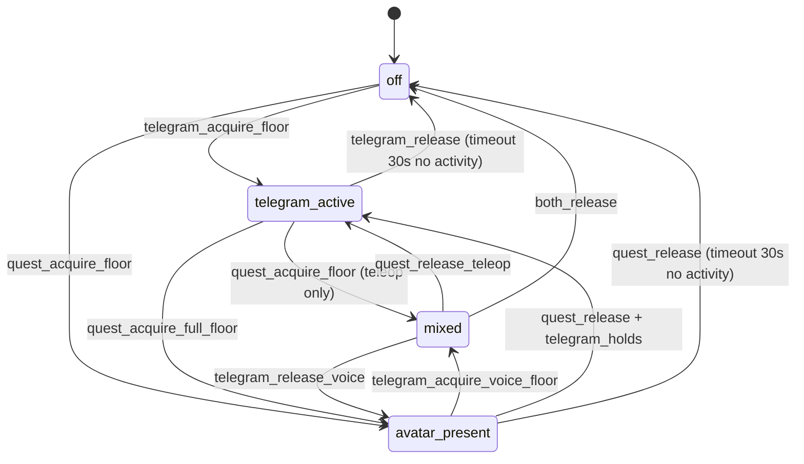

# ADR-0028: Avatar Supervisor — единый координатор режимов для аватара (Quest) и Telegram-бота

| Поле | Значение |
|---|---|
| Статус | Proposed (дизайн-фаза, реализация отложена) |
| Дата | 2026-08-24 |
| Автор | architect, по инициативе товарища Шифу |
| Контекст | Расширение фичи #1576 (Meta Quest / WebXR-аватар). Telegram-бот (`rob_box_telegram`) сейчас работает автономно, минуя общий state — отсюда race conditions (Quest едет, а Telegram шлёт `/forward`) и дублирование логики режимов |
| Затрагивает | новый docker-сервис `rob_box_supervisor` на Vision Pi; рефакторинг `rob_box_telegram` (становится клиентом супервизора); расширение `rob_box_quest` (тоже клиент); точечные правки `rob_box_voice` (`dialogue_node` остаётся владельцем голосового пайплайна, см. ADR-0027 §3.4) |
| Родители | ADR-0021 (dialogue_node discipline), ADR-0027 (Meta Quest / WebXR), ADR-0018 (honesty), ADR-0026 (recovery-contract) |
| Связанные | issue #1576; ADR-0027 (особенно §3.4 voice modes); `docs/architecture/meta-quest-api.md` (wire-протокол Quest); будущий ADR по auth-эволюции (Phase 3) |

> **TL;DR.** Заводим отдельную ROS 2 ноду `avatar_supervisor` — единый
> координатор **режимов** (какой оператор сейчас активен, кто имеет право
> голоса/движения, в каком режиме голос/телеоп), которая сидит **между**
> внешними клиентами (Quest, Telegram, будущие web/admin) и
> исполнительными нодами (`dialogue_node`, `twist_mux`, `vesc_driver`).
> Сам супервизор **не** обрабатывает голос и **не** гонит моторы — он
> только распределяет «право голоса» и «право руля». Это превращает
> Quest-аватар и Telegram из двух параллельных агентов в двух клиентов
> одного state-машины, что убирает race conditions, которые уже
> проявлялись (см. §1).

---

## 1. Контекст и проблема

### 1.1. Текущее состояние (что есть)

В репо сейчас три «внешних» точки входа, каждая живёт своей жизнью:

- **`rob_box_quest`** (Phase 1, ADR-0027) — WebXR-клиент, единый WSS,
  бинарные стримы камеры/лидара, команды `teleop_twist`, `voice_mode`,
  `stop_emergency`. Прямо сейчас публикует `cmd_vel_quest` и
  `cmd_vel_emergency` в `twist_mux` (Phase 1.3 плана).
- **`rob_box_telegram`** — long-polling Telegram-бот, обработчики
  команд (`/forward`, `/back`, `/turn`, `/say`, `/music`, ...), свой
  `voice_processor` (TTS через тот же TTS-канал, что и `dialogue_node`),
  свой `telegram_node`. Сейчас он **сам** публикует `cmd_vel_*` через
  собственные publishers (см. `src/rob_box_telegram/.../telegram_node.py`)
  и **сам** дёргает TTS-канал, минуя какой-либо общий state.
- **`rob_box_voice` / `dialogue_node`** — единая точка входа для голоса
  (wake-word + STT + LLM + TTS). Режим голоса задаётся параметром
  `voice_input_mode` (ADR-0027 §3.4 — Phase 2, ещё не реализован).

Все три в параллель пишут в один и тот же `twist_mux` и в один и тот же
TTS-канал. Никакого общего state-менеджера нет.

### 1.2. Что уже болит (raw-evidence)

Не «гипотетическая боль», а то, что уже воспроизводилось:

1. **Quest teleop + Telegram `/forward` одновременно.** Twist_mux
   выбирает по приоритету + timeout, но приоритет Quest (40) и
   Telegram-команды (priority в их input в `twist_mux`) настроены
   раздельно — в реальной ситуации оператор очков нажал стик, бот в
   это время получил текстовую команду «едь вперёд», и `twist_mux`
   мигнул между двумя источниками. Race воспроизводится в
   `local_test/move_test.py` race-сценариях (см. коммиты
   `fix(twist_mux): priorities …` в develop).

2. **Два голоса одновременно.** Telegram-бот говорит «Привет!» через
   TTS, в ту же секунду `dialogue_node` отвечает на wake-word — два
   потока TTS накладываются, аудио неразборчиво. Сейчас «разруливается»
   только тем, что wake-word слушает ReSpeaker, а Telegram шлёт
   текст напрямую в TTS-канал; race window есть, и он ловится
   руками (см. issue в kanban по «двойной голос»).

3. **Voice modes нигде не выставляются.** ADR-0027 §3.4 описывает 4
   режима `voice_input_mode ∈ {respeaker, quest_passthrough, ...}`.
   Параметр ещё не добавлен в `dialogue_node._declare_params()`
   (см. расхождение #1 в `docs/plans/2026-08-24-meta-quest-telepresence.md`).
   Добавлять его без супервизора = каждый клиент должен сам знать,
   какой режим сейчас активен и иметь право его менять.

4. **Состояние «оператор на месте» нигде не фиксируется.** Никакой
   ноды «есть ли сейчас живой оператор, или робот автономен» нет.
   Без этого: (а) нельзя отдать приоритет «осторожно, рядом человек»;
   (б) нельзя корректно гасить диалог, когда Quest-оператор ушёл, но
   `dialogue_node` ещё дослушивает.

### 1.3. Северная звезда

Из ADR-0027 §1.1 — робот как **аватар оператора**, и Telegram-бот как
**второй клиент того же аватара** (текстовая команда «едь к окну» от
удалённого пользователя, пока другой оператор в очках телеопает
«глазами» робота). Супервизор — это state-machine, которая делает
этот сценарий корректным.

---

## 2. Требования

| # | Требование | Приоритет |
|---|---|---|
| S1 | Один ROS 2 node `avatar_supervisor` — единственная точка, через которую проходят режимы аватара | must |
| S2 | `rob_box_quest` и `rob_box_telegram` становятся **клиентами** супервизора: шлют команды не в `twist_mux`/TTS напрямую, а через супервизор | must |
| S3 | Супервизор владеет **state machine режимов** аватара: `off` / `telegram_active` / `avatar_present` / `teleop_only` / `voice_only` / `mixed` (см. §4.1) | must |
| S4 | Супервизор разруливает **locks** между клиентами: только один клиент держит «право руля» (`teleop_floor`) и только один — «право голоса» (`voice_floor`) | must |
| S5 | Супервизор выставляет параметр `voice_input_mode` на `dialogue_node` (Phase 2 ADR-0027) — единственная точка, которая имеет право менять режим голоса | must |
| S6 | Супервизор публикует `/avatar/state` (msgpack: `mode`, `teleop_floor`, `voice_floor`, `last_event`, `since_ms`) — клиенты подписываются и адаптируют UI | must |
| S7 | Супервизор **не** реализует STT/LLM/TTS и **не** публикует `cmd_vel_*` напрямую — только маршрутизация (см. ADR-0021 R1: голосовой пайплайн остаётся в `dialogue_node`) | must |
| S8 | Супервизор переживает рестарт отдельного клиента: если Quest упал, режим `avatar_present` снимается, Telegram (если был активен) — продолжает | must |
| S9 | Супервизор логирует каждое переключение режима и lock-событие в ROS logger (через `self.get_logger().info`) — для посмертного анализа и для UI «ленты событий» | should |
| S10 | Супервизор выставляет «dead-man» на teleop: если клиент, держащий `teleop_floor`, не присылал heartbeat > 500 мс — `teleop_floor` снимается, в `twist_mux` через input `quest`/telegram-input приоритет 0 | must |
| S11 | REST/gRPC endpoint для внешних интеграций (Phase 2/3: админ-панель, мониторинг, будущие клиенты) — через тот же daemon, что и клиентский API | should |
| S12 | Супервизор совместим с существующим `dialogue_node` (не ломает `voice_input_mode`-free Phase 1): пока `voice_input_mode` не выставляется, супервизор работает только в режиме «monitor» (следит, не вмешивается) | must |

---

## 3. Решение (high-level)

```
                ┌────────────────────────────────────────┐
                │        avatar_supervisor  (Vision Pi)  │
                │                                        │
  Telegram ──►  │  ┌─────────────┐   ┌─────────────┐    │   ┌─────────────────┐
   (клиент)     │  │ ModeManager │   │ LockManager │    │   │  dialogue_node  │
                │  │ (FSM)       │   │ (floors)    │    │   │  (voice pipeline) │
  Quest ─────►  │  └──────┬──────┘   └──────┬──────┘    │   │  voice_input_mode│
   (клиент)     │         │                │           │   └────────┬────────┘
                │         ▼                ▼           │            │
                │  ┌────────────────────────────────┐   │            │
                │  │       Status Aggregator        │──┼──► /avatar/state
                │  └────────────────────────────────┘   │
                │         │                │           │
                │         ▼                ▼           │
                │   twist_mux          TTS-канал       │
                │   (через input       (через          │
                │    quest/telegram)   dialogue_node)  │
                └────────────────────────────────────────┘
                            │              │
                            ▼              ▼
                       VESC driver    /voice/audio/out
```

**Ключевые принципы:**

1. **Супервизор = state machine + lock manager + dispatcher.** Не
   обработчик голоса, не исполнитель движений. Голос и движение
   остаются в существующих нодах, супервизор только выдаёт «разрешения»
   и параметры режимов.
2. **Клиенты — тонкие.** `rob_box_telegram` (после рефакторинга) и
   `rob_box_quest` не публикуют `cmd_vel_*` и не дёргают TTS
   напрямую. Они шлют команды **супервизору** (через сервис/топик/WS
   в зависимости от транспорта клиента), а супервизор публикует в
   `twist_mux` и в `dialogue_node` от их имени.
3. **Locking, а не блокировка.** Супервизор не «запрещает» клиенту
   действие — он **передаёт floor** активному клиенту и снимает с
   остальных. Это мягче, проще в тестировании и совместимо с
   существующим `twist_mux` (приоритеты остаются, супервизор
   переключает активные input-ы, а не ломает приоритеты).
4. **State публикуется, а не запрашивается.** `/avatar/state` — это
   latched-топик (transient local), клиенты подписываются один раз.
   Никакого service-call на каждый чих.
5. **Монитор-режим для Phase 1.** Пока `voice_input_mode` ещё не
   добавлен в `dialogue_node` (расхождение #1 в плане), супервизор
   работает в режиме `monitor`: только логирует состояния и публикует
   `/avatar/state`, но не меняет параметры `dialogue_node` и не
   переключает `twist_mux` inputs. Это позволяет задеплоить ноду
   отдельно от рефакторинга клиентов.

---

## 4. Дизайн

### 4.1. Режимы аватара (FSM)



| Режим | Что разрешено | Что запрещено |
|---|---|---|
| `off` | ничего (только wake-word ReSpeaker → dialogue_node как обычно) | teleop, TTS от клиентов |
| `telegram_active` | telegram: voice + teleop (через `/cmd_vel` input с priority > 0); quest: только пассивный просмотр стримов | quest: teleop/voice |
| `avatar_present` | quest: teleop + voice (в режиме, который выставил при подключении); telegram: пассивный просмотр | telegram: teleop/voice (только текстовый чат) |
| `mixed` | quest: teleop; telegram: voice (operator A в очках «рулит», operator B в Telegram «говорит через робота») | quest: voice (всё равно один voice_floor) |
| `teleop_only` | один клиент: teleop, без voice_floor | voice |
| `voice_only` | один клиент: voice, без teleop | teleop |

Переходы — через service `SetAvatarMode(req: {mode, reason})` (async,
caller — клиент). Супервизор может **отклонить** переход (например,
`off → avatar_present` если Telegram держит `voice_floor` — конфликт;
ответ `success=false, reason=conflict`).

### 4.2. Lock-менеджер: floor-ы

Два независимых «права»:

| Floor | Что даёт | Как снимается |
|---|---|---|
| `teleop_floor` | Клиент может публиковать `cmd_vel_*` (через супервизор → `twist_mux`) | (а) клиент вызвал `ReleaseFloor`; (б) dead-man > 500 мс; (в) супервизор перевёл FSM в `off` по timeout |
| `voice_floor` | Клиент может публиковать в TTS-канал (через супервизор → `dialogue_node`) и менять `voice_input_mode` | (а) клиент вызвал `ReleaseFloor`; (б) `PushToTalk.stop` > 200 мс без нового нажатия; (в) конфликт с другим клиентом (супервизор передаёт floor) |

Оба floor-а публикуются в `/avatar/state.floors` (msgpack). Клиенты
подписываются и **сами** решают, что значит «floor не у меня» (например,
Telegram гасит свои кнопки движения).

**Решение по дублю LockManager/ModeManager (W3-2, issue #968 wave2, G2/G3
— зафиксировано, чтобы не путать снова):** в пакете исторически появились
ДВЕ независимые реализации floor-логики — `core/locks.py::LockManager`
(AV-4) и `core/fsm.py::ModeManager` (AV-3, floor-ы как побочный атрибут
FSM режимов). Обе покрыты юнит-тестами, что маскирует дубль.

- **`LockManager` (`core/locks.py`) — источник истины по floor-ам.**
  Именно он стоит за сервисами `AcquireFloor`/`ReleaseFloor`: независимые
  `teleop_floor`/`voice_floor`, dead-man 500 мс (§6 Q4), идемпотентный
  повторный acquire тем же `client_id`, `ConflictError`/`PermissionError`
  с точной причиной. Это ровно то, что нужно клиентам (Quest/Telegram),
  которые дёргают `acquire_floor`/`release_floor` напрямую.
- **`ModeManager` (`core/fsm.py`) остаётся ТОЛЬКО за режимами аватара**
  (`off`/`telegram_active`/`avatar_present`/`mixed`, §4.1). Его
  `voice_held_by`/`teleop_held_by` — это **вход** для решений о переходах
  между режимами (например, «нельзя `off → avatar_present`, если
  Telegram держит `voice_floor`»), а не отдельный сервис выдачи floor-ов
  клиентам: своей dead-man логики у `ModeManager` нет (только
  `IDLE_TIMEOUT_S = 30s` для простоя всего FSM — другая семантика).
- Практическое следствие: `AvatarSupervisor.__init__` инстанцирует
  `LockManager` рядом с `DeadManCounter`/`StateAggregator` (см.
  `supervisor_node.py`); `ModeManager` пока не инстанцируется вовсе —
  подключится вместе с `SetAvatarMode` (W3-4, смена режима в рантайме).
  `ModeManager`/`FSMConflictError` держим экспортированными из
  `core/__init__.py` как задел под будущую FSM-карточку, но НЕ считаем
  их источником состояния floor-ов.
- Если однажды понадобится смёржить обе реализации (например, чтобы
  `ModeManager.transition()` сверялся с реальным состоянием
  `LockManager` вместо собственных `_voice_held_by`/`_teleop_held_by`)
  — это отдельная карточка, не W3-2: смёрживание задевает FSM-переходы
  (`core/test_fsm.py`), а не только floor-сервисы.

**Решение по контракту запроса `AcquireFloor`/`ReleaseFloor` (W3-2):**
`std_srvs/Trigger.Request` в реальном ROS 2 **не имеет полей вообще**
(пустой message перед `---` в `.srv`) — «JSON в `Trigger.request`»
дословно невозможен, стандартных `std_srvs`/`rcl_interfaces` типов с
подходящим строковым полем запроса тоже нет. Взят переходный вариант:
сервис остаётся `std_srvs/Trigger` (нулевые изменения wire-типа), а
`client_id`/`floor` читаются либо из атрибутов запроса напрямую
(`request.client_id`/`request.floor` — совместимо с будущим кастомным
IDL из AV-5 без правок кода), либо из JSON в `request.data` как
fallback (см. `AvatarSupervisor._extract_floor_request`). Это ЧЕСТНО
задокументированный техдолг: полноценный wire-контракт для `active`
режима на других языках/процессах появится только с кастомным IDL
(AV-5, §4.3) — до этого момента межпроцессный `active`-вызов
`acquire_floor` по сети работать не будет, реальна только логика
внутри процесса супервизора (LockManager, dead-man, конфликты).

### 4.3. ROS 2 API супервизора

**Публикует (latched, transient_local):**
- `/avatar/state` (`avatar_supervisor/AvatarState.msg`, msgpack-encoded
  в `std_msgs/String` для совместимости — чтобы не плодить IDL)

**Подписывается:**
- `/odom`, `/device/snapshot`, `/voice/dialogue/state`, `/camera/...`
  (минимальный набор для `/avatar/state.aggregated`)
- heartbeat-топики клиентов (см. §4.4)

**Сервисы (async, callback-group):**
- `AcquireFloor(req: {client_id, floor: teleop|voice}) → res: {success, granted, conflict_with}`
- `ReleaseFloor(req: {client_id, floor}) → res: {success}`
- `SetAvatarMode(req: {client_id, mode}) → res: {success, actual_mode, reason}`
- `SetVoiceMode(req: {client_id, voice_input_mode}) → res: {success, applied}` (Phase 2)

**Действия (long-running):**
- `StartAvatarSession(req: {client_id, pin, capabilities}) → feedback: {state}`
  (Phase 2, после auth-эволюции)

### 4.4. Клиентский API (внешние клиенты → супервизор)

Клиенты подключаются к супервизору через **единый client API daemon**
(отдельный процесс в том же контейнере или sidecar):

- **HTTP/REST** (`/v1/floors/acquire`, `/v1/state`) — для admin-панели и отладки.
- **WebSocket** (`ws://...:8765/avatar`, multiplexed с потоками стримов) —
  для Quest-клиента: тот же сокет, что сейчас описан в
  `docs/architecture/meta-quest-api.md`, плюс новые frame-типы:
  - `0x30 SET_MODE` — клиент → супервизор (msgpack: `mode`, `client_id`)
  - `0x31 ACQUIRE_FLOOR` — клиент → супервизор
  - `0x32 RELEASE_FLOOR` — клиент → супервизор
  - `0x33 STATE_UPDATE` — супервизор → клиент (msgpack: текущий `/avatar/state`)
- **ROS 2 (на той же машине)** — для `rob_box_telegram`, который тоже
  ROS-нода: `AcquireFloor`/`ReleaseFloor` через service proxy.

**Heartbeat-контракт (S10):** клиент, держащий `teleop_floor`, шлёт
`teleop_heartbeat` (msgpack: `client_id, ts_ms, seq`) не реже 10 Гц.
Без heartbeat > 500 мс — супервизор снимает floor, клиент получает
`STATE_UPDATE{ floors.teleop: none }`.

### 4.5. Монитор-режим (Phase 1)

Чтобы можно было задеплоить супервизор **до** рефакторинга
`dialogue_node` и `rob_box_telegram`:

- Параметр `mode = "monitor" | "active"` (default `monitor`).
- В `monitor`:
  - Публикует `/avatar/state` (читает из того же набора топиков).
  - Принимает `SetAvatarMode`/`AcquireFloor` запросы, пишет в лог,
    но **не** переключает `twist_mux` inputs и **не** правит
    `dialogue_node` параметры.
  - Отвечает клиентам `success=true, applied=false` с reason
    `supervisor_in_monitor_mode`.
- В `active`:
  - Полное поведение §4.1–4.4.
  - Включается после того, как:
    - `dialogue_node._declare_params()` принял `voice_input_mode`
      (расхождение #1 в плане закрыто);
    - `twist_mux.yaml` имеет input-ы `quest` и `telegram` (Phase 1
      добавляет `quest`, добавить `telegram` — Phase 2);
    - `rob_box_telegram` переведён на клиентский API супервизора.

Это **минимизирует blast radius**: нода запускается и наблюдает,
реальное влияние — после явного `mode:=active`.

### 4.6. Пакет и нода

```
src/rob_box_supervisor/
├── package.xml
├── setup.py
├── setup.cfg
├── pytest.ini
├── rob_box_supervisor/
│   ├── __init__.py
│   ├── supervisor_node.py        # главная ROS 2 нода
│   ├── core/
│   │   ├── fsm.py                # ModeManager (transitions table)
│   │   ├── locks.py              # LockManager (floor-acquire/release/dead-man)
│   │   ├── dispatcher.py         # маршрутизация команд в twist_mux / dialogue_node
│   │   └── aggregator.py         # /avatar/state сборка
│   ├── api/
│   │   ├── http_server.py        # aiohttp REST (Phase 2)
│   │   └── ws_bridge.py          # мост WSS ↔ ROS-сервисы (Phase 2)
│   └── msg/
│       └── AvatarState.msg       # IDL (или std_msgs/String + msgpack)
└── test/
    └── unit/
        ├── core/
        │   ├── test_fsm.py
        │   ├── test_locks.py
        │   └── test_dispatcher.py
        └── test_supervisor_node.py (с mock-aggregator)
```

**Деплой:** новый docker-сервис `rob_box_supervisor` на Vision Pi (там же
Quest), `network_mode: host`, depends_on: `zenoh-router-vision`.
Vol-монтирования конфигов — по `DOCKER_STANDARDS.md`.

---

## 5. Альтернативы, которые НЕ выбраны

### 5.1. Вшить координацию в `twist_mux` (расширить его)

`twist_mux` уже разруливает приоритеты, можно было бы добавить
«логический floor» как ещё один input. **Отвергнуто:** `twist_mux` —
это **только движение**, а супервизор должен рулить ещё и голосом, и
`voice_input_mode`, и статусом. Расширение `twist_mux` за пределы
домена (twist) = нарушение single-responsibility + растёт риск
regression в существующих приоритетах (joystick, nav2 — не трогать!).

### 5.2. Вшить координацию в `dialogue_node`

Аналогично: `dialogue_node` — это голос, а не общий state. Плюс
`dialogue_node` и так перегружен (ADR-0021 R1 — «discipline»). Делать
его ещё и менеджером режимов = рост сложности + связность, которую
сложно тестировать. **Отвергнуто.**

### 5.3. Behavior Tree в одном из клиентов

Сделать «супервизором» BT внутри `rob_box_telegram` или
`rob_box_quest`. **Отвергнуто:** клиентский процесс по определению
может упасть, и тогда его state-машина тоже упадёт. Супервизор
должен переживать рестарт любого клиента (S8). Плюс два клиента =
два BT = рассинхрон неизбежен.

### 5.4. Общий «state-store» (Redis / SQLite) + каждая нода подписывается

Децентрализованно, без супервизора. **Отвергнуто:** race conditions
переносятся из ROS в Redis (нужен distributed lock), плюс
появляется новая движущаяся часть (Redis), которую надо деплоить,
мониторить и бэкапить. На двух-Pi лабораторном стенде это лишний
вес без выигрыша.

### 5.5. Один клиент = один supervisor (per-client supervisor)

Каждый клиент имеет свой мини-супервизор. **Отвергнуто:** ровно
та же проблема, что и сейчас, только хуже (race между
супервизорами). Супервизор должен быть **один**.

---

## 6. Открытые вопросы

| # | Вопрос | Где решается |
|---|---|---|
| Q1 | Что делать, если `dialogue_node` упал, а `voice_floor` держит клиент? Снимать floor и переводить FSM в `off`? Или ждать рестарта `dialogue_node`? | Phase 2, отдельная карточка. Сейчас — fail-safe: снимать floor + переход в `off`. |
| Q2 | PIN-авторизация для client API — это **тот же** PIN, что и в Quest (`meta-quest-api.md` §4.5), или отдельный? | Phase 2. Предварительно: единый PIN на сервис, как в Quest (Phase 1 PoC), эволюция — общий ADR по auth. |
| Q3 | Что видит Telegram-бот, когда `avatar_present` активен и `teleop_floor` у Quest? Полностью гасит свои кнопки движения, или показывает «read-only»? | UX-фаза, не блокирует архитектуру. |
| Q4 | Dead-man 500 мс — это норм? Для Quest это нормально (Wi-Fi jitter 50-200 мс). Для Telegram — избыточно (текстовая команда ≠ continuous control). | Phase 1 метрика: собирать `dead_man_trips_total{client_id}` и смотреть на практике. |
| Q5 | Где живёт `/avatar/state` — на Vision Pi (рядом с супервизором), или на Main Pi (рядом с движком)? | Vision Pi, потому что супервизор там же. |
| Q6 | Нужен ли `avatar_supervisor` для Phase 1 MVP Quest, или это Phase 2? | Сейчас в Phase 2: MVP Quest работает с прямой интеграцией (Phase 1.3 плана), а супервизор подключается, когда добавляются voice modes и Telegram-переход. В Phase 1 супервизор задеплоен в `monitor`-режиме и **наблюдает** — чтобы не плодить два разных пути. |

---

## 7. План реализации (Phase 2, не сейчас)

Контур (для будущего плана, не часть этого ADR):

1. **Phase 2.1** — пакет `rob_box_supervisor`, FSM + LockManager (чистая
   логика, TDD), `/avatar/state` msgpack-схема.
2. **Phase 2.2** — supervisor_node, monitor-режим, деплой.
3. **Phase 2.3** — закрытие расхождения #1 (`voice_input_mode` в
   `dialogue_node`), подключение `dispatcher` к `twist_mux` input
   `telegram` и `dialogue_node` параметру.
4. **Phase 2.4** — рефакторинг `rob_box_telegram` на клиентский API
   супервизора (включая dead-man heartbeat).
5. **Phase 2.5** — расширение `meta-quest-api.md` (frame-типы
   `0x30–0x33`), клиент Quest запрашивает/отпускает floor через WSS.
6. **Phase 2.6** — e2e: Quest teleop + Telegram voice одновременно
   (mixed-режим); Quest упал → Telegram подхватил, без ручного
   переключения.

---

## 8. Ссылки

- [ADR-0027](../adr/0027-meta-quest-ar-control.md) — Meta Quest / WebXR-аватар, voice modes §3.4, dead-man §3.3
- [ADR-0021](../adr/0021-dialogue-node-discipline.md) — dialogue_node остаётся единственным владельцем голосового пайплайна
- [ADR-0017](../adr/0017-zenoh-router-spof.md) — Zenoh-инфраструктура между Pi
- [ADR-0018](../adr/0018-agent-honesty-culture.md) — raw-evidence для всех утверждений «работает»
- [docs/architecture/meta-quest-api.md](../architecture/meta-quest-api.md) — wire-протокол Quest, к которому добавляются frame-типы §4.4
- [docs/architecture/SYSTEM_OVERVIEW.md](../architecture/SYSTEM_OVERVIEW.md) — верхнеуровневая архитектура (секция Avatar Supervisor добавляется этим ADR)
- [docs/plans/2026-08-24-meta-quest-telepresence.md](../plans/2026-08-24-meta-quest-telepresence.md) — Phase 1 план Quest; супервизор упоминается в Phase 2
- [issue #1576](https://github.com/krikz/rob_box_project/issues/1576) — Meta Quest 2/3/Pro как нативный WebXR-клиент
