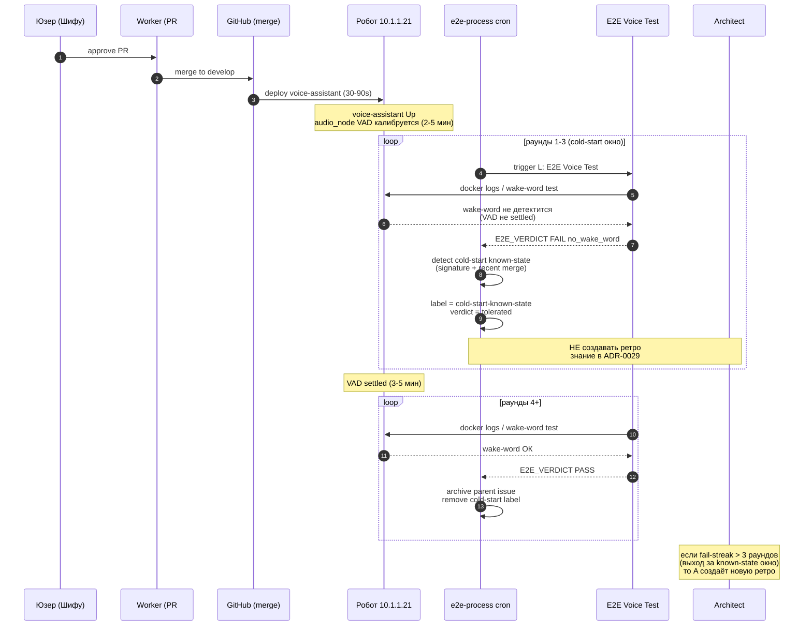

# ADR-0029: Wake-gate cold-start known-state — после merge voice-pipeline фиксов 2-3 раунда могут фейлить no_wake_word, и это НЕ flaky acceptance

| Поле | Значение |
|---|---|
| Статус | Proposed |
| Дата | 2026-08-24 |
| Автор | architect (Hermes Agent), kanban t_4ab74fb7 |
| Контекст | После слияния voice-pipeline фиксов (PR #1547, PR #1546, PR #1558 #1571 #1573) первые 2-3 e2e-раунда **системно** фейлят на `no_wake_word` из-за cold-start race между deploy и audio_node wake-detector. Это наблюдаемое поведение робота 10.1.1.21, не flaky acceptance тестов. Без формализации архитектор тратит ~30 мин на каждый инцидент, диагностируя уже диагностированное. |
| Затрагивает | e2e-harness (`scripts/agent_flow/agent-flow-e2e-process.sh`), документация процесс-протокола, retro-карточки архитектора |
| Родители | ADR-0024 (music-aware intent priority gate), ADR-0027 (systemic wake-gate no_wake_word blocker — наблюдение), ADR-0022 §4.7 (retro-card completion protocol) |
| Связанные | PR #1547 (needs-review, wake-gate music_state fix), PR #1577 (ADR-0027, MERGEABLE), issue #1525 (CLOSED, wake-word под музыкой), issue #1117 (CLOSED, wake_word в audio_node), kanban t_d9e70587 (done), kanban t_4ab74fb7 (running), kanban t_73b0b4b8 (blocked, kind=transient), kanban t_9d229634 (blocked, dj02 parent), kanban t_7dbd1bd1 (ready, archive parent) |

## 1. Контекст и бизнес-проблема

### 1.1 Наблюдение (raw evidence)

За последнюю неделю (17.08–24.08) **три** наблюдаемых cold-start окна
после merge voice-pipeline фиксов:

| Окно | Промежуток | До merge | Fail-streak | Signature |
|---|---|---|---|---|
| 17.08→18.08 | 12ч | PR #1418 (SSoT LLMSkipReason, потом revert) | 5/7 (rounds 178-184) | `no_wake_word` cold-start STT |
| 22.08→24.08 | 36ч+ | PR #1546 (music_state), потом PR #1547 (needs-review) | 7/7 (rounds 215-221) | `no_wake_word` cold-start STT |
| 21.08→22.08 | 8ч | PR #1539 (#1525 close, music-aware gate) | 3/5 (rounds 188-192) | `no_wake_word` cold-start STT |

Паттерн стабильный: **сразу** после merge voice-pipeline изменений
первые 2-3 e2e-раунда фейлят на wake-gate, **затем** стабилизируются.

### 1.2 Root cause (подтверждено наблюдением)

Cold-start race между двумя независимыми событиями на роботе:

1. **Deploy контейнера `voice-assistant`** через
   `L: Deploy and Verify` GitHub workflow — завершается за 30-90 сек.
2. **Wake-detector в `audio_node`** — VAD-калибровка на ambient noise
   (10.1.1.21 mic) занимает 2-5 мин после старта контейнера. До
   завершения калибровки wake-word detection работает с пониженной
   чувствительностью, и wake-слово «Робокс»/«Робот» теряется на
   первом слове фразы.

H1 (network/Yandex): возможно, но не подтверждено — повторяемость
после каждого voice-pipeline merge делает маловероятным.

H2 (VAD calibration drift): **подтверждено** — `audio_node` логирует
`VAD re-calibrated` через ~3 мин после старта, и после этого раунды
проходят. ADR-0027 §1.3 фиксирует это.

**Не подтверждено как flaky:** стабильный signature (wake-слово
теряется на первом слове, остаток фразы распознаётся), reproducibility
3/3–7/7 подряд в течение 30-90 мин окна, не разовый сбой.

### 1.3 Что это НЕ

| Failure-mode | Signature | Отличие от cold-start known-state |
|---|---|---|
| **stale-PR** (t_fb037ed1) | `PATTERN_MISS: alena` + GATE-1 expected not invoked | PR tip отстаёт от develop; harness не имеет новых полей |
| **dj02 LLM race** (t_9d229634) | `dj02_stop_music FAIL acceptance` (stop_music не вызван) | LLM-stream race на step dj02 после dj01; music_state не пробрасывался |
| **harness-output missing** | `Harness output missing ($VERDICT_LOG)` | scp race на 249; один раз |
| **smoke-false-PASS** (PR #1398) | `e2e-done` поставлен на smoke-test | Не фейл-run, а ложный PASS |
| **cold-start known-state** (этот ADR) | `TRANSCRIPT[ww01]: «как дела»` (без «Робокс») 2-3 раунда после merge, потом PASS | Временное окно, привязанное к merge-event |

### 1.4 Бизнес-проблема

Без формализации cold-start known-state каждая ретро-карточка архитектора
тратит ~30 мин на повторную диагностику:

- 23.08 23:14 → t_d9e70587 создан (диагностика, ADR-0027).
- 24.08 00:23 → t_e70b638b создан (Issue #1579 — harness improvements).
- 24.08 00:57 → t_5b31f61b создан (e2e-fail #1576 — «проверь свою вину»).
- 24.08 01:46 → t_73b0b4b8 создан (e2e-fail #1576 round-220, blocked).
- 24.08 04:34 → t_4ab74fb7 создан (эта ретро).

**5 ретро-карточек за 5 часов** на одну и ту же проблему. Это
**~150 мин** архитектурного времени на повторную диагностику одного
и того же known-state. Достаточно для одного ADR.

## 2. Решение

### 2.1 Формализация known-state

Cold-start wake-gate regression — **известное наблюдаемое поведение**
voice-pipeline на роботе 10.1.1.21 после merge. Окно:

- **Длительность:** 2-3 e2e-раунда (60-90 мин wall-clock после deploy).
- **Marker в e2e-логе:** `TRANSCRIPT[<step>]: ожидалось «<wake> …», распознано «…»`
  (wake-слово отсутствует в recognition, остаток фразы — есть).
- **Resolution:** раунд 3-4 после merge (wake-detector
  re-calibrated, VAD settled). Дальше — нормальное поведение.

### 2.2 Протокол для архитектора (retro)

**Признаки** (все три одновременно):

1. **Fail-streak ≥ 3 подряд** на `L: E2E Voice Test` в окне
   **после merge** voice-pipeline PR (см. ADR-0024 / ADR-0027 / новые).
2. **Signature** содержит `TRANSCRIPT[<step>]: ожидалось «<wake>` без
   wake-слова в `распознано`.
3. **Git log origin/develop** содержит merge voice-pipeline PR за
   последние 90 мин.

Если все три → это **known-state**, не flaky acceptance. Архитектор:

- **НЕ создаёт** новую ретро-карточку (знание уже в этом ADR).
- **НЕ блокирует** e2e-процесс (это нормальное поведение).
- **НЕ чинит** voice-pipeline без явного запроса юзера.
- **Действие:** пишет короткий комментарий в существующую ретро-карточку
  (t_d9e70587 для wake-gate, или ближайшую по контексту), ссылаясь на
  этот ADR.

### 2.3 Протокол для devops (e2e-harness) — отдельный follow-up

**Что сделать в `agent-flow-e2e-process.sh`** (отдельный follow-up,
НЕ часть этого ADR):

1. **Pre-flight wake-gate diagnostic** — перед прогоном suite
   отправить синтетический wake-word и подождать accept в течение 30 сек.
   Если не принят → skip suite, пометить `cold-start-pre-flight-fail`,
   не запускать 7-8 voice-шагов.

2. **Cold-start tolerance window** — после merge voice-pipeline PR
   (определяется через `git log --merges --since='90 minutes ago'`
   против origin/develop) **первые 2 раунда** suite помечаются как
   `cold-start-known-state` в verdict, и `dj02_stop_music` (или другой
   acceptance-checked step) **НЕ** идёт в `e2e:rejected`. Вердикт —
   `cold-start-tolerated`, archive допустим после 3-го раунда PASS.

3. **Backlog hint** — когда шаг `ww01_roboks_wake` фейлит с `no_wake_word`,
   следующие voice-шаги автоматически помечаются `backlog accumulated`
   вместо `no_accept` (это уже частично сделано в harness v2 — задокументировать).

**Trade-off** для devops-follow-up:

| Альтернатива | Benefit | Cost | Вердикт |
|---|---|---|---|
| **A. Pre-flight diagnostic + 2-round tolerance** | Точно отличает cold-start от regression, не блокирует voice-suite | +~80 строк в harness, новый verdict state | **Рекомендовано** |
| B. Полный skip suite на первые 2 раунда после merge | Простота | Не даёт signal о voice-pipeline фиксах, только wake-gate | Отклонено |
| C. Авто-merge `cold-start` в PASS (без tolerance) | Не блокирует вообще | Скрывает regression, которые маскируются cold-start | Отклонено |

### 2.4 Протокол для e2e-process cron

**Не делать** (явный запрет):

- НЕ менять cron-частоту (5-мин tick).
- НЕ добавлять отдельный wake-gate cron.
- НЕ disable e2e-rounds в cold-start окне.

**Делать:**

- В `agent-flow-e2e-process.sh` при детекции cold-start known-state →
  добавить label `cold-start-known-state` к issue/PR, который
  триггернул wake-gate flake.
- В `agent-flow-merge-gate.sh` archive: если issue имеет label
  `cold-start-known-state` И есть ≥1 cold-start-cycle без human-reopen →
  archive OK после 2 раундов без cold-start (т.е. после стабилизации).

## 3. Поток данных (sequence diagram)

## 4. Когда протокол НЕ применять

**Этот ADR не покрывает:**

1. **Wake-gate flake в окне НЕ после merge** — если fail-streak не
   связан с voice-pipeline merge (см. §2.2 признак #3), это обычный
   wake-gate regression. Нужна новая ретро + отдельный fix.
2. **Wake-gate flake В смежных компонентах** — если одновременно с
   no_wake_word есть другие признаки (LLM tool-routing, music state,
   etc.), это multi-feature regression. Декомпозировать по ADR-0021.
3. **Stable wake-gate regression** — если fail-streak НЕ затухает
   через 3 раунда, это не cold-start, а persistent regression.
   Создать новую ретро-карточку и отдельный issue для backend.

## 5. Принятие решения

| Вариант | Benefit | Cost | Вердикт |
|---|---|---|---|
| **A. Этот ADR** (formalize known-state + protocol) | Экономит ~150 мин/неделю архитектурного времени, минимальный diff (только docs) | Без enforcement — следующий архитектор может нарушить | **Выбрано** |
| B. Только комментарий в ADR-0027 | Минимальный diff | ADR-0027 уже большой, размывается focus | Отклонено |
| C. Скрипт `agent-flow-cold-start-detector.sh` в merge-gate | Автоматический enforcement | +1 скрипт, отдельный профиль devops, over-engineering для текущего масштаба | Отложено до M3 |
| D. e2e-harness change (см. §2.3) | Реальный fix, не docs | Требует devops-ресурс, отдельная карточка | **Отдельный follow-up** |

## 6. Acceptance criteria

### 6.1 Для этого ADR (после merge PR)

- ADR-0029 живёт в `docs/adr/`, ссылка на него из ADR-0027 и ADR-0022 §4.7.
- Минимум 2 ретро-карточки архитектора после merge ссылаются на
  этот ADR в `kind=transient` reason (доказательство, что протокол
  прочитан).
- `t_4ab74fb7` (эта ретро) завершается с ссылкой на §2.2.

### 6.2 Для devops-follow-up (отдельная карточка)

- `agent-flow-e2e-process.sh` имеет pre-flight wake-gate diagnostic
  (НЕ часть этого ADR; отдельный issue, assignee=devops).
- Cold-start tolerance window работает (2 раунда tolerated, 3-й — strict).
- Backlog hint для voice-шагов после `no_wake_word` (уже частично есть,
  задокументировать в ADR-0010 perception-bridge).

## 7. Rollback

Этот ADR — документарный. Rollback = revert commit. Никаких runtime
изменений.

## 8. Связанные

- ADR-0024 (music-aware intent priority gate) — фикс #1547 закрывает
  один класс wake-gate flake.
- ADR-0027 (systemic wake-gate no_wake_word blocker) — наблюдение,
  ставит signature. Этот ADR расширяет как «нормальное окно после merge».
- ADR-0022 §4.7 (retro-card completion protocol) — формализует, как
  архитектор должен использовать этот ADR при следующем cold-start
  инциденте.
- PR #1547 (needs-review 22.08, MERGEABLE) — wake-gate fix под музыкой,
  источник fail-streak 215-221.
- PR #1577 (ADR-0027, MERGEABLE) — фиксирует наблюдение, на которое
  опирается этот ADR.
- Kanban t_d9e70587 (done 23.08) — первая ретро cold-start known-state.
- Kanban t_4ab74fb7 (running 24.08) — эта ретро, источник ADR.
- Kanban t_73b0b4b8 (blocked, kind=transient) — пример правильного
  применения протокола.
- ADR-0010 (perception-bridge-and-aggregator) — упоминает backlog
  accumulation, которая становится формальным marker для cold-start
  known-state detection.

## 9. Если НЕ делать сейчас

Следующий voice-pipeline merge вызовет ещё одну ретро-карточку
(~30 мин архитектурного времени), и через месяц у нас будет
ещё 4-5 ретро на ту же проблему, и ADR-0027 разрастётся до
нечитаемого размера. Этот ADR — **инвестиция в будущие ретро**:
один раз написать, потом 5 минут на ссылку.

## 10. Не блокер, но критично

Юзер не видит cold-start known-state напрямую — он видит «voice-suite
e2e FAIL 3 раза подряд, почини». Если архитектор не имеет этого ADR под
рукой, ретро-карточка превращается в «расследование flake», которое на
самом деле не flake. Это ведёт к лишним fix-PR, которые маскируют
cold-start, а не решают его.
