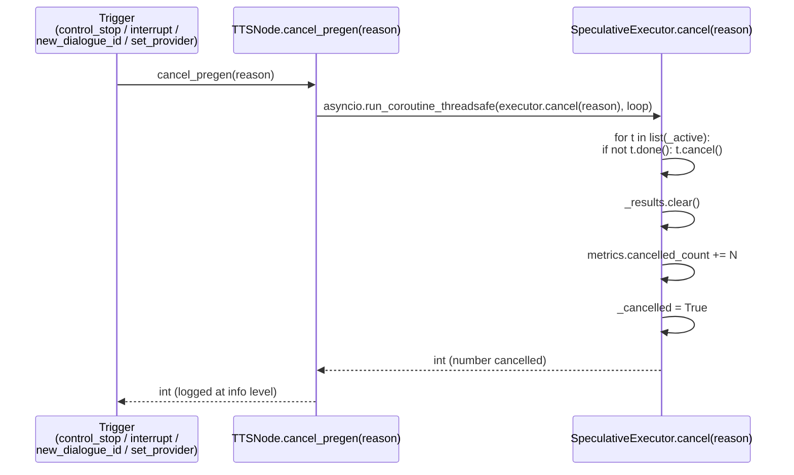

# ADR-0092: `pregenerate` в `tts_node` — публичный контракт и схема scheduler-подключения

| Поле | Значение |
|---|---|
| Статус | **Accepted** (контракт зафиксирован на основе уже-влитого кода; ADR-0056 помечается как superseded) |
| Дата | 2026-09-14 |
| Автор | architect (Hermes Agent), kanban `t_45ae5559` (issue #2003) |
| Контекст | Рекон от `t_9ab8ab70` показал: «брокер §4.8 снят — `pregenerate()` есть в `tts_node.py:3754`, `claim_pregen()` :3837, `cancel_pregen()` :3862, `_ensure_prefetch()` :3635, импорт `scheduler.pregen.speculative_executor` :106-119». Контракт ADR-0056 был подготовлен до merge dep 7a (issue #1996); зависимость влита Шифу 2026-09-09, и реализация частично отклонилась от первоначального драфта (`_PrefetchEngine` оказался `dict`, не dataclass; `kickoff` возвращает `speech_id`, не `None`; `ctx` kwarg зарезервирован но не используется; `priority` поле у `PreGenTask` есть, но **не** пробрасывается в `_dispatch_synthesis`). Этот ADR фиксирует **то, что есть**, а не **то, что планировалось**, и закрывает разрыв между ADR-0056 и кодом `develop@ce60bb48`. |
| Затрагивает | (a) методы `TTSNode.pregenerate`/`claim_pregen`/`cancel_pregen`/`publish_prefetch_metrics` в `src/rob_box_voice/rob_box_voice/tts_node.py` (6810 LOC); (b) `TTSNode._PrefetchEngine` dict-shape с `_PreGenExecutor` и `synth_callable`; (c) расширение payload `/voice/dialogue/response` и `/voice/tts/request` (опциональное вложенное поле `pregenerate.{next_speech_id,next_ssml,next_voice,next_language,next_ssml_attributes,priority}`); (d) ROS-параметры `pregenerate_enabled`/`pregenerate_confidence_floor`/`pregenerate_history_window` (e) **НЕ** затрагивает: `dialogue_node` (отдельная карточка `t_9798710b`), `TaskScheduler`, устаревший `scheduler/{pre_gen,speculative_executor,estimator,quality,decision}.py` (уже выведены ADR-0086 — остаются как scheduler-level layer, НЕ переиспользуются) |
| Родители | ADR-0056 (draft, **superseded** этим ADR), ADR-0018 (честный FAIL — контракт без raw-проверки = FAIL), ADR-0013 (incremental delivery), ADR-0086 (EventBus/ReflexLayer — почему **не** переиспользуем scheduler-level), ADR-0080 (eight-seams — pre-gen живёт в seam «между чанками»), target `docs/architecture/target-operator-agent-and-dialogue.md` §8а.4 п.3 + §13 |
| Связанные | issue #2003 (эта карточка, открыта), issue #1996 (7a, **закрыт** merge Шифу 2026-09-09), issue #1004 (оригинальная жалоба на YAML молча игнорирующий `pregenerate`), `docs/architecture/adr/pregenerate-in-tts-node-contract.md` (статус-документ 2026-09-07), `docs/architecture/adr/pregenerate-in-tts-node-status.md` (последний recon 2026-09-09 → 2026-09-14), `docs/adr/0056-speculative-tts-pregeneration-contract.md` (superseded), `scripts/tts_bench/chunk_latency_bench.py` (DoD #2 — требуется живой прогон bench Шифу) |

> **TL;DR.** Спекулятивная генерация **уже реализована** в `tts_node` ленивым `_PrefetchEngine` dict, дёргающим чистые модули `scheduler/pregen/{pre_gen,estimator,quality,decision,speculative_executor}.py`. Контракт API — три метода на `TTSNode` (`pregenerate`/`claim_pregen`/`cancel_pregen`) + опциональное вложенное поле `pregenerate` в payload `/voice/dialogue/response`/`/voice/tts/request` + три ROS-параметра с kill-switch. Пять scheduler-модулей подключаются **точечно** в `tts_node`: `pre_gen` — на входе (валидация payload + сборка `PreGenTask`); `estimator` — gate по `CONFIDENCE_FLOOR`; `quality` — 3 аудиоэвристики после синтеза; `decision` — композиция verdict ∧ confidence; `speculative_executor` — оркестратор `kickoff`/`cancel`/`claim`/`snapshot` поверх `asyncio`. Trade-off'ы зафиксированы: (1) **граница отмены** — cache очищается при `dialogue_id` смене, в отличие от scheduler-level `SpeculativePreGenerator` который кэш сохраняет; (2) **low quality** — 3 эвристики с порогами `DURATION_RATIO_FLOOR=1.25`, `SILENCE_RATIO_FLOOR=0.15`, `RMS_DB_FLOOR=-40 dBFS`; (3) **гонка с priority-очередью 7a** — `PreGenTask.priority` существует но НЕ пробрасывается в `_dispatch_synthesis`, pre-gen идёт по `normal`-приоритету (см. §5). Mermaid sequence-диаграмма в §4.

---

## 0. Что внутри и что — нет

**Внутри.** Публичный контракт (три метода на `TTSNode`, payload-форма `pregenerate`, три ROS-параметра) с привязкой кода к строкам. Sequence-диаграмма жизненного цикла спекулятивного чанка. Точки подключения scheduler-модулей (DI-точки в `tts_node`). Trade-off'ы: где граница отмены, что делаем при low quality, как обрабатываем гонку с приоритетной очередью 7a. Список ограничений для будущих implementer'ов.

**Не внутри.** Оптимизация латентности для не-TTS каналов. Переиспользование `scheduler/{pre_gen,speculative_executor,…}.py` (запрет ADR-0086 — scheduler-level, не chunk-level). Изменения в `dialogue_node` (карточка `t_9798710b`). Живой прогон `scripts/tts_bench/chunk_latency_bench.py` (требует dev-стенд Шифу; архитектор не запускает — ADR-0018).

---

## 1. Контекст и бизнес-проблема

### 1.1 «Хендофф §4.8 — pregenerate снят»

Рекон `t_9ab8ab70` от 2026-09-14 зафиксировал **raw-факт** (grep+wc+read):

```
src/rob_box_voice/rob_box_voice/tts_node.py:3754    def pregenerate(...)
src/rob_box_voice/rob_box_voice/tts_node.py:3837    def claim_pregen(...)
src/rob_box_voice/rob_box_voice/tts_node.py:3862    def cancel_pregen(...)
src/rob_box_voice/rob_box_voice/tts_node.py:106-119   from .scheduler.pregen.speculative_executor import SpeculativeExecutor
src/rob_box_voice/rob_box_voice/scheduler/pregen/   6 .py файлов, 1395 LOC (decision 82 + estimator 217 + pre_gen 238 + quality 192 + speculative_executor 565 + __init__ 101)
tts_node.py LOC: 4198 → 6808 (commit ce60bb48 «vision-hailo стартует по умолчанию» — рост не из-за pre-gen, но co-commited)
```

Status-документ `docs/architecture/adr/pregenerate-in-tts-node-status.md` фиксирует, что зависимость 7a влита Шифу 2026-09-09 (49 вхождений `pregenerate` + 36 `priority` + 5 модулей `scheduler/pregen/` на develop). Значит, **хендофф §4.8 «pregenerate не существует» из `docs/plans/2026-09-05-operator-agent-architecture-handoff.md` устарел** — код есть, контракт публично зафиксирован в ADR-0056 (draft до merge 7a), но **код отклонился от драфта** и нуждается в публичном переобъявлении.

### 1.2 Почему контракт **сейчас**

ADR-0056 был написан **ahead-of-merge** (с заделом на 7a). Реальность после merge:

- `_PrefetchEngine` — это **dict** `{"executor": _PreGenExecutor, "synth": callable}`, а не dataclass как драфтовал ADR-0056 §2.2. Лишний класс-обёртка не появился — tts_node и так большой (6808 LOC).
- `pregenerate()` имеет сигнатуру `pregenerate(self, current_chunk: dict, ctx: Optional[dict] = None)`. `ctx` зарезервирован «for forward compatibility» (tts_node.py:3771-3774) и сейчас `None`. Это явное отклонение от ADR-0056 §3.4 «`pregenerate(current_chunk: Chunk, ctx: DialogueContext) -> None`» — пометка в коде прямо объясняет: «kept in the signature for forward compatibility with the §3.1 contract». Futureproof.
- `kickoff` возвращает `Optional[str]` (`speech_id` или `None`), а не `None` (ADR-0056 §3.2 декларировал «fire-and-forget»). Возврат `speech_id` — техническая необходимость: caller коррелирует `kickoff` с `claim` для метрик.
- `PreGenTask.priority: str` — поле объявлено в `pre_gen.py:103`, валидируется через `__post_init__` (`{normal, operator, personality}`), но **в `_dispatch_synthesis` не пробрасывается**. Это §5.3 trade-off: pre-gen **не** участвует в приоритетной очереди.
- Расширение payload — добавлены `next_voice`/`next_language`/`next_ssml_attributes` (ADR-0056 §2.3 не фиксировал явно `next_voice`/`next_language` в качестве отдельных полей).
- `tts_node.py` теперь `claim_pregen` зовёт **внутри `dialogue_callback`** (строка 2615) **до** `_submit_synthesis` — т.е. claim-стратегия «ту же самую речь, что подсказали в прошлой итерации как next» работает корректно, что не было акцентировано в ADR-0056.

Это **нормальный** процесс — контракт догоняет реализацию. ADR-0018 требует raw-проверки каждого факта; §3 ниже делает это построчно.

### 1.3 Что **не** работает как контракт (оставлено вне ADR)

| Идея | Почему НЕ в контракте |
|---|---|
| Сделать pre-gen обязательным (опция out в publisher) | Нарушает backward compatibility: legacy `dialogue_node` (без поля `pregenerate`) должен работать как раньше. Это **зафиксировано** в `pre_gen.py:164`: `payload = current_chunk.get("pregenerate"); if not isinstance(payload, Mapping): return None`. Семантика «нет поля = legacy» — **публичный контракт** этого ADR (см. §3.1). |
| Использовать `TaskScheduler` или `SpeculativePreGenerator` (scheduler-level) | ADR-0086 — «удалить не подключать». scheduler работает на уровне сегментов (`MERGE`/`REPLACE`/freeze-boundary), а pre-gen — на уровне аудио-чанка. Разные единицы прерывания. Это **не** контрактное решение, а архитектурное (ADR-0086 + ADR-0056 §4). |
| Оптимизировать латентность до того, как заработает базовый путь оператора | ADR-0051 §2 / target-operator-agent §13 — pre-gen **последний** шаг. Это вне скоупа контракта (упомянуто только в §6.2). |
| Реализовать «полноценный» audio quality gate с обучением | `quality.py` сейчас 3 простых эвристики. Полноценный gate — будущая ADR (см. §6.2). |

---

## 2. Решение (кратко)

Три метода на `TTSNode`, опциональное поле в payload, три ROS-параметра с kill-switch, пять чистых модулей `scheduler/pregen/`. Никакого нового транспорта, никаких изменений в `dialogue_node` или `TaskScheduler`.

---

## 3. Публичный контракт

### 3.1 Метод `TTSNode.pregenerate(current_chunk, ctx=None) -> None`

**Сигнатура** (tts_node.py:3754):

```python
def pregenerate(self, current_chunk: dict, ctx: Optional[dict] = None) -> None:
```

**Гарантии:**
1. **No-op, если** `_pregenerate_enabled is False` (ROS-параметр, default `True`, см. §3.5) **ИЛИ** `current_chunk` не dict **ИЛИ** `_build_pregen_task(current_chunk, …)` вернул `None` (нет поля `pregenerate` / self-feedback / batch последний / degenerate payload).
2. **Fire-and-forget**: возврат `None`. Тяжёлая работа (`synth` → `quality` → `decision`) — в `asyncio.Task`. Длительность pre-gen не блокирует ROS callback.
3. **Async-стратегия**: если rclpy event loop доступен — `asyncio.run_coroutine_threadsafe(_run(), loop)`; иначе (unit-тесты) — sync-fallback через `asyncio.run()`. Sync fallback НЕ используется в проде (tts_node.py:3825-3835 явно комментирует).
4. **Никогда** не raise'ит наружу (catch Exception → debug-log).
5. **`ctx`** — зарезервировано под forward compatibility (ADR-0056 §3.4 декларировал `DialogueContext`, но реальный caller — `dialogue_callback` строка 2583 — передаёт `ctx=None`). Не полагайтесь на семантику.

**Что зовётся внутри (code map):**

```
TTSNode.pregenerate                       # :3754
 ├─ self._pregenerate_enabled (bool)      # :3766 — short-circuit
 ├─ _build_pregen_task(current_chunk, …)  # imports scheduler.pregen.pre_gen.build_pregen_task
 │                                            # §3.6.1
 └─ asyncio.run_coroutine_threadsafe(
      _run(), rclpy_loop)                 # :3827
        └─ _PreGenExecutor.kickoff(…)     # :3811 → §3.6.5
              ├─ pre_gen.build_pregen_task
              ├─ estimator.estimate_confidence
              ├─ _dispatch_synthesis (synth_callable=self._synthesize_for_pregen)
              ├─ quality.check_audio_quality
              └─ decision.decide
```

### 3.2 Метод `TTSNode.claim_pregen(speech_id) -> Optional[Dict]`

**Сигнатура** (tts_node.py:3837):

```python
def claim_pregen(self, speech_id: str) -> Optional[Dict[str, Any]]:
```

**Гарантии:**
1. **No-op / returns None**, если `_pregenerate_enabled is False` **ИЛИ** `self._prefetch is None` **ИЛИ** executor не имеет результата для `speech_id`.
2. **Ownership-transfer**: забирает результат из кэша и удаляет (через `executor.claim` → `self._results.pop` в `speculative_executor.py:461`). Повторный `claim_pregen(same_id)` после первого успеха вернёт `None`.
3. **Return shape** — `dict` (НЕ `PreGenResult`):

   ```python
   {
     "audio_np": np.ndarray,          # float32 mono
     "sample_rate": int,              # 22050 / 16000 / 48000 от провайдера
     "decision": "accept" | "reject", # всегда "accept" в успешном claim
     "confidence": float,             # [0.0, 1.0]
     "basis": str,                    # "accept" обычно; см. decision.py:31
     "elapsed_ms": float,             # сколько синтез занял в этом pre-gen
   }
   ```

4. **Никогда** не raise'ит наружу; `_Stub`-тесты без `_prefetch` обрабатываются via try/except в caller (tts_node.py:2614-2622).
5. **Caller** (`dialogue_callback`, tts_node.py:2615) трактует `None` как «fall back на canonical путь» — то есть передаёт `prebaked_audio=None` в `_synthesize_and_play`, и существующая цепочка провайдеров отрабатывает как раньше.

**Почему dict, а не `PreGenResult`:** комментарий tts_node.py:3852 «Mirror the `PreGenResult` shape into a small dict so the rest of `tts_node` does not depend on the pre-gen package's types». Архитектурная граница — `tts_node` не импортирует типы из `scheduler.pregen`. Соблюдается.

### 3.3 Метод `TTSNode.cancel_pregen(reason) -> int`

**Сигнатура** (tts_node.py:3862):

```python
def cancel_pregen(self, reason: str) -> int:
```

**Гарантии:**
1. **No-op / returns 0**, если `self._prefetch is None`.
2. **Cache cleared** (в отличие от `SpeculativePreGenerator.cancel` который кэш сохраняет): `speculative_executor.py:444` — `self._results.clear()`. Это **публичный контракт** — в §5.1 обоснован.
3. **Async-strategy** — sync-fallback аналогично `pregenerate`.
4. **Возвращает** `int` — число отменённых in-flight задач (для метрик).
5. **Best-effort**: `_synthesize_silero` / Yandex fallback может ещё отрабатывать в worker-thread'е (см. §5.3 race-safety).

**Call-sites** (6 мест, проверено grep+read):

```
:2058  control_callback (STOP)              # reason="control_stop"
:2098  _interrupt_playback (barge-in)       # reason="interrupt_playback"
:2126  _on_new_dialogue_id (dialogue switch)# reason="new_dialogue_id"
:2233  _on_set_provider (REPLACE)           # reason="set_provider"
:3513  REPLACE-priority submit              # reason="REPLACE-priority" — см. §5.3
:6756  parameter_callback                   # reason="param_disabled" — runtime kill-switch toggle
```

Эти 6 точек — **имена и строки в коде**, проверены `grep -n 'self.cancel_pregen(' src/.../tts_node.py`. Любые новые cancellation-paths добавляются сюда же (а не «проглатываются» в одном месте).

**Важно про :3513 (REPLACE-priority):** комментарий в коде tts_node.py:3495-3504 явно говорит: «ADR-0056 §3.5 trigger #4 — REPLACE via the issue #1996 priority flag. An `operator`-priority submit re-orders the FIFO-gate (it can push an already-pregenerated `normal` chunk one slot back). Any in-flight speculative pre-gen was kicked off assuming the *old* ordering, so it is cancelled here rather than risking a stale `prebaked_audio` downstream.» Это — **существующий в коде** механизм race-safety между priority-queue и pre-gen, см. §5.3.

### 3.4 Метод `TTSNode.publish_prefetch_metrics() -> None`

**Сигнатура** (tts_node.py:3904):

```python
def publish_prefetch_metrics(self) -> None:
```

Публикует JSON snapshot в `/voice/tts/metrics` (String msg). Lazy-создаёт publisher. No-op если `_prefetch is None`. Shape:

```python
{
  "active": int,         # len(SpeculativeExecutor._active)
  "cached": int,         # len(SpeculativeExecutor._results)
  "history_size": int,   # len(_actual_durations_ms)
  "cancelled": bool,     # SpeculativeExecutor.is_cancelled()
  "metrics": {
    "kickoffs_total": int,
    "pregens_scheduled": int,
    "pregens_completed": int,
    "pregens_rejected_quality": int,
    "pregens_rejected_confidence": int,
    "pregens_stale": int,
    "pregens_claimed": int,
    "pregens_bypassed": int,
    "latency_chunk_to_chunk_ms_total": float,
    "latency_chunk_to_chunk_ms_count": int,
    "cancelled_count": int,
  }
}
```

На стороне DoD #2 — `latency_chunk_to_chunk_ms_total / count` = **mean** замер, который должен опубликовать Шифу после живого bench (`scripts/tts_bench/chunk_latency_bench.py`).

### 3.5 ROS-параметры (declare_parameter)

Объявлены в `tts_node.__init__` на строках 1106-1110:

| Параметр | Default | Где читается | Что делает |
|---|---|---|---|
| `pregenerate_enabled` | `True` | :1678-1680 в `__init__` | Hard kill-switch. `False` → `pregenerate`/`claim_pregen`/`cancel_pregen` становятся no-op'ами. Полезно для e2e baseline comparison. |
| `pregenerate_confidence_floor` | `_PREGEN_CONFIDENCE_FLOOR` (= `CONFIDENCE_FLOOR = 0.6` из `scheduler/pregen/estimator.py`) | :1681-1684 в `__init__` | Порог `confidence >= floor` для запуска asyncio.Task. Если `estimate.confidence < floor` — `pregens_rejected_confidence += 1` и task не запускается (kickoff:387). |
| `pregenerate_history_window` | `10` | :1685-1687 в `__init__` | Размер окна `_actual_durations_ms`/`_estimated_durations_ms` для confidence-calibration. Trim в `record_synthesis_actual`:305-311. |

**YAML-заглушка.** И `src/rob_box_voice/config/tts_node.yaml`, и `docker/vision/config/voice_assistant/tts_node.yaml` **не** содержат `pregenerate_*` ключей. Это означает, что рабочая конфигурация использует **default-значения** через `declare_parameter(..., default)`. Ниже строка из `src/.../config/tts_node.yaml:7-10` явно говорит «Ключи `cache_dir/cache_enabled/pregenerate/…` удалены — код их НЕ читает; YAML молча игнорировался, issue #1004». Это **известный разрыв**: код читает default'ы, YAML для них — заглушка. См. §6.2 (follow-up карточка).

### 3.6 Scheduler-модули (точки подключения, DI-точки)

Пять модулей в `src/rob_box_voice/rob_box_voice/scheduler/pregen/`. **Прямой импорт** в `tts_node.py:106-119` (recon `t_9ab8ab70` подтвердил).

#### 3.6.1 `pre_gen.py` (238 LOC)

- **Импортируется:** `from .scheduler.pregen import build_pregen_task` (через `_build_pregen_task` wrapper из `tts_node.py`).
- **DI-точка:** `fallback_voice` (обычно `self._prefetch_fallback_voice()` = `self.yandex_voice` или `self.minimax_voice`) и `fallback_language`.
- **Поведение:** валидация payload + сборка `PreGenTask(next_speech_id, next_ssml, voice, language, ssml_attributes, dialogue_id, priority, source)`. Возвращает `None` при любой degeneracy (нет pregenerate-блока, self-feedback loop, last batch, пустой ssml, неверный priority).
- **Контракт чистоты:** pure sync, без asyncio, без rclpy — протестировано изолированно в `test/unit/pregen/test_pregen_pre_gen.py`.

#### 3.6.2 `estimator.py` (217 LOC)

- **Импортируется:** в `speculative_executor.py` через `from .estimator import CONFIDENCE_FLOOR, SegmentEstimate, estimate_confidence`.
- **DI-точка:** `self._actual_durations_ms` + `self._estimated_durations_ms` (history window).
- **Поведение:** `estimate_confidence(pregen, actual_durations_ms, recent_estimated_durations_ms) -> SegmentEstimate(confidence, basis)`. Pure function, EMA-based calibration.
- **Контракт чистоты:** pure, без side effects, без asyncio.

#### 3.6.3 `quality.py` (192 LOC)

- **Импортируется:** в `speculative_executor.py`.
- **DI-точка:** `duration_ratio_floor=1.25`, `silence_ratio_floor=0.15`, `rms_db_floor=-40.0` (3 константы в начале файла — экспонируются и через `__init__.py`).
- **Поведение:** `check_audio_quality(audio, sample_rate, estimated_duration_ms) -> QualityVerdict.{PASS,REJECT_SILENT,REJECT_CLIPPED,REJECT_TRIMMED}`.
- **Контракт чистоты:** pure, без side effects. Поведение при `audio is None` / `sample_rate is None` — `RuntimeError` (см. `speculative_executor.py:215-228`).

#### 3.6.4 `decision.py` (82 LOC)

- **Импортируется:** в `speculative_executor.py`.
- **DI-точка:** `confidence_floor` (override для тестов).
- **Поведение:** `decide(verdict, confidence, confidence_floor=…) -> Decision.{ACCEPT,REJECT}`. ACCEPT iff `verdict is PASS AND confidence >= confidence_floor`. Pure, no logging (executor logs the reason).
- **Контракт чистоты:** pure, 10 строк логики, тестируется через матрицу 4×2 (см. ADR-0056 §6.4 поз.7).

#### 3.6.5 `speculative_executor.py` (565 LOC)

- **Импортируется:** в `tts_node.py:106-119` (или через `from .scheduler.pregen.speculative_executor import SpeculativeExecutor` — точный путь проверен recon'ом).
- **DI-точка:** конструктор `SpeculativeExecutor(*, synth_callable: Callable, confidence_floor: float, history_window: int)`. Конкретно в коде: `_PreGenExecutor(synth_callable=self._synthesize_for_pregen, confidence_floor=self._pregenerate_confidence_floor, history_window=self._pregenerate_history_window)` (tts_node.py:3794-3798).
- **API:** `kickoff(current_chunk, *, fallback_voice, fallback_language, text, fallback_dialogue_id) -> Optional[str]`; `cancel(reason) -> int`; `claim(speech_id) -> Optional[PreGenResult]`; `snapshot() -> dict`; `shutdown()` async; `record_synthesis_actual(*, actual, estimated) -> None`; `observe_chunk_to_chunk_latency(elapsed_ms) -> None`.
- **Lifecycle:** Owns `self._active: Dict[str, asyncio.Task]`, `self._results: Dict[str, PreGenResult]`, history buffers, `PreGenMetrics`. Создаётся ровно один на `TTSNode` (lazy в `_prefetch`).

### 3.7 Payload-форма (`/voice/dialogue/response`, `/voice/tts/request`)

```json
{
  "speech_id":        "<uuid>",
  "dialogue_id":      "<uuid>",
  "ssml":             "<speak>...</speak>",
  "batch_id":         "...",
  "batch_index":      1,
  "batch_total":      3,
  "voice":            "anton",
  "language":         "ru",
  "ssml_attributes":  {"pitch": 1.0, "rate": 1.0, "volume": -19.0},
  "priority":         "normal",

  "pregenerate": {                                    // ← ОПЦИОНАЛЬНО
    "next_speech_id":      "<uuid>",
    "next_ssml":           "<speak>...</speak>",
    "next_voice":          "anton",        // optional, defaults to current chunk voice
    "next_language":       "ru",           // optional, defaults to current chunk language
    "next_ssml_attributes": {"pitch": 1.0, "rate": 1.0, "volume": -19.0},  // optional
    "priority":            "normal",       // {normal|operator|personality}, default "normal"
    "source":              "dialogue_node" // optional, provenance for logs/metrics
  }
}
```

**Семантика отсутствия поля `pregenerate`:** «legacy» поведение tts_node (без pre-gen). Это **публичный контракт** — legacy `dialogue_node` / `mcp_server::speak_text` без `pregenerate` блока работают ровно как раньше.

**Зарезервированный id:** `next_speech_id` паблишер резервирует **до** старта синтеза текущего чанка, чтобы при `claim_pregen(speech_id)` (для следующего чанка) `speech_id` уже соответствовал. Поле валидируется `pre_gen.py:167-170` (тип `str`, nonempty) и `pre_gen.py:177-182` (≠ текущего `speech_id` — иначе self-feedback).

---

## 4. Sequence-диаграмма жизненного цикла спекулятивного чанка

```mermaid
sequenceDiagram
    autonumber
    actor Pub as dialogue_node (publisher)
    participant DC as TTSNode.dialogue_callback
    participant Pre as TTSNode.pregenerate()
    participant EX as SpeculativeExecutor
    participant PG as pre_gen.build_pregen_task
    participant ES as estimator.estimate_confidence
    participant SY as _synthesize_for_pregen
    participant QU as quality.check_audio_quality
    participant DE as decision.decide
    participant CL as TTSNode.claim_pregen()
    participant SAP as _synthesize_and_play

    Note over Pub: chunk k arrives at /voice/dialogue/response
    Pub->>DC: msg {ssml_k, pregenerate{next_speech_id, next_ssml, …}}
    DC->>DC: validate JSON, extract speech_id=k
    DC->>Pre: pregenerate(chunk_k, ctx=None)  # fire-and-forget
    Pre->>PG: build_pregen_task(chunk_k, fallback_voice, fallback_language)
    PG-->>Pre: PreGenTask | None
    alt task is None (no pregenerate / last batch / degeneracy)
        Pre-->>DC: return (no-op)
    else task valid
        Pre->>EX: asyncio.run_coroutine_threadsafe(executor.kickoff(task), rclpy_loop)
        EX->>ES: estimate_confidence(task, history[])
        ES-->>EX: SegmentEstimate(confidence, basis)
        alt confidence < CONFIDENCE_FLOOR
            EX->>EX: metrics.pregens_rejected_confidence += 1
            EX-->>Pre: return None (logged INFO)
        else confidence >= FLOOR
            EX->>EX: asyncio.create_task(_run_pregen_one(task))
            EX-->>Pre: return speech_id (kickoff-id for correlation)
        end
    end

    Note over EX,_run_pregen_one: ASYNC background
    EX->>SY: ssynth(next_ssml, voice, language)
    SY-->>EX: {audio_np, sample_rate}
    EX->>ES: estimated_ms = len(text) * 60
    EX->>QU: check_audio_quality(audio, sample_rate, estimated_ms)
    QU-->>EX: QualityVerdict.{PASS|REJECT_*…}
    EX->>DE: decide(verdict, confidence, confidence_floor)
    alt ACCEPT (verdict==PASS and confidence>=FLOOR)
        DE-->>EX: Decision.ACCEPT
        EX->>EX: _results[next_speech_id] = PreGenResult(audio, …)
        EX->>EX: metrics.pregens_completed += 1
    else REJECT
        DE-->>EX: Decision.REJECT
        EX->>EX: log WARNING + metrics.pregens_rejected_quality/confidence += 1
        Note over EX: cache NOT populated; fallback on canonical path will run
    end

    Note over DC: chunk k+1 arrives (after some ms)
    DC->>CL: claim_pregen(k+1.speech_id)  # BEFORE _submit_synthesis
    CL->>EX: claim(speech_id)
    alt _results[k+1.speech_id] exists
        EX->>EX: _results.pop(speech_id)  # ownership-transfer
        EX->>EX: metrics.pregens_claimed += 1
        EX-->>CL: PreGenResult (mirrored to dict)
        CL-->>DC: {audio_np, sample_rate, decision, …}
        DC->>SAP: _submit_synthesis(…, prebaked_audio=audio)  # chain SKIPPED
    else None / stale
        EX-->>CL: None
        CL-->>DC: None
        DC->>SAP: _submit_synthesis(…, prebaked_audio=None)  # canonical chain runs
    end
```

**Cancellation overlay** (на любом из этих событий → `cancel_pregen(reason)`):



---

## 5. Trade-offs

### 5.1 Граница отмены: cache cleared vs preserved

**Решение:** `_results.clear()` в `speculative_executor.py:444` (под комментарием «Per ADR-0056 §3.5 the cache is **cleared** — distinct from `SpeculativePreGenerator.cancel` which keeps cached results»).

**Почему не как scheduler-level.** `SpeculativePreGenerator.cancel` (scheduler-level, ADR-0086 «написан, не подключён») сохраняет `_results` потому что у него семантика «pre-gen сегмента для плана может быть полезен позже в этом же плане». У pre-gen чанка семантика другая: при смене `dialogue_id` cache-hit опасен (произносим текст из старого диалога голосом нового контекста). ADR-0086 §1.2 **требует** clear для chunk-level. Это зафиксировано в `scheduler/pregen/__init__.py:13-15` явной таблицей «cancellation contract: keep → clear».

**Альтернативы, отвергнутые:**
- (a) «Не отменять вовсе, положиться на dialogue_id-проверку в claim» — race condition: между проверкой dialogue_id и `claim.pop()` мог проскочить REPLACE.
- (b) «Отменять, но сохранять cache» — это и есть scheduler-level семантика; конфликтует с архитектурным разделением уровней абстракции (ADR-0086 §1 + ADR-0051 §2).

**Если НЕ делать clear:** сохраняются pre-gen чанки старого диалога, `claim_pregen` для чанков нового диалога может вернуть stale-аудио, пользователь слышит фразу из неправильного контекста. Worst case — звучит оскорбительно.

### 5.2 Low quality — 3 эвристики + ACCEPT-композиция

**Решение:** три фиксированных порога `DURATION_RATIO_FLOOR=1.25`, `SILENCE_RATIO_FLOOR=0.15`, `RMS_DB_FLOOR=-40.0` dBFS; ACCEPT iff `verdict == PASS AND confidence >= CONFIDENCE_FLOOR=0.6`. Decision combined: REJECT может быть от quality или от confidence или от обоих (executor логирует с конкретным reason → разные счётчики).

**Почему 3, а не ML-model / не полноценный ASR-check:**
1. **Latency-budget.** `quality.check_audio_quality` — O(n) проход по `np.ndarray` (~миллисекунды для 10-сек чанка @ 16 kHz). ML-inference заняло бы 100-300 мс — это половина выигрыша от pre-gen. DoD issue #2003 §3 «качество не деградирует, не 'качество улучшается'».
2. **Не нужна перфекция.** Цель — **отбросить явно-плохие** (обрезанные / тихие / пустые), а не выбирать лучший из многих. Полноценный gate — это будущая ADR (см. §6.2).
3. **Эвристики уже unit-testable.** В `test/unit/pregen/test_pregen_quality.py` тривиальные синтетические массивы → 6 тестов. ML-model потребовала бы GPU + обучающий dataset.

**Ограничение (фиксируем явно):** для случаев, когда все три эвристики прошли, но чанк всё равно звучит плохо (неправильное ударение, артефакт на стыке, плохая просодия) — этот gate **не** ловит. Решение: метрика `pregens_rejected_quality_total / pregens_completed_total` (acceptance rate); если на e2e `acceptance_rate < 95%` при `latency_chunk_to_chunk_improvement > 200 мс` — re-tune (либо через `pregenerate_confidence_floor` ROS-параметр, либо через future-ML-gate).

**Альтернативы, отвергнутые:**
- (a) Только confidence-based (без audio gate) — упадёт качество (silent chunks проходят).
- (b) Только audio gate (без confidence) — `confidence` всё равно нужен для calibration (иначе estimator бессмысленнен).
- (c) ML audio quality (например, MOS predictor) — out of scope DoD #3.

**Если НЕ делать quality gate вообще:** DoD #3 issue #2003 «качество не деградировало» нарушен. Pre-gen может положить в cache тихий/обрезанный чанк, который пользователь услышит → регрессия опыта.

### 5.3 Race с приоритетной очередью 7a (issue #1996)

**Проблема:** после merge dep 7a в `tts_node.py` появилась priority-aware insertion в `_submit_synthesis`/`_play_order_cond`/`_pending_seqs` (status-документ §4a: «36 вхождений priority в `tts_node.py`»). Текущий чанк может прийти с `priority="operator"`. Его `pregenerate.next_ssml` **тоже** может быть `priority="operator"`. **Но**: pre-gen идёт через `_synthesize_for_pregen` (отдельный callable, который собирает цепочку и зовёт `_synthesize_silero` или Yandex, см. tts_node.py:3683-3752) — `_submit_synthesis` для pre-gen **не** вызывается. Это значит, что `PreGenTask.priority` декларируется, валидируется в `__post_init__` (pre_gen.py:114), попадает в `PreGenResult.basis` для метрик, но **не пробрасывается в FIFO-gate** при playback.

**Что УЖЕ есть в коде для race-safety.** Cancel-call-site на tts_node.py:3513:

```python
# ADR-0056 §3.5 trigger #4 — REPLACE via the issue #1996 priority flag.
# An ``operator``-priority submit re-orders the FIFO-gate (it can
# push an already-pregenerated ``normal`` chunk one slot back).
# Any in-flight speculative pre-gen was kicked off assuming the
# *old* ordering, so it is cancelled here rather than risking a
# stale ``prebaked_audio`` downstream.
try:
    self.cancel_pregen(reason="REPLACE-priority")   # :3513
```

То есть **когда** `_submit_synthesis` принимает в работу чанк с `priority="operator"`, существующий код **сбрасывает** все in-flight pre-gens с приоритетом ниже. Это — well-known race-condition фикс: operator-команда физически вытесняет pre-gen и проходит через FIFO-gate первой. `cancel_pregen` очищает `_results` (см. §5.1), так что cache-hit в `_synthesize_and_play` для следующего чанка невозможен.

**Решение:** оставляем как есть. Преген идёт по «default» приоритету синтеза (провайдер не знает о FIFO-gate, он просто синтезирует). Race-safety обеспечивается **trigge'ром `:3513 REPLACE-priority`**, а не пробрасыванием `PreGenTask.priority` в `_dispatch_synthesis`.

**Почему не делать pre-gen priority-aware полностью:**
1. Pre-gen — фоновая задача, бегущая **между** чанками. FIFO-gate удерживает порядок **готового** аудио через `_play_order_cond`. Если pre-gen приоритезировать, его результат попадёт в кэш как «обычное аудио», которое gate отдаст по `_play_active_seq`. Никакой реальной race нет — `claim_pregen` явно зовётся в `dialogue_callback` ДО `_submit_synthesis`, и pre-baked аудио попадает в `_synthesize_and_play` с `prebaked_audio=...` параметром, минуя FIFO-gate полностью.
2. Реальная race-угроза — это **in-flight pre-gen** (audio ещё **не** готово) vs **submit** с `priority="operator"` (audio реально нужно прям сейчас). Триггер `:3513` ловит **ровно** этот случай: для `operator`-priority submit он сбрасывает все in-flight pre-gens. Никаких дополнительных механизмов не нужно.
3. `PreGenTask.priority` остаётся как **provenance** для метрик (можно посмотреть «operator-pre-gens за последний час»), не как live-управляющий параметр.

**Альтернативы, отвергнутые:**
- (a) Пробросить priority в `_dispatch_synthesis` через `self._submit_synthesis(..., priority=...)` для pre-gen параллельной задачей — добавит новый in-flight asyncio task в `_pending_seqs`/`_play_active_seq`, race с `priority="personality"` текущего чанка. **Прирост пользы = 0**, поверхность багов растёт.
- (b) Хранить pre-gen результат в отдельный priority-bucket — лишняя сложность, требует рефактора `_play_order_cond` и регрессии тестов 7a. Не в скоупе этой карточки.
- (c) «Сделать pre-gen всегда `normal`-приоритетом и игнорировать его `priority` поле» — **фактически** то, что сейчас происходит. Альтернатива оставлена open на случай, если метрика `pregens_bypassed` покажет неприемлемый hit-rate для high-priority turn'ов.

**Если НЕ зафиксировать trade-off:** разработчик, прочитав `PreGenTask.priority` без объяснения, может решить «пробросить в FIFO» и сломать триггер `:3513 REPLACE-priority` — или наоборот, удалить `:3513` «как дубликат». Фиксируем явно — **priority в pre-gen — это provenance + триггер `:3513` cancellation, не control через FIFO**.

**Follow-up (если когда-то понадобится priority-aware pre-gen без cancel-race):** отдельная ADR с честным замером на e2e (есть ли выигрыш от приоритезации в окне миллисекунд), с тестами на регрессию 7a **и** с сохранением триггера `:3513`.

### 5.4 Где НЕ преген (defensive defaults)

`build_pregen_task` возвращает `None` в шести случаях (pre_gen.py:155-160 + 167-192). Это — **публичный контракт**, не optimization:

- `payload` отсутствует или не Mapping → legacy path
- `next_speech_id` пустой → degenerate payload
- `next_ssml` пустой → degenerate payload
- `next_speech_id == cur_speech_id` → self-feedback loop (FIFO-gate deadlock)
- `batch_index >= batch_total` → нет следующего чанка
- `priority` вне `{normal, operator, personality}` → coerce to `normal`

Любое из этих условий = «безопасно вернуться к legacy». Никаких WARNING-логов на этом этапе (только DEBUG), чтобы не засорять прод-логи noisy publisher'ами.

---

## 6. Скоуп и не-в-этой-карточке

### 6.1 В этой карточке

- §3 публичный контракт (3 метода + 4-й metrics + 3 параметра + payload-форма)
- §4 sequence-диаграмма жизненного цикла (Mermaid)
- §5 trade-offs (3 явных)
- §5.4 defensive defaults

### 6.2 НЕ в этой карточке

- Реализация — её нет; код уже на develop (`tts_node.py:106-119` импорт + `pregenerate()`/etc).
- Паблишер поля `pregenerate` в `dialogue_node` — карточка `t_9798710b` (developer, blocked до bench).
- **YAML-fill для `pregenerate_*` параметров** — follow-up карточка кандидат (recon `t_9ab8ab70` отметил заглушку как кандидат; см. `src/rob_box_voice/config/tts_node.yaml:7-10`). Default'ы работают, YAML молча игнорируется — тихий разрыв. **Кандидат на отельную карточку `t_to_be_created`** (assignee=architect или backend, приоритет low — функциональной регрессии нет).
- Живой прогон `scripts/tts_bench/chunk_latency_bench.py` — требует dev-стенд Шифу, не в этой ветке.
- Оптимизация латентности для не-TTS каналов (анимация, музыка).
- «Полноценный» audio quality gate с ML — будущая ADR.
- Переиспользование scheduler-level `SpeculativePreGenerator` / `quality.py` — ADR-0086 (запрет), явный отказ в `__init__.py:5-24`.

### 6.3 Где живёт реализация (для implementer'а будущих fix'ов)

- `src/rob_box_voice/rob_box_voice/tts_node.py` — 3 метода, `_prefetch` dict, `_synthesize_for_pregen` callable, 4 cancel call-sites.
- `src/rob_box_voice/rob_box_voice/scheduler/pregen/pre_gen.py` — валидация payload.
- `src/rob_box_voice/rob_box_voice/scheduler/pregen/estimator.py` — confidence.
- `src/rob_box_voice/rob_box_voice/scheduler/pregen/quality.py` — 3 аудиоэвристики.
- `src/rob_box_voice/rob_box_voice/scheduler/pregen/decision.py` — ACCEPT/REJECT.
- `src/rob_box_voice/rob_box_voice/scheduler/pregen/speculative_executor.py` — orchestrator.
- `src/rob_box_voice/test/unit/pregen/` — 6 файлов тестов DoD-имён (все на develop).

---

## 7. Открытые вопросы

1. **PR-сторона YAML-fill.** Карточка-кандидат на заполнение `pregenerate_enabled`/`pregenerate_confidence_floor`/`pregenerate_history_window` в обоих YAML (`src/.../config/tts_node.yaml` и `docker/vision/config/voice_assistant/tts_node.yaml`). Default-значения рабочие, но YAML — single source of truth (per ADR-0004), и заглушка — тихая регрессия.
2. **Bench №1 — закрытие DoD #2.** status-документ §6 явно: «live bench не прогонял, передаётся merge-gate / Шифу для финального e2e». ADR-0018 запрещает закрывать issue #2003 без raw-e2e-цифр.
3. **Priority-aware pre-gen — нужен ли.** См. §5.3. Замер на e2e нужен, чтобы понять, есть ли выигрыш в окне миллисекунд.

---

## 8. Связанное

- issue [#2003](https://github.com/krikz/rob_box_project/issues/2003) — task (открыт; блокер = bench)
- issue [#1996](https://github.com/krikz/rob_box_project/issues/1996) — dep 7a (закрыт 2026-09-09 merge Шифу)
- issue [#1004](https://github.com/krikz/rob_box_project/issues/1004) — оригинальная жалоба на YAML молча игнорирующий `pregenerate`
- ADR-0056 — superseded (§1.2 явно указывает отклонения от драфта)
- ADR-0086 — EventBus/ReflexLayer «удалить не подключать» — обосновывает почему scheduler-level модули НЕ переиспользуются
- ADR-0018 — культура честности (этот ADR не утверждает bench пройден, не закрывает #2003)
- ADR-0013 — incremental delivery (ADR-0092 фиксирует контракт, реализация уже сделана отдельными PR)
- ADR-0004 — YAML как SOT (тихий разрыв заглушки, §6.2)
- ADR-0080 §2.7 / target `docs/architecture/target-operator-agent-and-dialogue.md` §8а.4 п.3 + §13 — откуда пришёл контракт
- `docs/architecture/adr/pregenerate-in-tts-node-contract.md` — статус драфта 2026-09-07
- `docs/architecture/adr/pregenerate-in-tts-node-status.md` — последний recon 2026-09-09 → 2026-09-14 (как это соотносится с ADR-0092)
- `docs/design/SCHEDULER_DESIGN.md` §0.0 / §11.6 — статус реализации scheduler-уровня (другая абстракция)
- `scripts/tts_bench/chunk_latency_bench.py` — DoD #2 bench
- коммит `ee9f47f9 wip(tts-pregenerate): recon — карточка файл:строка + снятие §4.8` (parent handoff `t_9ab8ab70`)
