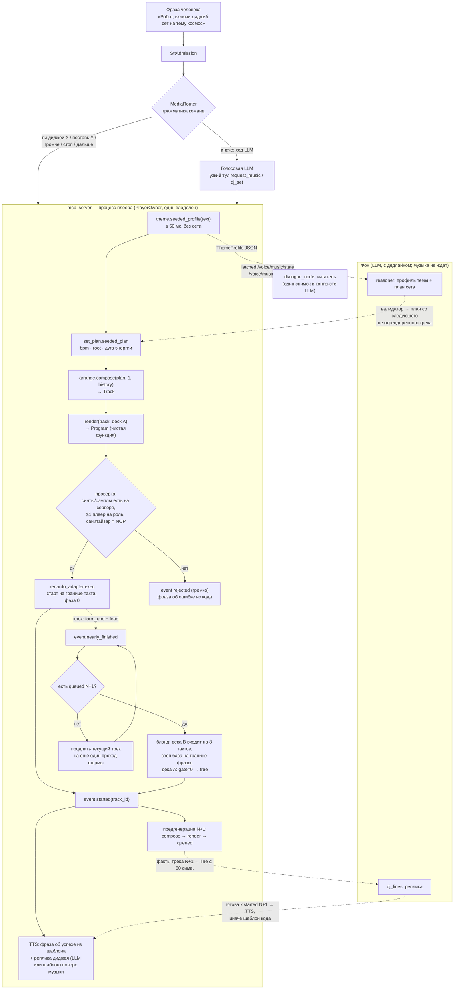

# ADR-0149: Новый аранжировщик и DJ-движок (`rob_box_music` v2) — модель трека, детерминированный плеер-владелец, LLM вне пути звука

| Поле | Значение |
|---|---|
| Статус | Proposed (на утверждение товарищу Шифу). Только дизайн и план поставки, код не меняется |
| Дата | 2026-10-01 |
| Автор | Claude Code (шисюн), по брифу товарища Шифу от 01.10 |
| Issue | эпик #3312; #3136, #3310, #3311, #3316, #3317 (ADR-0148) |
| Основание | `artifacts_live_check_2026-10-01/{lessons_music_dj.md, roast_architecture.md, roast_inventory.md, research_oss_arrangers.md, ref_dj_16k_profile.txt, runs/, runs_b/}` (вне git); код сверен на `origin/develop` @ `5359c0b54` |
| Родители | ADR-0148 (код решает, LLM говорит — обязателен), ADR-0141 (плеер владеет состоянием), ADR-0142 (переход по событию движка), ADR-0146 (разнообразие), ADR-0147 (энергетическая дуга), ADR-0132 (аранжировщик как инструмент), ADR-0133 (пространство микса по секциям), ADR-0145 (бюджет классов), ADR-AF-0013 (мелкие PR), ADR-0018 (честный FAIL) |
| Заменяет после приёмки | ADR-0142 §7–§10 (ризонер первого трека и свободный код — отложены, см. §11), ADR-0147 §3.4 (волна энергии — встроена в план сета, см. §4.6) |

---

## 0. Что проверено, что нет

- Прочитаны целиком все входные материалы брифа и ADR-0141/0142/0146/0147/0148, шапки ADR-0132/0133/0145/AF-0013.
- Каждое утверждение о старом коде с `file:line` в этом документе сверено `grep`-ом на `origin/develop` @ `5359c0b54` (худший случай — сдвиг на несколько строк относительно `lessons_music_dj.md`, который цитировал `4de174005`; расхождения в §0.1).
- Логи `runs/*.full.log` и сводка `runs/an_all.txt` прочитаны; записи `r*.wav` **не слушал** и заново не профилировал — числа замеров взяты из `lessons_music_dj.md` §5, `ref_dj_16k_profile.txt` и карточек #3310/#3311.
- **Ничего не запускалось** ни на роботе, ни локально. Всё про звук — гипотезы из кода и замеров 30.09–01.10, они помечены.
- Исходники renardo_lib на этой машине не открывал: утверждения о плеерах `d4..d6`/`p4..p6`, `Player.spread()`, `room2`, `Clock.swing` взяты из `research_oss_arrangers.md` и помечены «не проверено».

### 0.1 Расхождения входных материалов с кодом на `origin/develop` (верю коду)

| Утверждение в материалах | Что на `5359c0b54` | Следствие для дизайна |
|---|---|---|
| Бриф §2: «ADR-0013 incremental-delivery» | `docs/adr/0013-respeaker-dsp-tuning-mix-ch0.md` — про ReSpeaker; правило размера PR — `AF-0013-incremental-delivery-over-big-bang.md` (ADR-0145 §2 это уже заметил) | Ссылаюсь на ADR-AF-0013 |
| `lessons` §4, roast §0: `_club_call` в `dj_mode.py:1029-1055`, писатели `next_transition_at` `:397,675,698,941` | `_club_call` — `dj_mode.py:1104`; писатели — `dj_mode.py:467, 590 (сброс в 0), 745, 768, 1016`, `dialogue_node.py:7362`, `music_guard.py:802` плюс влитый 01.10 #3319 `dj_note_track_finished` (`dj_mode.py:84,110`) — **восемь** мест, а не шесть | Число подтверждает диагноз; в §8 строки по develop |
| `research` §0: «модуля `club_energy.py` нет» | `core/club_energy.py` есть (#3313, ADR-0147 шаг 1); `masterfilter.scd` слова `trim` не содержит (шаг 2 не влит), `_club_call` энергию не передаёт | ADR-0147 на роботе не активен; в новом движке энергия — поле плана, `trim` после динамики принимается (§4.6) |
| `research` §0 F10, `lessons` К7: стерео только амплитудной панорамой | `core/club_stereo.py` влит (#3314): `PAN_HATS=0.4` (`:48`), `PAN_PAD_WIDTH=0.6` (`:51`), `pan_steps` (`:62`), `pad_pan` (`:89`) — панорама, декорреляции нет | Совпадает с замером Side/Mid −11…−17 дБ; нужна декорреляция (§3.9) |
| roast §4: «флаг DJ в двух копиях» | `DJState.enabled` (`dj_mode.py:157`) и `mcp_server.py:639,787` «DJ watchdog» — подтверждено | Один флаг у владельца (§2.3) |
| ADR-0142 §5: `TrackSpec` в проде | `core/track_spec.py:96,157,285` и `core/track_reasoner.py` — импортируются только друг другом (`grep -rl track_spec` без тестов) — **шов без потребителя**, как и писал roast | Берём форму (dataclass + валидатор + генерируемая схема), не код |
| `lessons`/roast писались до PR #3319 (#3136, `TEMP(ADR-0148)`) | #3319 влит в `origin/develop` 01.10 (`5359c0b54`): `dj_note_track_finished` (`dj_mode.py:84`) и `club_repeat_requested` (`club_transition.py:232`) — страховка на старом пути | Допустима по ADR-0148 §2.2; в §8.2 она в списке на удаление вместе со старым путём |

---

## 1. Проблема (кратко; цифры — в ADR-0148 §1 и `roast_inventory.md`)

Товарищ Шифу слышит «какофонию», «тему, которая не легла», «перебивчивый ритм», «первая реплика есть, а музыки долго нет». Замеры 01.10 (5+5 сетов × 6 мин против живого диджея 58 мин @16 кГц) и каталог 189 issue / 175 PR сводят это к четырём устройствам, а не к багам:

1. **LLM копирует решения кода.** `dj_mode._club_call` (`dj_mode.py:1104`) собирает готовый `compose_music(...)`, `build_auto_prompt` (`:1280`) вклеивает его в промпт, LLM с thinking переписывает обратно: 14–88 с на переход, половина DJ-гардов ловит ошибки копирования (К4–К6 в `lessons`).
2. **У «играет» и у момента перехода нет владельца.** Восемь писателей `next_transition_at`, таймер не связан с концом звука → дыры тишины 90–138 с в 3 из 5 сетов (К1–К3).
3. **Музыка — строка FoxDot**, ~17 проходов генерации/санитизации/регекс-разбора; лид — блуждание 16 нот/такт (`club_arranger.py:291-318`), хук — 2 такта рингтона ×16 (`club_fragments.py:77`, `CHORD_BARS=2` `club_arranger.py:191`), бас — сплошные 16-е октавой (`:777`), пэд в основном виде без голосоведения (`:285-286`), сайдчейн — ступенька `amplify` (`:800,807`), динамику сжимают калибровка трека + выравниватель `lvlRatio 3` (`masterfilter.scd:106,143`) + компрессор (К7–К9).
4. **Приёмка по строке, а не по звуку**: sha256-снапшоты, ассерты на промпт, «влито, но не звучит» ×3 (К10, К17).

ADR-0148 §2.3 постановил строить новый пакет рядом со старым. Этот ADR — его дизайн.

---

## 2. Границы и модули

### 2.1 Принципы (из ADR-0148, применённые к музыке)

- **Музыка — данные.** `Track` — неизменяемая модель (§3). Звук получается одной чистой функцией `render(track, slot) -> Program`. Никакой постобработки строк: если санитайзер меняет хоть символ вывода рендера — это баг рендера, тест падает.
- **Один владелец состояния** — `PlayerOwner` в процессе `mcp_server` (там живёт Renardo, ADR-0141 §2, ADR-0142 §8.3 вариант А). Он один пишет `/voice/music/state` и `/voice/music/event`. Все остальные — читатели.
- **На пути звука нет LLM.** Фраза → роутер/узкий тул → план (seeded, мгновенно) → очередь → рендер → звук ≤ 3 с. LLM работает асинхронно над «вкусом» (план сета, выкрик) с дедлайном: опоздала — пропустили.
- **Одна таблица знания** — `rob_box_music.knowledge`: лады, тоники, синты и их свойства, регистры-коридоры, потолки уровней, каталог сэмплов, жанровые окна темпа. Остальные модули только импортируют.
- **Глубокие модули, узкие интерфейсы.** Четыре модуля с интерфейсом ≤ 5 публичных функций каждый (§2.2); бюджет ADR-0145 (WMC ≤ 80, методов ≤ 40) — без исключений для новых классов.

### 2.2 Пакеты и модули

```
src/rob_box_music/                       # НОВЫЙ пакет. Чистый Python: без ROS, без renardo, без сети.
  rob_box_music/
    knowledge.py        # одна таблица знания: SCALES, ROOTS, SYNTHS(traits, роль, потолок, хвост),
                        # REGISTERS (бас<пэд<лид≤88), LEVEL_CEILINGS, GENRE_WINDOWS (bpm, kick, лад),
                        # SAMPLE_CATALOG (длина в долях, bpm, роль, пик). Импортирует synth_traits/sample_dave.
    model.py            # Track, Section, Part, Grid, Harmony, Hook, Mix, Transition (frozen dataclasses) + валидатор
    theme.py            # ThemeProfile (структурный «вкус» темы) + seeded_profile(theme_text) без LLM
    set_plan.py         # SetPlan (bpm, root, дуга энергии, треки) + seeded_plan(profile, seed) + validate_plan(json)
    arrange/
      rhythm.py         # бочка/хэты/клэп/перкуссия: сетки 16 шагов × такт, акценты, свинг, fill-ы
      harmony.py        # прогрессия по секциям, голосоведение пэда, напряжение перед дропом
      hook.py           # мотив из RTTTL (4–8 тактов от начала) + развитие по секциям
      bass.py           # оффбит/3–4 ноты на такт, подход ≤ ½ доли, регистр
      lead.py           # ответ на хук, 3–6 нот на такт с паузами, вариация по секциям
      mix.py            # уровни ролей (дБ), панорама/ширина, сайдчейн-глубина, fx по секциям (ADR-0133)
      compose.py        # compose(plan, track_no, history) -> Track  (единственная точка сборки)
    render/
      renardo.py        # render(track, deck) -> Program (строка Renardo в ограниченном подмножестве) — ОДНА функция
      program.py        # Program: текст + метаданные (слоты, form_beats, synths, samples) — для проверки и лога
      events.py         # offline-симулятор Program → события нот (перенос renardo_events.py) для тестов поведения
    diversity.py        # weighted_pick + MusicHistory по всем осям (перенос music_diversity.py, ADR-0146)
    search.py           # поиск мелодии: структурный результат {found, confidence, alternatives} (обёртка rtttl_library)

src/rob_box_mcp_tools/rob_box_mcp_tools/engine/   # НОВЫЙ подпакет в процессе плеера (mcp_server)
    player_owner.py     # PlayerOwner: деки A/B, очередь, события, latched-снимок; ЕДИНСТВЕННЫЙ писатель состояния
    session.py          # SetSession: план, номер трека, история, предгенерация N+1, тайминг в долях
    renardo_adapter.py  # exec программы, Clock, колбэк _rbx_track_started, ramp gate=0 → /g_freeAll, /fail → track_id
    reasoner.py         # фоновые LLM-задачи: план сета (JSON по схеме), выкрик; дедлайн, circuit breaker
    tools_v2.py         # MCP-тулы: request_music, dj_set (узкие, §5.1)

src/rob_box_voice/rob_box_voice/core/
    media_router.py     # ОСТАЁТСЯ, расширяется: «ты диджей X», «поставь Y», громче/тише/стоп/дальше → engine без LLM
    music_player_state.py  # ОСТАЁТСЯ: контракт снимка (ADR-0141) + разбор /voice/music/event
    dj_mode.py          # после переключения: читатель снимка (персона/тема для реплик), ≤ 150 строк
```

Границы ответственности (кто что решает — таблица roast §1 в целевой форме):

| Решение | Владелец в v2 |
|---|---|
| Какой трек следующий (темп, тоника, каркас, хук, сэмпл, энергия) | `set_plan` + `arrange.compose` (код, детерминированно от `(set_seed, track_no, history)`) |
| Когда переход | `PlayerOwner` по событию `nearly_finished` (в долях клока) |
| Остановить ли сет / финал | `SetSession` (лимиты плана, явная команда) |
| Тема сета | роутер (из фразы) → `theme.seeded_profile` сразу; LLM уточняет профиль в фоне |
| Характер сета (темп, лад, тембры, хуки) | LLM **один раз**, структурно (`ThemeProfile` JSON), валидатор; иначе seeded |
| Выкрик на переходе | LLM асинхронно; озвучка только по `started`, если готов к дедлайну |
| Что сказать об успехе | код, шаблон из события (`started`/`rejected`) |
| Громче/тише/стоп/дальше/«что играет» | `MediaRouter` → `PlayerOwner`, без LLM; ответ из снимка |

### 2.3 Состояние, события, топики

**Один писатель — `PlayerOwner`.** Состояние: `{decks: {A, B}, current: Deck, queue: [Prepared], session: SetSession|None, fader}`.

Latched `/voice/music/state` (контракт ADR-0141, `music_player_state.py:45,76,101,127` сохраняется, расширяется только поле `dj`):

```json
{"state": "playing|idle", "track_id": "set42:03:A:9f1c2a0b", "form_ends_at": 1790858760.5,
 "stops_at": null, "finished_track_id": null, "ts": 1790858700.1,
 "dj": {"enabled": true, "set_id": "set42", "track_no": 3, "persona": "ДиДжей РОббокс",
        "theme": "космос", "bpm": 132, "root": "F#", "scale": "minor", "energy": 4,
        "title": "космос · трек 3", "hook": "spott_ci", "next_ready": true}}
```

`/voice/music/event` (RELIABLE, KEEP_LAST 10, не latched; ADR-0142 §3.1) — события только от владельца:

| Событие | Когда (источник — клок Renardo, не часы) | Поля |
|---|---|---|
| `queued` | трек N+1 отрендерен и проверен | `track_id`, `expected_previous` |
| `started` | колбэк `_rbx_track_started` внутри запланированной функции на доле старта (§4.3) | `track_id`, `clock_beat`, `phase_in_form` (должна быть 0), `bpm`, `deck` |
| `nearly_finished` | за `lead_beats` до `form_end_beat` текущего трека | `track_id`, `form_end_beat`, `lead_beats` |
| `finished` | конечный трек доиграл (`finish_form_if_ended`, `music.py:2365`) | `track_id` |
| `rejected` | рендер/сервер/ресурс отказали — **громко** (I25) | `track_id`, `reason`, `detail` |
| `idle` | плеер пуст, ≤ `stops_at + 1 с` | `last_track_id` |

Удаляются после переключения: `/voice/music/form` (`dialogue_node.py:1118,3367`), второй DJ-флаг в `MusicManager` (`mcp_server.py:639,787`), `DJState.next_transition_at` и все его писатели.

### 2.4 Поток «фраза → звук → следующий трек»



---

## 3. Модель музыки

### 3.1 Структура `Track` (frozen dataclasses, `rob_box_music/model.py`)

```python
@dataclass(frozen=True)
class Track:
    track_id: str                 # "<set_id>:<no>:<deck>:<sha8 модели>"
    seed: int
    bpm: int                      # = SetPlan.bpm; в треке своего темпа нет
    key: Key                      # root: 0..11, mode: ключ knowledge.SCALES
    form: Form                    # sections: tuple[Section], bars_total ∈ {32, 48, 64}; outro ≥ 8 тактов
    parts: Mapping[Role, Part]    # Role ∈ {kick, hats, clap, perc, bass, pad, lead, sample, fx}
    harmony: Harmony              # progression по секциям; voicings пэда уже «проведены»
    hook: Hook | None             # мотив: ноты (MIDI, доля, длительность, акцент), bars 4..8, source(melody_id|None)
    mix: Mix                      # level_db по ролям, pan/width по ролям, duck_depth, fx по секциям
    energy: int                   # 1..5, из плана сета (ADR-0147)
    transition_in: Transition     # phrase_bars, bass_swap_bar, filter_in
    transition_out: Transition
    history_key: HistoryKey       # что писать в music_history: каркас, прогрессия, хук, сэмпл, тоника

@dataclass(frozen=True)
class Section:   name: str; bars: int; energy: int (0..10); roles: frozenset[Role]; fill_last_bar: bool
@dataclass(frozen=True)
class Part:      role: Role; synth_or_sample: str; grid: Grid; pitches: tuple[PitchEvent, ...] | None; level_db: float; register: tuple[int, int]
@dataclass(frozen=True)
class Grid:      steps: tuple[Step, ...]   # 16 × bars; Step(on: bool, accent: 0..3, offset_ms: int)
```

Валидатор `validate_track(track) -> Track | TrackError(path, reason)`:
- все тональные партии транспонированы в `key` (I12), регистры в коридорах `knowledge.REGISTERS` бас < пэд < лид ≤ 88 (I13);
- каждая роль, заказанная секцией, имеет партию (I14); сумма пиков одновременно звучащих ролей ≤ потолка `knowledge.LEVEL_CEILINGS` (К7);
- длина каждой сетки делит такт (К9, #1739); `bars_total` кратен 8, outro ≥ 8;
- `bpm` равен темпу сета; длительности в долях, никаких секунд (I22).

**Длительности и уровни — разные типы** (К2, #3173): `Grid`/`PitchEvent` несут доли, `Mix` несёт дБ; регекс по списку чисел невозможен, потому что строк нет.

### 3.2 Одна функция рендера

`render(track: Track, deck: Deck) -> Program`. Детерминирована: одна модель → побайтно одна программа. Выход — Renardo-код в **ограниченном подмножестве** (альтернатива B, §11): только присваивания плеерам деки (`deck.A = d1 d2 d3 p1 p2 p3`, `deck.B = d4 d5 d6 p4 p5 p6` — **не проверено**, что Renardo создаёт `d4..p6`; если нет — слоты `a1..c3`, проверка в PR-2), `var/linvar` на амплитуду секций, `delay=[...]` для свинга, `pan=[...]`, `amplify=[...]` для акцентов × сайдчейн. `Clock.clear()` в сете **не вызывается никогда**, `Clock.bpm` ставится один раз на сет.

`Program` несёт метаданные: слоты, `form_beats`, список синтов и файлов сэмплов — `PlayerOwner` сверяет их с сервером и диском **до** exec (I15). `sanitize_renando` (`renardo_sanitizer.py:621`) вызывается в тесте как утверждение «ничего не изменил»; в проде v2 его нет.

Тест поведения: `render.events.program_events(program)` (перенос `renardo_events.py:178,244,278`) → события нот → свойства (тональность, регистры, сетка, роли, фаза 0). Снапшоты sha256 запрещены.

### 3.3 Хук из RTTTL-библиотеки и развитие по секциям

- `search.find(query) -> {found: bool, confidence, record, alternatives}` — обёртка над `rtttl_library.covers_tokens` (`:280`) и ранжированием; `found=false` — нормальный исход (I16).
- `hook.from_rtttl(record, key, bpm)`: берутся **первые 4–8 тактов мелодии** (а не случайное 2-тактовое окно, `club_fragments.py:77`), затакт — свойство мотива (I9, #2960), мелодия транспонируется в `key` (`rtttl_compose.detect_key` с тоническим центром сохраняется как библиотечная функция), регистр клампится в коридор лида. Мелодия короче 4 тактов → мотив = фраза + её ответ (транспозиция на V/IV), не ×32 (I22, #2965).
- `hook.develop(hook, section)` — детерминированные операции по секциям (research 4.4): intro — нет; build — только первые 2 такта мотива, октавой ниже, `lpf` закрыт; drop — полный; break — половинные длительности без ритм-секции; outro — нет. Развитие — часть модели, не гейт громкости.
- Темы нет → хук из пула профиля темы (`theme.hook_pool`), с штрафом за недавний (`diversity`, I17); хук-фрагмент записывается в `music_history.hook_fingerprint` (#3245).

### 3.4 Ритм

- Сетка 16 шагов × такт на роль, `accent 0..3` → `amplify` (сильные доли громче, гоуст-ноты тихо), `offset_ms` → `delay=` (свинг 5–10 % на чётных 16-х хэтов; глобальный `Clock.swing` не используется, чтобы не сдвигать сайдчейн относительно бочки — research 1.4).
- **Жанр решает бочку**: `knowledge.GENRE_WINDOWS[genre].kick` (club → `four_on_floor` по умолчанию); `by_design/breakbeat/half_time/outrun` — только если профиль темы их просит, а не по сиду (research F6, #3309).
- **Комплементарность — правило валидатора**: бас не на шагах бочки (оффбит/«и»), лид ≤ 6 нот на такт с ≥ 25 % пауз, хэты в оффбит при `four_on_floor` (research 4.1).
- Fill в последнем такте 8-тактовой фразы (`Section.fill_last_bar`): ролл клэпа 16-е/32-е, бочка снимается на 2 последних шага перед дропом; райзер — `noise` c `linvar` lpf 1–6 кГц (research 1.3, 4.6).

### 3.5 Бас

3–4 ноты на такт в оффбит, тоника/квинта/октава по аккорду; хроматический подход ≤ ½ доли (`harmonize._approach_note` переносится как функция, I12, #2839); регистр `[36, 52]` (`BASS_MIDI_FLOOR` из knowledge). Тембр: `acidbass`/`tb303`-класс с огибающей фильтра на каждой ноте для drop, `subbass`/`bass` для break (research 3.8). Сплошных 16-х октавой нет.

### 3.6 Пэд (голосоведение)

`harmony.voice_lead(prev_voicing, chord)`: из обращений выбирается то, где суммарное движение голосов минимально и общие звуки держатся (research 4.2); регистр `[50, 70]`, верх ниже лида на ≥ 3 полутона; в пред-дропе последний аккорд → V или sus4 (напряжение → разрешение, research 4.7). Два голоса с расстройкой ±1/8 полутона, разнесённые по каналам (§3.9).

### 3.7 Лид (мотив, не блуждание)

Лид = ответ хуку: когда хук звучит — лид молчит или держит один тон; когда хука нет — лид играет 3–5 нот из пула **4 нот** аккорда (research 1.1) с ритмом «вопрос 2 такта / ответ 2 такта», контур не переназначается под каждый аккорд. `lpf`/`sus` меняются по нотам (research 1.2). Регистр `[58, 84]`.

### 3.8 Сайдчейн

Огибающая, не ступенька. Два этапа:
- **S (без пересборки образа):** `amplify` списком по 16-м с формой `[0.3, 0.55, 0.8, 1.0]` после каждого удара бочки (атака мгновенная, подъём 3 шага ≈ 350 мс при 130 BPM) × акцентная сетка. Убирает провал «на всю ноту» (research F5).
- **M (пересборка):** `duck` в собственных SynthDef `rbx_bass`/`rbx_pad`: `1 - depth * EnvGen(Env.perc(0.005, 0.15 * beat_dur))` от `Impulse.kr(1/beat_dur)` (research 3.2); `depth` — поле `Mix.duck_depth`. Включается после замера A/B.

### 3.9 Стерео

Низ в центре (бочка, бас — `pan=0`). Ширина — от **декоррелированного материала**, не от панорамы (research 3.1, 3.4, 3.5):
- хэты/клэп — чередование `pan` по ударам (`club_stereo.pan_steps` переносится);
- пэд — два расстроенных голоса `pan=(-w, w)` (`Player.spread()`/`pshift` — **не проверено**, что есть в нашем renardo; иначе два плеера);
- реверб — стерео `room2`/FreeVerb2 (**не проверено**, грузится ли `crashFX`), иначе собственный `rbx_verb2.scd` в `custom_synthdefs/`;
- Haas 12–20 мс только на пэде/реверб-возврате.
Цель — I11: корреляция ≤ 0.6, Side/Mid 150–2000 Гц ≥ −6 дБ, |L−R| ≤ 1 дБ.

### 3.10 Динамика и мастер-шина — одна ось громкости

Слои, каждый с одним владельцем (К7):
1. уровни ролей внутри трека — `Mix.level_db` (калибровка `club_loudness.py:128-161` остаётся источником чисел);
2. энергия секции — состав ролей и фильтр (`Section.roles`, `Section.energy`), не гейн: брейк тише потому, что в нём нет бочки и баса;
3. энергия трека в сете — `trim` **после** динамики (ADR-0147 §3.2 принимается; `masterfilter.scd` получает `trim/trimLag`, сброс в 0 при `idle`);
4. фейдер пользователя `music_master_gain` — поверх;
5. лимитер — страховка пика (`masterfilter.scd:130` LPF от `SampleRate` сохраняется, #1739).

Выравниватель `lvlRatio 3` (`masterfilter.scd:106,143`) в DJ-режиме переводится в профиль `lvlRatio 1.5, lvlUp 8` (ADR-0147 §3.5), после шага 0 ADR-0147 (замер `dyn 0/1`) — это PR-7. Конфликт с #3154 («тихое пропадает») решает товарищ Шифу на слух (§12 В3).

### 3.11 Сэмплы

`knowledge.SAMPLE_CATALOG`: id, путь, длина в долях, исходный bpm, роль (`loop_perc`, `one_shot_fx`, `vox`, `break`), пик дБ (расширение `sample_dave.py:36,60`, `club_samples.py:72`). `arrange.compose` выбирает по роли и энергии секции со штрафом за недавний; `render` вписывает путь; `PlayerOwner` проверяет файл на диске и буфер на сервере до exec (I15). Лог каждого трека содержит список сэмплов → приёмка «охват» по логу (К10).

### 3.12 Переходы между треками

- Один темп на сет: `Clock.bpm` ставится при старте сета; изменение только по плану ≤ 4 BPM между соседями, разгон `linvar` за ≥ 16 тактов (I7, research 2.1).
- Фразовые: новый трек стартует на границе 8/16 тактов, с `phase_in_form = 0` (I9), за `transition_in.phrase_bars` (8) до `form_end_beat` старого.
- Блэнд на двух деках: входящий начинает с intro (хэты + пэд, `hpf` открывается `linvar`), на `bass_swap_bar` (граница фразы) бас уходящего снимается, бас входящего входит — два баса одновременно не звучат (research 2.3); бочка уходящего гаснет на том же такте; остальное уходящего — `lpf` 4000→300 за 4 такта, затем `gate=0` → `/g_freeAll` группы деки (перенос `_ramp_down_group`, `music.py:1466`). Ни одного окна −180 dBFS (I8).
- У каждого трека есть outro ≥ 8 тактов без лида (DJ-friendly, research 2.5), поэтому «нет следующего» = продлить outro или ещё проход формы, **не тишина** (I1).

### 3.13 Решения по топ-10 из `research_oss_arrangers.md` §5

| # | Приём | Решение | Где в модели | Почему |
|---|---|---|---|---|
| 1 | Лид с ритмом и паузами, 3–5 нот | **Принято** | §3.7 | прямое объяснение «тема не легла»/«какофония», цена S |
| 2 | Хук 4–8 тактов с развитием по секциям | **Принято** | §3.3 | тема → звук (I18); цена M |
| 3 | Бас в оффбит / 3–4 ноты | **Принято** | §3.5 | три тональных слоя на каждой 16-й — главный источник каши |
| 4 | Голосоведение пэда | **Принято** | §3.6 | чистый Python, S |
| 5 | Сайдчейн огибающей | **Принято в 2 этапа** | §3.8 | S-вариант без пересборки сразу; SynthDef — после A/B |
| 6 | Прямая бочка 4/4 по умолчанию в club, синкопы по теме | **Принято** | §3.4 | «перебивчивый ритм»; отдельно A/B на слух (#3309 не доказан) |
| 7 | Стерео: декоррелированный реверб + spread пэда + Haas | **Принято** | §3.9 | панорама (#3314) ширины эталона не дала: −11…−17 дБ Side/Mid |
| 8 | Темп держать весь сет, база 128–138 по теме | **Принято** | §3.12, §4.4 | I7; `dj_set_walk.bpm_walk` ±4 заменяется |
| 9 | Динамика секций не давится мастер-АРУ; 6–9 дБ брейк/дроп | **Принято с оговоркой** | §3.10 | профиль выравнивателя — только после замера `dyn 0/1` (ADR-0147 шаг 0) и решения Шифу по #3154 |
| 10 | Fills/райзеры + outro + фразовые переходы 16–32 такта; блэнд со свопом баса | **Принято**; блэнд — вторая дека | §3.4, §3.12 | L-часть (две деки) — PR-8, после подтверждения слотов `d4..p6` |

Отдельно из §1–§4 research: 1.5 `degrade` — **отклонено** (ломает детерминизм, I24; прореживание делается сидом в сетке); 1.9 MusicLang / 1.10 GrooVAE-модель — **отложено** (CPU Pi, не проверено); приём GrooVAE «таблица велосити/офсетов» — принято как `accent/offset_ms`; 3.3 supersaw — **отложено** до профилирования алиасинга на 16 кГц (ADR-0129-fuzz); 3.6 chorus — **отклонено** (по коду схлопывает в моно); 3.7 matchering — **принято как измерительный инструмент** офлайн (NRT), не в тракт; 2.4 типы переходов по энергии — принято как выбор пары «секция уходящего ↔ секция входящего» из плана (drop→drop на пике, break→intro на спаде); 2.6 Camelot — сохраняется (`dj_set_walk.related_root`, `:94`), хук в мажоре от III ступени — убирается транспонированием в `key` (§3.3).

---

## 4. DJ-движок

### 4.1 Очередь и деки

`PlayerOwner` держит две деки (A/B) и очередь `Prepared{track, program, expected_previous: track_id}`. Исполняется только артефакт, у которого `expected_previous` совпадает с текущим `track_id` (I4; Alexa `expectedPreviousToken`); остальные выбрасываются с `WARNING artifact_stale`.

### 4.2 Предгенерация

На `started(N)` немедленно `compose(plan, N+1, history) → render → проверки → queued(N+1)`. Стоимость — миллисекунды (чистый Python). Если план сменился (LLM уточнил профиль, человек сказал «жарче»), перегенерируются только ещё не исполненные артефакты.

### 4.3 Тайминг — в долях клока, от реального старта звука

- `renardo_adapter` планирует старт трека `Clock.schedule(_rbx_track_started, start_beat)` на абсолютную долю — границу фразы; колбэк внутри Renardo снимает фазу (`clock_phase_snapshot`, `clock_phase.py:35`), публикует `started` и запускает ramp уходящей деки. Это и есть «реальный старт звука»; `form_end_beat = start_beat + form_beats × passes`.
- `nearly_finished` — `Clock.schedule` на `form_end_beat − lead_beats`, `lead_beats = (phrase_bars + 1) × 4` (при 8 тактах и 132 BPM ≈ 16 с).
- `/voice/music/state.form_ends_at` — пересчёт долей в epoch только для наблюдателей.
- Дополнительно подтверждение сервера: после exec владелец ждёт `/n_go`/`/done` или сигнал на шине (`SendPeakRMS` в `masterfilter` — **не проверено**, есть ли; альтернатива — `/n_query` групп) ≤ 1 с; нет — `rejected` (I15, I25).

### 4.4 Один темп на сет

`SetPlan.bpm` — единственный темп; в треке его нет (валидатор). Темп из `knowledge.GENRE_WINDOWS[profile.genre]` (club 128–138; эталон медиана 138, робот сейчас 110–129). Смена только планом: ≤ 4 BPM между соседними треками, `Clock.bpm = linvar([old, new], ≥ 64 долей)`.

### 4.5 План сета — `SetPlan`

```jsonc
{ "set_id": "set42", "bpm": 132, "root": "F#", "scale": "minor", "genre": "club",
  "persona": "ДиДжей РОббокс", "theme": "космос", "max_minutes": 20,
  "tracks": [ { "no": 1, "energy": 2, "root_shift": 0, "template": "intro_32", "hook": null, "timbre": "dark", "kick": "four_on_floor", "passes": 1 },
              { "no": 2, "energy": 3, "root_shift": 7, "template": "build_32", "hook": "spott_ci", "timbre": "dark", "kick": "four_on_floor", "passes": 1 } ] }
```

Генерация: `seeded_plan(profile, seed)` мгновенно (волна энергии 2-3-4-5-4-2… из ADR-0147 §3.4 — дефолт); LLM в фоне возвращает уточнение по JSON-схеме, генерируемой из `knowledge` (`set_plan.schema()`), валидатор: `bpm/root` в окне жанра, `energy` 1..5, `hook` только из кандидатов, которых код показал (`search.find` по словам темы, ≤ 5), `kick`/`timbre` из перечислений. Невалидно → seeded, `WARNING plan_invalid{path}` без ретрая (ADR-0143: принудить tool call нельзя).

### 4.6 Энергетическая дуга (ADR-0147 — встроена, частично пересмотрена)

Принимается: энергия 1..5 на трек, `trim` после динамики, фейдер отдельно, правило сброса. Пересматривается: (а) энергия задаётся **планом сета** (seeded-волна — дефолт, LLM/«жарче» — переопределение), а не только функцией от номера; (б) плотность реализуется составом ролей в `Section.roles`, а не множителями к калиброванным уровням; (в) `club_energy.apply_energy` (`club_energy.py:114`) со старым путём удаляется, таблица `ENERGY_TRIM_DB` переезжает в `knowledge`.

### 4.7 Тема сета → материал

`ThemeProfile` (JSON по схеме): `genre` (перечисление из `GENRE_WINDOWS`), `bpm` (в окне жанра), `mode`, `timbre_family` (warm/bright/dark), `kick`, `mood` (3 слова), `hook_candidates` (≤ 3 id из выдачи `search.find`), `persona_line`. Seeded-профиль без LLM: закрытая таблица ключевых слов (`космос → dark/space-pad/120-128`, `детский праздник → bright/major/118-124`, `славянская вечеринка → major/pluck + hook из RU-алиасов`) + хеш темы; таблица — данные `knowledge`, а не регексы в гарде. Цель I18: > 50 % треков сета с хуком/темпом/тембром из профиля (сейчас 0/14).

### 4.8 Что делает LLM — и когда

| Задача | Форма | Когда | Дедлайн | Если опоздала/упала |
|---|---|---|---|---|
| Профиль темы + план сета | JSON по схеме (`submit_set_plan`) | фон, сразу после старта сета (превью уже звучит) | до `nearly_finished` трека 1 (≈ 45–60 с) | seeded-план играет дальше; уточнение применяется со следующего не отрендеренного трека, если пришло позже |
| Реплика на переходе | строка ≤ 80 символов (`submit_dj_line`; названия и числа — только подстановки `{hook}`/`{no}`/`{total}`/`{theme}`, факты — код, `dj_line`) | фон, на компоновке N+1 (до `queued`) | до `started(N+1)` | шаблон кода с теми же фактами, не тишина (§12 В2, решение 06.10) |
| Понимание нестандартной просьбы | узкий тул `request_music`/`dj_set` (§5.1) | ход человека, без thinking | — | роутер уже исполнил, что смог; LLM говорит только реплику |

Провайдер и кошелёк — решение Шифу (§12 В1; ADR-0142 §8.4 — thinking не измерен). Circuit breaker: 3 ошибки подряд → провайдер пропускается 10 мин, сет этого не замечает.

### 4.9 Старт сета, стоп, финал

- «Ты диджей X» / «включи диджей сет на тему X»: `MediaRouter` → `dj_set(start, theme)` → seeded-профиль → план → трек 1 → звук ≤ 3 с (I2). Реплика «Включаю сет про X» — из шаблона кода после `started`.
- Стоп — только явный стоп-глагол через роутер или `dj_set(stop)`; `PlayerOwner` делает outro текущего трека (≤ 8 тактов) и `idle`. Вопрос «ты остановил?» — вопрос, читается снимок (I19).
- Финал по `max_minutes`/`max_tracks`: последний трек получает `passes=1` и outro, после `finished` — прощание из шаблона; сет закрывается, `SetSession = None`, `trim = 0`, персона/тема/план не переживают сессию (I21).

---

## 5. Контракт с голосовым стеком

### 5.1 Узкие тулы вместо `compose_music` на 44 параметра

На `5359c0b54` в каталоге 66 тулов; `compose_music` и `preview_arrangement` — по 44 свойства, `set_dj_mode` — 10. В v2 LLM видит два тула (генерируются `tools/gen_tool_catalog.py`, схемы — из `knowledge`):

```jsonc
// request_music — «поставь что-то»
{ "intent": "track | melody | backing",            // backing = гасится после речи (политика трека, I20)
  "text": "слова человека дословно",               // не перефраз
  "mood": "calm | groove | dark | bright | epic | playful" | null,
  "genre": "club | lofi | synthwave | folk | classical | auto" }
// dj_set — «ты диджей»
{ "action": "start | stop | hotter | calmer | next | set_theme",
  "theme": "строка" | null, "persona": "строка" | null }
```

Параметры трека (bpm, root, synth, seed, repeat, transition, levels, drums…) LLM **не видит**: их вычисляет `theme`/`set_plan`/`compose`. Результат тула — `{ok, track_id, title, bpm, key}` или `{ok: false, reason}`; текст успеха LLM не сочиняет — код озвучивает шаблон по событию `started` (I5). Старые `compose_music`, `preview_arrangement`, `execute_music_code`, `set_dj_mode`, `set_music_volume`(LLM-вариант) из каталога, видимого LLM, убираются при переключении флага (операторские версии могут остаться `llm_visible=false`).

### 5.2 Как dialogue узнаёт о состоянии — один снимок

`dialogue_node` подписан на latched `/voice/music/state` (есть: ADR-0141) и на `/voice/music/event`. В контекст LLM уходит **один** блок `<music_state>` построенный из снимка (`core/music_state_prompt.py` переписывается на снимок; эвристика `beat` и reminder «не доверяй тегу» удаляются). Никаких `get_music_state`-напоминаний: состояние уже в контексте.

### 5.3 Гарды старого пути, которые становятся не нужны (удаляются вместе с ним)

| Гард/механизм | Где | Почему не нужен в v2 |
|---|---|---|
| Bug B DJ_RETRY, `_build_dj_retry_prompt`, `DJ_TURN_BUDGET_S`/`DJ_REASONING_BUDGET_S` | `dialogue_node.py:7238-7362`, `dj_mode.py:55,61` | на переходе нет хода LLM |
| `DJ_AUTO_FORBIDDEN_TOOLS`, `_NO_STOP_RULE`, `_FINAL_NO_RESTART_RULE`, `dj_final_turn` | `dj_mode.py:272-288,1362-1383` | LLM не вызывает тулы на переходе; финал — у `SetSession` |
| `bpm_is_request`, гейт `apply_set_character` | `dj_set_walk.py:211,254` | темп/характер — поле плана, LLM эхо писать некуда |
| `hurry_dj_set_start` | `music_guard.py:765-802` | звук через ≤ 3 с без LLM |
| `_played_line`, `note_turn_tools` (подстрока `[DJ_AUTO`) | `dj_mode.py:820,940` | разнообразие — `diversity` в коде; «ход сета» — событие, не подстрока |
| `MusicGuard` вердикты DJ_RETRY/FORCE_STOP/FALLBACK/NUDGE | `music_guard.py:116` | решения приняты кодом; остаётся только USER_RETRY для не-музыкальных случаев или удаляется с TurnGuards |
| `<music_state>` по эвристике + reminder | `core/music_state_prompt.py` | один снимок (§5.2) |
| Детекторы «я запустил» без тула (unbacked/universal/phantom, 10 `ActionClaimRule`), фолбэки `_publish_dj_fallback`, `_publish_music_fallback`, `_publish_music_retry_exhausted_fallback` | `dialogue_guards.py` (34 `re.compile`), `dialogue_node.py:8470,9577,7902` | фраза об успехе из кода; LLM-текст об успехе не озвучивается до события |
| `HALLUCINATED_MIDI_RE`, `_check_embedded_renardo_code_and_retry` | `dialogue_guards.py`, `dialogue_node.py` | LLM не пишет ни нот, ни кода |
| `TrackStartGuard.is_dj_turn`, счёт треков по именам тулов | `rob_box_voice/core/track_start_guard.py:225,247`, `dj_mode.py:940` | трек = событие `started` с `track_id` |
| «гард свежести музыки» на трёх гасителях (#3010, AF-0071), `_track_mode_music_active` как «играет» | `dialogue_node.py:3360,6828-6833,7662,9562` | гасит только явный стоп/`finished`/политика BACKING из `request_music.intent` |
| Санитайзер как исполнительный слой (`_cap_amp`, `_fix_pattern_length`, `_remap_illegal_slots`), `_club_ignored` | `renardo_sanitizer.py:403,501,561`, `music.py:4390` | модель + валидатор + одна функция рендера |
| Правила промпта `RULE #MUSIC`, `#MUSIC-STATE`, `#KNOWN-MELODY`, `composer.txt` (45 КБ), `skills/dj.txt` | `prompts/` | правила заменены схемами тулов и кодом |

Метрика прогресса (lessons К6): число `re.compile` в `dialogue_guards.py` (34) и `music_guard.py` должно **падать** в каждом PR миграции, где удаляется старый путь.

---

## 6. Трассировка уроков (`lessons_music_dj.md`)

### 6.1 Классы отказов

| Класс | Чем закрыт в дизайне |
|---|---|
| К1 состояние «играет» без владельца | `PlayerOwner` — один писатель, события с `track_id` (§2.3); политика BACKING/TRACK — поле запроса (§5.1); «играет» по именам тулов нигде не ставится |
| К2 тайминг/клок/форма | время только из модели (доли × bpm) и клока (§4.3); LLM секунд не передаёт; старт по `Clock.schedule` на границу фразы с фазой 0; длительности и уровни — разные типы (§3.1) |
| К3 переходы и тишина | очередь + предгенерация + `nearly_finished` (§4.1–4.3); нет следующего → продлить (§3.12); две деки, `gate=0 → free` после блэнда; пустой трек отвергается до exec (§3.2) |
| К4 LLM не вызвала тул / не тот | решения у кода; LLM — намерение из перечисления (§5.1); роутер до LLM (§2.4); на переходе LLM нет |
| К5 ложь об успехе | фраза из события `started`/`rejected` (§4.9, §5.1); LLM-реплика — только выкрик вне критического пути |
| К6 ложные гарды/ретраи | охраняемых решений нет → гарды удаляются (§5.3), метрика падения `re.compile` |
| К7 громкость/мастер/стерео | одна ось громкости с владельцами слоёв (§3.10); стерео в модели (§3.9); приёмка замером (§7) |
| К8 гармония/тональность/регистры/хуки | `key` и коридоры регистров — обязательные поля, валидатор транспонирует все партии (§3.1); хук 4–8 тактов с развитием (§3.3); голосоведение (§3.6) |
| К9 ритм и паттерны | сетка в модели с акцентами/офсетами, правило комплементарности, жанр решает бочку, fill-ы (§3.4); сайдчейн огибающей (§3.8) |
| К10 сэмплы/ресурсы | каталог с метаданными, проверка файла и буфера до exec, лог сэмплов на трек (§3.11) |
| К11 разнообразие/повторы | `diversity.weighted_pick` по всем осям (каркас, прогрессия, хук, сэмпл, тоника), персистентная история (§3.3, §3.11); полная модель в логе → воспроизводимость (I24) |
| К12 поиск мелодии по имени | `search.find` со структурным результатом и честным `found=false`; «не найдено» → пул профиля темы (§3.3); регресс — прогон по архиву (§7.3) |
| К13 тема сета/персона | `ThemeProfile` один раз при старте, план — объект сессии, сброс по `idle` (§4.5, §4.7, §4.9) |
| К14 задержка/мышление LLM | на пути звука нет LLM; превью = seeded-план; LLM в фоне с дедлайном (§4.8) |
| К15 строка кода/санитайзер/схема тула | модель данных + одна функция рендера, санитайзер только как тест-утверждение (§3.2); схема тула узкая (§5.1); одна таблица знания (§2.2) |
| К16 SynthDef/scsynth | подтверждение старта сервером, `/fail` привязан к `track_id`, палитра синтов читается с сервера через `music_stack_validation.load_confirmed_synths` (`:277`) (§4.3); SynthDef под 16 кГц (ADR-0129-fuzz, `.ar`-модуляторы) |
| К17 процесс/тесты | тесты на события модели (`render.events`), запрет sha256-снапшотов и ассертов на промпт (§3.2); приёмка — живая запись против эталона (§7); харнессы вне git вносятся в репо (PR-0) |

### 6.2 Инварианты 1–25

| # | Инвариант | Решение | Проверка |
|---|---|---|---|
| I1 | нет тишины > 5 с в DJ | очередь, предгенерация, «продлить, не замолчать», outro (§3.12, §4.1) | `compare.py --chunk 0.5`: ни одного окна < −50 dBFS длиннее 5 с |
| I2 | первый звук ≤ 3 с без LLM | роутер → seeded-план → exec (§2.4, §4.9) | лог: `🎤 STT` → `started` |
| I3 | конец трека — событие плеера | `finished`/`idle` ≤ `stops_at + 1 с` (§2.3) | `ros2 topic echo /voice/music/event` |
| I4 | один писатель момента перехода + токен | `nearly_finished`, `expected_previous` (§4.1, §4.3) | `grep -c next_transition_at src/` = 0 после миграции; `artifact_stale` только в сценарии смены трека |
| I5 | фраза успеха из результата | шаблон по `started` (§5.1) | лог: ноль фраз «играю/запустил» без `started` ≤ 2 с до них |
| I6 | одна фраза — ≤ 1 запуск | `request_music` идемпотентен по `turn_id`; авто-механизмов запуска нет | лог: `started` на одну `🎤 STT` ≤ 1 (кроме DJ-переходов) |
| I7 | один темп на сет | `SetPlan.bpm`, валидатор, `linvar` ≥ 64 долей (§4.4) | `compare.py` bpm по минутам: разброс ≤ 4 |
| I8 | стык без нуля/щелчка | блэнд на двух деках, `gate=0` → free (§3.12) | ни одного окна −180 dBFS ≥ 50 мс; crest на стыке в норме |
| I9 | старт с фазы 0 на границе такта | `Clock.schedule` + колбэк со снимком (§4.3) | лог `started.phase_in_form == 0` во всех треках |
| I10 | пик ≤ −7 dBFS @ gain 0.5; размах RMS ≥ 6 дБ в любом 6-мин окне; стили ≤ 3 дБ | одна ось громкости, `trim`, состав ролей по секциям, профиль выравнивателя (§3.10) | `compare.py` по минутам |
| I11 | корреляция ≤ 0.6; |L−R| ≤ 1 дБ; Side/Mid ≥ −6 дБ | декорреляция (§3.9) | `compare.py` (LR) + Side/Mid из `audit_wav.py` |
| I12 | тональность едина, подход ≤ ½ доли | валидатор транспонирует все партии; `key_fit` хука ≥ 0.6 к `key` (§3.1, §3.3) | тест на событиях нот; `key_fit` в логе спеки |
| I13 | регистры бас < пэд < лид ≤ 88 | коридоры в `knowledge`, валидатор (§3.1) | тест на событиях нот |
| I14 | роль звучит или честно отклонена | валидатор `Section.roles` → `Part`; `rejected` (§3.1, §2.3) | лог `rejected{reason}`; ноль `ok` с 0 плееров |
| I15 | ресурс подтверждён сервером | проверка синтов/буферов до exec, `/fail` → `track_id` (§4.3) | лог: каждый `/fail` имеет `track_id` |
| I16 | поиск честный | `search.find`, `found=false` (§3.3) | прогон `melody_quality_report.py` по архиву |
| I17 | нет повтора подряд | `diversity` по всем осям, история в БД (§3.3) | лог спек: каркас ≠ предыдущему; прогрессия ≤ 3/10 |
| I18 | тема доходит до звука > 50 % | `ThemeProfile` → план → compose (§4.7) | лог спеки: поле `source=theme` у хука/темпа/тембра |
| I19 | медиакоманды без LLM, с учётом состояния | `MediaRouter` → `PlayerOwner`, ответ из снимка (§2.2) | лог: 0 ходов LLM на «громче/стоп/дальше» |
| I20 | музыку не гасят побочные механизмы | гасит стоп / `finished` / политика BACKING (§4.9) | лог: каждая остановка несёт `reason ∈ {user_stop, finished, backing_policy}` |
| I21 | состояние сета не утекает | `SetSession` живёт до `idle`, сброс `trim`, персоны, плана (§4.9) | тест + лог второго сета |
| I22 | длина трека из формы, ни одной секунды от LLM | `Form` в тактах, схема тулов без времени (§3.1, §5.1) | схема тулов; тест валидатора |
| I23 | ровно 1 реплика DJ на переход (включая трек 1), рэп не режется, музыка не паузится и не глушится | `TransitionLines`: одна фраза по `started`, в потоке, через `speak_text`; речь человека — вне движка | лог `🗣️ [dj line] … source=llm|template` и `🔊 TTS` на каждом `started` |
| I24 | трек воспроизводим | полная `Track` в логе (JSON), `render` детерминирован (§3.2) | тест: `render(json→Track) == программа из лога` |
| I25 | отказ громкий | `rejected` + WARNING, тул отвечает `ok:false` (§2.3) | лог; ноль `ok:true` при `rejected` |

---

## 7. Приёмка (числа и способ замера)

Эталон — `ref_dj_16k_profile.txt` (живой сет 58 мин @16 кГц, медианы: RMS −24.7 dBFS, crest 15.7 дБ, LR 0.04, низ/середина/верх 0.65/0.32/0.01, bpm 138, онсеты 5.9/с). Метрики R («захват сетки 16-х») и «доля энергии вне лада» **критерием не являются** (бриф §3): у эталона R = 0.33, вне-лада 0.28 — хуже робота.

### 7.1 Серия на роботе

5 сетов × 6 мин с теми же темами, что в `runs/index.txt` («славянская вечеринка» ×2, «космос», «киберпанк», «детский праздник»), фразы инъекцией в `/voice/stt/result` (без пунктуации, с wake-словом), запись `jack_rec` цифрового выхода scsynth, `music_master_gain 0.5`. Задержки — от строки `🎤 STT`. Скрипты `compare.py`, `tracks.py`, `an_set.py`, `audit_wav.py`, `night_dj.sh` — вносятся в `scripts/music/live_dj/` в PR-0.

Серия A16 — те же 5 сетов, но темы = 5 случайных названий из RTTTL-архива; сид выбора публикуется вместе с результатом (`scripts/music/live_dj/runs_random.sh <каталог> [seed]`, выбор — `diversity.py --pick 5 --seed S`). Приёмка на пяти фиксированных темах заточена под них и не ловит одинаковый пэд/бочку/форму.

### 7.2 Критерии (все пять сетов, если не сказано иначе)

| # | Критерий | Порог | Сейчас (01.10) | Эталон | Как мерить |
|---|---|---|---|---|---|
| A1 | тишина подряд в DJ-режиме | ≤ 5 с (окно 0.5 с < −50 dBFS) | 90–138 с в 3/5 сетов; 120 с на старте | нет | `compare.py --chunk 0.5` |
| A2 | фраза → первый звук | p50 ≤ 3 с, p100 ≤ 6 с | 15–25 с; 62–93 с в 3/6 | — | лог `🎤 STT` → `started` |
| A3 | переход | 0 вызовов LLM на пути; старт на границе фразы; `phase_in_form = 0` | 14–88 с мышления | — | `grep -c "DJ_AUTO"` = 0; лог `started` |
| A4 | стык | ни одного окна −180 dBFS ≥ 50 мс; оба трека слышны ≥ 4 такта | 2.4 с нуля (#3166) | — | `audit_wav.py` на ±20 с вокруг `started` |
| A5 | один темп | разброс bpm по минутам внутри сета ≤ 4; темп в окне жанра (club 128–138) | 110–129, ±4 на трек | 130–140 | `compare.py` (оговорка: ищет 100–140) |
| A6 | размах RMS по минутам в любом 6-мин окне | ≥ 6 дБ | 0.3–3.4 дБ | 8.9 (p25 7.1) | `compare.py --chunk 60` |
| A7 | пик | ≤ −7 dBFS @ gain 0.5, 0 клипов | — | — | `audit_wav.py` |
| A8 | стерео | LR ≤ 0.6; |RMS L − RMS R| ≤ 1 дБ; Side/Mid 150–2000 Гц ≥ −6 дБ; бочка/бас по центру | 0.93–0.99; −11…−17 дБ | 0.04; ≈ −0.4 дБ | `compare.py`, `audit_wav.py` (Side/Mid) |
| A9 | баланс полос | низ 0.5–0.8 | 0.45–0.81 | 0.65 | `compare.py` |
| A10 | crest | 12–18 дБ (страховка от пересжатия) | не выписан | 15.7 | `compare.py` |
| A11 | тема → звук | > 50 % треков с хуком/темпом/тембром из профиля | 0/14 | — | лог спеки `source=theme` |
| A12 | охват ресурсов | ≥ 30 разных сэмплов Дэйва за 5 сетов; лупы и FX звучат (по логу и записи) | 7/123; 0/26; 0/13 | — | лог `Track.parts[sample]` + `tracks.py` |
| A13 | разнообразие | 0 повторов каркаса подряд; прогрессия ≤ 3/10; хук-фрагмент не повторяется подряд | 0/36 (каркас) | — | лог спек |
| A14 | честность | 0 фраз об успехе при `rejected`; 0 `ok:true` с 0 плееров | #3316 | — | лог |
| A15 | регресс поиска мелодий | `melody_quality_report.py` по всему архиву не хуже текущего | — | — | офлайн |
| A16 | разнообразие трека (**предложение до утверждения Шифу**) | по составу, 5 сетов на случайных мелодиях (25 треков): ≥ 3 разных синта пэда, ≥ 4 лида, ≥ 3 баса, ≥ 2 бочки, ≥ 2 формы; по звуку: медиана межтрекового расстояния (все пары, признаки в сигмах эталона) ≥ 90 % от эталона | состав: пэд 1, лид 2, бас 2, бочка 1, форма 1 (офлайн 25 треков, сид 20261005); звук: 75–82 % эталона (acc1005 82 %, thm1005 75 %) | расстояние эталона 1.32–1.34 (окна 64–71 с) | `scripts/music/live_dj/diversity.py` (`--offline N`, `--dir … --ref ref_dj_16k.wav`) |

### 7.3 Оценка товарища Шифу на слух (необходимое условие, не заменяется числами)

Слепой A/B по 6 парам на одних сидах (старый путь vs v2) по методике ADR-0142 §11: ключ sha256 публикуется до прослушивания; вопросы: «тема легла?», «какофония/перебивчивость?», «разгон–пик–спад слышны?», «переходы как у диджея?». Порог принятия (предложение): v2 лучше в ≥ 4/6 и ни одна пара не «сломана» (тишина, клип, не тот темп). Пороги A2 (3 с), A6 (6 дБ), A8 (Side/Mid −6), A11 (50 %) — мои предложения, не решения Шифу (так и в `lessons` §6).

---

## 8. Что сохранить из старого (file:line на `5359c0b54`) и что удалить

### 8.1 Сохранить (переносится в v2 как библиотечный код или интерфейс)

| Что | Где | Куда в v2 |
|---|---|---|
| Контракт latched-снимка, парсер старой строки | `rob_box_voice/core/music_player_state.py:45,55,76,101,127` | без изменений; `dj` расширяется |
| Закрытие сессии по концу формы, `_state_lock`, Timer на `stops_at` | `tools/music.py:2330,2366,476`; `mcp_server.py:435-438,1066,1081` | `engine/player_owner.py` (источник `finished`/`idle`) |
| Спуск `gate=0` → `/g_freeAll` | `tools/music.py:1467` | `engine/renardo_adapter.py` |
| Слушатель `/fail` | `tools/music.py:401-411,977-1094` | привязка к `track_id` |
| Честный статус music stack, подтверждённые синты из лога sclang | `rob_box_voice/core/music_stack_validation.py:57,66,134,178,277` | `knowledge` читает палитру с сервера |
| `weighted_pick`, `MusicHistory`, запись каркаса | `core/music_diversity.py:90,129`; `core/club_history.py:20,25,55` | `rob_box_music/diversity.py` (все оси) |
| Модель громкости по ролям и NRT-калибровка | `core/club_loudness.py:128,131,146,161`; `scripts/music/club_loudness_nrt.py` | `knowledge.LEVEL_CEILINGS`, `arrange/mix.py` |
| Лимитер, LPF от `SampleRate` | `custom_synthdefs/masterfilter.scd:106-107,130-131,143-146` | остаётся; добавляются `trim` и DJ-профиль |
| Офлайн-симулятор программы → события нот | `core/renardo_events.py:178,244,278` | `rob_box_music/render/events.py` |
| Роутер медиакоманд и мгновенное превью | `rob_box_voice/core/media_router.py:252,305,537`; `media_command_grammar.py:32` | расширяется на `dj_set`/`request_music` |
| Квинтовый ход тональности | `rob_box_voice/core/dj_set_walk.py:94,130` | `set_plan.root_shift` |
| Снимок фазы, расчёт фейда | `core/clock_phase.py:35`; `core/club_transition.py:111,168` | `engine/renardo_adapter.py`; `wrap_with_fade` (`:185`) заменяется блэндом |
| Форма «dataclass + валидатор + генерируемая схема» | `core/track_spec.py:96,157,285` | образец для `model.py`/`set_plan.py`; сам модуль удаляется (нет потребителей) |
| Таблица свойств синтов | `core/synth_traits.py:79,150` | `knowledge` |
| Каталог Дэйва и доставка на хост | `core/sample_dave.py:36,60,81`; `core/club_samples.py:72,141`; ADR-0125/0126 | `knowledge.SAMPLE_CATALOG` с метаданными |
| Панорама по ударам | `core/club_stereo.py:48,51,62,89` | `arrange/mix.py` |
| Таблица энергии | `core/club_energy.py:75-123` | `knowledge` (`trim`), остальное — состав ролей |
| Гармонизатор, RTTTL, транслит, поиск | `core/harmonize.py`, `core/rtttl_compose.py`, `core/rtttl_library.py:280`, `core/translit_ru.py` | импортируются как библиотека (10+ вшитых багов не переписывать) |
| Рисунки бочки как данные | `core/club_arranger.py:94-102` | `knowledge.KICK_PATTERNS` |
| 16 кГц/block size, fuzz | `docker/vision/scripts/supercollider/start_supercollider.sh:68,88,107`; ADR-0129-fuzz | как есть |
| Замерные харнессы | `tools/music_bench/*`, `scripts/music/*`; вне git `artifacts_live_check_2026-09-30/*.py` | PR-0 вносит внешние в `scripts/music/live_dj/` |

### 8.2 Удалить после переключения флага и приёмки

| Что | Где |
|---|---|
| Копирование вызова через LLM: `_club_call`, `build_auto_prompt`, бюджеты, правила | `dj_mode.py:55,61,272-288,1104,1280-1383` |
| `DJModeController.tick` и все писатели `next_transition_at` | `dj_mode.py:84-110 (#3319), 467,590,710-768,1016`; `dialogue_node.py:7362`; `music_guard.py:765-802`; `club_transition.py:232` `club_repeat_requested` (#3319) |
| `MusicGuard` DJ-ветки, `_apply_music_guard` | `music_guard.py:116`; `dialogue_node.py:7238` |
| `/voice/music/form`, `_on_music_form`, второй DJ-флаг | `dialogue_node.py:1118,3367`; `mcp_server.py:639,787` |
| `ComposeMusicTool` (44 параметра), `_execute_club`, `_club_ignored`, `preview_arrangement`, `SetDjModeTool`, `execute_music_code` для LLM | `tools/music.py:3471,4390,4506,7087` |
| Санитайзер как исполнительный слой | `core/renardo_sanitizer.py:403,501,561,621` (остаётся только в тесте «NOP») |
| `club_arranger.render_club/_kit`, `_walk`, `riff_indices`, `lead_notes`, `pad_voicing` (основной вид), `club_fragments`, `club_hook`, `club_transition.wrap_with_fade`, `club_energy.apply_energy` | `core/club_arranger.py:285-318,440-859`; `core/club_fragments.py`; `core/club_hook.py`; `core/club_transition.py:185`; `core/club_energy.py:114` |
| `arranger.py` как пайплайн (3295 строк) — остаётся только то, что импортирует v2 (бас-подход, потолок пэда); остальное — после переноса classic-формы (PR-10) | `core/arranger.py` |
| `track_spec.py`/`track_reasoner.py` (шов без потребителя) | `core/` |
| `<music_state>` по эвристике, `RULE #MUSIC*`, `composer.txt`, `skills/dj.txt` | `core/music_state_prompt.py`, `prompts/` |
| Детекторы и фолбэки К5/К6 (§5.3), sha256-снапшоты `test_club_hook.py:54-72`, тесты на текст промпта про музыку | `dialogue_guards.py`, `dialogue_node.py`, тесты |

---

## 9. Миграция (strangler): порядок PR

Флаг: ROS-параметр `music_engine: "v1" | "v2"` в `mcp_server` и `dialogue_node` (общий yaml `docker/vision/config/voice_assistant/*.yaml`; дубль `src/.../config` синхронизируется). `v1` — дефолт до приёмки; при `v2` старые тулы не регистрируются для LLM, `DJModeController.tick` не вызывается. Каждый PR ≤ ~600 изменённых строк (ADR-AF-0013), проходит `cc_budget.py`, `class_budget.py`, `seam_without_consumer.py` (новые топики/`_publish_*` сразу с потребителем или в allowlist с причиной), `cc_budget_refs.py`, `dialogue_skip_reasons.py`, `validate_adr_namespace.sh`. Ни один PR не правит старый путь, кроме удаления (ADR-0148 §2.2).

| PR | Что делает | Как проверяется | Что удаляет из старого |
|---|---|---|---|
| **PR-0** | этот ADR; харнессы `compare.py/tracks.py/an_set.py/audit_wav.py/night_dj.sh` → `scripts/music/live_dj/`; базовый прогон 5 сетов v1 сохраняется как `docs/music/baseline_2026-10-01.md` (числа из `runs/`) | гарды docs; скрипты запускаются на `ref_dj_16k.wav` (вывод в PR) | — |
| **PR-1** | пакет `rob_box_music`: `knowledge.py` (одна таблица, импорт `synth_traits`/`sample_dave`), `model.py` + валидатор, `render/events.py` (перенос `renardo_events`) | unit: 1000 случайных валидных `Track` проходят валидатор; невалидные дают `TrackError(path)`; `class_budget` без новых больших классов; `seam` чистый (пакет без ROS) | — |
| **PR-2** | `render/renardo.py`: `render(track, deck)`; 1 трек club (бочка 4/4, оффбит-бас, пэд с голосоведением, лид с паузами) | unit: `program_events` → тональность/регистры/комплементарность; `sanitize_renando(program) == program`; **робот** (`live_check_mcp_call.py`): 3 трека, `jack_rec` 60 с, `compare.py` — числа в PR; проверка слотов `d4..p6` (или `a1..c3`) | — |
| **PR-3** | `arrange/*` + `compose()`: хук из RTTTL 4–8 тактов с развитием, fill-ы, акценты/свинг, сайдчейн `amplify`-огибающей (S), сэмплы по роли; `diversity` по всем осям; `theme.seeded_profile`, `set_plan.seeded_plan` | unit на событиях; офлайн NRT-рендер 10 сидов → `tools/music_bench` (пик, crest, слои); робот: 5 треков разных тем — запись в PR | — |
| **PR-4** | `engine/player_owner.py` + `renardo_adapter.py`: одна дека, `Clock.schedule` на границу такта, колбэк `started` со снимком фазы, `/fail`→`track_id`, проверка синтов/буферов, `/voice/music/event`, latched `state.dj` | робот: 10 стартов, `phase_in_form=0` во всех, `rejected` при подложенном несуществующем синте (raw-лог) | — |
| **PR-5** | `engine/session.py`: очередь, предгенерация N+1, `nearly_finished`, «продлить, не замолчать», один темп; `tools_v2.dj_set(start/stop)` под флагом `v2` | **робот, сет 20 мин**: A1 (тишина ≤ 5 с), A3 (`DJ_AUTO` = 0), A5 (темп), `artifact_stale` только в сценарии смены | при `v2`: `tick` не вызывается |
| **PR-6** | `MediaRouter` → `dj_set`/`request_music`; `tools_v2.request_music`; фраза успеха из `started`; `<music_state>` из снимка | робот: 10 фраз «включи диджей сет…»/«поставь …», A2 ≤ 3 с, A14; лог TTS | при `v2`: `compose_music/preview/execute/set_dj_mode` не видны LLM; `music_state_prompt` эвристика |
| **PR-7** | динамика: `trim/trimLag` в `masterfilter.scd`, DJ-профиль выравнивателя; **шаг 0 ADR-0147** (`dyn 0/1`) как часть приёмки; энергия из плана | Build All Services (ручной); робот 5 сетов: A6 ≥ 6 дБ, A7, A10; вердикт Шифу по #3154 | `club_energy.apply_energy` |
| **PR-8** | вторая дека и блэнд со свопом баса; outro; `gate=0`→free после блэнда | робот: 10 переходов, A4; `tracks.py` показывает оба трека | `wrap_with_fade` |
| **PR-9** | стерео: `spread`/два голоса пэда, `rbx_verb2.scd` (или `room2`), Haas на пэде | Build All Services; робот: A8 (LR ≤ 0.6, Side/Mid ≥ −6) | `club_stereo` (перенесён) |
| **PR-10** | `reasoner.py`: `ThemeProfile`/`SetPlan` JSON по схеме в фоне, circuit breaker; выкрик под флагом (по умолчанию выкл) | робот 2 сета: `plan_outcome{ok|late|invalid}`, латентность p50/p95 по провайдеру (первый замер); A11 > 50 % | — |
| **PR-11** | classic-форма («поставь Калинку») в модели v2: `Form=song`, хук = вся мелодия по куплетам, аккомпанемент из `harmonize` | `melody_quality_report.py` по архиву не хуже v1; робот 5 мелодий | — |
| **PR-12** | приёмка §7 целиком (5 сетов + слепой A/B) → решение Шифу → `music_engine: v2` дефолт | все A1–A15 в PR с raw | — |
| **PR-13…15** | удаление старого пути по §8.2 тремя PR: (а) voice-гарды/промпты/`dj_mode`, (б) `tools/music.py` и `club_*`, (в) тесты и baseline-ы `cc_budget`/`class_budget`/`seam` | `re.compile` в `dialogue_guards.py` < 34 → цель ≤ 10; pytest -v полный; CI run_id | всё из §8.2 |

**Первый PR можно начать без дополнительных решений**: PR-0 и PR-1 не трогают рантайм и не зависят от открытых вопросов §12.

### 9.1 Риски и откат

| Риск | Смягчение | Откат |
|---|---|---|
| Renardo не создаёт `d4..p6`, спуск gate ломает хвосты | проверка в PR-2 на роботе; запасные слоты `a1..c3` | флаг `v1` |
| SynthDef-изменения требуют пересборки образа и ломают v1 | дефолты (`trim=0`, старый `lvlRatio`) сохраняют v1 побайтно; PR-7/9 — отдельно | откат образа (SHA-тег) |
| Фоновый LLM-клиент в процессе плеера | жёсткий таймаут, исключения не выходят, circuit breaker (ADR-0142 §8.2) | выключить `reasoner` параметром, сет играет seeded |
| `seam_without_consumer` на новых топиках/методах | событие и подписчик в одном PR; allowlist с причиной | — |
| `develop` force-push (память проекта) | каждый PR от свежего `origin/develop`, merge-base сверяется перед `gh pr create` | — |
| Диск/CPU Pi при NRT-рендере | NRT — только офлайн на katana, не на роботе | — |
| Деградация облака (кончились деньги) | музыка не ждёт LLM по построению | — |

---

## 10. Последствия

- Уходят: LLM из DJ-перехода и из параметров трека, семь писателей таймера, второй DJ-флаг, `/voice/music/form`, санитайзер как исполнитель, ~40 механизмов постобработки в части музыки, 44-параметровая схема, `composer.txt`.
- Появляются: пакет `rob_box_music` (чистый, тестируется на событиях нот), `engine/` в процессе плеера, два узких тула, события плеера, один снимок.
- Качество и латентность разделены: звук ≤ 3 с всегда из seeded-пути; «вкус» — из профиля LLM, когда она успела.
- Скорость «закрыть баг за час» на старом пути падает до нуля — мораторий ADR-0148; на новом — баги чинятся в модели и валидаторе, а не в гардах.

---

## 11. Альтернативы

| Вариант | Суть | + | − | Вердикт |
|---|---|---|---|---|
| **A. Оставить Renardo-строки, латать по месту** (ADR-0148 §4 «продолжать латать») | `club_arranger` + санитайзер + гарды, LLM в переходе | ноль переписывания | сентябрь: fix:feat 3:1, `dialogue_guards` ×2.7, тишина 90–138 с; ничто из К1–К17 структурно не закрывается | **отклонено** |
| **B. Модель данных → одна функция рендера в ограниченное подмножество Renardo** (этот ADR) | Renardo остаётся инструментом (SynthDef, сэмплы, TempoClock), строка — артефакт рендера, без санитайзера | все SynthDef/буферы/клок уже работают на роботе; `program_events` даёт тест на поведение; стоимость M/L без правки sclang | ограничено тем, что умеет Renardo-плеер (огибающие `.kr`, `var`); две деки зависят от слотов (не проверено) | **выбран** |
| **C. Рендер мимо Renardo** — свой планировщик в Python (OSC-бандлы с таймстемпами `/s_new` в scsynth) или `Pbind` в sclang | полный контроль фазы, сайдчейна, деков; нет FoxDot-ограничений | переписать клок, латентность, буферы сэмплов, все SynthDef-аргументы; `/g_freeAll`/хвосты/`Clock.latency` заново; потеря `program_events`; L–XL и новый класс багов в самом низу стека на 16 кГц с block 1024 (`.kr` 15.6 Гц, #3114). Оценка: 3–4 недели до паритета | **отложено**: оставить как путь эскалации, если B упрётся в слоты/огибающие (решение после PR-2/PR-8) |
| **D. LLM пишет спеку/код трека каждый раз** (ADR-0142 §7, §10; сабагент-композитор июня) | максимальный «вкус» | латентность 14–115 с, MiniMax игнорирует `tool_choice` (ADR-0143), валидатор свободного кода — ещё один санитайзер; сабагент провалился (ADR-0142 §9) | **отклонено** для пути звука; план сета структурно в фоне — принято (§4.8) |
| **E. Отдельная ROS-нода `music_engine`** вместо подпакета в `mcp_server` | изоляция падений | ещё одна копия состояния и IPC с клоком Renardo, который живёт в `mcp_server` (ADR-0142 §8.3 Б) | **отклонено** на этом шаге |

---

## 12. Открытые вопросы для товарища Шифу

- **В1. Провайдер и кошелёк фонового LLM** (профиль темы/план сета): MiMo/DeepSeek с thinking, MiniMax (общий кошелёк с голосом) или новый? Бюджет на сет? (ADR-0142 В1 без ответа.)
  **Решение Шифу 01.10:** MiniMax (уже есть, общий кошелёк с голосом); бюджет на сет — замерить в PR-10.
- **В2. Выкрик на переходе**: тишина (по умолчанию) или `hype_line` ≤ 60 символов от LLM под флагом?
  **Решение Шифу 01.10:** по умолчанию тишина; выкрик `hype_line` — под флагом, выключен.
  **Решение Шифу 06.10 (заменяет 01.10):** реплика диджея на **каждом** переходе, включая первый трек, включена по
  умолчанию (`music_v2_dj_lines: true`; старый `music_v2_hype_line` — выкрик один раз за сет — удалён). Музыка не
  ставится на паузу и не приглушается: фраза уходит в TTS поверх сета. Факты (номер/всего, тема, человеческое
  название хука трека, фаза дуги: подъём/кульминация/спад/финальный трек) строит код из плана
  (`rob_box_music.dj_line`); LLM ризонера (MiniMax, тот же клиент и circuit breaker) только раскрашивает, в фоне,
  и пишет названия и числа лишь подстановками — цифра или известное название буквами отвергаются валидатором.
  Не успела/упала/невалидно — шаблон кода с теми же фактами (вариант по сиду трека, без повтора подряд).
- **В3. Динамика vs #3154**: разрешить DJ-профиль выравнивателя (`lvlRatio 1.5`), если после замера `dyn 0/1` брейки «пропадают» в мастерской? Порог A6 = 6 дБ принять?
  **Решение Шифу 01.10:** порог A6 = 6 дБ принят как стартовый; DJ-профиль выравнивателя — по результатам замера `dyn 0/1` в PR-7.
- **В4. Пороги A2 (3 с), A8 (Side/Mid ≥ −6 дБ), A11 (> 50 %), правило слепого теста ≥ 4/6** — утвердить или изменить.
  **Решение Шифу 01.10:** пороги A2/A8/A11 и правило слепого A/B ≥ 4/6 — утверждены.
- **В5. Classic-путь («поставь Калинку»)**: переносить в v2 (PR-11) до переключения дефолта или переключить DJ/club раньше, оставив classic на v1 до PR-11? (Второе быстрее даёт результат на сцене, но два пути живут дольше.)
  **Решение Шифу 01.10:** сначала DJ/club на v2, classic остаётся на v1 до PR-11.
- **В6. Жанровое окно club**: 128–138 (по эталону) — или оставить 120–128 (нынешние сеты), пока не услышаны?
  **Решение Шифу 01.10:** 128–138 (по эталону живого диджея ~138).
- **В7. Эскалация на вариант C** (мимо Renardo): кто решает и по какому признаку — предлагаю «после PR-8, если блэнд на двух деках не держит фазу или щёлкает».
  **Решение Шифу 01.10:** решает Шифу по замерам после PR-8.
- **В8. Страховки `TEMP(ADR-0148)` на старом пути** (влитый #3319 и подобные): допускать ли новые до переключения флага, или с этого ADR старый путь заморожен полностью (кроме удаления)?
  **Решение Шифу 01.10:** новые `TEMP(ADR-0148)` на старом пути — только если робот молчит или врёт; иначе старый путь заморожен (кроме удаления).

---

## 13. Что не проверено

- Ничего не запускалось и не слушалось; все оценки эффекта музыкальных решений — из research и замеров 30.09–01.10.
- Renardo: наличие плееров `d4..d6/p4..p6`, `Player.spread()`/`pshift`, эффект `room2`, поведение `Clock.schedule` на абсолютную долю без `Clock.clear` между треками, вызов Python-колбэка из запланированной функции — по `research_oss_arrangers.md`, на роботе не проверено (PR-2/PR-4/PR-8).
- `SendPeakRMS`/`/n_query` как подтверждение «есть сигнал» — не сверено с `masterfilter.scd`.
- Латентность thinking у провайдеров не измерена (ADR-0142 §13) — дедлайны §4.8 стартовые.
- Числа «сейчас» в §7.2 — из `lessons` §5 и карточек #3310/#3311/#3312 (develop `2882c26`/`aad6c18`), а не из моего профилирования `runs_b`.
