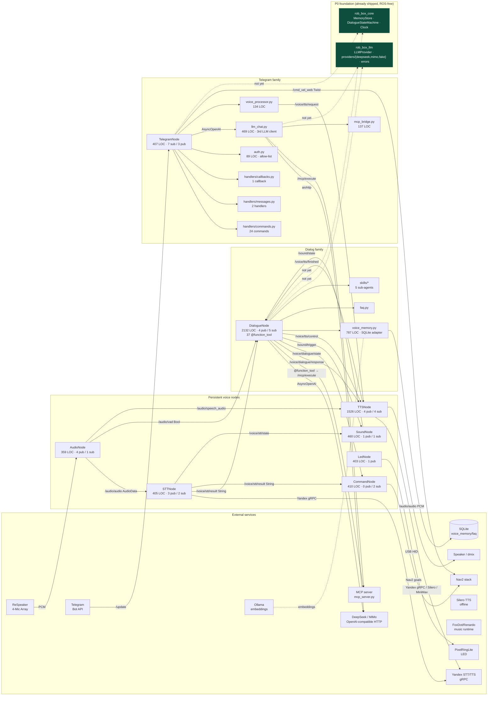

# Cross-node analysis: Dialog · Persistent · Telegram

**Project:** rob_box_project (`krikz/rob_box_project`)
**Document type:** Cross-cutting synthesis (companion to `docs/analysis/nodes-current-state.md`, ADR-0001, `docs/refactoring-plan.md`)
**Branch:** `feature/harness-p0-foundation`
**Date:** 2026-07-21
**Author:** architect (Hermes Agent) — Kanban task `t_727dda4a`
**Inputs synthesised:**
- Section «Dialog node» (Kanban `t_68320479`, commit `9a2049ab` on `feature/analysis-telegram-node`)
- Section «Persistent node» (Kanban `t_a7d7148a`, cherry-pick `bd995155` → `f61223a3`)
- Section «Telegram node» (Kanban `t_ec6e0963`, commit `55b266ee` on `feature/analysis-telegram-node`)
- Current code reading pass on `feature/harness-p0-foundation` (`6ca501d8`)
- `docs/analysis/nodes-current-state.md` (892 LOC, frozen baseline from `feat/analysis-nodes-refactor`)

> **Scope.** This document is the *cross-cutting* view that three per-family
> analyses (Dialog / Persistent / Telegram) point at. It answers five questions
> in the order they appear in the original brief:
> (1) one-line comparison table; (2) cross-cutting code smells;
> (3) Mermaid diagram of how the three families interact with the surrounding
> world; (4) explicit list of barriers that prevent building quality agent
> harnesses today; (5) consolidated code-smell index with `file:line` links.
> Detailed per-family deep-dives live in the three upstream sections and in
> `docs/analysis/nodes-current-state.md`.

---

## 1. Comparative table — Dialog / Persistent / Telegram

| Aspect | Dialog | Persistent (voice) | Persistent (perception) | Telegram |
|---|---|---|---|---|
| **Central file** | `src/rob_box_voice/rob_box_voice/dialogue_node.py` (2132 LOC) | `audio_node.py` (359), `stt_node.py` (405), `tts_node.py` (1526), `sound_node.py` (460), `led_node.py` (403), `command_node.py` (410) — sum 3563 LOC | (not present in this branch snapshot; `nodes-current-state.md` §4 mentions `reflection_node` + `context_aggregator_node`, 1643 LOC sum) | `telegram_node.py` (407) + `handlers/commands.py` (534) + `handlers/messages.py` (199) + `handlers/callbacks.py` (165) + `llm_chat.py` (469) + `mcp_bridge.py` (137) + `voice_processor.py` (134) + `auth.py` (89) — sum 2134 LOC |
| **Role** | Wake-word + STT → LLM tool-calling → TTS pipeline; owns the dialogue state machine | Sensor/actuator nodes that run every turn: audio capture, STT, TTS, sound cues, LED ring, voice command dispatch | LLM-driven post-turn scoring + multi-modal context fusion (deferred to a later branch) | Telegram bot ↔ ROS 2 gateway: 24 commands + 2 message handlers + 1 callback dispatcher |
| **Public ROS interface (sub / pub)** | 5 sub (`/voice/stt/result`, `/audio/vad`, `/voice/tts/control`, `/voice/tts/finished`, `/voice/sound/state`) + 4 pub (`/voice/dialogue/response`, `/voice/dialogue/state`, `/sound/trigger`, `/voice/tts/control`) + 37 `@function_tool` wrappers around MCP ROS topics + ROS-параметры (`provider`, `api_key`, `base_url`, `model`, `temperature`, …) | per-node: audio 4 pub / 1 sub; stt 3 pub / 2 sub; tts 4 pub / 4 sub; sound 1 pub / 1 sub; led 1 pub / 0 sub; command 0 pub / 2 sub | n/a in this branch | 7 sub (camera front/depth/up, `/map`, MCP result + tools, mcp/discovery) + 3 pub (`/voice/tts/request`, `/cmd_vel_web`, `/mcp/execute`) + 24 Command + 2 Message + 1 Callback handlers |
| **Internal modules** | `_build_agent`, `_build_function_tools`, `_mcp_call`, `voice_memory`, `faq`, `skills/*` (5 sub-agents), DJ-mode loop | mostly flat `__init__` → publishers/subscribers → one `_callback`; tts_node has multi-backend factory (Yandex, Silero, MiniMax) | n/a | `telegram_node` thin wrapper; logic split across `handlers/{commands,messages,callbacks}.py`, `llm_chat.py` (LLM client), `mcp_bridge.py` (tool executor), `voice_processor.py` (TTS bridge), `auth.py` (allow-list) |
| **External services** | OpenAI-compatible HTTP (DeepSeek, MiMo via `AsyncOpenAI` at `dialogue_node.py:582`); MCP server (`mcp_server.py`); SQLite (`voice_memory/faq`) | Yandex STT/TTS gRPC (`tts_node.py`), Silero offline TTS, ALSA / ReSpeaker, USB HID (LED), FoxDot music runtime | n/a | python-telegram-bot (asyncio loop) ↔ Telegram Bot API, OpenAI-compatible HTTP, MCP server |
| **Shared infrastructure** | `rob_box_core` (P0 ports — `MemoryStore`, `DialogueStateMachine`, `Clock`), `rob_box_llm` (P0 — `LLMProvider` ABC + `deepseek`/`mimo`/`fake` providers + typed `errors`) | uses ROS clock + a few `rob_box_core` utilities (no LLM/Memory ports yet) | n/a | uses `rob_box_llm.errors` and `rob_box_core.memory` indirectly via shared infra only (LLM access is direct via `llm_chat.py`) |
| **Test coverage (measured)** | **13.4 %** on `dialogue_node.py` (179/1331 stmts; P0 foundation reports 93 % on the same suite — dialog itself is the gap) | ~30–60 % estimate from reports; individual runs not measurable in this sandbox for `tts_node.py` | not measurable (rclpy missing) | **~4 %** measured; `telegram_node.py` itself is 0 %, handlers are pure helpers and have better coverage on paper |
| **Source of duplication (cross-cutting)** | owns its own `AsyncOpenAI` client + LLM provider table (`PROVIDERS` at `dialogue_node.py:81`) + voice memory + tool registry | each persistent node re-implements `declare_parameter` boilerplate without a typed schema | n/a | re-implements LLM client in `llm_chat.py:90` (`PROVIDERS` table, `tool_choice` field) — third LLM client overall |

> **Reading the table.** The three families share a contract — every voice turn
> flows *audio → STT → dialog → TTS*, every Telegram turn flows *text → LLM →
> MCP/TTS/cmd_vel* — but they share **no code**: each family has its own LLM
> client, its own tool-execution path, and its own parameter-validation style.
> This is exactly the duplication §7 calls out and §8 budgets against.

---

## 2. Cross-cutting code smells

The three per-family sections enumerate D1–D17, P1–P14, T1–T35 (Dialog,
Persistent, Telegram). This section groups them by **kind of smell** rather
than by family, so that the next planning round can prioritise one class at a
time.

### 2.1 Duplication between nodes (the single largest smell)

| ID | Description | Sites | file:line evidence |
|---|---|---|---|
| **D1 / X-1** | LLM client instantiated three times | `dialogue_node.py`, `llm_chat.py`, `rob_box_llm/providers/*` | `dialogue_node.py:81` (`PROVIDERS`), `dialogue_node.py:582` (`AsyncOpenAI(...)`), `llm_chat.py:90` (`PROVIDERS`) |
| **D2 / T2 / X-1** | Two `PROVIDERS` tables differ only in `tool_choice` field | `dialogue_node.PROVIDERS`, `LLMChat.PROVIDERS` | `dialogue_node.py:81-94` vs `llm_chat.py:90-103` |
| **P3 / T11 / X-2** | Tool execution re-implemented twice + a third port in P0 plan | `mcp_bridge.py` (sequential, async), `mcp_tools/llm_adapter.py` (parallel + cancellation), planned `ToolExecutor` port | `telegram/mcp_bridge.py` (whole file, 137 LOC), `mcp_tools/llm_adapter.py` |
| **P1** | Persistent nodes each re-do `declare_parameter` boilerplate | `audio_node.py:54-78`, `stt_node.py:35-111`, `tts_node.py:163-320`, `sound_node.py:48-110`, `led_node.py`, `command_node.py` | grep `declare_parameter` returns ≥ 5 sites with no shared schema |

### 2.2 Common antipatterns

| ID | Description | Where it appears |
|---|---|---|
| **D3 / T29** | `except Exception` swallowing typed errors | `dialogue_node.py` (22 sites — grep), `telegram_node.py:1 site` (now mostly cleaned) |
| **D4 / T3 / P2** | Side-effects (TTS publish, sound publish, cmd_vel publish, MCP call, voice/music) called inline; no `SideEffectBus` | every persistent node + dialog + telegram (see ADR §2.6) |
| **D6 / T15-T16** | Two keyboard layouts coexisting in telegram (`InlineKeyboardMarkup` + custom reply keyboard); flow drifts between `commands.py` and `callbacks.py` | `keyboard_layouts.py`, `handlers/commands.py`, `handlers/callbacks.py` |
| **D14 / T9** | Soft `try/except ImportError` for `_VoiceMemory`, `_FAQStore`, optional `skills` — declared dependencies are not declared | `dialogue_node.py` (~10 sites around imports) |
| **T1 / T2 / T3** | `_run_telegram_loop` permanent restart on transient errors, missing circuit breaker / max-retry | `telegram_node.py:300-321` |
| **T26-T27** | `voice_processor` swallows `None` `tool_calls` and adds silent retry loops | `voice_processor.py` (whole file, 134 LOC) |
| **T29** | Auth allow-list read once at startup; mid-session changes to the allow-list do not propagate | `auth.py` (89 LOC) |
| **T34** | `keyboard_layouts.py` constants duplicated inline in handlers (DRY violation) | `handlers/commands.py`, `keyboard_layouts.py` |

### 2.3 Missing common contracts

| ID | Missing contract | Concrete impact |
|---|---|---|
| **C-1** | No shared `LLMProvider` injection in dialog/telegram (P0 port exists, not wired) | impossible to swap provider per-test; impossible to add MiniMax without patching three sites |
| **C-2** | No shared `ToolExecutor` port | two implementations diverge in sync/async semantics; race risk in `LLMToolCallAdapter.execute_tool_call_sync` (ADR §1.2 D3) |
| **C-3** | No shared `MemoryStore` between dialog and telegram (P0 port exists, not wired) | telegram user and voice user see different `voice_memory` contexts |
| **C-4** | No shared `DialogueStateMachine` between dialog and P0 core (`core/dialogue_state.py`) — FSM semantics already drift (§7.4 of baseline) | wire format stays compatible; runtime semantics diverge silently |
| **C-5** | No shared `Clock` — only `rclpy.clock.Clock` is used | testable timers require monkey-patching; replay impossible |
| **C-6** | No shared `SideEffectBus` (ADR §2.6) | tests cannot swap in `NoopBus` / `RecordingBus`; replays are not possible |
| **C-7** | No shared typed config schema (`pydantic-settings`) | missing API keys surface at first LLM call, not at startup |

### 2.4 Extensibility problems

- **D7** Adding a new LLM provider today requires patching three sites (`dialogue_node.PROVIDERS`, `llm_chat.PROVIDERS`, new subclass in `rob_box_llm/providers/`); should be a single registration call against `LLMProvider`.
- **D11** Adding a new MCP tool today requires editing `dialogue_node._build_function_tools`; should be a `ToolRegistry` registration.
- **T4** Adding a new Telegram command today requires editing `handlers/commands.py` (now 534 LOC) by hand; the planned `TelegramCommandRegistry` would make it declarative.
- **P5** Adding a new persistent node today copies ~80 lines of `declare_parameter` / publisher boilerplate; the planned `PersistentHarness` would let each node declare only its schema.
- **D12** No plugin loader for optional `skills/*` sub-agents; they are imported by side-effect.

---

## 3. Mermaid — interaction of the three families with each other and with the environment

**Legend.** Solid arrows = ROS 2 topics or direct calls that exist in production
today. Dashed arrows = the P0 foundation ports exist (`rob_box_core`,
`rob_box_llm`) but no production consumer is wired to them yet (see
`nodes-current-state.md` §6). The `CORE` and `LLM` nodes are highlighted
in green via `classDef shipped` to mark "shipped, ROS-free".

**Bus topology.** `/voice/stt/result` is the only topic with **two**
subscribers (`DialogueNode` and `CommandNode`) — the documented race in
`nodes-current-state.md` §7.3. `/voice/tts/control` is published by three
sites (dialog, audio, STT) and consumed by `TTSNode` — another implicit bus
contract with no schema. The MCP request/response topic
(`/mcp/execute` + `/mcp/result`) is shared between dialog and telegram without
a coordinating dispatcher.

---

## 4. Barriers for agent harnesses

This is the section the upstream per-family analyses do not have. It enumerates
the *system-level* obstacles that block the path from "code that runs" to
"code that can be put inside a quality harness for an agent scenario". Each
barrier is named, mapped to a concrete observation in the source, and linked
to the refactor item in `nodes-current-state.md` §8 that would remove it.

### 4.1 No executable contracts between layers

- **Barrier.** All three families cross the LLM/Tool/Memory/Clock boundary by
  reaching into module-level globals (`voice_memory._conn`, `PROVIDERS` dicts,
  `AsyncOpenAI` instantiated at import time). There is no way to inject a
  fake.
- **Where it hurts.**
  - `dialogue_node.py:582` — `openai_client = AsyncOpenAI(...)` inside a method,
    captured by closure; replacement requires patching the running method.
  - `llm_chat.py:90` — same pattern, second site.
  - `voice_memory.py` — module-level SQLite handle; no constructor injection.
- **Fix.** Wire `LLMProvider`, `MemoryStore`, `Clock` from P0 into the three
  constructors. Item **X-1** (LLMProvider), **DLG-4** (MemoryStore),
  **C-5** (Clock).

### 4.2 Side-effects are not isolated

- **Barrier.** Every agent scenario eventually needs to "say something",
  "move", "trigger a sound", "call MCP". Today each of these is a direct
  call into another ROS publisher or an HTTP request — there is no
  `SideEffectBus`, no `RecordingBus`, no `NoopBus`.
- **Where it hurts.** In `dialogue_node.py:_on_stt` the LLM response
  immediately publishes to `/voice/dialogue/response`, `/sound/trigger`,
  `/voice/tts/control` — three synchronous publishes with no test-time
  interception. `telegram_node.py` similarly publishes to `/cmd_vel_web`
  and `/voice/tts/request`.
- **Fix.** Introduce `SideEffectBus` per ADR §2.6. Item **X-3**.

### 4.3 Implicit (non-declared) state

- **Barrier.** Several pieces of state are not fields on the class — they are
  captured in closures, module-level caches, asyncio task locals, or
  `self._xxx` without declaration. A harness cannot introspect "what state
  does this node hold right now".
- **Examples.**
  - `_run_telegram_loop` keeps the polling thread in a closure-local —
    `telegram_node.py:300-321`. The thread cannot be stopped or inspected
    from outside.
  - `_VoiceMemory`, `_FAQStore`, `skills/*` are imported behind
    `try/except ImportError` in `dialogue_node.py` — they are not even on
    the class diagram.
  - `voice_memory.py` keeps the SQLite connection as a module global, not a
    field.
- **Fix.** Make every dependency a constructor parameter; lift module-globals
  into fields. Item **DLG-7**, **PER-1**, **X-3**.

### 4.4 No test doubles (mocks / fakes / stubs)

- **Barrier.** P0 ships `FakeLLMProvider`, `InMemoryStore`, `MockClock` — but
  the three families do not consume them, so a harness cannot substitute a
  deterministic fake for the real HTTP/DB/clock stack.
- **Where it hurts.** `dialogue_node.py` requires live DeepSeek/MiMo + a live
  MCP server to run any meaningful test; current 13.4 % coverage on this file
  reflects that. Same for `telegram_node.py` (4 %).
- **Fix.** Constructor-inject `LLMProvider`, `MemoryStore`, `Clock`. Once
  done, `FakeLLMProvider` makes harness scenarios fully deterministic. Items
  **DLG-2**, **DLG-4**, **PER-1**, **TG-2**, **TG-3**.

### 4.5 Untested integrations

- **Barrier.** The cross-family integrations are precisely the scenarios an
  agent harness would want to assert, yet none has a deterministic test:
  - voice → LLM → telegram reply (ADR §5 acceptance criterion).
  - `/voice/stt/result` race between `DialogueNode` and `CommandNode`
    (`nodes-current-state.md` §7.3).
  - MCP request/response correlation under concurrent tool calls.
  - TTS cancellation when a new utterance arrives mid-speech.
- **Why.** No `SideEffectBus`, no fake LLM, no shared `MemoryStore`, no
  deterministic `Clock`. Until §4.1–§4.4 are addressed, writing these tests
  requires real network + real ROS + real audio.
- **Fix.** Sequence the work so that P1 ships the bus + ports, then P2 writes
  the harness tests. Items **X-2**, **X-3**, **PER-3**.

### 4.6 Configuration has no schema

- **Barrier.** Every node calls `declare_parameter` without type validation,
  in `audio_node.py:54-78`, `stt_node.py:35-111`, `tts_node.py:163-320`,
  `sound_node.py:48-110`, `led_node.py`, `command_node.py`, `dialogue_node.py:96-117`,
  `telegram_node.py:96-109`. A harness cannot enumerate the configuration
  surface of a node; typos in parameter names fail silently.
- **Fix.** `pydantic-settings` schema per node, generated from a single
  registry. Item **X-4**.

### 4.7 Coverage tooling is informal

- **Barrier.** `coverage.json` is stale, `.coverage` only covers P0 modules,
  no `coverage.xml` / `junit*.xml` in `.github/` workflows. A harness cannot
  rely on CI to surface regressions.
- **Fix.** Add `pytest-cov` to CI with a per-file threshold. Item **X-5**.

### 4.8 Two competing FSMs (legacy + P0)

- **Barrier.** `dialogue_manager.DialogueManager` (legacy) and
  `core/dialogue_state.DialogueStateMachine` (P0) already differ in
  transition tables (`nodes-current-state.md` §7.4). A harness that talks
  to `/voice/dialogue/state` cannot rely on the same transitions being
  legal after the migration.
- **Fix.** Resolve the `IDLE → DIALOGUE` semantics in legacy first; only
  then migrate `dialogue_node` onto P0. Item **DLG-3**.

---

## 5. Consolidated code-smell index (with `file:line`)

This is the master list across all three families. The numbering matches the
per-family sections (Dialog D1–D17, Persistent P1–P14, Telegram T1–T35);
each row is one *concrete* smell with a `file:line` link that the next
planner can jump to. **Effort and priority are placeholders** — see the
ADR-linked backlog in `nodes-current-state.md` §8.

### Dialog (`dialogue_node.py`)

| ID | Smell | file:line | One-line fix |
|---|---|---|---|
| D1 | LLM provider table duplicated 3 ways | `dialogue_node.py:81-94` (PROVIDERS), `:582` (AsyncOpenAI) | Inject `LLMProvider` from `rob_box_llm` |
| D2 | Streaming and non-streaming LLM paths drift | `dialogue_node.py:656+` (`_run_agent_with_retry`) | Single `_run_agent_with_retry` path (DLG-6) |
| D3 | 22× `except Exception` swallowing typed errors | `dialogue_node.py` grep `except Exception` (22 sites) | Use `rob_box_llm.errors` (DLG-5) |
| D4 | Side-effects inline (`publish`, `set_reaction`, MCP) | `dialogue_node.py:_on_stt`, `_on_dj_mode_msg` | `SideEffectBus` (X-3) |
| D5 | 2132-LOC god class | `dialogue_node.py:1-2132` | Decompose into 5 components (DLG-1) |
| D6 | Two keyboard layouts coexisting in handlers | `keyboard_layouts.py`, `handlers/commands.py` | Pick one; remove the other |
| D7 | Adding a provider requires patching three sites | `dialogue_node.py:81`, `llm_chat.py:90`, `rob_box_llm/providers/` | `LLMProvider` registry (C-1) |
| D8 | 37 `@function_tool` wrappers hand-written | `dialogue_node.py:638+` (start of `_build_function_tools`) | `ToolRegistry` (D11) |
| D9 | `voice_memory` access by module-global | `voice_memory.py` (module-level `sqlite3.connect`) | Constructor-inject `MemoryStore` (DLG-4) |
| D10 | `_VoiceMemory`, `_FAQStore`, `skills/*` soft-imported | `dialogue_node.py` (~10 sites around `try/except ImportError`) | Declare dependencies (DLG-7) |
| D11 | Adding MCP tool = edit `_build_function_tools` | `dialogue_node.py:638-742` | `ToolRegistry` registration |
| D12 | Optional sub-agents imported by side-effect | `dialogue_node.py` skills section | Plugin loader |
| D13 | `declare_parameter` without type validation | `dialogue_node.py:96-117` | `pydantic-settings` schema (X-4) |
| D14 | Soft `try/except ImportError` masking missing deps | see D10 | DLG-7 |
| D15 | No startup config validation | `dialogue_node.py:96-117` | X-4 |
| D16 | No tracing / metrics around agent loop | `dialogue_node.py:_run_agent_with_retry` | DLG-10 |
| D17 | Tests aim 60 % coverage per ADR §5; currently 13.4 % | `tests/test_dialogue_node.py` | DLG-9 |

### Persistent voice nodes

| ID | Smell | file:line | One-line fix |
|---|---|---|---|
| P1 | `declare_parameter` boilerplate repeated per node | `audio_node.py:54-78`, `stt_node.py:35-111`, `tts_node.py:163-320`, `sound_node.py:48-110`, `led_node.py`, `command_node.py` | `PersistentHarness` skeleton (PER-1) |
| P2 | Side-effects inline (publish/sound trigger/cmd_vel) | every persistent `_callback` | `SideEffectBus` (X-3) |
| P3 | Tool execution re-implemented in dialog + telegram | `mcp_bridge.py` + `llm_adapter.py` | `ToolExecutor` port (X-2) |
| P4 | State topic schema not unified | `audio_node.py:84`, `stt_node.py:130`, `tts_node.py:355`, `sound_node.py:50`, `led_node.py` (state pubs) | Common state envelope (PER-2) |
| P5 | `resample_audio` lives in `tts_node.py` | `tts_node.py` (private helper) | Move to utility module (PER-5) |
| P6 | `reflection_node` runs in executor | (deferred to perception branch) | Publish to topic instead (PER-6) |
| P7 | `context_aggregator` data-loss race in `clear()+extend()` | (deferred) | Verify + fix (PER-7) |
| P8 | `/voice/stt/result` race between dialog and command | `dialogue_node.py:213`, `command_node.py` (sub) | Single dispatcher (PER-3) |
| P9 | Multi-backend TTS factory without typed errors | `tts_node.py:163+` | Wrap in `TTSBackend` port (note MiniMax provider M3 already uses the new TTS bridge) |
| P10 | No clock injection — `rclpy.clock.Clock` only | every persistent node | `Clock` port (C-5) |
| P11 | Sound cues hardcoded to `/sound/trigger` | `sound_node.py:50+` | Make cue table declarative |
| P12 | LED ring protocol inferred from USB HID | `led_node.py` | Document + abstraction |
| P13 | Nav2 goal dispatch lives in `command_node.py` | `command_node.py:_callback` | Move to a `NavigationPort` |
| P14 | No shared `tests/test_persistent_harness.py` | n/a | Add (PER-1 test) |

### Telegram (`telegram_node.py` + handlers + helpers)

| ID | Smell | file:line | One-line fix |
|---|---|---|---|
| T1 | `_run_telegram_loop` permanent restart on transient errors | `telegram_node.py:300-321` | Circuit breaker / max-retry (TG-5) |
| T2 | Missing `on_configure` lifecycle for polling | `telegram_node.py:289-298` (`_start_telegram_bot`) | Move to `on_configure` (TG-6) |
| T3 | Side-effects inline (`tts_pub`, `cmd_vel_pub`, `execute_pub`) | `telegram_node.py:194-197` | `SideEffectBus` (X-3) |
| T4 | Adding a command = edit `commands.py` by hand | `handlers/commands.py:25-530` | `TelegramCommandRegistry` (TG-1) |
| T5 | No `SideEffectBus` for TTS reply | `telegram_node.py:194` (`tts_pub`) | X-3 |
| T6 | Restart loop on transient errors (T1 duplicate emphasis) | `telegram_node.py:300-321` | TG-5 |
| T7 | `LLMChat` has its own `AsyncOpenAI` / aiohttp client | `llm_chat.py:90-103`, `:120+` | Migrate onto `LLMProvider` (TG-2) |
| T8 | Polling thread startup not lifecycle-aware | `telegram_node.py:289-298` | TG-6 |
| T9 | Per-chat history eviction policy missing | `handlers/commands.py`, `llm_chat.py` | TTL on `MemoryStore` (TG-7) |
| T10 | MCP request/response correlation in `mcp_bridge.py` is sequential-only | `mcp_bridge.py` (whole file, 137 LOC) | Migrate onto `ToolExecutor` (X-2) |
| T11 | `mcp_bridge.py` lacks typed errors | `mcp_bridge.py` | Use `rob_box_llm.errors` |
| T12 | `_on_mcp_result` callback uses `request_id` correlation but no timeout | `telegram_node.py:241` | Add timeout |
| T13 | `LLMChat` retries on transient errors without backoff | `llm_chat.py:120+` | Use `tenacity` policy |
| T14 | `voice_processor` swallows `None` `tool_calls` | `voice_processor.py` (whole file, 134 LOC) | T26-T27 |
| T15 | Two keyboard layouts coexisting | `keyboard_layouts.py`, `handlers/commands.py`, `handlers/callbacks.py` | Pick one (D6) |
| T16 | Callback vs command keyboard flow drifts | `handlers/callbacks.py` vs `commands.py` | Unify on `TelegramCommandRegistry` (TG-1) |
| T17 | `handlers/commands.py` 534 LOC — handler sprawl | `handlers/commands.py` | Decompose (TG-1) |
| T18 | No per-chat rate limit | `handlers/commands.py`, `handlers/messages.py` | Add rate-limit port |
| T19 | Photo handlers decode PNG inline (depth → JPEG) | `handlers/commands.py:168` (`_depth_compressed_to_jpeg`) | Move to utility module |
| T20 | `OccupancyGrid → PNG` inline in handlers | `handlers/commands.py:205` (`_occupancy_grid_to_png`) | Move to utility module |
| T21 | Sound handler duplicates sound_node semantics | `handlers/commands.py:446` (`sound_handler`) | Delegate to sound_node |
| T22 | Music handler duplicates FoxDot runtime semantics | `handlers/commands.py:481` (`music_handler`) | Delegate to foxdot_runtime port |
| T23 | `repl_handler` 30+ LOC of inline Python eval | `handlers/commands.py:497-518` | Sandboxed executor |
| T24 | `stopmusic_handler` and `clear_handler` overlap | `handlers/commands.py:518,529` | Unify on a `stop_all` |
| T25 | Auth allow-list read once at startup | `auth.py` (whole file, 89 LOC) | Reloadable registry (T29) |
| T26 | `voice_processor` swallows `None` `tool_calls` (T14 emphasis) | `voice_processor.py:50+` | Raise typed error |
| T27 | `voice_processor` silent retry loops | `voice_processor.py` retry section | Use backoff policy (TG-5 pattern) |
| T28 | Camera cache in `camera_cache.py` not thread-safe | `camera_cache.py` | Add lock |
| T29 | Auth reload semantics missing | `auth.py:30+` | T25 fix |
| T30 | No per-user (not per-chat) history partition | `llm_chat.py` history map | Move to `MemoryStore` |
| T31 | `keyboard_layouts.py` constants duplicated inline | `keyboard_layouts.py` vs `commands.py:307,336,360,...` | Single source |
| T32 | Inline magic strings for emoji reactions | `telegram_node.py` (`set_reaction`) | Constant table |
| T33 | `cmd_vel` published directly without safety policy | `telegram_node.py:195` (`cmd_vel_pub`) | Add speed-cap policy |
| T34 | `keyboard_layouts.py` duplication (T31 emphasis) | `keyboard_layouts.py` | T31 fix |
| T35 | Tests aim 60 % coverage per ADR §5; currently 4 % | `tests/test_*.py` (9 files) | TG-8 |

### Cross-cutting smells (not in any family section)

| ID | Smell | Where | Fix |
|---|---|---|---|
| X-1 | LLM client in 3 sites | D1, T7 | Single `LLMProvider` (C-1) |
| X-2 | Tool execution in 2 sites + 1 port | D8, T10, P3 | Single `ToolExecutor` (C-2) |
| X-3 | Side-effects inline everywhere | D4, P2, T3 | `SideEffectBus` (C-6) |
| X-4 | `declare_parameter` no schema | D13, P1 | `pydantic-settings` (C-7) |
| X-5 | `pytest-cov` not enforced in CI | n/a | Add per-file threshold |
| X-6 | `ruff` / `mypy --strict` not enforced on P0 modules | n/a | Pre-commit hook on new code only |

---

## 6. Where to read next

- **Per-family deep-dive:** `docs/analysis/nodes-current-state.md` (892 LOC,
  baseline — frozen at `e6d621cb`).
- **Architecture intent:** `docs/adr/0001-harness-architecture.md`.
- **Refactor backlog with effort estimates:** `docs/analysis/nodes-current-state.md`
  §8.
- **P0 foundation inventory:** `docs/analysis/nodes-current-state.md` §6
  (ports shipped but not yet wired into dialog/persistent/telegram).
- **Refactoring plan:** `docs/refactoring-plan.md`.
- **Companion MiniMax provider work:** `architecture/minimax-provider.md`,
  `docs/adr/0002-minimax-provider.md`, `docs/adr/0003-tts-provider.md` (not
  part of the cross-node analysis scope; tracked separately).