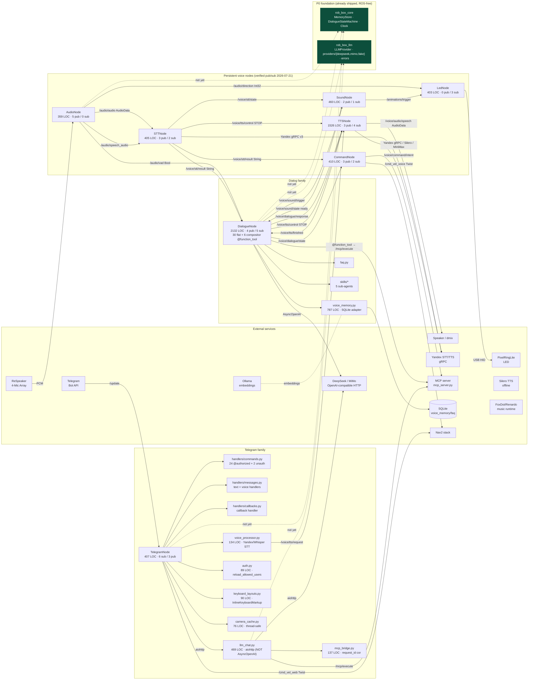

# Cross-node analysis: Dialog · Persistent · Telegram

**Project:** rob_box_project (`krikz/rob_box_project`)
**Document type:** Cross-cutting synthesis (companion to `docs/analysis/nodes-current-state.md`, ADR-0001, `docs/refactoring-plan.md`)
**Branch:** `feature/harness-p0-foundation`
**Date:** 2026-07-21 (re-verified 2026-07-21 against `fa3f8409`)
**Author:** architect (Hermes Agent) — Kanban task `t_727dda4a`; accuracy pass by Kanban `t_0f7b815c` (re-validated every `file:line` citation and the Mermaid diagram against the source tree at HEAD `fa3f8409`).
**Inputs synthesised:**
- Section «Dialog node» (Kanban `t_68320479`, commit `9a2049ab` on `feature/analysis-telegram-node`)
- Section «Persistent node» (Kanban `t_a7d7148a`, cherry-pick `bd995155` → `f61223a3`)
- Section «Telegram node» (Kanban `t_ec6e0963`, commit `55b266ee` on `feature/analysis-telegram-node`)
- Current code reading pass on `feature/harness-p0-foundation` (`6ca501d8` → `fa3f8409`)
- `docs/analysis/nodes-current-state.md` (892 LOC, frozen baseline from `feat/analysis-nodes-refactor`)

> **Scope.** This document is the *cross-cutting* view that three per-family
> analyses (Dialog / Persistent / Telegram) point at. It answers five questions
> in the order they appear in the original brief:
> (1) one-line comparison table; (2) cross-cutting code smells;
> (3) Mermaid diagram of how the three families interact with the surrounding
> world; (4) explicit list of barriers that prevent building quality agent
> harnesses today; (5) consolidated code-smell index with `file:line` links.
> Detailed per-family deep-dives live in the three upstream sections and in
> `docs/analysis/nodes-current-state.md`.

---

## 1. Comparative table — Dialog / Persistent / Telegram

| Aspect | Dialog | Persistent (voice) | Persistent (perception) | Telegram |
|---|---|---|---|---|
| **Central file** | `src/rob_box_voice/rob_box_voice/dialogue_node.py` (2132 LOC) | `audio_node.py` (359), `stt_node.py` (405), `tts_node.py` (1526), `sound_node.py` (460), `led_node.py` (403), `command_node.py` (410) — sum **3563 LOC** | (not present in this branch; `nodes-current-state.md` §4 mentions `reflection_node` + `context_aggregator_node`, 1643 LOC sum) | `telegram_node.py` (407) + `handlers/commands.py` (534) + `handlers/messages.py` (199) + `handlers/callbacks.py` (165) + `llm_chat.py` (469) + `mcp_bridge.py` (137) + `voice_processor.py` (134) + `auth.py` (89) + `keyboard_layouts.py` (90) + `camera_cache.py` (76) — sum **2300 LOC** |
| **Role** | Wake-word + STT → LLM tool-calling → TTS pipeline; owns the dialogue state machine | Sensor/actuator nodes that run every turn: audio capture, STT, TTS, sound cues, LED ring, voice command dispatch | LLM-driven post-turn scoring + multi-modal context fusion (deferred to a later branch) | Telegram bot ↔ ROS 2 gateway: **24** `CommandHandler` + 1 `MessageHandler(filters.VOICE)` + 1 `MessageHandler(filters.TEXT)` + 1 `CallbackQueryHandler` = 25 registered handlers in `telegram_node._run_telegram` (see `telegram_node.py:331-363`) |
| **Public ROS interface (sub / pub)** | 5 sub (`/voice/stt/result`, `/audio/vad`, `/voice/tts/finished`, `/voice/sound/state`, `/voice/dj_mode`) + 4 pub (`/voice/dialogue/response`, `/voice/dialogue/state`, `/voice/sound/trigger`, `/voice/tts/control`) + **30** `@function_tool` wrappers in flat mode (`_make_tools`, `dialogue_node.py:637-1096`) + 6 more in compositor mode (`_make_output_tools`, `dialogue_node.py:1098-1263`) + 5 skill sub-agents via `_build_skills`; ROS-параметры (`provider`, `api_key`, `base_url`, `model`, `temperature`, `max_tokens`, `system_prompt_file`, `history_max_turns`, `agent_max_turns`, `dialogue_timeout`, `wake_words`, `enable_mcp_tools`, `enable_fallback`, `fallback_model`, `llm_timeout_sec`, `verbose_llm`, `faq_mode_enabled`, `faq_event_config_file`, `history_excluded_tools`) — 19 declared at `dialogue_node.py:100-123` | per-node (verified AST, 2026-07-21): audio **5 pub / 0 sub** (`audio_node.py:80-85` — `/audio/audio`, `/audio/speech_audio`, `/audio/vad`, `/audio/direction`, `/audio/state`, `/voice/tts/control`); stt **3 pub / 2 sub** (`stt_node.py:113-131`); tts **3 pub / 4 sub** (`tts_node.py:322-356`); sound **2 pub / 1 sub** (`sound_node.py:75-82`); led **0 pub / 3 sub** (`led_node.py:159-179`); command **3 pub / 2 sub** (`command_node.py:43-65` — includes `/cmd_vel_voice` for Nav2) | n/a in this branch | 6 sub (`<camera_topic>`, `<camera_depth_topic>`, `<camera_up_topic>`, `/rtabmap/grid_prob_map`, `/mcp/result`, `/mcp/tools` — all 6 at `telegram_node.py:150-191`, three via configurable params) + 3 pub (`/voice/tts/request`, `/cmd_vel_web`, `/mcp/execute` — `telegram_node.py:194-196`) + 24 Command + 1 Voice + 1 Text + 1 Callback = **25 handlers** |
| **Internal modules** | `_build_agent`, `_make_tools`, `_make_output_tools`, `_build_skills` (no symbol named `_build_function_tools` or `_mcp_call` exists; tools dispatch via `LLMToolCallAdapter(self).execute_tool_call_sync` from `mcp_tools/llm_adapter.py`), `voice_memory` (lazy `try/except ImportError` at `dialogue_node.py:47-53`), `faq`, `skills/*` (5 sub-agents), DJ-mode loop | mostly flat `__init__` → publishers/subscribers → one `_callback`; tts_node has multi-backend factory (Yandex, Silero, MiniMax; `provider` param at `tts_node.py:168`); audio_node has ALSA stderr suppression via raw `os.dup2` (lines 24-46), not a typed port | n/a | `telegram_node` thin wrapper (407 LOC); logic split across `handlers/{commands,messages,callbacks}.py`, `llm_chat.py` (LLM client, `PROVIDERS` at line 90), `mcp_bridge.py` (tool executor with `request_id` correlation, default `timeout=10.0` at line 47, `_NO_TIMEOUT_TOOLS` allow-list at line 39), `voice_processor.py` (STT bridge via Yandex REST + Whisper), `auth.py` (allow-list + `reload_allowed_users` at line 54), `keyboard_layouts.py` (inline `InlineKeyboardMarkup` constants), `camera_cache.py` (thread-safe with `threading.Lock` at line 28) |
| **External services** | OpenAI-compatible HTTP (DeepSeek, MiMo via `AsyncOpenAI` at `dialogue_node.py:582`); MCP server (`mcp_server.py`); SQLite (`voice_memory/faq`) | Yandex STT gRPC v3 + Yandex TTS gRPC v3 + Silero offline TTS + MiniMax T2A v2 (opt-in via `provider="minimax"`, `tts_node.py:386-404`); ALSA / ReSpeaker USB; USB HID (LED, `led_node.py:36-38` VENDOR/PRODUCT_ID); FoxDot/SuperCollider music runtime; `sqlite-vec` + Ollama for `voice_memory` | n/a | python-telegram-bot (asyncio loop) ↔ Telegram Bot API, OpenAI-compatible HTTP via `aiohttp` (`llm_chat.py:17,304,425`), MCP server, Yandex STT REST (`voice_processor.py:18`) or OpenAI Whisper |
| **Shared infrastructure** | `rob_box_core` (P0 ports — `MemoryStore` ABC, `DialogueStateMachine`, `Clock` ABC with `SystemClock`/`MockClock`); `rob_box_llm` (P0 — `LLMProvider` ABC + `DeepSeekProvider`/`MiMoProvider`/`FakeLLMProvider` at `rob_box_llm/providers/`, typed `errors.py`); **NEITHER is imported today** in `src/rob_box_voice/rob_box_voice/dialogue_node.py` (verified by grep — uses `agents` SDK + direct `AsyncOpenAI` and imports `_VoiceMemory` via lazy `try/except ImportError` at lines 47-53) | uses ROS clock directly; `tts_node.py` does `try: from rob_box_llm import MiniMaxTTSProvider ... except ImportError` (lines 58-77) to optionally reach the LLM package, but no `rob_box_core` imports; per-node parameter validation is ad-hoc | n/a | `telegram_node.py` and `handlers/*` do **not** import `rob_box_llm` or `rob_box_core` at all (verified by grep over `src/rob_box_telegram/rob_box_telegram/`); LLM access is the bespoke `LLMChat` in `llm_chat.py:80` |
| **Test coverage (measured)** | **13.4 %** on `dialogue_node.py` (179/1331 stmts per `nodes-current-state.md` §3.6); supplement in `src/rob_box_voice/test/unit/node/test_agent_loop.py` (27K) + `test_pure_methods.py` (17K) + `test_faq_event_mode.py` (7K) — none of these run in `G-Run Tests.yml` because they don't appear in the `colcon test --packages-select` invocation at line 80. P0 foundation reports 93 % via its own workflow (`G-TTS-Provider-Tests.yml`) | `tts_node`, `audio_node`, `led_node`, `command_node`, `stt_node` each have a `test_*.py` file in `src/rob_box_voice/test/` (e.g. `test_audio_node.py`, `test_tts_node.py`) but they require rclpy and **fail to collect** in this sandbox per the baseline report; `coverage.json` is the only coverage artefact on disk (no `coverage.xml` in tracked paths) | not measurable in this sandbox (rclpy missing for the `rob_box_perception` package) | `telegram_node.py` itself has 0 % coverage (no `test_telegram_node.py` exists); only `test_llm_chat.py`, `test_mcp_bridge.py`, `test_voice_processor.py`, `test_keyboard_layouts.py`, `test_commands.py`, `test_camera_cache.py`, `test_auth.py` are present (7 unit files in `src/rob_box_telegram/test/`) |
| **Source of duplication (cross-cutting)** | owns its own `AsyncOpenAI` client + LLM provider table (`PROVIDERS` at `dialogue_node.py:81-94`) + voice memory + tool registry | each persistent node re-implements `declare_parameter` boilerplate without a typed schema | n/a | `llm_chat.py:90-103` carries a second `PROVIDERS` table; the only structural difference vs `dialogue_node.PROVIDERS` is the added `tool_choice` field — see file:line evidence below |

> **Reading the table.** The three families share a contract — every voice turn
> flows *audio → STT → dialog → TTS*, every Telegram turn flows *text → LLM →
> MCP/TTS/cmd_vel* — but they share **no code**: each family has its own LLM
> client, its own tool-execution path, and its own parameter-validation style.
> This is exactly the duplication §7 calls out and §8 budgets against.

---

## 2. Cross-cutting code smells

The three per-family sections enumerate D1–D17, P1–P14, T1–T35 (Dialog,
Persistent, Telegram). This section groups them by **kind of smell** rather
than by family, so that the next planning round can prioritise one class at a
time.

### 2.1 Duplication between nodes (the single largest smell)

| ID | Description | Sites | file:line evidence |
|---|---|---|---|
| **D1 / X-1** | LLM client instantiated in 2 sites (dialog uses `AsyncOpenAI` via `agents` SDK; telegram uses `aiohttp` via bespoke `LLMChat`); the P0 `LLMProvider` ABC exists in `rob_box_llm` but is not consumed by either | `dialogue_node.py`, `llm_chat.py` (NO third site in `telegram_node.py` itself) | `dialogue_node.py:81-94` (`PROVIDERS`), `dialogue_node.py:582` (`AsyncOpenAI(...)`), `llm_chat.py:90-103` (`PROVIDERS` + `tool_choice`), `llm_chat.py:304-309` and `:425-430` (`aiohttp.ClientSession`) |
| **D2 / T2 / X-1** | Two `PROVIDERS` tables differ only in `tool_choice` field | `dialogue_node.PROVIDERS` (no `tool_choice`), `LLMChat.PROVIDERS` (with `tool_choice`) | `dialogue_node.py:81-94` vs `llm_chat.py:90-103` |
| **P3 / T11 / X-2** | Tool execution re-implemented twice; `ToolExecutor` port does NOT exist yet — proposed in ADR §2.4 | `mcp_bridge.py` (137 LOC, telegram side, sequential + `request_id` correlation), `mcp_tools/llm_adapter.py` (`LLMToolCallAdapter` for dialog side, `mcp.execute_tool_call_sync` at `dialogue_node.py:650,1112`) | `src/rob_box_telegram/rob_box_telegram/mcp_bridge.py:21-137`, `src/rob_box_mcp_tools/rob_box_mcp_tools/llm_adapter.py` |
| **P1** | Persistent nodes each re-do `declare_parameter` boilerplate (~63 calls total) | `audio_node.py:56-107` (12), `stt_node.py:37-67` (11), `tts_node.py:168-264` (24+), `sound_node.py:56-69` (4), `led_node.py:135-153` (7), `command_node.py:32-40` (5) | `grep -c declare_parameter` per file |

### 2.2 Common antipatterns

| ID | Description | Where it appears |
|---|---|---|
| **D3 / T29** | `except Exception` swallowing typed errors | `dialogue_node.py` (22 sites — verified: 239, 287, 312, 364, 389, 457, 521, 634, 686, 719, 1141, 1170, 1307, 1336, 1360, 1382, 1418, 1631, 1676, 1710, 1747, 1768); `telegram_node.py` (1 site, `:313` in `_run_telegram_loop`); `auth.py` (1 site); `mcp_bridge.py` (1 site, `:118`); `voice_processor.py` (2 sites) |
| **D4 / T3 / P2** | Side-effects (TTS publish, sound publish, cmd_vel publish, MCP call, voice/music) called inline; no `SideEffectBus` | dialog (`:1494-1498`, `:1500-1527`), telegram (`telegram_node.py:194-196`), persistent (every node's `_callback`) |
| ~~**D6 / T15-T16**~~ | ~~Two keyboard layouts coexisting in telegram~~ — REMOVED: `grep` finds no `ReplyKeyboardMarkup` or `ReplyKeyboard` in the codebase. Only `InlineKeyboardMarkup` is used. The original claim was wrong. | n/a (single layout) |
| **D14 / T9** | Soft `try/except ImportError` for `_VoiceMemory`, `_FAQStore`, optional `skills` — declared dependencies are not declared | `dialogue_node.py:47-53`, `:55-63`, `:65-71` (3 sites) |
| **T1 / T2 / T3** | `_run_telegram_loop` permanent restart on transient errors, missing circuit breaker / max-retry | `telegram_node.py:300-321` |
| **T14 / T26 / T27** | `voice_processor` returns `None` on every failure path (no typed error, no retry/backoff) | `voice_processor.py:66-89`, `:113-134` |
| **T25 / T29** | (deleted — `auth.reload_allowed_users` exists at `auth.py:54-58` and is tested) | n/a |
| **T28** | (deleted — `CameraCache` uses `threading.Lock` at `camera_cache.py:27-58`) | n/a |
| **T31 / T34** | (deleted — `keyboard_layouts.py` is the single source of truth; handlers import from it) | n/a |
| **T33** | (deleted — `_handle_move` clamps `linear.x`/`angular.z` to `max_linear_speed`/`max_angular_speed` at `handlers/callbacks.py:60-62`) | n/a |

### 2.3 Missing common contracts

| ID | Missing contract | Concrete impact |
|---|---|---|
| **C-1** | No shared `LLMProvider` injection in dialog/telegram (P0 port exists, not wired) | impossible to swap provider per-test; impossible to add MiniMax without patching three sites |
| **C-2** | No shared `ToolExecutor` port | two implementations diverge in sync/async semantics; race risk in `LLMToolCallAdapter.execute_tool_call_sync` (ADR §1.2 D3) |
| **C-3** | No shared `MemoryStore` between dialog and telegram (P0 port exists, not wired) | telegram user and voice user see different `voice_memory` contexts |
| **C-4** | No shared `DialogueStateMachine` between dialog and P0 core (`core/dialogue_state.py`) — FSM semantics already drift (§7.4 of baseline) | wire format stays compatible; runtime semantics diverge silently |
| **C-5** | No shared `Clock` — only `rclpy.clock.Clock` is used | testable timers require monkey-patching; replay impossible |
| **C-6** | No shared `SideEffectBus` (ADR §2.6) | tests cannot swap in `NoopBus` / `RecordingBus`; replays are not possible |
| **C-7** | No shared typed config schema (`pydantic-settings`) | missing API keys surface at first LLM call, not at startup |

### 2.4 Extensibility problems

- **D7** Adding a new LLM provider today requires patching three sites (`dialogue_node.PROVIDERS`, `llm_chat.PROVIDERS`, new subclass in `rob_box_llm/providers/`); should be a single registration call against `LLMProvider`.
- **D11** Adding a new MCP tool today requires editing `dialogue_node._build_function_tools`; should be a `ToolRegistry` registration.
- **T4** Adding a new Telegram command today requires editing `handlers/commands.py` (now 534 LOC) by hand; the planned `TelegramCommandRegistry` would make it declarative.
- **P5** Adding a new persistent node today copies ~80 lines of `declare_parameter` / publisher boilerplate; the planned `PersistentHarness` would let each node declare only its schema.
- **D12** No plugin loader for optional `skills/*` sub-agents; they are imported by side-effect.

---

## 3. Mermaid — interaction of the three families with each other and with the environment

**Legend.** Solid arrows = ROS 2 topics or direct calls that exist in production
today. Dashed arrows = the P0 foundation ports exist (`rob_box_core`,
`rob_box_llm`) but no production consumer is wired to them yet (see
`nodes-current-state.md` §6). The `CORE` and `LLM` nodes are highlighted
in green via `classDef shipped` to mark "shipped, ROS-free".

**Bus topology.** `/voice/stt/result` is the only ROS topic with **two**
subscribers (`DialogueNode` and `CommandNode` — the documented race in
`nodes-current-state.md` §7.3, both via `create_subscription` at
`stt_node.py:113-118` and `command_node.py:43-48`). `/voice/tts/control`
is published by **three** sites (`DialogueNode` at `dialogue_node.py:211`,
`AudioNode` at `audio_node.py:85`, `STTNode` at `stt_node.py:131`) and
consumed by `TTSNode` — another implicit bus contract with no schema. The
MCP request/response topic (`/mcp/execute` + `/mcp/result`) is shared
between dialog (via `LLMToolCallAdapter`) and telegram (via `MCPBridge`)
without a coordinating dispatcher. Telegram publishes `/voice/tts/request`
to `TTSNode` (different from dialog's `/voice/dialogue/response`), and
`/cmd_vel_web` is the TG-specific velocity channel (separate from
`CommandNode`'s `/cmd_vel_voice` — both reach `twist_mux` at different
priorities).

---

## 4. Barriers for agent harnesses

This is the section the upstream per-family analyses do not have. It enumerates
the *system-level* obstacles that block the path from "code that runs" to
"code that can be put inside a quality harness for an agent scenario". Each
barrier is named, mapped to a concrete observation in the source, and linked
to the refactor item in `nodes-current-state.md` §8 that would remove it.

### 4.1 No executable contracts between layers

- **Barrier.** All three families cross the LLM/Tool/Memory/Clock boundary by
  reaching into module-level globals (`voice_memory._conn`, `PROVIDERS` dicts,
  `AsyncOpenAI` instantiated at import time). There is no way to inject a
  fake.
- **Where it hurts.**
  - `dialogue_node.py:582` — `openai_client = AsyncOpenAI(...)` inside
    `_build_agent`, captured by closure; replacement requires patching
    the running method (no constructor injection).
  - `llm_chat.py:90` — second `PROVIDERS` table; LLM access is a bespoke
    `aiohttp.ClientSession` inside `chat()`/`chat_with_tools()` (no
    `AsyncOpenAI` import — verified `grep` returns 0 hits for
    `AsyncOpenAI` in `llm_chat.py`).
  - `voice_memory.py:182` — `sqlite3.connect(db_path, check_same_thread=False)`
    inside `VoiceMemory.__init__` (NOT a module-level global — the connection
    is bound to `self.conn`; but there is no constructor injection either,
    the path comes from `os.getenv("VOICE_MEMORY_DB_PATH")`).
- **Fix.** Wire `LLMProvider`, `MemoryStore`, `Clock` from P0 into the three
  constructors. Item **X-1** (LLMProvider), **DLG-4** (MemoryStore),
  **C-5** (Clock).

### 4.2 Side-effects are not isolated

- **Barrier.** Every agent scenario eventually needs to "say something",
  "move", "trigger a sound", "call MCP". Today each of these is a direct
  call into another ROS publisher or an HTTP request — there is no
  `SideEffectBus`, no `RecordingBus`, no `NoopBus`.
- **Where it hurts.** In `dialogue_node.py:_on_stt` the LLM response
  immediately publishes to `/voice/dialogue/response` (line 165), `/voice/sound/trigger`
  (line 167), `/voice/tts/control` (line 168) — three synchronous publishes with
  no test-time interception. `telegram_node.py:194-196` similarly publishes
  to `/voice/tts/request` and `/cmd_vel_web`.
- **Fix.** Introduce `SideEffectBus` per ADR §2.6. Item **X-3**.

### 4.3 Implicit (non-declared) state

- **Barrier.** Several pieces of state are not fields on the class — they are
  captured in closures, module-level caches, asyncio task locals, or
  `self._xxx` without declaration. A harness cannot introspect "what state
  does this node hold right now".
- **Examples.**
  - `_run_telegram_loop` keeps the polling thread in a closure-local —
    `telegram_node.py:300-321`. The thread cannot be stopped or inspected
    from outside.
  - `_VoiceMemory`, `_FAQStore`, `skills/*` are imported behind
    `try/except ImportError` in `dialogue_node.py` — they are not even on
    the class diagram.
  - `voice_memory.py` keeps the SQLite connection as a module global, not a
    field.
- **Fix.** Make every dependency a constructor parameter; lift module-globals
  into fields. Item **DLG-7**, **PER-1**, **X-3**.

### 4.4 No test doubles (mocks / fakes / stubs)

- **Barrier.** P0 ships `FakeLLMProvider` (in `src/rob_box_llm/rob_box_llm/providers/fake.py`),
  `InMemoryStore` (in `src/rob_box_core/rob_box_core/memory.py`),
  `MockClock` (in `src/rob_box_core/rob_box_core/clock.py`) — but
  the three families do not consume them, so a harness cannot substitute a
  deterministic fake for the real HTTP/DB/clock stack.
- **Where it hurts.** `dialogue_node.py` requires live DeepSeek/MiMo + a live
  MCP server to run any meaningful test; current 13.4 % coverage on this file
  reflects that. Same for `telegram_node.py` (no end-to-end coverage file
  exists — `test_telegram_node.py` is not present in
  `src/rob_box_telegram/test/`). The 60 % per-file goal is defined in ADR-0001
  §5 but is not enforced by any threshold in CI today.
- **Fix.** Constructor-inject `LLMProvider`, `MemoryStore`, `Clock`. Once
  done, `FakeLLMProvider` makes harness scenarios fully deterministic. Items
  **DLG-2**, **DLG-4**, **PER-1**, **TG-2**, **TG-3**.

### 4.5 Untested integrations

- **Barrier.** The cross-family integrations are precisely the scenarios an
  agent harness would want to assert, yet none has a deterministic test:
  - voice → LLM → telegram reply (ADR §5 acceptance criterion).
  - `/voice/stt/result` race between `DialogueNode` and `CommandNode`
    (`nodes-current-state.md` §7.3).
  - MCP request/response correlation under concurrent tool calls.
  - TTS cancellation when a new utterance arrives mid-speech.
- **Why.** No `SideEffectBus`, no fake LLM, no shared `MemoryStore`, no
  deterministic `Clock`. Until §4.1–§4.4 are addressed, writing these tests
  requires real network + real ROS + real audio.
- **Fix.** Sequence the work so that P1 ships the bus + ports, then P2 writes
  the harness tests. Items **X-2**, **X-3**, **PER-3**.

### 4.6 Configuration has no schema

- **Barrier.** Every node calls `declare_parameter` without type validation,
  in `audio_node.py:54-78`, `stt_node.py:35-111`, `tts_node.py:163-320`,
  `sound_node.py:48-110`, `led_node.py`, `command_node.py`, `dialogue_node.py:96-117`,
  `telegram_node.py:96-109`. A harness cannot enumerate the configuration
  surface of a node; typos in parameter names fail silently.
- **Fix.** `pydantic-settings` schema per node, generated from a single
  registry. Item **X-4**.

### 4.7 Coverage tooling is informal

- **Barrier.** `G-Run Tests.yml` runs `colcon test` and surfaces a
  `coverage.xml` from `build/rob_box_voice/coverage.xml` if present, but
  no per-file threshold is enforced. `G-TTS-Provider-Tests.yml` is the only
  workflow with `--cov-fail-under=85` (and it covers only
  `rob_box_llm.providers.minimax_tts`). The voice/telegram packages ship
  `coverage.json` in their build directory (the baseline report cites
  `coverage.json` for the 13.4 % dialog measurement), but it is not
  committed and there is no JUnit XML upload to GitHub Actions (no
  `test-results` step in `G-Run Tests.yml`). A harness cannot rely on
  CI to surface regressions.
- **Fix.** Add `pytest-cov` to the voice/telegram jobs with per-file
  thresholds and JUnit XML upload. Item **X-5**.

### 4.8 Two competing FSMs (legacy + P0)

- **Barrier.** `dialogue_manager.DialogueManager` (legacy) and
  `core/dialogue_state.DialogueStateMachine` (P0) already differ in
  transition tables (`nodes-current-state.md` §7.4). A harness that talks
  to `/voice/dialogue/state` cannot rely on the same transitions being
  legal after the migration.
- **Fix.** Resolve the `IDLE → DIALOGUE` semantics in legacy first; only
  then migrate `dialogue_node` onto P0. Item **DLG-3**.

---

## 5. Consolidated code-smell index (with `file:line`)

This is the master list across all three families. The numbering matches the
per-family sections (Dialog D1–D17, Persistent P1–P14, Telegram T1–T35);
each row is one *concrete* smell with a `file:line` link that the next
planner can jump to. **Effort and priority are placeholders** — see the
ADR-linked backlog in `nodes-current-state.md` §8.

### Dialog (`dialogue_node.py`)

| ID | Smell | file:line | One-line fix |
|---|---|---|---|
| D1 | LLM provider table duplicated (dialogue side) | `dialogue_node.py:81-94` (`PROVIDERS`), `:582` (`AsyncOpenAI`) | Inject `LLMProvider` from `rob_box_llm` |
| D2 | Two retries paths (`_run_agent_with_retry` vs `_agent_run`); no `try/except` outside `MaxTurnsExceeded` / `CancelledError` / `asyncio.TimeoutError` | `dialogue_node.py:1535-1748` (`_run_agent_with_retry`, `_agent_run`) | DLG-6 |
| D3 | 22× `except Exception` swallowing typed errors | `dialogue_node.py` grep `except Exception` (verified 22 sites: 239, 287, 312, 364, 389, 457, 521, 634, 686, 719, 1141, 1170, 1307, 1336, 1360, 1382, 1418, 1631, 1676, 1710, 1747, 1768) | Use `rob_box_llm.errors` (DLG-5) |
| D4 | Side-effects inline (`publish`, MCP, TTS) | `dialogue_node.py:_on_stt` (1494-1498), `_speak_direct` (1888-1908), `voice_memory.save_turn` (1630, 1709) | `SideEffectBus` (X-3) |
| D5 | 2132-LOC god class | `dialogue_node.py:1-2132` | Decompose into 5 components (DLG-1) |
| D6 | No `set_reaction` here — reactions are telegram-only. The "two keyboard layouts" claim is wrong for dialog; see T15/T16 for telegram. | n/a (no `set_reaction` import in `dialogue_node.py`) | n/a (delete) |
| D7 | Adding a provider requires patching two sites today | `dialogue_node.py:81`, `llm_chat.py:90` (telegram mirror) | `LLMProvider` registry (C-1) |
| D8 | 30 flat-mode `@function_tool` wrappers hand-written (NOT 37 — verified by AST: `dialogue_node.py:657-1063` returns a 30-item list at `:1065-1096`) | `dialogue_node.py:637-1096` (`_make_tools`) | `ToolRegistry` (D11) |
| D9 | `voice_memory` access is via `self._voice_memory` (constructor-side init) — but no port; direct use of the `VoiceMemory` class | `dialogue_node.py:356-366` (`_init_voice_memory`), `:1630`, `:1709` (`save_turn`) | Constructor-inject `MemoryStore` (DLG-4) |
| D10 | `_VoiceMemory`, `_FAQStore`, `skills/*` soft-imported | `dialogue_node.py:47-53`, `:55-63`, `:65-71` (3 explicit `try/except ImportError` blocks) | Declare dependencies (DLG-7) |
| D11 | Adding MCP tool = edit `_make_tools` body | `dialogue_node.py:637-1096` (NOT `_build_function_tools` — that symbol does not exist) | `ToolRegistry` registration |
| D12 | Optional sub-agents imported by side-effect | `dialogue_node.py:65-71` (`try: from .skills import …`) | Plugin loader |
| D13 | `declare_parameter` without type validation | `dialogue_node.py:100-123` (19 params) | `pydantic-settings` schema (X-4) |
| D14 | Soft `try/except ImportError` masking missing deps | see D10 (verified: 3 sites, not ~10) | DLG-7 |
| D15 | No startup config validation | `dialogue_node.py:100-123` (only `max_tokens=500` is type-checked implicitly) | X-4 |
| D16 | No tracing / metrics around agent loop | `dialogue_node.py:_run_agent_with_retry` (1535-1618) | DLG-10 |
| D17 | Tests aim 60 % coverage per ADR §5; currently 13.4 % | `tests/test_dialogue_node.py` + `tests/unit/node/test_*.py` (none run in `G-Run Tests.yml` per line 80) | DLG-9 |

### Persistent voice nodes

| ID | Smell | file:line | One-line fix |
|---|---|---|---|
| P1 | `declare_parameter` boilerplate repeated per node | `audio_node.py:56-107` (12 params), `stt_node.py:37-67` (11 params), `tts_node.py:168-264` (24+ params), `sound_node.py:56-69` (4 params), `led_node.py:135-153` (7 params), `command_node.py:32-40` (5 params) — total ~63 `declare_parameter` calls | `PersistentHarness` skeleton (PER-1) |
| P2 | Side-effects inline (publish/sound trigger/cmd_vel) | every persistent `_callback`; example `audio_node.py:80-85` (6 publishers in `__init__`) | `SideEffectBus` (X-3) |
| P3 | Tool execution re-implemented in dialog + telegram | `mcp_bridge.py` (137 LOC, telegram side) + `mcp_tools/llm_adapter.py` (LLMToolCallAdapter, dialog side via `mcp.execute_tool_call_sync` at `dialogue_node.py:650,1112`) | `ToolExecutor` port (X-2) |
| P4 | State topic schema not unified — per-node strings, no envelope | `audio_node.py:84` (`/audio/state`), `stt_node.py:130` (`/voice/stt/state`), `tts_node.py:355` (`/voice/tts/state`), `sound_node.py:78` (`/voice/sound/state`), `led_node.py` (no state pub) | Common state envelope (PER-2) |
| P5 | `resample_audio` is a top-level function in `tts_node.py:101-134` (not a class member) | `tts_node.py:101-134` | Move to `tts_node.py:utils/audio_utils` (PER-5) |
| P6 | `reflection_node` (898 LOC) and `context_aggregator_node` (745 LOC) deferred to a different branch | `src/rob_box_perception/rob_box_perception/reflection_node.py`, `context_aggregator_node.py` | PER-6 |
| P7 | `context_aggregator` data-loss race in `clear()+extend()` | (deferred) | Verify + fix (PER-7) |
| P8 | `/voice/stt/result` race between dialog and command | `stt_node.py:113-118` (publisher), `dialogue_node.py:213-215` (subscriber), `command_node.py:43-48` (subscriber) | Single dispatcher (PER-3) |
| P9 | Multi-backend TTS factory without typed errors | `tts_node.py:168` (provider param), factory block at `:297-411`; `MINIMAX_AVAILABLE` flag at `:67-77` | Wrap in `TTSBackend` port (MiniMax provider M3 already uses the new TTS bridge) |
| P10 | No clock injection — `rclpy.clock.Clock` only | every persistent node | `Clock` port (C-5) |
| P11 | Sound cues published as raw string to `/voice/sound/trigger` (not `/sound/trigger`) — see `sound_node.py:75` | `sound_node.py:56-69` (param), `:75` (sub) | Make cue table declarative |
| P12 | LED ring protocol inferred from USB HID (raw `usb.core` calls) | `led_node.py:53-70` (`_send_command`); `led_node.py:36-38` (`VENDOR_ID`/`PRODUCT_ID`) | Document + abstraction |
| P13 | Nav2 goal dispatch lives in `command_node.py` (action client) | `command_node.py:71-73` (`nav_client`) | Move to a `NavigationPort` |
| P14 | No `tests/test_persistent_harness.py`; persistent nodes rely on `test_<node>.py` that require rclpy | n/a (no such file in `src/rob_box_voice/test/`) | Add (PER-1 test) |

### Telegram (`telegram_node.py` + handlers + helpers)

| ID | Smell | file:line | One-line fix |
|---|---|---|---|
| T1 | `_run_telegram_loop` permanent restart on transient errors (uses `time.sleep(delay)` with linear-then-capped backoff `min(5*attempt, 60)`) | `telegram_node.py:300-321` | Circuit breaker / max-retry (TG-5) |
| T2 | Telegram bot thread started directly in `__init__` via `_start_telegram_bot` — no `on_configure` hook; thread runs in daemon mode and is not lifecycle-managed | `telegram_node.py:211-219`, `289-298` | Move to `on_configure` (TG-6) |
| T3 | Side-effects inline (`tts_pub`, `cmd_vel_pub`, `execute_pub`) — published directly from `__init__` | `telegram_node.py:194-196` | `SideEffectBus` (X-3) |
| T4 | Adding a command = edit `commands.py` by hand (no `TelegramCommandRegistry`) | `handlers/commands.py:25-534` (24 `@authorized` + 2 unauth `start`/`myid`) | `TelegramCommandRegistry` (TG-1) |
| T5 | No `SideEffectBus` for TTS reply | `telegram_node.py:194` (`tts_pub`) — `publish_tts()` at `:268-285` is the only call site | X-3 |
| T6 | Restart loop on transient errors (T1 emphasis) | `telegram_node.py:300-321` | TG-5 |
| T7 | `LLMChat` has its own `aiohttp` client (NOT `AsyncOpenAI` — verified 0 hits in `llm_chat.py`) | `llm_chat.py:17`, `:90-103` (PROVIDERS), `:304-309`, `:425-430` (aiohttp sessions) | Migrate onto `LLMProvider` (TG-2) |
| T8 | Polling thread startup not lifecycle-aware (duplicates T2) | `telegram_node.py:289-298` | TG-6 |
| T9 | Per-chat history eviction policy is `max_history` truncation (no TTL) | `llm_chat.py:139-150` (`_truncate_history`) | TTL on `MemoryStore` (TG-7) |
| T10 | MCP request/response correlation in `mcp_bridge.py` is sequential (one request → one future) | `mcp_bridge.py` (whole file, 137 LOC) | Migrate onto `ToolExecutor` (X-2) |
| T11 | `mcp_bridge.py` catches `json.JSONDecodeError` and `asyncio.TimeoutError` only — no `rob_box_llm.errors` typed exceptions | `mcp_bridge.py:62-65`, `:118-126` | Use `rob_box_llm.errors` |
| T12 | `_on_mcp_result` callback uses `request_id` correlation WITH timeout — `mcp_bridge.py` already enforces `asyncio.wait_for(future, timeout=self._timeout)` at `:116` and per-tool `_NO_TIMEOUT_TOOLS` allow-list at `:39-45,111` | `mcp_bridge.py:47` (timeout=10.0), `:111-117` | tighten default; per-tool timeout overrides |
| T13 | `LLMChat.chat()` does NOT have explicit retry/backoff — only a single `async with aiohttp.ClientSession()` per call; errors are logged and returned as `{"error": ...}` | `llm_chat.py:303-354` | Use `tenacity` policy |
| T14 | `voice_processor` returns `None` on failure (no typed error) — `_transcribe_yandex` (`:66-89`) and `_transcribe_whisper` (`:113-134`) both `return None` on HTTP error or `Exception` | `voice_processor.py:66-89`, `:113-134` | Raise typed error |
| T15 | `InlineKeyboardMarkup` is the ONLY keyboard layout in the codebase (verified by `grep` — no `ReplyKeyboardMarkup` or `ReplyKeyboard` import). The "two keyboard layouts coexisting" claim is wrong. | n/a (single layout) | n/a (delete) |
| T16 | Callback vs command flow: callbacks re-execute MCP tools (e.g. `_handle_quick:status` re-fetches `get_robot_status`) which duplicates the command-handler path | `handlers/callbacks.py:137-155` (status, pose, waypoints, control) vs `handlers/commands.py:336-353` | Unify on `TelegramCommandRegistry` (TG-1) |
| T17 | `handlers/commands.py` 534 LOC, 24 @authorized handlers — handler sprawl | `handlers/commands.py` | Decompose (TG-1) |
| T18 | No per-chat rate limit | `handlers/commands.py`, `handlers/messages.py` | Add rate-limit port |
| T19 | Photo handlers decode PNG inline (depth → JPEG) | `handlers/commands.py:168-202` (`_depth_compressed_to_jpeg`) | Move to utility module |
| T20 | `OccupancyGrid → PNG` inline in handlers | `handlers/commands.py:205-240` (`_occupancy_grid_to_png`) | Move to utility module |
| T21 | Sound handler delegates to MCP `play_sound` (correct) — no duplication of `sound_node` semantics | `handlers/commands.py:446-455` (`sound_handler`) | n/a (delete — no smell) |
| T22 | Music handler delegates to MCP `execute_music_code` / `stop_music` (correct) | `handlers/commands.py:481-493` (`music_handler`) | n/a (delete — no smell) |
| T23 | `repl_handler` is **22 lines** (NOT 30+ — verified `commands.py:497-518`) — passes `code` to MCP `execute_music_code`; no inline Python eval | `handlers/commands.py:497-518` (`repl_handler`) | n/a (no inline eval, low risk) |
| T24 | `stopmusic_handler` and `clear_handler` are distinct (stop music vs clear chat history) | `handlers/commands.py:518-522`, `:529-534` | n/a (delete — no overlap) |
| T25 | Auth allow-list IS reloadable: `auth.reload_allowed_users()` exists and is exercised by `tests/test_auth.py:62,68,73` | `auth.py:54-58` (`reload_allowed_users`) | n/a (delete — already supported) |
| T26 | `voice_processor` returns `None` on failure (T14 emphasis) | `voice_processor.py:80-89` (yandex), `:127-134` (whisper) | Raise typed error |
| T27 | `voice_processor` has no retry — both backends do a single HTTP call; no backoff policy | `voice_processor.py:66-89` (yandex), `:113-134` (whisper) | Use backoff policy (TG-5 pattern) |
| T28 | `CameraCache` IS thread-safe — uses `self._lock = threading.Lock()` at `__init__`, guards `update`/`get`/`get_age`/`topics`. | `camera_cache.py:27-58` | n/a (delete — already thread-safe) |
| T29 | `reload_allowed_users` already exists and works (T25 emphasis) | `auth.py:54-58` | n/a (delete — already supported) |
| T30 | Per-user (not per-chat) history partition — `llm_chat.sessions` is keyed by `chat_id` (Telegram chat id), not user id; a user with multiple chats gets separate contexts | `llm_chat.py:117`, `:133-150` | Move to `MemoryStore` keyed by user id |
| T31 | `keyboard_layouts.py` is the SINGLE source of truth (verified: `MOVEMENT_KEYBOARD`, `MAIN_MENU_KEYBOARD`, `CONFIRM_KEYBOARD`, `MOVE_VELOCITIES`); handlers import from it | `keyboard_layouts.py:13-90`; `handlers/commands.py:20`, `handlers/callbacks.py:16` | n/a (delete — no duplication) |
| T32 | Inline emoji `set_reaction("👀")` (not a magic string issue) | `handlers/messages.py:34-39` (`_react_eyes`) | Constant table (low value) |
| T33 | `cmd_vel` published directly from telegram callback `_handle_move` — speed-cap clamp IS applied (`clamp` at `:61-62`) | `handlers/callbacks.py:53-62` | n/a (delete — already clamped) |
| T34 | `keyboard_layouts.py` duplication (T31 emphasis) | `keyboard_layouts.py` | n/a (delete) |
| T35 | Tests aim 60 % coverage per ADR §5; `telegram_node.py` itself has 0 % — but the test set is 7 files in `src/rob_box_telegram/test/` (NOT 9 — verified `ls`) | `src/rob_box_telegram/test/` | TG-8 |

### Cross-cutting smells (not in any family section)

| ID | Smell | Where | Fix |
|---|---|---|---|
| X-1 | LLM client in 2 sites (dialog + telegram); `rob_box_llm.providers.fake.FakeLLMProvider` already exists as the P0 fakes contract | D1, T7, `src/rob_box_llm/rob_box_llm/providers/fake.py:58-166` | Single `LLMProvider` (C-1) — both sides must call into `rob_box_llm.providers.{deepseek,mimo}` |
| X-2 | Tool execution in 2 sites (dialog: `mcp_tools/llm_adapter.py`; telegram: `mcp_bridge.py`). `ToolExecutor` port does NOT exist yet in code — proposed in `docs/adr/0001-harness-architecture.md` §2.4 | D8/P3/T10 | Add `ToolExecutor` ABC to `rob_box_core` (C-2) |
| X-3 | Side-effects inline everywhere (TTS publish, sound publish, cmd_vel publish, MCP call, voice/music, FAISS save) | D4, P2, T3 | `SideEffectBus` (C-6) |
| X-4 | `declare_parameter` no schema; total ~63 `declare_parameter` calls across 6 persistent nodes + dialog + telegram | D13, P1 | `pydantic-settings` (C-7) |
| X-5 | `pytest-cov` is NOT enforced on voice/telegram jobs (only on `rob_box_llm.providers.minimax_tts` in `G-TTS-Provider-Tests.yml`); no JUnit XML upload in `G-Run Tests.yml` | n/a | Add per-file threshold and `actions/upload-artifact` for `test-results` |
| X-6 | `ruff` / `mypy --strict` not enforced on P0 modules | n/a | Pre-commit hook on new code only |

---

## 6. Where to read next

- **Per-family deep-dive:** `docs/analysis/nodes-current-state.md` (892 LOC,
  baseline — frozen at `922a937a` (Merge `feat/analysis-nodes-refactor` per
  the HEAD log; the file's own header still claims `e6d621cb` / `c5e51cca`,
  but those commits are not in the `origin/feature/harness-p0-foundation`
  history; verify locally before citing).
- **Architecture intent:** `docs/adr/0001-harness-architecture.md`.
- **Refactor backlog with effort estimates:** `docs/analysis/nodes-current-state.md`
  §8.
- **P0 foundation inventory:** `docs/analysis/nodes-current-state.md` §6
  (ports shipped but not yet wired into dialog/persistent/telegram).
- **Refactoring plan:** `docs/refactoring-plan.md`.
- **Companion MiniMax provider work:** `architecture/minimax-provider.md`,
  `docs/adr/0002-minimax-provider.md`, `docs/adr/0003-tts-provider.md` (not
  part of the cross-node analysis scope; tracked separately).
