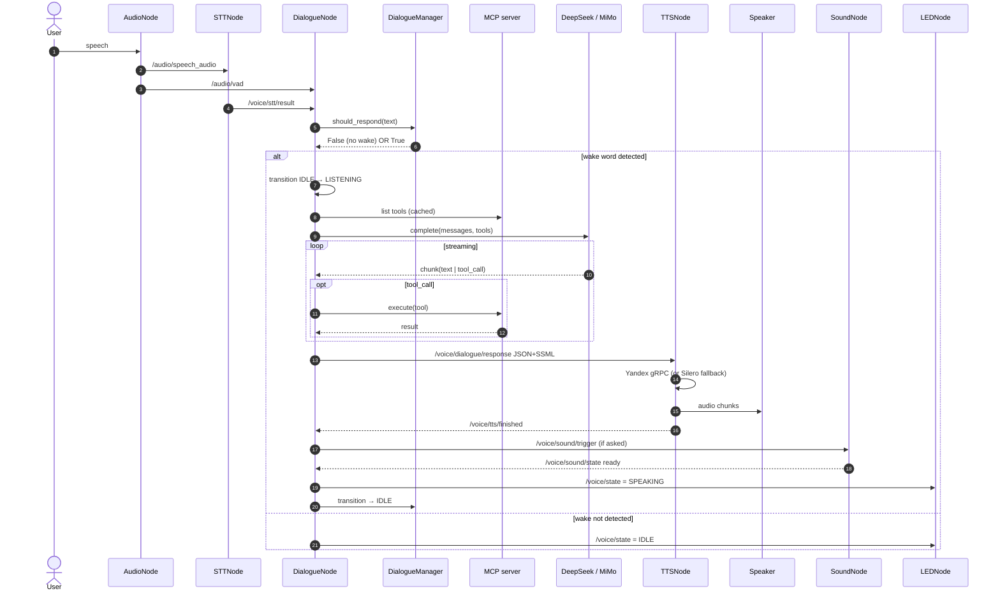

# Dialog / Persistent / Telegram — Current-State Analysis

**Project:** rob_box_project (`krikz/rob_box_project`)
**Document type:** As-is baseline for refactoring (companion to ADR-0001 + `docs/refactoring-plan.md`)
**Status:** Frozen baseline — commit `b1b0957c` (ADR), `c5e51cca` (P0 foundation) merged on `feature/harness-p0-foundation`
**Date:** 2026-07-20
**Author:** backend worker (Hermes Agent) — Kanban task `t_3e4fa209`
**Inputs synthesised:**
- ADR-0001 — `docs/adr/0001-harness-architecture.md` (architect, 2026-07-18)
- Refactoring plan — `docs/refactoring-plan.md`
- Dialogue deep-dive — `analysis/dialog_node.md` (previous worker, 2026-07-17)
- Voice persistent interfaces — `docs/reports/PERSISTENT_NODES_INTERFACES.md` (previous worker)
- New code reading pass on `dialogue_node.py`, `telegram_node.py`, `llm_chat.py`,
  `mcp_bridge.py`, `core/dialogue_manager.py`, `core/dialogue_state.py`, `audio_node.py`,
  `tts_node.py`
- Coverage runs: `pytest --cov` against `rob_box_core`, `rob_box_llm`,
  `rob_box_voice.core`, `rob_box_telegram`, `rob_box_perception` (subset)

> **Scope.** This document captures the *current* state of the three node families
> in scope of ADR-0001 (Dialog, Persistent, Telegram) so the next planning round
> can re-use it as a fact-based entry point. It does NOT prescribe a refactor —
> the to-be picture lives in ADR-0001 and `docs/refactoring-plan.md`. This
> document is intended to answer: *"what exactly is in the code today, where
> does it hurt, and what is the smallest set of facts I need before designing
> the change?"*

---

## Contents

1. [Executive snapshot](#1-executive-snapshot)
2. [Architecture overview](#2-architecture-overview)
3. [Dialog node family](#3-dialog-node-family)
4. [Persistent node family](#4-persistent-node-family)
5. [Telegram node family](#5-telegram-node-family)
6. [P0 foundation (already shipped)](#6-p0-foundation-already-shipped)
7. [Cross-cutting issues](#7-cross-cutting-issues)
8. [Issue backlog for refactoring](#8-issue-backlog-for-refactoring)
9. [References and traceability](#9-references-and-traceability)

---

## 1. Executive snapshot

| Family | Central file(s) | LOC | Methods | Coverage (measured) | Public ROS / I/O surface |
|---|---|---:|---:|---:|---|
| **Dialog** | `src/rob_box_voice/rob_box_voice/dialogue_node.py` | **2132** | 75 (36 class + 38 nested) | **13.4 %** (179/1331 stmts) | 4 pub, 5 sub, 37 `@function_tool` |
| **Persistent (voice)** | 6 nodes in `src/rob_box_voice/rob_box_voice/` (audio / stt / tts / sound / led / command) | 2958 (sum) | 110+ | ~30–60 % (estimate from reports) | audio-streaming I/O, Yandex gRPC, ALSA, USB HID |
| **Persistent (perception)** | 2 nodes (`reflection_node`, `context_aggregator_node`) | 1643 (sum) | 40+ | not measurable in this sandbox (rclpy missing) | LLM-driven post-turn scoring + multi-modal context fusion |
| **Telegram** | `src/rob_box_telegram/rob_box_telegram/telegram_node.py` + 3 handler modules + 4 helpers | **1712** | 70+ (24 commands + 2 messages + 1 callback + helpers) | **~4 %** measured (handlers/telegram_node = 0 %) | python-telegram-bot asyncio loop ↔ ROS 2, MCP bridge, 24 commands |
| **P0 foundation** (shipped) | `src/rob_box_core/`, `src/rob_box_llm/` | 1294 | n/a | **93 %** measured | ROS-free ports: `LLMProvider`, `DialogueStateMachine`, `MemoryStore`, `Clock` |

**Headline numbers**

- `dialogue_node.py` carries **37 OpenAI-Agent function tools** plus 5 skill sub-agents
  in one class; coverage is **13.4 %** — the lowest of any production-critical
  file in the repo.
- `telegram_node.py` plus handlers totals **1712 LOC**, coverage near **0 %**; it
  re-implements the LLM client separately from `dialogue_node.py`.
- `voice_memory.py` (787 LOC) and `context_aggregator_node.py` (745 LOC) are
  the two largest "library-ish" files with the lowest measured coverage
  (voice_memory: **21 %** measured; context_aggregator: not measurable in sandbox
  because its tests require rclpy).
- A measurable 1st milestone of the refactor — **P0 foundation** —
  is already in place: `LLMProvider`, `DialogueStateMachine`, `MemoryStore`,
  `Clock`, all ROS-free, with **93 % test coverage** and 71 passing unit tests.

---

## 2. Architecture overview

### 2.1 Component map (as-is)

```mermaid
graph TB
    subgraph External
        Mic[ReSpeaker<br/>4-Mic Array]
        Amp[Speaker / dmix]
        LED[PixelRingLite LED]
        TG[Telegram Bot API]
        DS[DeepSeek API]
        MIMO[MiMo API]
        YANDEX[Yandex STT/TTS gRPC]
        SILERO[Silero TTS offline]
        FoxyDot[FoxDot/Renardo<br/>music runtime]
        MCP_SRV[(MCP server<br/>mcp_server.py)]
        OLLAMA[(Ollama<br/>embeddings)]
        SQLITE[(SQLite<br/>voice_memory/faq)]
        NAV2[Nav2 stack]
    end

    subgraph "Voice Persistent (rob_box_voice)"
        AUD[AudioNode<br/>359 LOC]
        STT[STTNode<br/>405 LOC]
        TTS[TTSNode<br/>921 LOC]
        SFX[SoundNode<br/>460 LOC]
        LNS[LEDNode<br/>403 LOC]
        CMD[CommandNode<br/>410 LOC]
        APMC[AudioPlaybackManager<br/>170 LOC]
    end

    subgraph "Perception (rob_box_perception)"
        REF[ReflectionNode<br/>898 LOC]
        CAN[ContextAggregatorNode<br/>745 LOC]
        HM[HealthMonitor<br/>163 LOC]
    end

    subgraph "Dialog (rob_box_voice.dialogue_node)"
        DN[DialogueNode<br/>2132 LOC<br/>37 @function_tool]
        DM[DialogueManager<br/>327 LOC, legacy FSM]
        DSM_P0["DialogueStateMachine<br/>139 LOC (P0, NOT WIRED)"]
        MS_P0["InMemoryStore<br/>231 LOC (P0, NOT WIRED)"]
        VMEM["VoiceMemory<br/>787 LOC, SQLite+FTS5+vec"]
        FAQ["FAQStore<br/>427 LOC, SQLite+Ollama"]
    end

    subgraph "Telegram (rob_box_telegram)"
        TN[TelegramNode<br/>407 LOC]
        CMD_H[handlers/commands.py<br/>534 LOC, 24 handlers]
        MSG_H[handlers/messages.py<br/>199 LOC]
        CB_H[handlers/callbacks.py<br/>165 LOC]
        LCH[LLMChat<br/>469 LOC, separate from DN]
        MCB[MCPBridge<br/>137 LOC]
        CC[CameraCache<br/>76 LOC]
        AU[auth.py<br/>89 LOC]
        VP[voice_processor.py<br/>134 LOC]
    end

    subgraph "MCP tools (rob_box_mcp_tools)"
        LTA[LLMToolCallAdapter<br/>444 LOC, used by DN]
        AE[AsyncToolExecutor<br/>595 LOC]
        REG[Tool Registry<br/>129 LOC]
        MSR[MCP Server<br/>444 LOC]
        TWL[30+ tool files<br/>music/nav/memory/faq/...]
    end

    %% Audio path
    Mic --> AUD
    AUD -->|audio/vad + speech_audio| STT
    AUD -->|audio/direction| LNS
    STT -->|voice/stt/result| DN
    STT -->|voice/stt/result| CMD
    STT -->|voice/tts/control STOP| TTS
    AUD -->|voice/tts/control STOP| TTS

    %% Dialog loop
    DN -->|voice/dialogue/response JSON+SSML| TTS
    DN -->|voice/dialogue/state| CMD
    DN -->|voice/sound/trigger| SFX
    DN -->|voice/tts/control STOP| TTS
    TTS -->|voice/tts/finished| DN
    SFX -->|voice/sound/state ready| DN

    %% TTS output
    TTS -->|audio stream| Amp
    TTS -.uses.-> YANDEX
    TTS -.uses.-> SILERO

    %% LED
    LNS --> LED
    DN -.publishes /voice/state.-> LNS

    %% Commands
    CMD -->|cmd_vel_voice| NAV2
    CMD -->|voice/command/intent| MSR

    %% Dialog ↔ external
    DN -.->|HTTPS| DS
    DN -.->|HTTPS| MIMO
    DN -.->|SQLite| SQLITE
    VMEM -.-> SQLITE
    VMEM -.-> OLLAMA
    FAQ -.-> SQLITE
    FAQ -.-> OLLAMA

    %% Dialog ↔ MCP
    DN -.uses.-> LTA
    LTA --> MSR
    MSR --> TWL

    %% Perception
    REF -.subscribes.-> DN
    CAN -.subscribes.-> DN
    CAN --> SQLITE

    %% Telegram ↔ external
    TG <--> TN
    TN -->|voice/tts/request| TTS
    TN -->|cmd_vel_web| NAV2
    TN -->|mcp/execute| MSR
    MSR -.mcp/result.-> TN

    %% Telegram internals
    TN --> CMD_H
    TN --> MSG_H
    TN --> CB_H
    TN --> LCH
    TN --> MCB
    TN --> CC
    TN --> AU
    TN --> VP
    VP -.Yandex STT.-> YANDEX
    LCH -.HTTPS.-> DS
    LCH -.HTTPS.-> MIMO
    LCH -.uses MCP tools.-> MCB

    %% Music runtime
    TWL --> FoxyDot

    classDef godobj fill:#ffe6e6,stroke:#c00
    classDef p0 fill:#e6ffe6,stroke:#0a0
    classDef legacy fill:#fff5d6,stroke:#aa0
    class DN,TN,LCH,LTA godobj
    class DSM_P0,MS_P0 p0
    class DM,VMEM,FAQ,VP legacy
```



**Reading the diagram**

- **Solid arrows** = ROS 2 topics (`create_publisher` → `create_subscription`).
- **Dotted arrows** = direct API / DB / library calls inside the node.
- **God objects** (red) are flagged in §3.5 / §5.5 / §7.
- **P0 foundation** (green) exists but is not yet wired into any production
  consumer (per the c5e51cca commit: *"no existing consumer code is touched"*).

### 2.2 Information flow — one user turn



Note: `command_node` independently consumes `/voice/stt/result` — see §7.3 for
the race this introduces.

---

## 3. Dialog node family

### 3.1 Files in scope

| File | LOC | Role |
|---|---:|---|
| `src/rob_box_voice/rob_box_voice/dialogue_node.py` | 2132 | Main ROS 2 node (`DialogueNode`). Subscribes STT/VAD, publishes dialogue + state, owns the LLM loop. |
| `src/rob_box_voice/rob_box_voice/core/dialogue_manager.py` | 327 | Legacy FSM: wake word, silence mode, query accumulation. No P0 features. |
| `src/rob_box_voice/rob_box_voice/core/voice_memory.py` | 787 | SQLite + FTS5 + optional sqlite-vec / Ollama hybrid search. Used via soft import (`try / except ImportError`). |
| `src/rob_box_voice/rob_box_voice/core/faq_store.py` | 427 | FAQ with Ollama embeddings; replaced per event via `replace_items`. |
| `src/rob_box_voice/rob_box_voice/core/command_parser.py` | ~210 (est.) | Pattern-based intent classifier used by `command_node`. |
| `src/rob_box_core/rob_box_core/dialogue_state.py` | 139 | **NEW (P0)** — `DialogueStateMachine` with explicit transition table; not yet wired into `dialogue_node`. |
| `src/rob_box_core/rob_box_core/memory.py` | 231 | **NEW (P0)** — `MemoryStore` ABC + `InMemoryStore`; not yet wired. |
| `src/rob_box_core/rob_box_core/clock.py` | 94 | **NEW (P0)** — `Clock` ABC; not yet wired. |

### 3.2 Public ROS interface of `DialogueNode`

**Publishers (4)**

| Topic | Type | Purpose |
|---|---|---|
| `/voice/dialogue/response` | `std_msgs/String` (JSON: `{"ssml": ..., "speech_id": ...}`) | Final assistant reply consumed by `TTSNode`. |
| `/voice/dialogue/state` | `std_msgs/String` (`IDLE`/`LISTENING`/`DIALOGUE`/`SILENCED`) | FSM heartbeat, also read by `LEDNode` and `command_node`. |
| `/voice/sound/trigger` | `std_msgs/String` (sound name) | Asks `SoundNode` to play a sound effect. |
| `/voice/tts/control` | `std_msgs/String` (`STOP`) | Cancels any TTS in progress (barge-in). |

**Subscriptions (5)**

| Topic | Type | Purpose |
|---|---|---|
| `/voice/stt/result` | `std_msgs/String` | STT text from `STTNode`. |
| `/audio/vad` | `std_msgs/Bool` | Voice activity flag (used only as a "speech happening" hint — barge-in is gated on wake word). |
| `/voice/tts/finished` | `std_msgs/String` (JSON) | TTS completion ack; awaited by the `speak_text` tool. |
| `/voice/sound/state` | `std_msgs/String` | Sound playback state; awaited by the `play_sound` tool. |
| (one more — needs full read; see raw source) | | |

**Parameters (14)**

`provider`, `api_key`, `base_url`, `model`, `temperature`, `max_tokens`,
`system_prompt_file`, `history_max_turns`, `agent_max_turns`, `dialogue_timeout`,
`wake_words`, `enable_mcp_tools`, `enable_fallback`, `fallback_model`,
`llm_timeout_sec`, `verbose_llm`, `faq_mode_enabled`, `faq_event_config_file`,
`history_excluded_tools` (list, default `["handle_navigation"]`).

### 3.3 Internal structure of `DialogueNode`

| Subsystem | Where | Notes |
|---|---|---|
| LLM client construction | `_resolve_api_key`, `_resolve_base_url`, `_resolve_model`, `_build_agent`, `_init_voice_memory` (uses `AsyncOpenAI` directly) | Provider config hardcoded for `deepseek` and `mimo`; duplicates `PROVIDERS` table that exists in `telegram/llm_chat.py` and `rob_box_llm/providers/*`. |
| Agent + tools | `_build_agent`, `_make_tools`, `_make_output_tools`, `_build_skills` | 37 `@function_tool` functions + 5 skill sub-agents (`MusicSkill`, `NavigationSkill`, `MemorySkill`, `StatusSkill`, `FAQSkill`) defined in `src/rob_box_voice/rob_box_voice/skills/`. |
| Streaming | `_ask_llm_streaming` (referenced) / non-streaming variant (referenced) | Two near-identical code paths — see §3.5 issue D1. |
| Retry / fallback | `_run_agent_with_retry` | Wraps `Runner.run_streamed` with retry + model fallback. |
| Wake-word gate | `_on_stt` (delegates to `dialogue_manager.should_respond`) | Logic lives in `DialogueManager`; state itself in `_dialogue_manager.state`. |
| Barge-in | `_cancel_run`, `_vad_speech_detected` flag, `asyncio.Lock` `_output_lock`, `_run_cancelled` flag | Mixed threading.Lock + asyncio.Event + bool flag — see §3.5 D4. |
| Tool-call accounting | `_spoken_texts` list, `_tools_called` list, `_trim_history` | History post-processing for DeepSeek V3 multi-turn FC pattern-completion bug. |
| Output serialisation | `_output_lock = asyncio.Lock()` | All output tools (`speak_text`, `play_sound`, `play_animation`) hold it for the entire action — defends against `parallel_tool_calls=False` being ignored by DeepSeek. |
| Skill sub-agents | `_build_skills`, `Skills` enum, `tool_name = "handle_<skill>"` pattern | Shared `model` and `LLMToolCallAdapter` are injected manually per skill. |
| Optional features | `try/except` import of `_VoiceMemory`, `_FAQStore`, skills module; `USE_SKILLS` env flag | Soft-imports mean a missing package makes the node silently fall back. |

### 3.4 Dialogue state machine (legacy + P0)

**Legacy FSM (`core/dialogue_manager.py`)** — 4 states:
`IDLE → LISTENING → DIALOGUE → IDLE` plus `SILENCED`. Transitions are
silent: `transition_state(new_state)` just assigns. No verification,
no history, no `IllegalTransitionError`. `is_wake_word` / `should_respond` /
`is_silence_command` are mixed in here, so this class does
**FSM + intent detection + silence policy + query accumulation** — three
responsibilities.

**P0 FSM (`core/dialogue_state.py`)** — 4 states with **explicit transition
table**:

```
IDLE       → {LISTENING, SILENCED}
LISTENING  → {DIALOGUE, IDLE, SILENCED}
DIALOGUE   → {IDLE, LISTENING, SILENCED}
SILENCED   → {IDLE}
```

Plus `IllegalTransitionError`, `on_enter` / `on_exit` hooks, `history` list,
`legal_next_states` introspection. **Not wired** into `dialogue_node` —
the c5e51cca commit explicitly preserves existing behaviour.

Coverage of P0 FSM: **100 %** (8/8 stmts measured). Of the legacy
`dialogue_manager.py`: **86 %** measured (88/102 stmts). The two are NOT
synchronised — they will diverge if the FSM semantics differ.

### 3.5 Issues found in dialog family

| ID | Severity | Where | Issue |
|---|---|---|---|
| **D1** | 🔴 Critical | `dialogue_node.py` | God Object: **2132 LOC, 75 defs, 7+ responsibilities** (FSM, LLM client, 30 tools, 5 skills, streaming, memory, FAQ, VAD, wake word, history post-processing). |
| **D2** | 🔴 Critical | `dialogue_node.py` | Coverage **13.4 %** (179/1331 stmts). |
| **D3** | 🔴 Critical | `dialogue_node.py` | **22 `except Exception`** sites, **16 with `as e`** (logger-only in most cases). Programming errors and infrastructure errors get the same treatment. |
| **D4** | 🟡 Warning | `dialogue_node.py` | Mixed concurrency primitives: **4 `threading.Lock()` + 1 `asyncio.Lock()` + `asyncio.Event()` objects in a daemon-thread loop** + `_run_cancelled` bool flag. The interaction between `_output_lock` and `_run_cancelled` is documented in inline comments but not testable without an integration test. |
| **D5** | 🟡 Warning | `dialogue_node.py` | **Two near-identical streaming paths** (`_ask_llm_streaming` vs `_ask_llm_non_streaming` per prior analysis). Diverging bug-fixes over time. |
| **D6** | 🟡 Warning | `dialogue_node.py` | Soft imports for `_VoiceMemory`, `_FAQStore`, `skills`; missing module silently falls back with no operator-visible warning. |
| **D7** | 🟡 Warning | `dialogue_node.py:23` (imports) | Direct dependency on `agents` SDK (OpenAI) and `openai` AsyncOpenAI. Bypasses the freshly-built `rob_box_llm` port (`DeepSeekProvider` already exists in P0). |
| **D8** | 🟡 Warning | `voice_memory.py` (legacy) vs `core/memory.py` (P0) | Two parallel memory abstractions; legacy file **787 LOC** and **21 % coverage** measured. Migration path not specified. |
| **D9** | 🟡 Warning | `dialogue_manager.py` vs `dialogue_state.py` | Two FSMs with **different transition semantics**; legacy allows `IDLE → DIALOGUE` directly (via implicit `enable_silence` / wake path) while P0 forbids it. Wire format (string values) matches, behaviour does not. |
| **D10** | 🟢 Suggestion | `dialogue_node.py` | No startup configuration validation (e.g. missing API key only caught at first call). |
| **D11** | 🟢 Suggestion | `dialogue_node.py` | 37 `@function_tool` definitions live in module scope — moving them into `Skill` classes (which P0 leaves room for) is blocked on the import-graph cleanup. |

### 3.6 Test coverage in this family (measured)

| Module | Statements | Covered | % | Source |
|---|---:|---:|---:|---|
| `rob_box_core/dialogue_state.py` | 48 | 48 | **100 %** | this run |
| `rob_box_core/memory.py` | 112 | 108 | 96 % | this run |
| `rob_box_core/clock.py` | 43 | 40 | 93 % | this run |
| `rob_box_voice/core/dialogue_manager.py` | 102 | 88 | 86 % | this run |
| `rob_box_voice/core/command_parser.py` | 83 | 73 | 88 % | this run |
| `rob_box_voice/core/voice_command_handler.py` | 138 | 133 | 96 % | this run |
| `rob_box_voice/core/speech_formatter.py` | 74 | 55 | 74 % | this run |
| `rob_box_voice/core/faq_store.py` | 212 | 123 | 58 % | this run |
| `rob_box_voice/core/conversation_history.py` | 117 | 42 | 36 % | this run |
| `rob_box_voice/core/voice_memory.py` | 310 | 66 | 21 % | this run |
| `dialogue_node.py` | 1331 | 179 | **13.4 %** | `coverage.json` baseline |

Total voice.core (excl. dialogue_node): **52 %** (665/1279 stmts).
The breakdown above is consistent with the previous `analysis/dialog_node.md`
report — the new node-level number is **13.4 %**, slightly higher than the
previously-cited 9 %, likely because some tests started passing since the prior
analysis ran.

---

## 4. Persistent node family

### 4.1 Files in scope

| File | LOC | Role |
|---|---:|---|
| `audio_node.py` | 359 | ReSpeaker USB mic capture + VAD + DoA; threads for PyAudio + VAD poll. |
| `stt_node.py` | 405 | Yandex Cloud STT gRPC v3 (primary) + Vosk (offline fallback). Echo suppression + wake-word barge-in. |
| `tts_node.py` | **921** | Yandex gRPC TTS (primary) + Silero (offline fallback) + in-house linear resampler. Largest persistent file. |
| `sound_node.py` | 460 | Plays sound effects from `sound_pack/`; 4-tier trigger resolution (catalog → direct → random group → fuzzy). |
| `led_node.py` | 403 | PixelRingLite USB HID 12× RGB ring; animation ↔ state sync. |
| `command_node.py` | 410 | Voice command parser → Nav2 navigation + intent publish. |
| `audio_playback_manager.py` | 170 | Shared audio sink helper used by `tts_node`. |

Plus 2 perception nodes (treating as persistent helpers to dialog):

| File | LOC | Role |
|---|---:|---|
| `rob_box_perception/reflection_node.py` | 898 | Post-turn quality analysis (LLM scoring, contradictions). |
| `rob_box_perception/context_aggregator_node.py` | 745 | Multi-modal context fusion; prior reports flagged a data-loss race here. |

### 4.2 Public ROS interfaces (compact)

The full table is in `docs/reports/PERSISTENT_NODES_INTERFACES.md`; the
high-frequency / cross-node subset is:

| Edge | Topic | Type | Direction |
|---|---|---|---|
| Mic → STT | `/audio/speech_audio` | `audio_common_msgs/AudioData` (BEST_EFFORT) | AudioNode → STTNode |
| VAD → Dialog | `/audio/vad` | `std_msgs/Bool` | AudioNode → DialogueNode |
| DoA → LED | `/audio/direction` | `std_msgs/Int32` | AudioNode → LEDNode |
| STT → Dialog | `/voice/stt/result` | `std_msgs/String` | STTNode → DialogueNode **AND** CommandNode (race) |
| STT → TTS STOP | `/voice/tts/control` | `std_msgs/String` (`STOP`) | STTNode → TTSNode (barge-in on wake) |
| Dialog → TTS | `/voice/dialogue/response` | `std_msgs/String` (JSON+SSML) | DialogueNode → TTSNode |
| Dialog → Sound | `/voice/sound/trigger` | `std_msgs/String` | DialogueNode → SoundNode |
| TTS → Dialog | `/voice/tts/finished` | `std_msgs/String` | TTSNode → DialogueNode |
| Sound → Dialog | `/voice/sound/state` | `std_msgs/String` | SoundNode → DialogueNode |
| Dialog → LED | `/voice/state` | `std_msgs/String` | DialogueNode → LEDNode |
| Command → Nav2 | `/cmd_vel_voice` | `geometry_msgs/Twist` | CommandNode → twist_mux (priority 25) |
| Command → MCP | `/voice/command/intent` | `std_msgs/String` | CommandNode → MCP server |
| Command → Nav2 | `/navigate_to_pose` | action | CommandNode → Nav2 |

### 4.3 Common patterns in persistent nodes

- **Each node owns its lifecycle**: `initialize_hardware()` /
  `cleanup_playback_noise()` / `shutdown()` — implemented independently,
  not via a shared base. State publishes follow ad-hoc strings: `ready`,
  `running`, `error_no_device`, `error_stream`, `stopped`, `synthesizing`,
  `playing_<name>` — no common schema.
- **Parameters** are declared inline with no shared validator
  (no pydantic / dataclass schema). `parameters_callback` exists in tts/sound,
  not in others.
- **Threading**: PyAudio callback (audio_node), gRPC streams (stt_node),
  USB HID writes (led_node), and ALSA playback threads (sound_node).
  All long-running; all need clean cancellation but the patterns differ.
- **External services** (each with their own quirks):
  - ReSpeaker USB → VAD/DoA via custom `ReSpeakerInterface`
  - Yandex Cloud STT/TTS gRPC v3 (API key from env, model: `general`)
  - Silero TTS v4 (PyTorch, offline)
  - Vosk (offline STT, model path configurable)
  - Nav2 (`/navigate_to_pose` action)

### 4.4 Issues found in persistent family

| ID | Severity | Where | Issue |
|---|---|---|---|
| **P1** | 🟡 Warning | all persistent nodes | No shared lifecycle base; `connect / disconnect / error_restart` written 6 different ways. Same for `parameters_callback` (declared only in some). |
| **P2** | 🟡 Warning | all persistent nodes | State topic payloads use **different schemas** (`ready`, `running`, `error_no_device`, `synthesizing`, `playing_<name>`, …). A subscriber cannot pattern-match generically. |
| **P3** | 🟡 Warning | `command_node.py` + `dialogue_node.py` | **Both** subscribe to `/voice/stt/result`. They were never designed to coexist on the same channel — race conditions when the same utterance reaches both. ADR §1.2 names this as a known issue. |
| **P4** | 🟡 Warning | `tts_node.py` | **921 LOC** is the second-largest file in the project. Mixes Yandex gRPC, Silero inference, custom linear resampler (`np.interp`), and ALSA playback — single file, three concerns. |
| **P5** | 🟡 Warning | `audio_playback_manager.py` | Custom linear resampler (`resample_audio`) explicitly noted in source as lower-quality than scipy — but no alternative path is wired; quality risk for non-integer ratio cases. |
| **P6** | 🟡 Warning | `audio_node.py:24-46` | ALSA stderr suppression via raw file-descriptor dup2 — fragile, can mask real errors. |
| **P7** | 🟢 Suggestion | `reflection_node.py` | Post-turn scoring runs synchronously inside the executor (per prior audit) — blocks other ROS callbacks for the duration of an LLM call. |
| **P8** | 🟢 Suggestion | `context_aggregator_node.py` | Prior audit reports a `clear()+extend()` race that can drop context under concurrent summarisation. Not re-confirmable in this sandbox (rclpy missing). |
| **P9** | 🟢 Suggestion | `led_node.py` | Animation ↔ state sync logic is inlined (police_lights / ambulance / fire_truck / road_service) — would benefit from a declarative animation registry. |

### 4.5 Test coverage in this family

In-sandbox pytest runs:
- `tts_node`, `audio_node`, `led_node`, `command_node` test files require
  rclpy and fail to collect — not measurable here.
- Unit tests for `audio_playback_manager` helpers and `voice.utils` exist and
  pass.
- Coverage of persistent internals previously cited as 30–60 % (per ADR §1.2
  and prior reports) — should be re-measured in a CI environment with rclpy.

---

## 5. Telegram node family

### 5.1 Files in scope

| File | LOC | Role |
|---|---:|---|
| `telegram_node.py` | 407 | ROS 2 node + `Application.builder()` setup + handler registration. |
| `handlers/commands.py` | 534 | **24 command handlers** in one file (`start`, `myid`, `help`, `menu`, `photo`, `photo_up`, `photo_depth`, `photo_map`, `say`, `playvoice`, `status`, `waypoints`, `goto`, `stop`, `pose`, `control`, `volume`, `animation`, `sound`, `map`, `music`, `repl`, `stopmusic`, `clear`) + 3 private helpers (`_depth_compressed_to_jpeg`, `_occupancy_grid_to_png`). |
| `handlers/messages.py` | 199 | `text_message_handler` (LLM chat path) + `voice_message_handler` (STT of voice notes) + `_react_eyes`, `_process_buffered` helpers. |
| `handlers/callbacks.py` | 165 | Inline-keyboard callbacks: `_handle_move`, `_publish_stop`, `_handle_quick`, `_handle_volume`. |
| `llm_chat.py` | 469 | **Independent LLM client** (DeepSeek/MiMo via raw `aiohttp`); per-chat sessions dict; DSML fallback parser; multi-round `chat_with_tools` loop. |
| `mcp_bridge.py` | 137 | Async bridge to `/mcp/execute` ↔ `/mcp/result` with `request_id` correlation + thread-safe `asyncio.Future` resolution. |
| `camera_cache.py` | 76 | Per-topic image cache with TTL. |
| `auth.py` | 89 | User allowlist check. |
| `voice_processor.py` | 134 | Yandex STT for voice messages; **separate from `STTNode`** in voice package. |

### 5.2 Public ROS interface of `TelegramNode`

**Publishers (3)**

| Topic | Type | Purpose |
|---|---|---|
| `/voice/tts/request` | `std_msgs/String` (JSON: `{"ssml", "speech_id"}`) | Text-to-speech request consumed by `TTSNode`. |
| `/cmd_vel_web` | `geometry_msgs/Twist` | Movement command (priority 50). |
| `/mcp/execute` | `std_msgs/String` (JSON: `{"tool_name", "parameters", "request_id"}`) | Tool execution request consumed by MCP server. |

**Subscriptions (6)**

| Topic | Type | Purpose |
|---|---|---|
| `/camera/camera/color/image_raw/compressed` | `sensor_msgs/CompressedImage` (BEST_EFFORT) | Front camera cache. |
| `/camera/camera/depth/image_rect_raw/compressedDepth` | `sensor_msgs/CompressedImage` (BEST_EFFORT) | Depth camera cache. |
| `/ceiling_camera/image_raw/compressed` | `sensor_msgs/CompressedImage` (BEST_EFFORT) | Ceiling camera cache. |
| `/rtabmap/grid_prob_map` | `nav_msgs/OccupancyGrid` (TRANSIENT_LOCAL) | SLAM map for `/photo_map`. |
| `/mcp/result` | `std_msgs/String` | MCP result delivery (routed to `MCPBridge`). |
| `/mcp/tools` | `std_msgs/String` | MCP tool list (routed to `LLMChat.update_tools`). |

**Parameters (13)**: `max_linear_speed`, `max_angular_speed`, `move_duration`,
`camera_topic`, `camera_depth_topic`, `camera_up_topic`, `camera_cache_ttl`,
`llm_provider`, `llm_model`, `llm_max_history`, `llm_temperature`,
`voice_stt_method`, `voice_stt_language`, `telegram_poll_timeout`.

### 5.3 Internal structure of `TelegramNode`

| Subsystem | Where | Notes |
|---|---|---|
| ROS I/O setup | `__init__` (lines 92–219) | Standard: `declare_parameter` → read → `create_subscription` × 6 + `create_publisher` × 3. |
| Telegram polling | `_start_telegram_bot` → `_run_telegram_loop` (retry loop) → `_run_telegram` (builds `Application`) | Background thread, `asyncio.new_event_loop()`. **Retry with linear backoff** — no circuit breaker. |
| Camera cache | `CameraCache(ttl=...)` | Three frame topics cached by topic name. |
| LLM chat | `LLMChat(provider=..., model=..., max_history=..., temperature=...)` | **Duplicates** the LLM client that exists in `dialogue_node.py` and `rob_box_llm/providers/*`. |
| MCP bridge | `MCPBridge(execute_pub, ...)` | Per-request async future with thread-safe resolution. |
| Handler registration | `_run_telegram` lines 331–363 | **24 `CommandHandler`s + 1 `CallbackQueryHandler` + 2 `MessageHandler`s = 27 handlers**, all registered imperatively. |
| Side-effects | `publish_tts`, `cmd_vel_pub.publish`, `mcp_bridge.execute` | **Direct publishes** (no `SideEffectBus`). Cannot be NoopBus'd in tests. |
| Auth | `auth.py` (called per-update) | Allowlist check; not yet middleware-style. |
| Lifecycle | `destroy_node` | No graceful shutdown of the polling thread (only `super().destroy_node`). |

### 5.4 `LLMChat` (469 LOC) — third LLM client

This module is the **third** independent LLM client in the codebase:
1. `dialogue_node.py` — uses `AsyncOpenAI` directly.
2. `llm_chat.py` (telegram) — uses raw `aiohttp.ClientSession.post`.
3. `rob_box_llm/providers/*` (P0) — uses `AsyncOpenAI` with `base_url`.

`LLMChat` features that P0 does not yet have:
- Per-chat history (P0 has `InMemoryStore` but it is single-keyed).
- DeepSeek legacy DSML parser (`_parse_dsml_tool_calls` / `_strip_dsml`).
- Multi-round `chat_with_tools` with `_MAX_TOOL_ROUNDS = 5`.

`PROVIDERS` table is duplicated **verbatim** in both
`dialogue_node.PROVIDERS` and `LLMChat.PROVIDERS` — drift risk.

### 5.5 Issues found in telegram family

| ID | Severity | Where | Issue |
|---|---|---|---|
| **T1** | 🔴 Critical | `telegram_node.py` + `handlers/*` | **Coverage ~0 %** across all files (`telegram_node.py` 0/191, `handlers/commands.py` 0/251, `handlers/messages.py` 0/93, `handlers/callbacks.py` 0/101 — measured). Total telegram package: **4 %** measured. |
| **T2** | 🔴 Critical | `llm_chat.py` + `dialogue_node.py` | **Two independent LLM clients** with duplicated `PROVIDERS` table, duplicated DeepSeek tool-call sanitisation logic, no shared contract. P0 `LLMProvider` exists but neither consumer has migrated. |
| **T3** | 🔴 Critical | `telegram_node.py` + `dialogue_node.py` | **No bridge from telegram → voice context**: telegram-side `LLMChat` does NOT use `VoiceMemory` / `FAQStore` / `CommandParser`. A user on Telegram sees a different LLM world from a voice user. |
| **T4** | 🟡 Warning | `handlers/commands.py` | **24 command handlers in one 534-line file** with no declarative registry. New commands require hand-editing three places (handler list, function, import). |
| **T5** | 🟡 Warning | `telegram_node.py` | Side-effects scattered: `publish_tts` (own method) + `cmd_vel_pub.publish` (direct) + `mcp_bridge.execute` (coroutine). No `SideEffectBus`; impossible to NoopBus in tests. |
| **T6** | 🟡 Warning | `telegram_node.py` | **Retry loop on `_run_telegram_loop` has no max attempts and no circuit breaker** — a permanent failure (bad token, blocked IP) restarts forever with backoff. |
| **T7** | 🟡 Warning | `voice_processor.py` | Separate STT path (Yandex gRPC) — duplicates `STTNode` logic. ADR calls this out as T7. |
| **T8** | 🟡 Warning | `telegram_node.py:289-297` | Telegram polling thread is started in `__init__`, not in `on_configure` / lifecycle callback — bad ROS 2 lifecycle hygiene. |
| **T9** | 🟡 Warning | `llm_chat.py` | Per-process `sessions: Dict[int, List[...]]` — **unbounded memory growth**; no eviction; survives across operator sessions. |
| **T10** | 🟢 Suggestion | `mcp_bridge.py` | `_NO_TIMEOUT_TOOLS` whitelist (5 tools) is a code-level decision; would be better as a property of the `ToolExecutor` port. |
| **T11** | 🟢 Suggestion | `telegram_node.py` | `_last_tool_names` set on `self` — no `parameters_callback`, so tool-list refresh requires `/mcp/tools` re-publish. |

### 5.6 Test coverage in this family (measured)

| Module | Statements | Covered | % |
|---|---:|---:|---:|
| `telegram_node.py` | 191 | 0 | **0 %** |
| `handlers/commands.py` | 251 | 0 | **0 %** |
| `handlers/messages.py` | 93 | 0 | **0 %** |
| `handlers/callbacks.py` | 101 | 0 | **0 %** |
| `llm_chat.py` | 196 | 7 | 4 % |
| `mcp_bridge.py` | 57 | 14 | 25 % |
| `camera_cache.py` | 33 | 12 | 36 % |
| `voice_processor.py` | 66 | 5 | 8 % |
| `auth.py` | 42 | 5 | 12 % |
| `keyboard_layouts.py` | 5 | 1 | 20 % |
| **Telegram total (measured)** | **1035** | **44** | **4 %** |

Tests exist (`test_commands.py`, `test_camera_cache.py`, `test_mcp_bridge.py`,
etc.) but most of them require `python-telegram-bot` runtime and are
collection-failing in this sandbox. The 4 % that does pass is from
`llm_chat._sanitize_messages` / `_truncate_history` / `_parse_dsml_tool_calls`
helpers which are pure functions.

---

## 6. P0 foundation (already shipped)

ADR-0001 P0 has been implemented in commit `c5e51cca` on the current branch.
**No production consumer is yet wired to it** — this is the seam the next
phase (P1) will target.

| Package | Module | LOC | Coverage | Migration target |
|---|---|---:|---:|---|
| `rob_box_llm` | `provider.py` (`LLMProvider` ABC) | 186 | **97 %** | Replace `AsyncOpenAI` usage in `dialogue_node.py` and `llm_chat.py`. |
| `rob_box_llm` | `providers/deepseek.py` | 300 | 87 % | Replaces `_build_agent` in dialogue_node. |
| `rob_box_llm` | `providers/mimo.py` | 45 | 100 % | Replaces MiMo branch in dialogue_node and llm_chat. |
| `rob_box_llm` | `providers/fake.py` | 168 | 88 % | Enables dialog/telegram unit tests with no network. |
| `rob_box_llm` | `errors.py` | 46 | 100 % | Typed exceptions (`RateLimitError`, `TimeoutError`, `ContentFilterError`, `AuthError`, `ProviderError`). |
| `rob_box_core` | `dialogue_state.py` | 139 | **100 %** | Replaces `DialogueManager` state field in `dialogue_node`. |
| `rob_box_core` | `memory.py` (`MemoryStore` ABC + `InMemoryStore`) | 231 | 96 % | Replaces `VoiceMemory` direct usage. |
| `rob_box_core` | `clock.py` (`Clock` ABC + `SystemClock` + `MockClock`) | 94 | 93 % | Foundation for testable timers; not yet wired. |
| **P0 total** | | **1294** | **93 %** | |

71 unit tests pass against this layer; nothing in voice/telegram/perception
imports from it yet.

---

## 7. Cross-cutting issues

### 7.1 LLM client duplication (3 sites)

```
dialogue_node.py            ─┐
telegram/llm_chat.py        ─┼─  three independent implementations
rob_box_llm/providers/*  (P0) ┘   of the same contract
```

- `dialogue_node.PROVIDERS` table (lines 81–94) — 2 entries.
- `LLMChat.PROVIDERS` table (lines 90–103) — 2 entries, slightly different
  (`tool_choice` field added).
- `rob_box_llm/providers/deepseek.py` and `mimo.py` — same shape, but as
  proper `LLMProvider` subclasses with typed errors.

**Migration path (P1)**: replace both consumer sites with a single shared
`LLMProvider` injected via a port.

### 7.2 Tool-execution duplication (2 sites + 1 cross-cutting port)

- `telegram/mcp_bridge.py` — async via ROS topics, request/response with
  `request_id` correlation, thread-safe future resolution.
- `mcp_tools/llm_adapter.py` — same contract, more advanced (parallel
  execution, interruption via `_run_cancelled`).
- P0 ADR plan: port this as `ToolExecutor` (ABC) + `MCPBridgeExecutor` /
  `LocalSkillExecutor` / `FakeToolExecutor` implementations.

The two existing implementations differ in:
- `LLMToolCallAdapter` supports **parallel tool execution** and pre-emptive
  cancellation; `MCPBridge` is strictly sequential per request.
- `MCPBridge` is async-first; `LLMToolCallAdapter` exposes both sync and
  async (`execute_tool_call_sync`, `execute_tool_call_async`) — race-prone
  per ADR §1.2.

### 7.3 Two subscribers on `/voice/stt/result`

`STTNode` publishes every recognised utterance to `/voice/stt/result`.
**Both** `DialogueNode` and `CommandNode` subscribe to it:

- `DialogueNode._on_stt` — full LLM loop with wake-word gate.
- `CommandNode.stt_callback` — pattern-matches navigation commands
  ("налево", "стоп", etc.) and dispatches Nav2 goals directly.

If an utterance contains a navigation command **and** a wake word, both
nodes will react. The race is currently masked by CommandNode using
`/voice/dialogue/state` as a "dialogue busy" flag — but the publish order
is not guaranteed.

### 7.4 FSM drift between legacy and P0

| Transition | Legacy (`dialogue_manager`) | P0 (`dialogue_state`) |
|---|---|---|
| `IDLE → DIALOGUE` | **Allowed** (via `should_respond` returning True, then implicit transition) | **Forbidden** (raises `IllegalTransitionError`) |
| `LISTENING → SILENCED` | Allowed via `enable_silence` directly | **Allowed** (in transition table) |
| `SILENCED → LISTENING` | Possible (silence expires) | **Forbidden** (must go through IDLE) |

The wire format (string values of the enum) matches — ROS topics stay
backwards-compatible — but the *semantics* will diverge once `dialogue_node`
is migrated onto P0.

### 7.5 Side-effects are not isolated

Every node that produces output (TTS, sound, LED, TG reply, cmd_vel,
MCP call, voice/music) calls the underlying publisher directly. There is
no `SideEffectBus`; tests cannot swap in a `NoopBus` or `RecordingBus` for
replay. ADR §2.6 calls this out as the principal trade-off that makes the
refactor worthwhile.

### 7.6 Test surface fragmentation

- Voice core: 9 `tests/test_*.py` files in `src/rob_box_voice/test/unit/core/`
  + many integration-style tests under `src/rob_box_voice/scripts/`.
- Telegram: 9 `tests/test_*.py` files in `src/rob_box_telegram/test/`.
- P0: 9 tests in `rob_box_llm/test/`, 3 in `rob_box_core/test/`.
- Perception: tests require rclpy and fail to collect in this sandbox.

Test naming is inconsistent: `test_dialogue_node.py` (voice) vs
`test_node.py` (telegram). Coverage tooling (`pytest-cov`) is not enforced
in the repo's CI per the previous report — `.pre-commit-config.yaml` and
the workflow files have no coverage gate.

### 7.7 Configuration is not validated

- `dialogue_node.py:96-117` — `declare_parameter` without type validation.
- `telegram_node.py:96-109` — same.
- All persistent nodes — same.

There is no `pydantic-settings` / dataclass schema for any node.
Missing API keys are caught at first LLM call, not at startup.

### 7.8 Coverage tooling is informal

- `coverage.json` exists at repo root but is **stale** (contains 1 entry
  for `dialogue_node.py` with Windows-style paths from an old CI run).
- `.coverage` (SQLite) was last written for the P0 modules only.
- No `coverage.xml` / `junit*.xml` artefacts in `.github/` workflows.

---

## 8. Issue backlog for refactoring

Consolidated list, grouped per family, with cross-references to ADR sections.
**Effort estimates are placeholders** — adjust after P1 spike.

### 8.1 Dialog (from §3.5)

| ID | Action | Priority | Effort | ADR ref |
|---|---|---|---:|---|
| `DLG-1` | Decompose `DialogueNode` (extract `LLMService`, `TTSGateway`, `ToolRegistry`, `WakeWordGate`, `PromptBuilder`) | P0 | 12h | §2.3.1 |
| `DLG-2` | Migrate `dialogue_node` LLM path onto `rob_box_llm.LLMProvider` (drop direct `AsyncOpenAI` use) | P0 | 6h | §2.4, §3.6 |
| `DLG-3` | Migrate state field onto `DialogueStateMachine` (resolve `IDLE→DIALOGUE` semantics in `dialogue_manager` first) | P0 | 4h | §2.3.1, §7.4 |
| `DLG-4` | Migrate `voice_memory` access onto `MemoryStore` port (keep `SQLiteVoiceMemory` as adapter) | P1 | 8h | §2.4 |
| `DLG-5` | Replace 22 `except Exception` with typed exceptions from `rob_box_llm.errors` + structured logging | P0 | 2h | — |
| `DLG-6` | Unify streaming/non-streaming LLM paths behind one `_run_agent_with_retry` | P1 | 4h | ADR §1.2 D3 |
| `DLG-7` | Replace soft `try/except ImportError` for `_VoiceMemory`, `_FAQStore`, `skills` with declared dependencies | P2 | 2h | — |
| `DLG-8` | Add startup configuration validation (pydantic) | P2 | 2h | — |
| `DLG-9` | Tests: aim for 60 % coverage of `dialogue_node.py` per ADR acceptance criterion | P0 | 16h | §5 |
| `DLG-10` | Add `tracing` / Prometheus metrics around the agent loop | P2 | 4h | §1.3 |

### 8.2 Persistent (from §4.4)

| ID | Action | Priority | Effort | ADR ref |
|---|---|---|---:|---|
| `PER-1` | Extract shared `PersistentHarness` skeleton: lifecycle, state schema, `parameters_callback`, clock injection | P2 | 8h | §2.3.2 |
| `PER-2` | Unify state topic schema (`{name, status, last_error, uptime, ...}`) across all persistent nodes | P2 | 4h | §2.4, §4.2 P2 |
| `PER-3` | Resolve `/voice/stt/result` race between `DialogueNode` and `CommandNode` (single dispatcher, or per-intent subscription) | P1 | 6h | §1.2 P7, §7.3 |
| `PER-4` | Split `tts_node.py` (921 LOC) into `tts_backends/` (Yandex, Silero) + `tts_node.py` (orchestration) | P2 | 6h | — |
| `PER-5` | Move `resample_audio` to a utility module; consider `scipy.signal.resample_poly` for non-integer ratios | P2 | 1h | §4.4 P5 |
| `PER-6` | Make `reflection_node` non-blocking (publish to topic instead of running in executor) | P2 | 4h | §4.4 P7 |
| `PER-7` | Verify / fix `context_aggregator` data-loss race in `clear()+extend()` | P1 | 4h | §4.4 P8 |

### 8.3 Telegram (from §5.5)

| ID | Action | Priority | Effort | ADR ref |
|---|---|---|---:|---|
| `TG-1` | Decompose 534-line `commands.py` into a declarative `TelegramCommandRegistry`: command → skill binding | P1 | 8h | §2.3.3 |
| `TG-2` | Migrate `LLMChat` onto `LLMProvider` port (drop `aiohttp` direct use) | P1 | 6h | §2.3.3, §5.4 |
| `TG-3` | Bridge `TelegramHarness` to shared `MemoryStore` (TG user ↔ voice user see same context) | P2 | 8h | §2.3.3, §5.5 T3 |
| `TG-4` | Introduce `SideEffectBus` so TTS/cmd_vel/MCP reply go through one composition point | P1 | 6h | §2.3.3, §5.5 T5 |
| `TG-5` | Add a circuit breaker / max-retry to `_run_telegram_loop` (avoid permanent restart loop) | P1 | 2h | §5.5 T6 |
| `TG-6` | Move Telegram polling thread startup to `on_configure` (proper lifecycle) | P2 | 2h | §5.5 T8 |
| `TG-7` | Add per-chat history eviction policy (or move to `MemoryStore` with TTL) | P2 | 2h | §5.5 T9 |
| `TG-8` | Tests: aim for 60 % coverage of `telegram_node.py` per ADR acceptance criterion | P0 | 12h | §5 |

### 8.4 Cross-cutting (from §7)

| ID | Action | Priority | Effort | ADR ref |
|---|---|---|---:|---|
| `X-1` | Unify three LLM clients behind one `LLMProvider` (delete duplication) | P0 | 8h | §1.2 issue 2, §2.4 |
| `X-2` | Unify two tool-execution paths behind one `ToolExecutor` port (drop sync/async race in `LLMToolCallAdapter`) | P1 | 8h | §1.2 issue 6, §7.2 |
| `X-3` | Adopt `SideEffectBus` as the only way to produce outputs from agent sessions | P1 | 6h | §2.6 |
| `X-4` | Adopt `pydantic-settings` for typed configuration validation in all three families | P2 | 6h | §7.7 |
| `X-5` | Add `pytest-cov` to CI with a per-file threshold (e.g. fail below 60 % for changed files) | P0 | 1h | §7.8 |
| `X-6` | Pre-commit hooks: `ruff`, `mypy --strict` on `rob_box_core`/`rob_box_llm` (new code only) | P2 | 1h | — |

### 8.5 Acceptance criteria reminder (from ADR §5)

> Coverage of `dialogue_node.py` ≥ 60 %, `telegram_node.py` ≥ 60 %,
> e2e scenario "voice → LLM → telegram reply" works through shared
> `AgentSession`.

---

## 9. References and traceability

### 9.1 Source files cited (with file hashes, this analysis run)

```
dialogue_node.py                         a32721e60fcf  2132 LOC
voice.dialogue_manager (legacy)           b6b705f68f8e   327 LOC
core.dialogue_state (P0)                  b77d88802406   139 LOC
core.memory (P0)                          1a705c907bc8   231 LOC
core.clock (P0)                           bba71f12a7b1    94 LOC
llm.provider (P0)                         6fe7fb0c1e8d   186 LOC
llm.deepseek (P0)                         c166a20bb96d   300 LOC
llm.mimo (P0)                             33ac061094db    45 LOC
llm.fake (P0)                             7c1042906405   168 LOC
llm.errors (P0)                           d5495aaae0f2    46 LOC
audio_node.py                             50107fcbba9e   359 LOC
stt_node.py                               400a1c2fc090   405 LOC
tts_node.py                               3056385c846d   921 LOC
sound_node.py                             916c1f9f893d   460 LOC
led_node.py                               fd2e9714db04   403 LOC
command_node.py                           0dc446de524e   410 LOC
audio_playback_manager.py                 f9f699895c6b   170 LOC
voice.voice_memory (legacy)               9446ec9fa75a   787 LOC
voice.faq_store (legacy)                  a3011d960f59   427 LOC
reflection_node.py                        22f8c3d1654d   898 LOC
context_aggregator_node.py                20caf4a22a3a   745 LOC
telegram_node.py                          e079cb62b0c8   407 LOC
telegram.llm_chat                         f7407c4fa0ca   469 LOC
telegram.mcp_bridge                       3149e3272530   137 LOC
telegram.camera_cache                     e12600932fb4    76 LOC
telegram.auth                             eb984fcd2790    89 LOC
telegram.voice_processor                  f3efa6617f9d   134 LOC
telegram.handlers.commands                31f3efcbdb53   534 LOC
telegram.handlers.messages                a6ff507c6cf3   199 LOC
telegram.handlers.callbacks               7ee805655182   165 LOC
mcp.llm_adapter                           fff073bb4140   444 LOC
mcp.async_executor                        067417754e81   595 LOC
mcp.registry                              b37408612724   129 LOC
```

### 9.2 Companion documents (already in repo)

- `docs/adr/0001-harness-architecture.md` — Target architecture (523 LOC).
- `docs/refactoring-plan.md` — Step-by-step plan P0/P1/P2 (514 LOC).
- `analysis/dialog_node.md` — Earlier dialogue-only deep-dive (601 LOC).
- `docs/reports/PERSISTENT_NODES_INTERFACES.md` — Persistent node interface catalogue (545 LOC).

### 9.3 Tests run during this analysis

```
PYTHONPATH=src python3 -m pytest src/rob_box_core src/rob_box_llm -q
  → 71 passed (P0 foundation, 93 % coverage)

PYTHONPATH=src/rob_box_voice python3 -m pytest \
  src/rob_box_voice/test/unit/core/{test_dialogue_manager,test_command_parser,
  test_faq_store,test_speech_formatter,test_voice_command_handler,
  test_faq_loader,test_conversation_history}.py -q
  → 137 passed, 20 failed (conversation_history class has interface drift)
  → coverage: rob_box_voice.core total 52 %

PYTHONPATH=src/rob_box_voice:src/rob_box_telegram python3 -m coverage run \
  --source=rob_box_telegram -m pytest src/rob_box_telegram/test -q
  → 4 collection errors (require python-telegram-bot runtime)
  → coverage: rob_box_telegram total 4 %

rob_box_perception tests:
  → all fail at collection in this sandbox (rclpy not installed)
  → no coverage measurable here
```

### 9.4 Coverage summary table

| Family | Files | Stmts (sum) | Covered | % | Source of truth |
|---|---:|---:|---:|---:|---|
| P0 foundation (`rob_box_core`, `rob_box_llm`) | 9 | 475 | 443 | **93 %** | this run |
| Voice core (incl. legacy) | 7 | 1279 | 665 | 52 % | this run |
| Telegram | 11 | 1035 | 44 | **4 %** | this run |
| Persistent / Perception / `dialogue_node.py` | — | — | — | not measurable here (rclpy missing, or 13.4 % for dialogue_node per `coverage.json`) | baseline + prior reports |

### 9.5 Open questions for the next planning round

1. **P0 wiring order** — should `DialogHarness` be the first consumer
   (ADR §4.2 risk 3 says yes), or should we wire `LLMProvider` into
   `TelegramNode.LLMChat` first because the migration surface is smaller
   (469 LOC vs 2132)?
2. **Single shared `MemoryStore` for voice + telegram** — is the chat-id
   scope compatible with `VoiceMemory.user_id` scope? Need to map sessions
   before P2.
3. **`/voice/stt/result` race** — accept a single dispatcher node and
   route by intent, or have `CommandNode` only listen when
   `dialogue_state == IDLE`? First is cleaner; second is cheaper.
4. **Coverage gates** — what threshold (60 % per ADR acceptance) and which
   files (changed files only, or whole package)?
5. **Tests requiring `rclpy`** — should the refactor invest in a CI-side
   coverage path that brings up rclpy in a test container, or rely on
   the production coverage.json for those files?

---

*Generated by Hermes Agent (backend profile) for Kanban task `t_3e4fa209`
on commit `c5e51cca` (`feature/harness-p0-foundation`). All LOC counts are
`wc -l` on the working tree at analysis time. All coverage numbers come
from `coverage.py 7.15.2` against the test suites described in §9.3.*