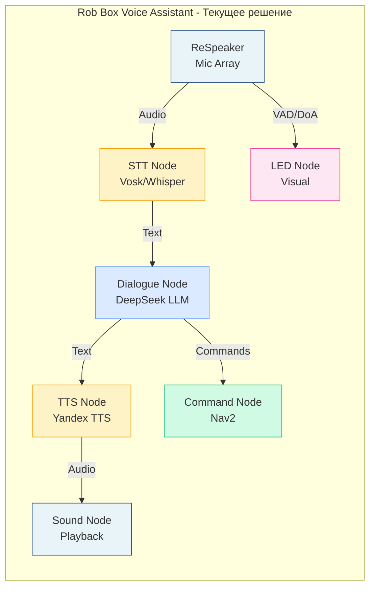
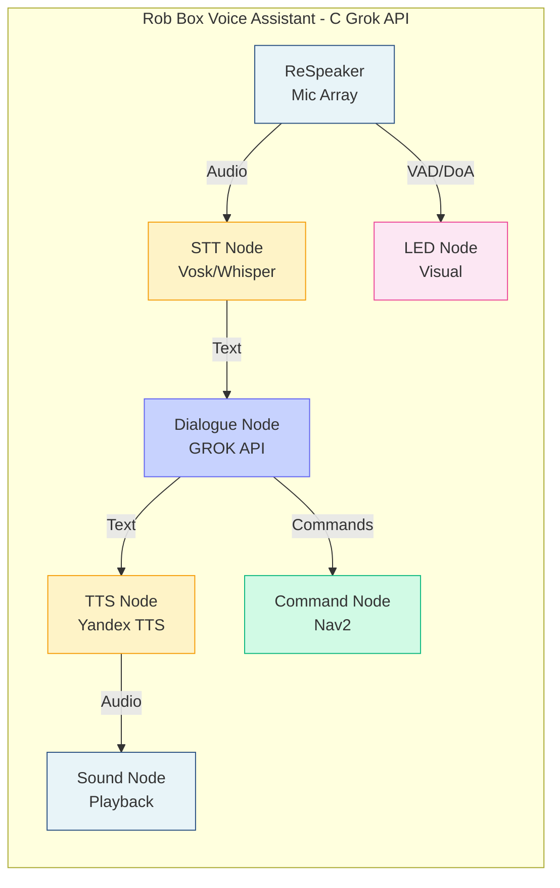
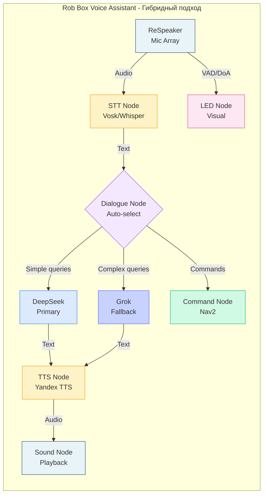
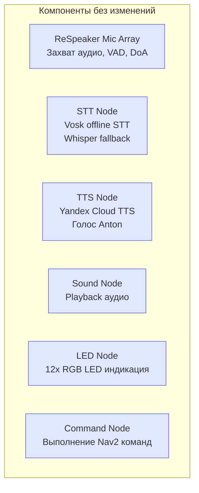

# Сравнение архитектур голосового ассистента

## Текущая архитектура (DeepSeek)



**Провайдеры:**
- **STT:** Vosk (offline, primary) / Whisper (offline, fallback) / Yandex (online, complex cases)
- **LLM:** DeepSeek API (online, $0.14 / 1M input tokens)
- **TTS:** Yandex Cloud TTS (online, бесплатно до 1M символов/месяц)

**Стоимость:** ~$5-10/месяц  
**Offline:** ✅ STT + TTS fallback (Silero)

---

## Вариант с Grok (замена только LLM)



**Изменения:**
- **STT:** Без изменений (Vosk/Whisper)
- **LLM:** ✅ **Grok API** вместо DeepSeek (1M токенов контекст, real-time search)
- **TTS:** Без изменений (Yandex TTS)

**Стоимость:** ~$???/месяц (требуется тестирование!)  
**Offline:** ⚠️ Только STT + TTS (LLM требует интернет)

---

## Рекомендуемая архитектура (гибрид)



**Логика выбора:**

```yaml
dialogue_node:
  llm_provider: "auto"
  
  # Использовать DeepSeek для:
  use_deepseek:
    - simple_questions: true         # "Привет", "Как дела?"
    - navigation_commands: true      # "Поезжай вперёд"
    - context_length: "< 4000"       # Короткие диалоги
  
  # Использовать Grok для:
  use_grok:
    - complex_reasoning: true        # Сложные вопросы
    - long_context: "> 4000"         # Длинные диалоги
    - real_time_search: true         # Актуальная информация
    - advanced_function_calling: true # Сложные команды
```

**Преимущества:**
- 💰 Оптимальная стоимость (DeepSeek для 70-80% запросов)
- 🎯 Высокое качество (Grok для сложных задач)
- 🔄 Гибкость (ручное переключение через конфиг)
- 📊 A/B тестирование

**Стоимость:** ~$15-30/месяц (оценка)  
**Offline:** ⚠️ Только STT + TTS

---

## Сравнительная таблица

| Параметр | Текущее (DeepSeek) | Grok замена | Гибрид (рекомендуется) |
|----------|-------------------|-------------|------------------------|
| **STT** | Vosk/Whisper | Vosk/Whisper | Vosk/Whisper |
| **LLM** | DeepSeek | Grok | DeepSeek + Grok |
| **TTS** | Yandex | Yandex | Yandex |
| **Качество** | ⭐⭐⭐⭐ | ⭐⭐⭐⭐⭐ | ⭐⭐⭐⭐⭐ |
| **Стоимость** | $5-10/мес | $???/мес | $15-30/мес |
| **Offline** | ✅ STT+TTS | ⚠️ STT+TTS | ⚠️ STT+TTS |
| **Контекст** | 8K-32K токенов | 1M токенов | 1M токенов |
| **Real-time search** | ❌ | ✅ | ✅ |
| **Function calling** | ⭐⭐⭐ | ⭐⭐⭐⭐⭐ | ⭐⭐⭐⭐⭐ |
| **Сложность** | Текущий | Простая (~4ч) | Средняя (~8ч) |

---

## Что НЕ меняется

Независимо от выбранной архитектуры, эти компоненты остаются без изменений:



**Изменяется ТОЛЬКО:** `dialogue_node.py` — выбор LLM провайдера (DeepSeek / Grok / Гибрид)

---

## Вывод

**Grok API — это не замена voice assistant, а улучшение LLM компонента.**

### ✅ Рекомендация: Гибридный подход

1. Оставить текущую архитектуру (STT/TTS)
2. Добавить Grok как опциональный LLM провайдер
3. Использовать автоматический выбор на основе сложности запроса
4. Собрать метрики и оптимизировать баланс качество/стоимость

**Следующий шаг:** Протестировать Grok API — [GROK_API_QUICKSTART.md](guides/GROK_API_QUICKSTART.md)

---

**См. также:**
- [Полный анализ](reports/GROK_VOICE_MODE_ANALYSIS.md)
- [Рекомендации](../GROK_API_RECOMMENDATIONS.md)
- [Пример кода](examples/grok_api_integration_example.py)
