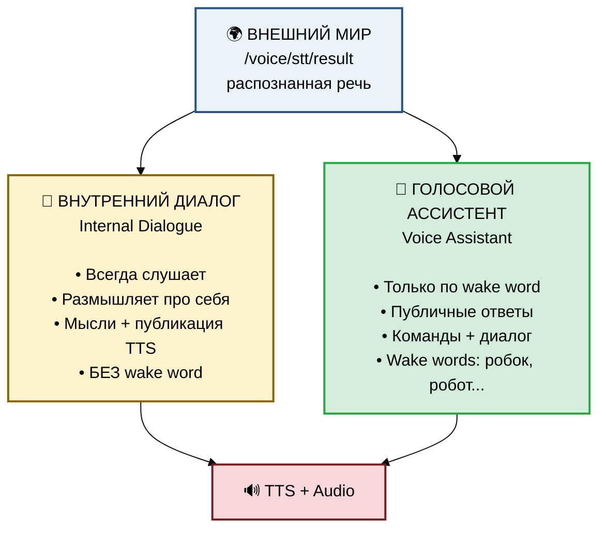
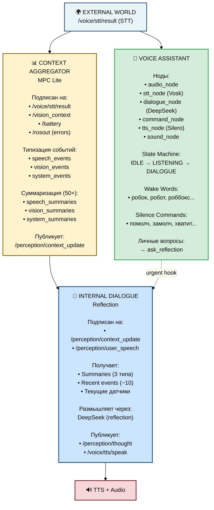

# Internal Dialogue + Voice Assistant - Полная документация

## 📋 Содержание

- [Обзор архитектуры](#обзор-архитектуры)
- [Две независимые системы](#две-независимые-системы)
- [Context Aggregator (MPC Lite)](#context-aggregator-mpc-lite)
- [Internal Dialogue (Reflection)](#internal-dialogue-reflection)
- [Voice Assistant (Dialogue)](#voice-assistant-dialogue)
- [Суммаризация контекста](#суммаризация-контекста)
- [Urgent Hook механизм](#urgent-hook-механизм)
- [Wake Word Detection](#wake-word-detection)
- [Команда "Помолчи"](#команда-помолчи)
- [Hardware AEC (ReSpeaker)](#hardware-aec-respeaker)
- [Конфигурация](#конфигурация)
- [Запуск и тестирование](#запуск-и-тестирование)

---

## Обзор архитектуры

РОББОКС имеет **ДВЕ НЕЗАВИСИМЫЕ** системы обработки речи и размышлений:



### Ключевое отличие:

| Параметр | Internal Dialogue | Voice Assistant |
|----------|------------------|-----------------|
| **Активация** | Всегда активен | Wake word обязателен |
| **Входные данные** | Все события (vision, errors, speech) | Только речь после wake word |
| **Выход** | Мысли (про себя) + иногда речь | Всегда публичные ответы |
| **Цель** | Внутренние размышления | Взаимодействие с пользователем |
| **Может вмешаться** | Да, если релевантно | Нет, только по wake word |

---

## Две независимые системы

### 1. Internal Dialogue (Внутренний диалог)

**Пакет:** `rob_box_perception`  
**Ноды:**
- `context_aggregator_node` - собирает события (MPC lite)
- `reflection_node` - размышляет и анализирует

**Поведение:**
- ✅ Всегда слушает `/voice/stt/result`
- ✅ Получает события от Context Aggregator
- ✅ Размышляет про себя (thoughts)
- ✅ Может вмешаться БЕЗ wake word когда уместно
- ✅ Продолжает размышлять даже в режиме SILENCED

**Пример:**
```
Пользователь: (просто сказал) "Что это за объект?"
Internal Dialogue: *думает* "Пользователь спрашивает об объекте,
                   я видел красный куб на камере..."
                   *решает* "Нужно ответить!"
                   *говорит* "Это красный куб"
```

### 2. Voice Assistant (Голосовой ассистент)

**Пакет:** `rob_box_voice`  
**Ноды:**
- `audio_node` - захват звука с ReSpeaker
- `stt_node` - распознавание речи (Vosk)
- `dialogue_node` - диалог с DeepSeek
- `command_node` - обработка команд
- `tts_node` - синтез речи (Silero)
- `sound_node` - звуковые эффекты

**Поведение:**
- ✅ Требует wake word для активации
- ✅ Wake words: робок, робот, роббокс, робокос, роббос, робокс
- ✅ Может выполнять команды ("иди вперёд")
- ✅ Может болтать с пользователем
- ✅ Останавливается по команде "помолчи"

**Пример:**
```
Пользователь: "Робот привет!"
Voice Assistant: *активируется по wake word*
                 *отвечает* "Привет! Я РОББОКС, чем могу помочь?"

Пользователь: (без wake word) "что там впереди?"
Voice Assistant: *игнорирует - нет wake word*
```

---

## Context Aggregator (MPC Lite)

**Нода:** `context_aggregator_node`  
**Пакет:** `rob_box_perception`

### Назначение

Сборщик данных в стиле Model Predictive Control (упрощённая версия):
- Подписывается на топики (vision, sensors, speech)
- Агрегирует в события
- Публикует в `/perception/context_update` (PerceptionEvent)

### Архитектура

```
Топики → Context Aggregator → События → Reflection
  ↓           ↓                  ↓
/vision    add_to_memory    recent_events
/speech    (с типизацией)   speech_events
/battery                    vision_events
/errors                     system_events
```

### Типизация событий

События разделены на **3 категории**:

1. **speech_events** - Речь пользователя
2. **vision_events** - Визуальные наблюдения, AprilTags
3. **system_events** - Ошибки, warnings, battery, system

### Код

```python
def add_to_memory(self, event_type: str, content: str, important: bool = False):
    """Добавить событие с автоматической типизацией"""
    event = {
        'time': time.time(),
        'type': event_type,
        'content': content,
        'important': important
    }
    
    # Общая память
    self.recent_events.append(event)
    
    # Типизированные очереди
    if event_type == 'user_speech':
        self.speech_events.append(event)
    elif event_type in ['vision', 'apriltag']:
        self.vision_events.append(event)
    elif event_type in ['error', 'warning', 'battery', 'system']:
        self.system_events.append(event)
```

### Подписки

```python
# Voice STT
self.stt_sub = self.create_subscription(
    String, '/voice/stt/result', 
    self.on_user_speech, 10
)

# Vision
self.vision_sub = self.create_subscription(
    String, '/perception/vision_context',
    self.on_vision_context, 10
)

# System errors
self.rosout_sub = self.create_subscription(
    Log, '/rosout',
    self.on_rosout, 10
)
```

---

## Суммаризация контекста

### Проблема

При 50+ событиях в памяти становится каша:
```
[10:01] user_speech: "привет"
[10:02] vision: "красный куб"
[10:03] battery: 12.1V
[10:04] user_speech: "как дела"
... (ещё 46 событий)
```

### Решение: Типизированная суммаризация

Каждый тип событий суммаризируется **ОТДЕЛЬНО** через DeepSeek:

```
speech_events (50+) → DeepSeek → speech_summaries
vision_events (50+) → DeepSeek → vision_summaries  
system_events (50+) → DeepSeek → system_summaries
```

### Алгоритм

```python
def check_and_summarize(self):
    """Проверка порога для каждого типа"""
    if len(self.speech_events) >= self.summarization_threshold:
        self._summarize_events('speech', 
                               self.speech_events, 
                               self.speech_summaries)
    
    if len(self.vision_events) >= self.summarization_threshold:
        self._summarize_events('vision',
                               self.vision_events,
                               self.vision_summaries)
    
    if len(self.system_events) >= self.summarization_threshold:
        self._summarize_events('system',
                               self.system_events,
                               self.system_summaries)

def _summarize_events(self, category, events_list, summaries_storage):
    """Суммаризация через DeepSeek"""
    # 1. Формируем промпт из template
    prompt = self.summarization_prompt.format(
        memory_window=self.memory_window,
        events_list='\n'.join(events_text)
    )
    
    # 2. Вызов DeepSeek
    response = self.deepseek_client.chat.completions.create(
        model="deepseek-chat",
        messages=[{"role": "user", "content": prompt}],
        temperature=0.3,
        max_tokens=300
    )
    
    # 3. Сохраняем summary
    summary_data = {
        'time': time.time(),
        'category': category,
        'summary': response.choices[0].message.content.strip(),
        'event_count': len(events_list)
    }
    summaries_storage.append(summary_data)
    
    # 4. Очищаем старые события (оставляем 10 для контекста)
    events_list.clear()
    events_list.extend(events_list[-10:])
```

### Хранение

```python
# Последние события (~10 для свежего контекста)
self.recent_events: List[Dict] = []
self.speech_events: List[Dict] = []
self.vision_events: List[Dict] = []
self.system_events: List[Dict] = []

# Суммаризованная история (последние 10 summaries)
self.speech_summaries: List[Dict] = []  # {'time', 'category', 'summary', 'event_count'}
self.vision_summaries: List[Dict] = []
self.system_summaries: List[Dict] = []
```

### Передача в Reflection

Summaries передаются через `PerceptionEvent`:

```python
# PerceptionEvent.msg
string speech_summaries     # JSON array
string vision_summaries     # JSON array
string system_summaries     # JSON array
```

```python
# Context Aggregator публикует
event.speech_summaries = json.dumps(self.speech_summaries)
event.vision_summaries = json.dumps(self.vision_summaries)
event.system_summaries = json.dumps(self.system_summaries)
self.event_pub.publish(event)
```

### Использование в Reflection

```python
def _format_context_for_prompt(self, ctx: PerceptionEvent) -> str:
    """Формирование промпта с суммаризованной историей"""
    lines = ["=== ТЕКУЩИЙ КОНТЕКСТ РОБОТА ==="]
    
    # ... текущие данные (vision, pose, battery) ...
    
    lines.append("\n=== СУММАРИЗОВАННАЯ ИСТОРИЯ ===")
    
    # Диалоги
    if ctx.speech_summaries:
        speech_sums = json.loads(ctx.speech_summaries)
        if speech_sums:
            lines.append("\n📝 ДИАЛОГИ:")
            for s in speech_sums[-3:]:  # Последние 3
                lines.append(f"  • {s['summary']}")
    
    # Наблюдения
    if ctx.vision_summaries:
        vision_sums = json.loads(ctx.vision_summaries)
        if vision_sums:
            lines.append("\n👁️ НАБЛЮДЕНИЯ:")
            for s in vision_sums[-3:]:
                lines.append(f"  • {s['summary']}")
    
    # Система
    if ctx.system_summaries:
        system_sums = json.loads(ctx.system_summaries)
        if system_sums:
            lines.append("\n⚙️ СИСТЕМА:")
            for s in system_sums[-3:]:
                lines.append(f"  • {s['summary']}")
    
    # Недавние события
    lines.append("\n=== НЕДАВНИЕ СОБЫТИЯ (последние ~10) ===")
    lines.append(ctx.memory_summary)
    
    return '\n'.join(lines)
```

### Пример результата

```
=== СУММАРИЗОВАННАЯ ИСТОРИЯ ===

📝 ДИАЛОГИ:
  • Пользователь спрашивал о маршруте и просил показать карту.
    Я объяснил текущее положение и направление движения.
  • Было 3 вопроса о навигации: "куда едем", "где мы", "сколько осталось"
  • Пользователь интересовался батареей - я сообщил что заряд в норме

👁️ НАБЛЮДЕНИЯ:
  • В течение 5 минут видел: красный куб, синий конус, человека
  • Обнаружены AprilTags: 12, 15, 23 (навигационные маркеры)

⚙️ СИСТЕМА:
  • Батарея стабильна 12.3-12.5V
  • 2 warning о высокой нагрузке CPU (resolved)
  
=== НЕДАВНИЕ СОБЫТИЯ (последние ~10) ===
[10:25] user_speech: "робот стой"
[10:26] vision: "красный куб впереди"
...
```

---

## Internal Dialogue (Reflection)

**Нода:** `reflection_node`  
**Пакет:** `rob_box_perception`

### Event-Driven Architecture v2.0

```
Context Aggregator → /perception/context_update → Reflection
                                                      ↓
                                                   DeepSeek
                                                      ↓
                                           {thought, should_speak, speech}
                                                      ↓
                                           /perception/thought (про себя)
                                           /voice/tts/speak (вслух)
```

### Подписки

```python
# События от Context Aggregator
self.context_sub = self.create_subscription(
    PerceptionEvent,
    '/perception/context_update',
    self.on_context_update,
    10
)

# Личные вопросы от Voice Assistant
self.speech_sub = self.create_subscription(
    String,
    '/perception/user_speech',
    self.on_user_speech,
    10
)
```

### Цикл размышлений

```python
def on_context_update(self, msg: PerceptionEvent):
    """Получено новое событие"""
    self.last_context = msg
    
    # Если есть срочный личный вопрос
    if self.pending_user_speech:
        self.process_urgent_question(self.pending_user_speech)
        return
    
    # Если диалог активен - ждём
    if self.in_dialogue:
        return
    
    # Обычное размышление
    self.think_and_maybe_speak()

def think_and_maybe_speak(self):
    """Цикл размышлений"""
    context_text = self._format_context_for_prompt(self.last_context)
    
    result = self._call_deepseek(context_text, urgent=False)
    
    if result:
        thought = result.get('thought', '')
        should_speak = result.get('should_speak', False)
        speech = result.get('speech', '')
        
        # Публикуем мысль
        if thought:
            self._publish_thought(thought)
        
        # Говорим если решили
        if should_speak and speech:
            self._publish_speech(speech)
```

### System Prompt

```
Ты — внутренний голос робота РОББОКС.

ТВОЯ РОЛЬ:
- Размышляй о происходящем
- Анализируй контекст
- Решай когда нужно что-то сказать вслух

ФОРМАТ ОТВЕТА (JSON):
{
  "thought": "внутренняя мысль",
  "should_speak": true/false,
  "speech": "что сказать вслух (если should_speak=true)"
}

КОГДА ГОВОРИТЬ ВСЛУХ:
- Низкая батарея (< 11V)
- Важное событие (ошибка, препятствие)
- Личный вопрос пользователя (как дела, что видишь)
- Релевантный контекст БЕЗ wake word

НЕ ГОВОРИТЬ если:
- Обычные события
- Пользователь не обращался
- Активен Voice Assistant
```

---

## Voice Assistant (Dialogue)

**Нода:** `dialogue_node`  
**Пакет:** `rob_box_voice`

### State Machine

```
IDLE → (wake word) → LISTENING → (speech) → DIALOGUE → (timeout) → IDLE
                                                ↓
                                          (помолчи) → SILENCED (5 min)
```

### States

| State | Описание | Wake word? | Поведение |
|-------|----------|------------|-----------|
| **IDLE** | Ожидание | ✅ Требуется | Игнорирует всё без wake word |
| **LISTENING** | Слушает | ❌ Не требуется | Ждёт продолжение фразы |
| **DIALOGUE** | Диалог | ❌ Не требуется | Обрабатывает через DeepSeek |
| **SILENCED** | Молчит | ✅ Только команды | Игнорирует диалог 5 минут |

### Wake Word Detection

```python
def _has_wake_word(self, text: str) -> bool:
    """Проверка наличия wake word"""
    for wake_word in self.wake_words:
        if wake_word in text:
            return True
    return False

def stt_callback(self, msg: String):
    """Обработка STT"""
    text = msg.data.strip().lower()
    
    # ПРИОРИТЕТ 1: Команда "помолчи"
    if self._is_silence_command(text):
        self._handle_silence_command()
        return
    
    # ПРИОРИТЕТ 2: Проверка SILENCED state
    if self.state == 'SILENCED':
        if self.silence_until and time.time() < self.silence_until:
            if self._has_wake_word(text):
                # В SILENCED только команды с wake word
                pass
            else:
                return
    
    # ПРИОРИТЕТ 3: Wake Word Detection
    if self.state == 'IDLE':
        if self._has_wake_word(text):
            self.state = 'LISTENING'
            text = self._remove_wake_word(text)
            if not text:
                self._speak_simple("Слушаю!")
                return
        else:
            return  # Игнорируем без wake word
    
    # DIALOGUE
    self.state = 'DIALOGUE'
    self._process_with_deepseek(text)
```

### Master Prompt (DeepSeek)

```
Вы — интеллектуальный агент РОББОКС.

ФОРМАТ ОТВЕТА - JSON streaming:
{"chunk": 1, "ssml": "<speak>...</speak>", "emotion": "neutral"}

ЛИЧНЫЕ ВОПРОСЫ - Перенаправление:
Если пользователь задаёт ЛИЧНЫЙ вопрос (как дела, как ты, что у тебя):
{"chunk": 1, "action": "ask_reflection", "question": "как дела?"}

Примеры личных вопросов:
- "Как дела?"
- "Как ты себя чувствуешь?"
- "Что у тебя нового?"
- "Всё ли у тебя в порядке?"

НЕ генерируй ssml для личных вопросов - только action + question!
```

---

## Urgent Hook механизм

### Проблема

Когда пользователь спрашивает "Как дела?", Voice Assistant не знает состояния робота.  
Нужно переадресовать на Internal Dialogue.

### Решение

**1. Voice Assistant определяет личный вопрос**

DeepSeek в dialogue_node анализирует и генерирует:
```json
{"chunk": 1, "action": "ask_reflection", "question": "как дела?"}
```

**2. Dialogue публикует в `/perception/user_speech`**

```python
if 'action' in chunk_data and chunk_data['action'] == 'ask_reflection':
    question = chunk_data.get('question', '')
    self.get_logger().warn(f'🔁 Перенаправление к Reflection: "{question}"')
    
    reflection_msg = String()
    reflection_msg.data = question
    self.reflection_request_pub.publish(reflection_msg)
```

**3. Reflection получает и срочно отвечает**

```python
def on_user_speech(self, msg: String):
    """Получен личный вопрос"""
    text = msg.data.strip().lower()
    
    if self._is_personal_question(text):
        self.get_logger().info('🎯 Личный вопрос → срочный ответ')
        
        if self.last_context:
            # Немедленный ответ
            self.process_urgent_question(text)
        else:
            # Ждём следующего контекста
            self.pending_user_speech = text

def process_urgent_question(self, question: str):
    """Срочный ответ на личный вопрос"""
    prompt = f"""СРОЧНЫЙ ЛИЧНЫЙ ВОПРОС: "{question}"
    
КОНТЕКСТ:
{self._format_context_for_prompt(self.last_context)}

Ответь КРАТКО (1-2 предложения) на основе текущего состояния."""
    
    result = self._call_deepseek(prompt, urgent=True)
    
    if result and result.get('speech'):
        self._publish_speech(result['speech'])
```

### Результат

```
Пользователь: "Робот как дела?"
               ↓
Dialogue Node: *определяет личный вопрос*
               *публикует в /perception/user_speech*
               ↓
Reflection: *получает*
            *анализирует контекст*
            *отвечает через TTS*
            "У меня всё хорошо! Батарея 12.3V, вижу красный куб впереди"
```

---

## Wake Word Detection

### Конфигурация

Wake words хранятся в `voice_assistant.yaml`:

```yaml
dialogue_node:
  wake_words:
    - "робок"
    - "робот"
    - "роббокс"
    - "робокос"
    - "роббос"
    - "робокс"
```

### Загрузка

```python
self.declare_parameter('wake_words', ['робок', 'робот', 'роббокс'])
self.wake_words = self.get_parameter('wake_words').value
```

### Логика

**В IDLE состоянии:**
- ✅ С wake word → LISTENING → обработка
- ❌ Без wake word → игнорируется

**В LISTENING/DIALOGUE:**
- ❌ Wake word не требуется (уже активирован)

**В SILENCED:**
- ✅ Только команды с wake word
- ❌ Диалог недоступен 5 минут

---

## Команда "Помолчи"

### Конфигурация

```yaml
dialogue_node:
  silence_commands:
    - "помолч"
    - "замолч"
    - "хватит"
    - "закрой"
    - "заткн"
    - "не меша"
```

### Обработка

```python
def _is_silence_command(self, text: str) -> bool:
    """Проверка команды молчания"""
    for command in self.silence_commands:
        if command in text:
            return True
    return False

def _handle_silence_command(self):
    """Обработка команды silence"""
    self.get_logger().warn('🔇 SILENCE: останавливаем TTS')
    
    # 1. Прервать текущий streaming
    if self.current_stream:
        self.current_stream = None
    
    # 2. Отправить STOP в TTS
    stop_msg = String()
    stop_msg.data = 'STOP'
    self.tts_control_pub.publish(stop_msg)
    
    # 3. Перейти в SILENCED на 5 минут
    self.state = 'SILENCED'
    self.silence_until = time.time() + 300
    self._publish_state()
    
    # 4. Подтверждение
    self._speak_simple('Хорошо, молчу')
```

### Поведение

**Voice Assistant:**
- ❌ Диалог недоступен 5 минут
- ✅ Только команды с wake word

**Internal Dialogue:**
- ✅ Продолжает размышлять
- ✅ Может вмешаться если критично
- ✅ НЕ зависит от SILENCED

---

## Hardware AEC (ReSpeaker)

### ReSpeaker Mic Array v2.0

**Чип:** XMOS XVF-3000  
**Микрофоны:** 4× MEMS  
**USB:** Audio Class 1.0, ID `0x2886:0x0018`

### Встроенный AEC

ReSpeaker имеет **аппаратное** эхоподавление (Acoustic Echo Cancellation):

**Firmware:** `1_channel_firmware.bin`  
- 1 канал обработанного аудио
- AEC встроен в прошивку
- Подавляет эхо от собственного TTS

### Установка firmware

```bash
git clone https://github.com/respeaker/usb_4_mic_array.git
cd usb_4_mic_array
sudo python dfu.py --download 1_channel_firmware.bin
```

### Настройка AEC

Скрипт: `src/rob_box_voice/scripts/configure_respeaker_aec.py`

```python
from rob_box_voice.utils.respeaker_interface import ReSpeakerInterface

respeaker = ReSpeakerInterface()
respeaker.configure_aec(
    freeze=0,      # Адаптивный AEC (рекомендуется)
    echo_on=1,     # Эхоподавление включено
    nlp_atten=1    # Non-linear processing включен
)
```

### Параметры AEC

| Параметр | Значение | Описание |
|----------|----------|----------|
| `AECFREEZEONOFF` | 0 | Адаптивный AEC (подстраивается) |
| `ECHOONOFF` | 1 | Эхоподавление включено |
| `NLATTENONOFF` | 1 | Non-linear processing включен |

### Ссылки

- [ReSpeaker Wiki](https://wiki.seeedstudio.com/ReSpeaker_Mic_Array_v2.0/)
- [GitHub: usb_4_mic_array](https://github.com/respeaker/usb_4_mic_array)
- [ROS1 respeaker_ros](https://github.com/jsk-ros-pkg/jsk_3rdparty/blob/master/respeaker_ros/)

---

## Конфигурация

### voice_assistant.yaml

```yaml
/**:
  ros__parameters:
    dialogue_node:
      # Wake Words
      wake_words:
        - "робок"
        - "робот"
        - "роббокс"
        - "робокос"
        - "роббос"
        - "робокс"
      
      # Silence Commands
      silence_commands:
        - "помолч"
        - "замолч"
        - "хватит"
        - "закрой"
        - "заткн"
        - "не меша"
      
      # LLM
      llm_provider: "deepseek"
      model: "deepseek-chat"
      temperature: 0.7
      max_tokens: 500
      system_prompt_file: "master_prompt_simple.txt"
```

### perception.yaml

```yaml
/**:
  ros__parameters:
    context_aggregator:
      publish_rate: 2.0
      memory_window: 60
      summarization_threshold: 50
      enable_summarization: true
    
    reflection_node:
      enable_speech: true
      enable_thoughts: true
      cycle_interval: 1.0
      urgent_response_timeout: 2.0
      dialogue_timeout: 30.0
      system_prompt_file: "reflection_prompt.txt"
```

### Промпты

**Файлы:**
- `src/rob_box_voice/prompts/master_prompt_simple.txt` - Voice Assistant
- `src/rob_box_perception/prompts/reflection_prompt.txt` - Internal Dialogue
- `src/rob_box_perception/prompts/context_summarization_prompt.txt` - Суммаризация

---

## Запуск и тестирование

### Запуск Internal Dialogue

```bash
# Terminal 1: Context Aggregator
ros2 run rob_box_perception context_aggregator_node \
  --ros-args --params-file config/perception.yaml

# Terminal 2: Reflection
ros2 run rob_box_perception reflection_node \
  --ros-args --params-file config/perception.yaml
```

### Запуск Voice Assistant

```bash
# Загрузить секреты
source src/rob_box_voice/.env.secrets

# Запустить все ноды
ros2 launch rob_box_voice voice_assistant.launch.py
```

### Тестовые сценарии

#### 1. Internal Dialogue (без wake word)

```bash
# Отправить речь
ros2 topic pub /voice/stt/result std_msgs/String "data: 'что впереди'"

# Ожидание:
# - Context Aggregator добавит в speech_events
# - Reflection получит через PerceptionEvent
# - Может ответить БЕЗ wake word если релевантно
```

#### 2. Voice Assistant (с wake word)

```bash
# Отправить с wake word
ros2 topic pub /voice/stt/result std_msgs/String "data: 'робот привет'"

# Ожидание:
# - Dialogue активируется
# - Ответит через TTS
# - State: IDLE → LISTENING → DIALOGUE
```

#### 3. Личный вопрос (urgent hook)

```bash
# Отправить личный вопрос
ros2 topic pub /voice/stt/result std_msgs/String "data: 'робот как дела'"

# Ожидание:
# - Dialogue определит личный вопрос
# - Опубликует в /perception/user_speech
# - Reflection срочно ответит
```

#### 4. Команда "помолчи"

```bash
# Отправить команду молчания
ros2 topic pub /voice/stt/result std_msgs/String "data: 'помолчи'"

# Ожидание:
# - TTS останавливается
# - Dialogue → SILENCED (5 минут)
# - Internal Dialogue продолжает размышлять
```

### Мониторинг

```bash
# Topics
ros2 topic echo /perception/context_update
ros2 topic echo /perception/thought
ros2 topic echo /voice/dialogue/response
ros2 topic echo /voice/dialogue/state

# Logs
ros2 run rob_box_perception context_aggregator_node # Смотреть суммаризацию
ros2 run rob_box_perception reflection_node         # Смотреть размышления
ros2 run rob_box_voice dialogue_node                # Смотреть wake word detection
```

---

## Коммиты и история

### Последние коммиты (feature/internal-dialogue):

```
3c4e0c0 feat: улучшить суммаризацию - разделение по типам + передача в Reflection
34e64b2 fix: исправить неуместный feedback от command_node
cf25256 refactor: перенести wake_words и silence_commands в YAML конфигурацию
1fd47d1 refactor: извлечь промпт суммаризации в отдельный файл
be3e65d feat: добавить периодическую суммаризацию контекста через DeepSeek
6ec5de9 feat: реализовать механизм ask_reflection для перенаправления личных вопросов
1c57258 docs: добавить полное руководство по Internal Dialogue + Wake Word
7895ef8 feat: добавить настройку AEC для ReSpeaker
```

---

## Архитектура: Полная диаграмма


```

---

## Заключение

**Достигнуто:**
- ✅ Две независимые системы (Internal Dialogue + Voice Assistant)
- ✅ Context Aggregator собирает и типизирует события
- ✅ Суммаризация по типам (speech/vision/system) через DeepSeek
- ✅ Передача summaries в Reflection через PerceptionEvent
- ✅ Urgent hook для личных вопросов (ask_reflection)
- ✅ Wake word detection (робок, робот...)
- ✅ Команда "помолчи" с SILENCED state
- ✅ Hardware AEC на ReSpeaker
- ✅ Конфигурация в YAML (не хардкод)
- ✅ Промпты в отдельных файлах

**Документация актуальна:** Октябрь 17, 2025
