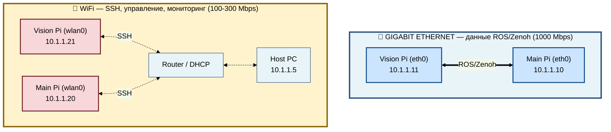
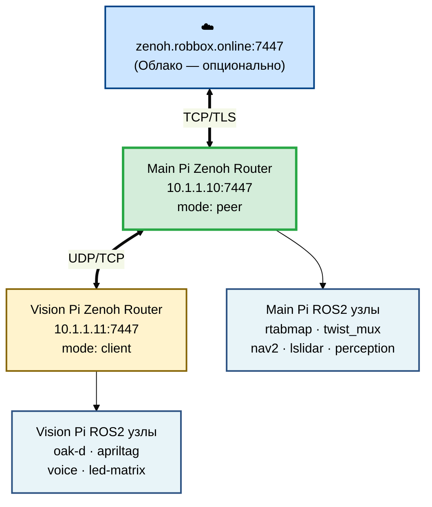

# 🌐 Сетевая топология Rob Box

> Версия: 1.0 | Дата: 2026-02-19

---

## Содержание

1. [Физическая топология](#1-физическая-топология)
2. [IP-адресация](#2-ip-адресация)
3. [Zenoh топология](#3-zenoh-топология)
4. [Порты и конфигурация](#4-порты-и-конфигурация)
5. [SSH доступ](#5-ssh-доступ)

---

## 1. Физическая топология

Система использует **две независимые сети** для разделения потоков данных и управляющего трафика.



**⚠️ ВАЖНО:**
- ROS 2 / Zenoh используют **ТОЛЬКО** Ethernet (`10.1.1.x`) — предотвращает перегрузку WiFi
- WiFi используется **ТОЛЬКО** для SSH, Foxglove и мониторинга

---

## 2. IP-адресация

| Устройство | Ethernet (eth0) | WiFi (wlan0) | Роль |
|------------|-----------------|--------------|------|
| **Main Pi** | `10.1.1.10` | `10.1.1.20` | Центральный узел: Nav2, RTAB-Map, VESC, Zenoh router |
| **Vision Pi** | `10.1.1.11` | `10.1.1.21` | Сенсоры: OAK-D, AprilTag, ReSpeaker, Voice |
| **Host PC** | — | `10.1.1.5` | Foxglove Studio, RViz2, SSH, мониторинг |
| **Monitoring** | — | `10.1.1.x` | Grafana + Prometheus (отдельная машина) |

---

## 3. Zenoh топология



### Режимы Zenoh

| Узел | Режим | Описание |
|------|-------|----------|
| **Main Pi** | `peer` | Центральный роутер, работает автономно |
| **Vision Pi** | `client` | Подключается к Main Pi, зависит от него |
| **Cloud** | `peer` | Опционально — удалённый мониторинг |

### Переменные окружения

```bash
RMW_IMPLEMENTATION=rmw_zenoh_cpp
ZENOH_CONFIG=/config/zenoh_session_config.json5
ROS_AUTOMATIC_DISCOVERY_RANGE=LOCALHOST
```

---

## 4. Порты и конфигурация

| Сервис | Хост | Порт | Протокол |
|--------|------|------|----------|
| Zenoh Router | Main Pi | 7447 | TCP/UDP |
| Zenoh Router | Vision Pi | 7447 | TCP/UDP |
| Zenoh Cloud | zenoh.robbox.online | 7447 | TCP/TLS |
| Grafana | Monitoring PC | 3000 | HTTP |
| Prometheus | Monitoring PC | 9090 | HTTP |
| SSH | Main Pi (wlan0) | 22 | TCP |
| SSH | Vision Pi (wlan0) | 22 | TCP |

---

## 5. SSH доступ

```bash
# Vision Pi (WiFi)
sshpass -p 'open' ssh ros2@10.1.1.21

# Main Pi (WiFi)
sshpass -p 'open' ssh ros2@10.1.1.20

# Vision Pi (Ethernet — с другой Pi)
ssh ros2@10.1.1.11
```

---

**Связанные документы:**
- [SYSTEM_OVERVIEW.md](SYSTEM_OVERVIEW.md) — общая архитектура (раздел 3)
- [SOFTWARE.md](SOFTWARE.md) — программные компоненты и Docker
- [guides/VISION_PI_NETWORK_SETUP.md](../guides/VISION_PI_NETWORK_SETUP.md) — настройка сети Vision Pi

**Навигация:** [← Архитектура](README.md) | [📚 Документация](../README.md)
