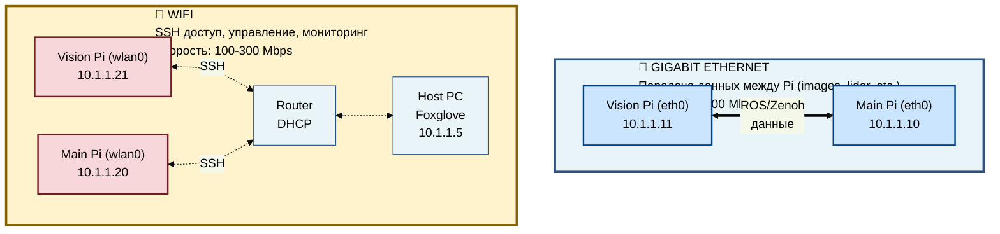
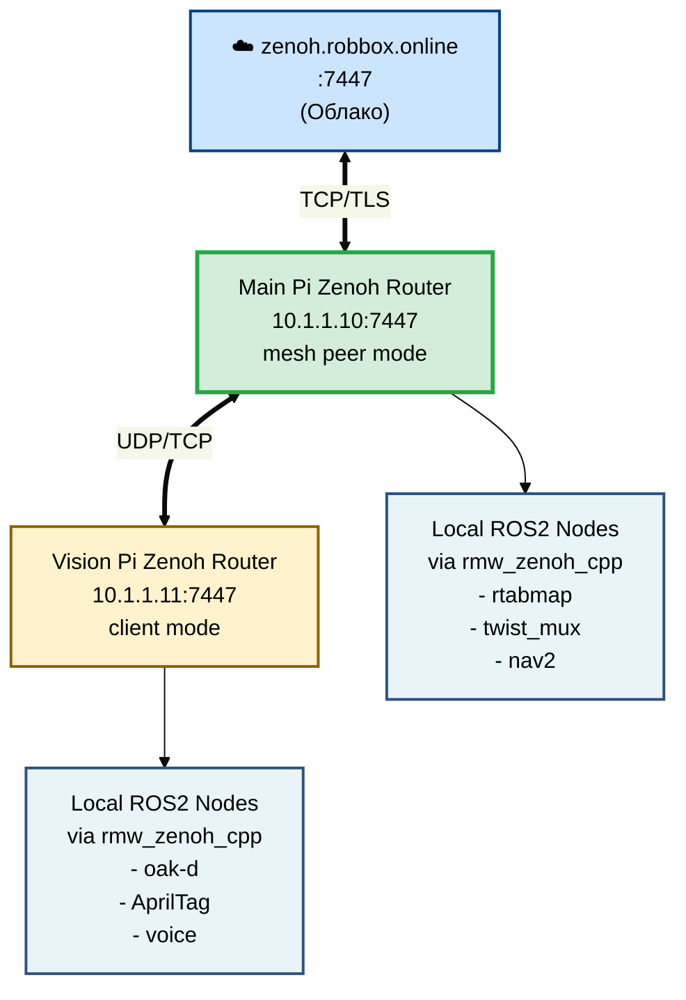
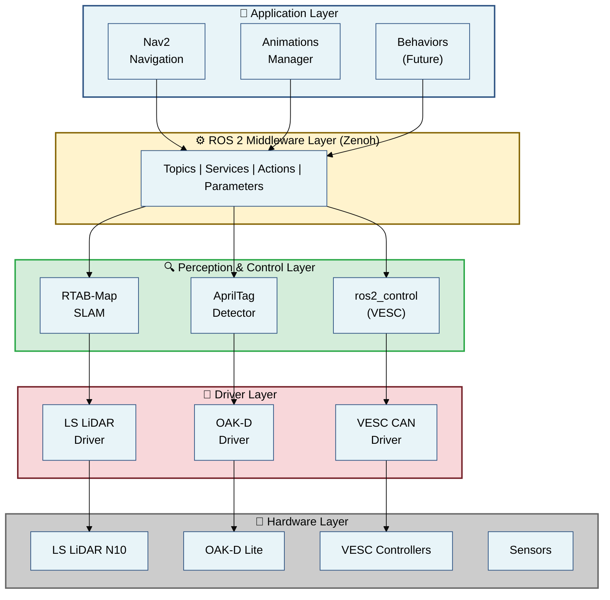

# Архитектура системы РОББОКС

<div align="center">
  <strong>Полное техническое описание архитектуры автономного робота</strong>
  <br>
  <sub>Версия: 1.1.0 | Дата: 2025-10-24</sub>
</div>

> **📝 Последние обновления (24 октября 2025):**
> - Perception и LSLIDAR перемещены с Vision Pi на Main Pi
> - Добавлена система мониторинга (Grafana, Prometheus, Loki)
> - Исправлены TF трансформации (robot-state-publisher с Zenoh wrapper)
> - Голосовой ассистент получил time awareness и синхронизацию TTS
> - Полная документация Zenoh namespace и облачного подключения

---

## 📖 Содержание

1. [Обзор архитектуры](#1-обзор-архитектуры)
2. [Аппаратная архитектура](#2-аппаратная-архитектура)
3. [Сетевая топология](#3-сетевая-топология)
4. [Программная архитектура](#4-программная-архитектура)
5. [ROS 2 граф](#5-ros-2-граф)
6. [Docker инфраструктура](#6-docker-инфраструктура)
7. [Потоки данных](#7-потоки-данных)
8. [Принятые решения](#8-принятые-решения)

---

## 1. Обзор архитектуры

### 1.1. Концепция системы

РОББОКС построен по принципу **распределённой обработки** с разделением вычислительной нагрузки между двумя Raspberry Pi:

- **Vision Pi** — специализируется на обработке изображений и голосовом взаимодействии
- **Main Pi** — отвечает за навигацию, планирование, SLAM и управление

Такая архитектура позволяет:
- ✅ Распределить вычислительную нагрузку
- ✅ Масштабировать систему (легко добавить новые узлы)
- ✅ Изолировать критичные процессы (сбой камеры не влияет на навигацию)
- ✅ Оптимизировать сетевой трафик (обработка данных локально)

### 1.2. Ключевые принципы

| Принцип | Описание | Преимущества |
|---------|----------|--------------|
| **Микросервисная архитектура** | Каждая функция — отдельный Docker контейнер | Изолированность, обновляемость |
| **Декларативная конфигурация** | Docker Compose + Volume-монтирование | Не нужна пересборка при изменении конфигов |
| **Middleware decoupling** | Zenoh для связи между Pi | Устойчивость к сетевым сбоям |
| **Hardware abstraction** | ROS 2 интерфейсы | Замена компонентов без изменения кода |

---

## 2. Аппаратная архитектура

### 2.1. Схема подключений

```mermaid
%%{init: {'theme':'base', 'themeVariables': { 'primaryColor':'#e8f4f8','primaryTextColor':'#000','primaryBorderColor':'#2c5282','lineColor':'#2c5282'}}}%%
graph TB
    subgraph ROBBOX["🤖 РОББОКС"]
        subgraph VisionPi["Vision Pi 5 (8GB)"]
            OAK["OAK-D Lite<br/>(USB3)"]
            MJPEG["MJPEG Camera<br/>720p (USB)"]
            ReSpeaker["ReSpeaker<br/>Mic v2 (USB)"]
            LED["381 LED<br/>NeoPixel (SPI)"]
            
            OAK -.USB.-> VisionPi
            MJPEG -.USB.-> VisionPi
            ReSpeaker -.USB.-> VisionPi
            LED -.SPI.-> VisionPi
        end
        
        subgraph MainPi["Main Pi 5 (16GB)"]
            LIDAR["LS LiDAR N10<br/>(USB ACM)"]
            CAN["CAN HAT<br/>(Isolated)"]
            ESP32["ESP32<br/>Sensor Hub + BMC"]
            VESC["2× VESC<br/>Motor Control"]
            
            LIDAR -.USB.-> MainPi
            CAN <--> ESP32
            CAN --> VESC
        end
        
        Battery["2×10S LiPo<br/>Battery"]
        Buck12V["12V Buck<br/>(Isolated)"]
        Buck5V["5V Buck<br/>(Isolated)"]
        
        Battery --> Buck12V
        Battery --> Buck5V
        Buck12V -.питание.-> MainPi
        Buck12V -.питание.-> VisionPi
        Buck5V -.питание.-> LED
        Buck12V --> VESC
        
        VisionPi <==GbE 10.1.1.x==> MainPi
    end
    
    style VisionPi fill:#e8f4f8,stroke:#2c5282,stroke-width:2px
    style MainPi fill:#fff3cd,stroke:#856404,stroke-width:2px
    style Battery fill:#ffcccc,stroke:#cc0000,stroke-width:2px
    style Buck12V fill:#ccffcc,stroke:#00cc00,stroke-width:2px
    style Buck5V fill:#ccffcc,stroke:#00cc00,stroke-width:2px
```

### 2.2. Компоненты по функциям

#### Вычислительные узлы

| Компонент | Модель | CPU | RAM | Функции |
|-----------|--------|-----|-----|---------|
| **Main Pi** | Raspberry Pi 5 | 4-core ARM Cortex-A76 @ 2.4GHz | 16GB | SLAM, Nav2, Control, Perception, LSLIDAR |
| **Vision Pi** | Raspberry Pi 5 | 4-core ARM Cortex-A76 @ 2.4GHz | 8GB | Vision, AprilTag, Voice Assistant |

#### Сенсоры

| Сенсор | Интерфейс | Частота | Подключение | Назначение |
|--------|-----------|---------|-------------|------------|
| **LS LiDAR N10** | USB (ACM) | 10 Hz | Main Pi | 2D картография (перемещён 24.10.2025) |
| **OAK-D Lite** | USB 3.0 | 5-10 Hz | Vision Pi | RGB-D, AprilTag |
| **MJPEG Camera** | USB 2.0 | 30 Hz | Vision Pi | Потолочная навигация (720p YUY2) |
| **ReSpeaker Mic v2** | USB 2.0 | — | Vision Pi | Голосовое управление (6-mic array) |
| **Temperature Sensors** | I2C | 1 Hz | ESP32 Hub | Мониторинг температуры компонентов |
| **BMS** (planned) | UART | 1 Hz | ESP32 Hub | Мониторинг аккумулятора |

#### Актуаторы

| Актуатор | Интерфейс | Управление | Подключение | Назначение |
|----------|-----------|------------|-------------|------------|
| **2× VESC** | CAN Bus | Velocity/Current | Main Pi (CAN HAT isolated) | Привод колёс |
| **381× NeoPixel LED** | SPI | RGB data | Vision Pi (GPIO10/SPI) | Визуальная индикация (4× 8×8 + 1× 25×5) |
| **Cooling Fans** | PWM | Duty cycle | ESP32 Hub | Охлаждение компонентов |

#### Питание

| Компонент | Напряжение | Источник | Описание |
|-----------|-----------|----------|----------|
| **Battery** | 37V (10S LiPo) × 2 | — | Основное питание |
| **12V Buck** | 12V | Battery → isolated buck | Raspberry Pi 5, VESC |
| **5V Buck** | 5V | Battery → isolated buck | NeoPixel LED (381×), сенсоры |
| **CAN HAT** | 5V | Main Pi | Гальваническая развязка CAN |

---

## 3. Сетевая топология

### 3.1. Dual Network Design

Система использует **две независимые сети**:



### 3.2. IP-адресация

| Устройство | Ethernet (eth0) | WiFi (wlan0) | Назначение интерфейса |
|------------|-----------------|--------------|------------------------|
| **Main Pi** | 10.1.1.10 | 10.1.1.20 | eth0: ROS/Zenoh, wlan0: SSH |
| **Vision Pi** | 10.1.1.11 | 10.1.1.21 | eth0: ROS/Zenoh, wlan0: SSH |
| **Host PC** | — | 10.1.1.5 | Visualization, monitoring |

**⚠️ ВАЖНО**: 
- ROS 2 / Zenoh используют **ТОЛЬКО** Ethernet (10.1.1.x)
- WiFi используется **ТОЛЬКО** для SSH и управления
- Это предотвращает перегрузку WiFi потоками данных

### 3.3. Zenoh топология



**Режимы работы**:
- **Main Pi**: `peer` — центральный узел, может работать автономно
- **Vision Pi**: `client` — подключается к Main Pi, зависит от него
- **Cloud**: `peer` — опциональное подключение для удалённого мониторинга

---

## 4. Программная архитектура

### 4.1. Уровни абстракции



### 4.2. Компоненты по слоям

#### Application Layer
- **Nav2 Stack**: Глобальное и локальное планирование траектории
- **Animation Manager**: Управление LED анимациями и эмоциями
- **Behavior Trees** (future): Высокоуровневое управление поведением

#### Middleware Layer
- **Zenoh Router**: Маршрутизация сообщений между узлами
- **rmw_zenoh_cpp**: ROS 2 Middleware для интеграции с Zenoh
- **DDS Bridge** (optional): Мост в классический DDS при необходимости

#### Perception & Control
- **RTAB-Map**: 3D SLAM с RGB-D и LiDAR fusion
- **AprilTag Detection**: Визуальная локализация по маркерам
- **ros2_control**: Управление приводами через абстрактный интерфейс

#### Driver Layer
- **lslidar_driver**: Получение сканов от 2D LiDAR
- **depthai_ros**: Обработка данных от OAK-D камеры
- **vesc_driver**: CAN-интерфейс для управления моторами
- **micro_ros_agent**: Связь с ESP32 сенсорным хабом

---

## 5. ROS 2 граф

### 5.1. Main Pi - ROS 2 Nodes

```
Main Pi (10.1.1.10)
├─ /zenoh_router              # Zenoh bridge
├─ /twist_mux                 # Velocity multiplexer
├─ /rtabmap                   # SLAM node
│  ├─ Subscribed: /scan, /camera/*, /odom
│  └─ Published: /map, /rtabmap/localization_pose
├─ /lslidar_driver            # LiDAR driver (перемещён с Vision Pi 24.10.2025)
│  └─ Published: /scan
├─ /perception_*              # Perception nodes (перемещены с Vision Pi 24.10.2025)
│  ├─ /health_monitor         # Health monitoring
│  └─ /context_aggregator     # Context aggregation
├─ /robot_state_publisher     # TF publisher (исправлен Zenoh wrapper 24.10.2025)
│  └─ Published: /tf, /tf_static
├─ /nav2_*                    # Navigation stack (future)
│  ├─ /controller_server
│  ├─ /planner_server
│  ├─ /behavior_server
│  └─ /bt_navigator
├─ /vesc_driver               # Motor control
│  ├─ Subscribed: /cmd_vel
│  └─ Published: /odom, /vesc/sensors/core
└─ /micro_ros_agent           # ESP32 bridge
   ├─ Subscribed: /device/command
   └─ Published: /device/snapshot
```

### 5.2. Vision Pi - ROS 2 Nodes

```
Vision Pi (10.1.1.11)
├─ /zenoh_router              # Zenoh bridge (client mode)
├─ /oak_d_node                # Camera driver (with integrated AprilTag detection)
│  ├─ Published: /camera/color/image_raw
│  │             /camera/depth/image_rect_raw
│  │             /camera/color/camera_info
│  └─ /apriltag_node          # Marker detector (runs in same container)
│     ├─ Subscribed: /camera/color/image_raw
│     │              /camera/color/camera_info
│     └─ Published: /apriltag/detections
│                   /tf (tag transforms)
└─ /voice_assistant           # Voice assistant (ReSpeaker)
   ├─ Subscribed: /perception/events
   └─ Published: /dialogue/text
                 /audio/tts
```

**Примечание:** LSLIDAR и Perception были перемещены на Main Pi (24 октября 2025) для оптимизации ресурсов Vision Pi.

### 5.3. Ключевые топики

| Топик | Тип сообщения | Publisher | Subscriber | Частота | Описание |
|-------|---------------|-----------|------------|---------|----------|
| `/scan` | sensor_msgs/LaserScan | lslidar_driver | rtabmap, nav2 | 10 Hz | 2D лазерные сканы |
| `/camera/color/image_raw` | sensor_msgs/Image | oak_d_node | apriltag_node, rtabmap | 5 Hz | RGB изображение |
| `/camera/depth/image_rect_raw` | sensor_msgs/Image | oak_d_node | rtabmap | 5 Hz | Depth карта |
| `/cmd_vel` | geometry_msgs/Twist | twist_mux | vesc_driver | 10 Hz | Команды скорости |
| `/odom` | nav_msgs/Odometry | vesc_driver | rtabmap, nav2 | 50 Hz | Одометрия |
| `/map` | nav_msgs/OccupancyGrid | rtabmap | nav2, rviz | 1 Hz | 2D карта |
| `/apriltag/detections` | apriltag_msgs/AprilTagDetectionArray | apriltag_node | nav2 | 5 Hz | Детекции маркеров |
| `/device/snapshot` | robot_sensor_hub_msg/DeviceSnapshot | micro_ros_agent | monitoring | 1 Hz | Сенсоры ESP32 |

---

## 6. Docker инфраструктура

### 6.1. Структура проекта

```
docker/
├── base/                        # Базовые образы
│   ├── ros2-humble-base/       # ROS 2 + Zenoh
│   └── ros2-dev-base/          # + dev tools
├── main/                        # Main Pi сервисы
│   ├── docker-compose.yaml
│   ├── config/                  # Общие конфиги (монтируются)
│   │   ├── zenoh_router_config.json5
│   │   ├── zenoh_session_config.json5
│   │   ├── cyclonedds.xml
│   │   ├── lslidar/            # LSLIDAR конфиги (перемещён 24.10.2025)
│   │   └── monitoring/          # Monitoring конфиги (добавлено 24.10.2025)
│   ├── scripts/                 # Утилиты
│   ├── maps/                    # Persistent RTAB-Map данные
│   ├── zenoh-router/
│   ├── twist-mux/
│   ├── rtabmap/
│   ├── lslidar/                 # Перемещён с Vision Pi (24.10.2025)
│   ├── perception/              # Перемещён с Vision Pi (24.10.2025)
│   ├── nav2/
│   ├── ros2_control/
│   ├── robot-state-publisher/
│   └── micro-ros-agent/
└── vision/                      # Vision Pi сервисы
    ├── docker-compose.yaml
    ├── config/                  # Общие конфиги
    │   ├── zenoh_router_config.json5
    │   ├── oak_d_config.yaml
    │   └── cyclonedds.xml
    ├── scripts/
    ├── zenoh-router/
    ├── oak-d/                       # Includes integrated AprilTag detection
    └── voice-assistant/             # Voice assistant (добавлено октябрь 2025)
```

### 6.2. Зависимости контейнеров

```
Main Pi:
  zenoh-router (base)
      ↓
  ├─ twist-mux ────────────────┐
  ├─ rtabmap ──────────────────┤
  ├─ lslidar ──────────────────┤  (перемещён с Vision Pi 24.10.2025)
  ├─ perception ───────────────┤  (перемещён с Vision Pi 24.10.2025)
  ├─ nav2 ─────────────────────┤
    ├─ ros2-control ─────────────┤
  ├─ robot-state-publisher ────┤  (исправлен TF wrapper 24.10.2025)
  └─ micro-ros-agent ──────────┘
      └─ depends_on: zenoh-router

Vision Pi:
  zenoh-router (base)
      ↓
  ├─ oak-d ────────────────────┤  (with integrated AprilTag detection, 25.10.2025)
  └─ voice-assistant ──────────┘  (добавлен октябрь 2025)
      └─ depends_on: zenoh-router
```

### 6.3. Volume стратегия

**Принцип**: Конфигурационные файлы, скрипты и launch-файлы **монтируются**, а не копируются в образ.

| Тип данных | Размещение | Монтирование | Причина |
|------------|------------|--------------|---------|
| **Config files** | `docker/*/config/` | `./config:/config:ro` | Изменение без пересборки |
| **Shared helper scripts** | `docker/*/scripts/` | `./scripts:/ros_scripts:ro` | Общая runtime-логика для нескольких сервисов |
| **Service startup scripts** | `docker/*/scripts/<service>/` | `./scripts/<service>:/scripts:ro` | Быстрое обновление service-local startup logic |
| **Launch files** | `docker/*/config/<service>/launch/` | доступны через `./config:/config:ro` | Гибкость в настройке без пересборки |
| **Maps** | `docker/main/maps/` | `./maps:/maps` | Persistence данных и RTAB-Map database |
| **URDF** | `src/rob_box_description/` | Монтируется в контейнеры | Единственный источник правды |

**⚠️ НЕ копируем в Dockerfile**:
- ❌ `COPY config/` — используем volume
- ❌ `COPY scripts/` — используем volume
- ❌ `COPY launch/` — используем volume

---

## 7. Потоки данных

### 7.1. Vision Pipeline

```
┌──────────────────────────────────────────────────────────────────┐
│                        Vision Pi                                  │
│                                                                   │
│  OAK-D Lite Camera                                                │
│       │                                                           │
│       ├─► RGB (1280×720 @ 5Hz) ──────────────────┐               │
│       │                                           │               │
│       └─► Depth (640×400 @ 5Hz) ───────────┐     │               │
│                                             │     │               │
│  ┌──────────────────────────────────────┐  │     │               │
│  │       oak_d_node                     │  │     │               │
│  │  - JPEG compression (quality 80)     │  │     │               │
│  │  - PNG depth compression (level 3)   │  │     │               │
│  └──────────────┬───────────────────────┘  │     │               │
│                 │                           │     │               │
│                 ▼ /camera/color/image_raw   │     │               │
│                           (compressed)      │     │               │
│         ┌───────────────────────────────────┘     │               │
│         │                                         │               │
│         ▼                                         ▼               │
│  ┌──────────────┐                     ┌──────────────────┐       │
│  │apriltag_node │                     │ Zenoh Router     │       │
│  │ (in oak-d    │                     │  - Bridge topics │       │
│  │  container)  │                     │  - Compression   │       │
│  └──────┬───────┘                     └────────┬─────────┘       │
│         │                                      │                 │
└─────────┼──────────────────────────────────────┼─────────────────┘
          │                                      │
          └───────────/tf, /apriltag/detections─┘
                          Gigabit Ethernet
                                 │
                      ┌──────────▼──────────┐
                      │      Main Pi        │
                      │   Zenoh Router      │
                      │  - Decompress       │
                      │  - Distribute       │
                      └──────────┬──────────┘
                                 │
                    ┌────────────┴──────────┐
                    │                       │
                    ▼                       ▼
              ┌─────────┐            ┌──────────┐
              │ rtabmap │            │   nav2   │
              │  SLAM   │            │          │
              └─────────┘            └──────────┘
```

### 7.2. Navigation Pipeline

```
┌──────────────────────────────────────────────────────────────────┐
│                          Main Pi                                  │
│                                                                   │
│  ┌───────────────┐      ┌────────────────┐                       │
│  │  LS LiDAR     │      │   VESC Driver  │                       │
│  │   Driver      │      │   (Odometry)   │                       │
│  └───────┬───────┘      └────────┬───────┘                       │
│          │                       │                               │
│          │ /scan (10Hz)          │ /odom (50Hz)                  │
│          │                       │                               │
│          └───────────┬───────────┘                               │
│                      │                                           │
│              ┌───────▼────────┐                                  │
│              │   RTAB-Map     │                                  │
│              │   - Mapping    │                                  │
│              │   - Localize   │                                  │
│              └───────┬────────┘                                  │
│                      │                                           │
│             /map, /rtabmap/localization_pose                     │
│                      │                                           │
│              ┌───────▼────────┐                                  │
│              │     Nav2       │                                  │
│              │   - Planner    │                                  │
│              │   - Controller │                                  │
│              └───────┬────────┘                                  │
│                      │                                           │
│                 /cmd_vel_nav                                     │
│                      │                                           │
│              ┌───────▼────────┐                                  │
│              │   twist_mux    │◄─── /cmd_vel_teleop, /cmd_vel_joy│
│              │   (Priority)   │                                  │
│              └───────┬────────┘                                  │
│                      │                                           │
│                  /cmd_vel                                        │
│                      │                                           │
│              ┌───────▼────────┐                                  │
│              │  VESC Driver   │                                  │
│              │ (Velocity Ctrl)│                                  │
│              └───────┬────────┘                                  │
│                      │                                           │
│                   CAN Bus                                        │
│                      │                                           │
│              ┌───────▼────────┐                                  │
│              │  2× VESC Motor │                                  │
│              │   Controllers  │                                  │
│              └────────────────┘                                  │
└──────────────────────────────────────────────────────────────────┘
```

### 7.3. Sensor Hub Pipeline

```
┌──────────────────────────────────────────────────────────────────┐
│                      ESP32 Sensor Hub                             │
│                                                                   │
│  ┌─────────┐  ┌─────────┐  ┌─────────┐  ┌─────────┐            │
│  │ 8× AHT30│  │  HX711  │  │ 2× FANs │  │   IMU   │ (future)   │
│  │ (Temp/  │  │ (Weight)│  │ (PWM/   │  │ (9-DOF) │            │
│  │  Humid) │  │         │  │  Tacho) │  │         │            │
│  └────┬────┘  └────┬────┘  └────┬────┘  └────┬────┘            │
│       │            │            │            │                  │
│       └────────────┴────────────┴────────────┘                  │
│                             │                                    │
│                    ┌────────▼────────┐                           │
│                    │  ESP32 Firmware │                           │
│                    │  (Micro-ROS)    │                           │
│                    └────────┬────────┘                           │
│                             │                                    │
│                     USB Serial (115200)                          │
└─────────────────────────────┼────────────────────────────────────┘
                              │
                    ┌─────────▼──────────┐
                    │      Main Pi       │
                    │  micro_ros_agent   │
                    └─────────┬──────────┘
                              │
              /device/snapshot (1Hz) ──┬─► Monitoring
                                       └─► Temperature control
```

---

## 8. Принятые решения

### 8.1. Почему Dual Raspberry Pi?

| Проблема | Решение с 1 Pi | Решение с 2 Pi |
|----------|----------------|----------------|
| CPU нагрузка | 95%+ (RTAB-Map + OAK-D) | Main: 40%, Vision: 45% |
| Сетевой трафик | Все через WiFi | 85% через Ethernet, WiFi свободен |
| Отказоустойчивость | Сбой камеры → сбой навигации | Изолированные процессы |
| Масштабируемость | Невозможно добавить узлы | Легко добавить 3й, 4й Pi |

### 8.2. Почему Zenoh вместо DDS?

| Критерий | CycloneDDS | Zenoh |
|----------|------------|-------|
| Overhead | ~20% CPU на discovery | <5% CPU, efficient routing |
| Настройка WAN | Сложная (multicast проблемы) | Простая (TCP/UDP/TLS) |
| Сжатие | Нет встроенного | Встроенная поддержка |
| Масштабируемость | До 10-20 узлов | Сотни узлов |
| Interoperability | ROS 2 only | ROS 2 + non-ROS системы |

### 8.3. Почему Docker микросервисы?

| Преимущество | Объяснение |
|--------------|------------|
| **Изолированность** | Сбой одного контейнера не роняет систему |
| **Обновляемость** | Обновление одного сервиса без пересборки всего |
| **Версионирование** | Каждый сервис имеет свою версию образа |
| **Воспроизводимость** | Одинаковое окружение на любом Pi |
| **CI/CD** | Автоматическая сборка и деплой через GitHub Actions |

### 8.4. Почему Volume-монтирование конфигов?

**Проблема**: Изменение config.yaml требует пересборки образа (5-10 минут).

**Решение**: Монтировать конфиги как volumes.

| Операция | С COPY в Dockerfile | С Volume монтированием |
|----------|---------------------|------------------------|
| Изменить параметр | Rebuild образа (5-10 мин) | Restart контейнера (5 сек) |
| Откатить изменение | Rebuild старой версии | Откатить файл на хосте |
| Дебаг на Pi | Нужен доступ внутрь контейнера | Правим файл на хосте |

---

## 9. Оптимизации и производительность

### 9.1. Оптимизация OAK-D Lite камеры

**Проблема**: Высокая нагрузка на Raspberry Pi при обработке изображений (85-95% CPU).

**Решение**:

| Параметр | До оптимизации | После оптимизации | Экономия |
|----------|----------------|-------------------|----------|
| **RGB разрешение** | 1920×1080 (1080p) | 1280×720 (720p) | -43% пикселей |
| **FPS** | 10 Hz | 5 Hz | -50% кадров |
| **Stereo разрешение** | 1280×720 | 640×400 | -56% пикселей |
| **CPU нагрузка** | 85-95% | 30-45% | ⬇️ ~50% |
| **Network bandwidth** | 80-100 Mbps | 8-15 Mbps | ⬇️ ~85% |
| **RAM (Vision Pi)** | ~1.2 GB | ~600 MB | ⬇️ ~50% |

**Конфигурация** (`config/oak-d/oak_d_config.yaml`):
```yaml
i_rgb_resolution: "720p"       # Снижено с 1080p
i_fps: 5.0                     # Снижено с 10.0
i_stereo_width: 640            # Снижено с 1280
i_stereo_height: 400           # Снижено с 720

# Сжатие изображений
rgb:
  image_transport: compressed        # JPEG сжатие
stereo:
  image_transport: compressedDepth   # PNG сжатие

# Отключение ненужных потоков
i_enable_imu: false
i_enable_preview: false
left.i_enabled: false          # Depth достаточно
right.i_enabled: false
i_output_disparity: false
```

### 9.2. Оптимизация RTAB-Map

**Проблема**: Высокое потребление CPU и памяти при SLAM картографии.

**Решение**:

| Параметр | Значение | Комментарий |
|----------|----------|-------------|
| `Mem/ImagePreDecimation` | 2 | Уменьшение разрешения изображений ×2 |
| `Kp/MaxFeatures` | 400 | Снижено с 1000 |
| `Vis/MaxFeatures` | 200 | Снижено с 400 |
| `Vis/FeatureType` | 6 (GFTT) | Быстрее чем SIFT/SURF |
| `Vis/CorType` | 1 (BRIEF) | Легковесный дескриптор |
| `Mem/STMSize` | 10 | Ограничение Short-Term Memory |
| `Grid/RangeMax` | 5.0 м | Ограничение дальности сетки |
| `Rtabmap/DetectionRate` | 0.5 Hz | Loop closure раз в 2 сек |

**Результат**: ~50% снижение CPU нагрузки, стабильные 5 FPS.

### 9.3. Zenoh для энергосбережения

**Преимущества Zenoh над DDS**:

| Критерий | CycloneDDS | Zenoh |
|----------|------------|-------|
| **CPU overhead** | ~20% на discovery | <5% |
| **Bandwidth** | Без сжатия | Встроенное сжатие |
| **WAN support** | Сложная настройка | Простая (TCP/TLS) |
| **Масштабируемость** | 10-20 узлов | Сотни узлов |
| **Cloud integration** | Нет | Да (облачный роутер) |

**Конфигурация**:
```json5
// Main Pi (peer mode)
{
  mode: "peer",
  listen: { endpoints: ["tcp/0.0.0.0:7447"] },
  scouting: { multicast: { enabled: false } }
}

// Vision Pi (client mode)
{
  mode: "client",
  connect: { endpoints: ["tcp/10.1.1.10:7447"] }
}
```

### 9.4. ros2_control архитектура

**Разделение обязанностей**:

```
┌──────────────────────────────────────────────────────────────┐
│  URDF (rob_box_main.xacro)                                   │
│  • Geometry (links, joints)                                  │
│  • <ros2_control> блок                                       │
└──────────────────────────────────────────────────────────────┘
               │
               ├─────────────────────┐
               ▼                     ▼
┌──────────────────────────┐  ┌───────────────────────────┐
│  robot_state_publisher   │  │  controller_manager       │
│  ────────────────────────│  │  ─────────────────────────│
│  ✅ Читает: Links/Joints │  │  ✅ Читает: ros2_control  │
│  ✅ Подписка: /joint_states│ │  ✅ Создает: Hardware IF │
│  ✅ Публикует: TF        │  │  ✅ Управляет: Контроллеры│
│  ❌ НЕ управляет моторами│  │                           │
└──────────────────────────┘  └───────────────────────────┘
               │                          │
               └──► TF Tree ◄─────────────┘
```

**Поток данных**:
```
VESC (CAN) → VescSystemHardwareInterface 
           → joint_state_broadcaster 
           → /joint_states 
           → robot_state_publisher 
           → TF (base_link → wheels)
```

### 9.5. Мониторинг производительности

**CPU нагрузка**:
```bash
htop
# Main Pi: следить за rtabmap, controller_manager
# Vision Pi: следить за depthai_ros_driver
```

**Network bandwidth**:
```bash
iftop -i eth0  # Gigabit Ethernet
```

**ROS 2 топики**:
```bash
# Частота публикации
ros2 topic hz /oak/rgb/image_raw/compressed

# Размер сообщений
ros2 topic bw /oak/rgb/image_raw/compressed

# Статистика RTAB-Map
ros2 topic echo /rtabmap/info
```

**Docker статистика**:
```bash
docker stats  # CPU, RAM для каждого контейнера
```

---

## 📚 Связанные документы

- [Аппаратная документация](HARDWARE.md)
- [Программная документация](SOFTWARE.md)
- [Развёртывание](../deployment/README.md)
- [Стандарты Docker](../development/DOCKER_STANDARDS.md)
- [CI/CD Pipeline](../CI_CD_PIPELINE.md)

---

<div align="center">
  <sub>Версия: 1.0.0 | Дата: 2025-10-12 | Автор: КУКОРЕКЕН</sub>
</div>
