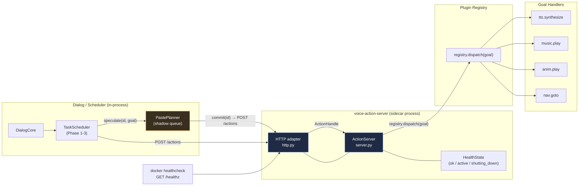

# Action Protocol — Architecture Overview

> Phase 4 deliverable. Companion to ADR-0011 (Action Protocol).
> Code: `src/rob_box_voice/rob_box_voice/action_server/`
> Wire schemas: [`../../schemas/action-protocol/openapi.yaml`](../../schemas/action-protocol/openapi.yaml), [`../../schemas/action-protocol/proto/v1/action-protocol.proto`](../../schemas/action-protocol/proto/v1/action-protocol.proto)
> ADR: [`../adr/0011-action-protocol/README.md`](../adr/0011-action-protocol/README.md)

## 1. Why a separate action server?

The voice runtime (Phase 1–3) owns goal lifecycle in-process: each executor
(`tts_node`, `music_node`, `anim_node`, `nav_node`) schedules its own async
tasks, with ad‑hoc cooperative cancellation through `asyncio.Lock`, shared
dicts and ROS topic feedback. That worked for a single process, but issue
[#968](https://github.com/krikz/rob_box_project/issues/968) §11.5 surfaces
three structural problems that this protocol solves:

1. **Goal lifecycle is not a first-class primitive.** Long‑running actions
   need a uniform `submit → feedback → result | cancel | failed` shape so
   that callers (dialogue, scheduler, PASTE planner) can reason about them
   without per-executor knowledge.
2. **Speculative execution must not produce side effects.** PASTE
   ([arXiv 2603.18897](https://arxiv.org/abs/2603.18897)) prefetches N+1
   candidates in a shadow queue; only the **committed** one is allowed to
   publish audio, drive motors, or call an external tool. In‑process
   speculative work cannot enforce this guarantee reliably.
3. **Health and graceful shutdown must be observable.** Docker healthchecks
   and SIGTERM handling today are scattered. A separate sidecar makes
   `/healthz`, `active_goals`, and `shutdown(timeout=2.0)` first-class.

The action server is therefore a **transport-neutral long-lived process**
that owns goal lifecycle. ROS topics (`/voice/audio/speech`,
`/harness/task_events`) remain as a fallback during migration; the new
sidecar is the canonical path.

## 2. Component diagram



ASCII fallback (rendered in any monospace viewer):

```
+--------------------------+        HTTP+JSON         +-------------------------+
|  Dialog / Scheduler      |  POST /actions            |  voice-action-server    |
|  (in-process, PASTE)     |  GET  /actions/{id}       |  (sidecar, transport-   |
|                          |  POST /actions/{id}/cancel|   neutral core)         |
|  PastePlanner.shadow     | -----------------------> |                         |
|     ─ speculate(id,g)    |                           |  ActionServer owns      |
|     ─ commit(id)         | <-------- 202 ----------  |   - lifecycle           |
|     ─ discard(id)        | <-------- 200 ----------  |   - feedback stream     |
|                          | <-------- 503 ----------  |   - cancel + shutdown   |
+--------------------------+        /healthz           +-----------+-------------+
                                                                       |
                                                          registry.dispatch(goal)
                                                                       |
                                                       +---------------v--------------+
                                                       |  Plugin handlers             |
                                                       |   - tts.synthesize           |
                                                       |   - music.play               |
                                                       |   - anim.play                |
                                                       |   - nav.goto                 |
                                                       +------------------------------+
```

## 3. Module layout

| Module | Role | Transport aware? |
|---|---|---|
| `server.py` | Core: `ActionServer`, `ActionHandle`, `ActionState`, `Health`. Owns goal lifecycle, feedback stream, cancellation, shutdown. | **No** |
| `paste.py` | `PastePlanner`: speculative `speculate` / `commit` / `discard` / `discard_all`. Side-effect-free by contract. | **No** |
| `http.py` | Optional `aiohttp` adapter exposing `/healthz`, `/actions`, `/actions/{id}`, `/actions/{id}/cancel`. | Yes (HTTP only) |
| `http_server.py` | Standalone entry point: env config, signal handlers, graceful shutdown. | Yes (HTTP) |
| `__init__.py` | Public API surface (`ActionServer`, `ActionState`, `PastePlanner`, …). | No |

The core never imports `aiohttp`. Deployments without HTTP (e.g. bare ROS
hosts, integration tests) can use `ActionServer` and `PastePlanner` directly.

## 4. Action lifecycle

`ActionState` is an append-only enum (never remove a value; add new ones at
the end of the wire schema and bump the minor version).

```
       submit()
   ACCEPTED ──► RUNNING ──► SUCCEEDED    (handler returned a value)
                  │  │
                  │  └────► FAILED        (handler raised non-CancelledError)
                  │
                  └──────► CANCELLED      (cancel() or shutdown() or task cancel)
```

A handler signature:

```python
async def handler(goal: Mapping[str, Any],
                  feedback: Callable[[Mapping[str, Any]], None],
                  cancelled: asyncio.Event) -> Any: ...
```

It receives both a **cooperative** `cancelled` event and asyncio task
cancellation. Either signal must terminate the goal. Side effects (network
calls, audio publish, external tool invocation) must only happen on the
**commit** path of a PASTE goal — speculative handlers must remain
side-effect-free.

## 5. How it relates to PASTE

`PastePlanner` (in the dialogue process) and `ActionServer` (in the sidecar)
cooperate over HTTP+JSON:

1. `PastePlanner.speculate(id, goal)` starts a **side-effect-free** task in
   the shadow queue. It does **not** submit to the action server.
2. When the planner decides which candidate to keep, it calls
   `commit(id)`, which is the first time the action becomes a real goal.
   For step-1/2, this is implemented as `POST /actions` with the goal.
3. `PastePlanner.discard(id)` cancels the shadow task. If the shadow task
   had already been submitted to the action server, `discard` also calls
   `POST /actions/{goal_id}/cancel` so the handler stops promptly.
4. On any failure (handler raise, network drop, shutdown), the action
   server transitions the goal to `FAILED` or `CANCELLED` and returns the
   terminal state on the next `GET /actions/{goal_id}` poll.

This means the action server sees **only committed** work — the sidecar
itself does not run speculative code. Speculation lives entirely in the
caller process; the sidecar is the system of record for **real** work.

## 6. Health, cancellation, and shutdown

- **`/healthz`** returns `200 {ok, active_goals, shutting_down}` while the
  server is healthy, `503` once `shutdown()` has begun. Docker healthcheck
  uses this endpoint (10s interval, 3s timeout, 3 retries).
- **`cancel(goal_id)`** sets the cooperative event *and* calls
  `asyncio.Task.cancel()`. Handlers that ignore the cooperative event are
  still terminated by the task cancel.
- **`shutdown(timeout=2.0)`** sets `shutting_down=True`, cancels all
  active goals, awaits them up to `timeout` seconds. SIGTERM and SIGINT
  in `http_server.main()` both trigger this. The default timeout for the
  standalone entrypoint is `ACTION_SERVER_SHUTDOWN_TIMEOUT=5.0` to give
  longer-running TTS streams a chance to drain — see
  [`../runbooks/action-server.md`](../runbooks/action-server.md).

## 7. Versioning

The wire schema is versioned independently from `rob_box_voice`:

| Schema | Version | Source of truth |
|---|---|---|
| OpenAPI | `1.0.0` | `docs/schemas/action-protocol/openapi.yaml` |
| Protobuf  | `1.0.0` | `docs/schemas/action-protocol/proto/v1/action-protocol.proto` |

A breaking change to any enum or required field bumps the **major** version.
A new state, optional field, or new endpoint bumps the **minor** version.
The protocol currently has one transport (HTTP+JSON) and one binding
(protobuf) — see ADR-0011 §4.3 for the gRPC migration plan.

## 8. See also

- ADR-0011 — full architectural decision record, transport rationale
- [API reference](../api/action-protocol.md) — endpoint summary, payload examples, link to OpenAPI
- [Plugin getting started](../guides/action-server-plugin-getting-started.md) — how to register a new handler
- [Runbook](../runbooks/action-server.md) — deploy, monitor, troubleshooting, graceful shutdown
- CHANGELOG.md — `Phase 4 — Action Server + PASTE`
