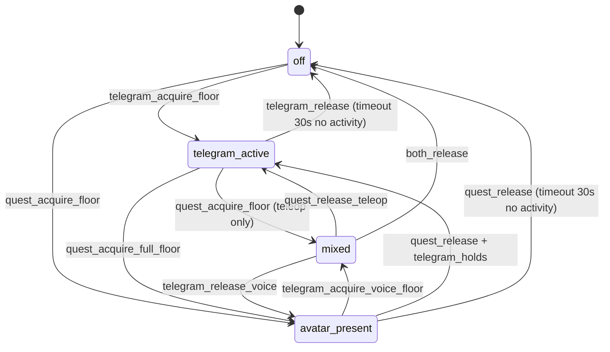

# rob_box_quest — WebSocket / REST API контракт

> Companion-документ к [ADR-0027](../adr/0027-meta-quest-ar-control.md).
> Описывает **точный** wire-протокол между веб-клиентом (браузер desktop/планшет
> или Meta Quest WebXR) и сервисом `rob_box_quest` (Vision Pi). Это reference
> для реализации Phase 1; до Phase 1 — заморожен, любые изменения через
> ADR-0027 amendment.

## 1. Транспорт

- **Сетевой уровень:** HTTPS + WSS (WebSocket over TLS 1.3).
- **Endpoint:** `wss://10.1.1.11:8443/quest` (single endpoint, multiplexed).
- **Альтернативный HTTP-endpoint** (для healthcheck и pre-auth UI):
  `https://10.1.1.11:8443/healthz`, `https://10.1.1.11:8443/`.
- **TLS:** self-signed сертификат на Caddy (см. ADR-0027 §4.1). CN =
  `quest.rob_box.local`, SAN = `10.1.1.11`. Импортируется в Meta Quest
  через Settings → Privacy → Security → Trusted Sources (один раз).
- **Auth:** 6-значный PIN, передаётся в `HELLO`-фрейме.
- **Subprotocol:** `robbox-quest-v1` обязателен для Phase 1 (Quest →
  `rob_box_quest`). Phase 2 (Quest → `avatar_supervisor`) требует
  `robbox-quest-v2` (см. §11); mismatch → `ERROR{PROTOCOL_VERSION}` (§8).

## 2. Frame format (binary)

Единый формат для всех сообщений, оба направления:

```
[1 byte : type]
[4 bytes: stream_id (little-endian uint32)]
[varint : payload_len (LEB128)]
[payload_len bytes : payload]
```

- **`type`** — 1 байт, см. таблицу §3.
- **`stream_id`** — uint32, клиент и сервер используют **разные** диапазоны,
  чтобы не пересечься:
  - Client-initiated streams (commands): `0x0001..0x0FFF`
  - Server-initiated streams (data): `0x1000..0xFFFF`
  - `0x0000` зарезервирован для control-фреймов (`HELLO`, `WELCOME`,
    `GOODBYE`, `ERROR`).
- **`payload_len`** — LEB128 varint; позволяет payload до 16 MiB (для
  одного H.264 NAL-unit этого хватит с запасом; большие скан-блоки
  LiDAR режутся на ≤ 64 KiB чанки).
- **`payload`** — для `BINARY_FRAME` = сырой байтовый массив; для
  `JSON_CMD` / `HELLO` / `WELCOME` / `SUBSCRIBE` / `ERROR` = JSON
  (UTF-8, без BOM). **Не** MessagePack в payload — JSON человеко-читаем
  и проще дебажится из web-консоли; payload компактных потоков
  (LiDAR 2D-scan ~360 точек, voice_state event) и так влезает.

## 3. Frame types

| `type` | Имя | Направление | Payload schema |
|---|---|---|---|
| `0x01` | `HELLO` | client → server | `{client_version: "0.1.0", capabilities: ["webxr","hand_tracking"], session_pin: "123456"}` |
| `0x02` | `WELCOME` | server → client | `{server_version: "0.1.0", session_id: "<uuid4>", server_time_ms: 1234567890, robot_status: {...}, teleop_floor_held_by: "<client_id>"\|null}` |
| `0x03` | `SUBSCRIBE` | client → server | `{topic: "camera_rear"\|"camera_front"\|"lidar_2d"\|"lidar_3d"\|"voice_state"\|"robot_status"\|"person_detections", quality: "low"\|"med"\|"high"}` |
| `0x04` | `UNSUBSCRIBE` | client → server | `{topic: "..."}` |
| `0x10` | `BINARY_FRAME` | server → client | binary blob (raw bytes; topic указан в subscribe-confirm или заголовке см. §4) |
| `0x11` | `JSON_CMD` | client → server | см. §5 |
| `0x12` | `JSON_EVENT` | server → client | см. §6 |
| `0x20` | `GOODBYE` | обе стороны | `{reason: "user_logout"\|"shutdown"\|"timeout"\|"auth_fail"}` |
| `0xFF` | `ERROR` | обе стороны | `{code: "AUTH_FAIL"\|"BAD_PAYLOAD"\|"RATE_LIMIT"\|"TOPIC_UNKNOWN"\|"FLOOR_HELD"\|"MODE_CONFLICT"\|"INTERNAL", message: "..."}` |
| `0x30` | `SET_MODE` | client → supervisor | msgpack `{client_id, mode: "off"\|"telegram_active"\|"avatar_present"\|"mixed"\|"teleop_only"\|"voice_only"}` |
| `0x31` | `ACQUIRE_FLOOR` | client → supervisor | msgpack `{client_id, floor: "teleop"\|"voice"}` |
| `0x32` | `RELEASE_FLOOR` | client → supervisor | msgpack `{client_id, floor: "teleop"\|"voice"}` |
| `0x33` | `STATE_UPDATE` | supervisor → client | msgpack `{state: <packed AvatarState>}` — публикуется на каждое изменение FSM/floor-ов + 1 Hz keep-alive |

> **AV-19 (issue #1911, ADR-0028 §4.4 S10)** — heartbeat-контракт:
> пока клиент держит `teleop_floor`, он шлёт `teleop_heartbeat` (см.
> §5 «JSON_CMD») не реже **10 Гц**. Сервер **пересылает** каждый такой
> фрейм в ROS-топик `/teleop_heartbeat` (msgpack `std_msgs/String`).
> Никакого «авто-loop» на сервере: источник живости — клиент. Если
> heartbeat не приходит > 500 мс — супервизор снимает `teleop_floor`
> (см. ADR-0028 §6 Q4, dead-man).

**Handshake:**

```
client → HELLO   (stream_id=0)
server → WELCOME (stream_id=0)
client → SUBSCRIBE(camera_rear)
client → SUBSCRIBE(lidar_2d)
client → SUBSCRIBE(robot_status)
server → BINARY_FRAME(camera_rear) ...    (loop)
server → JSON_EVENT(voice_state=idle)     (event)
client → JSON_CMD(teleop_twist)           (loop, 30 Hz max)
...
client → GOODBYE(reason="user_logout")
```

**FSM режимов супервизора** (источник истины —
[ADR-0028 §4.1](../adr/0028-avatar-supervisor.md#41-режимы-аватара-fsm)):



`SET_MODE` (`0x30`) без согласования с FSM даёт `ERROR{MODE_CONFLICT}` (§8).

## 4. `BINARY_FRAME` — server → client data streams

Каждый server-initiated stream (после `SUBSCRIBE`) получает свой
`stream_id` из диапазона `0x1000..0xFFFF`. Чтобы клиент понимал, что
именно внутри `BINARY_FRAME`, в начало каждого фрейма добавлен
**4-байтовый topic-tag** (только для BINARY_FRAME, для JSON_CMD/JSON_EVENT
топик внутри JSON):

```
[4 bytes: topic_id (LE)]   ← внутри payload, перед данными
[N bytes: raw data]
```

`topic_id` — uint32, ассоциация задаётся в `SUBSCRIBE-confirm`:

| Topic UI-name | topic_id | Формат data |
|---|---|---|
| `camera_rear` | `0x1001` | H.264 Annex-B NAL-units (один или несколько подряд; не Annex-B целиком, потому что клиент сам собирает Annex-B для MediaSource) |
| `camera_front` | `0x1002` | (Phase 2) — панорамная передняя камера |
| `lidar_2d` | `0x1101` | little-endian float32: `[angle_min, angle_max, angle_inc, range_min, range_max, time_increment, scan_time, n_points]` + `n_points × float32 ranges` + `n_points × float32 intensities` (соответствует `sensor_msgs/LaserScan` ROS2 msg) |
| `lidar_3d` | `0x1102` | zstd-compressed MessagePack: подвыборка PointCloud2 до 10k точек, `{n_points, frame_id, fields: ["x","y","z","intensity"], points: [[x,y,z,i], ...]}` |
| `robot_status` | `0x1201` | MessagePack `{battery_pct, wifi_rssi, mode, vel_linear, vel_angular, ts_ms}` — 1 Hz |
| `voice_state` | `0x1202` | MessagePack `{state: "idle"\|"listening"\|"thinking"\|"speaking"\|"denied", ts_ms, utterance_id?, holder_id?, detail?}` — event-driven. См. §6 `JSON_EVENT{type:voice_state}` для семантики `denied`/`holder_id`/`detail` (добавлены в PR #1930 + #1933 под аудит G8/G19, см. issue #1912). |
| `person_detections` | `0x1301` | MessagePack `{ts_ms, detections: [{id, cls, x, y, z, w, h, conf}]}` — Phase 2 (R11) |

**Frequency policy:**

- `camera_rear`: до 30 fps (CBR), quality=high; 15 fps при quality=med;
  10 fps при quality=low.
- `lidar_2d`: 10 Hz всегда (LiDAR физически столько даёт).
- `lidar_3d`: 2 Hz (тяжёлый, клиент может unsubscribe если не нужен).
- `robot_status`: 1 Hz всегда (пока не unsubscribe).
- `voice_state`: event-driven (только при смене состояния).

**Backpressure:** если клиент не успевает читать, сервер применяет
`drop-oldest` политику для потоковых топиков (camera, lidar) — лучше
потерять кадр, чем копить очередь в RAM. Для `robot_status` и `voice_state`
— `drop-newest` (последний статус всегда интереснее).

## 5. `JSON_CMD` — client → server

```json
{
  "cmd": "teleop_twist",
  "ts_ms": 1234567890,
  "seq": 12345,
  "linear":  {"x": 0.5, "y": 0.0, "z": 0.0},
  "angular": {"x": 0.0, "y": 0.0, "z": 0.3},
  "deadman": true
}
```

`deadman=true` ОБЯЗАН быть на каждом teleop-фрейме; если `false` —
сервер игнорирует фрейм (это страховка от «отпустил grip, но пакет
застрял в TCP буфере и пришёл позже»). Throttle: не чаще 30 Гц
(`seq` монотонный, сервер отбрасывает фреймы с повторным `seq`).

> **AV-19 — `teleop_twist` и `teleop_floor`.** При
> `require_teleop_floor=true` (ROS-параметр ноды
> `quest_node`, default `false`) и если эта сессия **не** держит
> `teleop_floor` (т.е. `WELCOME.teleop_floor_held_by != session_id`
> и/или клиент получил `ERROR{FLOOR_HELD}` хотя бы раз), сервер:
>
> 1. **Не** публикует `cmd_vel_quest` (robot не двигается).
> 2. Шлёт `ERROR{FLOOR_HELD}` **rate-limited** (≤ 1 Гц на сессию),
>    иначе на 30 Гц `teleop_twist` зальём сокет ошибками.
> 3. **Не** релеит `teleop_heartbeat` от этой сессии (клиент не
>    должен жить в логе супервизора как владелец floor).
>
> `stop_emergency` (§5) **всегда** в обход гейта — аварийная остановка
> обязана работать у любого клиента, у кого бы ни был floor.

```json
{
  "cmd": "teleop_heartbeat",
  "ts_ms": 1234567890,
  "seq": 12345
}
```

AV-19 (ADR-0028 §4.4 S10): клиент шлёт `teleop_heartbeat` 10 Гц пока
**ARM + floor наш**. Сервер пробрасывает каждый фрейм в ROS-топик
`/teleop_heartbeat` (`std_msgs/String`, JSON `{"client_id",
"ts_ms", "seq"}`). Клиент НЕ шлёт heartbeat в `armed_no_floor`,
`idle`, или `stopping` — иначе супервизор примет чужую сессию за
живого владельца и не снимет floor. Это **отдельный** контракт от
существующего ping/watchdog (`connection.ts`), их не смешивать.

```json
{
  "cmd": "ui_button",
  "ts_ms": 1234567890,
  "button": "sound_play" | "sound_stop" | "light_toggle" | "led_preset:<name>",
  "press": true | false
}
```

Маппинг `button` → ROS-сервис: phase-1 — hardcoded dict в `rob_box_quest`,
phase-2 — registry из `rob_box_voice/command_node.py`.

```json
{
  "cmd": "voice_mode",
  "ts_ms": 1234567890,
  "mode": "off" | "passthrough" | "ttts_proxy" | "stt_llm" | "llm_formalize"
}
```

Переключает параметр `voice_input_mode` в `dialogue_node` через
`set_parameters` (атомарно). Сервер отвечает `JSON_EVENT{type: "voice_mode_ack", mode: ...}`.

```json
{
  "cmd": "voice_ptt_start",
  "ts_ms": 1234567890,
  "mode": "radio" | "robot_voice"
}
```

Phase 2.1+. Заменяет старый `voice_ptt {state: start|stop}` (см. §11.2).
Edge-triggered: при `start` сервер публикует в `/audio/quest_in` до
получения `voice_ptt_stop`. `mode` определяет маршрут аудио-потока:

- `radio` — голос оператора → динамик робота (Passthrough/PTT);
- `robot_voice` — голос оператора → STT → LLM → TTS голосом робота.

При `mode=robot_voice` клиент ОБЯЗАН также отправить `voice_mode
{mode: "ttts_proxy"}` перед `voice_ptt_start` (или в одном батче) —
иначе supervisor оставит `voice_input_mode=respeaker` и STT не
услышит клиента (ADR-0028 §5).

```json
{
  "cmd": "voice_ptt_stop",
  "ts_ms": 1234567890,
  "mode": "radio" | "robot_voice"
}
```

Edge-triggered stop. Клиент ОБЯЗАН указать тот же `mode`, что и в
start (если рассогласование — сервер игнорирует и логирует).

```json
{
  "cmd": "set_voice",
  "ts_ms": 1234567890,
  "voice_id": "alena",
  "preset": "standard" | "friendly" | "authoritative" | "whisper"
}
```

Phase 2 §4.3. Меняет активный голос TTS на сервере. `preset`
опционален — если не указан, сервер использует текущий preset голоса.
Сервер отвечает `JSON_EVENT{type: "voice_set_ack", voice_id, preset}`
или `voice_set_nack` с reason.

```json
{
  "cmd": "list_voices",
  "ts_ms": 1234567890
}
```

Phase 2 §4.1. Запрос списка доступных голосов. Сервер отвечает
`JSON_EVENT{type: "voice_list", voices: [...]}` где `voices[]` —
массив `VoiceInfo` (`voice_id`, `display_name`, `language`,
`gender`, `description`, `presets?`).

```json
{
  "cmd": "preview_voice",
  "ts_ms": 1234567890,
  "voice_id": "alena",
  "text": "Привет, оператор!",
  "request_id": "<uuid>"
}
```

Phase 2 §4.2. Сервер синтезирует `text` голосом `voice_id` и шлёт
аудио обратно через `JSON_EVENT{type:"preview_voice_audio", format,
seq, total}` + `BINARY_FRAME`. Финал — `preview_voice_done` или
`preview_voice_error`. `request_id` обязателен (клиент матчит
несколько параллельных preview).

```json
{
  "cmd": "set_panel_topic",
  "ts_ms": 1234567890,
  "panel_id": "panel_1",
  "topic": "camera_oak_color"
}
```

Phase 2 §6.2. Меняет топик, который рендерится в данной panel.
Сервер переключает `subscribe_ack` на новый topic (если ещё не
подписан — стартует подписку, старый topic — unsubscribe если
больше никто не слушает).

```json
{
  "cmd": "stop_emergency",
  "ts_ms": 1234567890,
  "source": "controller_b" | "ui_button" | "client_lost"
}
```

Публикует в `/safety/emergency_stop`. `source=client_lost` отправляется
сервером автоматически через Wi-Fi watchdog (§3.3 ADR-0027).

```json
{
  "cmd": "stream_list",
  "ts_ms": 1234567890
}
```

Phase 2 (R10). Сервер отвечает `JSON_EVENT{type: "stream_list", topics: [...]}`
— список доступных стримов для стрим-селектора.

```json
{
  "cmd": "admin_logs",
  "ts_ms": 1234567890,
  "service": "dialogue_node" | "rob_box_quest" | "all",
  "tail": 100,
  "follow": false
}
```

Phase 2 (R14). Сервер читает `docker logs <service>` (или journald) и отвечает
`JSON_EVENT{type: "admin_logs_chunk", ...}`. `follow=true` — стриминг до
`admin_logs_stop`. Для PoC — read-only; restart/диагностика — отдельная
карточка (Q11).

```json
{
  "cmd": "admin_logs_stop",
  "ts_ms": 1234567890
}
```

Останавливает `follow`-стриминг логов.

### 5.1. Supervisor-команды (Phase 2, subprotocol `robbox-quest-v2`)

Те же 4 supervisor-команды из §3 (`0x30`–`0x33`) доступны как `JSON_CMD`
для HTTP/REST-клиентов и для v1-инфраструктуры (`JSON_CMD` уже работает
в `rob_box_quest`). Бинарные frame-типы — preferred для Quest-клиента;
JSON-обёртка нужна для admin-панели и тестовых клиентов. Caddy/daemon
маршрутизирует их в `avatar_supervisor` (ROS 2 service proxy, ADR-0028 §4.4).

| `cmd` (JSON) | Эквивалент frame | Поля | Ошибки |
|---|---|---|---|
| `supervisor_set_mode` | `0x30 SET_MODE` | `client_id`, `mode` | `MODE_CONFLICT` (FSM отклонила) |
| `supervisor_acquire_floor` | `0x31 ACQUIRE_FLOOR` | `client_id`, `floor` | `FLOOR_HELD` (другой клиент) |
| `supervisor_release_floor` | `0x32 RELEASE_FLOOR` | `client_id`, `floor` | `FLOOR_HELD` (not_held_by_caller); идемпотентно для своего floor |
| `supervisor_get_state` | `0x33 STATE_UPDATE` | — | — (poll-эквивалент) |

Пример `supervisor_acquire_floor`:

```json
{"cmd": "supervisor_acquire_floor", "ts_ms": 1234567890, "seq": 12346, "client_id": "<uuid>", "floor": "teleop"}
```

Успех — клиент видит свой `client_id` в `state.floors.<floor>`
очередного `STATE_UPDATE` / `JSON_EVENT{type: "supervisor_state"}`.

## 6. `JSON_EVENT` — server → client (control/notification)

```json
{ "type": "voice_mode_ack", "mode": "stt_llm", "ts_ms": 1234567890 }
{ "type": "safety_stop",    "reason": "controller_b" | "client_lost", "ts_ms": 1234567890 }
{ "type": "robot_alert",    "active": true, "code": "BATTERY_LOW", "level": "warn",  "args": {"pct": 12},          "ts_ms": 1234567890 }
{ "type": "robot_alert",    "active": false, "code": "BATTERY_LOW", "level": "info", "args": {},                 "ts_ms": 1234567890 }
{ "type": "robot_alert",    "active": true, "code": "WIFI_WEAK",    "level": "warn",  "args": {"rssi_dbm": -78},   "ts_ms": 1234567890 }
{ "type": "robot_alert",    "active": true, "code": "ROBOT_STUCK",  "level": "error", "args": {"cmd_linear":0.5, "cmd_angular":0.0, "odom_motion_s":4.2}, "ts_ms": 1234567890 }
{ "type": "subscribe_ack",  "topic": "camera_rear", "stream_id": 0x1001, "quality": "med" }
{ "type": "subscribe_nack", "topic": "lidar_3d", "reason": "topic_not_available_yet" }
{ "type": "heartbeat",      "ts_ms": 1234567890 }   // каждые 200 мс, см. §7
{ "type": "voice_state",    "state": "speaking", "ts_ms": 1234567890, "utterance_id": "..." }
// state ∈ "idle"|"listening"|"thinking"|"speaking"|"denied".
// Опциональные поля:
//   holder_id — FloorHolder.label() держателя floor'а
//               (формат "<client_id>:<session_id_short>"); присутствует в
//               listening/speaking/denied, отсутствует в idle.
//   detail    — человеко-читаемая подсказка для UI. Для state="denied"
//               всегда имеет формат "busy: <holder_id>".
// Семантика (см. issue #1912, G8/G19, rob_box_quest/server/voice_floor.py):
//   idle      → floor свободен (никто не говорит).
//   listening → клиент-держатель нажал PTT (push-to-talk активен).
//   speaking  → робот озвучивает ответ (TTS фаза).
//   thinking  → LLM обрабатывает (между STT и TTS).
//   denied    → второй клиент попытался PTT, пока floor занят;
//               отправляется ТОЛЬКО requester-у (не broadcast).
{ "type": "stream_list",    "topics": ["camera_rear", "camera_front", "lidar_2d"], "ts_ms": 1234567890 }
{ "type": "admin_logs_chunk", "service": "dialogue_node", "lines": ["..."], "ts_ms": 1234567890 }
{ "type": "admin_logs_end",   "service": "dialogue_node", "ts_ms": 1234567890 }
{ "type": "ping",           "ts_ms": 1234567890, "nonce": "..." }   // см. §7
{ "type": "pong",           "ts_ms": 1234567890, "nonce": "..." }
{ "type": "voice_list",     "voices": [...], "ts_ms": 1234567890 }     // §4.1
{ "type": "voice_set_ack",  "voice_id": "alena", "preset": "friendly", "ts_ms": 1234567890 } // §4.3
{ "type": "voice_set_nack", "voice_id": "alena", "reason": "voice_unavailable", "ts_ms": 1234567890 }
{ "type": "preview_voice_audio", "request_id": "...", "format": "opus", "content_type": "audio/ogg", "seq": 0, "total": 1, "ts_ms": 1234567890 } // §4.2
{ "type": "preview_voice_done",  "request_id": "...", "ts_ms": 1234567890 }
{ "type": "preview_voice_error", "request_id": "...", "reason": "tts_timeout", "ts_ms": 1234567890 }
{ "type": "stream_select_ack",  "topic": "camera_oak_color", "stream_id": 0x1002, "kind": "jpeg" } // §6.2
// AV-19: сервер сообщает, что наша сессия больше не держит
// teleop_floor (dead-man 500 мс, FSM-переход супервизора, или
// ручной release). Клиент обязан мгновенно DISARM-нуться
// (teleop_fsm.setHasFloor(false)) и показать тост «возьми руль».
{ "type": "floor_lost",     "floor": "teleop"|"voice", "reason": "external_supervisor_or_lost", "ts_ms": 1234567890 }
```

`robot_alert` codes (Phase 1): `BATTERY_LOW (<20%)`, `WIFI_WEAK (<-75 dBm)`,
`ROBOT_STUCK (3 с нет cmd_vel)`, `OVER_TEMP`. Phase 3 — `KIDNAPPED` (twist_mux
рапорт о внезапном отсутствии contact с роботом), `LIDAR_TIMEOUT`.

**Edge semantics (AV-26 / R7, реализовано в `streams/alerts.py` +
QuestNode alert timer 1 Гц):**

- `active: true` — алёрт только что поднялся (или повторно подтверждён,
  гистерезис ещё не сработал). `level ∈ {warn, error}`.
- `active: false` — алёрт снят (порог + гистерезис + выдержка отпустили).
  `level` всегда `"info"`, `args` остаются для аудита. `code` совпадает
  с тем, что был в `active:true` — клиент матчит по коду.
- Сервер шлёт событие **только на изменении** (60 одинаковых тиков → 1
  событие; исчезновение алёрта — отдельное событие `active:false`).
- **Гистерезис**: алёрт снимается только когда условие прошло через
  порог с запасом (5% для батареи, 5 dBm для Wi-Fi). Без этого на
  границе порога было бы мигание 1 Гц.
- **Выдержка 10 с**: `BATTERY_LOW` / `WIFI_WEAK` не поднимаются
  мгновенно — только если условие держится непрерывно 10 с. `ROBOT_STUCK`
  выдержкой не ограничен: `stuck_timeout_s = 3 с` уже играет её роль.
- **Отсутствие источника** (`battery_pct = -1`, `wifi_rssi = 0`,
  `/odom` не приходил): алёрт НЕ выдумываем — клиент видит «—» в
  status HUD. Принцип из `streams/battery.py` (честный FAIL лучше
  красивого PASS): см. ADR-0018.

**Пороги (ROS-параметры QuestNode, дублируют дефолты в
`webxr_client/src/scene/status_hud.ts:31-33` для подсветки HUD-строк):**

| Параметр | Дефолт | Где дублируется |
|---|---|---|
| `alert_battery_low_pct` | `20` | `status_hud.ts` `BATTERY_LOW_PCT = 20` |
| `alert_battery_hysteresis_pct` | `5` | (только сервер) |
| `alert_wifi_weak_dbm` | `-75` | `status_hud.ts` `WIFI_WEAK_DBM = -75` |
| `alert_wifi_hysteresis_dbm` | `5` | (только сервер) |
| `alert_stuck_timeout_s` | `3.0` | (только сервер) |
| `alert_stuck_cmd_eps` | `0.05` | (только сервер) |
| `alert_hold_ms` | `10000` | (только сервер) |

Дефолт совпадает со значениями в `status_hud.ts:31-33` чтобы клиент и
сервер не разъехались на «свежке» с пустыми параметрами ноды
(см. acceptance AV-26: «в PR цитата обеих сторон рядом»).

## 7. Heartbeat, latency, reconnect

- **Server → client heartbeat:** каждые 200 мс `JSON_EVENT{type: "heartbeat",
  ts_ms: <server_time>}`. Клиент, не получивший 3 подряд (600 мс) → UI
  показывает «CONNECTION LOST», стик подсвечивается красным, grip
  автоматически отпускается (dead-man fail-safe).
- **Client → server ping:** раз в 5 с клиент шлёт `JSON_EVENT{type: "ping",
  nonce}`; сервер отвечает `JSON_EVENT{type: "pong", nonce}`. RTT
  выводится в UI как «Wi-Fi RTT: 23 ms».
- **Reconnect strategy:** клиент при разрыве пытается переподключиться
  exponential backoff (1 с → 30 с). При успехе — `HELLO` с тем же PIN
  (PIN ротируется только при перезапуске контейнера, не при разрыве).

## 8. Error codes (`ERROR`-frame)

| Code | Когда | Что клиент делает |
|---|---|---|
| `AUTH_FAIL` | Неверный PIN | показать «Wrong PIN, ask operator for current one» |
| `BAD_PAYLOAD` | payload не парсится / не проходит schema | drop frame, лог в UI-console |
| `RATE_LIMIT` | teleop_twist чаще 30 Hz | drop frame, throttle на клиенте |
| `TOPIC_UNKNOWN` | subscribe на topic, которого нет в registry | показать «Topic not available» |
| `TOPIC_NOT_AVAILABLE_YET` | source-данные ещё не пришли (lidar не запущен) | автоматический retry через 1 с |
| `INTERNAL` | неожиданная ошибка сервера | UI показывает «Server error, reconnect» |
| `PROTOCOL_VERSION` | subprotocol не совпадает с поддерживаемой версией (см. §11) | close socket, UI «Update client» |
| `FLOOR_HELD` | `0x31 ACQUIRE_FLOOR` / `supervisor_acquire_floor` — запрошенный floor уже держит другой `client_id`; или `0x32 RELEASE_FLOOR` для floor-а, который клиент не держит. **AV-19**: также шлётся при `teleop_twist` без своего `teleop_floor` (`require_teleop_floor=true`), rate-limited ≤ 1 Гц. | показать «Floor held by another operator» (см. ADR-0028 §4.2 transfer-протокол) или тост «возьми руль» (AV-19) |
| `MODE_CONFLICT` | `0x30 SET_MODE` / `supervisor_set_mode` — FSМ супервизора отклонила переход | показать «Mode not allowed now» |

## 9. Rate limits (Phase 1)

| Frame | Max rate | Action on overflow |
|---|---|---|
| `teleop_twist` | 30 Hz (per client) | drop + `ERROR{RATE_LIMIT}` |
| `teleop_heartbeat` | 10 Hz (per client, AV-19) | клиент сам throttle'ит через `teleop_fsm.heartbeatCmd`; relay 1:1 |
| `ui_button` | 5 Hz | drop |
| `voice_ptt_start` / `voice_ptt_stop` | edge-triggered, max 2 start/s | drop |
| `voice_mode` | 1 per 5 s | drop |
| `set_voice` | 1 per 2 s | drop |
| `list_voices` | 1 per 10 s | drop |
| `preview_voice` | 1 per 5 s, max 3 concurrent `request_id` | drop |
| `set_panel_topic` | 5 Hz per panel | drop |
| `stop_emergency` | 1 per 100 ms | drop |
| `ping` | 1 per 5 s | drop |

Server-side enforcement — token bucket per client; reset при reconnect.

## 10. Пример полного handshake (Phase 1, MVP)

```
[t=0]      client → server   HELLO  {client_version: "0.1.0", capabilities: ["webxr"], session_pin: "123456"}
[t=10ms]   server → client   WELCOME  {server_version: "0.1.0", session_id: "...", robot_status: {battery_pct: 87, mode: "idle"}}
[t=15ms]   client → server   SUBSCRIBE  {topic: "camera_rear", quality: "med"}
[t=16ms]   server → client   subscribe_ack  {topic: "camera_rear", stream_id: 0x1001, quality: "med"}
[t=16ms]   client → server   SUBSCRIBE  {topic: "lidar_2d"}
[t=17ms]   server → client   subscribe_ack  {topic: "lidar_2d", stream_id: 0x1101}
[t=17ms]   client → server   SUBSCRIBE  {topic: "robot_status"}
[t=18ms]   server → client   subscribe_ack  {topic: "robot_status", stream_id: 0x1201}
[t=33ms]   server → client   BINARY_FRAME  stream_id=0x1001  topic_id=0x1001  [H.264 NAL: SPS]
[t=33ms]   server → client   BINARY_FRAME  stream_id=0x1001  topic_id=0x1001  [H.264 NAL: PPS]
[t=66ms]   server → client   BINARY_FRAME  stream_id=0x1001  topic_id=0x1001  [H.264 NAL: IDR]
[t=99ms]   server → client   BINARY_FRAME  stream_id=0x1001  topic_id=0x1001  [H.264 NAL: non-IDR]
...
[t=100ms]  client → server   JSON_CMD  {cmd: "teleop_twist", linear: {x: 0.5}, angular: {z: 0.0}, deadman: true, seq: 1}
[t=200ms]  server → client   heartbeat  {ts_ms: ...}
[t=200ms]  client → server   JSON_CMD  {cmd: "teleop_twist", linear: {x: 0.5}, angular: {z: 0.0}, deadman: true, seq: 2}
...
[t=5000ms] client → server   JSON_EVENT  {type: "ping", nonce: "abc"}
[t=5003ms] server → client   JSON_EVENT  {type: "pong", nonce: "abc"}
```

## 11. Совместимость и версионирование

- `server_version` / `client_version` — semver.
- Negotiation: если `client_version > server_version` (major mismatch) →
  close с `ERROR{PROTOCOL_VERSION}`.
- Если `client_version < server_version` (minor mismatch) → `WELCOME`
  с предупреждением; несовместимые поля просто игнорируются клиентом.
- Любое изменение **формата payload** = major bump → новый subprotocol,
  Caddy маршрутизирует на другой endpoint.

### 11.1. Subprotocol-уровни

| Subprotocol | Поколение клиента | Обязательные frame-типы | Эндпоинт |
|---|---|---|---|
| `robbox-quest-v1` | Phase 1 (Quest → `rob_box_quest`) | `0x01`..`0x20`, `0xFF`, `0x10`–`0x12` | `wss://<vision-pi>:8443/quest` |
| `robbox-quest-v2` | Phase 2 (Quest → `avatar_supervisor`) | `0x01`..`0x20`, `0xFF`, `0x30`–`0x33` | тот же endpoint, маршрутизация по `subprotocol` |

**Negotiation (aiohttp, при WS-handshake):** сервер объявляет оба subprotocol
через `WebSocketResponse(protocols=("robbox-quest-v2", "robbox-quest-v1"))`.
aiohttp выбирает первый совпавший из объявленных клиентом. Клиент без
`Sec-WebSocket-Protocol` — сервер fallback на v2 (первый в списке) для новых
сессий, но рекомендуется явно объявлять — иначе `Sec-WebSocket-Protocol`-aware
инфраструктура может ругаться. См. реализацию — `SUPPORTED_SUBPROTOCOLS_V2`
в `server/session.py`.

**Backward-compat:** при `subprotocol = "robbox-quest-v1"` сервер (Phase 2 build)
отвечает `ERROR{PROTOCOL_VERSION}` и **немедленно закрывает сокет** при попытке
v1-клиента отправить `0x30`/`0x31`/`0x32` (supervisor-команды); v1-сессии НЕ
получают `0x33 STATE_UPDATE` ни в ответ на команды, ни в keep-alive 1 Hz
(см. §11.2 для деталей по выбранному поведению). v1 клиент не понимает
`0x30`–`0x33`, а v2-сессия требует supervisor-aware flow. Клиент обязан быть
перекомпилирован с флагом `--subprotocol=v2` перед подключением к Phase 2
серверу.

**Forward-compat:** v2 сервер также принимает `subprotocol = "robbox-quest-v1"`
*только* в режиме `monitor` (ADR-0028 §4.5) — read-only наблюдение за
камерами/лидаром/роботом; supervisor-команды (`0x30`–`0x33`, §5.1) молча
игнорируются с лог-записью `client_id=... subprotocol=v1 ignored supervisor
frame 0x3X`. Это нужно для поэтапного rollout: сначала деплоим supervisor в
`monitor`, потом обновляем Quest-клиент.

Изменение семантики существующего frame-типа = bump subprotocol (v3+).
Новое поле в payload — без bump-а (клиент игнорирует неизвестные поля).

### 11.2. Поведение v1 vs v2 для supervisor-frame-ов (AV-16, #1908)

Карточка AV-16 закрывает отсутствующую реализацию клиентского supervisor API
в `rob_box_quest`. Конкретный поведенческий контракт:

| Действие клиента | v1-сессия | v2-сессия |
|---|---|---|
| `0x30 SET_MODE` (msgpack) | `ERROR{PROTOCOL_VERSION}` + close | `Bridge.supervisor_set_mode` → `STATE_UPDATE` (msgpack) при `applied=true`, `ERROR{MODE_CONFLICT}` иначе |
| `0x31 ACQUIRE_FLOOR` (msgpack) | `ERROR{PROTOCOL_VERSION}` + close | `Bridge.supervisor_acquire_floor` → `STATE_UPDATE` при `granted=true`, `ERROR{FLOOR_HELD}` (с `held_by` в message) иначе |
| `0x32 RELEASE_FLOOR` (msgpack) | `ERROR{PROTOCOL_VERSION}` + close | `Bridge.supervisor_release_floor` → `STATE_UPDATE` при `applied=true`, `ERROR{FLOOR_HELD}` (с `held_by`) иначе |
| `0x33 STATE_UPDATE` (от клиента) | — `STATE_UPDATE` только server→client | — `STATE_UPDATE` только server→client |
| сервер шлёт `0x33 STATE_UPDATE` | не отправляется (§11.2 per-row) | broadcast на каждое изменение `/avatar/state` + keep-alive 1 Hz (§3 строка 66) |
| `JSON_CMD{supervisor_set_mode}` etc. (§5.1) | `ERROR{PROTOCOL_VERSION}` | `JSON_EVENT{type:supervisor_state, state, ts_ms}` |

**Почему `ERROR`, а не молча игнорировать.** Альтернативой была бы «молча
проглатывать 0x31 на v1-сессии с лог-записью `subprotocol=v1 ignored`. Это тот
же механизм, что прятал баги в AV-14 («клиент шлёт лишнее — сервер молча ест»),
поэтому v1-клиент СРАЗУ получит явный сигнал обновиться через
`ERROR{PROTOCOL_VERSION}`. См. §8 коды ошибок.

**`client_id` — серверный, не client-supplied.** Все supervisor-вызовы (`0x30..0x32`,
JSON-эквиваленты) получают `client_id = "quest:<session_id>"`, сформированный
сервером в момент HELLO. Значение `client_id` из payload-а **игнорируется**, при
несовпадении пишется WARNING в лог. Защита от Telegram-spoofing: клиент НЕ
должен иметь возможность представиться чужим `client_id`.

**Service-call timeouts.** `Bridge.supervisor_*` вызывает ROS-сервисы через
`asyncio.run_coroutine_threadsafe(call_async, ros_loop)` с timeout 50 мс.
«Зависший» supervisor degradation на `INTERNAL` (`applied=False/reason=
supervisor_service_timeout`), НЕ блокирует event-loop aiohttp (acceptance
критерий карточки). Если сервис вообще не задеплоен — fallback
`service_unavailable` с `applied=False`.

### 11.3. Эволюция полей в Phase 2.1+

На subprotocol `robbox-quest-v1` поверх Phase 1.0 контракта добавились
новые команды и события **без bump-а subprotocol** (naming evolution):

| Было (Phase 1.0) | Стало (Phase 2.1+) | Когда |
|---|---|---|
| `voice_ptt {state: "start"\|"stop"}` | `voice_ptt_start` / `voice_ptt_stop` + `mode` (`radio`\|`robot_voice`) | Aug 2026 |
| — | `voice_mode {mode: "ttts_proxy"\|...}` | Перед `voice_ptt_start{robot_voice}` (ADR-0028 §5) |
| — | `set_voice {voice_id, preset?}` / `voice_set_ack` / `voice_set_nack` | Phase 2 §4.3 |
| — | `list_voices` / `voice_list` | Phase 2 §4.1 |
| — | `preview_voice {voice_id, text, request_id}` / `preview_voice_audio` / `preview_voice_done` / `preview_voice_error` | Phase 2 §4.2 |
| — | `set_panel_topic {panel_id, topic}` / `stream_select_ack` | Phase 2 §6.2 |

Старые клиенты (Phase 1.0), присылающие `voice_ptt {state:"start"}`,
будут проигнорированы сервером Phase 2.1+ (warning в логе, голосовой
канал не открывается). Совместимости со старым форматом нет — это
**breaking change в семантике** (но не в формате subprotocol-уровня,
поэтому v1 сохранён).

## 12. Что НЕ в Phase 1 (out of scope для дизайна, отложено)

- mTLS / OAuth / TOTP (Phase 3, см. ADR-0027 §6 Q3).
- Multi-user arbitration (Phase 3, ADR-0027 §6 Q2). Phase 2 закрывает
  Quest vs Telegram через supervisor (ADR-0028).
- 3D-pointcloud streaming на 30 Hz (Phase 3, лень клиента + bandwidth).
- Hand-tracking pinch-grab для AR-объектов (Phase 2 опц., ADR-0027 §6 Q5).
- Spatial audio с HRTF (Phase 3, ADR-0027 §6 Q6).
- Replay/logging — записи сессий для отладки (Phase 3).