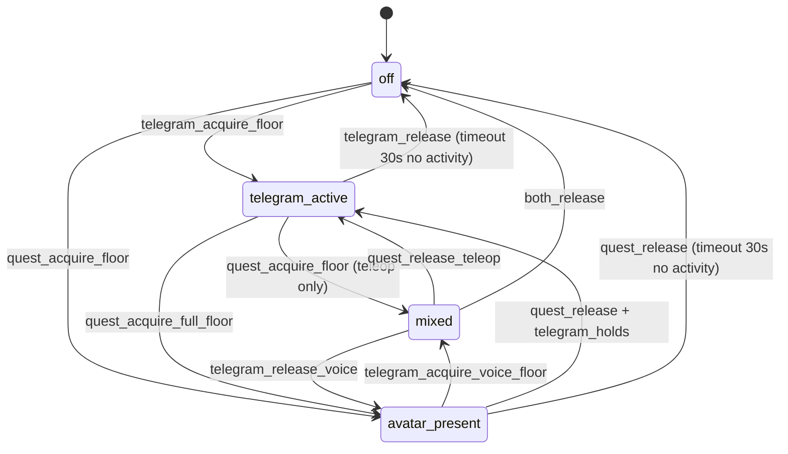

# rob_box_quest — WebSocket / REST API контракт

> Companion-документ к [ADR-0027](../adr/0027-meta-quest-ar-control.md).
> Описывает **точный** wire-протокол между веб-клиентом (браузер desktop/планшет
> или Meta Quest WebXR) и сервисом `rob_box_quest` (Vision Pi). Это reference
> для реализации Phase 1; до Phase 1 — заморожен, любые изменения через
> ADR-0027 amendment.

## 1. Транспорт

- **Сетевой уровень:** HTTPS + WSS (WebSocket over TLS 1.3).
- **Endpoint:** `wss://10.1.1.11:8443/quest` (single endpoint, multiplexed).
- **Альтернативный HTTP-endpoint** (для healthcheck и pre-auth UI):
  `https://10.1.1.11:8443/healthz`, `https://10.1.1.11:8443/`.
- **TLS:** self-signed сертификат на Caddy (см. ADR-0027 §4.1). CN =
  `quest.rob_box.local`, SAN = `10.1.1.11`. Импортируется в Meta Quest
  через Settings → Privacy → Security → Trusted Sources (один раз).
- **Auth:** 6-значный PIN, передаётся в `HELLO`-фрейме.
- **Subprotocol:** `robbox-quest-v1` обязателен для Phase 1 (Quest →
  `rob_box_quest`). Phase 2 (Quest → `avatar_supervisor`) требует
  `robbox-quest-v2` (см. §11); mismatch → `ERROR{PROTOCOL_VERSION}` (§8).

## 2. Frame format (binary)

Единый формат для всех сообщений, оба направления:

```
[1 byte : type]
[4 bytes: stream_id (little-endian uint32)]
[varint : payload_len (LEB128)]
[payload_len bytes : payload]
```

- **`type`** — 1 байт, см. таблицу §3.
- **`stream_id`** — uint32, клиент и сервер используют **разные** диапазоны,
  чтобы не пересечься:
  - Client-initiated streams (commands): `0x0001..0x0FFF`
  - Server-initiated streams (data): `0x1000..0xFFFF`
  - `0x0000` зарезервирован для control-фреймов (`HELLO`, `WELCOME`,
    `GOODBYE`, `ERROR`).
- **`payload_len`** — LEB128 varint; позволяет payload до 16 MiB (для
  одного H.264 NAL-unit этого хватит с запасом; большие скан-блоки
  LiDAR режутся на ≤ 64 KiB чанки).
- **`payload`** — для `BINARY_FRAME` = сырой байтовый массив; для
  `JSON_CMD` / `HELLO` / `WELCOME` / `SUBSCRIBE` / `ERROR` = JSON
  (UTF-8, без BOM). **Не** MessagePack в payload — JSON человеко-читаем
  и проще дебажится из web-консоли; payload компактных потоков
  (LiDAR 2D-scan ~360 точек, voice_state event) и так влезает.

## 3. Frame types

| `type` | Имя | Направление | Payload schema |
|---|---|---|---|
| `0x01` | `HELLO` | client → server | `{client_version: "0.1.0", capabilities: ["webxr","hand_tracking"], session_pin: "123456"}` |
| `0x02` | `WELCOME` | server → client | `{server_version: "0.1.0", session_id: "<uuid4>", server_time_ms: 1234567890, robot_status: {...}}` |
| `0x03` | `SUBSCRIBE` | client → server | `{topic: "camera_rear"\|"camera_front"\|"lidar_2d"\|"lidar_3d"\|"voice_state"\|"robot_status"\|"person_detections", quality: "low"\|"med"\|"high"}` |
| `0x04` | `UNSUBSCRIBE` | client → server | `{topic: "..."}` |
| `0x10` | `BINARY_FRAME` | server → client | binary blob (raw bytes; topic указан в subscribe-confirm или заголовке см. §4) |
| `0x11` | `JSON_CMD` | client → server | см. §5 |
| `0x12` | `JSON_EVENT` | server → client | см. §6 |
| `0x20` | `GOODBYE` | обе стороны | `{reason: "user_logout"\|"shutdown"\|"timeout"\|"auth_fail"}` |
| `0xFF` | `ERROR` | обе стороны | `{code: "AUTH_FAIL"\|"BAD_PAYLOAD"\|"RATE_LIMIT"\|"TOPIC_UNKNOWN"\|"FLOOR_HELD"\|"MODE_CONFLICT"\|"INTERNAL", message: "..."}` |
| `0x30` | `SET_MODE` | client → supervisor | msgpack `{client_id, mode: "off"\|"telegram_active"\|"avatar_present"\|"mixed"\|"teleop_only"\|"voice_only"}` |
| `0x31` | `ACQUIRE_FLOOR` | client → supervisor | msgpack `{client_id, floor: "teleop"\|"voice"}` |
| `0x32` | `RELEASE_FLOOR` | client → supervisor | msgpack `{client_id, floor: "teleop"\|"voice"}` |
| `0x33` | `STATE_UPDATE` | supervisor → client | msgpack `{state: <packed AvatarState>}` — публикуется на каждое изменение FSM/floor-ов + 1 Hz keep-alive |
| `0x40` | `TELEMETRY_PERF` (binary) | client → server | msgpack `{fps_mean, fps_p99, gpu_ms, vram_mb, wss_latency_ms, resolution_scale, stale_frames, thermal_level, battery_pct, source, session_id, ts_ms, seq}` — слайд-window 1 Hz агрегаты от Quest-клиента (Phase 2.2, ADR-0032 §3.5). Сервер логирует в `/quest/perf` и опционально в sqlite. |

**Handshake:**

```
client → HELLO   (stream_id=0)
server → WELCOME (stream_id=0)
client → SUBSCRIBE(camera_rear)
client → SUBSCRIBE(lidar_2d)
client → SUBSCRIBE(robot_status)
server → BINARY_FRAME(camera_rear) ...    (loop)
server → JSON_EVENT(voice_state=idle)     (event)
client → JSON_CMD(teleop_twist)           (loop, 30 Hz max)
...
client → GOODBYE(reason="user_logout")
```

**FSM режимов супервизора** (источник истины —
[ADR-0028 §4.1](../adr/0028-avatar-supervisor.md#41-режимы-аватара-fsm)):



`SET_MODE` (`0x30`) без согласования с FSM даёт `ERROR{MODE_CONFLICT}` (§8).

## 4. `BINARY_FRAME` — server → client data streams

Каждый server-initiated stream (после `SUBSCRIBE`) получает свой
`stream_id` из диапазона `0x1000..0xFFFF`. Чтобы клиент понимал, что
именно внутри `BINARY_FRAME`, в начало каждого фрейма добавлен
**4-байтовый topic-tag** (только для BINARY_FRAME, для JSON_CMD/JSON_EVENT
топик внутри JSON):

```
[4 bytes: topic_id (LE)]   ← внутри payload, перед данными
[N bytes: raw data]
```

`topic_id` — uint32, ассоциация задаётся в `SUBSCRIBE-confirm`:

| Topic UI-name | topic_id | Формат data |
|---|---|---|
| `camera_rear` | `0x1001` | H.264 Annex-B NAL-units (один или несколько подряд; не Annex-B целиком, потому что клиент сам собирает Annex-B для MediaSource) |
| `camera_front` | `0x1002` | (Phase 2) — панорамная передняя камера |
| `lidar_2d` | `0x1101` | little-endian float32: `[angle_min, angle_max, angle_inc, range_min, range_max, time_increment, scan_time, n_points]` + `n_points × float32 ranges` + `n_points × float32 intensities` (соответствует `sensor_msgs/LaserScan` ROS2 msg) |
| `lidar_3d` | `0x1102` | zstd-compressed MessagePack: подвыборка PointCloud2 до 10k точек, `{n_points, frame_id, fields: ["x","y","z","intensity"], points: [[x,y,z,i], ...]}` |
| `robot_status` | `0x1201` | MessagePack `{battery_pct, wifi_rssi, mode, vel_linear, vel_angular, ts_ms}` — 1 Hz |
| `voice_state` | `0x1202` | MessagePack `{state: "idle"\|"listening"\|"thinking"\|"speaking", ts_ms, utterance_id?}` — event-driven |
| `person_detections` | `0x1301` | MessagePack `{ts_ms, detections: [{id, cls, x, y, z, w, h, conf}]}` — Phase 2 (R11) |

**Frequency policy:**

- `camera_rear`: до 30 fps (CBR), quality=high; 15 fps при quality=med;
  10 fps при quality=low.
- `lidar_2d`: 10 Hz всегда (LiDAR физически столько даёт).
- `lidar_3d`: 2 Hz (тяжёлый, клиент может unsubscribe если не нужен).
- `robot_status`: 1 Hz всегда (пока не unsubscribe).
- `voice_state`: event-driven (только при смене состояния).

**Backpressure:** если клиент не успевает читать, сервер применяет
`drop-oldest` политику для потоковых топиков (camera, lidar) — лучше
потерять кадр, чем копить очередь в RAM. Для `robot_status` и `voice_state`
— `drop-newest` (последний статус всегда интереснее).

## 5. `JSON_CMD` — client → server

```json
{
  "cmd": "teleop_twist",
  "ts_ms": 1234567890,
  "seq": 12345,
  "linear":  {"x": 0.5, "y": 0.0, "z": 0.0},
  "angular": {"x": 0.0, "y": 0.0, "z": 0.3},
  "deadman": true
}
```

`deadman=true` ОБЯЗАН быть на каждом teleop-фрейме; если `false` —
сервер игнорирует фрейм (это страховка от «отпустил grip, но пакет
застрял в TCP буфере и пришёл позже»). Throttle: не чаще 30 Гц
(`seq` монотонный, сервер отбрасывает фреймы с повторным `seq`).

```json
{
  "cmd": "ui_button",
  "ts_ms": 1234567890,
  "button": "sound_play" | "sound_stop" | "light_toggle" | "led_preset:<name>",
  "press": true | false
}
```

Маппинг `button` → ROS-сервис: phase-1 — hardcoded dict в `rob_box_quest`,
phase-2 — registry из `rob_box_voice/command_node.py`.

```json
{
  "cmd": "voice_mode",
  "ts_ms": 1234567890,
  "mode": "off" | "passthrough" | "ttts_proxy" | "stt_llm" | "llm_formalize"
}
```

Переключает параметр `voice_input_mode` в `dialogue_node` через
`set_parameters` (атомарно). Сервер отвечает `JSON_EVENT{type: "voice_mode_ack", mode: ...}`.

```json
{
  "cmd": "voice_ptt",
  "ts_ms": 1234567890,
  "state": "start" | "stop"
}
```

Edge-triggered. Сервер публикует в `/audio/quest_in` только пока
`state=start`. Phase-2.

```json
{
  "cmd": "stop_emergency",
  "ts_ms": 1234567890,
  "source": "controller_b" | "ui_button" | "client_lost"
}
```

Публикует в `/safety/emergency_stop`. `source=client_lost` отправляется
сервером автоматически через Wi-Fi watchdog (§3.3 ADR-0027).

```json
{
  "cmd": "stream_list",
  "ts_ms": 1234567890
}
```

Phase 2 (R10). Сервер отвечает `JSON_EVENT{type: "stream_list", topics: [...]}`
— список доступных стримов для стрим-селектора.

```json
{
  "cmd": "admin_logs",
  "ts_ms": 1234567890,
  "service": "dialogue_node" | "rob_box_quest" | "all",
  "tail": 100,
  "follow": false
}
```

Phase 2 (R14). Сервер читает `docker logs <service>` (или journald) и отвечает
`JSON_EVENT{type: "admin_logs_chunk", ...}`. `follow=true` — стриминг до
`admin_logs_stop`. Для PoC — read-only; restart/диагностика — отдельная
карточка (Q11).

```json
{
  "cmd": "admin_logs_stop",
  "ts_ms": 1234567890
}
```

Останавливает `follow`-стриминг логов.

### 5.1. Supervisor-команды (Phase 2, subprotocol `robbox-quest-v2`)

Те же 4 supervisor-команды из §3 (`0x30`–`0x33`) доступны как `JSON_CMD`
для HTTP/REST-клиентов и для v1-инфраструктуры (`JSON_CMD` уже работает
в `rob_box_quest`). Бинарные frame-типы — preferred для Quest-клиента;
JSON-обёртка нужна для admin-панели и тестовых клиентов. Caddy/daemon
маршрутизирует их в `avatar_supervisor` (ROS 2 service proxy, ADR-0028 §4.4).

| `cmd` (JSON) | Эквивалент frame | Поля | Ошибки |
|---|---|---|---|
| `supervisor_set_mode` | `0x30 SET_MODE` | `client_id`, `mode` | `MODE_CONFLICT` (FSM отклонила) |
| `supervisor_acquire_floor` | `0x31 ACQUIRE_FLOOR` | `client_id`, `floor` | `FLOOR_HELD` (другой клиент) |
| `supervisor_release_floor` | `0x32 RELEASE_FLOOR` | `client_id`, `floor` | `FLOOR_HELD` (not_held_by_caller); идемпотентно для своего floor |
| `supervisor_get_state` | `0x33 STATE_UPDATE` | — | — (poll-эквивалент) |

Пример `supervisor_acquire_floor`:

```json
{"cmd": "supervisor_acquire_floor", "ts_ms": 1234567890, "seq": 12346, "client_id": "<uuid>", "floor": "teleop"}
```

Успех — клиент видит свой `client_id` в `state.floors.<floor>`
очередного `STATE_UPDATE` / `JSON_EVENT{type: "supervisor_state"}`.

## 6. `JSON_EVENT` — server → client (control/notification)

```json
{ "type": "voice_mode_ack", "mode": "stt_llm", "ts_ms": 1234567890 }
{ "type": "safety_stop",    "reason": "controller_b" | "client_lost", "ts_ms": 1234567890 }
{ "type": "robot_alert",    "level": "warn" | "error", "code": "BATTERY_LOW", "args": {"pct": 12}, "ts_ms": 1234567890 }
{ "type": "subscribe_ack",  "topic": "camera_rear", "stream_id": 0x1001, "quality": "med" }
{ "type": "subscribe_nack", "topic": "lidar_3d", "reason": "topic_not_available_yet" }
{ "type": "heartbeat",      "ts_ms": 1234567890 }   // каждые 200 мс, см. §7
{ "type": "voice_state",    "state": "speaking", "ts_ms": 1234567890, "utterance_id": "..." }
{ "type": "stream_list",    "topics": ["camera_rear", "camera_front", "lidar_2d"], "ts_ms": 1234567890 }
{ "type": "admin_logs_chunk", "service": "dialogue_node", "lines": ["..."], "ts_ms": 1234567890 }
{ "type": "admin_logs_end",   "service": "dialogue_node", "ts_ms": 1234567890 }
{ "type": "ping",           "ts_ms": 1234567890, "nonce": "..." }   // см. §7
{ "type": "pong",           "ts_ms": 1234567890, "nonce": "..." }
{ "type": "telemetry_perf", "ts_ms": 1234567890, "seq": 12345, "source": "webxr", "session_id": "...",
   "fps_mean": 89.2, "fps_p99": 73.1, "frame_time_p99_ms": 13.7,
   "gpu_ms": 6.8, "vram_mb": 84.2, "wss_latency_ms": 23,
   "resolution_scale": 1.0, "stale_frames": 0,
   "thermal_level": 1, "battery_pct": 78 }   // см. §6.1, ADR-0032 §3.5
```

`robot_alert` codes (Phase 1): `BATTERY_LOW (<20%)`, `WIFI_WEAK (<-75 dBm)`,
`ROBOT_STUCK (3 с нет cmd_vel)`, `OVER_TEMP`. Phase 3 — `KIDNAPPED` (twist_mux
рапорт о внезапном отсутствии contact с роботом), `LIDAR_TIMEOUT`.

### 6.1. `telemetry_perf` event (Phase 2.2, ADR-0032 §3.5)

Quest-клиент собирает метрики производительности WebXR-сессии и шлёт
их серверу с фиксированной частотой **1 Hz** через `JSON_EVENT{type:
"telemetry_perf", ...}`. Сервер (`rob_box_quest`) републишит payload
в ROS2 топик `/quest/perf` (msgpack → JSON bridge) и пишет в
`/var/log/quest_perf/$(date +%Y-%m-%d).jsonl` для последующего
визуализирования через Grafana (Phase 3+).

| Поле | Тип | Источник | Комментарий |
|---|---|---|---|
| `ts_ms` | int | client clock | wall time отправки (с момента epoch) |
| `seq` | int | monotonic | монотонная последовательность для дедупа |
| `source` | `"desktop"` \| `"webxr"` | client | помогает фильтровать на сервере |
| `session_id` | string | WELCOME | для cross-reference с auth-логами |
| `fps_mean` | float | sliding window 1 с | среднее FPS; **отсутствует** если < 5 кадров в окне |
| `fps_p99` | float | sliding window 1 с | 99-й перцентиль FPS (= 1000 / frame_time_p99_ms) |
| `frame_time_p99_ms` | float | sliding window 1 с | 99-й перцентиль frame time (мс) |
| `gpu_ms` | float | `EXT_disjoint_timer_query_webgl2` | среднее GPU time за последние 16 sample'ов; **отсутствует** если расширение недоступно (desktop в некоторых браузерах) |
| `vram_mb` | float | `renderer.info.memory` (three.js) | оценка VRAM (геометрии + текстуры); сэмплируется раз в 5 с |
| `wss_latency_ms` | int | ping/pong EMA | текущая RTT (мс); EMA smoothing α=0.5 |
| `resolution_scale` | float | `XRWebGLLayer.getNativeFramebuffer()` / requested | отношение native / requested framebuffer; **отсутствует** в desktop |
| `stale_frames` | int | rAF monitor | количество пропущенных кадров за последнюю секунду |
| `thermal_level` | 0..4 | QuestMetrics / WebXR `XRDevice.thermalState` | 0=nominal, 1=fair, 2=serious, 3=critical, 4=shutdown |
| `battery_pct` | 0..100 | `navigator.getBattery()` / QuestMetrics | процент заряда |

**Throttle:** клиент агрегирует данные в sliding window 1 с и шлёт
payload не чаще 1 Гц (по умолчанию). Параметр `emitIntervalMs`
(Phase 3+) позволит настроить частоту для A/B тестов perf.

**Opt-out:** клиент НЕ шлёт telemetry если URL содержит `?telemetry=off`
(или `?telemetry=false`, `?telemetry=0`). Это для dev-сессий и
bench-тестов, чтобы не засорять лог. `?telemetry=on` — explicit opt-in
(default поведение).

**Server-side forward:** payload парсится, валидируется `seq` (drop
duplicates), и публикуется в ROS2 как `quest_msgs/QuestPerf` (Phase 2.3+
тип). До публикации типа payload сериализуется в `std_msgs/String`
(JSON) на топик `/quest/perf` для обратной совместимости.

## 7. Heartbeat, latency, reconnect

- **Server → client heartbeat:** каждые 200 мс `JSON_EVENT{type: "heartbeat",
  ts_ms: <server_time>}`. Клиент, не получивший 3 подряд (600 мс) → UI
  показывает «CONNECTION LOST», стик подсвечивается красным, grip
  автоматически отпускается (dead-man fail-safe).
- **Client → server ping:** раз в 5 с клиент шлёт `JSON_EVENT{type: "ping",
  nonce}`; сервер отвечает `JSON_EVENT{type: "pong", nonce}`. RTT
  выводится в UI как «Wi-Fi RTT: 23 ms».
- **Reconnect strategy:** клиент при разрыве пытается переподключиться
  exponential backoff (1 с → 30 с). При успехе — `HELLO` с тем же PIN
  (PIN ротируется только при перезапуске контейнера, не при разрыве).

## 8. Error codes (`ERROR`-frame)

| Code | Когда | Что клиент делает |
|---|---|---|
| `AUTH_FAIL` | Неверный PIN | показать «Wrong PIN, ask operator for current one» |
| `BAD_PAYLOAD` | payload не парсится / не проходит schema | drop frame, лог в UI-console |
| `RATE_LIMIT` | teleop_twist чаще 30 Hz | drop frame, throttle на клиенте |
| `TOPIC_UNKNOWN` | subscribe на topic, которого нет в registry | показать «Topic not available» |
| `TOPIC_NOT_AVAILABLE_YET` | source-данные ещё не пришли (lidar не запущен) | автоматический retry через 1 с |
| `INTERNAL` | неожиданная ошибка сервера | UI показывает «Server error, reconnect» |
| `PROTOCOL_VERSION` | subprotocol не совпадает с поддерживаемой версией (см. §11) | close socket, UI «Update client» |
| `FLOOR_HELD` | `0x31 ACQUIRE_FLOOR` / `supervisor_acquire_floor` — запрошенный floor уже держит другой `client_id`; или `0x32 RELEASE_FLOOR` для floor-а, который клиент не держит | показать «Floor held by another operator» (см. ADR-0028 §4.2 transfer-протокол) |
| `MODE_CONFLICT` | `0x30 SET_MODE` / `supervisor_set_mode` — FSМ супервизора отклонила переход | показать «Mode not allowed now» |

## 9. Rate limits (Phase 1)

| Frame | Max rate | Action on overflow |
|---|---|---|
| `teleop_twist` | 30 Hz (per client) | drop + `ERROR{RATE_LIMIT}` |
| `ui_button` | 5 Hz | drop |
| `voice_ptt` | edge-triggered, max 2 start/s | drop |
| `voice_mode` | 1 per 5 s | drop |
| `stop_emergency` | 1 per 100 ms | drop |
| `ping` | 1 per 5 s | drop |

Server-side enforcement — token bucket per client; reset при reconnect.

## 10. Пример полного handshake (Phase 1, MVP)

```
[t=0]      client → server   HELLO  {client_version: "0.1.0", capabilities: ["webxr"], session_pin: "123456"}
[t=10ms]   server → client   WELCOME  {server_version: "0.1.0", session_id: "...", robot_status: {battery_pct: 87, mode: "idle"}}
[t=15ms]   client → server   SUBSCRIBE  {topic: "camera_rear", quality: "med"}
[t=16ms]   server → client   subscribe_ack  {topic: "camera_rear", stream_id: 0x1001, quality: "med"}
[t=16ms]   client → server   SUBSCRIBE  {topic: "lidar_2d"}
[t=17ms]   server → client   subscribe_ack  {topic: "lidar_2d", stream_id: 0x1101}
[t=17ms]   client → server   SUBSCRIBE  {topic: "robot_status"}
[t=18ms]   server → client   subscribe_ack  {topic: "robot_status", stream_id: 0x1201}
[t=33ms]   server → client   BINARY_FRAME  stream_id=0x1001  topic_id=0x1001  [H.264 NAL: SPS]
[t=33ms]   server → client   BINARY_FRAME  stream_id=0x1001  topic_id=0x1001  [H.264 NAL: PPS]
[t=66ms]   server → client   BINARY_FRAME  stream_id=0x1001  topic_id=0x1001  [H.264 NAL: IDR]
[t=99ms]   server → client   BINARY_FRAME  stream_id=0x1001  topic_id=0x1001  [H.264 NAL: non-IDR]
...
[t=100ms]  client → server   JSON_CMD  {cmd: "teleop_twist", linear: {x: 0.5}, angular: {z: 0.0}, deadman: true, seq: 1}
[t=200ms]  server → client   heartbeat  {ts_ms: ...}
[t=200ms]  client → server   JSON_CMD  {cmd: "teleop_twist", linear: {x: 0.5}, angular: {z: 0.0}, deadman: true, seq: 2}
...
[t=5000ms] client → server   JSON_EVENT  {type: "ping", nonce: "abc"}
[t=5003ms] server → client   JSON_EVENT  {type: "pong", nonce: "abc"}
```

## 11. Совместимость и версионирование

- `server_version` / `client_version` — semver.
- Negotiation: если `client_version > server_version` (major mismatch) →
  close с `ERROR{PROTOCOL_VERSION}`.
- Если `client_version < server_version` (minor mismatch) → `WELCOME`
  с предупреждением; несовместимые поля просто игнорируются клиентом.
- Любое изменение **формата payload** = major bump → новый subprotocol,
  Caddy маршрутизирует на другой endpoint.

### 11.1. Subprotocol-уровни

| Subprotocol | Поколение клиента | Обязательные frame-типы | Эндпоинт |
|---|---|---|---|
| `robbox-quest-v1` | Phase 1 (Quest → `rob_box_quest`) | `0x01`..`0x20`, `0xFF`, `0x10`–`0x12` | `wss://<vision-pi>:8443/quest` |
| `robbox-quest-v2` | Phase 2 (Quest → `avatar_supervisor`) | `0x01`..`0x20`, `0xFF`, `0x30`–`0x33` | тот же endpoint, маршрутизация по `subprotocol` |

**Backward-compat:** при `subprotocol = "robbox-quest-v1"` сервер
(Phase 2 build) отвечает `ERROR{PROTOCOL_VERSION}` и закрывает сокет —
v1 клиент не понимает `0x30`–`0x33` и `STATE_UPDATE`, а v2-сессия
требует supervisor-aware flow. Клиент обязан быть перекомпилирован с
флагом `--subprotocol=v2` перед подключением к Phase 2 серверу.

**Forward-compat:** v2 сервер также принимает `subprotocol =
"robbox-quest-v1"` *только* в режиме `monitor` (ADR-0028 §4.5) —
read-only наблюдение за камерами/лидаром/роботом; supervisor-команды
(`0x30`–`0x33`, §5.1) молча игнорируются с лог-записью
`client_id=... subprotocol=v1 ignored supervisor frame 0x3X`. Это нужно
для поэтапного rollout: сначала деплоим supervisor в `monitor`, потом
обновляем Quest-клиент. **Решение фиксируется здесь:** в режиме
`monitor` v1-клиенты принимаются; в режиме `active` v1-клиенты
получают `ERROR{PROTOCOL_VERSION}` сразу. Реализация гранулярного
режима — карточка **AV-10**.

Изменение семантики существующего frame-типа = bump subprotocol (v3+).
Новое поле в payload — без bump-а (клиент игнорирует неизвестные поля).

## 12. Что НЕ в Phase 1 (out of scope для дизайна, отложено)

- mTLS / OAuth / TOTP (Phase 3, см. ADR-0027 §6 Q3).
- Multi-user arbitration (Phase 3, ADR-0027 §6 Q2). Phase 2 закрывает
  Quest vs Telegram через supervisor (ADR-0028).
- 3D-pointcloud streaming на 30 Hz (Phase 3, лень клиента + bandwidth).
- Hand-tracking pinch-grab для AR-объектов (Phase 2 опц., ADR-0027 §6 Q5).
- Spatial audio с HRTF (Phase 3, ADR-0027 §6 Q6).
- Replay/logging — записи сессий для отладки (Phase 3).