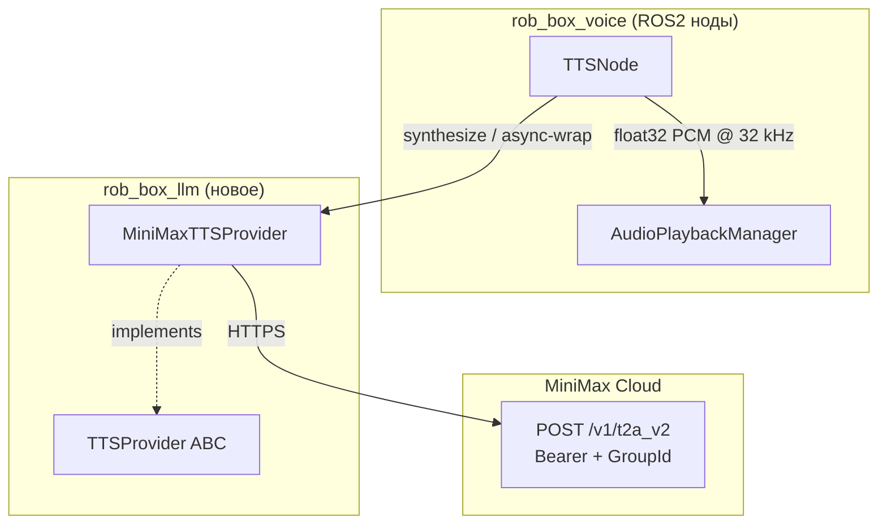

# MiniMax TTS-провайдер — архитектурный обзор

| Поле         | Значение                                                                |
|--------------|-------------------------------------------------------------------------|
| Статус       | Implemented                                                             |
| Дата         | 2026-07-20                                                              |
| Автор        | developer (Hermes Agent)                                                |
| Контекст     | Kanban task `t_ac5f796b`                                                |
| Родители     | `t_7e32da0e` (review архитектурного дизайна)                            |
| Связанные    | ADR-0001 (harness), `docs/adr/0002-minimax-provider.md`                 |
| Зависимости  | `rob_box_llm>=0.2.0`, `httpx>=0.27`                                     |

---

## 1. Мотивация

`TTSNode` (`src/rob_box_voice/rob_box_voice/tts_node.py`) исторически
работает с двумя провайдерами:

* **Yandex Cloud TTS gRPC v3** — основной, "оригинальный ROBBOX голос"
  (anton). Требует gRPC, аккаунт в Yandex Cloud, ключ + folder_id.
* **Silero v5** — офлайн-fallback, всегда работает, но качество заметно
  ниже и словарь ограничен.

В начале 2026 года в проекте появился интерес к MiniMax — китайскому
AI-провайдеру, который помимо LLM-сервиса (`MiniMax-M3`) даёт качественный
многоязычный TTS через API `T2A v2`. Преимущества:

* **Один аккаунт** для LLM + TTS + image generation (унификация счёта);
* **Поддержка русского** на уровне, сопоставимом с Yandex (голоса
  `male-qn-qingse`, `female-shaonv`, `Calm_Woman` и др.);
* **Эмоциональная окраска** (`emotion: "happy" | "sad" | "neutral" | …`) —
  то, чего нет ни у Yandex, ни у Silero;
* **Параметры pitch / volume / speed / text_normalization** — всё в одном
  HTTP-запросе;
* **Без gRPC** — обычный `POST /v1/t2a_v2` через HTTPS, проще дебажить и
  проксировать.

Цель — добавить MiniMax как **третий опциональный провайдер** TTS-ноды без
поломки текущего Yandex/Silero пайплайна.

## 2. Решение: P0.5 — TTSProvider ABC + MiniMaxTTSProvider

Расширяем `rob_box_llm` (P0 foundation из ADR-0001) TTS-абстракцией по
образу и подобию LLM-абстракции:

```python
class TTSProvider(abc.ABC):
    name: str

    async def synthesize(text, *, settings) -> TTSAudio: ...
    async def stream   (text, *, settings) -> AsyncIterator[TTSChunk]: ...
```

Value objects (`TTSAudio`, `TTSChunk`, `TTSSettings`, `TTSFormat`) — frozen
dataclasses; контракт симметричен `LLMProvider` (async-only, raise-before-yield).

Конкретная реализация — `MiniMaxTTSProvider`:

* HTTP-only (`httpx.AsyncClient`), без async-SDK, чтобы:
  * не зависеть от того, есть ли официальный Python-SDK у MiniMax;
  * мокать одной строкой через `httpx.MockTransport` в юнит-тестах;
* Ошибки доменной модели (`TTSError`, `TTSAuthError`, `TTSRateLimitError`,
  `TTSTimeoutError`, `TTSBadRequestError`) — те же категории, что и
  LLM-ошибки, но **отдельная иерархия** (не наследники `ProviderError`),
  чтобы `except ProviderError` в LLM-коде не ловил TTS-сбои.

## 3. Слой данных



PCM-байты MiniMax (int16 LE) декодируются в `numpy.float32 [-1, 1]` —
тот же формат, который уже использует `TTSNode` для Yandex и Silero.
**Никаких изменений в audio playback pipeline**.

## 4. Контракт API MiniMax T2A v2

| Поле                | Где                                | Значение                                          |
|---------------------|------------------------------------|---------------------------------------------------|
| Endpoint            | `https://api.minimax.io/v1/t2a_v2` | синхронный HTTP POST                              |
| Auth header         | `Authorization: Bearer <API_KEY>` | не OpenAI-стиль — обычный Bearer                  |
| Query param         | `GroupId=<GROUP_ID>`               | обязателен, идентификатор аккаунта                |
| Body `model`        | `"speech-02-hd"` \| `"speech-02-turbo"` | качество vs скорость                       |
| Body `voice_setting`| `{voice_id, speed, vol, pitch, emotion, language}` | эмоциональная окраска |
| Body `audio_setting`| `{sample_rate, bitrate, format, channel}` | MiniMax поддерживает pcm/mp3/wav, **не ogg**   |
| Response success    | `base_resp.status_code == 0`       | данные в `data.audio` (hex-кодированный PCM)      |
| Response error      | `base_resp.status_code != 0`       | категория по `status_msg` (auth/quota/invalid)   |

Маппинг языка: MiniMax принимает **полные английские названия**
(`"Russian"`, `"English"`, `"Chinese"`), не ISO-коды. Провайдер делает
прозрачный маппинг `ru → Russian`, `en → English`, и т.д. Неизвестные
коды передаются как есть — пусть API даст внятную ошибку.

## 5. Параметры ноды и конфигурация

### 5.1 ROS-параметры (для запуска через launch)

| Параметр            | Тип    | Default              | Описание                                      |
|---------------------|--------|----------------------|-----------------------------------------------|
| `provider`          | string | `"yandex"`           | `yandex` \| `silero` \| `minimax`             |
| `minimax_voice`     | string | `"male-qn-qingse"`   | MiniMax voice id                              |
| `minimax_model`     | string | `"speech-02-hd"`     | `"speech-02-hd"` \| `"speech-02-turbo"`       |
| `minimax_language`  | string | `"ru"`               | ISO-код или полное имя                        |
| `minimax_speed`     | float  | `1.0`                | 0.5 – 2.0                                     |
| `minimax_sample_rate` | int  | `32000`              | Hz                                            |
| `minimax_timeout`   | float  | `30.0`               | httpx timeout в секундах                      |
| `minimax_api_key`   | string | `""`                 | fallback на `os.getenv("MINIMAX_API_KEY")`     |
| `minimax_group_id`  | string | `""`                 | fallback на `os.getenv("MINIMAX_GROUP_ID")`    |

### 5.2 ENV-конфигурация

```bash
# .env.secrets (см. docker/vision/.env.secrets.template)
MINIMAX_API_KEY=eyJhbGciOi...
MINIMAX_GROUP_ID=1234567890
```

Параметр ROS имеет приоритет над ENV — если в launch-файле задан
`minimax_api_key`, ENV игнорируется. Это упрощает тесты (можно передать
фиктивный ключ через launch).

## 6. Конвертация выхода

MiniMax возвращает **16-bit little-endian mono PCM** в виде hex-строки.
Цепочка преобразований:

```
MiniMax API
  └─ data.audio: "00 01 02 03 …"  (hex, int16 LE, mono)
      └─ bytes.fromhex()           → raw int16 bytes
          └─ np.frombuffer(…, int16) → int16 numpy array
              └─ / 32768.0          → float32 [-1.0, 1.0]
                  └─ TTSNode pipeline (silero/yandex follow same path)
```

Sample rate берётся из `data.audio_sample_rate` (или из
`TTSSettings.sample_rate` если поле отсутствует) и передаётся вниз как
`sample_rate` numpy-массива, чтобы `tts_node` корректно ресемплил к
16 кГц для ReSpeaker.

## 7. Тестирование

Юнит-тесты (`src/rob_box_llm/test/test_minimax_tts_provider.py`,
`test_tts_value_objects.py`):

* **50 тестов** покрывают: payload-shape, language-mapping, hex-decode,
  HTTP error mapping (401/403/429/4xx/5xx/timeout), SSE-streaming,
  empty-text, missing-credentials, lifecycle (`aclose` закрывает только
  **собственный** httpx-клиент, не инжектированный).
* Все HTTP-взаимодействия замоканы через `httpx.MockTransport` — нет
  сети, нет sleep, тесты идут < 3 секунд.

```bash
cd src/rob_box_llm && PYTHONPATH=. python3 -m pytest -v
# 84 passed in 3.09s
```

## 8. Что НЕ делаем (явные out-of-scope)

1. **Не трогаем Yandex/Silero-путь** — поведение по умолчанию не меняется.
   `provider="yandex"` (default) работает идентично тому, что было.
2. **Не делаем streaming-chunk per SSE-frame** — собираем все SSE-кадры в
   один `TTSChunk` (samples=full_audio, `finish_reason="stop"`). Если
   понадобится chunk-per-frame, переключаемся на T2A WebSocket endpoint —
   отдельная задача.
3. **Не подменяем ROS-топики и payload-формат** — это инвариант P0
   foundation из ADR-0001. `_synthesize_and_play` принимает тот же
   `audio_np + sample_rate` dict, что и Yandex/Silero ветки.
4. **Не пишем Telegram-команду для переключения провайдера на лету** —
   это M6 из roadmap'а, отдельный use-case.

## 9. Риски

| Риск                                              | Митигация                                                       |
|---------------------------------------------------|-----------------------------------------------------------------|
| MiniMax изменит API или схему payload'а           | Маппинг инкапсулирован в `_build_payload` — точка изменения одна |
| Квота/рейте-лимит при первичной нагрузке          | Таймаут + `TTSRateLimitError` в ошибках; fallback на yandex через ROS-параметр |
| Качество голоса хуже Yandex на русском            | `provider=yandex` остаётся default — MiniMax только opt-in      |
| Потеря OGG-формата (хотелка Telegram voice)       | Явный fallback в `_build_payload` (`OGG → mp3`), `TTSAudio.format` сообщает что пришло |
| `rob_box_llm` не собран в Docker-образе           | ImportError-fallback в `tts_node.py`: `MINIMAX_AVAILABLE=False` |

## 10. Acceptance criteria

- [x] `MiniMaxTTSProvider` имплементирует `TTSProvider` ABC
- [x] Поддерживает параметры: voice, language, speed, audio format (PCM/MP3/WAV), sample_rate
- [x] Конфигурация через ENV (`MINIMAX_API_KEY`, `MINIMAX_GROUP_ID`) **и** через ROS-параметры
- [x] Выход конвертируется в формат, ожидаемый `tts_node` (float32 PCM numpy)
- [x] 50 unit-тестов с моками HTTP проходят за < 3 секунд
- [x] Документация: ADR-0002 + этот файл
- [x] Wire в `tts_node.py` — additive change, default behavior (`provider=yandex`) не сломан
- [x] `MINIMAX_AVAILABLE=False` если `rob_box_llm` не собран — graceful degradation
