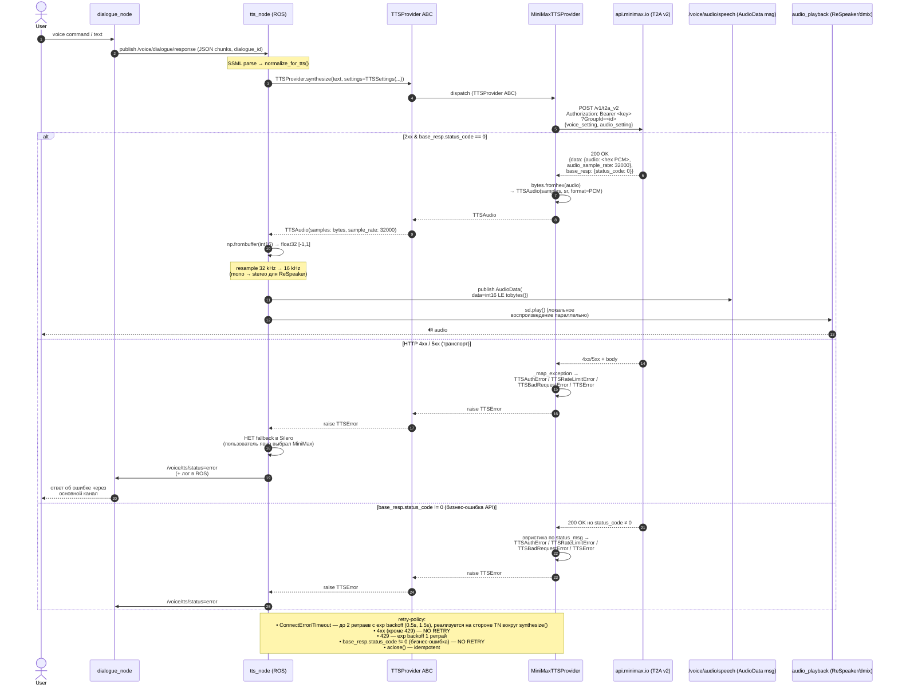

# MiniMax TTS-провайдер: архитектура интеграции

> TTS-специфичный архитектурный документ. Дополняет обзорный
> [`minimax-provider.md`](./minimax-provider.md) и фиксирует решения
> уровня ROS-ноды `tts_node` для синтеза речи через MiniMax T2A v2 HTTP.
> Родительский ADR — [`0002-minimax-provider.md`](../adr/0002-minimax-provider.md);
> этот документ — реализационная детализация и контрактный справочник
> для подзадач [`t_98a417b9`](../..) (реализация провайдера) и
> [`t_257dbfb9`](../..) (интеграция с ROS2).

| Поле | Значение |
| --- | --- |
| Статус | Accepted |
| Дата | 2026-07-20 |
| Контекст | Kanban task `t_034b1260`, PR #907, ADR-0002 |
| Родитель | ADR-0002 (MiniMax provider — LLM/TTS/image-gen) |
| Реализуется | `t_98a417b9` (HTTP-клиент + провайдер), `t_257dbfb9` (ROS-интеграция) |

---

## 1. Контекст и scope

`rob_box_voice/tts_node` — единая ROS2-нода, обслуживающая синтез и
воспроизведение речи робота. До MiniMax-интеграции имела двух
провайдеров:

- **Yandex Cloud TTS gRPC v3** — primary, voice `anton` (оригинальный
  ROBBOX-голос), требует сеть.
- **Silero v5** — офлайн-fallback, зашит в Docker-образ.

MiniMax-интеграция добавляет **третий опциональный провайдер**
(`provider=minimax`), активируемый через ROS-параметр. Когда
`provider=minimax`:

- MiniMax — **primary**, без fallback в Silero (пользователь явно
  выбрал MiniMax, молча откатиться — неуважение к выбору; tts_node
  пробрасывает ошибку наверх, и caller сам решает, что делать);
- Yandex-параметры остаются в конфиге, но не задействованы.

### 1.1 Что этот документ НЕ покрывает

- LLM-провайдер MiniMax (`MiniMax-M3`) — отдельный поток, см.
  обзорный `minimax-provider.md`.
- Image generation — фаза M5/M6 из ADR-0002.
- Полная замена Yandex → MiniMax — не входит в scope, MiniMax opt-in.

### 1.2 Что уже зафиксировано (и на чём мы стоим)

| Что | Где |
| --- | --- |
| ABC `TTSProvider` + value-объекты | `rob_box_llm/tts.py` |
| Иерархия ошибок `TTSError` | `rob_box_llm/errors.py` |
| `MiniMaxTTSProvider` (HTTP) | `rob_box_llm/providers/minimax_tts.py` |
| Wire-in в `tts_node.py` | `rob_box_voice/tts_node.py:34-47, 158-202, 293-305, 608-622, 924-977` |
| ADR верхнего уровня | `docs/adr/0002-minimax-provider.md` |

Этот документ не пересматривает эти решения — он описывает
**архитектурный контракт на стыке**, который должны соблюсти и
`backend` (HTTP-провайдер), и `ros2-engineer` (транскодинг/топик).

---

## 2. Маппинг параметров

### 2.1 `TTSSettings` → T2A v2 body

| `TTSSettings` (rob_box_llm) | MiniMax T2A v2 поле | Default если None | Валидация на стороне провайдера |
| --- | --- | --- | --- |
| `model` | `model` | `"speech-02-hd"` | — |
| `voice` | `voice_setting.voice_id` | `"male-qn-qingse"` | — |
| `language` (BCP-47 / full) | `voice_setting.language` | `"Russian"` (после маппинга) | `_LANGUAGE_ALIASES` для `"ru"→"Russian"` и т.п.; нераспознанный код передаётся as-is |
| `speed` | `voice_setting.speed` (float) | — | (диапазон провайдера: 0.5–2.0; валидируется API) |
| `volume` | `voice_setting.vol` (float) | — | `[0.0, 10.0]` — наружу → `TTSBadRequestError` (fail-fast) |
| `pitch` | `voice_setting.pitch` (int) | — | — |
| `emotion` | `voice_setting.emotion` | — | — |
| `sample_rate` | `audio_setting.sample_rate` | `32000` Hz | MiniMax поддерживает 8000/16000/22050/24000/32000/44100 |
| `format` | `audio_setting.format` | `TTSFormat.PCM` → `"pcm"` | `OGG` → `"mp3"` (MiniMax OGG не принимает) |
| `text_normalization` | `text_normalization` (top-level bool) | — | — |
| `extra` | top-level whitelist | — | allow-list 9 ключей; reserved (model/text/stream/voice_setting/audio_setting/text_normalization) → `TTSBadRequestError` |

Подробности allow-list и reserved-логика — `minimax_tts.py:_ALLOWED_EXTRA_KEYS`
и `_RESERVED_PAYLOAD_KEYS`.

### 2.2 ROS-параметры → `TTSSettings`

| ROS-параметр (tts_node) | Тип | Default | Источник | Куда идёт в `TTSSettings` |
| --- | --- | --- | --- | --- |
| `provider` | string | `"yandex"` | — | гейт: если `"minimax"` → MiniMax-путь |
| `minimax_api_key` | string | `""` | ROS или `MINIMAX_API_KEY` ENV | `MiniMaxTTSProvider(api_key=...)` |
| `minimax_group_id` | string | `""` | ROS или `MINIMAX_GROUP_ID` ENV | `MiniMaxTTSProvider(group_id=...)` |
| `minimax_voice` | string | `"male-qn-qingse"` | ROS | `TTSSettings.voice` |
| `minimax_model` | string | `"speech-02-hd"` | ROS | `TTSSettings.model` |
| `minimax_language` | string | `"ru"` | ROS | `TTSSettings.language` |
| `minimax_speed` | double | `1.0` | ROS или SSML `<prosody rate>` (приоритет SSML) | `TTSSettings.speed` |
| `minimax_sample_rate` | int | `32000` | ROS | `TTSSettings.sample_rate` |
| `minimax_timeout` | double | `30.0` | ROS | `MiniMaxTTSProvider(timeout=...)` |

**Приоритет источников:** ROS-параметр > ENV (только для
`api_key`/`group_id`). Для остальных полей ENV-fallback не реализован —
это намеренно: реконфигурация голоса/языка на лету через ROS — основной
путь, и держать дублирующие ENV для них = плодить источники правды.

**Приоритет внутри MiniMax-пути:** SSML `<prosody rate>` > ROS
`minimax_speed` (если SSML попал в `ssml_attributes["rate"]` — берём его).

### 2.3 Альтернативы, которые НЕ взяли

| Альтернатива | Почему отклонена |
| --- | --- |
| ENV fallback для всех 7 параметров | Дублирование источников правды; SSML уже покрывает runtime-переопределение |
| YAML-config в `/etc/rob_box/tts.yaml` | ROS-параметры уже дают override-механизм; добавление YAML = ещё одна правда |
| Динамический выбор голоса из MiniMax `/v1/voices` API | На дату 2026-07-20 endpoints `/v1/voices` нет в публичной доке T2A v2; отложено |

---

## 3. Схема конфигурации

```
┌──────────────────────────────────────────────────────────────────┐
│ Launch-time (yaml)                                               │
│   tts_node:                                                      │
│     ros__parameters:                                             │
│       provider: minimax                                          │
│       minimax_api_key: ""          # пусто → ENV                 │
│       minimax_group_id: ""         # пусто → ENV                 │
│       minimax_voice: "ru_male_001"                               │
│       minimax_model: "speech-02-turbo"                           │
│       minimax_language: "ru"                                     │
│       minimax_sample_rate: 32000                                 │
│       minimax_timeout: 30.0                                      │
└──────────────────────────────────────────────────────────────────┘
                            │
                            ▼
┌──────────────────────────────────────────────────────────────────┐
│ Runtime ENV (опционально, fallback только для секретов)           │
│   MINIMAX_API_KEY=eyJ...                                         │
│   MINIMAX_GROUP_ID=1234567890                                    │
└──────────────────────────────────────────────────────────────────┘
                            │
                            ▼
┌──────────────────────────────────────────────────────────────────┐
│ docker/vision/.env.secrets (зашит в compose, монтируется read-only)│
│   MINIMAX_API_KEY=...                                            │
│   MINIMAX_GROUP_ID=...                                           │
└──────────────────────────────────────────────────────────────────┘
```

**Инвариант:** секреты никогда не попадают в launch-yaml. `api_key` и
`group_id` — единственные поля с ENV-fallback; всё остальное — ROS.

---

## 4. Контракт выходных данных

### 4.1 Что MiniMax отдаёт

MiniMax T2A v2 при `audio_setting.format="pcm"`:

- **Контейнер:** hex-encoded little-endian PCM.
- **Битность:** int16 (signed 16-bit).
- **Каналы:** mono (1).
- **Sample rate:** запрошенный (default 32000 Hz; MiniMax принимает
  8000/16000/22050/24000/32000/44100).
- **Без WAV/MP3-заголовка**: сырые samples, заголовка нет.

### 4.2 Что `TTSProvider.synthesize()` возвращает

```python
@dataclass(frozen=True)
class TTSAudio:
    samples: bytes                # raw PCM int16 LE bytes
    sample_rate: int              # Hz, обычно 32000
    format: TTSFormat = PCM
    raw: Any | None = None        # оригинальный JSON ответа (для diagnostics)
```

### 4.3 Что попадает в `/voice/audio/speech`

`audio_common_msgs/AudioData` — `uint8[] data`. Никаких метаданных
(sample_rate, channels) в msg нет — топик несёт **только байты PCM**.

Конвейер в `_synthesize_minimax_async`:

```
MiniMax hex PCM
  → TTSAudio.samples (bytes, int16 LE @ 32 kHz mono)
  → np.frombuffer(int16).astype(float32) / 32768   # float32 [-1, 1]
  → audio_np (float32 mono)
  → _publish_audio(audio_np):
        int16 = (audio_np * 32767).astype(np.int16)
        AudioData().data = int16.tobytes()
        publish(/voice/audio/speech)
```

### 4.4 Требования ReSpeaker

| Требование            | Значение                                |
|-----------------------|-----------------------------------------|
| Sample rate           | 16 kHz                                  |
| Каналы                | stereo (2)                              |
| Контейнер             | int16 LE                                |

**Implication:** если MiniMax-путь возвращает 32 kHz mono, нужна
транскодинг-ступень. Это задача **не провайдера** (он честно отдаёт
то, что попросили), а ROS-интеграции ([`t_257dbfb9`](../..)). Текущая
ветка MiniMax в `_synthesize_and_play` после `result["audio_np"]`
проходит через общий resample-путь `tts_node`, который уже умеет
32 kHz → 16 kHz (см. `resample_audio` в `tts_node.py:72-105`).

> **Для подзадачи [`t_257dbfb9`](../..):**
> перепроверить, что stereo-конверсия (mono → 2 канала) действительно
> происходит для MiniMax-ветки. Yandex-ветка исторически возвращает
> стерео (или mono, который tts_node сам растягивает); для MiniMax
> контракт — mono, и это нужно проверить в стенде.

### 4.5 Чанкинг для стриминга

`TTSProvider.stream()` (см. `minimax_tts.py`) выдаёт каждый SSE-аудиочанк
сразу по мере получения, затем пустой терминальный
`TTSChunk(finish_reason="stop")`. Это снижает latency до первого аудио
события; true fixed-size PCM frame streaming через WebSocket остаётся
отложенным, поскольку требует отдельного persistent connection.

> **Implication для ROS:** при `minimax_streaming=true` каждый
> `TTSChunk` с аудио публикуется отдельным `AudioData` msg до получения
> следующего события; при `false` публикуется один msg на весь синтез.
> Контракт топика не меняется (ADR-0001 invariant).

---

## 5. Стратегия обработки ошибок и retry

### 5.1 Классификация ошибок

| Источник | Тип ошибки в домене | Когда | Retry? |
| --- | --- | --- | --- |
| `httpx.ConnectError` | `TTSTimeoutError` | DNS / TCP / TLS | Да (≤2) |
| `httpx.TimeoutException` | `TTSTimeoutError` | read/write timeout | Да (≤2) |
| HTTP 401/403 | `TTSAuthError` | ключ невалиден | **Нет** |
| HTTP 429 | `TTSRateLimitError` | rate limit | Да (1, backoff) |
| HTTP 4xx (кроме 401/403/429) | `TTSBadRequestError` | битый payload / voice | **Нет** |
| HTTP 5xx | `TTSError` | серверная | Да (≤2) |
| `base_resp.status_code != 0` | `TTSAuthError` / `TTSRateLimitError` / `TTSBadRequestError` / `TTSError` (по эвристике status_msg) | бизнес-ошибка API | **Нет** |
| `JSONDecodeError` | `TTSError` | не-JSON ответ | **Нет** |
| Volume вне `[0.0, 10.0]` | `TTSBadRequestError` | локальная валидация | **Нет** (fail-fast) |
| Reserved keys в `settings.extra` | `TTSBadRequestError` | локальная валидация | **Нет** (fail-fast) |

Эвристика маппинга `status_msg` → тип ошибки — в `minimax_tts.py:354-366`.

### 5.2 Retry-реализация: где и как

**Решение: retry на стороне `tts_node`, НЕ внутри провайдера.**

Обоснование:

1. Провайдер — чистая функция (`synthesize(text, settings) → TTSAudio`
   или raise); retry внутри сделал бы его stateful и плохо тестируемым.
2. ROS-нода знает контекст (время с начала диалога, текущий
   `dialogue_id`, нужен ли вообще ещё ответ) — может принять решение
   "ретрай не нужен, прошло 5 секунд, юзер уже получил ответ через
   другой канал".
3. Провайдер можно использовать из cron-скрипта или теста, где retry
   не нужен — `httpx.MockTransport` тестирует только первый вызов.

**Алгоритм (псевдокод для tts_node):**

```python
async def synthesize_with_retry(provider, text, settings, *, max_retries=2):
    delays = [0.5, 1.5]   # секунды
    last_exc = None
    for attempt in range(max_retries + 1):
        try:
            return await provider.synthesize(text, settings=settings)
        except TTSAuthError as e:
            raise                   # 401/403 → без ретрая
        except TTSBadRequestError as e:
            raise                   # 4xx (бизнес) → без ретрая
        except (TTSTimeoutError, TTSRateLimitError, TTSError) as e:
            last_exc = e
            if attempt >= max_retries:
                raise
            await asyncio.sleep(delays[attempt])
            _log.warning("minimax TTS retry %d/%d after %s",
                         attempt+1, max_retries, type(e).__name__)
    raise last_exc
```

**Идемпотентность:** `POST /v1/t2a_v2` для одинакового `(text, voice,
settings)` возвращает идентичный или почти-идентичный аудио-блоб
(MiniMax — детерминированный движок в рамках одной версии модели).
Retry безопасен в смысле "не получим дубль аудио для двух ретраев с
разным текстом" — потому что мы ретраим тот же `text`, и MiniMax
спишет токены за оба запроса.

> **Implication для биллинга:** ретрай списывает токены дважды. Это
> приемлемо для нашего масштаба (десятки запросов/день), но должно
> быть упомянуто в runbook.

### 5.3 Поведение tts_node при ошибке MiniMax

```python
if self.provider == "minimax":
    try:
        result = self._synthesize_minimax(text, ssml_attributes)
    except Exception as e:
        # НЕ fallback в Silero — пользователь явно выбрал MiniMax.
        # Публикуем /voice/tts/status=error, пробрасываем наверх.
        self.publish_state("error")
        self.get_logger().error(f"MiniMax TTS failed: {e}")
        raise
```

Никакого автоматического fallback. Это намеренное решение
(см. `tts_node.py:614-616` и ADR-0002 §2.1).

### 5.4 Cleanup

`MiniMaxTTSProvider.aclose()` идемпотентен
(`minimax_tts.py:545-552`): закрывает `httpx.AsyncClient` только если
создал его сам, и только если `is_closed == False`. Безопасно из
`finally`-блока.

tts_node сейчас **не вызывает `aclose()`** — провайдер живёт всю
жизнь ноды. Это допустимо для ROS-ноды (живёт часами), но в
юнит-тестах обязательно `await provider.aclose()` в `finally`.

---

## 6. Sequence-диаграмма

Полная диаграмма — [`../diagrams/minimax-tts-sequence.mmd`](../diagrams/minimax-tts-sequence.mmd).
Вставлена ниже для удобства чтения.



---

## 7. Acceptance criteria

Этот документ считается зафиксированным, когда:

1. ✅ `TTSProvider` ABC + value-объекты (`tts.py`) и иерархия ошибок
   (`errors.py`) — merged.
2. ✅ `MiniMaxTTSProvider` (`providers/minimax_tts.py`) — merged,
   покрывает sync `synthesize()` и buffer-stream `stream()`.
3. ✅ ROS wire-in (`tts_node.py`) — merged, opt-in через
   `provider=minimax`, lazy import, 9 параметров.
4. ✅ ADR-0002 — accepted (обзорный, MiniMax в целом).
5. ⏳ **ADR-0003** (этот документ фиксирует) — pending review.
6. ⏳ Интеграция с ROS-аудиостеком (`t_257dbfb9`) — separate task.
7. ⏳ End-to-end стенд: MiniMax → ReSpeaker с приёмлемой latency.
