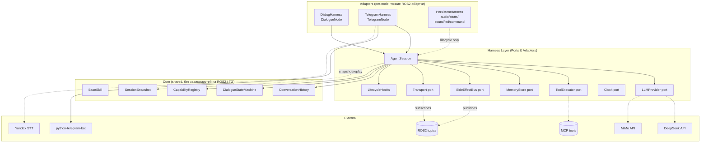
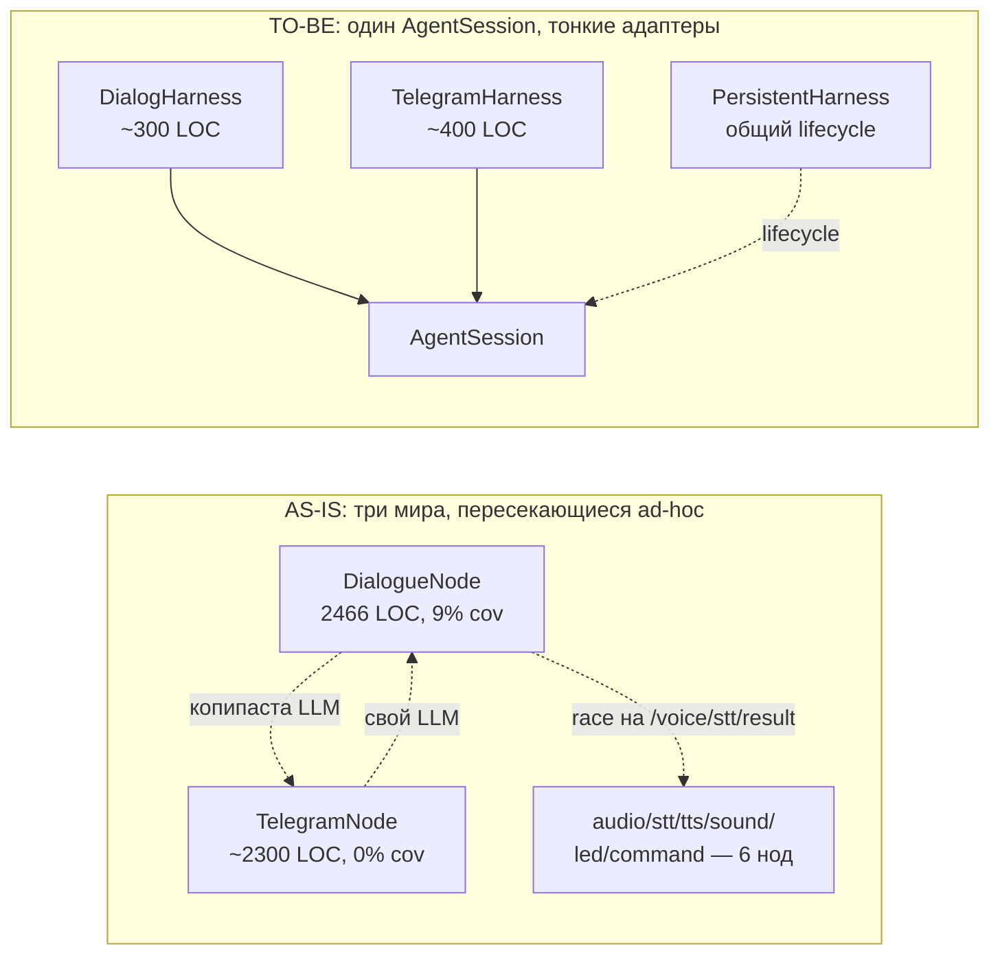
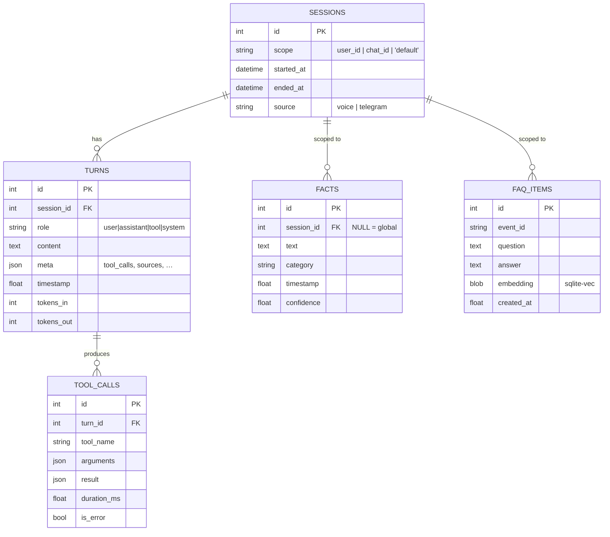
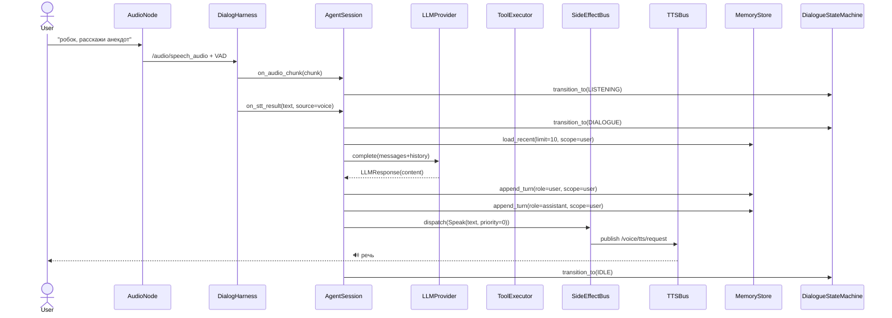
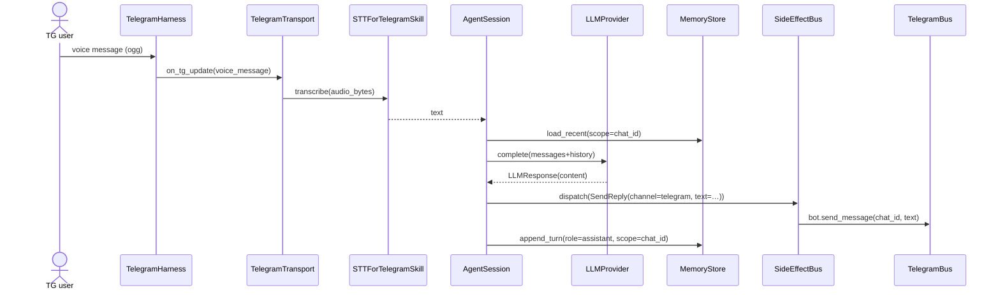
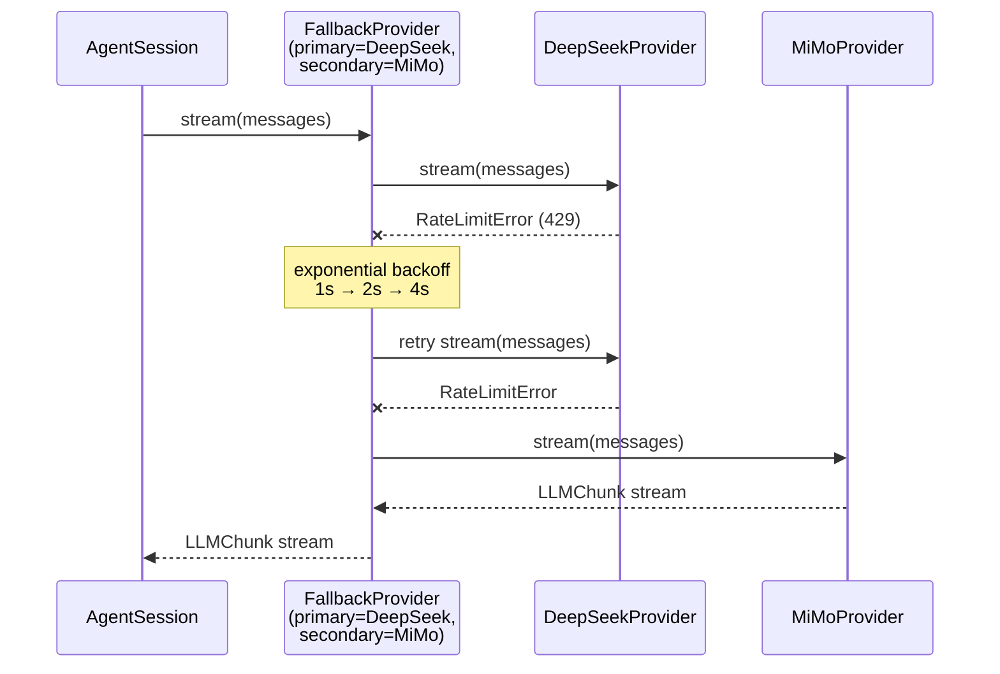
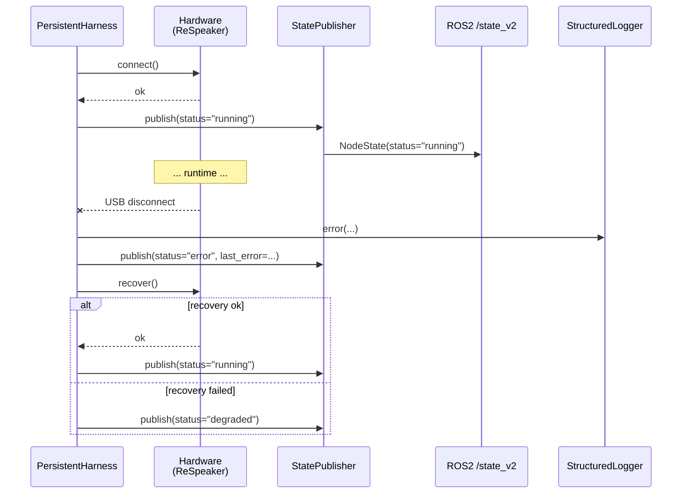
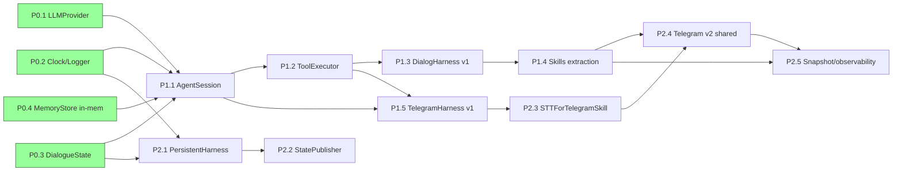

# План рефакторинга узлов dialog / persistent / telegram

**Версия:** 1.0 (консолидация после P0)
**Дата:** 2026-07-20
**Статус:** Proposed → переход в Active после ревью
**Автор:** architect (Hermes Agent)
**Связанные артефакты:**
- ADR-0001 — `docs/adr/0001-harness-architecture.md` (принятые архитектурные решения)
- Best-practices research — `docs/research/agent-harnesses-best-practices.md` (P1–P15, A1–A8)
- Интерфейсы текущих нод — `docs/reports/PERSISTENT_NODES_INTERFACES.md` (каталог ROS2-контрактов)
- Прежний план — `docs/refactoring-plan.md` (514 строк; этот документ — его **консолидированная** замена в `docs/architecture/`)

---

## 0. Назначение документа

Этот документ — **операционный план** рефакторинга трёх групп ROS2-узлов
(`DialogueNode`, persistent-семейство `audio/stt/tts/sound/led/command`,
`TelegramNode`) под целевую архитектуру харнесов, зафиксированную в ADR-0001.

Здесь сведено в одно место:

1. Целевые принципы и почему именно они.
2. Слойная архитектура и точки расширения.
3. Контракты портов — **в коде**, а не псевдокодом.
4. Диаграммы (Mermaid) — текущее vs целевое, sequence-сценарии, модель данных persistent-слоя.
5. ADR-блоки по каждому ключевому решению (выбор оркестратора, формат контракта, транспорт).
6. Декомпозиция на инкременты с критериями готовности и обратной совместимости.
7. Риски и митигации.
8. Связь с Kanban-задачами имплементации.

**Целевая аудитория**: разработчик implementation-профиля, которому нужно
брать карточку и идти делать; ревьюер архитектуры; PM, проверяющий прогресс
по спринту.

---

## 1. Целевые принципы

Эти принципы — **инварианты**, которые проверяются на code review. Нарушение
любого из них требует явного обоснования в ADR.

| # | Принцип | Что это значит на практике | Как проверить |
|---|---------|---------------------------|---------------|
| P0 | **Единый контракт ноды** | Любая нода (dialog / persistent / telegram) — это адаптер над `AgentSession` + набор портов. Никакой бизнес-логики в самой ноде. | `grep -rn "rclpy\|telegram\|async_openai" src/rob_box_core` — должно быть пусто (кроме `Transport`-порта). |
| P1 | **Side-effects через `SideEffectBus`** | Всё, что уходит «наружу» (TTS, sound, LED, TG-reply, Nav2-goal) идёт через `dispatch(Effect)`. Никаких прямых `bot.send_message`, `publish_tts`, `cmd_vel_pub` в обработчиках. | `grep -rn "\.publish\|bot\.send_message" src/rob_box_*` — все hits внутри `*_bus.py`, `*_harness.py` (transport), тестов. |
| P2 | **Явный жизненный цикл** | Каждая сущность имеет `on_start / on_turn / on_tool_call / on_tool_result / on_response_chunk / on_error / on_stop`. Хуки — список callable, не subclassing. | Сигнатура `LifecycleHooks` в `rob_box_core.session`. |
| P3 | **Наблюдаемость — first-class** | `snapshot() → JSON`, `replay(snapshot) → None`, hooks пишут в `/<node>/trace`. Без этого шага — feature не «готова». | Каждый P1+PR имеет test, проверяющий round-trip snapshot. |
| P4 | **Тестируемость без поднятия инфраструктуры** | Юнит-тесты используют `FakeLLMProvider`, `InMemoryStore`, `MockClock`, `NoopBus`, `FakeTransport`. Интеграционные тесты — отдельный слой. | Coverage нового кода ≥ 85%; `make unit-tests` зелёный без Docker/ROS. |
| P5 | **Переиспользование общей логики** | Dialog и Telegram делят `AgentSession`, `MemoryStore`, skill-и. Persistent-узлы делят `PersistentHarness` (lifecycle/clock/logger/state). | `wc -l src/rob_box_*/` — одни и те же домены не дублируются. |
| P6 | **Обратная совместимость в P0/P1** | ROS2-топики и их payload не меняются до P2. Внешнее поведение (команды `/say`, `/goto`, wake-word) инвариантно. | Существующие e2e-тесты зелёные до явной миграции в P2. |

**KISS-оговорка**: всё, что не нужно прямо сейчас — выкинуто. CQRS, event
sourcing, distributed runtime, отдельный LLM-микросервис — отвергнуты ADR-0001
(§3) как преждевременные.

---

## 2. Слойная архитектура (целевая)

### 2.1 Высокоуровневая диаграмма



### 2.2 Сравнение as-is → to-be



### 2.3 Границы ответственности

| Слой | Что знает | Что НЕ знает |
|------|-----------|--------------|
| **Adapter (Dialog/Telegram/Persistent)** | Свой транспорт (ROS2-топики, `python-telegram-bot`, hardware-устройство) | LLM, MCP, Memory, бизнес-правила диалога |
| **Harness (AgentSession)** | Координация портов: вызвать LLM → собрать tool-calls → dispatch эффекты | ROS2, Telegram API, wake-word, конкретные навыки |
| **Core (BaseSkill, DSM, ConversationHistory)** | Доменная логика (state machine, история, формат skill-ов) | Транспорт, конкретные реализации портов |

---

## 3. Модель состояния: что где хранится

Это раздел, которого не хватало в прежнем плане. Чётко фиксируем, где живёт
каждая часть состояния — особенно критично для persistent-узлов и для shared
memory dialog ↔ telegram.

### 3.1 Карта состояний

| Состояние | Владелец | Где живёт | Когда сбрасывается |
|-----------|----------|-----------|--------------------|
| Dialogue FSM (`IDLE / LISTENING / DIALOGUE / SILENCED`) | `DialogueManager` (P0 — facade: `DialogueStateMachine`) | In-process, одна сессия | При `reset()`, `disable_silence()`, timeout |
| Wake-word gate | `DialogueManager.should_respond` | In-process | Per-utterance |
| Silence timeout | `DialogueManager._silence_until` | In-process | При `disable_silence()` или истечении |
| Query accumulator | `DialogueManager._pending_queries` | In-process | При `get_accumulated_queries()` или timeout |
| Conversation history (turns) | `MemoryStore` | SQLite (`voice_memory.db`) | Никогда (persisted) |
| Persistent facts | `MemoryStore` | SQLite (таблица `facts`) | Никогда (persisted) |
| FAQ items | `FAQStore` (отдельный стор) | SQLite (`faq.db`) + Ollama embeddings | При `replace_items()` / TTL |
| Skill instances | `CapabilityRegistry` | In-process | При reload параметра |
| Tool-call results | In-flight, в `AgentSession` | In-process | По завершении turn-а |
| LLM client state | `LLMProvider` (per-call) | Per-request | Stateless (текущая реализация) |
| Audio device state | Persistent node (`AudioNode.hardware`) | PyAudio + ReSpeaker | При shutdown |
| TTS stream state | Persistent node (`TTSNode.stream`) | gRPC-stream | При `STOP` или завершении |
| Camera snapshot cache | TelegramNode `camera_cache.py` | In-process dict + TTL | По TTL |
| TG chat state (auth, current scope) | `TelegramHarness.auth` | In-process | Per-update |

### 3.2 Модель данных persistent-слоя (SQLite)



### 3.3 Где граница «сессии»

**Решение (см. ADR-MEM-001 ниже)**: scope сессии = `user_id` для voice (single-user
робот) или `chat_id` для Telegram. Глобальные facts (про пользователя в целом) —
`session_id IS NULL`. Это позволяет:

- TG-юзер видеть свою историю диалогов, не видя чужую.
- Голосовой юзер и TG-юзер делят только глобальные facts (если `TG_SHARE_CONTEXT=true`).

---

## 4. Контракты портов

Это **реальные** интерфейсы, а не псевдокод. P0 уже зафиксирован в коде
(`src/rob_box_llm/`, `src/rob_box_core/`); P1 расширяет.

### 4.1 `LLMProvider` (P0 — shipped)

```python
# src/rob_box_llm/rob_box_llm/provider.py
class LLMProvider(abc.ABC):
    name: str

    async def complete(
        self, messages: Iterable[LLMMessage], *,
        tools: Iterable[Mapping[str, Any]] = (),
        settings: LLMSettings | None = None,
    ) -> LLMResponse: ...

    async def stream(
        self, messages: Iterable[LLMMessage], *,
        tools: Iterable[Mapping[str, Any]] = (),
        settings: LLMSettings | None = None,
    ) -> AsyncIterator[LLMChunk]: ...

    async def aclose(self) -> None: ...
```

Реализации: `DeepSeekProvider`, `MiMoProvider`, `FakeLLMProvider`.
P1 добавит: `FallbackProvider` (rate-limit → secondary, см. ADR-FB-001).

### 4.2 `MemoryStore` (P0 — shipped)

```python
# src/rob_box_core/rob_box_core/memory.py
class MemoryStore(abc.ABC):
    async def append_turn(
        self, role: str, content: str, *,
        scope: str = "default", timestamp: float | None = None, **meta,
    ) -> int: ...

    async def load_recent(
        self, limit: int, *, scope: str = "default",
    ) -> list[Turn]: ...

    async def save_fact(
        self, fact: str, *, category: str = "general", timestamp: float | None = None,
    ) -> int: ...

    async def search_facts(self, query: str, *, limit: int = 5) -> list[Fact]: ...
    async def search(self, query: str, *, limit: int = 5) -> list[MemoryHit]: ...
```

Реализации: `InMemoryStore` (P0 — shipped), `SQLiteVoiceMemory` (P1 —
адаптер над существующим `rob_box_voice.core.voice_memory`).

### 4.3 `Clock` (P0 — shipped)

`SystemClock` / `MockClock` — `now() / monotonic() / async sleep()`.

### 4.4 `DialogueStateMachine` (P0 — shipped)

`DialogueState = {IDLE, LISTENING, DIALOGUE, SILENCED}` + явная таблица
переходов + `IllegalTransitionError` на невалидных. P1: re-implement
`DialogueManager` поверх этого класса (без изменения поведения).

### 4.5 `ToolExecutor` (P1 — to build)

```python
# src/rob_box_core/rob_box_core/tools.py  (target)
class ToolExecutor(abc.ABC):
    async def execute(
        self, call: ToolCall, *,
        timeout: float = 10.0, max_retries: int = 1,
    ) -> ToolResult: ...

    async def execute_many(
        self, calls: Iterable[ToolCall], *,
        timeout: float = 10.0,
    ) -> list[ToolResult]: ...
```

Реализации: `MCPBridgeExecutor` (обёртка над текущим `MCPBridge` +
`LLMToolCallAdapter`), `LocalSkillExecutor` (для Python-skill-ов без MCP),
`FakeToolExecutor` (тесты).

### 4.6 `SideEffectBus` + `Effect` (P1 — to build)

```python
# src/rob_box_core/rob_box_core/effects.py  (target)
@dataclass(frozen=True)
class Effect: ...  # tagged union — конкретные подклассы ниже

@dataclass(frozen=True)
class Speak(Effect):
    text: str
    ssml: str | None = None
    priority: int = 0  # для barge-in

@dataclass(frozen=True)
class PlaySound(Effect):
    name: str
    blocking: bool = False

@dataclass(frozen=True)
class SetLED(Effect):
    pattern: str  # 'off' | 'trace' | 'listen' | 'think' | 'speak' | 'spin'

@dataclass(frozen=True)
class SendReply(Effect):
    channel: str  # 'telegram' | 'voice' | 'web' (будущее)
    text: str
    reply_to: str | None = None

@dataclass(frozen=True)
class Move(Effect):
    linear: float
    angular: float

@dataclass(frozen=True)
class CallTool(Effect):
    tool_name: str
    arguments: Mapping[str, Any]
```

Реализации bus-а:
- `CompositeBus([TTSBus, SoundBus, LEDBus, TelegramBus, NavBus])` — продакшен.
- `NoopBus()` — тесты (ничего не делает, можно assert-ить на отсутствие эффектов).
- `RecordingBus()` — записывает все эффекты для `replay()`.
- `FilteringBus(predicate)` — для `CapabilityRegistry`-style фильтрации по каналу.

### 4.7 `Transport` (P1 — to build)

```python
# src/rob_box_core/rob_box_core/transport.py  (target)
class Transport(abc.ABC):
    """Abstract event source. Adapters turn their domain events into these."""

    def on_stt_result(self, text: str, *, source: str) -> None: ...
    def on_vad(self, active: bool) -> None: ...
    def on_tg_update(self, update: "TgUpdate") -> None: ...
    def on_audio_chunk(self, chunk: bytes) -> None: ...  # для STTForTelegramSkill
    def on_system_event(self, event: "SystemEvent") -> None: ...
```

Реализации:
- `ROS2Transport` — для `DialogHarness` (subscriber-ы).
- `TelegramTransport` — для `TelegramHarness` (обёртка над `Application.add_handler`).
- `FakeTransport` — тесты: просто `dispatch(event)` напрямую.

### 4.8 `BaseSkill` + `CapabilityRegistry` (P1 — to build)

```python
# src/rob_box_core/rob_box_core/skills.py  (target)
class BaseSkill(abc.ABC):
    name: str
    description: str
    tools: tuple[str, ...]
    channels_allowed: frozenset[str] = frozenset({"voice", "telegram"})

    @abc.abstractmethod
    def system_prompt(self) -> str: ...

    @abc.abstractmethod
    def tool_schemas(self) -> list[Mapping[str, Any]]: ...


class CapabilityRegistry:
    def register(self, skill: BaseSkill) -> None: ...
    def for_channel(self, channel: str) -> list[BaseSkill]: ...
    def get(self, name: str) -> BaseSkill | None: ...
```

### 4.9 `PersistentHarness` (P2 — to build)

```python
# src/rob_box_core/rob_box_core/persistent.py  (target)
class PersistentHarness(Node):
    """Тонкая обвязка для 'железных' нод. НЕ LLM-агент."""

    def __init__(
        self,
        node_name: str,
        *,
        hardware_factory: Callable[[], "Hardware"],
        clock: Clock | None = None,
        state_topic_suffix: str = "state_v2",
    ): ...

    def on_start(self) -> None: ...   # hardware.connect()
    def on_error(self, exc: BaseException) -> None: ...  # log + state + recovery
    def on_shutdown(self) -> None: ...  # hardware.disconnect()
```

Применяется к: `audio_node`, `stt_node`, `tts_node` в первую очередь
(самые «железные»). `led_node / sound_node / command_node` — следующая итерация.

### 4.10 Сводная таблица портов

| Порт | Статус | Файл | Реализации (default / test) |
|------|--------|------|----------------------------|
| `LLMProvider` | **shipped (P0)** | `src/rob_box_llm/rob_box_llm/provider.py` | `DeepSeekProvider`, `MiMoProvider` / `FakeLLMProvider` |
| `MemoryStore` | **shipped (P0, частично)** | `src/rob_box_core/rob_box_core/memory.py` | `InMemoryStore` / `InMemoryStore` (нужен `SQLiteVoiceMemory` adapter) |
| `Clock` | **shipped (P0)** | `src/rob_box_core/rob_box_core/clock.py` | `SystemClock` / `MockClock` |
| `DialogueStateMachine` | **shipped (P0)** | `src/rob_box_core/rob_box_core/dialogue_state.py` | n/a (facade) |
| `ToolExecutor` | **P1** | `src/rob_box_core/rob_box_core/tools.py` | `MCPBridgeExecutor`, `LocalSkillExecutor` / `FakeToolExecutor` |
| `SideEffectBus` + `Effect` | **P1** | `src/rob_box_core/rob_box_core/effects.py` | `CompositeBus` / `NoopBus`, `RecordingBus` |
| `Transport` | **P1** | `src/rob_box_core/rob_box_core/transport.py` | `ROS2Transport`, `TelegramTransport` / `FakeTransport` |
| `BaseSkill` + `CapabilityRegistry` | **P1** | `src/rob_box_core/rob_box_core/skills.py` | n/a |
| `AgentSession` | **P1** | `src/rob_box_core/rob_box_core/session.py` | concrete class |
| `PersistentHarness` | **P2** | `src/rob_box_core/rob_box_core/persistent.py` | concrete class |
| `StatePublisher` (NodeState) | **P2** | `src/rob_box_core/rob_box_core/state.py` | concrete class |
| `STTProvider` | **P2** | `src/rob_box_core/rob_box_core/stt.py` | `YandexSTTProvider`, `VoskSTTProvider` / `FakeSTTProvider` |

---

## 5. ADR-блоки по ключевым решениям

Эти ADR — **встроены** в план, потому что они влияют на декомпозицию.
Полные тексты — в `docs/adr/0001-harness-architecture.md` (там же §3
содержит отвергнутые альтернативы). Здесь — резюме с обоснованием.

### ADR-ORCH-001: Не выносим агент-цикл в LangGraph / AutoGen

**Решение**: свой `AgentSession` поверх `LLMProvider` (P0) + OpenAI Agents
SDK-style loop (P1). Не переходим на LangGraph / AutoGen.

**Почему**:
- У нас request-response, не DAG. Граф состояний избыточен.
- Сейчас весь agent-loop написан на `agents` SDK от OpenAI + собственный `BaseSkill`.
  Это работает и покрывает наши кейсы.
- Миграция принесёт больше зависимости, чем выгоды.

**Trade-off**: больше своего кода в `AgentSession`, но без внешней блокировки
на конкретный SDK.

**Когда пересмотреть**: если потребуются сложные graph-of-agents сценарии
(multi-agent debate, tree-of-thought). См. ADR-0001 §3.5.

### ADR-FB-001: `FallbackProvider` для resilience

**Решение**: P1 добавляет `FallbackProvider(primary, secondary)` —
оборачивает двух провайдеров, при `RateLimitError` / `TimeoutError` переключается
на secondary с exponential backoff.

**Почему**:
- Текущий код в `dialogue_node.py` имеет ad-hoc fallback на уровне ноды.
- 4 копии LLM-клиента (`dialogue_node`, `telegram/llm_chat`, `mcp_bridge`,
  `llm_adapter`) — каждая со своим retry.
- Единый `FallbackProvider` решает это в одном месте + легко тестируется.

**Trade-off**: добавляет один уровень indirection. Но он один, в отличие от
четырёх разных ad-hoc.

### ADR-CTX-001: `AgentSession` параметризован типом состояния

**Решение**: `AgentSession[StateT]` — Generic, `state: StateT`. Каждый
адаптер определяет свой dataclass (например, `DialogueState`,
`TelegramChatState`) с reducer'ами по образцу LangGraph.

**Почему**:
- Dialog и Telegram имеют разные поля состояния (`wake_active`, `silenced_until`
  vs `chat_id`, `last_message_id`).
- Generic позволяет переиспользовать `AgentSession` без copy-paste под каждый
  канал.
- Сводит «знание о домене» к одному dataclass-у, который легко сериализовать
  в `Snapshot`.

**Trade-off**: чуть больше type-annotation кода, но unit-тесты на reducer-ы
тривиальны.

### ADR-TRANS-001: Telegram — отдельный transport, не дублирующий LLM

**Решение**: `TelegramTransport` маппит `Update → SystemEvent(text, source=TG)`,
который уходит в `AgentSession.on_user_input`. Никакого `LLMChat`-класса.

**Почему**:
- Текущий `telegram/llm_chat.py` (469 LOC) — отдельная реализация LLM-стека,
  без доступа к `VoiceMemory` / `FAQStore`.
- Через `AgentSession` TG-юзер получает тот же `MemoryStore`, что и голосовой.
- Решает проблему «два мира» (см. ADR-0001 §1.2, п.3).

**Trade-off**: общий контекст = потенциальный leak приватности между
voice-юзером и TG. Митигация: `CapabilityRegistry` + явный opt-in
(`TG_SHARE_CONTEXT=false` по умолчанию, см. ADR-SHARE-001).

### ADR-MEM-001: scope = user_id / chat_id, global facts отдельно

**Решение** (см. §3.2): каждая `Turn` имеет `scope`. Голос → `scope = user_id`
(для однопользовательского робота); TG → `scope = chat_id`. Глобальные
facts (`user is allergic to nuts`) — `session_id IS NULL`.

**Почему**:
- Текущий `VoiceMemory.save_turn(...)` не имеет понятия scope — все turns в
  одной куче.
- TG может писать несколько человек; без scope они видят чужие диалоги.
- Глобальные facts должны переживать сессию, и для них scope не нужен.

**Trade-off**: чуть больше логики в `append_turn`, но это решает privacy-баг.

### ADR-SHARE-001: общий контекст TG ↔ voice только по opt-in

**Решение**: P2 добавляет флаг `TG_SHARE_CONTEXT=false` (по умолчанию).
Только при явном `/share_context on` TG-handler пишет turns с тем же
`scope = "shared"`, что и voice.

**Почему**:
- Privacy по умолчанию.
- Если юзер явно хочет «единый мозг» для голоса и TG — пожалуйста, через команду.

**Trade-off**: чуть больше UX-работы (команда `/share_context`), но это
честный default.

---

## 6. Ключевые sequence-сценарии

### 6.1 Голосовой wake-word → ответ голосом



### 6.2 Telegram: голосовое сообщение → транскрипция → ответ



### 6.3 Tool-call с retry через FallbackProvider



### 6.4 Persistent-узел: ошибка устройства → recovery



---

## 7. Декомпозиция на инкременты

**Принцип**: каждый инкремент = merge-абельный PR. «Закоммитим скелет,
допилим потом» запрещено. Если фаза не доделана — откатываем.

### 7.1 Обзор фаз

| Фаза | Содержание | Статус | Длительность | Зависит от |
|------|-----------|--------|--------------|------------|
| **P0** | Базовые порты + DialogHarness skeleton | **DONE (2026-07-20)** | 3–5 дней | — |
| **P0** | `DialogueManager` facade + `MemoryStore` (in-mem) | **DONE (2026-07-20)** | 3–4 дней | — |
| **P1.1** | `AgentSession` + `SideEffectBus` + `Effect` | next | 5–7 дней | P0 |
| **P1.2** | `ToolExecutor` + `FallbackProvider` | next | 4–5 дней | P1.1 |
| **P1.3** | `DialogHarness` v1 (тонкая нода) | next | 5–7 дней | P1.1, P1.2 |
| **P1.4** | Извлечение skill-ов из `dialogue_node.py` | next | 5–7 дней | P1.3 |
| **P1.5** | `TelegramCommandRegistry` + `TelegramHarness` v1 | next | 5–7 дней | P1.1, P1.2 |
| **P2.1** | `PersistentHarness` + `StatePublisher` | parallel-after-P1.1 | 5–7 дней | P0 |
| **P2.2** | `SQLiteVoiceMemory` adapter (P1-адAPTER → P2-ready) | next | 3–4 дней | P0 |
| **P2.3** | `STTForTelegramSkill` + общий `STTProvider` | parallel-after-P1.5 | 4–5 дней | P1.5 |
| **P2.4** | Telegram v2 — общий `AgentSession` с голосовым | last | 5–7 дней | P2.3 |
| **P2.5** | `Snapshot` / observability hooks / e2e | last | 4–5 дней | P2.4 |

**Критический путь**: P1.1 → P1.3 → P2.4 (~5–6 недель).
**Можно параллельно**: P1.5 (после P1.2); P2.1 (после P0); P2.2 (после P0).

### 7.2 Что можно мержить независимо

| Карточка | Готовность к merge, когда |
|----------|---------------------------|
| `AgentSession` скелет + NoopBus | FakeLLM + InMemoryStore + NoopBus + 1 e2e test = green |
| `SideEffectBus` + `Effect` | Unit-тесты на tagged-union dispatch + CompositeBus routing |
| `ToolExecutor` ABC + `MCPBridgeExecutor` | Round-trip тест с FakeToolExecutor + 1 интеграционный тест |
| `FallbackProvider` | Mock primary raises RateLimitError → secondary called |
| `DialogHarness` v1 | Feature flag `USE_HARNESS=true` рядом с существующим кодом; e2e test зелёный с обоими |
| `TelegramCommandRegistry` | Миграция по 5 команд за PR; feature flag `USE_TG_HARNESS=true` |
| `SQLiteVoiceMemory` adapter | Round-trip: `InMemoryStore` ↔ `SQLiteVoiceMemory` идентичны |
| `PersistentHarness` | Только для `audio_node` (самый простой hardware); e2e test на `/state_v2` |

### 7.3 Что требует согласованного релиза

| Карточка | Почему нельзя мержить независимо |
|----------|-----------------------------------|
| `DialogHarness` v2 (полная миграция `dialogue_node.py`) | Меняет ownership ROS2-callback-ов; требует двухфазного rollout с feature flag-ом |
| `TelegramHarness` v2 (общий `AgentSession` с голосовым) | Затрагивает privacy (`TG_SHARE_CONTEXT`); требует явного одобрения и UX-команды `/share_context` |
| Полное удаление legacy `commands.py` | Только после того, как все 25 команд мигрированы и `TelegramHarness` v1 в проде ≥1 неделю |

### 7.4 Backwards-compatibility матрица

| Что | P0 | P1 | P2 |
|-----|----|----|-----|
| ROS2-топики (`/voice/*`, `/audio/*`, `/telegram/*`) | без изменений | без изменений | parallel publishing `/state_v2` |
| Формат payload-ов | без изменений | без изменений | без изменений (старые топики) |
| `dialogue_node.py` API (для других нод) | без изменений | `DialogHarness` обёртка, API тот же | переход на `DialogHarness` |
| Telegram command handlers (`/say`, `/goto` и т.д.) | без изменений | `TelegramCommandRegistry` декораторы, поведение то же | — |
| Wake-word логика | без изменений | через `DialogueStateMachine` (та же таблица переходов) | — |
| `MemoryStore` API | in-memory добавляется; старый `VoiceMemory.save_turn(...)` работает | in-memory + SQLite adapter | — |

---

## 8. Подробные инкременты

### P1.1 — `AgentSession` + `SideEffectBus`

**Цель**: ядро harness-слоя. `AgentSession` координирует порты, `SideEffectBus`
маршрутизирует эффекты.

**Действия**:
1. `src/rob_box_core/rob_box_core/session.py`:
   - `AgentSession[StateT]` (Generic).
   - Конструктор: `llm, tools, memory, effects, transport, clock, hooks`.
   - `async on_user_input(text, source) → SessionResult`.
   - `async on_audio_chunk(chunk)` → маршрут через STT (или noop для TG).
   - `async on_event(event) → None`.
   - `snapshot() → SessionSnapshot` (state + history + pending effects).
   - `replay(snapshot) → None`.
   - `cancel(token) → None` (cooperative).
   - `max_turns: int = 5` → `MaxTurnsExceeded` на превышении.

2. `src/rob_box_core/rob_box_core/effects.py`:
   - `Effect` tagged union: `Speak, PlaySound, SetLED, SendReply, Move, CallTool`.
   - `SideEffectBus` ABC + `CompositeBus`, `NoopBus`, `RecordingBus`,
     `FilteringBus`.

3. `src/rob_box_core/rob_box_core/hooks.py`:
   - `LifecycleHooks` с 7 точками (см. P0 P2).

**Тесты**:
- `test_session_simple.py` (FakeLLM + NoopBus + InMemoryStore).
- `test_session_streaming.py` (chunks → effects).
- `test_session_max_turns.py`.
- `test_session_cancel.py`.
- `test_session_replay.py`.
- `test_effects_bus.py` (routing, fan-out, recording, filtering).

**Критерии приёмки (merge-gate)**:
- `AgentSession` НЕ импортирует `rclpy`, `telegram`, `wake_word`.
- `Snapshot` сериализуем в JSON (dataclasses → asdict).
- Coverage нового кода ≥ 85%.

**Риск**: средний. **Митигация**: пишем сначала тесты на Fake-ах, потом
подключаем к существующему коду через адаптер.

**Связь с Kanban**: implementation cards создаются после ревью этого плана.

### P1.2 — `ToolExecutor` + `FallbackProvider`

(Подробности аналогичны прежнему плану §5, но с ADR-FB-001 зафиксированным.)

**Дополнительно**:
- `FallbackProvider(primary, secondary, *, max_retries=2, base_delay=1.0)` —
  на `RateLimitError` / `TimeoutError` / `ProviderError(5xx)` повторяет primary
  с backoff, потом переключается на secondary.
- `LocalSkillExecutor` — для skill-ов, не требующих MCP (например, `faq_search`
  напрямую дёргает `FAQStore`).

### P1.3 — `DialogHarness` v1 (тонкая нода)

**Действия**:
1. `src/rob_box_voice/rob_box_voice/harness/dialog_harness.py`:
   - `class DialogHarness(Node)` — ROS2 callbacks (`stt_callback`,
     `vad_callback`, `tts_finished_callback`) → `AgentSession.on_*`.
2. Feature flag `USE_HARNESS=false` по умолчанию; в `dialogue_node.py` —
   switch на новый путь при `True`.
3. **НЕ** удаляем старый код, пока `DialogHarness` v1 не отработает в проде ≥1 неделю.

**Критерии приёмки**:
- Поведение ROS2-топиков идентично (e2e тест с FakeLLMProvider).
- `dialogue_node.py` уменьшается на ≥ 30%.
- `USE_HARNESS=true` в CI — зелёный.

### P1.4 — Извлечение skill-ов

**Действия** (по 1 skill за PR):
1. `VoiceSettingsSkill` (volume/pitch/speed) — объединяет три handler-а.
2. `DJPlaylistSkill` (set_dj_mode, list_tracks, save_track, ...).
3. `MappingSkill` (mapping/backup).
4. `MusicSkill` (execute_music_code, stop_music, ...).
5. `NavigationSkill` (navigate_to_waypoint, move_direction, ...).

Каждый skill — подкласс `BaseSkill`, `@function_tool` методы.

### P1.5 — `TelegramCommandRegistry` + `TelegramHarness` v1

**Действия** (миграция по 5 команд за PR):
1. `src/rob_box_telegram/rob_box_telegram/harness/command_registry.py`:
   ```python
   registry = TelegramCommandRegistry()
   @registry.command("say", description="...")
   async def cmd_say(update, context, args): ...
   ```
2. `TelegramHarness` собирает все зарегистрированные команды в
   `Application.add_handler`.
3. `messages.py` → `text_message_handler → AgentSession.on_user_input(text, source=TG)`.
4. `commands.py` остаётся как fallback, пока не мигрируем все 25.

### P2.1 — `PersistentHarness`

**Действия**:
1. Применить к `audio_node` (самый простой hardware, ReSpeaker + PyAudio).
2. После 1 недели в проде — `stt_node`, `tts_node`.
3. После ещё 1 недели — `led_node`, `sound_node`, `command_node`.

### P2.2 — `SQLiteVoiceMemory` adapter

**Действия**:
1. `src/rob_box_core/adapters/sqlite_voice_memory.py`:
   - `class SQLiteVoiceMemory(MemoryStore)` — обёртка над
     `rob_box_voice.core.voice_memory.VoiceMemory`.
2. Round-trip тесты: `InMemoryStore` ↔ `SQLiteVoiceMemory` идентичны по API.
3. **Не** трогаем существующий код `VoiceMemory` — это adapter в одну сторону.

### P2.3 — `STTForTelegramSkill`

**Действия**:
1. `src/rob_box_core/rob_box_core/stt.py`:
   - `STTProvider(ABC)`: `async transcribe(audio_bytes, language) → str`.
   - `YandexSTTProvider`, `VoskSTTProvider`, `FakeSTTProvider`.
2. `STTForTelegramSkill` использует `STTProvider` через DI.
3. `STTNode` (persistent) — постепенно переходит на тот же интерфейс (не P2.3).

### P2.4 — Telegram v2: общий `AgentSession`

**Действия**:
1. `TelegramHarness` создаёт `AgentSession` с тем же набором skill-ов, что и
   `DialogHarness`.
2. `MemoryStore` параметризуется по `scope`: `voice` / `telegram` / `shared`.
3. `CapabilityRegistry` скрывает/показывает skill-ы в зависимости от канала.
4. `share_context=true` через opt-in (ADR-SHARE-001).
5. Команда `/share_context on/off` — UX-точка.

**Критерий приёмки**:
- E2E: голос «робок, расскажи анекдот» → ответ и голосом, и в TG-чат (если `share_context=true`).
- Default `share_context=false` — TG и голос видят разные истории.

### P2.5 — Snapshot / observability

**Действия**:
1. `Snapshot` сериализуется в JSON, доступен через ROS2-сервис
   `/<node>/snapshot`.
2. `hooks.on_response_chunk(chunk)` → `/<node>/trace` для дашборда.
3. E2E тесты через `snapshot/replay` (вместо моков LLM).

**Критерий приёмки**:
- Round-trip JSON сохраняет всё состояние `AgentSession`.
- Один дашборд-прототип может подписаться на `/trace`.

---

## 9. Критерии приёмки плана в целом

| Метрика | Сейчас (as-is) | Цель | Как мерить |
|---------|---------------:|-----:|------------|
| Coverage `dialogue_node.py` | 9% | ≥ 60% | `coverage report` |
| Coverage `telegram_node.py` + handlers | 0% | ≥ 60% | `coverage report` |
| Coverage `audio/stt/tts/sound/led` | 30–60% | ≥ 70% | `coverage report` |
| LOC `dialogue_node.py` | 2466 | ≤ 1200 | `wc -l` |
| LOC `commands.py` | 534 | ≤ 150 | `wc -l` |
| Кол-во копий LLM-клиента | 4 | 1 | `grep -r "AsyncOpenAI" src/` |
| E2E сценарий voice → TG reply | невозможен | работает (при `share_context=true`) | авто-тест + ручной прогон |
| Время добавления нового skill | ~1 день | ≤ 2 часа | метрика команды |
| Импорты `rclpy` вне `*_harness.py` | много | 0 | `grep -rn "^import rclpy" src/rob_box_core` |
| Импорты `telegram` вне `*_harness.py` | много | 0 | `grep -rn "from telegram" src/rob_box_core` |

**Definition of Done** для каждого инкремента:
- Все unit-тесты зелёные.
- Существующие e2e (если есть) — зелёные.
- Coverage нового/изменённого кода ≥ 80%.
- Никаких `TODO` в коде (`grep -rn "TODO" src/`).
- Документация обновлена (ADR — если новое решение; этот план — если меняется фаза).
- Feature flag (если используется) — в default-off; rollout отдельным шагом.

---

## 10. Риски и митигации

| # | Риск | Вероятность | Импакт | Митигация |
|---|------|-------------|--------|-----------|
| 1 | Поломаем ROS2-контракт топиков при выносе в harness | средняя | высокий | Parallel publishing в P2 (`/state_v2`); integration-тесты на топики. Feature flag `USE_HARNESS`. |
| 2 | LLM-порт не покрывает edge cases (rate limit, timeout, retries) | средняя | средний | Подробные тесты в P1.2; реальные provider-ы — через `respx`/`aioresponses`. |
| 3 | Skill-извлечение сломает wake-word / диалоговую логику | низкая | высокий | Feature flag `USE_HARNESS=true/false`; деплой по одному skill-у за раз. |
| 4 | Telegram v2 (общий контекст) поломает приватность | средняя | высокий | Default `TG_SHARE_CONTEXT=false`; явный opt-in `/share_context`. |
| 5 | Persistent harness окажется слишком абстрактным для «железа» | средняя | средний | Не пытаемся вынести специфику устройств (ReSpeaker, ALSA, gRPC); только lifecycle/state. |
| 6 | Тесты на in-memory fakes не отражают реальное поведение LLM | средняя | средний | Раз в спринт — один «дымовой» e2e-тест с реальным LLM (в CI как optional). |
| 7 | Команда перегружена — план растягивается на >8 недель | высокая | средний | P0 — обязательный минимум; P1 и P2 — независимые потоки, можно брать параллельно. |
| 8 | Новые порты «протекают»: `AgentSession` начинает знать про ROS2 | средняя | средний | Code review фокус: любой импорт `rclpy` / `telegram` в `rob_box_core` = reject. |
| 9 | `FallbackProvider` скрывает реальные проблемы primary-провайдера | низкая | средний | Метрики: `prometheus_client` счётчик `fallback_triggered{from,to,reason}`. Алерт, если rate > N/час. |
| 10 | Snapshot JSON разрастается (full history) | низкая | низкий | Snapshot — только state + последние N turns; history — отдельный запрос. |

---

## 11. Граф зависимостей задач



---

## 12. Что НЕ делаем (out of scope)

Чтобы план не разрастался, явно фиксируем, что **вне scope** этого плана:

- Изменения формата ROS2-топиков (отдельная ADR, когда понадобится).
- Переход на другой LLM SDK (OpenAI Agents → LangGraph). Порты спроектированы
  так, чтобы это было возможно, но сам перенос — не сейчас. См. ADR-ORCH-001.
- Мульти-юзер / мульти-робот. Адаптер модели для этого уже учтён в
  `AgentSession[StateT]`, но реализация — потом.
- Web-дашборд для диалогов. `Snapshot` готов (P2.5), но UI — следующий этап.
- Event sourcing / CQRS (см. ADR-0001 §3.2, 3.3).
- Полная переделка skill-системы. P1.4 — только извлечение существующих;
  новая архитектура skill-ов — отдельная задача.
- Distributed runtime / k8s / multi-host — осознанно вне scope.
- Новые hardware-устройства. `PersistentHarness` — только lifecycle/state,
  не специфика устройств.

---

## 13. Kanban-связи (для implementation-профиля)

После ревью этого плана ожидаются следующие карточки:

| Профиль | Карточка | Зависит от |
|---------|----------|------------|
| backend | P1.1: `AgentSession` + `SideEffectBus` | ревью этого плана |
| backend | P1.2: `ToolExecutor` + `FallbackProvider` | P1.1 |
| backend | P1.3: `DialogHarness` v1 | P1.1, P1.2 |
| backend | P1.5: `TelegramCommandRegistry` + `TelegramHarness` v1 | P1.1, P1.2 |
| backend | P2.1: `PersistentHarness` | P0 (готов) |
| backend | P2.2: `SQLiteVoiceMemory` adapter | P0 (готов) |
| backend | P2.4: Telegram v2 (shared `AgentSession`) | P1.5, P1.4 |
| pr-reviewer | Code review на каждой карточке (merge-gate) | соответствующая backend-карточка |

---

## 14. Changelog

| Дата | Версия | Что изменилось |
|------|--------|----------------|
| 2026-07-18 | 0.1 | Первая версия (после ADR-0001) — `docs/refactoring-plan.md`, 514 строк |
| 2026-07-20 | 1.0 | **Консолидация в `docs/architecture/`** после P0. Содержит: реальные контракты P0-портов (вместо псевдокода), ADR-блоки (CTX-001, FB-001, MEM-001, SHARE-001, TRANS-001), sequence-диаграммы 4 сценариев, модель данных persistent-слоя, явные merge-gate критерии, backwards-compat матрицу, граф зависимостей. Прежний `docs/refactoring-plan.md` помечен как legacy. |

---

*Готово к ревью. После одобрения — задачи P1.1 / P1.2 / P1.3 / P1.5 / P2.1 / P2.2 создаются как Kanban-карточки для backend-профиля.*
