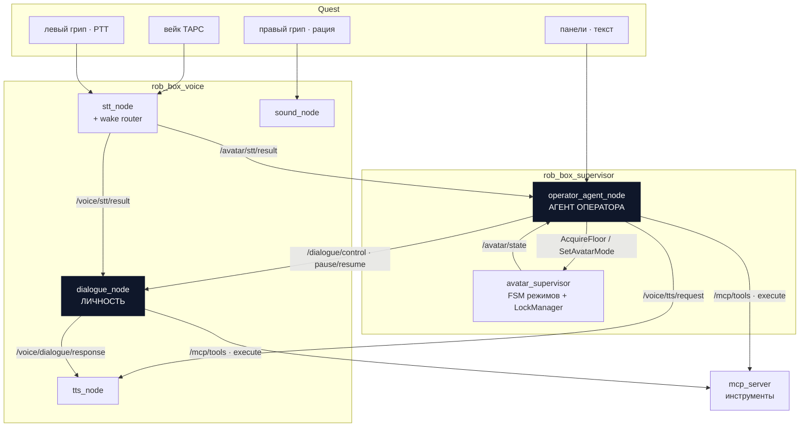
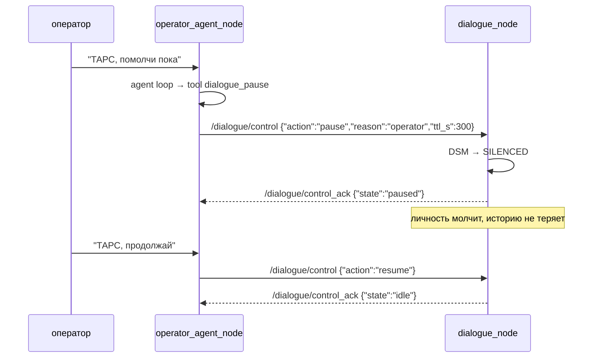
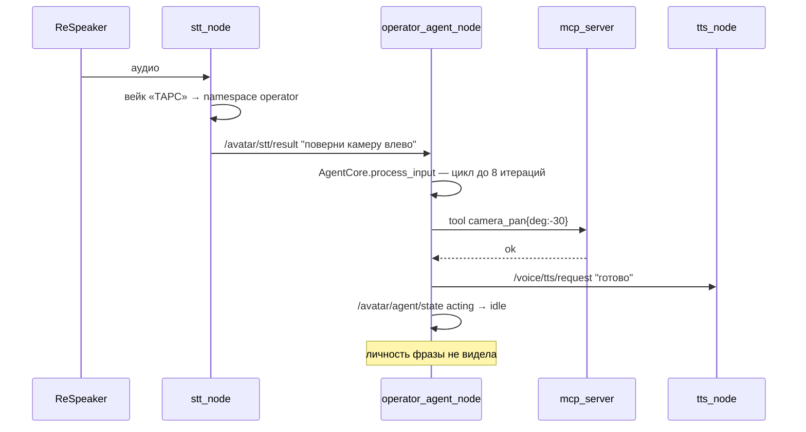
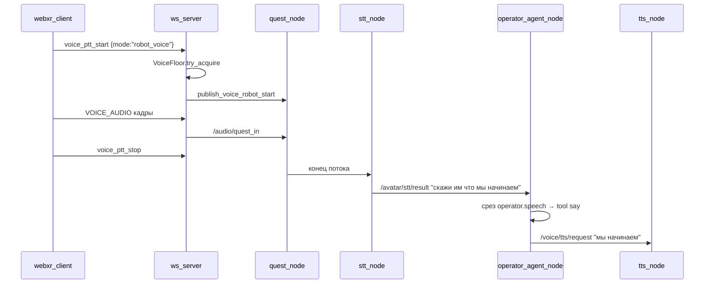
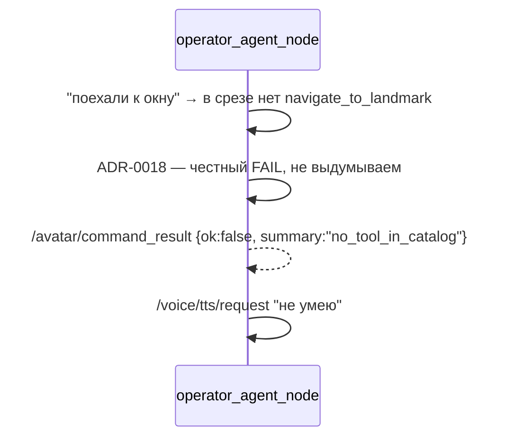

# Целевая архитектура: агент оператора, супервизор и диалоговая нода

**Статус:** proposed
**Дата:** 2026-09-05
**Автор:** architecture review (скилл `improve-codebase-architecture`)
**Заменяет:** `docs/architecture/avatar-supervisor-agent.md` в части «движок агента»
(wire-контракт `/avatar/command` из него сохраняется без изменений)
**Пересматривает:** ADR-0028 §4.5 (параметрическое управление `dialogue_node`),
ADR-0001 §2.7.1 (`DialogHarness` как параллельная реализация)
**Основано на:** разбор кода `develop` @ `20e1b9e3`, см. §2

---

## 1. Что решаем

Оператор в шлеме должен управлять роботом голосом и текстом: сказать «ТАРС,
поверни камеру» или зажать левый грип и надиктовать фразу, которую робот
произнесёт своим голосом. Личность робота при этом не участвует — она либо
молчит, либо продолжает свой разговор с людьми рядом.

Сегодня это не работает, и причина не в багах, а в форме: **у оператора нет
своего агента**. Есть каркас `OperatorHarness`, который делает один вызов LLM,
не имеет цикла, собирается с `DummyLLMProvider` и `FakeToolProvider`, и по
контракту не может получить настоящие инструменты. Рабочим остаётся обходной
путь, где речь оператора попадает в LLM личности как реплика пользователя —
отсюда «оператор мне что-то сказал».

Целевая форма: **два агента на одном движке**, с разными промптами, разными
срезами каталога инструментов и разными историями. Единственная связь между
ними — команда `pause` / `resume`.

---

## 2. Что мы нашли в коде (обоснование)

Фактура, на которой построены решения ниже. Все цифры — на `develop` @ `20e1b9e3`.

### 2.1 У оператора нет агентского цикла

`rob_box_harness/harnesses/operator.py:step()` — один `llm.complete()`, затем
исполнение вернувшихся `tool_calls`, выход. Результаты инструментов обратно в
модель не отдаются, итераций нет.

Настоящий цикл в проекте есть — `DialogCore._run_with_tools`
(`for _ in range(_MAX_TOOL_ITERATIONS)`, 8 итераций, результаты возвращаются
модели). Пользуется им только личность.

### 2.2 Агент оператора не может ничего выполнить

| факт | место |
|---|---|
| `llm` не передаётся → `Harness.init()` подставляет `DummyLLMProvider` (возвращает `"pong"`) | `supervisor_node.py:2064` |
| `assert isinstance(self.tools, FakeToolProvider)` — реальные инструменты запрещены | `operator.py:init()` |
| каталог оператора — два имени: `say`, `play_animation` | `OPERATOR_TOOL_NAMES` |
| `agent_enabled` по умолчанию `false` | `supervisor_node.py:460` |
| на `/avatar/command_result` нет подписчиков вне тестов | grep по `src/` |

### 2.3 Один микрофон, пять маршрутов, выбор изменяемой строкой

`dialogue_node._on_quest_stt` ветвится по параметру `voice_input_mode`, который
удалённо выставляет супервизор через `/dialogue_node/set_parameters`:

| значение | что происходит |
|---|---|
| `respeaker` (дефолт) | Quest-STT игнорируется |
| `quest_ttts` | дословно STT → TTS |
| `quest_llm_formalize` | LLM переписывает фразу в стиле пресета → TTS |
| `quest_stt` | `_on_stt(from_quest=True)` — **вход личности**; фраза ложится в её историю |
| `quest_command` | `/avatar/command` → супервизор (тупик из §2.2) |

Три из пяти значений меняют не «молчит/не молчит», а **маршрут аудио**. Отсюда
гонки, зафиксированные прямо в коде клиента (`main.ts:590` — «voice_input_mode=
respeaker и dialogue_node его игнорирует (гонка)»).

### 2.4 Харнес-фреймворк в проде не используется

Базовый класс `Harness`, `HarnessRegistry`, `runner`, `lifecycle`, `snapshot`,
`transport` не вызываются ни из одной ROS-ноды. `register_builtin_harnesses`
регистрирует `echo` и `upper`. `DialogueNode` использует `DialogCore` напрямую,
класс `Harness` не трогает.

Единственный код в проде, наследующий `Harness` — `OperatorHarness`, то есть
единственный пользователь фреймворка это сломанный агент оператора.

`DialogHarness` (428 LOC) описан как «parallel implementation… switching is via
the `harness.kind` flag»; переключатель не подключён, класс конструируется
только в тестах (1375 LOC тестов).

### 2.5 Задвоенная логика

| что | копий | статус |
|---|---|---|
| машина состояний диалога (те же 4 состояния) | 3 | живая одна: `harness/core/dialogue_state_machine` (488). Мёртвые: `voice/core/dialogue_manager` (336), `core/dialogue_state` (118) |
| база голосовой памяти | 2 | **обе живые**: `/data/harness_voice.db` (`facts`/`waypoints`/`faq_items`/`event_profile`) пишет диалог; `/data/voice_memory.db` (`voice_turns`/`voice_facts`) пишут MCP-инструменты |
| floor / lock | 4 | `supervisor/core/locks` (255), `supervisor/core/fsm` (470, свои `voice_held_by`/`teleop_held_by`), `quest/server/voice_floor` (152), `quest/core/floor` (147). Синхронизация первых двух в коде помечена «best-effort, не транзакция» |
| FAQ-хранилище | 3 | `voice/core/faq_store` (454), `harness/memory/sqlite_voice` (`faq_items`), `mcp_tools` FAQStore — в разных БД |
| диалоговый путь | 2 | `DialogueNode → DialogCore` и `DialogHarness` (только тесты) |
| исполнение tool-calls | 3 | `harness/core/tool_registry` + executors, `voice/scheduler/tool_executor` (510), `voice/llm/tool_call_executor` (247, мёртвый) |
| music-модули | 2 | `voice/core/{music_library,minimax_music_client}` импортируются только своими тестами; живые версии в `mcp_tools/core/` — форки разошлись на 878 и 640 строк |
| пакет `rob_box_voice/llm` | — | 804 LOC, не импортируется никем, +1044 LOC тестов |

Не достижимо из точек входа ROS-нод и `mcp_server` — **4396 LOC**.

### 2.6 Вейк-слово оператора не существует

`DEFAULT_WAKE_WORDS` в `voice/core/dialogue_text.py` — один плоский список
(«роббокс» + 11 STT-искажений), ведущий только к личности. Маршрутизации
«какое слово сказали → какой агент отвечает» нет ни в одной точке.

### 2.7 Что уже правильно и переиспользуется

- **Физика PTT.** Левый грип → `voice_ptt_start {mode:"robot_voice"}`, правый →
  `{mode:"radio"}` (barge-in + рация). Транспорт менять не нужно, нужно сменить
  адресата.
- **Wire-контракт** `/avatar/command` ↔ `/avatar/command_result` (v1) —
  сохраняется как есть.
- **Каталог инструментов** `rob_box_core.tool_catalog` — единый SSoT схем,
  локальные объявления запрещены тестом. Сохраняется.
- **Транспорт инструментов** `ROSMCPToolProvider` поверх `/mcp/tools`.
- **Типизированный IDL** `rob_box_supervisor_msgs` (`AcquireFloor`,
  `ReleaseFloor`, `SetAvatarMode`, `AvatarStateMsg`, `FloorState`).
- **`LockManager`** (`supervisor/core/locks.py`) — единственная реализация
  floor с dead-man, которую оставляем.

---

## 3. Целевая картина



### 3.1 Зоны ответственности

| нода | владеет | НЕ владеет |
|---|---|---|
| `operator_agent_node` | агентский цикл оператора, его промпт, его история, его срез каталога инструментов | режимами, floor-ами, историей личности |
| `avatar_supervisor` | FSM режимов, `LockManager` (единственный владелец floor), агрегация `/avatar/state` | LLM, инструментами, историей |
| `dialogue_node` | агентский цикл личности, её история, её срез каталога | знанием о Quest, режимами оператора |
| `stt_node` | распознавание **и маршрутизация по вейк-слову** | смыслом фраз |
| `tts_node` | синтез, провайдеры, голоса | тем, кто попросил |

---

## 4. Решение развилки: агент оператора — отдельная нода

**Решение.** `operator_agent_node` — отдельная ROS-нода в пакете
`rob_box_supervisor`, не часть `supervisor_node`.

**Почему.**

1. `avatar_supervisor` обязан отвечать на сервисы `AcquireFloor` /
   `SetAvatarMode` быстрее 100 мс — это записано в `quest_node`
   (`timeout_s = 0.05` на service-call, иначе degradation). Агентский цикл
   с 8 итерациями LLM занимает секунды. В одном процессе они несовместимы:
   либо floor-арбитр залипает, либо агент рвётся.
2. `supervisor_node.py` уже 2396 LOC и 68 методов. Полный каталог
   инструментов + история + промпты туда не влезают, не нарушив бюджет
   ADR-0021.
3. Разные жизненные циклы: floor-арбитр обязан жить всегда, агент оператора
   поднимается по требованию и может падать без последствий для телеопа.

**Альтернатива, которую отклоняем:** агент внутри `supervisor_node` в отдельном
потоке. Отклоняется из-за п.1 — гарантию latency в одном процессе с LLM-циклом
дать нельзя, а телеоп на ней завязан.

---

## 5. Единый агентский движок

**Решение.** Оба агента используют **один** движок — `DialogCore` (или его
переименованный вариант `AgentCore`), сконфигурированный разными портами.

```
AgentCore(
    llm=...,            # порт LLM
    tools=...,          # порт инструментов, срез каталога
    memory=...,         # порт памяти, namespace агента
    dsm=...,            # машина состояний
    system_prompt=...,  # промпт агента
)
```

| | личность | оператор |
|---|---|---|
| промпт | `rob_box_voice/prompts/master_prompt_compact.txt` | `rob_box_supervisor/prompts/operator_system_prompt.txt` |
| срез каталога | `CORE_SKILL` + скиллы личности | operator slice (§6) |
| память | namespace `personality` | namespace `operator` |
| история | своя | своя, личности не видна |
| вход | `/voice/stt/result` | `/avatar/stt/result`, `/avatar/command` |
| выход речи | `/voice/dialogue/response` | `/voice/tts/request` |

**Что из этого следует удалить как дубль:**

- `OperatorHarness` (392 LOC) — движок заменяется на `AgentCore`;
- `DialogHarness` (428) + `test_dialog_harness.py` (358) +
  `test_integration_e2e.py` (589);
- каркас `Harness` / `HarnessRegistry` / `runner` / `lifecycle` / `snapshot` /
  `transport`, если после миграции у него по-прежнему нет пользователей;
- `rob_box_voice/llm/` (804) + тесты (1044);
- `voice/core/dialogue_manager.py` (336) и `rob_box_core/dialogue_state.py` (118);
- `voice/core/{music_library,minimax_music_client}.py` — форки живых модулей
  в `mcp_tools/core/`.

---

## 6. Каталог инструментов и срезы

**Инвариант.** Схемы инструментов объявляются **только** в
`rob_box_core.tool_catalog`. Локальные объявления запрещены (уже проверяется
тестом `test_operator_no_local_schema`, распространяем на оба агента).

Срез (skill) — это именованный список имён инструментов. Агент получает
`ToolProvider`, суженный до своего среза.

| срез | инструменты | кто |
|---|---|---|
| `core` | базовые | оба |
| `operator.speech` | `say`, `set_voice`, `set_voice_preset`, `set_voice_language`, `preview_voice` | оператор |
| `operator.control` | `dialogue_pause`, `dialogue_resume`, `set_avatar_mode`, `acquire_floor`, `release_floor` | оператор |
| `operator.motion` | `drive`, `stop`, `navigate_to`, `save_waypoint` | оператор |
| `operator.expression` | `play_animation`, `led_*` | оператор |
| `personality.*` | музыка, память, FAQ, эпитеты — как сейчас | личность |

**Транспорт — один:** `ROSMCPToolProvider` поверх `/mcp/tools`
(`TRANSIENT_LOCAL`, depth 1). Оба агента ходят через него. `FakeToolProvider`
остаётся только в тестах; `assert isinstance(..., FakeToolProvider)` из
`operator.py` удаляется вместе с модулем.

---

## 7. Маршрутизация речи

**Решение.** Единственная точка маршрутизации — `stt_node`. Он и только он
решает, чья это фраза, и публикует её в топик соответствующего агента.

### 7.1 Правила

| вход | условие | выход |
|---|---|---|
| `/audio/speech_audio` (ReSpeaker) | распознано вейк-слово личности (`роббокс`, …) | `/voice/stt/result` |
| `/audio/speech_audio` | распознано вейк-слово оператора (`ТАРС`, …) | `/avatar/stt/result` |
| `/audio/speech_audio` | вейк-слова нет, личность в `DIALOGUE` | `/voice/stt/result` |
| `/audio/quest_in` (левый грип, PTT) | всегда — PTT сам является вейком | `/avatar/stt/result` |
| `/audio/quest_in` (правый грип, рация) | не проходит через STT | `/avatar/voice_in` → `sound_node` |

Вейк-слово вырезается из текста перед публикацией — как сейчас делает
`remove_wake_word`.

### 7.2 Два namespace вейк-слов

```yaml
# config/wake_words.yaml — единственный SSoT
personality:
  - роббокс
  - робокс
  # + STT-искажения
operator:
  - тарс
  - tars
  # + STT-искажения
```

`voice/core/dialogue_text.py` перестаёт быть владельцем списка и читает этот
файл.

### 7.3 Что уходит

Параметр `voice_input_mode` со всеми шестью значениями **удаляется**. Вместе с
ним из `dialogue_node` уходят `_on_quest_stt`, `_publish_avatar_command_from_quest`,
`_formalize_with_llm` и подписка на `/voice/stt/quest`. Диалоговая нода
перестаёт знать о существовании Quest.

Функциональность не теряется, а переезжает:

| было (`voice_input_mode`) | стало |
|---|---|
| `quest_ttts` | инструмент `say(text)` у оператора |
| `quest_llm_formalize` | оператор сам решает, как сформулировать — это его агентский цикл |
| `quest_stt` | не нужен: у оператора свой агент |
| `quest_command` | `/avatar/stt/result` → агент оператора |
| `off` | `dialogue_pause` |
| `respeaker` | `dialogue_resume` |

---

## 8. Единственная связь: pause / resume

**Инвариант.** Агент оператора влияет на диалоговую ноду **ровно одним**
способом: топиком `/dialogue/control` со значением `pause` или `resume`.
Никаких `set_parameters`, никаких режимов, никакой записи в её состояние.



**`ttl_s`** обязателен: пауза без срока — это способ навсегда потерять
личность при падении агента оператора. По истечении TTL `dialogue_node`
сама возвращается в `IDLE` и публикует ack.

**Что pause НЕ делает:** не глушит ReSpeaker, не меняет маршрут аудио, не
чистит историю. Это ровно переход `DSM → SILENCED`, который уже существует.

---

## 9. Карта топиков

Легенда: **=** без изменений · **+** новый · **−** удаляется · **~** меняется контракт

### 9.1 Аудио

| топик | тип | pub | sub | |
|---|---|---|---|---|
| `/audio/speech_audio` | `AudioData` | `audio_node` | `stt_node` | = |
| `/audio/quest_in` | `AudioData` | `quest_node` | `stt_node` | = |
| `/audio/vad` | `Bool` | `audio_node` | `dialogue_node`, `operator_agent_node` | ~ добавлен подписчик |
| `/avatar/voice_in` | `AudioData` | `quest_node` | `sound_node` | = рация |

### 9.2 Распознавание

| топик | тип | pub | sub | |
|---|---|---|---|---|
| `/voice/stt/result` | `String` | `stt_node` | `dialogue_node` | = речь для личности |
| `/avatar/stt/result` | `String` | `stt_node` | `operator_agent_node` | **+** речь для оператора |
| `/voice/stt/quest` | `String` | `stt_node` | `dialogue_node` | **−** заменён на `/avatar/stt/result` |
| `/voice/stt/speaker` | `String` | `stt_node` | `dialogue_node` | = |
| `/voice/stt/state` | `String` | `stt_node` | — | = |

### 9.3 Агент оператора

| топик | тип | pub | sub | |
|---|---|---|---|---|
| `/avatar/command` | `String` JSON v1 | `quest_node`, `telegram_node` | `operator_agent_node` | ~ адресат сменился с супервизора на агента |
| `/avatar/command_result` | `String` JSON v1 | `operator_agent_node` | `quest_node`, `telegram_node` | ~ появляются подписчики |
| `/avatar/agent/state` | `String` JSON | `operator_agent_node` | `quest_node` | **+** `idle`/`thinking`/`acting`/`speaking` для HUD |

### 9.4 Управление личностью

| топик | тип | pub | sub | |
|---|---|---|---|---|
| `/dialogue/control` | `String` JSON | `operator_agent_node` | `dialogue_node` | **+** `{action, reason, ttl_s}` |
| `/dialogue/control_ack` | `String` JSON | `dialogue_node` | `operator_agent_node` | **+** `{state, until_ms}` |
| `/voice/dialogue/state` | `String` | `dialogue_node` | `quest_node`, `operator_agent_node` | = |
| `/dialogue_node/set_parameters` | сервис | `avatar_supervisor` | — | **−** параметрический канал убирается |

### 9.5 Синтез речи

| топик | тип | pub | sub | |
|---|---|---|---|---|
| `/voice/dialogue/response` | `String` | `dialogue_node` | `tts_node` | = голос личности |
| `/voice/tts/request` | `String` | `operator_agent_node` | `tts_node` | ~ голос оператора идёт сюда |
| `/voice/tts/finished` | `String` | `tts_node` | оба агента | = |
| `/voice/tts/batch_registered`, `/voice/tts/batch_complete` | `String` | `tts_node` | `dialogue_node` | = |
| `/voice/tts/control` | `String` | `stt_node`, оба агента | `tts_node` | = barge-in |
| `/voice/tts/voices`, `/voice/tts/provider_state`, `/voice/tts/current_voice` | `String` | `tts_node` | `quest_node`, агенты | = |

### 9.6 Голос и пресеты

Эти топики сегодня — «широкий шов» из пяти команд между Quest и супервизором.
В целевой картине они становятся **инструментами** агента оператора, а топики
остаются только как транспорт `tts_node`.

| топик | | комментарий |
|---|---|---|
| `/avatar/set_voice` | ~ | pub → `operator_agent_node` (инструмент `set_voice`) |
| `/avatar/set_voice_preset` | ~ | инструмент `set_voice_preset` |
| `/avatar/set_voice_language` | ~ | инструмент `set_voice_language` |
| `/avatar/set_voice_mode` | **−** | заменён на `/dialogue/control` |
| `/avatar/preview_voice` + `/result`, `/audio`, `/error` | = | остаются, UI-функция панели |

### 9.7 Режимы и floor

| интерфейс | тип | владелец | |
|---|---|---|---|
| `/avatar_supervisor/acquire_floor` | `AcquireFloor.srv` | `avatar_supervisor` | = |
| `/avatar_supervisor/release_floor` | `ReleaseFloor.srv` | `avatar_supervisor` | = |
| `/avatar_supervisor/set_avatar_mode` | `SetAvatarMode.srv` | `avatar_supervisor` | = |
| `/avatar/state` | `AvatarStateMsg` | `avatar_supervisor` | = |
| `/teleop_heartbeat` | `TeleopHeartbeat` | `quest_node` | = |

### 9.8 Инструменты

| топик | тип | pub | sub | |
|---|---|---|---|---|
| `/mcp/tools` | `String`, `TRANSIENT_LOCAL` d1 | `mcp_server` | оба агента | ~ добавлен подписчик |
| `/harness/task_events` | `String` | `mcp_server` | `dialogue_node` | = |
| `/mcp/music_cleanup`, `/mcp/music_fallback` | `String` | `dialogue_node` | `mcp_server` | = |

---

## 10. Сценарии

### 10.1 Оператор говорит через вейк-слово



### 10.2 Оператор зажал левый грип (речевая функция)



PTT сам является вейком: вейк-слово в этом канале не требуется.

### 10.3 Пауза личности

См. диаграмму в §8.

### 10.4 Оператор просит недоступное



---

## 11. Инварианты

Правила, нарушение которых означает возврат к текущему состоянию.

1. **Один движок.** Новый агент — это конфигурация `AgentCore`, а не новый
   класс с собственным циклом. Второй tool-loop в репозитории запрещён.
2. **Один каталог.** Схемы инструментов только в `rob_box_core.tool_catalog`.
   Тест грепает локальные объявления в обоих агентах.
3. **Одна связь агентов.** Агент оператора влияет на личность только через
   `/dialogue/control`. Запись в её параметры запрещена.
4. **Истории не смешиваются.** Реплика оператора никогда не попадает в историю
   личности и наоборот. Проверяется e2e-тестом.
5. **Один владелец floor.** `LockManager` в `avatar_supervisor`. `ModeManager`
   не хранит держателей; Quest-трекеры — read-only кэш `/avatar/state`.
6. **Одна маршрутизация речи.** Только `stt_node` решает, чья фраза. Ветвление
   по источнику в агентах запрещено.
7. **Одна база памяти.** Один SQLite-файл, namespace на агента. Второй файл со
   своей схемой — запрещён.
8. **Пауза со сроком.** `/dialogue/control{action:"pause"}` без `ttl_s`
   отклоняется.
9. **CC-бюджет.** ADR-0021 распространяется на `operator_agent_node`. Сторож
   `scripts/lint/cc_budget.py` должен существовать до начала миграции.

---

## 12. Устранение дублей

| дубль | было | стало |
|---|---|---|
| движок агента | `DialogCore` + `OperatorHarness` + `DialogHarness` | `AgentCore`, две конфигурации |
| машина состояний | 3 реализации | `harness/core/dialogue_state_machine` |
| floor | 4 реализации | `LockManager`, остальные — кэш |
| память | 2 БД, разные схемы | 1 БД, namespace на агента |
| FAQ | 3 хранилища | 1, внутри общей БД |
| исполнение tool-calls | 3 | `ToolRegistry` + `ROSMCPToolProvider` |
| маршрут речи | параметр с 6 значениями в диалоговой ноде | `stt_node` + два топика |
| music-модули | форки в `voice` и `mcp_tools` | версии `mcp_tools`, `voice`-копии удалены |
| `rob_box_voice/llm` | 804 LOC мёртвых | удалён |

Оценка удаляемого кода: **~6–7 тыс. LOC** вместе с тестами на мёртвые модули.

---

## 13. План миграции

Шаги 1–3 независимы и делаются параллельно.

**Шаг 1. Сторож CC.** Написать `scripts/lint/cc_budget.py` (~50 LOC) из
ADR-0021 с фиксацией текущего baseline. Без него всё остальное откатится.

**Шаг 2. Удаление мёртвого.** `DialogHarness` + тесты, `rob_box_voice/llm` +
тесты, форки music-модулей, две лишние машины состояний. Риск близок к нулю,
покрытие перестаёт врать.

**Шаг 3. `AgentCore`.** Переименование/обобщение `DialogCore`: вынести
`system_prompt` и срез каталога в конфиг, убрать зашитые предположения о
личности. Поведение личности не меняется — байт в байт.

**Шаг 4. `operator_agent_node`.** Новая нода на `AgentCore` с промптом
оператора и срезами `operator.*`. Подписка на `/avatar/command` (контракт v1 без
изменений). Удаление `OperatorHarness` из `supervisor_node`.

**Шаг 5. Маршрутизация речи.** `config/wake_words.yaml`, wake router в
`stt_node`, топик `/avatar/stt/result`.

**Шаг 6. `/dialogue/control`.** Pause/resume с TTL. Удаление
`voice_input_mode` и `_on_quest_stt` из `dialogue_node`.

**Шаг 7. Один владелец floor.** `ModeManager` перестаёт держать держателей;
Quest-трекеры становятся кэшем `/avatar/state`.

**Шаг 8. Одна база памяти.** Миграция `/data/voice_memory.db` →
`/data/harness_voice.db` с namespace, скрипт в `migrations/`.

**Шаг 9. Сужение Quest seam.** `Bridge.execute(Command)` вместо 25 методов
(отдельная карточка, к агенту оператора не относится).

Каждый шаг — отдельная карточка с `Closes #N` и revert-веткой (ADR-0013).

---

## 14. Открытые вопросы

1. **Имя вейк-слова оператора.** «ТАРС» — из разговора. Нужен список
   STT-искажений: vosk/yandex услышат «тарс», «тарз», «тас», «tars». Собирается
   так же, как список для «роббокс» — по логам e2e.
2. **Пакет для `operator_agent_node`.** Предлагается `rob_box_supervisor`
   (соседняя нода). Альтернатива — новый пакет `rob_box_operator`, если
   зависимость супервизора от LLM-стека нежелательна для минимального CI.
3. **Полный срез `operator.motion`.** Какие именно инструменты движения
   доступны оператору без подтверждения, а какие требуют `ConfirmationPolicy` —
   решается отдельно, механизм уже есть в `harness/core/confirmation_policy.py`.
4. **Судьба каркаса `Harness`.** После шага 4 у него не остаётся пользователей.
   Удалять или доводить до использования — решение после шага 4, не до.

---

## 15. Связанные документы

- `docs/adr/0001-harness-architecture.md` — исходная схема ports & adapters
- `docs/adr/0021-dialogue-node-decomposition-discipline.md` — CC-бюджет, сторож
- `docs/adr/0027-meta-quest-ar-control.md` — §3.4 маршрутизация Quest-STT
- `docs/adr/0028-avatar-supervisor.md` — floor, режимы, §4.5 параметрический канал
- `docs/architecture/avatar-supervisor-agent.md` — wire-контракт `/avatar/command` v1
- `docs/architecture/meta-quest-api.md` — wire-протокол Quest
