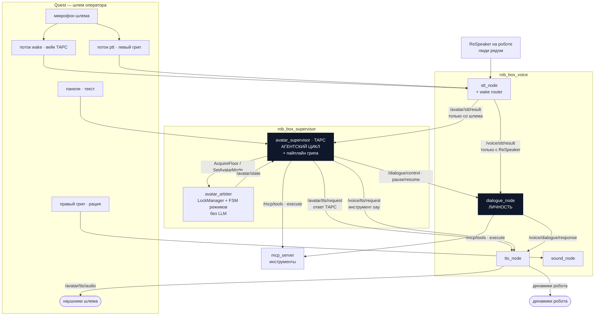
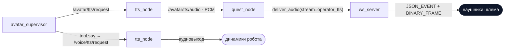
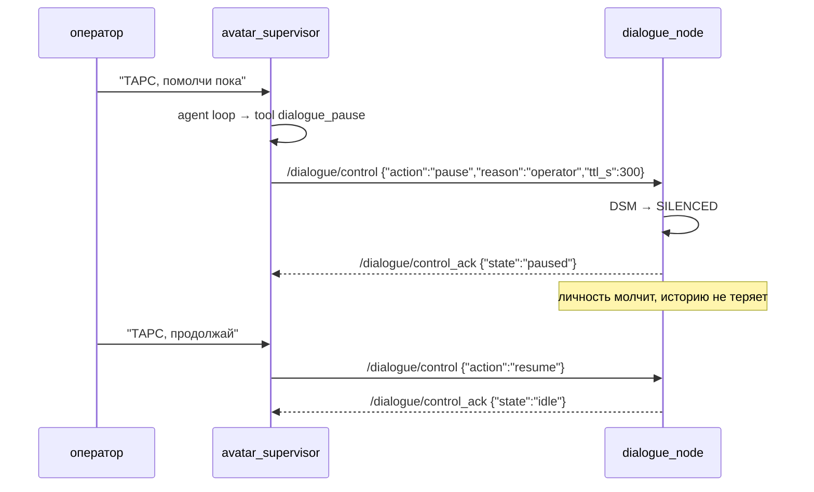
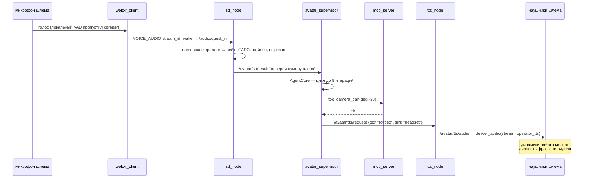
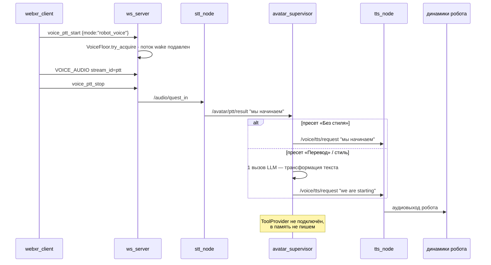
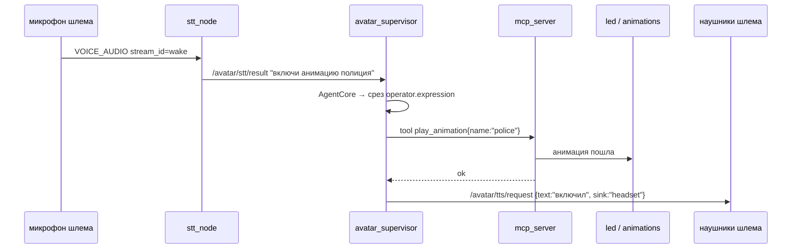
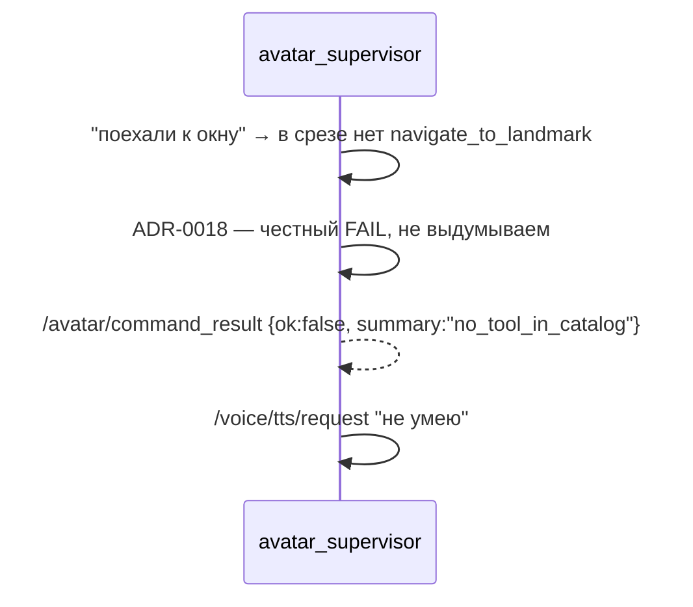

# Целевая архитектура: супервизор как агент оператора и диалоговая нода

> **Ключевая посылка.** Супервизор — это **агентский цикл помощника оператора**
> (позывной «ТАРС»): администрирование, речь, анимации, управление личностью.
> Это его назначение с самого начала; текущая реализация его не выражает.
> Арбитраж floor и FSM режимов — отдельный механизм, который из супервизора
> **выносится** (§4).

**Статус:** proposed
**Дата:** 2026-09-05
**Автор:** architecture review (скилл `improve-codebase-architecture`)
**Заменяет:** `docs/architecture/avatar-supervisor-agent.md` в части «движок агента»
(wire-контракт `/avatar/command` из него сохраняется без изменений)
**Пересматривает:** ADR-0028 §4.5 (параметрическое управление `dialogue_node`),
ADR-0001 §2.7.1 (`DialogHarness` как параллельная реализация)
**Основано на:** разбор кода `develop` @ `20e1b9e3`, см. §2

---

## 1. Что решаем

Оператор в шлеме должен управлять роботом голосом и текстом: сказать «ТАРС,
поверни камеру» или зажать левый грип и надиктовать фразу, которую робот
произнесёт своим голосом. Личность робота при этом не участвует — она либо
молчит, либо продолжает свой разговор с людьми рядом.

Сегодня это не работает, и причина не в багах, а в форме: **у оператора нет
своего агента**. Есть каркас `OperatorHarness`, который делает один вызов LLM,
не имеет цикла, собирается с `DummyLLMProvider` и `FakeToolProvider`, и по
контракту не может получить настоящие инструменты. Рабочим остаётся обходной
путь, где речь оператора попадает в LLM личности как реплика пользователя —
отсюда «оператор мне что-то сказал».

Целевая форма: **два агента на одном движке**, с разными промптами, разными
срезами каталога инструментов и разными историями. Единственная связь между
ними — команда `pause` / `resume`.

Агент оператора — это и есть `avatar_supervisor`. Не новая сущность рядом с
супервизором, а то, чем супервизор должен был быть. Всё, что мешает ему быть
агентом (арбитраж floor с жёстким latency-бюджетом, `OperatorHarness` без
цикла, `FakeToolProvider`), из него убирается.

---

## 2. Что мы нашли в коде (обоснование)

Фактура, на которой построены решения ниже. Все цифры — на `develop` @ `20e1b9e3`.

### 2.1 У оператора нет агентского цикла

`rob_box_harness/harnesses/operator.py:step()` — один `llm.complete()`, затем
исполнение вернувшихся `tool_calls`, выход. Результаты инструментов обратно в
модель не отдаются, итераций нет.

Настоящий цикл в проекте есть — `DialogCore._run_with_tools`
(`for _ in range(_MAX_TOOL_ITERATIONS)`, 8 итераций, результаты возвращаются
модели). Пользуется им только личность.

### 2.2 Агент оператора не может ничего выполнить

| факт | место |
|---|---|
| `llm` не передаётся → `Harness.init()` подставляет `DummyLLMProvider` (возвращает `"pong"`) | `supervisor_node.py:2064` |
| `assert isinstance(self.tools, FakeToolProvider)` — реальные инструменты запрещены | `operator.py:init()` |
| каталог оператора — два имени: `say`, `play_animation` | `OPERATOR_TOOL_NAMES` |
| `agent_enabled` по умолчанию `false` | `supervisor_node.py:460` |
| на `/avatar/command_result` нет подписчиков вне тестов | grep по `src/` |

### 2.3 Один микрофон, пять маршрутов, выбор изменяемой строкой

`dialogue_node._on_quest_stt` ветвится по параметру `voice_input_mode`, который
удалённо выставляет супервизор через `/dialogue_node/set_parameters`:

| значение | что происходит |
|---|---|
| `respeaker` (дефолт) | Quest-STT игнорируется |
| `quest_ttts` | дословно STT → TTS |
| `quest_llm_formalize` | LLM переписывает фразу в стиле пресета → TTS |
| `quest_stt` | `_on_stt(from_quest=True)` — **вход личности**; фраза ложится в её историю |
| `quest_command` | `/avatar/command` → супервизор (тупик из §2.2) |

Три из пяти значений меняют не «молчит/не молчит», а **маршрут аудио**. Отсюда
гонки, зафиксированные прямо в коде клиента (`main.ts:590` — «voice_input_mode=
respeaker и dialogue_node его игнорирует (гонка)»).

### 2.4 Харнес-фреймворк в проде не используется

Базовый класс `Harness`, `HarnessRegistry`, `runner`, `lifecycle`, `snapshot`,
`transport` не вызываются ни из одной ROS-ноды. `register_builtin_harnesses`
регистрирует `echo` и `upper`. `DialogueNode` использует `DialogCore` напрямую,
класс `Harness` не трогает.

Единственный код в проде, наследующий `Harness` — `OperatorHarness`, то есть
единственный пользователь фреймворка это сломанный агент оператора.

`DialogHarness` (428 LOC) описан как «parallel implementation… switching is via
the `harness.kind` flag»; переключатель не подключён, класс конструируется
только в тестах (1375 LOC тестов).

### 2.5 Задвоенная логика

| что | копий | статус |
|---|---|---|
| машина состояний диалога (те же 4 состояния) | 3 | живая одна: `harness/core/dialogue_state_machine` (488). Мёртвые: `voice/core/dialogue_manager` (336), `core/dialogue_state` (118) |
| база голосовой памяти | 2 | **обе живые**: `/data/harness_voice.db` (`facts`/`waypoints`/`faq_items`/`event_profile`) пишет диалог; `/data/voice_memory.db` (`voice_turns`/`voice_facts`) пишут MCP-инструменты |
| floor / lock | 4 | `supervisor/core/locks` (255), `supervisor/core/fsm` (470, свои `voice_held_by`/`teleop_held_by`), `quest/server/voice_floor` (152), `quest/core/floor` (147). Синхронизация первых двух в коде помечена «best-effort, не транзакция» |
| FAQ-хранилище | 3 | `voice/core/faq_store` (454), `harness/memory/sqlite_voice` (`faq_items`), `mcp_tools` FAQStore — в разных БД |
| диалоговый путь | 2 | `DialogueNode → DialogCore` и `DialogHarness` (только тесты) |
| исполнение tool-calls | 3 | `harness/core/tool_registry` + executors, `voice/scheduler/tool_executor` (510), `voice/llm/tool_call_executor` (247, мёртвый) |
| music-модули | 2 | `voice/core/{music_library,minimax_music_client}` импортируются только своими тестами; живые версии в `mcp_tools/core/` — форки разошлись на 878 и 640 строк |
| пакет `rob_box_voice/llm` | — | 804 LOC, не импортируется никем, +1044 LOC тестов |

Не достижимо из точек входа ROS-нод и `mcp_server` — **4396 LOC**.

### 2.6 Вейк-слово оператора не существует

`DEFAULT_WAKE_WORDS` в `voice/core/dialogue_text.py` — один плоский список
(«роббокс» + 11 STT-искажений), ведущий только к личности. Маршрутизации
«какое слово сказали → какой агент отвечает» нет ни в одной точке.

### 2.7 Что уже правильно и переиспользуется

- **Физика PTT.** Левый грип → `voice_ptt_start {mode:"robot_voice"}`, правый →
  `{mode:"radio"}` (barge-in + рация). Транспорт менять не нужно, нужно сменить
  адресата.
- **Wire-контракт** `/avatar/command` ↔ `/avatar/command_result` (v1) —
  сохраняется как есть.
- **Каталог инструментов** `rob_box_core.tool_catalog` — единый SSoT схем,
  локальные объявления запрещены тестом. Сохраняется.
- **Транспорт инструментов** `ROSMCPToolProvider` поверх `/mcp/tools`.
- **Типизированный IDL** `rob_box_supervisor_msgs` (`AcquireFloor`,
  `ReleaseFloor`, `SetAvatarMode`, `AvatarStateMsg`, `FloorState`).
- **`LockManager`** (`supervisor/core/locks.py`) — единственная реализация
  floor с dead-man, которую оставляем.

---

## 3. Целевая картина



### 3.0 Три пути голоса

Это ядро модели. Три пути, три разных механизма, у каждого один владелец.

| путь | вход | механизм | назначение |
|---|---|---|---|
| **грип — пайплайн оператора** | левый грип, шлем | `STT → [LLM с пресетом \| выкл] → TTS`, **прямоточно**: ноль или один вызов LLM, без инструментов и без истории | оператор говорит людям рядом голосом робота |
| **ТАРС — помощник оператора** | вейк «ТАРС», шлем | агентский цикл + инструменты | «включи анимацию полиция», «произнеси фразу», «поверни камеру» |
| **личность** | ReSpeaker | агентский цикл личности | люди рядом разговаривают с роботом |

**Пайплайн грипа выбирает оператор.** Панель голосового пайплайна в шлеме
(`voice_pipeline_panel.ts`) уже даёт ровно эту конфигурацию: тумблеры
`STT / LLM / TTS`, кнопка «Без стиля» и семь пресетов —
`Перевод`, `Технический`, `По понятиям`, `Пещерный`, `Деловой`, `Философ`,
`Ленин` — плюс выбор языка.

| выбор в панели | что делает пайплайн |
|---|---|
| «Без стиля» (LLM выкл) | распознал → произнёс дословно голосом робота |
| пресет `Перевод` + язык | распознал → перевёл → произнёс на целевом языке |
| стилизующий пресет | распознал → переписал в стиле → произнёс |

Ключевое: даже с включённым LLM это **один вызов** — трансформация текста, а
не разговор. Ни инструментов, ни истории, ни tool-loop. Именно это отличает
пайплайн грипа от ТАРС.

**ТАРС и грип частично перекрываются намеренно.** «ТАРС, произнеси фразу X» и
зажатый грип дают один результат — робот говорит. Разница в возможностях:
грип прямоточен и предсказуем, ТАРС понимает намерение и умеет то, чего
грипом не сделать («включи анимацию полиция», «поезжай к окну»). Это не
архитектурное задвоение: механизмы разные, владелец у каждого один, общего
состояния нет.

**Чего эти пути не делают:**

- грип **не** заходит в агентский цикл и **не** попадает ни в одну историю;
- ТАРС **не** говорит из динамиков робота по своей инициативе — свои реплики
  он произносит в наушники оператора (§7.4);
- личность **не** видит ни грип, ни ТАРС.

### 3.1 Зоны ответственности

| нода | владеет | НЕ владеет |
|---|---|---|
| `avatar_supervisor` (ТАРС) | агентский цикл оператора, его промпт, история, каталог инструментов; пайплайн грипа (§7.5) | режимами, floor-ами, историей личности |
| `avatar_arbiter` | FSM режимов, `LockManager` (единственный владелец floor), агрегация `/avatar/state` | LLM, инструментами, историей |
| `dialogue_node` | агентский цикл личности, её история, её срез каталога | знанием о Quest, режимами оператора |
| `stt_node` | распознавание, **маршрутизация по источнику и вейк-слову**, быстрый путь грипа | смыслом фраз, LLM |
| `tts_node` | синтез, провайдеры, голоса | тем, кто попросил |

---

## 4. Супервизор — это агент. Арбитраж floor из него выносится

**Решение.** `avatar_supervisor` остаётся тем же именем и тем же namespace
`/avatar/*`, но становится тем, чем задумывался: **агентским циклом помощника
оператора**. Всё, что не является этим циклом, из него уезжает в новую
маленькую ноду `avatar_arbiter`.

| | `avatar_supervisor` (ТАРС) | `avatar_arbiter` |
|---|---|---|
| суть | агентский цикл + инструменты + история | чистый арбитр, конечный автомат |
| LLM | да | **нет** |
| latency | секунды, это нормально | сервисы < 100 мс, жёстко |
| падение | оператор теряет помощника, телеоп жив | телеоп встаёт |
| источник кода | `AgentCore` + промпт оператора | `core/fsm.py` + `core/locks.py` + агрегатор — переезжают как есть |

**Почему нельзя оставить всё в одной ноде.** `quest_node` вызывает сервисы
супервизора с `timeout_s = 0.05` и при таймауте деградирует
(`_run_supervisor_service`). Агентский цикл — до 8 итераций LLM, это секунды.
В одном rclpy-процессе гарантию latency дать нельзя ни отдельным потоком, ни
callback-группой: GIL и общий executor. На этой гарантии висит телеоп — то
есть физическое движение робота.

**Что это НЕ значит.** Это не «супервизора разделили пополам». Супервизор
остаётся один и это агент; `avatar_arbiter` — не второй супервизор, а
вынесенный механизм блокировок, у которого нет ни своей воли, ни своего
состояния сверх таблицы держателей. По смыслу он ближе к мьютексу, чем к ноде
принятия решений.

**Что делает ТАРС с арбитром.** Ровно то же, что Quest — вызывает его сервисы
как клиент, когда оператор просит сменить режим или взять floor. Никакого
привилегированного доступа.

**Имена сервисов.** `/avatar_supervisor/{acquire_floor,release_floor,set_avatar_mode}`
переезжают на `/avatar_arbiter/...`. Затронуты три `create_client` в
`quest_node` и их тесты — изменение локальное.

**Альтернатива, которую отклоняем:** агент в отдельном потоке внутри
`supervisor_node`. Отклоняется из-за latency-гарантии выше.

---

## 5. Единый агентский движок

**Решение.** Оба агента используют **один** движок — `DialogCore` (или его
переименованный вариант `AgentCore`), сконфигурированный разными портами.

```
AgentCore(
    llm=...,            # порт LLM
    tools=...,          # порт инструментов, срез каталога
    memory=...,         # порт памяти, namespace агента
    dsm=...,            # машина состояний
    system_prompt=...,  # промпт агента
)
```

| | личность | оператор |
|---|---|---|
| промпт | `rob_box_voice/prompts/master_prompt_compact.txt` | `rob_box_supervisor/prompts/operator_system_prompt.txt` |
| срез каталога | `CORE_SKILL` + скиллы личности | operator slice (§6) |
| память | namespace `personality` | namespace `operator` |
| история | своя | своя, личности не видна |
| вход | `/voice/stt/result` | `/avatar/stt/result`, `/avatar/command` |
| выход речи | `/voice/dialogue/response` | `/voice/tts/request` |

**Что из этого следует удалить как дубль:**

- `OperatorHarness` (392 LOC) — движок заменяется на `AgentCore`;
- `DialogHarness` (428) + `test_dialog_harness.py` (358) +
  `test_integration_e2e.py` (589);
- каркас `Harness` / `HarnessRegistry` / `runner` / `lifecycle` / `snapshot` /
  `transport`, если после миграции у него по-прежнему нет пользователей;
- `rob_box_voice/llm/` (804) + тесты (1044);
- `voice/core/dialogue_manager.py` (336) и `rob_box_core/dialogue_state.py` (118);
- `voice/core/{music_library,minimax_music_client}.py` — форки живых модулей
  в `mcp_tools/core/`.

---

## 6. Каталог инструментов и срезы

**Инвариант.** Схемы инструментов объявляются **только** в
`rob_box_core.tool_catalog`. Локальные объявления запрещены (уже проверяется
тестом `test_operator_no_local_schema`, распространяем на оба агента).

Срез (skill) — это именованный список имён инструментов. Агент получает
`ToolProvider`, суженный до своего среза.

**Объём ТАРС: весь каталог личности плюс операторские срезы.** Оператор — не
урезанная версия личности, а привилегированный пользователь: ему доступно всё,
что умеет робот, плюс то, чего личности не положено.

| срез | инструменты | личность | ТАРС |
|---|---|---|---|
| `core` | базовые | ✓ | ✓ |
| `personality.*` | музыка, память, FAQ, эпитеты, движение, навигация — весь текущий каталог `dialogue_node` | ✓ | ✓ |
| `operator.speech` | `say` (**заставить говорить робота вслух**), `set_voice`, `set_voice_preset`, `set_voice_language`, `preview_voice` | — | ✓ |
| `operator.control` | `dialogue_pause`, `dialogue_resume`, `set_avatar_mode`, `acquire_floor`, `release_floor` | — | ✓ |
| `operator.admin` — **позже** | `ros2_node_status`, `read_logs`, `restart_container`, `disk_health` | — | ✓ |

`operator.admin` — отдельная карточка после того, как цикл заработает: ТАРС
отвечает «нода `stt_node` не поднялась, в логе `ALSA device busy`, перезапустить
контейнер?». Это и есть «супервизор как администратор», ради чего он задумывался.

**Опасные инструменты — через `ConfirmationPolicy`.** Механизм уже существует
(`harness/core/confirmation_policy.py`). `restart_container`, `drive` и подобные
требуют подтверждения оператора голосом или кнопкой; список — в конфиге, не в
коде.

**Транспорт — один:** `ROSMCPToolProvider` поверх `/mcp/tools`
(`TRANSIENT_LOCAL`, depth 1). Оба агента ходят через него. `FakeToolProvider`
остаётся только в тестах; `assert isinstance(..., FakeToolProvider)` из
`operator.py` удаляется вместе с модулем.

---

## 7. Маршрутизация речи

**Главный инвариант.** Два микрофона — два агента, и они не пересекаются:

- **ReSpeaker на роботе** слышит людей рядом → **только личность**.
  Вейк-слово «ТАРС» из этого микрофона **игнорируется**: оператор не
  разговаривает с роботом через его же микрофон.
- **Микрофон шлема** слышит оператора → **только агент оператора**.
  Вейк-слово личности из этого микрофона игнорируется.

Единственная точка маршрутизации — `stt_node`. Он и только он решает, чья
фраза, и публикует её в топик соответствующего агента.

### 7.1 Правила

| вход | условие | выход |
|---|---|---|
| `/audio/speech_audio` (ReSpeaker) | вейк личности (`роббокс`, …) либо личность в `DIALOGUE` | `/voice/stt/result` → личность |
| `/audio/speech_audio` | всё остальное | отбрасывается — **оператору не уходит никогда** |
| `/audio/quest_in`, `stream_id = wake` | вейк оператора (`ТАРС`, …) | `/avatar/stt/result` → агент оператора |
| `/audio/quest_in`, `stream_id = wake` | вейка нет | отбрасывается |
| `/audio/quest_in`, `stream_id = ptt` (левый грип) | всегда | `/avatar/ptt/result` → **пайплайн грипа** (§7.5) |
| `/audio/quest_in`, правый грип (рация) | через STT не идёт | `/avatar/voice_in` → `sound_node` → динамики робота |

Вейк-слово вырезается из текста перед публикацией — как сейчас делает
`remove_wake_word`. В PTT-потоке вейк не нужен: грип сам является вейком.

### 7.5 Пайплайн грипа

**Владелец — `avatar_supervisor`, но не его агентский цикл.** Это отдельный
прямоточный путь в той же ноде: пришёл текст → применили выбранный пресет
(ноль или один вызов LLM) → отдали в TTS. Ни `ToolProvider`, ни памяти, ни
`AgentCore`.

```
/avatar/ptt/result ─→ transform(text, preset, language) ─→ /voice/tts/request
                          │
                          ├─ preset = none      → текст без изменений, 0 вызовов LLM
                          ├─ preset = translate → 1 вызов, перевод на target language
                          └─ preset = <стиль>   → 1 вызов, переписывание в стиле
```

**Почему в ноде оператора, а не в `stt_node`.** `stt_node` не должен владеть
LLM — иначе он перестанет быть маршрутизатором. И конфигурация пайплайна
(пресет, язык) — это состояние оператора, оно живёт там же, где остальное
состояние оператора.

**Почему не в диалоговой ноде, как сейчас.** Потому что это состояние
оператора, а не личности; сегодня оно живёт в `dialogue_node` параметрами
`voice_preset` / `voice_language` / `voice_input_mode` и заставляет личность
знать про Quest.

**Конфигурация.** Панель шлёт выбор в `/avatar/voice_pipeline`
(`{llm_enabled, preset, language}`), подписчик — `avatar_supervisor`.
Топики `/avatar/set_voice_preset` и `/avatar/set_voice_language` остаются как
инструменты ТАРС и меняют то же состояние — одна точка правды на ноде
оператора.

**Барьер.** Пайплайн грипа не имеет доступа к инструментам. Даже если LLM в
режиме стилизации вернёт `tool_calls`, они игнорируются: у этого пути нет
`ToolProvider`. Это делает невозможным «случайно поехали» из-за неудачной
формулировки.

### 7.2 Всегда-включённый канал микрофона шлема

**Проблема.** Сегодня микрофон шлема стримится **только пока зажат грип**:
`voiceCapture.start()` вызывается в `applyVoicePtt` при нажатии и
`voiceCapture.stop()` при отпускании (`main.ts:560-610`). Вейк-слово «ТАРС»
на таком транспорте невозможно — робот не слышит оператора, пока тот ничего
не нажал.

**Решение — два варианта, приоритет у первого.**

**Вариант A (предпочтительный): детект вейка на клиенте.** Если в шлеме есть
готовый механизм распознавания на устройстве — использовать его: клиент сам
ловит «ТАРС» и только после этого открывает поток. Канал почти не нагружен,
батарея экономится.

> **Проверить при реализации.** Клиент — WebXR-страница в браузере Quest,
> не нативное приложение, поэтому Meta Voice SDK (Wit.ai, Unity/Unreal)
> **недоступен**. Реальные кандидаты: Web Speech API, если браузер Quest его
> отдаёт (исторически нестабильно), либо WASM-детектор вейка в бандле
> (Porcupine Web, openWakeWord, vosk-browser). Первым шагом карточки —
> проверка на живом устройстве, а не выбор по документации.
>
> Цена варианта A: список вейк-слов уезжает в клиент, менять его — пересборка
> и передеплой PWA, а не правка YAML на роботе.

**Вариант B (fallback): VAD на клиенте + вейк на сервере.** Второй,
всегда-включённый поток с того же захвата, отличаемый по `stream_id`. Протокол
это уже позволяет: заголовок кадра — `HEADER_STRUCT = "<BI"`, то есть 1 байт
типа + 4 байта `stream_id`, и `VOICE_AUDIO = 0x13` несёт оба потока.

| поток | `stream_id` | когда идёт | назначение |
|---|---|---|---|
| `ptt` | `1` | пока зажат левый грип | фраза целиком, вейк не нужен |
| `wake` | `2` | пока сессия жива, гейт по локальному VAD | поиск «ТАРС» в `stt_node` |

Клиент гейтит поток `wake` локальным VAD: тишина не отправляется, кадры уходят
только на озвученных сегментах. Тот же приём уже применён на стороне робота
(`/audio/vad`). Список вейк-слов остаётся на роботе в YAML.

Новые команды: `voice_listen_start` / `voice_listen_stop` — включают и
выключают поток `wake` (по умолчанию включён при `HELLO`, выключается
тумблером в панели). Они нужны в обоих вариантах.

**Приоритет потоков.** Если зажат грип, поток `wake` подавляется — иначе одна
фраза попадёт и в пайплайн грипа, и в агента.

### 7.3 Два namespace вейк-слов

```yaml
# config/wake_words.yaml — единственный SSoT
personality:      # только из /audio/speech_audio
  - роббокс
  - робокс
  # + STT-искажения
operator:         # только из /audio/quest_in stream_id=wake
  - тарс
  - tars
  # + STT-искажения
```

`voice/core/dialogue_text.py` перестаёт быть владельцем списка и читает этот
файл. Namespace жёстко привязан к источнику аудио, а не только к тексту —
совпадение «ТАРС» в ReSpeaker-канале не создаёт маршрута.

### 7.4 Обратный канал: ТАРС отвечает в шлем

**Инвариант.** У агента оператора **два разных выхода звука**, и путать их
нельзя:

| выход | куда звучит | кто слышит | канал |
|---|---|---|---|
| собственный ответ ТАРС | наушники шлема | только оператор | `/avatar/tts/request` → `/avatar/tts/audio` → WS → шлем |
| инструмент `say(text)` | динамики робота | люди рядом | `/voice/tts/request` → `tts_node` → аудиовыход робота |

ТАРС — это гарнитура оператора, а не второй голос робота. Его реплики
(«принял», «камера повёрнута», «не умею») **никогда** не звучат из динамиков
робота. И наоборот: `say` — это когда оператор хочет, чтобы заговорил **робот**,
и в шлеме эта фраза не дублируется.

**Транспорт уже наполовину существует.** Доставка синтезированного аудио в
конкретную WS-сессию реализована для preview голосов:
`ws_server.deliver_preview_audio()` шлёт `JSON_EVENT{type:"preview_voice_audio",
format, seq, total}` и следом `BINARY_FRAME`, а клиент это уже декодирует и
проигрывает (`wire/messages.ts:263`).

**Решение.** Обобщить этот механизм до приватного аудиоканала сессии:

```
deliver_audio(session, stream="operator_tts", request_id, bytes, format, seq, total)
```

Preview голосов становится одним из его пользователей (`stream="preview"`),
ответы ТАРС — вторым (`stream="operator_tts"`). Два пользователя оправдывают
шов; сегодня пользователь один, и механизм зря сидит в приватных полях
`_preview_pending`.

**Barge-in оператора.** Пока ТАРС говорит в шлем, нажатие любого грипа
прерывает его воспроизведение — клиент останавливает проигрывание локально и
шлёт `voice_ptt_start`. Динамиков робота это не касается.



### 7.3 Что уходит

Параметр `voice_input_mode` со всеми шестью значениями **удаляется**. Вместе с
ним из `dialogue_node` уходят `_on_quest_stt`, `_publish_avatar_command_from_quest`,
`_formalize_with_llm` и подписка на `/voice/stt/quest`. Диалоговая нода
перестаёт знать о существовании Quest.

Функциональность не теряется, а переезжает:

| было (`voice_input_mode`) | стало |
|---|---|
| `quest_ttts` | пайплайн грипа, «Без стиля» (§7.5) |
| `quest_llm_formalize` | пайплайн грипа с выбранным пресетом — включая `Перевод` (§7.5) |
| `quest_stt` | не нужен: у оператора свой агент, речь оператора в личность не попадает |
| `quest_command` | `/avatar/stt/result` → агент оператора |
| `off` | `/dialogue/control{action:"pause"}` |
| `respeaker` | `/dialogue/control{action:"resume"}` |

---

## 8. Единственная связь: pause / resume

**Инвариант.** Агент оператора влияет на диалоговую ноду **ровно одним**
способом: топиком `/dialogue/control` со значением `pause` или `resume`.
Никаких `set_parameters`, никаких режимов, никакой записи в её состояние.



**`ttl_s`** обязателен: пауза без срока — это способ навсегда потерять
личность при падении агента оператора. По истечении TTL `dialogue_node`
сама возвращается в `IDLE` и публикует ack.

**Что pause НЕ делает:** не глушит ReSpeaker, не меняет маршрут аудио, не
чистит историю. Это ровно переход `DSM → SILENCED`, который уже существует.

---

## 9. Карта топиков

Легенда: **=** без изменений · **+** новый · **−** удаляется · **~** меняется контракт

### 9.1 Аудио

| топик | тип | pub | sub | |
|---|---|---|---|---|
| `/audio/speech_audio` | `AudioData` | `audio_node` | `stt_node` | = ReSpeaker → **только личность** |
| `/audio/quest_in` | `AudioData` | `quest_node` | `stt_node` | ~ несёт два потока: `stream_id=ptt` и `stream_id=wake` |
| `/audio/vad` | `Bool` | `audio_node` | `dialogue_node` | = ReSpeaker-VAD, оператора не касается |
| `/avatar/voice_in` | `AudioData` | `quest_node` | `sound_node` | = рация, динамики робота |
| `/avatar/tts/audio` | `AudioData` | `tts_node` | `quest_node` | **+** голос ТАРС **в шлем**, не в динамики |

### 9.2 Распознавание

| топик | тип | pub | sub | |
|---|---|---|---|---|
| `/voice/stt/result` | `String` | `stt_node` | `dialogue_node` | = речь людей рядом |
| `/avatar/stt/result` | `String` | `stt_node` | `avatar_supervisor` | **+** речь оператора из шлема |
| `/avatar/ptt/result` | `String` | `stt_node` | `avatar_supervisor` | **+** речь с грипа → пайплайн (§7.5) |
| `/avatar/voice_pipeline` | `String` JSON | `quest_node` | `avatar_supervisor` | **+** `{llm_enabled, preset, language}` из панели |
| `/voice/stt/quest` | `String` | `stt_node` | `dialogue_node` | **−** заменён на `/avatar/stt/result` + `/avatar/ptt/result` |
| `/voice/stt/speaker` | `String` | `stt_node` | `dialogue_node` | = |
| `/voice/stt/state` | `String` | `stt_node` | — | = |

### 9.3 Агент оператора

| топик | тип | pub | sub | |
|---|---|---|---|---|
| `/avatar/command` | `String` JSON v1 | `quest_node`, `telegram_node` | `avatar_supervisor` | ~ адресат сменился с супервизора на агента |
| `/avatar/command_result` | `String` JSON v1 | `avatar_supervisor` | `quest_node`, `telegram_node` | ~ появляются подписчики |
| `/avatar/agent/state` | `String` JSON | `avatar_supervisor` | `quest_node` | **+** `idle`/`thinking`/`acting`/`speaking` для HUD |

### 9.4 Управление личностью

| топик | тип | pub | sub | |
|---|---|---|---|---|
| `/dialogue/control` | `String` JSON | `avatar_supervisor` | `dialogue_node` | **+** `{action, reason, ttl_s}` |
| `/dialogue/control_ack` | `String` JSON | `dialogue_node` | `avatar_supervisor` | **+** `{state, until_ms}` |
| `/voice/dialogue/state` | `String` | `dialogue_node` | `quest_node`, `avatar_supervisor` | = |
| `/dialogue_node/set_parameters` | сервис | (был `avatar_supervisor`) | — | **−** параметрический канал убирается |

### 9.5 Синтез речи

| топик | тип | pub | sub | |
|---|---|---|---|---|
| `/voice/dialogue/response` | `String` | `dialogue_node` | `tts_node` | = голос личности → динамики |
| `/voice/tts/request` | `String` | `avatar_supervisor` | `tts_node` | ~ **только инструмент `say`** → динамики робота |
| `/avatar/tts/request` | `String` JSON | `avatar_supervisor` | `tts_node` | **+** собственный ответ ТАРС → **в шлем**; поле `sink:"headset"` |
| `/voice/tts/finished` | `String` | `tts_node` | оба агента | = |
| `/voice/tts/batch_registered`, `/voice/tts/batch_complete` | `String` | `tts_node` | `dialogue_node` | = |
| `/voice/tts/control` | `String` | `stt_node`, оба агента | `tts_node` | = barge-in |
| `/voice/tts/voices`, `/voice/tts/provider_state`, `/voice/tts/current_voice` | `String` | `tts_node` | `quest_node`, агенты | = |

### 9.6 Голос и пресеты

Эти топики сегодня — «широкий шов» из пяти команд между Quest и супервизором.
В целевой картине они становятся **инструментами** агента оператора, а топики
остаются только как транспорт `tts_node`.

| топик | | комментарий |
|---|---|---|
| `/avatar/set_voice` | ~ | pub → `avatar_supervisor` (инструмент `set_voice`) |
| `/avatar/set_voice_preset` | ~ | инструмент `set_voice_preset` |
| `/avatar/set_voice_language` | ~ | инструмент `set_voice_language` |
| `/avatar/set_voice_mode` | **−** | заменён на `/dialogue/control` |
| `/avatar/preview_voice` + `/result`, `/audio`, `/error` | = | остаются, UI-функция панели |

### 9.7 Режимы и floor

| интерфейс | тип | владелец | клиенты | |
|---|---|---|---|---|
| `/avatar_arbiter/acquire_floor` | `AcquireFloor.srv` | `avatar_arbiter` | `quest_node`, ТАРС | ~ переезд с `/avatar_supervisor/*` |
| `/avatar_arbiter/release_floor` | `ReleaseFloor.srv` | `avatar_arbiter` | `quest_node`, ТАРС | ~ переезд |
| `/avatar_arbiter/set_avatar_mode` | `SetAvatarMode.srv` | `avatar_arbiter` | `quest_node`, ТАРС | ~ переезд |
| `/avatar/state` | `AvatarStateMsg` | `avatar_arbiter` | `quest_node`, ТАРС | ~ сменился publisher |
| `/teleop_heartbeat` | `TeleopHeartbeat` | `quest_node` | `avatar_arbiter` | = |

ТАРС обращается к арбитру как обычный клиент — привилегий у него нет.

### 9.8 Инструменты

| топик | тип | pub | sub | |
|---|---|---|---|---|
| `/mcp/tools` | `String`, `TRANSIENT_LOCAL` d1 | `mcp_server` | оба агента | ~ добавлен подписчик |
| `/harness/task_events` | `String` | `mcp_server` | `dialogue_node` | = |
| `/mcp/music_cleanup`, `/mcp/music_fallback` | `String` | `dialogue_node` | `mcp_server` | = |

---

## 10. Сценарии

### 10.1 «ТАРС, поверни камеру» — ответ звучит только в шлеме



### 10.2 Левый грип — пайплайн оператора, агентского цикла в нём нет



### 10.2а «ТАРС, включи анимацию полиция» — тот же результат через понимание



Сценарии 10.2 и 10.2а — две цены одного результата. Грип буквален и быстр;
ТАРС понимает намерение и достаёт то, чего грипом не сделать.

### 10.3 Пауза личности

См. диаграмму в §8.

### 10.4 Оператор просит недоступное



---

## 11. Инварианты

Правила, нарушение которых означает возврат к текущему состоянию.

1. **Один движок.** Новый агент — это конфигурация `AgentCore`, а не новый
   класс с собственным циклом. Второй tool-loop в репозитории запрещён.
2. **Один каталог.** Схемы инструментов только в `rob_box_core.tool_catalog`.
   Тест грепает локальные объявления в обоих агентах.
3. **Одна связь агентов.** Агент оператора влияет на личность только через
   `/dialogue/control`. Запись в её параметры запрещена.
4. **Истории не смешиваются.** Реплика оператора никогда не попадает в историю
   личности и наоборот. Проверяется e2e-тестом.
5. **Один владелец floor.** `LockManager` в `avatar_arbiter`. `ModeManager`
   не хранит держателей; Quest-трекеры — read-only кэш `/avatar/state`.
6. **Одна маршрутизация речи.** Только `stt_node` решает, чья фраза. Ветвление
   по источнику в агентах запрещено.
6a. **Микрофоны не пересекаются.** ReSpeaker → только личность; микрофон шлема
   → только агент оператора. Вейк-слово «ТАРС» из ReSpeaker игнорируется,
   вейк-слово личности из шлема игнорируется. Namespace вейк-слов привязан к
   источнику аудио, а не только к тексту.
6c. **В пайплайне грипа нет инструментов и нет истории.** Разрешён ноль или
   один вызов LLM (пресет/перевод). `ToolProvider` этому пути не передаётся,
   `tool_calls` от модели игнорируются, в память ничего не пишется.
   Проверяется тестом: путь грипа не имеет доступа к `ToolProvider`.
6b. **Два выхода звука не смешиваются.** Собственные реплики ТАРС звучат
   **только в наушниках шлема** (`/avatar/tts/request` → `/avatar/tts/audio`).
   Инструмент `say` звучит **только из динамиков робота**
   (`/voice/tts/request`) и в шлеме не дублируется. Проверяется e2e-тестом.
7. **Одна база памяти.** Один SQLite-файл, namespace на агента. Второй файл со
   своей схемой — запрещён.
8. **Пауза со сроком.** `/dialogue/control{action:"pause"}` без `ttl_s`
   отклоняется.
9. **CC-бюджет.** ADR-0021 распространяется на `avatar_supervisor`. Сторож
   `scripts/lint/cc_budget.py` должен существовать до начала миграции.

---

## 12. Устранение дублей

| дубль | было | стало |
|---|---|---|
| движок агента | `DialogCore` + `OperatorHarness` + `DialogHarness` | `AgentCore`, две конфигурации |
| машина состояний | 3 реализации | `harness/core/dialogue_state_machine` |
| floor | 4 реализации | `LockManager` в `avatar_arbiter`, остальные — кэш |
| роль супервизора | агент и арбитр в одном процессе, агент нерабочий | `avatar_supervisor` = агент, `avatar_arbiter` = арбитр |
| память | 2 БД, разные схемы | 1 БД, namespace на агента |
| FAQ | 3 хранилища | 1, внутри общей БД |
| исполнение tool-calls | 3 | `ToolRegistry` + `ROSMCPToolProvider` |
| маршрут речи | параметр с 6 значениями в диалоговой ноде | `stt_node` + три топика (личность / ТАРС / грип) |
| стилизация речи оператора | `quest_llm_formalize` внутри диалоговой ноды | пайплайн грипа в супервизоре (§7.5) |
| music-модули | форки в `voice` и `mcp_tools` | версии `mcp_tools`, `voice`-копии удалены |
| `rob_box_voice/llm` | 804 LOC мёртвых | удалён |

Оценка удаляемого кода: **~6–7 тыс. LOC** вместе с тестами на мёртвые модули.

---

## 13. План миграции

Шаги 1–3 независимы и делаются параллельно.

**Шаг 1. Сторож CC.** Написать `scripts/lint/cc_budget.py` (~50 LOC) из
ADR-0021 с фиксацией текущего baseline. Без него всё остальное откатится.

**Шаг 2. Удаление мёртвого.** `DialogHarness` + тесты, `rob_box_voice/llm` +
тесты, форки music-модулей, две лишние машины состояний. Риск близок к нулю,
покрытие перестаёт врать.

**Шаг 3. `AgentCore`.** Переименование/обобщение `DialogCore`: вынести
`system_prompt` и срез каталога в конфиг, убрать зашитые предположения о
личности. Поведение личности не меняется — байт в байт.

**Шаг 4. Вынести `avatar_arbiter`.** `core/fsm.py` + `core/locks.py` +
агрегатор переезжают в новую ноду без LLM. Сервисы получают префикс
`/avatar_arbiter/`, `quest_node` обновляет три `create_client`. Поведение
floor не меняется — чистый переезд под тестами.

**Шаг 4а. `avatar_supervisor` становится ТАРС.** Внутри той же ноды
`OperatorHarness` заменяется на `AgentCore` с промптом оператора, реальным
`ROSMCPToolProvider` и полным каталогом + срезы `operator.*`. Подписка на
`/avatar/command` (контракт v1 без изменений) и `/avatar/stt/result`.
`agent_enabled` по умолчанию становится `true`.

**Шаг 4б. Пайплайн грипа.** `/avatar/ptt/result` + `/avatar/voice_pipeline`,
прямоточная трансформация с пресетом (§7.5), без `ToolProvider`.

**Шаг 5. Маршрутизация речи.** `config/wake_words.yaml` с привязкой namespace
к источнику аудио, wake router в `stt_node`, топик `/avatar/stt/result`.
Пока нет шага 5а, ТАРС работает только по PTT.

**Шаг 5а. Всегда-включённый микрофон шлема.** Поток `stream_id=wake` в
`voice_capture`, локальный VAD-гейт, команды `voice_listen_start/stop`,
подавление при зажатом грипе. Отдельная карточка: затрагивает батарею шлема и
требует замера расхода.

**Шаг 5б. Обратный канал звука в шлем.** Обобщить `deliver_preview_audio` до
`deliver_audio(session, stream, …)`, добавить `/avatar/tts/request` с
`sink:"headset"` и `/avatar/tts/audio`, локальный barge-in по нажатию грипа.
Без этого шага ТАРС отвечает текстом на панели, а не голосом.

**Шаг 6. `/dialogue/control`.** Pause/resume с TTL. Удаление
`voice_input_mode` и `_on_quest_stt` из `dialogue_node`.

**Шаг 7. Один владелец floor.** `ModeManager` перестаёт держать держателей;
Quest-трекеры становятся кэшем `/avatar/state`.

**Шаг 8. Одна база памяти.** Миграция `/data/voice_memory.db` →
`/data/harness_voice.db` с namespace, скрипт в `migrations/`.

**Шаг 9. Сужение Quest seam.** `Bridge.execute(Command)` вместо 25 методов
(отдельная карточка, к агенту оператора не относится).

Каждый шаг — отдельная карточка с `Closes #N` и revert-веткой (ADR-0013).

---

## 14. Открытые вопросы

1. **Детект вейка на устройстве (§7.2, вариант A).** Первым делом карточки —
   проверка на живом Quest: отдаёт ли браузер Web Speech API, и какой WASM-
   детектор укладывается в бандл и в батарею. От ответа зависит, где живёт
   список вейк-слов: в клиенте (пересборка PWA) или в YAML на роботе.
2. **Список STT-искажений «ТАРС».** vosk/yandex услышат «тарс», «тарз», «тас»,
   «target», `tars`. Собирается так же, как список для «роббокс» — по логам
   e2e, а не придумывается.
3. **Состав `operator.admin`.** Какие именно администраторские инструменты и
   какие из них за `ConfirmationPolicy`. Отдельная карточка после того, как
   цикл заработает.
4. **Судьба каркаса `Harness`.** После шага 4а у него не остаётся ни одного
   пользователя: `OperatorHarness` был последним. Удалять или доводить до
   использования — решение после шага 4а, не до.
5. **Имя `avatar_arbiter`.** Рабочее. Если в команде floor-арбитраж принято
   называть иначе — переименовать до шага 4, пока нет клиентов.

---

## 15. Связанные документы

- `docs/adr/0001-harness-architecture.md` — исходная схема ports & adapters
- `docs/adr/0021-dialogue-node-decomposition-discipline.md` — CC-бюджет, сторож
- `docs/adr/0027-meta-quest-ar-control.md` — §3.4 маршрутизация Quest-STT
- `docs/adr/0028-avatar-supervisor.md` — floor, режимы, §4.5 параметрический канал
- `docs/architecture/avatar-supervisor-agent.md` — wire-контракт `/avatar/command` v1
- `docs/architecture/meta-quest-api.md` — wire-протокол Quest
