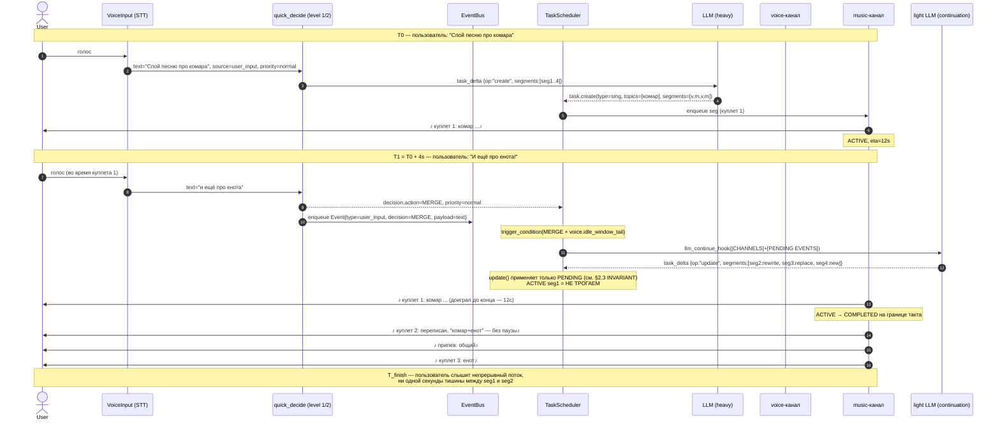

# Scheduler: intent-based execution вместо fire-and-forget

| Поле | Значение |
|------|----------|
| Документ | `docs/design/SCHEDULER_DESIGN.md` |
| Связанное | Issue [#968](https://github.com/krikz/rob_box_project/issues/968) (комментарий [5167924152](https://github.com/krikz/rob_box_project/issues/968#issuecomment-5167924152)), PR #907, #935, ADR-0001 §5 |
| Статус | **Architecture proposal v3** — §8 Acceptance tool-calling по комментарию 5167924152 |
| Автор документа | Architect profile (kanban t_8f5bb012 v1, t_9fca744c v2, **t_99da3520 v3**) |
| Дата | 2026-08-03 (v1) / 2026-08-03 (v2: §3.3, §4.5, §4.6, §5.5) / **2026-08-03 (v3: §2 расширен AWAITING_CONFIRMATION, §8 Acceptance tool-calling, §11.2 фаза 1.5)** |
| Основание | Анализ issue #968 целиком + все 16 комментариев (включая 5167924152) + аудит текущего кода + пересечение с ADR-0001 §5 |

---

## 0. TL;DR

Между LLM (которая выдаёт `tool_call`) и исполнителями (TTS, музыка, анимация) **нет слоя, который знает про порядок, границы и состояние каналов**. Результат — `stop_music` обгоняет `speak_text`, LLM не знает что TTS ещё играет, пользователь слышит обрубки.

**Решение:** ввести `TaskScheduler` — единая точка прохождения всех `tool_call`-ов и системных событий. Scheduler владеет каналами (voice, music, anim) и сегментами (атомарные единицы исполнения). LLM остаётся «дирижёром»: генерит намерения и видит состояние, scheduler — «оркестр»: исполняет по правилам.

**Ключевой принцип (из итоговой модели, согласовано в #13):** тулы от LLM идут в scheduler мгновенно (LLM не блокируется). Scheduler **не задерживает конструктивные** операции (`speak_text`, `play_animation` — встают в очередь канала), а **задерживает деструктивные** (`stop_music`, REPLACE, cancel) — до естественной границы voice-канала.

**Что УЖЕ есть в коде** (см. §11): вызовы `speak_text` уже блокируются через `_output_lock` + `await tts/finished` (dialogue_node.py:672–702). То есть половина исходной проблемы #968 уже решена. Осталось: (1) классификация ввода MERGE/REPLACE/QUEUE/IGNORE/CLARIFY до barge-in (блокер П1), (2) сегментная модель + PENDING-правки, (3) speculative pre-generation, (4) единый EventBus для системных событий.

**Что добавлено в v3 (эта ревизия, task t_99da3520, по комментарию 5167924152):**

- **§2.1 + §2.3** — расширение сегментной модели: новые `kind ∈ {nav, mapping, mutate}` и статус `AWAITING_CONFIRMATION` (между `PENDING` и `ACTIVE` для опасных действий). Полная диаграмма переходов с `REJECTED` (timeout/reject).
- **§8 «Acceptance tool-calling»** — новый раздел целиком по предложению автора issue #968: классификация всех тулов из `mcp_server.py:312–375` на три класса (🔴 confirm / 🟡 notify / 🟢 без подтверждения), жизненный цикл AWAITING_CONFIRMATION, сценарий «кухня → зал» как MERGE с подтверждением, safe boundary policy, 8 e2e-сценариев, 4 открытых вопроса дизайна (Q1–Q4).
- **§11.2 (новая фаза 1.5)** — отдельная фаза «Acceptance tool-calling» между MVP и фазой 2, со своим блоком acceptance (11 пунктов, включая property-based тест «stop_navigation никогда не требует confirm»).

**Что добавлено в v2 (предыдущая ревизия, task t_9fca744c):**

- **§3.3** — план перехода от блокирующего `speak_text` к scheduler: блокировка переезжает **внутрь voice-канала**, LLM-цикл перестаёт ждать `tts/finished` (не двойная сериализация, а перенос слоя).
- **§4.5** — scheduler сам инициирует внеочередной LLM-ход после MERGE (триггер «нужен новый task_delta»), не ждёт ни пользователя, ни нового `segment_completed`-тика.
- **§4.6** — mermaid sequenceDiagram полного MERGE-флоу («комар+енот») + каноническая pydantic-сигнатура `quick_decide()` / `QuickDecision`.
- **§5.5** — разрешение коллизии `EventBus` (этот документ, scheduler) vs `SideEffectBus` (ADR-0001 §5, AgentSession): разные домены, **EventBus перенесён в фазу 2** (а не 3), naming — `SchedulerEventBus` локально, чтобы не пересекаться с ADR-0001.

---

## 1. Бизнес-проблема и сценарий

### 1.1 Проблема (verbatim из #968)

LLM вызывает инструменты как «пулемёт»: `speak()`, `play_music()`, `stop_music()` улетают мгновенно, без ожидания. TTS встаёт в очередь, LLM молотит дальше и дёргает `stop_music()` — хотя речь ещё не начала произноситься. Инструменты не синхронизированы.

**Симптомы в e2e (v28–v38):**
- v36: `stop_music()` через 3с после начала рэпа → музыка отвалилась на середине фразы
- v38: cleanup срабатывал на первом TTS-чанке (некорректный сигнал «TTS готов»)
- Костыли (3с-таймер, debounce, «запретить stop_music в промпте») лечат симптом, не корень

**Корень:** между LLM и исполнителями нет планировщика. LLM генерит `tool_call`-ы, они вываливаются на железо в произвольном порядке и темпе.

### 1.2 Целевой сценарий («комар + енот»)

```
Пользователь: "Спой песню про комара"
Робот:        [генерирует и начинает петь, куплет 1]
Пользователь: "И ещё про енота!"        ← во время куплета 1
Робот:        [куплет 1 допевает до конца]
              [куплет 2 уже про енота — без паузы, без тишины]
              [пользователь НЕ слышит разрыва]
```

### 1.3 Зачем это нужно

Робот-ассистент, который не умеет «договаривать» и «вплетать» — это набор костылей вокруг каждого нового сценария. Длинные творческие задачи (рэп, рассказ, обучающий монолог) требуют осознанной координации каналов и состояния. Без планировщика каждая правка — это race-condition hunt по логам.

---

## 2. Сегментная модель

### 2.1 Определения

**Задача (Task)** — намерение пользователя, которое LLM разложила в последовательность действий. Уникальный `task_id`, тип (`sing`, `rap`, `narrate`, `navigate`), параметры (`topics`, `duration_hint`).

**Сегмент (Segment)** — атомарная единица исполнения внутри задачи. Имеет:
- `idx` — порядковый номер
- `kind` — `voice` | `music` | `anim` | `silence` | `nav` | `mapping` | `mutate`
- `payload` — что именно (текст, midi-паттерн, анимация, маршрут, операция над waypoint)
- `status` — `PENDING` → (`AWAITING_CONFIRMATION`?) → `ACTIVE` → `COMPLETED` / `CANCELLED` / `REJECTED` / `SKIPPED`
  - `AWAITING_CONFIRMATION` — сегмент с физическим/деструктивным действием, ждёт голосового/тач-подтверждения пользователя (см. §8 Acceptance tool-calling); по таймауту → `REJECTED`
- `confirmation` — `required` (true/false) и `timeout_ms` (по умолчанию 20 000) для сегментов с `kind ∈ {nav, mapping, mutate}`
- `eta_ms` — оценка длительности (см. §6)

### 2.2 Пример

```
Песня про комара:
  [seg_1: "куплет про комара"     — ACTIVE,  12с]
  [seg_2: "припев"               — PENDING,  8с]
  [seg_3: "куплет 2 про комара"  — PENDING, 12с]
```

### 2.3 Правила обновления (INVARIANT)

**`update(delta)` модифицирует ТОЛЬКО сегменты со статусом PENDING или AWAITING_CONFIRMATION.** ACTIVE сегмент доигрывает до естественной границы.

Пример MERGE:
```
update("добавь енота"):
  [seg_1: "куплет про комара"     — ACTIVE,  НЕ ТРОГАЕМ]
  [seg_2: "припев про обоих"     — PENDING → переписан]
  [seg_3: "куплет про енота"     — PENDING → заменён]
  [seg_4: "общий финал"          — PENDING → добавлен]
```

**Правила переходов (расширенный инвариант, включая §8):**

```
PENDING ──[confirm ok]──► ACTIVE ──[done]────► COMPLETED
   │                       │
   │                       └──[abort/replace]► CANCELLED
   │
   ├──[requires confirm]─► AWAITING_CONFIRMATION ──[confirm ok]──► ACTIVE
   │                              │
   │                              ├──[reject]────► REJECTED → feedback в LLM
   │                              └──[timeout]───► REJECTED (робот: «отменяю»)
   │
   └──[skip]──────────────────────► SKIPPED
```

- `update()` НЕ трогает `ACTIVE`
- `update()` НЕ отменяет `AWAITING_CONFIRMATION` без явного отказа пользователя (иначе гонка «едь на кухню» → пользователь только начал отвечать, а уже REJECT)
- Сегменты с `kind ∈ {voice, music, anim, silence}` идут сразу `PENDING → ACTIVE` (без подтверждения)
- Сегменты с `kind ∈ {nav, mapping, mutate}` проходят `AWAITING_CONFIRMATION` перед `ACTIVE` (см. §8)

**Этот инвариант — фундамент.** Без него любая правка «на лету» ломает воспроизведение. Покрывается unit-тестом (см. §11.1, §11.2 acceptance).

### 2.4 Почему сегменты, а не «один большой task»

LLM-цикл занимает 1.5–3с. TTS-чанк — 2–5с. Между ними нужна точка синхронизации, которая:
- не блокирует LLM-цикл на синтез (иначе «кома» из дилеммы)
- не позволяет деструктивным операциям обогнать конструктивные
- позволяет правкам применяться к будущему, не к звучащему

Сегмент = минимальная единица, которая:
- имеет чёткую границу (TTS-чанк = предложение, music = такт, anim = ключевой кадр)
- может быть отменена/перезаписана, если ещё не активна
- может быть допита до конца, если уже активна

---

## 3. Каналы (Channels)

### 3.1 Модель

Scheduler владеет набором каналов. **Каждый канал = FIFO-очередь + state-машина**.

| Канал | Содержимое | Граница сегмента | Длительность |
|-------|------------|------------------|--------------|
| `voice` | SSML/текст → TTS | Конец предложения | 1–3с |
| `music` | MIDI-паттерн → audio_node | Конец такта/фразы | 2–4с |
| `anim` | Animation preset | Конец ключевого кадра | 0.5–2с |
| `led` / `expression` | Мимика, свет | Мгновенная | <100мс |

Каналы **независимы** — это критично:
- музыка может играть фоном, пока voice говорит
- анимация может идти параллельно с любым каналом
- `led` всегда исполняется мгновенно (не блокирует)

### 3.2 Что встаёт в очередь vs что исполняется сразу

| Операция | Канал | Поведение |
|----------|-------|-----------|
| `speak_text(t)` | voice | В очередь (FIFO). `speak_text` блокируется до `tts/finished`. |
| `play_sound(name)` | voice (или отдельный `sfx`) | В очередь, блокируется до `sound/ready` |
| `play_animation(preset)` | anim | В очередь |
| `execute_music_code(...)` | music | В очередь, длинный (LONG в терминах async_executor) |
| `stop_music(...)` | music | **НЕ в очередь как обычная команда** — см. §4 |
| `set_vibe_preset(...)` | led/expression | INSTANT, fire-and-forget |
| `set_emotion(...)` | expression | INSTANT, fire-and-forget |

### 3.3 Переход от блокирующего `speak_text` к scheduler

Текущая реализация `speak_text` (`dialogue_node.py:672–702`) делает три вещи в одном `await`:

1. Захватывает `_output_lock` (asyncio.Lock) — взаимное исключение на LLM-цикл.
2. Публикует TTS-заказ в ROS-топик.
3. **Ждёт `tts/finished` для `speech_id`** до звучания последнего чанка.

**Это решает гонку `stop_music` ↔ `speak`, но создаёт две новые проблемы:**

- **Двойная сериализация**: один TTS-заказ блокирует и `speak_text`, и весь LLM-цикл. Если LLM выдаёт пять `speak_text` подряд, второй уже не «стоит в очереди» — он **ждёт**, пока предыдущий чанк доиграет, плюс ещё LLM-токены между ходами теряются.
- **Невозможность MERGE во время звучания**: LLM-цикл блокирован, значит обрабатывать новый ввод «и ещё про енота» — нечем. Сценарий «комар+енот» требует живой LLM во время звучания voice.

**Решение (фиксируем в этом документе):** блокировка **не убирается** — она **переезжает внутрь voice-канала**.

```
Сейчас (voice-канал не существует как объект):
  LLM-цикл → speak_text() → _output_lock.acquire() → ROS topic → await tts/finished → release
                                  ↑ блокирует LLM на 2–5с

Станет (есть voice FIFO + state-машина):
  LLM-цикл → speak_text() → scheduler.enqueue(voice, seg)          [НЕ блокирует LLM]
                                       ↓
                              voice-канал (FIFO + state)
                                       ↓
                              исполняет сегменты по одному
                                       ↓
                              ВНУТРИ канала: lock по каналу + ждёт tts/finished
                              LLM идёт дальше (следующие tool_calls или system prompt)
```

**Что меняется в коде:**

| Компонент | Было | Станет |
|-----------|------|--------|
| `speak_text` function_tool | `await self._speak_and_wait(text)` | `await self._scheduler.enqueue(channel="voice", seg=Segment(payload=text))` |
| `_output_lock` | asyncio.Lock на LLM-цикл | asyncio.Lock **только** на исполнителе voice-канала |
| `_tts_events[speech_id]` wait | внутри `speak_text` (блокирует LLM) | внутри voice-канала (блокирует только следующий сегмент своего канала) |
| Backpressure | «speak_text ждёт tts/finished» | «voice-канал возвращает ack сразу, сегменты FIFO-встают, исполнитель разруливает» |

**Что НЕ меняется:**

- Никакой новой логики сериализации нет — блокировка остаётся одна, просто живёт ниже по стеку (в канале).
- `_output_lock` никуда не девается, его владелец меняется: был у `speak_text`, стал у `voice_channel._play_next()`.
- Поведение `tts/finished` не меняется — те же `speech_id`, тот же счётчик. INSIGHT #7 (один finished на один заказ) сохраняется.

**Почему это НЕ «двойная сериализация»:** слой один — канал. LLM не блокируется ничем; канал сам сериализует свои сегменты. То, что было «блокировкой LLM», становится «FIFO-очередью канала» — это один и тот же механизм сериализации, просто развёрнутый из `await` в `enqueue + drain`.

**Почему это НЕ «race на `_output_lock`»:** `speak_text` больше не вызывает `_output_lock.acquire()`. Lock остаётся, но им владеет только voice-канал. LLM-цикл и voice-канал живут в разных корутинах и блокируют разные ресурсы: LLM — собственный ход; канал — собственный исполнитель.

**Критерий перехода (Phase 1 acceptance, дополнительно):**

- [ ] LLM-цикл не делает `await tts/finished` ни в одном пути (grep `await.*tts.*finished` по `dialogue_node.py` — пусто)
- [ ] `voice-канал` имеет собственный `_channel_lock` (вместо бывшего `_output_lock`)
- [ ] Два подряд `speak_text` от LLM возвращают управление за < 50мс каждый (текущее — 2–5с на вызов)
- [ ] Сценарий «комар+енот» отрабатывает с инвариантом: голос **не** прерывается на середине фразы, новые сегменты встают в очередь до естественной границы

**Обратная совместимость:** до полного перевода всех voice-вызовов через scheduler `_output_lock` остаётся в `dialogue_node.py` как no-op (или удаляется одним PR после перевода). Удаление `_output_lock` — отдельный PR, не часть Phase 1.

### 3.4 Уже реализовано

В текущем `dialogue_node.py:672–702`:

```python
async def speak_text(text: str, animation: str = "neutral") -> str:
    ...
    async with lock:  # ← _output_lock, сериализует speak/play_sound/animation
        result_str = await _call("speak_text", {...}, timeout=60.0)
        # ↓↓↓ ждём пока TTS реально договорит ↓↓↓
        speech_id = json.loads(result_str).get("data", {}).get("speech_id", "")
        if speech_id:
            event = asyncio.Event()
            self._tts_events[speech_id] = event
            await asyncio.wait_for(event.wait(), timeout=30.0)
```

Это значит: **основной race «stop_music vs speak» уже частично решён** — потому что пока `speak_text` ждёт `tts/finished`, LLM-цикл не двигается дальше. Проблема остаётся в `execute_music_code` + параллельных вызовах (см. §11.1 acceptance, регресс v36).

---

## 4. MERGE / REPLACE / QUEUE / IGNORE / CLARIFY

### 4.1 Решения по новому вводу

Планировщик принимает один из пяти вердиктов на любое событие (пользовательский ввод ИЛИ системное событие):

| Решение | Что делает | Когда |
|---------|-----------|-------|
| **MERGE** | Правка применяется к PENDING-сегментам. ACTIVE не трогается. | «и ещё про енота», `battery_critical` |
| **REPLACE** | Очередь PENDING сбрасывается, новая задача стартует после текущего сегмента. | «хватит, расскажи анекдот», `obstacle_ahead` (critical) |
| **QUEUE** | Текущая задача до конца, новая становится в общую очередь задач. | «а потом спой колыбельную» |
| **IGNORE** | Ничего не делаем. | «угу», кашель, шум, повторный «стоп» |
| **CLARIFY** | Генерим уточняющий вопрос (LLM, короткий). | «про него» (неоднозначная ссылка) |

### 4.2 Двухуровневое решение (< 800мс)

**Уровень 1 — правила (< 50мс):**
- Короткие реплики с союзами («и ещё», «а также», «а потом») → MERGE / QUEUE
- Императивы («хватит», «стоп», «замолчи») → REPLACE
- Шум, междометия, < 2 слов → IGNORE
- `confidence > 0.9` → решение принято, LLM не дёргаем

**Уровень 2 — лёгкая/быстрая LLM (< 800мс):**
- Вызывается только если уровень 1 не уверен
- Structured output: `{decision, task_delta, confidence, reasoning}`
- **Основная (тяжёлая) LLM для этого НЕ вызывается**

**Почему не основная LLM:**
- latency: лёгкая 200–400мс vs тяжёлая 1.5–3с (для MERGE/REPLACE критичны < 800мс)
- стоимость: дёргать дорогую модель на каждый «угу» — расточительно
- простота промпта: классификация из 5 вариантов не требует тяжёлого контекста

**Ограничение на параллельные LLM-вызовы** — rate limit MiniMax (concurrent requests). Планировщик учитывает его при постановке в очередь.

### 4.3 ПРИОРИТЕТЫ СОБЫТИЙ

| Приоритет | Источники | Эффект |
|-----------|-----------|--------|
| `critical` | `obstacle_ahead`, перегрев, потеря сети | REPLACE + сокращение ACTIVE до ближайшей границы |
| `high` | `battery_critical`, «хватит», пользовательский imperative | MERGE-срочный (ввернуть в следующий PENDING) или REPLACE |
| `normal` | голос пользователя, обычные `Hermes`-команды | Стандартный MERGE/REPLACE/QUEUE |
| `low` | шум, междометия, повторы | IGNORE |

`critical > high > normal > low`. Конфликт разрешается по приоритету, при равенстве — по времени поступления.

### 4.4 Разрешение блокера П1 (barge-in vs MERGE)

**Аудит #15 (комментарий 15) выявил блокер:** текущий код (`dialogue_node.py:1731`) при любом новом вводе вызывает `_cancel_run` → `asyncio.CancelledError` → LLM-цикл умирает. А сценарий «комар + енот» требует, чтобы LLM-цикл ЖИЛ и переписывал PENDING-сегменты.

**Решение (фиксируем в этом документе):**

```
новый ввод → уровень 1 (правила) → решение {MERGE|REPLACE|QUEUE|IGNORE|CLARIFY}
                                    ↓
                              если MERGE/QUEUE/CLARIFY:
                                НЕ отменять LLM-цикл
                                событие уходит в scheduler как MERGE/QUEUE/CLARIFY
                                LLM на следующем ходу видит [PENDING EVENTS]
                                и выдаёт task_delta → планировщик правит PENDING
                              если REPLACE:
                                отменить LLM-цикл (barge-in)
                                дождаться завершения ACTIVE-сегмента (≤3с для voice)
                                запустить новую задачу
                              если IGNORE:
                                ничего
```

**Ключевое:** классификация MERGE-vs-REPLACE происходит ДО barge-in. Сейчас этого нет — это и есть блокер сценария «енот».

**Реализация:** заменить прямой вызов `_cancel_run` в триггере нового ввода на:
```python
async def on_new_input(text: str, source: str):
    decision = await quick_decide(text, source)  # уровень 1 + уровень 2
    if decision.action == "REPLACE":
        self._cancel_run(reason="user_replace")
    elif decision.action in ("MERGE", "QUEUE", "CLARIFY"):
        self._scheduler.enqueue_event(Event(
            source=source, type="user_input",
            priority=decision.priority, payload={"text": text, "decision": decision}
        ))
```

### 4.5 Авто-триггер внеочередного LLM-после-MERGE (scheduler self-drives)

**Проблема, найденная при проектировании фазы 2:**

После решения MERGE/QUEUE нужно, чтобы LLM **выдала `task_delta`** (новые/изменённые PENDING-сегменты). Но в аудитории сценария «комар+енот» LLM уже **закончила текущий ход** — она не сидит в цикле и ждёт ввода.

Два тупика:

| Стратегия | Почему не работает |
|-----------|---------------------|
| Ждать следующего пользовательского ввода | MERGE-триггером был системный сигнал (`battery_critical`) или синтез-сегмент завершился — пользователь молчит минуту. PENDING не правятся минуту. |
| Дёргать LLM при каждом `segment_completed` | «Прокси-цикл» сетится на каждое TTS-окончание (каждые 2–5с). LLM говорит «угу, продолжай» — не отвечает. Стоимость API взлетает. |

**Решение (зафиксированное здесь):**

Scheduler имеет собственный триггер «нужен новый LLM-ход», который срабатывает **только** когда выполнены все три условия одновременно:

```
триггер активен ⟺
  1) есть открытая задача с PENDING-сегментами
  AND
  2) есть хотя бы один неприменённый Event/decision
     (MERGE / battery_critical / user_input с CLARIFY)
  AND
  3) канал-voice/music ВЫГЛЯДИТ как требующий продолжения
     (voice: speaking → silence после ACTIVE; ИЛИ
      music: playing, но _last_segment_user_initiated=false И
             `_elapsed_since_last_segment_started > 0.5 × eta)`)
```

**Когда триггер активен** — scheduler вызывает `llm_continue_hook(current_state)`, который:

1. Берёт `[CHANNELS]` + `[ACTIVE TASKS]` + `[PENDING EVENTS]` — те же блоки, что при обычном ходе.
2. Формирует короткий prompt: «продолжи активную задачу, применив pending events».
3. Вызывает **ту же лёгкую LLM**, что и уровень 2 для `quick_decide` — для решений MERGE этого достаточно (нужен только `task_delta` структурно, не свободный текст).
4. Полученный `task_delta` идёт через `scheduler.update(task_id, delta)` → правка PENDING.

**Где НЕ срабатывает (анти-паттерны):**

- Во время ACTIVE voice-сегмента (ещё рано, предыдущие PENDING сами применятся в третьем-четвёртом ходе LLM, если она там была — а теперь триггер заменит этот ход).
- При `priority=low` events (IGNORE / шум).
- При отсутствии PENDING в задаче (нечего дополнять — задача идёт к завершению штатно).

**Связь с MERGE-флоу (§4.4):**

| Шаг | Действие | Кто отвечает |
|-----|----------|--------------|
| 1 | Новый ввод → MERGE | quick_decide уровень 1/2 (§4.2) |
| 2 | MERGE → enqueue в EventBus | scheduler (§5) |
| 3 | **Триггер «нужен LLM-ход» активируется** | **scheduler (§4.5, этот пункт)** |
| 4 | LLM выдаёт task_delta | scheduler вызывает continuation-hook |
| 5 | PENDING-сегменты обновляются | `update()` с инвариантом §2.3 |
| 6 | Исполнение продолжается | channels drain по правилам §3 |

**Шаг 3 — ключевой новый элемент.** Без него цепочка обрывается на шаге 2.

**Критерий приёмки (фаза 2 acceptance, дополнительно):**

- [ ] `battery_critical` во время песни → scheduler инициирует LLM-ход **сам**, не дожидаясь пользователя
- [ ] Сценарий «енот без пользовательского ввода» (внешний таймер `30s без ввода → autosuggest`) → MERGE отрабатывает полностью без участия пользователя
- [ ] Не срабатывает впустую: флаг «неприменённых events + idle voice» ложит только при двух одновременных сигналах (e2e-метрика: auto-trigger fires ≥ 5 раз за прогон, ложных ≤ 1)
- [ ] Использует лёгкую LLM (≤ 800мс), не основную — фиксируется в `LLMEstimator.last_turn_kind`

### 4.6 Визуализация MERGE-флоу и сигнатура `quick_decide`

#### 4.6.1 Mermaid sequenceDiagram — «комар+енот»



**Что показывает диаграмма:**

- **MERGE не отменяет LLM-цикл** (блокер П1 разрешён).
- **`task_delta` приходит от continuation-hook (§4.5), не от пользователя.**
- **ACTIVE `seg1` доживает до границы** (не обрывается на середине).
- **PENDING-сегменты перезаписаны** (rewrite + replace + new, инвариант §2.3).
- **Никакого `_cancel_run`** (сравни с §4.4).
- **`tts/finished` теперь событие канала, не блокировка LLM** (см. §3.3).

#### 4.6.2 Сигнатура `quick_decide`

Уровень 1 (правила) и уровень 2 (лёгкая LLM) сводятся к одной async-функции на входе scheduler'а:

```python
from enum import Enum
from typing import Literal
from pydantic import BaseModel, Field

class Priority(str, Enum):
    CRITICAL = "critical"   # obstacle, перегрев, потеря сети
    HIGH     = "high"       # battery_critical, «хватит»
    NORMAL   = "normal"     # обычный голосовой ввод, Hermes-команды
    LOW      = "low"        # шум, междометия, IGNORE-кандидаты

class Action(str, Enum):
    MERGE   = "MERGE"    # правка PENDING, ACTIVE не трогаем
    REPLACE = "REPLACE"  # сброс PENDING, новая задача после ACTIVE
    QUEUE   = "QUEUE"    # новая задача в очередь задач
    IGNORE  = "IGNORE"   # ничего
    CLARIFY = "CLARIFY"  # уточняющий вопрос

class QuickDecision(BaseModel):
    """Canonical решение quick_decide. То, что уходит в EventBus и в LLM-цикл."""
    action: Action
    priority: Priority
    confidence: float = Field(ge=0.0, le=1.0, description="0..1, от уровня 1 или 2")
    reasoning: str = Field(description="короткое объяснение для логов и feedback")
    task_delta: dict | None = Field(
        default=None,
        description="Если action=MERGE/REPLACE — предложение delta-структуры; "
                    "LLM всё равно валидирует и может переписать. На уровне 1 — None."
    )
    source_level: Literal[1, 2] = Field(description="каким уровнем принято решение")
    elapsed_ms: int = Field(description="фактическое время решения, для метрик")

async def quick_decide(
    text: str,
    *,
    source: str,                         # "user_input" | "battery_monitor" | "hermes" | ...
    active_task: Task | None,            # текущая активная задача (или None)
    rules_engine: RuleEngine,            # уровень 1 (инжектируется)
    light_llm: LightLLMClient | None,    # уровень 2 (опционально, может быть None в тестах)
    clock: Clock,
    timeout_ms: int = 800,
) -> QuickDecision:
    """Двухуровневое решение по новому вводу / системному событию.

    Контракт:
      - Возвращает решение за < 800мс (timeout гарантирует fallback).
      - При timeout — уровень 1 fallback (lowest priority + IGNORE).
      - Не вызывает основную (тяжёлую) LLM — это запрещено архитектурно.
      - Не делает side-effects: только читает active_task + rules_engine + light_llm.
      - Решение идёт в EventBus (см. §5) — не прямо в каналы.
    """
    ...
```

**Где `quick_decide` живёт в коде:**

- Новый модуль `rob_box_voice/scheduler/quick_decide.py` (Phase 1, S — ~150 LOC).
- Уровень 1 — набор правил на `RuleEngine` (YAML-таблица соответствий «паттерн → решение»).
- Уровень 2 — обёртка `LightLLMClient` над существующим MiniMax-провайдером с `temperature=0` и коротким structured-output prompt'ом.
- DI через конструктор (Phase 5 AgentSession подменит wiring, но сигнатура стабильна).

**Тестируемость (Phase 1 acceptance, дополнительно):**

- [ ] `quick_decide` чистая: не имеет сетевых/ROS-зависимостей, тестируется с `FakeClock` + `FakeLightLLM`
- [ ] Возвращает `QuickDecision` со всеми полями; pydantic валидация — на границе scheduler
- [ ] Уровень 1 решает 70% вводов за < 50мс (метрика из логов)
- [ ] Уровень 2 решает за < 800мс (метрика из `LLMEstimator`)
- [ ] `quick_decide("угу") → IGNORE, conf=0.95`
- [ ] `quick_decide("и ещё про енота") → MERGE, conf=0.92`
- [ ] `quick_decide("хватит") → REPLACE, conf=0.88`
- [ ] `quick_decide("а потом спой колыбельную") → QUEUE, conf=0.81`

---

## 5. EventBus — единая точка входа

### 5.1 Зачем

Из #968, раздел «Источники событий»:
> Триггером для MERGE/REPLACE/QUEUE может быть не только голос пользователя, но и любое системное событие. Робот живёт в среде: батарея, датчики, сообщения от Hermes, таймеры. Планировщик должен обрабатывать все источники одинаково.

### 5.2 Архитектура

```
┌─────────────────┐
│  ROS2 topics    │─────┐
│  /battery/*     │     │
│  /obstacle/*    │     │
│  /hermes/*      │     ▼
└─────────────────┘  ┌──────────┐    ┌─────────────────┐
                     │ EventBus │───▶│  TaskScheduler  │
┌─────────────────┐  │          │    │                 │
│  VoiceInput     │──┤ единая   │    │ - decisions     │
│  STT result     │  │ очередь  │    │ - segments      │
└─────────────────┘  │ событий  │    │ - channels      │
                     └──────────┘    └─────────────────┘
┌─────────────────┐       │                  │
│  Internal hooks │───────┘                  ▼
│  (LLM, Agent)   │              ┌──────────────────────┐
└─────────────────┘              │ ROS topic для монито-│
                                  │ ринга: /harness/    │
                                  │ task_events         │
                                  └──────────────────────┘
```

### 5.3 Формат события

```python
@dataclass
class Event:
    source: str           # "user_input" | "battery_monitor" | "hermes" | "navigation" | "internal"
    type: str             # "speech" | "battery_critical" | "obstacle_ahead" | "merge" | ...
    priority: Priority    # critical | high | normal | low
    payload: dict
    timestamp: float
    correlation_id: str | None  # для связи с активной задачей
```

### 5.4 Где живёт

EventBus — singleton в `dialogue_node` (или новый node `scheduler_node`). Не новый топик — внутренняя шина внутри `dialogue_node` для пользовательских событий, плюс ROS-topic подписчики для внешних (`/battery/*`, `/obstacle/*`, `/hermes/*`).

**Не плодим ROS-нод без нужды** — EventBus живёт в том же процессе, что и `dialogue_node`, общается с внешним миром через ROS-subscriber'ов.

### 5.5 Разрешение коллизии: EventBus vs SideEffectBus (ADR-0001 §5)

**Проблема, найденная при анализе двух документов вместе:** в проекте **два кандидата на «шину эффектов»** с пересекающимися доменами. Если не развести явно — получатся два класса с похожими именами и путаница ответственности.

| Кандидат | Где описан | Домен | Фаза |
|----------|-----------|-------|------|
| **SideEffectBus** | ADR-0001 §5, P1 (после рефакторинга harness) | Канонические *эффекты* LLM: TTS, Sound, LED, TG-reply. Pure decoration of `Effect[T]`, fan-out через `CompositeBus`. | Phase 5 (AgentSession) |
| **EventBus** | этот документ, §5 | Time-ordered *события среды*: `battery_critical`, `obstacle_ahead`, `user_input` (до MERGE/REPLACE). Не «что сделать», а «что произошло во внешнем мире». | Phase 2 (scheduler) |

**Почему нельзя заменить одно другим:**

- **EventBus не заменяет SideEffectBus.** Системные события (`battery_critical`) — это сигналы «изменился мир», а не «сделай TTS». Приводить их к `Effect[T]` — натягивание совы на глобус: `Effect.battery_critical`? что у него `apply()`? SideEffectBus оптимизирован под fan-out к downstream, а не под приоритезацию во времени.
- **SideEffectBus не заменяет EventBus.** SideEffectBus — *порт*, через который `AgentSession` объявляет intent. EventBus — *канал* входящих сигналов от ROS-топиков и STT. Источники SideEffectBus'а — внутри LLM-цикла (skill emit effect). Источники EventBus'а — снаружи (ROS, STT, internal hook). Модели разные.

**Решение (фиксируем здесь и в ADR-0001 follow-up):**

```
┌────────────────────────────────────────────────────────────────────┐
│                       ROS2 topics                                  │
│         /battery/*, /obstacle/*, /hermes/*                       │
└─────────────┬──────────────────────────────────────────────────────┘
              │ (subscriber)
              ▼
       ┌──────────────────┐
       │    EventBus      │  ←  scheduler.EventBus
       │  (this doc §5)   │      time-ordered,
       │                  │      priority, отметки времени,
       │                  │      correlation_id
       └────────┬─────────┘
                │ enqueue Event (user_input|battery|obstacle|...)
                ▼
       ┌──────────────────┐
       │   TaskScheduler  │  ←  этот документ целиком
       │  (channels, ...) │
       └────────┬─────────┘
                │ по итогам решения LLM
                ▼
       ┌──────────────────┐
       │  AgentSession    │  ←  ADR-0001
       │  emits Effect[T] │
       └────────┬─────────┘
                │ dispatch(effect)
                ▼
       ┌──────────────────┐
       │  SideEffectBus   │  ←  ADR-0001 §5
       │  (composite:     │
       │   TTS+Sound+LED  │
       │   +TG-reply)     │
       └────────┬─────────┘
                │ apply()
                ▼
       ROS topics: /tts/*, /audio/*, /led/*, /tg/reply
```

**Контракт разграничения:**

- **EventBus → scheduler** — направление «извне → логика». Событие — факт, не команда.
- **Scheduler → SideEffectBus (через AgentSession)** — направление «логика → наружу». Effect — команда-решение, не факт.
- **Стык**: scheduler после решения формирует `task_delta` → AgentSession применяет его → шлёт `Effect[T]` в SideEffectBus → fan-out.

**Что это меняет в плане фаз (важно):**

- **EventBus ПЕРЕНЕСЁН в фазу 2** (раньше был намечен на фазу 3). Причина: MERGE/REPLACE без EventBus'а — мёртвый код, решения некуда складывать. SideEffectBus остаётся в фазе 5 (AgentSession).
- **Никакого параллельного EventBus в фазе 5.** Когда придёт AgentSession, SideEffectBus не подменяет EventBus и не знает о нём (EventBus — внешний канал, SideEffectBus — внутренний порт).
- **Naming**: класс в scheduler-модуле зовём `SchedulerEventBus` (или просто `EventBus` локально), чтобы не путать с ADR-0001's `SideEffectBus`. Внешние пакеты импортируют явно: `from rob_box_voice.scheduler.event_bus import EventBus` vs `from rob_box_harness.side_effect_bus import SideEffectBus`.

**Что НЕ нужно делать (анти-паттерны):**

- ❌ Переносить обработку `battery_critical` в `SideEffectBus.effect_handlers`. Не-effect, не команда.
- ❌ Пытаться объединить «обе шины» в один класс «Bus». Разные домены, разные lifecycle (EventBus — FIFO, SideEffectBus — port/ABC).
- ❌ Откладывать решение «EventBus есть в фазе 2, SideEffectBus — в фазе 5» до самой фазы 5. Коллизия должна быть закрыта **до** начала фазы 2.

**Критерий приёмки:**

- [ ] В `docs/design/SCHEDULER_DESIGN.md` §11.3 явно указано: EventBus = фаза 2 (а не 3)
- [ ] В `docs/adr/0001-harness-architecture.md` §5 добавлен **follow-up ADR** (или комментарий в §5) со ссылкой на §5.5 этого документа: «EventBus — отдельный домен, scheduler отвечает за приоритезацию системных событий»
- [ ] В `scheduler.py` (новый модуль, Phase 1) класс событийной шины именован `SchedulerEventBus` (а не `EventBus` глобально)
- [ ] При импорте в `dialogue_node.py` ни один путь не создаёт объект `EventBus` поверх `SideEffectBus` (или наоборот) — никакого авто-wiring'а, который мог бы перехватить сообщения чужого домена

**Зависимость ADR-0001 ↔ этот документ:**

```
ADR-0001 (P1)                 SCHEDULER_DESIGN (этот документ, Phase 1-3)
  ↓                                ↓
AgentSession + SideEffectBus    TaskScheduler + SchedulerEventBus
  (порт эффектов)                (канал событий)
                ↘              ↙
                  разные домены, разные фазы
                  (формализовано в §5.5 этого документа)
```

---

## 6. Эстиматоры (SegmentEstimator + LLMEstimator)

### 6.1 Зачем

Из INSIGHT #11 (комментарий 14): **сегменты исполняются ПОКА LLM отвечает**. Время ответа LLM — не «пауза между ходами», а часть бюджета воспроизведения. Без учёта этого сценарий «енот без паузы» умирает на первой же правке:

```
куплет 1 закончился → 5–8 секунд тишины → куплет 2 про енота
```

«Пауза и рестарт», которые задача явно запрещает.

### 6.2 SegmentEstimator

Оценивает длительность конкретного сегмента:

| Канал | Метод | Точность |
|-------|-------|----------|
| `voice` | символы → секунды (есть тул `estimate_tts_duration`, см. v38 в логе) | ±15% |
| `music` | `duration_sec` из `execute_music_code` (уже есть в payload) | ±10% |
| `anim` | из preset-манифеста | ±5% |

**Реализация:** планировщик использует тот же механизм, что и существующий тул `estimate_tts_duration`. LLM НЕ обязана вызывать его руками — планировщик сам считает при создании сегмента (см. G5 из аудита #15).

### 6.3 LLMEstimator

EMA по таймингам завершённых ходов (request → response):

```python
class LLMEstimator:
    def __init__(self, default_ms=2500.0, alpha=0.3):
        self._ema_ms = default_ms
        self._alpha = alpha
    
    def record(self, latency_ms: float):
        self._ema_ms = self._alpha * latency_ms + (1 - self._alpha) * self._ema_ms
    
    @property
    def estimate_ms(self) -> float:
        return self._ema_ms
```

- Обновляется после КАЖДОГО хода — runtime-метрика, не промптовая
- Первые N ходов (например, 5) — дефолт 2.5с, дальше самообучение
- Видна в feedback events (§7)

### 6.4 Инвариант очереди

Голосовая очередь не должна опустеть раньше, чем придёт ожидаемый ответ LLM:

```
remaining_voice_time > estimated_llm_latency + tts_synthesis_time + safety_margin
```

Если инвариант нарушается — планировщик делает что-то ДО того, как динамики замолчат (см. §6.5).

### 6.5 Speculative pre-generation

**Пока звучит сегмент N, планировщик заранее синтезирует TTS сегмента N+1** (по текущему плану, без ожидания правки):

- **Момент старта:** осталось ≤ `(llm_latency + tts_synth)` до конца сегмента N
- **Пришла правка (MERGE):** незавершённый синтез отменяется через `InterruptibleTask.cancel()` (уже есть в `async_executor.py:23`)
- **Результат:** к моменту ответа LLM следующий сегмент уже готов — паузы нет

**Edge case (G3 из аудита #15):** MERGE во время пред-генерации → незавершённый синтез отменяется, перезапуск по новому плану. Покрыть unit-тестом.

**Если LLM всё-таки опаздывает:**
- Не тишина! Музыка/ambient продолжается (fill-сегмент)
- Голос молчит до готовности
- В feedback LLM уходит пометка «была пауза Nс из-за моей задержки» — самообучение для `LLMEstimator`

### 6.6 Что УЖЕ есть

- `async_executor.py` с классификацией INSTANT/FAST/MEDIUM/LONG и `InterruptibleTask.cancel()` (подтверждено в коде)
- Тул `estimate_tts_duration` (упоминается в v38 логе)

**Что нужно построить:**
- `LLMEstimator` (EMA — простой класс)
- Связка `speculative_pre_gen` с `InterruptibleTask`
- `SegmentEstimator` = обёртка вокруг существующего механизма

---

## 7. Feedback events (что scheduler отдаёт LLM)

Перед каждым ходом LLM видит блок состояния — иначе не знает, что TTS ещё играет (INSIGHT #8 → пост-амбл «Готово! Зачитал тебе...»).

### 7.1 Формат инъекции в LLM (system prompt перед следующим ходом)

```
[ACTIVE TASKS]
- id=t_001, type=sing, topics=["комар","енот"], progress=0.4,
  current="куплет 2/4", eta=45s,
  channels={music: playing, voice: speaking, anim: idle}

[CHANNELS]
- voice: queue=3 segs, current_seg=seg_2, current_eta=2.1s, last_finished=0.4s ago
- music: queue=1 segs, current_seg=mseg_1, playing_for=12.3s
- anim: queue=0 segs, last=play_animation:wave 0.8s ago

[PENDING EVENTS]
- battery_critical (source=hermes, priority=high): "батарея 12%, скоро еду на базу"

[ESTIMATORS]
- llm_latency_ema: 1850ms (n=23)
- last_turn_latency: 2103ms
```

### 7.2 Публикуемые события

```python
task.created(id, type, params)
task.started(id)
task.segment_started(id, seg_idx)
task.segment_completed(id, seg_idx)
task.updated(id, delta)
task.completed(id)
task.cancelled(id, reason)
```

**Куда:**
1. **В контекст LLM** — блок выше, инжектится перед каждым ходом
2. **В ROS2-топик `/harness/task_events`** — для мониторинга (ros2 topic echo, foxglove)
3. **В MemoryStore** — для post-mortem и истории диалогов

### 7.3 Связь с проблемой пост-амбла

INSIGHT #8: LLM добавляет «Готово! Зачитал тебе...» после рэпа. **Это не косметика — это прямое следствие отсутствия feedback.** Если LLM видит `channels={voice: speaking, eta=8s}` на финальном ходе, она не добавляет пост-амбл.

**Acceptance:** «пост-амбл исчезает при активном voice-канале» (unit-тест или e2e-прогон).

---

## 8. Acceptance tool-calling (новый класс тулов: подтверждение пользователя)

> Дополнение к #968 от автора (комментарий 5167924152). Источник истины: текст комментария целиком + классификация тулов из `mcp_server.py:312–375`.

### 8.1 Бизнес-сценарий: навигация с подтверждением

Помимо «музыка/речь» (где важно убрать race) есть класс действий, где нужен **подтверждающий шаг** — робот готовит план, спрашивает пользователя, и только потом исполняет. Это **НЕ блокирующий tool** (LLM не ждёт результата) и **НЕ fire-and-forget** — это **новый статус сегмента `AWAITING_CONFIRMATION`**.

```
Пользователь: "Робот, едь на кухню"
Робот:        [готовит план: маршрут через гостиную, ~15с]
              [говорит: "План: еду на кухню через гостиную, 15 секунд. Подтверждаешь?"]
Пользователь: "Да"
Робот:        [едет на кухню]

Пользователь: "И потом заедь в зал"   ← во время движения
Робот:        [останавливается на безопасной границе]
              [говорит: "Новый план: кухня, потом зал. Подтверждаешь?"]
Пользователь: "Да"
Робот:        [продолжает: кухня → зал]
```

### 8.2 Классификация тулов (по `mcp_server.py:312–375`)

#### 🔴 Требуют подтверждения (физические / деструктивные)

| Тул | Почему | Тип подтверждения |
|-----|--------|-------------------|
| `navigate_to_waypoint` | Робот физически движется | План: маршрут + ETA → «подтверждаешь?» |
| `navigate_to_coordinates` | То же | План: точка + ETA |
| `move_direction` | Движение без явной цели — опасно | «Двигаюсь вперёд 1м. Ок?» |
| `start_mapping` / `continue_mapping` | Долгое физическое действие | «Картирование ~5 мин, буду ездить. Начинаю?» |
| `delete_waypoint` / `clear_waypoints` | Удаление данных | «Удалить waypoint „гараж“?» |
| `save_waypoint` (перезапись существующего) | Перезапись данных | «Заменить waypoint „кухня“?» |

#### 🟡 Мягкое подтверждение (не блокирует, но уведомляет)

| Тул | Почему |
|-----|--------|
| `set_speed` | Изменение поведения — «Скорость 0.5 м/с» (подтверждение = озвучивание, можно отменить голосом «отмени» / «стой») |
| `finish_mapping` / `optimize_map` | Долгая обработка — уведомление о старте, без вопроса |
| `set_dj_mode` / `set_volume` / `set_pitch` | Смена режима — «Включаю DJ-режим» |

#### 🟢 Без подтверждения (read-only / безопасные / аварийные)

| Тул | Почему |
|-----|--------|
| `stop_navigation` | **АВАРИЙНЫЙ СТОП — никогда не блокировать!** Мгновенно в `ACTIVE` |
| `get_*` (pose, status, time, battery, perception, sound_info) | Read-only |
| `list_waypoints` | Read-only |
| `speak_text`, `play_sound`, `play_animation` | Безопасно |
| `memory_*`, `faq_search`, `estimate_tts_duration` | Безопасно |
| `listen_for_response` | Безопасно |
| Все music-тулы (`play_music`, `stop_music`, `set_music_volume`, и т.д.) | Безопасно |

**Золотое правило:** аварийные команды (`stop_navigation`, голосовое «стоп») — мгновенно и без вопросов. Подтверждение только для действий, которые трудно отменить.

### 8.3 Жизненный цикл сегмента с подтверждением

```
PENDING ──[scheduler: requires_confirm=true]──► AWAITING_CONFIRMATION
                                                       │
                          ┌────────────────────────────┼────────────────────────────┐
                          ▼                            ▼                            ▼
                   [user: «да»]                [user: «нет»]              [timeout 20с]
                          │                            │                            │
                          ▼                            ▼                            ▼
                       ACTIVE                      REJECTED                      REJECTED
                  (план применён)             (feedback в LLM,               (робот говорит
                                              робот: «отказы-                  «отменяю, жду
                                              ваю, что дела-                  указаний»)
                                              ем?» → новый
                                              LLM-ход)
```

**Контракт `AWAITING_CONFIRMATION`:**

1. LLM выдаёт `navigate_to_waypoint(кухня)` → scheduler классифицирует тул как 🔴 → ставит сегмент в `AWAITING_CONFIRMATION` (а не сразу `ACTIVE`).
2. Scheduler через voice-канал просит LLM (через feedback event `awaiting_confirmation(plan, eta)`) сгенерировать `speak_text` с формулировкой плана и вопросом.
3. Следующий пользовательский ввод → `quick_decide()` (см. §4) распознаёт «да/нет» как **ответ на подтверждение**, а не как новый task_delta. Маршрут:
   - `CONFIRM` → `AWAITING_CONFIRMATION → ACTIVE`, таймер отменяется
   - `REJECT`  → `AWAITING_CONFIRMATION → REJECTED`, LLM получает `feedback_event: {kind: 'confirmation_rejected', plan: '...', reason: 'user_said_no'}`, LLM перегенерирует план (новый LLM-ход)
   - `TIMEOUT` (20с, конфигурируемо) → `AWAITING_CONFIRMATION → REJECTED`, автогенерация `speak_text("Отменяю, жду указаний")`, плана нет
4. **Параллельный ввод во время ожидания:** новый пользовательский ввод НЕ отменяет AWAITING, а попадает в `quick_decide` для решения: «это ответ на confirm» vs «это новый task_delta» (см. §4.4 + §8.5).

### 8.4 Сценарий «кухня → потом зал» — это MERGE с подтверждением

Ровно MERGE из §4, но для навигации:

1. ACTIVE сегмент «еду на кухню» **НЕ прерывается мгновенно** — робот доезжает до **безопасной границы** (останавливается, см. §8.6).
2. Новый план (кухня → зал) ставится в `AWAITING_CONFIRMATION`.
3. После «да» — продолжение без рестарта: ACTIVE-сегмент возобновляется, новый PENDING-добавляется.

### 8.5 Различие с музыкой — почему здесь подтверждение

| | Музыка/речь | Навигация / mapping / mutate |
|---|---|---|
| Стоимость ошибки | Низкая (переиграть трек) | Высокая (робот в стене, упал со стола, потеря данных) |
| Отменяемость | Легко (`stop_music`) | Трудно (уже поехал / уже удалил) |
| Нужен ли confirm | Нет | **Да** |
| Канал вывода плана | n/a | voice (TTS): «План: ...» |
| Решение на ввод | quick_decide (новый task_delta) | quick_decide (ответ на confirm ИЛИ новый task_delta) |

### 8.6 Безопасная граница (safe stop)

Для навигации «прерывание на полуслове» недопустимо — робот может оказаться посреди комнаты, в дверном проёме, на краю стола. Scheduler при `REPLACE`/`MERGE` на ACTIVE-навигационном сегменте:

1. Шлёт команду `safe_stop` исполнителю навигации (`StopNavigationTool` не делаем, а используем внутренний «приехать к ближайшей безопасной точке маршрута» — это safe sub-goal планировщика).
2. Ждёт `navigation_at_safe_boundary` event (новое событие EventBus, см. §5).
3. Только после этого переводит ACTIVE → CANCELLED и переходит к новому `AWAITING_CONFIRMATION`.

**Параметр `safe_boundary_policy`:** конфигурируемый — `hard` (немедленная остановка с колёс, допустимо только для аварийных `stop_navigation`) / `soft` (доехать до ближайшего waypoint / pre-defined safe point). По умолчанию `soft`.

### 8.7 8 e2e-сценариев (для автотестов и приёмочных прогонов)

| # | Сценарий | Ожидаемое поведение |
|---|----------|---------------------|
| 1 | «Едь на кухню» → «да» | план → confirm → едет → прибыл |
| 2 | «Едь на кухню, потом в зал» → «да» | план с двумя точками → confirm → кухня → зал |
| 3 | «Едь на кухню» (едет) → «и потом зал» → «да» | safe_stop на границе → confirm нового плана → кухня → зал |
| 4 | «Едь на кухню» (едет) → «стой!» | `stop_navigation` мгновенно, БЕЗ подтверждения (🟢 аварийный) |
| 5 | «Начни картирование» → «да» | «буду ездить ~5 мин, начинаю?» → confirm → mapping активен |
| 6 | «Удали waypoint гараж» → «да» | «удалить?» → confirm → waypoint удалён |
| 7 | «Едь на кухню» → (молчит 20с) | таймаут → «отменяю, жду указаний» → сегмент REJECTED |
| 8 | «Едь на кухню» → «нет, в зал» | confirm-rejected → feedback в LLM → LLM перегенерирует план («кухня → зал») → новое AWAITING_CONFIRMATION → «да» → исполнение |

### 8.8 4 открытых вопроса дизайна (требуют решения PM / Author)

#### Q1. Как пользователь подтверждает?

| Канал | Плюсы | Минусы |
|-------|-------|--------|
| **Голос («да»/«ок»)** | Hands-free, естественно для разговора | Требует чёткой работы ASR; шум может ложно матчить |
| **Тач-кнопка на корпусе** | Детерминированно, не зависит от ASR | Нужен физический доступ; не работает на расстоянии |
| **Голос ИЛИ тач** | Лучшее из двух | Два пути кода, две политики приоритета |

**Предложение архитектора:** голос как primary (hands-free), тач как fallback / override. `quick_decide` сначала пытается распознать «да/нет» в голосовом вводе, при отсутствии уверенности (> 0.7 score) — ждёт тач-N секунд. Решение за PM.

#### Q2. Порог опасности — где граница «спросить» vs «сделать»?

| Действие | Класс | Обоснование |
|----------|-------|-------------|
| Физическое движение робота | 🔴 confirm | Трудно отменить, дорогая ошибка |
| Удаление / перезапись данных | 🔴 confirm | Потеря пользовательского контента |
| Изменение поведения (скорость, режим) | 🟡 уведомление | Обратимо, но стоит сказать |
| Read / safe write / аварийные | 🟢 без вопроса | Безопасно или критично по времени |

Предлагаемое правило: **физическое движение + деструктив данных → спросить; остальное → сделать (с уведомлением, если меняется режим)**. Решение за PM.

#### Q3. Повторный вопрос на цепочку

Если пользователь уже сказал «да» на «кухня + зал», а потом говорит «и ещё в спальню» — спрашивать снова или докатывать по цепочке?

**Предложение:** спрашивать снова. План меняется → новый `task_delta` → новый `AWAITING_CONFIRMATION`. Причина: пользователь должен видеть финальный план перед исполнением. Иначе робот сам «додумывает» траекторию, а это против безопасности. Решение за PM.

#### Q4. Таймаут подтверждения

Предложение: **20 секунд, конфигурируемо** (`SchedulerConfig.confirmation_timeout_ms`, default 20 000). По таймауту — REJECTED + автоозвучка «отменяю, жду указаний». Решение за PM.

### 8.9 Связь с другими разделами

- **§2 (Сегментная модель):** `AWAITING_CONFIRMATION` — новый статус; инвариант переходов расширен.
- **§3 (Каналы):** для nav/mapping/mutate вводится **отдельный `nav_channel`** (не voice/music/anim) — со своей очередью и `safe_boundary_policy`.
- **§4 (MERGE/REPLACE/QUEUE/IGNORE/CLARIFY):** классификация ввода для подтверждения добавляет **6-й исход — `CONFIRM`** (или `REJECT`) наряду с пятью существующими; `quick_decide` должен различать «ответ на confirm» и «новый task_delta» (приоритет у ответа на confirm, если сегмент в AWAITING).
- **§5 (EventBus):** новые события — `awaiting_confirmation(plan, eta)`, `confirmation_accepted(seg_id)`, `confirmation_rejected(seg_id, reason)`, `navigation_at_safe_boundary(seg_id)`.
- **§7 (Feedback events):** в LLM-контекст добавляется блок `[AWAITING]` (какие сегменты ждут подтверждения, какой план, сколько секунд прошло).
- **§11 (План реализации):** Acceptance tool-calling — **фаза 1.5** (между MVP и фазой 2) или расширение фазы 1 (см. §11.2).

---

## 9. Точка интеграции с текущим кодом

### 9.1 Где встаёт scheduler

```
Сейчас:   LLM → tool_call → dialogue_node._execute_tool() → ROS topic
Станет:   LLM → tool_call → TaskScheduler.submit()
                       ↓
              ┌────────┴────────┐
              ▼                 ▼
         EventBus         Segments
              ↓                 ↓
         быстрый слой    каналы (voice/music/anim)
              ↓                 ↓
         decision          FIFO-очередь
              ↓                 ↓
         ROS topics      исполнители (tts_node, audio_node)
```

**Точка входа:** `dialogue_node.py:657` (`speak_text` function_tool) и аналогичные для `execute_music_code`, `stop_music`, `play_sound`, `play_animation`. Планировщик реализует тот же интерфейс, но внутри держит очередь и зависимости.

### 9.2 Что уже есть в коде (повторно, для ясности)

| Компонент | Файл | Статус |
|-----------|------|--------|
| `AsyncToolExecutor` с INSTANT/FAST/MEDIUM/LONG | `async_executor.py:136` | ✅ есть |
| `InterruptibleTask.cancel()` | `async_executor.py:23` | ✅ есть |
| Блокирующий `speak_text` через `_output_lock` + `tts/finished` await | `dialogue_node.py:672–702` | ✅ есть |
| `_tts_events` dict (speech_id → Event) | `dialogue_node.py:169` | ✅ есть |
| `_cancel_run` (отмена LLM-цикла при barge-in) | `dialogue_node.py:1786` | ✅ есть, но см. §4.4 |
| `_run_cancelled` flag (проверка в speak_text) | `dialogue_node.py:157–162` | ✅ есть |

### 9.3 Что нужно построить

| Компонент | Где | Размер |
|-----------|-----|--------|
| `TaskScheduler` (новый класс) | `dialogue_node.py` или отдельный модуль `scheduler.py` | M (~400 LOC) |
| `Segment` + `Task` dataclasses | `scheduler.py` | S (~80 LOC) |
| `Channel` (voice/music/anim FIFO + state) | `scheduler.py` | M (~200 LOC) |
| `EventBus` | `scheduler.py` | S (~100 LOC) |
| `SegmentEstimator` | `scheduler.py` | S (~80 LOC) |
| `LLMEstimator` (EMA) | `scheduler.py` | XS (~30 LOC) |
| Quick-decide уровень 1 (правила) | `scheduler.py` | S (~80 LOC) |
| Quick-decide уровень 2 (лёгкая LLM) | новый модуль или extension | M (~200 LOC) |
| Speculative pre-generation loop | `scheduler.py` | M (~150 LOC) |
| Feedback events в LLM-контекст | `dialogue_node.py` (модификация) | S (~50 LOC) |
| ROS-топик `/harness/task_events` | `scheduler.py` | XS (~30 LOC) |

**Итого:** ~1.4K LOC нового кода, ~50 LOC правки `dialogue_node.py`.

### 9.4 Совместимость с `async_executor`

Scheduler **не дублирует** `async_executor`. Использует его как низкоуровневый исполнитель:

- `speak_text` от LLM → scheduler ставит в voice-очередь → исполнитель через `AsyncToolExecutor` (FAST/MEDIUM) отправляет в tts_node
- `execute_music_code` → scheduler ставит в music-очередь → исполнитель через `LONG`-задачу с `InterruptibleTask`
- `stop_music` → scheduler не «исполняет» как обычную команду — см. §4 (REPLACE-flow)

---

## 10. Альтернативы, которые отвергли

| Альтернатива | Почему нет |
|--------------|-----------|
| Блокирующий tool (LLM ждёт TTS-чанк) | «Кома» робота на 30с, не слышит barge-in |
| Неблокирующий tool (текущий) | Гонки, `stop_music` обгоняет speak |
| Полный event sourcing (хранить каждое событие) | Overkill для робота-ассистента, нет требования к audit trail |
| ROS2 Action Server для TTS | INSIGHT #7 — рабочий вариант, но требует переписать tts_node. Принимаем как **фазу 3** (см. §11.4) |
| Отдельный `scheduler_node` (ROS-нода) | Дополнительный IPC overhead, EventBus проще держать в `dialogue_node` |
| Переписать всё на LangGraph / LangChain | Vendor lock-in, текущий стек — OpenAI Agents SDK + собственный `async_executor` |

---

## 11. План реализации (фазы) и acceptance criteria

### 11.1 Фаза 1 — MVP (1–2 спринта)

**Цель:** убрать race `stop_music` vs `speak` + классификация ввода.

1. Добавить `TaskScheduler` с каналами voice/music/anim (FIFO-очереди).
2. Интегрировать в `speak_text`, `execute_music_code`, `stop_music` (через `dialogue_node.py`).
3. Quick-decide уровень 1 (правила + IGNORE для шума).
4. Feedback events в LLM-контекст (только `[CHANNELS]` — без PENDING EVENTS).
5. **Регресс v36:** `stop_music` после рэпа не обрывает музыку на середине.

**Acceptance (MVP):**
- [ ] `stop_music()` не может ДОЙТИ ДО ЖЕЛЕЗА раньше конца TTS-чанка (порядок гарантирован scheduler'ом)
- [ ] e2e v36, v38 перестают падать
- [ ] Уровень 1 решает MERGE/REPLACE/IGNORE для типовых фраз за < 50мс
- [ ] LLM в каждом ходе видит блок `[CHANNELS]` (queue depth, current, eta)
- [ ] Пост-амбл «Готово! Зачитал тебе...» исчезает при активном voice-канале
- [ ] **Инвариант сегментов (unit test):** `update()` модифицирует ТОЛЬКО PENDING-сегменты, ACTIVE не затрагивается
- [ ] **`speak_text` больше не делает `await tts/finished`** (§3.3): grep по `dialogue_node.py` пуст; voice-канал владеет своим `_channel_lock`
- [ ] **Два подряд `speak_text` возвращают управление за < 50мс каждый** (метрика на e2e-прогоне)

### 11.2 Фаза 1.5 — Acceptance tool-calling (расширение §8)

> Новая фаза, добавленная в ревизии v3 по комментарию 5167924152 (issue #968). Может выполняться параллельно фазе 1 или сразу после неё.

1. Сегменты с `kind ∈ {nav, mapping, mutate}` проходят через `AWAITING_CONFIRMATION` перед `ACTIVE` (см. §8).
2. Классификатор тулов (`ToolConfirmationPolicy`, регистр из `mcp_server.py:312–375`) — pure data, загружается из YAML/JSON, без хардкода в коде.
3. `nav_channel` с параметром `safe_boundary_policy=soft` (по умолчанию).
4. `quick_decide` расширен: 6-й исход `CONFIRM`/`REJECT` при наличии AWAITING-сегмента.
5. Voice-канал используется для формулировки плана (`speak_text` генерируется LLM по feedback event `awaiting_confirmation(plan, eta)`).
6. Таймаут 20с + автоозвучка «отменяю» (конфигурируемо через `SchedulerConfig.confirmation_timeout_ms`).
7. События EventBus: `awaiting_confirmation`, `confirmation_accepted`, `confirmation_rejected`, `navigation_at_safe_boundary` (§5).
8. Блок `[AWAITING]` в feedback events (§7).

**Acceptance (фаза 1.5):**
- [ ] Сегмент `navigate_to_waypoint(кухня)` создаётся в статусе `AWAITING_CONFIRMATION`, а не `ACTIVE` (unit test на классификаторе тулов)
- [ ] Сегмент `stop_navigation` создаётся в статусе `ACTIVE` сразу, минуя AWAITING (🟢 аварийный — unit test)
- [ ] Сегмент `speak_text` создаётся в статусе `PENDING → ACTIVE` без подтверждения (🟢 безопасный — unit test)
- [ ] Пользовательский ввод «да» переводит AWAITING → ACTIVE, таймер отменяется (e2e сценарий 1)
- [ ] Пользовательский ввод «нет» переводит AWAITING → REJECTED, LLM получает feedback event `confirmation_rejected` и перегенерирует план (e2e сценарий 8)
- [ ] Таймаут 20с переводит AWAITING → REJECTED + автоозвучка «отменяю, жду указаний» (e2e сценарий 7; метрика на e2e-прогоне)
- [ ] При ACTIVE-навигации и новом плане: робот доезжает до safe boundary → CANCELLED → новый AWAITING (e2e сценарий 3; safe_boundary_policy=soft)
- [ ] `stop_navigation` во время AWAITING исполняется мгновенно, не дожидаясь confirm (e2e сценарий 4)
- [ ] Параллельный пользовательский ввод во время AWAITING НЕ отменяет AWAITING (race-protection unit test: «едь на кухню» → пользователь начал говорить «да» → `quick_decide` приоритетно интерпретирует как ответ на confirm)
- [ ] Блок `[AWAITING]` присутствует в feedback events, когда есть ожидающие сегменты (unit test на formatter)
- [ ] **Правило аварийного стопа:** классификатор не имеет права вернуть `requires_confirm=true` для `stop_navigation` ни при каких условиях (property-based тест)

### 11.3 Фаза 2 — двухуровневое решение + EventBus (с учётом §5.5)

**Важно (§5.5 — разрешение коллизии):** `EventBus` (scheduler) **в фазе 2**, не в 3. `SideEffectBus` (ADR-0001) — в фазе 5. Naming: `SchedulerEventBus` локально.

1. Quick-decide уровень 2 (лёгкая LLM, < 800мс) — реализация `quick_decide()` (§4.6.2).
2. **`SchedulerEventBus` для системных событий** (`/battery/*`, `/obstacle/*`, `/hermes/*`) — НЕ путать с ADR-0001's `SideEffectBus` (§5.5).
3. Приоритеты событий (critical > high > normal > low).
4. Сценарий «батарея»: `battery_critical` → вплетается в PENDING-сегмент.
5. **Решение блокера П1:** MERGE/QUEUE не отменяют LLM-цикл (см. §4.4).
6. **Авто-триггер внеочередного LLM-после-MERGE (§4.5)** — scheduler сам инициирует LLM-ход для получения `task_delta`.
7. **Follow-up запись в ADR-0001 §5** о разграничении EventBus/SideEffectBus (§5.5).

**Acceptance:**
- [ ] Решение по новому вводу (любое из 5) принимается < 800мс
- [ ] «и ещё про енота» во время куплета 1 → куплет 2 переписывается без паузы и рестарта
- [ ] `battery_critical` вплетается в следующий PENDING-сегмент без прерывания ACTIVE
- [ ] **Два MERGE подряд за < 2с (unit test):** оба применяются к PENDING, без конфликта
- [ ] **Приоритеты событий (unit test):** critical (`obstacle`) прерывает песню на границе такта, high (`battery`) вплетается в PENDING без прерывания
- [ ] **e2e «батарея»:** робот поёт → battery_critical → предупреждение в песне → финал → сообщение об уходе на базу (без паузы и рестарта)
- [ ] **Авто-триггер (§4.5):** `battery_critical` без пользовательского ввода провоцирует LLM-ход через scheduler (а не в ответ на юзера)
- [ ] **Класс шины именован `SchedulerEventBus`** (а не `EventBus` глобально) — критерий приёмки §5.5
- [ ] **Никаких обходных импортов `rob_box_harness.side_effect_bus`** в коде scheduler'а и dialogue_node до фазы 5

### 11.4 Фаза 3 — эстиматоры + speculative pre-generation

1. `SegmentEstimator` (обёртка над `estimate_tts_duration` + music/anim метриками).
2. `LLMEstimator` (EMA latency).
3. Speculative pre-gen: пред-синтез TTS сегмента N+1.
4. `InterruptibleTask.cancel()` при правке во время пред-генерации.
5. Fill-сегменты (ambient music) при опоздании LLM.

**Acceptance:**
- [ ] `SegmentEstimator`: точность ±15% (unit test на TTS chars→sec)
- [ ] `LLMEstimator`: EMA обновляется после каждого хода, видна в feedback events
- [ ] Пауза между сегментами при MERGE < 300мс (если LLM уложилась в эстимацию)
- [ ] При опоздании LLM — музыка/ambient продолжается, тишины нет; пометка о паузе в feedback
- [ ] Пред-генерация N+1 отменяется при правке без артефактов (unit test)

### 11.5 Фаза 4 (будущее) — action server + PASTE

1. Перевести `tts_node` на ROS2 Action Server (goal/feedback/result/cancel) — даёт «честный сигнал TTS готов» из коробки (INSIGHT #7).
2. Speculative execution с shadow queue (Microsoft PASTE, arxiv 2603.18897) — для prefetch результатов тулов.
3. Полная замена debounce/таймеров на state-машины каналов.

---

## 12. Что уже решено в текущем коде (без scheduler)

Чтобы не строить лишнего — фиксируем, что **уже работает**:

| Проблема из #968 | Где решена | Как |
|------------------|------------|-----|
| `stop_music` обгоняет `speak_text` (race) | `dialogue_node.py:672` (`_output_lock`) | `speak_text` блокируется до `tts/finished` |
| Несколько `speak_text` в одном батче | `dialogue_node.py:672` (lock) + line 190 (`_output_lock`) | Сериализуются через asyncio.Lock |
| Cleanup срабатывал на первом чанке (v38) | `tts_node.py:741–744` (один finished на speech_id) | Теперь один speech_id = один finished event |
| LLM вызывает `speak_text` + `stop_music` подряд | `dialogue_node.py:678–702` (wait_for finished) | LLM-цикл не двигается, пока TTS не договорит |

**Что осталось как OPEN issue:**
- LLM не видит состояние каналов → пост-амбл, не знает что TTS играет
- Классификация ввода (MERGE/REPLACE/QUEUE/IGNORE/CLARIFY) до barge-in — **блокер П1**
- Сегментная модель + правка PENDING без прерывания ACTIVE
- Speculative pre-gen для устранения пауз
- ~~Единый EventBus для внешних событий (батарея, препятствия, Hermes)~~ — **закрыто §5.5: `SchedulerEventBus` строится в фазе 2, разведён с ADR-0001 `SideEffectBus`**

---

## 13. Аудит противоречий (по #15) — как разрешены

| # | Тип | Суть | Разрешение |
|---|-----|------|------------|
| **П1** | 🔴 блокер | barge-in убивает LLM-цикл, MERGE требует его жизни | **§4.4** — классификация ДО barge-in. MERGE/QUEUE/CLARIFY не отменяют цикл. REPLACE — отменяет. |
| **П2** | 🔴 | «прервать ACTIVE на естественной границе» — оксюморон | **§4.3** — critical **сокращает** ACTIVE до ближайшей границы (1–4с от момента события), а не «прерывает». Одна формулировка. |
| G1 | 🟡 | Кто исполняет fade-out? | `audio_node` (или его преемник) — НЕ `dialogue_node`. Fade = спецкоманда в music-канал. **Зафиксировать в коде audio_node при реализации фазы 1.** |
| G2 | 🟡 | Два механизма «TTS готов» | **§3.4** — выбран счётчик по `speech_id` (один finished на один заказ), уже реализован в `tts_node.py:741–744`. |
| G3 | 🟡 | MERGE во время пред-генерации | **§6.5** — `InterruptibleTask.cancel()` при правке. Покрыть unit-тестом (фаза 3). |
| G4 | 🟡 | Prefetch жжёт токены | **§6.5** — prefetch только при активной задаче (sing/rap/рассказ). В idle — цикл спит. |
| G5 | 🟡 | `estimate_tts_duration` vs SegmentEstimator | **§6.2** — `SegmentEstimator` = обёртка над существующим механизмом, LLM не вызывает руками. |
| N1 | 🟢 | «мгновенно от LLM» vs «мгновенно на железо» | **§0 + §4.3** — мгновенно в scheduler — ок; мгновенно на железо — нет. Scheduler = буфер. |
| N2 | 🟢 | «stop_music не может исполниться» | **§11.1 acceptance** — «не может ДОЙТИ ДО ЖЕЛЕЗА». |
| N3 | 🟢 | «без паузы» vs «пауза ≤ 2с при 429» | **§4 + edge cases** — норма = без паузы; ошибки API = пауза допустима, фиксируется в feedback. |

---

## 14. Открытые вопросы (для обсуждения с PM/Author #968)

1. **Fade-out (G1)** — какой компонент отвечает? `audio_node` уже умеет? Если нет — добавить в фазу 1.
2. **Лёгкая LLM (уровень 2)** — какой провайдер/модель? Отдельная конфигурация MiniMax? Или использовать основную с `temperature=0` и коротким промптом? **Требует решения до старта фазы 2.**
3. **ROS-топик `/harness/task_events`** — нужен ли владелец (отдельный node) или достаточно publisher'а из `dialogue_node`?
4. **Совместимость с Phase 5 / ADR-0001 §5** (`AgentSession` + `SideEffectBus`) — ~~был открытый~~ **закрыт §5.5**: `SchedulerEventBus` (фаза 2) и `SideEffectBus` (фаза 5) — разные домены, разные фазы. Требуется follow-up запись в ADR-0001 §5 (см. §11.3 acceptance #7).
5. **Prefetch budget (G4)** — какой лимит «активной задачи» для prefetch? 30с? 60с? Пока задача длиннее N — prefetch крутится, иначе спит.

---

## 15. Ссылки

- Issue [#968](https://github.com/krikz/rob_box_project/issues/968) — основная задача (16 комментариев; см. комментарий [5167924152](https://github.com/krikz/rob_box_project/issues/968#issuecomment-5167924152) — источник §8)
- PR #907 — tool loop в `dialog_core.py` (предыдущая итерация, устарело)
- PR #935 — watchdog для музыки (временные фиксы в `dialogue_node`)
- ADR-0001 §5 — `AgentSession[StateT]` + `SideEffectBus` (Phase 5, см. t_c8396602)
- `src/rob_box_mcp_tools/rob_box_mcp_tools/async_executor.py` — `AsyncToolExecutor`, `InterruptibleTask`
- `src/rob_box_voice/rob_box_voice/dialogue_node.py` — `speak_text`, `_output_lock`, `_tts_events`, `_cancel_run`
- `src/rob_box_voice/rob_box_voice/tts_node.py` — публикация `tts/finished` (по одному на speech_id)

### Внешние источники (INSIGHT #9)

- Zylos Research (apr 2026) — DAG + topological sort для tool scheduling
- Microsoft PASTE (arxiv 2603.18897) — speculative execution с shadow queue
- LiveKit voice-agent docs — barge-in с `interruption_min_words`
- Spring AI issue #5195 — порядок результатов tool_calls = invariant
- LangChain interrupt docs — control-flow vs audio-event масштабы
- Akka actor docs — mailbox = FIFO ordering

---

## Приложение A. Глоссарий

| Термин | Значение |
|--------|----------|
| **Сегмент** | Атомарная единица исполнения (TTS-чанк, музыкальный такт, anim-кадр, nav-сегмент, mapping-job, mutate-op) |
| **Задача** | Намерение пользователя, разложенное LLM в последовательность сегментов |
| **Канал** | FIFO-очередь сегментов одного типа (`voice` / `music` / `anim` / `nav`) |
| **MERGE** | Правка PENDING-сегментов без прерывания ACTIVE |
| **REPLACE** | Сброс очереди, новая задача после текущего сегмента |
| **AWAITING_CONFIRMATION** | Статус сегмента (между PENDING и ACTIVE), когда действие требует подтверждения пользователя (см. §8). По timeout/reject → REJECTED |
| **REJECTED** | Статус сегмента, отклонённого пользователем или по таймауту; feedback в LLM |
| **🔴/🟡/🟢 классы тулов** | Классы по необходимости подтверждения: 🔴 физические/деструктивные (нужен confirm), 🟡 изменения поведения (notify), 🟢 read-only/безопасные/аварийные (без вопроса) |
| **Safe boundary** | Ближайшая точка маршрута, на которой навигация может безопасно остановиться при REPLACE/MERGE (см. §8.6) |
| **Естественная граница** | Конец предложения (voice) / такта (music) / ключевого кадра (anim) / safe boundary (nav) |
| **Speculative pre-generation** | Пред-синтез TTS следующего сегмента до ответа LLM |
| **EventBus** | Единая шина для пользовательских и системных событий (SchedulerEventBus — локально, см. §5.5) |
| **LLMEstimator** | EMA по latency LLM, обновляется после каждого хода |

---

## Приложение B. Связь с текущими задачами

- **t_8f5bb012** (v1 документа) — design proposal для #968, 652 строк, 43 KB
- **t_9fca744c** (v2) — добавил §3.3 (блокировка → voice-канал), §4.5 (auto-trigger после MERGE), §4.6 (mermaid + сигнатура quick_decide), §5.5 (EventBus vs SideEffectBus — закрытие коллизии; EventBus перенесён в фазу 2)
- **t_99da3520** (v3, эта ревизия) — §8 Acceptance tool-calling по комментарию 5167924152: новый статус `AWAITING_CONFIRMATION` (§2), классификация всех тулов из `mcp_server.py:312–375` на 🔴/🟡/🟢, сценарий «кухня → зал» как MERGE с подтверждением, safe boundary policy, 8 e2e-сценариев, 4 открытых вопроса дизайна, новая фаза 1.5 (§11.2) с acceptance из 11 пунктов
- **t_57d67232** — Architect review #933+#935 (предыдущее состояние voice-assistant)
- **t_f919de81** — Architect review фазы 06-harness-p0-finalization
- **t_f0ddd678** — ADR harness (есть ADR-0001, ADR-0009-harness-tts-contract, и др.)
- **t_c8396602** — P1.1: AgentSession + SideEffectBus (Phase 5, ADR-0001 §5) — **коллизия/синергия СНЯТА §5.5 этого документа**

---

*Документ готов к review. После согласования — перевод в раздел docs/adr/ как ADR-0010-scheduler.*