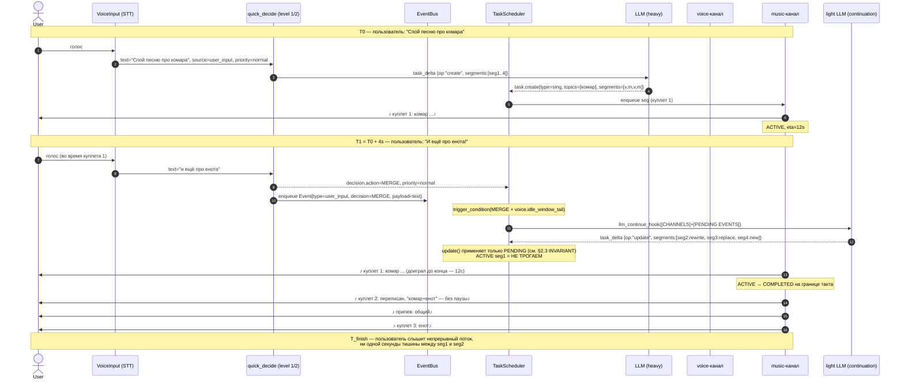
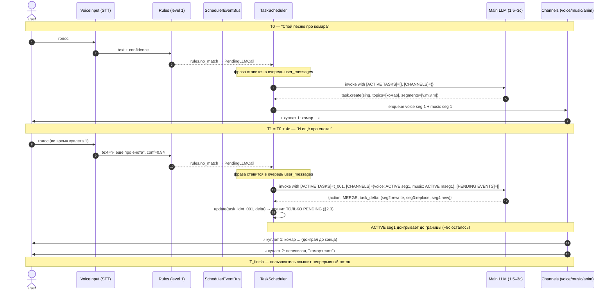

# Scheduler: intent-based execution вместо fire-and-forget

| Поле | Значение |
|------|----------|
| Документ | `docs/design/SCHEDULER_DESIGN.md` |
| Связанное | Issue [#968](https://github.com/krikz/rob_box_project/issues/968) (комментарии [5167924152](https://github.com/krikz/rob_box_project/issues/968#issuecomment-5167924152), [5168761313](https://github.com/krikz/rob_box_project/issues/968#issuecomment-5168761313)), PR #907, #935, ADR-0001 §5 |
| Статус | **Architecture proposal v6** — закрытие open Q3 (владелец `/harness/task_events`) и Q5.1 (рендер AWAITING-вопроса во время активной песни); синхронизация с фактической реализацией фаз 1–4 на develop |
| Автор документа | Architect profile (kanban t_8f5bb012 v1, t_9fca744c v2, t_99da3520 v3, t_85ab3ee1 v4, t_2026-08-04-cfd4 v5, **t_47258be9 v6**) |
| Дата | 2026-08-03 (v1) / 2026-08-03 (v2: §3.3, §4.5, §4.6, §5.5) / 2026-08-03 (v3: §2 расширен AWAITING_CONFIRMATION, §8 Acceptance tool-calling, §11.2 фаза 1.5) / 2026-08-03 (v4: §8.10 Reflex-слой по комментарию 5168761313, две фазы интеграции 1.5 + 2, e2e-сценарии 1–5, Q5–Q7) / 2026-08-04 (v5: §13 G1 ✅ ЗАКРЫТ — fade-out не нужен; §14 Q1+Q2 ✅ ЗАКРЫТЫ — одна LLM без уровня 2; Q5 ✅ ЗАКРЫТ owner'ом — reflex «направо» во время песни ПАРАЛЛЕЛЬНО; §4.7 «Одна LLM, без уровня 2»; Q5.1 открыт архитектору) / **2026-08-12 (v6: §14 Q3 ✅ ЗАКРЫТ — publisher в dialogue_node, §14.1; §14 Q5.1 ✅ ЗАКРЫТ — вариант A'2 (врезка вопроса на границе), §8.11; §12/§13 G2 — batch_complete как фактический сигнал «весь TTS готов» (issues #980/#992); статус реализации фаз 1–4 на develop; исправлены код-ссылки)** |
| Основание | Анализ issue #968 целиком + все 17 комментариев (включая 5167924152 и **5168761313** — reflex-путь в develop-ветке) + аудит текущего кода + пересечение с ADR-0001 §5 |

---

## 0. TL;DR

Между LLM (которая выдаёт `tool_call`) и исполнителями (TTS, музыка, анимация) **нет слоя, который знает про порядок, границы и состояние каналов**. Результат — `stop_music` обгоняет `speak_text`, LLM не знает что TTS ещё играет, пользователь слышит обрубки.

**Решение:** ввести `TaskScheduler` — единая точка прохождения всех `tool_call`-ов и системных событий. Scheduler владеет каналами (voice, music, anim) и сегментами (атомарные единицы исполнения). LLM остаётся «дирижёром»: генерит намерения и видит состояние, scheduler — «оркестр»: исполняет по правилам.

**Ключевой принцип (из итоговой модели, согласовано в #13):** тулы от LLM идут в scheduler мгновенно (LLM не блокируется). Scheduler **не задерживает конструктивные** операции (`speak_text`, `play_animation` — встают в очередь канала), а **задерживает деструктивные** (`stop_music`, REPLACE, cancel) — до естественной границы voice-канала.

**Что УЖЕ есть в коде** (см. §11): вызовы `speak_text` блокируются через `EffectAwaiterRegistry._tts_lock` + `await tts/finished` (`speak_helpers.py` — `_tts_events` dict, `register_tts`, `handle_tts_finished`). С 2026-08-04 по факту решена и проблема «cleanup на первом чанке»: появился сигнал `/voice/tts/batch_complete` — `tts_node` публикует его один раз после **последнего** чанка batch'а (`batch_index == batch_total`), а `dialogue_node` считает активные batch'ы через `_active_batches` (issues #980/#992). То есть половина исходной проблемы #968 уже решена. Осталось: (1) классификация ввода MERGE/REPLACE/QUEUE/IGNORE/CLARIFY до barge-in (блокер П1), (2) сегментная модель + PENDING-правки, (3) speculative pre-generation, (4) единый EventBus для системных событий.

**Что добавлено в v6 (эта ревизия, task t_47258be9):**
- **§14 Q3 ✅ ЗАКРЫТ** — владелец ROS-топика `/harness/task_events`: publisher внутри `dialogue_node` (отдельный node НЕ нужен). Решение и контекст — новый §14.1.
- **§14 Q5.1 ✅ ЗАКРЫТ** — рендер AWAITING-вопроса во время активной песни: выбран **вариант A'2** (врезка короткого вопроса на ближайшей границе voice-сегмента, потом песня продолжается с того же места). Решение и контракт — новый §8.11.
- **§12/§13 G2 обновлены** — фактическим сигналом «весь TTS готов» теперь является `/voice/tts/batch_complete` (issues #980/#992), а не «один finished на speech_id».
- **§11.6 «Статус реализации на develop»** — зафиксировано, что фазы 1–4 (TaskScheduler, AcceptanceGate, EventBus, ReflexLayer, эстиматоры, speculative, action server) уже приземлились в develop; открытым остаётся W7 (интеграция scheduler в `dialogue_node`).
- **Код-ссылки исправлены** на актуальные строки develop (см. §15).

**Что добавлено в v3 (эта ревизия, task t_99da3520, по комментарию 5167924152):**
**Что добавлено в v4 (эта ревизия, task t_85ab3ee1, по комментарию 5168761313):**
- **§8.10 «Reflex-слой: прямые команды без LLM»** — новый раздел: зафиксировано, что в проекте УЖЕ ЕСТЬ reflex-путь `STT → command_parser.py (regex) → command_node.py → Nav2`, минующий LLM. Документ делает его частью архитектуры scheduler'а: reflex — приоритетный источник событий в `SchedulerEventBus` (`source="reflex"`, `priority ∈ {critical, high}`), исполняется мгновенно, LLM уведомляется post-factum через feedback events. Конфликт «reflex vs планировщик»: **reflex всегда побеждает** для команд безопасности («стой»); для команд направления во время песни — каналы независимы, движение исполняется параллельно с продолжением песни.
- **§11.2 acceptance (дополнен)** — 4 новых acceptance-пункта для фазы 1.5 (reflex-интеграция): reflex-команды попадают в `SchedulerEventBus` с правильным приоритетом; «стой» отменяет ВСЕ активные задачи синхронно; «направо» во время песни исполняется параллельно; «стой» во время AWAITING_CONFIRMATION отменяет ожидание без штрафа.
- **§11.3 acceptance (дополнен)** — 1 пункт для фазы 2: полная интеграция `command_node` ↔ `SchedulerEventBus` (подписка reflex на исходящие топики scheduler'а для обновления картины мира — `task.cancelled(reason=reflex_stop)` → не повторять cancel).
- **5 e2e-сценариев reflex-слоя** (§8.10.6) — для автотестов: «спой песню» → «стой!», «едь на кухню» → «направо», «спой песню» → «поверни налево» (параллельно), повторный «стоп» (debounce), «робот, стой» во время fade-out.
- **3 открытых вопроса дизайна (Q5, Q6, Q7)** добавлены в §14, с предложениями архитектора.
- **§15 ссылки** — добавлен комментарий 5168761313 и конкретные файлы в develop-ветке (`core/command_parser.py:110–123`, `command_node.py:258/302/316–324`, `context_aggregator_node.py:284`).

**Что добавлено в v3 (предыдущая ревизия, task t_99da3520, по комментарию 5167924152):**
- **§2.1 + §2.3** — расширение сегментной модели: новые `kind ∈ {nav, mapping, mutate}` и статус `AWAITING_CONFIRMATION` (между `PENDING` и `ACTIVE` для опасных действий). Полная диаграмма переходов с `REJECTED` (timeout/reject).
- **§8 «Acceptance tool-calling»** — новый раздел целиком по предложению автора issue #968: классификация всех тулов из `mcp_server.py:312–375` на три класса (🔴 confirm / 🟡 notify / 🟢 без подтверждения), жизненный цикл AWAITING_CONFIRMATION, сценарий «кухня → зал» как MERGE с подтверждением, safe boundary policy, 8 e2e-сценариев, 4 открытых вопроса дизайна (Q1–Q4).
- **§11.2 (новая фаза 1.5)** — отдельная фаза «Acceptance tool-calling» между MVP и фазой 2, со своим блоком acceptance (11 пунктов, включая property-based тест «stop_navigation никогда не требует confirm»).

**Что добавлено в v2 (предыдущая ревизия, task t_9fca744c):**

- **§3.3** — план перехода от блокирующего `speak_text` к scheduler: блокировка переезжает **внутрь voice-канала**, LLM-цикл перестаёт ждать `tts/finished` (не двойная сериализация, а перенос слоя).
- **§4.5** — scheduler сам инициирует внеочередной LLM-ход после MERGE (триггер «нужен новый task_delta»), не ждёт ни пользователя, ни нового `segment_completed`-тика.
- **§4.6** — mermaid sequenceDiagram полного MERGE-флоу («комар+енот») + каноническая pydantic-сигнатура `quick_decide()` / `QuickDecision`.
- **§5.5** — разрешение коллизии `EventBus` (этот документ, scheduler) vs `SideEffectBus` (ADR-0001 §5, AgentSession): разные домены, **EventBus перенесён в фазу 2** (а не 3), naming — `SchedulerEventBus` локально, чтобы не пересекаться с ADR-0001.

---

## 1. Бизнес-проблема и сценарий

### 1.1 Проблема (verbatim из #968)

LLM вызывает инструменты как «пулемёт»: `speak()`, `play_music()`, `stop_music()` улетают мгновенно, без ожидания. TTS встаёт в очередь, LLM молотит дальше и дёргает `stop_music()` — хотя речь ещё не начала произноситься. Инструменты не синхронизированы.

**Симптомы в e2e (v28–v38):**
- v36: `stop_music()` через 3с после начала рэпа → музыка отвалилась на середине фразы
- v38: cleanup срабатывал на первом TTS-чанке (некорректный сигнал «TTS готов»)
- Костыли (3с-таймер, debounce, «запретить stop_music в промпте») лечат симптом, не корень

**Корень:** между LLM и исполнителями нет планировщика. LLM генерит `tool_call`-ы, они вываливаются на железо в произвольном порядке и темпе.

### 1.2 Целевой сценарий («комар + енот»)

```
Пользователь: "Спой песню про комара"
Робот:        [генерирует и начинает петь, куплет 1]
Пользователь: "И ещё про енота!"        ← во время куплета 1
Робот:        [куплет 1 допевает до конца]
              [куплет 2 уже про енота — без паузы, без тишины]
              [пользователь НЕ слышит разрыва]
```

### 1.3 Зачем это нужно

Робот-ассистент, который не умеет «договаривать» и «вплетать» — это набор костылей вокруг каждого нового сценария. Длинные творческие задачи (рэп, рассказ, обучающий монолог) требуют осознанной координации каналов и состояния. Без планировщика каждая правка — это race-condition hunt по логам.

---

## 2. Сегментная модель

### 2.1 Определения

**Задача (Task)** — намерение пользователя, которое LLM разложила в последовательность действий. Уникальный `task_id`, тип (`sing`, `rap`, `narrate`, `navigate`), параметры (`topics`, `duration_hint`).

**Сегмент (Segment)** — атомарная единица исполнения внутри задачи. Имеет:
- `idx` — порядковый номер
- `kind` — `voice` | `music` | `anim` | `silence` | `nav` | `mapping` | `mutate`
- `payload` — что именно (текст, midi-паттерн, анимация, маршрут, операция над waypoint)
- `status` — `PENDING (live|frozen)` → (`AWAITING_CONFIRMATION`?) → `ACTIVE` → `COMPLETED` / `CANCELLED` / `REJECTED` / `SKIPPED`
  - `PENDING_LIVE` — PENDING-сегмент, до которого LLM **успеет добраться** ответом (см. §6.5 runtime-budget). Доступен для правки через MERGE.
  - `PENDING_FROZEN` — PENDING-сегмент, который LLM уже **не успеет** переписать: prefetch-budget истёк (см. §6.5). Зафиксирован — LLM может его только отменить через REPLACE/CANCEL, не редактировать.
  - Переход `PENDING_LIVE → PENDING_FROZEN` — runtime, дешёвый (один проход по списку сегментов), срабатывает при (а) старте каждого сегмента, (б) обновлении `LLMEstimator.record(latency_ms)`, (в) `task.update()`. См. §6.5 + §14 #5.
  - `AWAITING_CONFIRMATION` — сегмент с физическим/деструктивным действием, ждёт голосового/тач-подтверждения пользователя (см. §8 Acceptance tool-calling); по таймауту → `REJECTED`
- `confirmation` — `required` (true/false) и `timeout_ms` (по умолчанию 20 000) для сегментов с `kind ∈ {nav, mapping, mutate}`
- `eta_ms` — оценка длительности (см. §6)

### 2.2 Пример

```
Песня про комара:
  [seg_1: "куплет про комара"     — ACTIVE,  12с]
  [seg_2: "припев"               — PENDING,  8с]
  [seg_3: "куплет 2 про комара"  — PENDING, 12с]
```

### 2.3 Правила обновления (INVARIANT)

**`update(delta)` модифицирует ТОЛЬКО сегменты со статусом PENDING или AWAITING_CONFIRMATION.** ACTIVE сегмент доигрывает до естественной границы.

Пример MERGE:
```
update("добавь енота"):
  [seg_1: "куплет про комара"     — ACTIVE,  НЕ ТРОГАЕМ]
  [seg_2: "припев про обоих"     — PENDING → переписан]
  [seg_3: "куплет про енота"     — PENDING → заменён]
  [seg_4: "общий финал"          — PENDING → добавлен]
```

**Правила переходов (расширенный инвариант, включая §8):**

```
PENDING ──[confirm ok]──► ACTIVE ──[done]────► COMPLETED
   │                       │
   │                       └──[abort/replace]► CANCELLED
   │
   ├──[requires confirm]─► AWAITING_CONFIRMATION ──[confirm ok]──► ACTIVE
   │                              │
   │                              ├──[reject]────► REJECTED → feedback в LLM
   │                              └──[timeout]───► REJECTED (робот: «отменяю»)
   │
   └──[skip]──────────────────────► SKIPPED
```

- `update()` НЕ трогает `ACTIVE`
- `update()` НЕ отменяет `AWAITING_CONFIRMATION` без явного отказа пользователя (иначе гонка «едь на кухню» → пользователь только начал отвечать, а уже REJECT)
- Сегменты с `kind ∈ {voice, music, anim, silence}` идут сразу `PENDING → ACTIVE` (без подтверждения)
- Сегменты с `kind ∈ {nav, mapping, mutate}` проходят `AWAITING_CONFIRMATION` перед `ACTIVE` (см. §8)

**Этот инвариант — фундамент.** Без него любая правка «на лету» ломает воспроизведение. Покрывается unit-тестом (см. §11.1, §11.2 acceptance).

### 2.4 Почему сегменты, а не «один большой task»

LLM-цикл занимает 1.5–3с. TTS-чанк — 2–5с. Между ними нужна точка синхронизации, которая:
- не блокирует LLM-цикл на синтез (иначе «кома» из дилеммы)
- не позволяет деструктивным операциям обогнать конструктивные
- позволяет правкам применяться к будущему, не к звучащему

Сегмент = минимальная единица, которая:
- имеет чёткую границу (TTS-чанк = предложение, music = такт, anim = ключевой кадр)
- может быть отменена/перезаписана, если ещё не активна
- может быть допита до конца, если уже активна

---

## 3. Каналы (Channels)

### 3.1 Модель

Scheduler владеет набором каналов. **Каждый канал = FIFO-очередь + state-машина**.

| Канал | Содержимое | Граница сегмента | Длительность |
|-------|------------|------------------|--------------|
| `voice` | SSML/текст → TTS | Конец предложения | 1–3с |
| `music` | MIDI-паттерн → audio_node | Конец такта/фразы | 2–4с |
| `anim` | Animation preset | Конец ключевого кадра | 0.5–2с |
| `led` / `expression` | Мимика, свет | Мгновенная | <100мс |

Каналы **независимы** — это критично:
- музыка может играть фоном, пока voice говорит
- анимация может идти параллельно с любым каналом
- `led` всегда исполняется мгновенно (не блокирует)

### 3.2 Что встаёт в очередь vs что исполняется сразу

| Операция | Канал | Поведение |
|----------|-------|-----------|
| `speak_text(t)` | voice | В очередь (FIFO). `speak_text` блокируется до `tts/finished`. |
| `play_sound(name)` | voice (или отдельный `sfx`) | В очередь, блокируется до `sound/ready` |
| `play_animation(preset)` | anim | В очередь |
| `execute_music_code(...)` | music | В очередь, длинный (LONG в терминах async_executor) |
| `stop_music(...)` | music | **НЕ в очередь как обычная команда** — см. §4 |
| `set_vibe_preset(...)` | led/expression | INSTANT, fire-and-forget |
| `set_emotion(...)` | expression | INSTANT, fire-and-forget |

### 3.3 Переход от блокирующего `speak_text` к scheduler

Текущая реализация `speak_text` (блокирующая часть — `speak_helpers.py:184–248`: `_tts_events` dict + `register_tts` + `handle_tts_finished`) делает три вещи в одном `await`:

1. Захватывает `EffectAwaiterRegistry._tts_lock` (`speak_helpers.py:208`, threading.Lock) — взаимное исключение на регистрацию/освобождение TTS-событий.
2. Публикует TTS-заказ в ROS-топик.
3. **Ждёт `tts/finished` для `speech_id`** через `await self._effects._tts_events[speech_id].wait()` — до звучания последнего чанка.

**Это решает гонку `stop_music` ↔ `speak`, но создаёт две новые проблемы:**

- **Двойная сериализация**: один TTS-заказ блокирует и `speak_text`, и весь LLM-цикл. Если LLM выдаёт пять `speak_text` подряд, второй уже не «стоит в очереди» — он **ждёт**, пока предыдущий чанк доиграет, плюс ещё LLM-токены между ходами теряются.
- **Невозможность MERGE во время звучания**: LLM-цикл блокирован, значит обрабатывать новый ввод «и ещё про енота» — нечем. Сценарий «комар+енот» требует живой LLM во время звучания voice.

**Решение (фиксируем в этом документе):** блокировка **не убирается** — она **переезжает внутрь voice-канала**.

```
Сейчас (voice-канал не существует как объект):
  LLM-цикл → speak_text() → effects._tts_lock + _tts_events[sp_id]=Event → ROS topic → await tts/finished → release
                                  ↑ блокирует LLM на 2–5с
                                  (см. speak_helpers.py:184–248)
```
Станет (есть voice FIFO + state-машина):
  LLM-цикл → speak_text() → scheduler.enqueue(voice, seg)          [НЕ блокирует LLM]
                                       ↓
                              voice-канал (FIFO + state)
                                       ↓
                              исполняет сегменты по одному
                                       ↓
                              ВНУТРИ канала: lock по каналу + ждёт tts/finished
                              LLM идёт дальше (следующие tool_calls или system prompt)
```

**Что меняется в коде:**

| Компонент | Было | Станет |
|-----------|------|--------|
| `speak_text` function_tool | `await self._speak_and_wait(text)` | `await self._scheduler.enqueue(channel="voice", seg=Segment(payload=text))` |
| `EffectAwaiterRegistry._tts_lock` | threading.Lock на регистрацию `_tts_events` (`speak_helpers.py:208`) | threading.Lock **только** на исполнителе voice-канала |
| `_tts_events[speech_id]` wait | внутри `speak_text` (блокирует LLM) | внутри voice-канала (блокирует только следующий сегмент своего канала) |
| Backpressure | «speak_text ждёт tts/finished» | «voice-канал возвращает ack сразу, сегменты FIFO-встают, исполнитель разруливает» |

**Что НЕ меняется:**
- Никакой новой логики сериализации нет — блокировка остаётся одна, просто живёт ниже по стеку (в канале).
- `EffectAwaiterRegistry._tts_lock` никуда не девается, его владелец меняется: был у `speak_text`, стал у `voice_channel._play_next()`.
- Поведение `tts/finished` не меняется — те же `speech_id`, тот же счётчик. INSIGHT #7 (один finished на один заказ) сохраняется.

**Почему это НЕ «двойная сериализация»:** слой один — канал. LLM не блокируется ничем; канал сам сериализует свои сегменты. То, что было «блокировкой LLM», становится «FIFO-очередью канала» — это один и тот же механизм сериализации, просто развёрнутый из `await` в `enqueue + drain`.

**Почему это НЕ «race на `_tts_lock`»:** `speak_text` больше не делает `register_tts` напрямую — регистрация события переезжает в voice-канал. LLM-цикл и voice-канал живут в разных корутинах и блокируют разные ресурсы: LLM — собственный ход; канал — собственный исполнитель.

**Критерий перехода (Phase 1 acceptance, дополнительно):**

- [ ] LLM-цикл не делает `await tts/finished` ни в одном пути (grep `await.*tts.*finished` по `dialogue_node.py` — пусто)
- [ ] `voice-канал` имеет собственный `_channel_lock` (вместо бывшего `EffectAwaiterRegistry._tts_lock`)
- [ ] Два подряд `speak_text` от LLM возвращают управление за < 50мс каждый (текущее — 2–5с на вызов)
- [ ] Сценарий «комар+енот» отрабатывает с инвариантом: голос **не** прерывается на середине фразы, новые сегменты встают в очередь до естественной границы

**Обратная совместимость:** до полного перевода всех voice-вызовов через scheduler `EffectAwaiterRegistry._tts_lock` остаётся в `speak_helpers.py` как общий регистрационный лок. Удаление/замена — отдельный PR, не часть Phase 1.

### 3.4 Уже реализовано

В текущем коде (develop, 2026-08-12) механизм `EffectAwaiterRegistry` в `speak_helpers.py` (класс на строке 184, `_tts_events` dict на 207, `register_tts` на 217, `handle_tts_finished` на 241):

```python
# speak_text вызывает (через self._effects):
def _wait_for_tts_finished(self, speech_id: str, timeout: float = 30.0) -> None:
    event = asyncio.Event()
    self._effects.register_tts(speech_id, event)         # speak_helpers.py:217
    try:
        await asyncio.wait_for(event.wait(), timeout=timeout)
    finally:
        self._effects.pop_tts(speech_id)                  # speak_helpers.py:231
# _on_tts_finished (dialogue_node.py:1291) → self._effects.handle_tts_finished(...)
# handle_tts_finished (speak_helpers.py:241) → pop_tts + _release_tts(event.set())
```

Это значит: **основной race «stop_music vs speak» уже частично решён** — потому что пока `speak_text` ждёт `tts/finished`, LLM-цикл не двигается дальше. Проблема остаётся в `execute_music_code` + параллельных вызовах (см. §11.1 acceptance, регресс v36).

**Важно (2026-08-12, issue #980/#992):** «один finished на speech_id» уже НЕ единственный сигнал. `tts_node` публикует `/voice/tts/batch_complete` после последнего чанка batch'а (`batch_index == batch_total`, `_publish_tts_finished` на `tts_node.py:2783`), а `dialogue_node._on_tts_batch_complete` (`dialogue_node.py:1379`) считает `_active_batches` и чистит музыку только когда **все** batch'ы завершены. Это и есть фактический «весь TTS готов» сигнал для планировщика (см. §12, §13 G2).

---

## 4. MERGE / REPLACE / QUEUE / IGNORE / CLARIFY

### 4.1 Решения по новому вводу

Планировщик принимает один из пяти вердиктов на любое событие (пользовательский ввод ИЛИ системное событие):

| Решение | Что делает | Когда |
|---------|-----------|-------|
| **MERGE** | Правка применяется к PENDING-сегментам. ACTIVE не трогается. | «и ещё про енота», `battery_critical` |
| **REPLACE** | Очередь PENDING сбрасывается, новая задача стартует после текущего сегмента. | «хватит, расскажи анекдот», `obstacle_ahead` (critical) |
| **QUEUE** | Текущая задача до конца, новая становится в общую очередь задач. | «а потом спой колыбельную» |
| **IGNORE** | Ничего не делаем. | «угу», кашель, шум, повторный «стоп» |
| **CLARIFY** | Генерим уточняющий вопрос (LLM, короткий). | «про него» (неоднозначная ссылка) |

### 4.2 Двухуровневое решение (< 800мс)

**Уровень 1 — правила (< 50мс):**
- Короткие реплики с союзами («и ещё», «а также», «а потом») → MERGE / QUEUE
- Императивы («хватит», «стоп», «замолчи») → REPLACE
- Шум, междометия, < 2 слов → IGNORE
- `confidence > 0.9` → решение принято, LLM не дёргаем

**Уровень 2 — лёгкая/быстрая LLM (< 800мс):**
- Вызывается только если уровень 1 не уверен
- Structured output: `{decision, task_delta, confidence, reasoning}`
- **Основная (тяжёлая) LLM для этого НЕ вызывается**

**Почему не основная LLM:**
- latency: лёгкая 200–400мс vs тяжёлая 1.5–3с (для MERGE/REPLACE критичны < 800мс)
- стоимость: дёргать дорогую модель на каждый «угу» — расточительно
- простота промпта: классификация из 5 вариантов не требует тяжёлого контекста

**Ограничение на параллельные LLM-вызовы** — rate limit MiniMax (concurrent requests). Планировщик учитывает его при постановке в очередь.

### 4.3 ПРИОРИТЕТЫ СОБЫТИЙ

| Приоритет | Источники | Эффект |
|-----------|-----------|--------|
| `critical` | `obstacle_ahead`, перегрев, потеря сети | REPLACE + сокращение ACTIVE до ближайшей границы |
| `high` | `battery_critical`, «хватит», пользовательский imperative | MERGE-срочный (ввернуть в следующий PENDING) или REPLACE |
| `normal` | голос пользователя, обычные `Hermes`-команды | Стандартный MERGE/REPLACE/QUEUE |
| `low` | шум, междометия, повторы | IGNORE |

`critical > high > normal > low`. Конфликт разрешается по приоритету, при равенстве — по времени поступления.

### 4.4 Разрешение блокера П1 (barge-in vs MERGE)

**Аудит #15 (комментарий 15) выявил блокер:** текущий код (`dialogue_node.py:1731`) при любом новом вводе вызывает `_cancel_run` → `asyncio.CancelledError` → LLM-цикл умирает. А сценарий «комар + енот» требует, чтобы LLM-цикл ЖИЛ и переписывал PENDING-сегменты.

**Решение (фиксируем в этом документе):**

```
новый ввод → уровень 1 (правила) → решение {MERGE|REPLACE|QUEUE|IGNORE|CLARIFY}
                                    ↓
                              если MERGE/QUEUE/CLARIFY:
                                НЕ отменять LLM-цикл
                                событие уходит в scheduler как MERGE/QUEUE/CLARIFY
                                LLM на следующем ходу видит [PENDING EVENTS]
                                и выдаёт task_delta → планировщик правит PENDING
                              если REPLACE:
                                отменить LLM-цикл (barge-in)
                                дождаться завершения ACTIVE-сегмента (≤3с для voice)
                                запустить новую задачу
                              если IGNORE:
                                ничего
```

**Ключевое:** классификация MERGE-vs-REPLACE происходит ДО barge-in. Сейчас этого нет — это и есть блокер сценария «енот».

**Реализация:** заменить прямой вызов `_cancel_run` в триггере нового ввода на:
```python
async def on_new_input(text: str, source: str):
    decision = await quick_decide(text, source)  # уровень 1 + уровень 2
    if decision.action == "REPLACE":
        self._cancel_run(reason="user_replace")
    elif decision.action in ("MERGE", "QUEUE", "CLARIFY"):
        self._scheduler.enqueue_event(Event(
            source=source, type="user_input",
            priority=decision.priority, payload={"text": text, "decision": decision}
        ))
```

### 4.5 Авто-триггер внеочередного LLM-после-MERGE (scheduler self-drives)

**Проблема, найденная при проектировании фазы 2:**

После решения MERGE/QUEUE нужно, чтобы LLM **выдала `task_delta`** (новые/изменённые PENDING-сегменты). Но в аудитории сценария «комар+енот» LLM уже **закончила текущий ход** — она не сидит в цикле и ждёт ввода.

Два тупика:

| Стратегия | Почему не работает |
|-----------|---------------------|
| Ждать следующего пользовательского ввода | MERGE-триггером был системный сигнал (`battery_critical`) или синтез-сегмент завершился — пользователь молчит минуту. PENDING не правятся минуту. |
| Дёргать LLM при каждом `segment_completed` | «Прокси-цикл» сетится на каждое TTS-окончание (каждые 2–5с). LLM говорит «угу, продолжай» — не отвечает. Стоимость API взлетает. |

**Решение (зафиксированное здесь):**

Scheduler имеет собственный триггер «нужен новый LLM-ход», который срабатывает **только** когда выполнены все три условия одновременно:

```
триггер активен ⟺
  1) есть открытая задача с PENDING-сегментами
  AND
  2) есть хотя бы один неприменённый Event/decision
     (MERGE / battery_critical / user_input с CLARIFY)
  AND
  3) канал-voice/music ВЫГЛЯДИТ как требующий продолжения
     (voice: speaking → silence после ACTIVE; ИЛИ
      music: playing, но _last_segment_user_initiated=false И
             `_elapsed_since_last_segment_started > 0.5 × eta)`)
```

**Когда триггер активен** — scheduler вызывает `llm_continue_hook(current_state)`, который:

1. Берёт `[CHANNELS]` + `[ACTIVE TASKS]` + `[PENDING EVENTS]` — те же блоки, что при обычном ходе.
2. Формирует короткий prompt: «продолжи активную задачу, применив pending events».
3. Вызывает **ту же лёгкую LLM**, что и уровень 2 для `quick_decide` — для решений MERGE этого достаточно (нужен только `task_delta` структурно, не свободный текст).
4. Полученный `task_delta` идёт через `scheduler.update(task_id, delta)` → правка PENDING.

**Где НЕ срабатывает (анти-паттерны):**

- Во время ACTIVE voice-сегмента (ещё рано, предыдущие PENDING сами применятся в третьем-четвёртом ходе LLM, если она там была — а теперь триггер заменит этот ход).
- При `priority=low` events (IGNORE / шум).
- При отсутствии PENDING в задаче (нечего дополнять — задача идёт к завершению штатно).

**Связь с MERGE-флоу (§4.4):**

| Шаг | Действие | Кто отвечает |
|-----|----------|--------------|
| 1 | Новый ввод → MERGE | quick_decide уровень 1/2 (§4.2) |
| 2 | MERGE → enqueue в EventBus | scheduler (§5) |
| 3 | **Триггер «нужен LLM-ход» активируется** | **scheduler (§4.5, этот пункт)** |
| 4 | LLM выдаёт task_delta | scheduler вызывает continuation-hook |
| 5 | PENDING-сегменты обновляются | `update()` с инвариантом §2.3 |
| 6 | Исполнение продолжается | channels drain по правилам §3 |

**Шаг 3 — ключевой новый элемент.** Без него цепочка обрывается на шаге 2.

**Критерий приёмки (фаза 2 acceptance, дополнительно):**

- [ ] `battery_critical` во время песни → scheduler инициирует LLM-ход **сам**, не дожидаясь пользователя
- [ ] Сценарий «енот без пользовательского ввода» (внешний таймер `30s без ввода → autosuggest`) → MERGE отрабатывает полностью без участия пользователя
- [ ] Не срабатывает впустую: флаг «неприменённых events + idle voice» ложит только при двух одновременных сигналах (e2e-метрика: auto-trigger fires ≥ 5 раз за прогон, ложных ≤ 1)
- [ ] Использует лёгкую LLM (≤ 800мс), не основную — фиксируется в `LLMEstimator.last_turn_kind`

### 4.6 Визуализация MERGE-флоу и сигнатура `quick_decide`

#### 4.6.1 Mermaid sequenceDiagram — «комар+енот»



**Что показывает диаграмма:**

- **MERGE не отменяет LLM-цикл** (блокер П1 разрешён).
- **`task_delta` приходит от continuation-hook (§4.5), не от пользователя.**
- **ACTIVE `seg1` доживает до границы** (не обрывается на середине).
- **PENDING-сегменты перезаписаны** (rewrite + replace + new, инвариант §2.3).
- **Никакого `_cancel_run`** (сравни с §4.4).
- **`tts/finished` теперь событие канала, не блокировка LLM** (см. §3.3).

#### 4.6.2 Сигнатура `quick_decide`

Уровень 1 (правила) и уровень 2 (лёгкая LLM) сводятся к одной async-функции на входе scheduler'а:

```python
from enum import Enum
from typing import Literal
from pydantic import BaseModel, Field

class Priority(str, Enum):
    CRITICAL = "critical"   # obstacle, перегрев, потеря сети
    HIGH     = "high"       # battery_critical, «хватит»
    NORMAL   = "normal"     # обычный голосовой ввод, Hermes-команды
    LOW      = "low"        # шум, междометия, IGNORE-кандидаты

class Action(str, Enum):
    MERGE   = "MERGE"    # правка PENDING, ACTIVE не трогаем
    REPLACE = "REPLACE"  # сброс PENDING, новая задача после ACTIVE
    QUEUE   = "QUEUE"    # новая задача в очередь задач
    IGNORE  = "IGNORE"   # ничего
    CLARIFY = "CLARIFY"  # уточняющий вопрос

class QuickDecision(BaseModel):
    """Canonical решение quick_decide. То, что уходит в EventBus и в LLM-цикл."""
    action: Action
    priority: Priority
    confidence: float = Field(ge=0.0, le=1.0, description="0..1, от уровня 1 или 2")
    reasoning: str = Field(description="короткое объяснение для логов и feedback")
    task_delta: dict | None = Field(
        default=None,
        description="Если action=MERGE/REPLACE — предложение delta-структуры; "
                    "LLM всё равно валидирует и может переписать. На уровне 1 — None."
    )
    source_level: Literal[1, 2] = Field(description="каким уровнем принято решение")
    elapsed_ms: int = Field(description="фактическое время решения, для метрик")

async def quick_decide(
    text: str,
    *,
    source: str,                         # "user_input" | "battery_monitor" | "hermes" | ...
    active_task: Task | None,            # текущая активная задача (или None)
    rules_engine: RuleEngine,            # уровень 1 (инжектируется)
    light_llm: LightLLMClient | None,    # уровень 2 (опционально, может быть None в тестах)
    clock: Clock,
    timeout_ms: int = 800,
) -> QuickDecision:
    """Двухуровневое решение по новому вводу / системному событию.

    Контракт:
      - Возвращает решение за < 800мс (timeout гарантирует fallback).
      - При timeout — уровень 1 fallback (lowest priority + IGNORE).
      - Не вызывает основную (тяжёлую) LLM — это запрещено архитектурно.
      - Не делает side-effects: только читает active_task + rules_engine + light_llm.
      - Решение идёт в EventBus (см. §5) — не прямо в каналы.
    """
    ...
```

**Где `quick_decide` живёт в коде:**

- Новый модуль `rob_box_voice/scheduler/quick_decide.py` (Phase 1, S — ~150 LOC).
- Уровень 1 — набор правил на `RuleEngine` (YAML-таблица соответствий «паттерн → решение»).
- Уровень 2 — обёртка `LightLLMClient` над существующим MiniMax-провайдером с `temperature=0` и коротким structured-output prompt'ом.
- DI через конструктор (Phase 5 AgentSession подменит wiring, но сигнатура стабильна).

**Тестируемость (Phase 1 acceptance, дополнительно):**

- [ ] `quick_decide` чистая: не имеет сетевых/ROS-зависимостей, тестируется с `FakeClock` + `FakeLightLLM`
- [ ] Возвращает `QuickDecision` со всеми полями; pydantic валидация — на границе scheduler
- [ ] Уровень 1 решает 70% вводов за < 50мс (метрика из логов)
- [ ] Уровень 2 решает за < 800мс (метрика из `LLMEstimator`)
- [ ] `quick_decide("угу") → IGNORE, conf=0.95`
- [ ] `quick_decide("и ещё про енота") → MERGE, conf=0.92`
- [ ] `quick_decide("хватит") → REPLACE, conf=0.88`
- [ ] `quick_decide("а потом спой колыбельную") → QUEUE, conf=0.81`

---

## 4.7 Одна LLM, без уровня 2 (решение ревизии v5)

> **Зафиксировано в v5 (2026-08-04) как закрытие open Q2 (§14 #2).** Первоначальный §4.2 предлагал двухуровневую схему: уровень 1 — правила (< 50мс), уровень 2 — «лёгкая LLM» (< 800мс). После обсуждения с owner'ом отказались от уровня 2 в пользу **одной основной LLM** + правил только на шум.

### 4.7.1 Что было не так с двухуровневой схемой

| Проблема | Почему критично |
|----------|----------------|
| **Доп. latency** | Лёгкая LLM = ещё один RTT (~200мс) поверх основной 1.5–3с. Для MERGE это контр-продуктивно — мы ЗА ускорение, не ЗА. |
| **Двойная стоимость** | Каждый ввод = 2 вызова API. «Угу» отсеится правилами, но «и ещё про енота» пойдёт через обе модели. |
| **Рассинхрон моделей** | Лёгкая модель и основная могут по-разному интерпретировать один и тот же ввод. «А потом спой колыбельную» лёгкая отнесёт к QUEUE, а основная — к MERGE новой темы. Кто прав? |
| **Regex не покрывает MERGE** | Хвост кейсов вроде «добавь енота в куплет» vs «и ещё один анекдот про енота» — это контекст, не паттерн. Любая таблица правил ловит 60–70%, остальное мимо. |
| **Контекст уже есть** | Уровень 2 в исходной схеме получал «текущую задачу + сегменты» — ту же информацию, что видит основная LLM в `[ACTIVE TASKS]` + `[CHANNELS]`. Зачем дублировать? |

### 4.7.2 Новая схема: правила на шум + основная LLM на всё остальное

```
новый ввод
    │
    ▼
┌─────────────────────────────┐
│ Уровень 1 (правила, < 50мс) │  ←  только мусор и явные imperative
└─────────────────────────────┘
    │
    ├─ matched IGNORE (шум, междометия, < 2 слов, повторы) → конец
    │
    └─ нет матча → передаём как user-message в основной LLM-цикл
                          │
                          ▼
                   ┌──────────────────────┐
                   │  Основной LLM-цикл   │  ←  видит [ACTIVE TASKS]+[CHANNELS]
                   │  (1.5–3с)             │      выдаёт {action, task_delta}
                   └──────────────────────┘
                          │
                          ▼
                   QuickDecision или task_delta → scheduler.update()
```

**Уровень 1 теперь — узкий:**

| Триггер | Решение | Примеры |
|---------|---------|---------|
| `len(text.split()) < 2` И нет глагола | `IGNORE` (low) | «угу», «ага», «хм», «ну» |
| ASR confidence < 0.4 | `IGNORE` (low) | неразборчиво |
| Точная копия предыдущего «стоп» в окне 500мс | `IGNORE` (low) | дубль-эхо |
| Императив с модальным глаголом и одним существительным | `REPLACE` (high) | «хватит», «стоп», «замолчи», «отмени» |
| **Никаких regex на союзы/«и ещё»** — это контекстно-зависимо, пусть решает LLM |  |  |

Всё остальное (и «ещё про енота», и «а потом спой колыбельную», и «про него») — единым вызовом основной LLM.

### 4.7.3 Что меняется в коде (сигнатура `quick_decide`)

`quick_decide` (§4.6.2) упрощается:

```python
# Было (v4):
async def quick_decide(text, *, source, active_task,
                       rules_engine, light_llm,  # ← удаляется
                       clock, timeout_ms=800) -> QuickDecision:
    # 1) правила → если match, return
    # 2) light_llm → structured {action, task_delta}
    # 3) на timeout → IGNORE fallback

# Стало (v5):
async def quick_decide(text, *, source, active_task,
                       rules_engine,                # ← только он
                       clock, timeout_ms=50) -> QuickDecision | PendingLLMCall:
    """Решение по новому вводу.

    Возвращает:
      - QuickDecision — если правила решили (только IGNORE или REPLACE-imperative)
      - PendingLLMCall — если решение требует LLM. EventBus ставит фразу
        в очередь user_messages для следующего хода основного цикла.
    """
    ...
```

**Что НЕ меняется:**

- `SchedulerEventBus` остаётся (фаза 2) — через него pending-фразы попадают в LLM-цикл.
- `LLMEstimator` (§6.3) остаётся — он трекает ВСЕ ходы основной LLM, включая «ответ на pending-фразу».
- Авто-триггер внеочередного LLM-после-MERGE (§4.5) остаётся — он зовёт основную LLM (была ошибка: «лёгкую»; теперь уточнено).
- Feedback events блок `[ACTIVE TASKS]` + `[CHANNELS]` (§7.1) — основа, на которой LLM принимает решения. Без них ничего не работает.

### 4.7.4 Что меняется в acceptance (фаза 1 + фаза 2)

**Удаляются из acceptance:**

- ~~`quick_decide` возвращает решение за < 800мс~~ → заменяется на «правила решают мусор за < 50мс»
- ~~`quick_decide("и ещё про енота") → MERGE, conf=0.92`~~ → это уже решает LLM, не unit-тест на правила
- ~~LLMEstimator трекает «`last_turn_kind ∈ {heavy, light}`»~~ → теперь всегда heavy

**Добавляются в acceptance:**

- [ ] Уровень 1 решает шум (`conf < 0.4`, `< 2 слов`, повторы) за < 50мс в ≥ 80% случаев (метрика из логов)
- [ ] Уровень 1 НИКОГДА не решает «и ещё про X», «а потом Y», «про него» — это LLM (unit-тест: фразы с союзами/местоимениями → `PendingLLMCall`)
- [ ] Pending user-message попадает в LLM-цикл в течение ≤ 200мс (метрика: queue latency)
- [ ] LLM с видимым `[CHANNELS]` решает «и ещё про енота» как `MERGE` (e2e «комар+енот» из §0)
- [ ] LLM с видимым `[CHANNELS]` НЕ добавляет пост-амбл при активном voice-канале (см. §7.3)

### 4.7.5 Диаграмма обновлённого MERGE-флоу



**Что изменилось по сравнению с §4.6.1:**

- ❌ Удалён участник `LN: light LLM (continuation)` — теперь это та же `LLM: Main LLM`.
- Участник `QD: quick_decide (level 1/2)` → `R: Rules (level 1)`.
- Добавлен `PendingLLMCall` — мост между правилами и основным LLM-циклом.
- Латентность решения увеличилась с «< 800мс (лёгкая)» до «1.5–3с (основная)» — **но это и есть желаемая латентность, потому что основная LLM и так выдаёт `task_delta`**. Двухуровневая схема добавляла лишний RTT без выигрыша.

---

## 5. EventBus — единая точка входа

### 5.1 Зачем

Из #968, раздел «Источники событий»:
> Триггером для MERGE/REPLACE/QUEUE может быть не только голос пользователя, но и любое системное событие. Робот живёт в среде: батарея, датчики, сообщения от Hermes, таймеры. Планировщик должен обрабатывать все источники одинаково.

### 5.2 Архитектура

```
┌─────────────────┐
│  ROS2 topics    │─────┐
│  /battery/*     │     │
│  /obstacle/*    │     │
│  /hermes/*      │     ▼
└─────────────────┘  ┌──────────┐    ┌─────────────────┐
                     │ EventBus │───▶│  TaskScheduler  │
┌─────────────────┐  │          │    │                 │
│  VoiceInput     │──┤ единая   │    │ - decisions     │
│  STT result     │  │ очередь  │    │ - segments      │
└─────────────────┘  │ событий  │    │ - channels      │
                     └──────────┘    └─────────────────┘
┌─────────────────┐       │                  │
│  Internal hooks │───────┘                  ▼
│  (LLM, Agent)   │              ┌──────────────────────┐
└─────────────────┘              │ ROS topic для монито-│
                                  │ ринга: /harness/    │
                                  │ task_events         │
                                  └──────────────────────┘
```

### 5.3 Формат события

```python
@dataclass
class Event:
    source: str           # "user_input" | "battery_monitor" | "hermes" | "navigation" | "internal"
    type: str             # "speech" | "battery_critical" | "obstacle_ahead" | "merge" | ...
    priority: Priority    # critical | high | normal | low
    payload: dict
    timestamp: float
    correlation_id: str | None  # для связи с активной задачей
```

### 5.4 Где живёт

EventBus — singleton в `dialogue_node` (или новый node `scheduler_node`). Не новый топик — внутренняя шина внутри `dialogue_node` для пользовательских событий, плюс ROS-topic подписчики для внешних (`/battery/*`, `/obstacle/*`, `/hermes/*`).

**Не плодим ROS-нод без нужды** — EventBus живёт в том же процессе, что и `dialogue_node`, общается с внешним миром через ROS-subscriber'ов.

### 5.5 Разрешение коллизии: EventBus vs SideEffectBus (ADR-0001 §5)

**Проблема, найденная при анализе двух документов вместе:** в проекте **два кандидата на «шину эффектов»** с пересекающимися доменами. Если не развести явно — получатся два класса с похожими именами и путаница ответственности.

| Кандидат | Где описан | Домен | Фаза |
|----------|-----------|-------|------|
| **SideEffectBus** | ADR-0001 §5, P1 (после рефакторинга harness) | Канонические *эффекты* LLM: TTS, Sound, LED, TG-reply. Pure decoration of `Effect[T]`, fan-out через `CompositeBus`. | Phase 5 (AgentSession) |
| **EventBus** | этот документ, §5 | Time-ordered *события среды*: `battery_critical`, `obstacle_ahead`, `user_input` (до MERGE/REPLACE). Не «что сделать», а «что произошло во внешнем мире». | Phase 2 (scheduler) |

**Почему нельзя заменить одно другим:**

- **EventBus не заменяет SideEffectBus.** Системные события (`battery_critical`) — это сигналы «изменился мир», а не «сделай TTS». Приводить их к `Effect[T]` — натягивание совы на глобус: `Effect.battery_critical`? что у него `apply()`? SideEffectBus оптимизирован под fan-out к downstream, а не под приоритезацию во времени.
- **SideEffectBus не заменяет EventBus.** SideEffectBus — *порт*, через который `AgentSession` объявляет intent. EventBus — *канал* входящих сигналов от ROS-топиков и STT. Источники SideEffectBus'а — внутри LLM-цикла (skill emit effect). Источники EventBus'а — снаружи (ROS, STT, internal hook). Модели разные.

**Решение (фиксируем здесь и в ADR-0001 follow-up):**

```
┌────────────────────────────────────────────────────────────────────┐
│                       ROS2 topics                                  │
│         /battery/*, /obstacle/*, /hermes/*                       │
└─────────────┬──────────────────────────────────────────────────────┘
              │ (subscriber)
              ▼
       ┌──────────────────┐
       │    EventBus      │  ←  scheduler.EventBus
       │  (this doc §5)   │      time-ordered,
       │                  │      priority, отметки времени,
       │                  │      correlation_id
       └────────┬─────────┘
                │ enqueue Event (user_input|battery|obstacle|...)
                ▼
       ┌──────────────────┐
       │   TaskScheduler  │  ←  этот документ целиком
       │  (channels, ...) │
       └────────┬─────────┘
                │ по итогам решения LLM
                ▼
       ┌──────────────────┐
       │  AgentSession    │  ←  ADR-0001
       │  emits Effect[T] │
       └────────┬─────────┘
                │ dispatch(effect)
                ▼
       ┌──────────────────┐
       │  SideEffectBus   │  ←  ADR-0001 §5
       │  (composite:     │
       │   TTS+Sound+LED  │
       │   +TG-reply)     │
       └────────┬─────────┘
                │ apply()
                ▼
       ROS topics: /tts/*, /audio/*, /led/*, /tg/reply
```

**Контракт разграничения:**

- **EventBus → scheduler** — направление «извне → логика». Событие — факт, не команда.
- **Scheduler → SideEffectBus (через AgentSession)** — направление «логика → наружу». Effect — команда-решение, не факт.
- **Стык**: scheduler после решения формирует `task_delta` → AgentSession применяет его → шлёт `Effect[T]` в SideEffectBus → fan-out.

**Что это меняет в плане фаз (важно):**

- **EventBus ПЕРЕНЕСЁН в фазу 2** (раньше был намечен на фазу 3). Причина: MERGE/REPLACE без EventBus'а — мёртвый код, решения некуда складывать. SideEffectBus остаётся в фазе 5 (AgentSession).
- **Никакого параллельного EventBus в фазе 5.** Когда придёт AgentSession, SideEffectBus не подменяет EventBus и не знает о нём (EventBus — внешний канал, SideEffectBus — внутренний порт).
- **Naming**: класс в scheduler-модуле зовём `SchedulerEventBus` (или просто `EventBus` локально), чтобы не путать с ADR-0001's `SideEffectBus`. Внешние пакеты импортируют явно: `from rob_box_voice.scheduler.event_bus import EventBus` vs `from rob_box_harness.side_effect_bus import SideEffectBus`.

**Что НЕ нужно делать (анти-паттерны):**

- ❌ Переносить обработку `battery_critical` в `SideEffectBus.effect_handlers`. Не-effect, не команда.
- ❌ Пытаться объединить «обе шины» в один класс «Bus». Разные домены, разные lifecycle (EventBus — FIFO, SideEffectBus — port/ABC).
- ❌ Откладывать решение «EventBus есть в фазе 2, SideEffectBus — в фазе 5» до самой фазы 5. Коллизия должна быть закрыта **до** начала фазы 2.

**Критерий приёмки:**

- [ ] В `docs/design/SCHEDULER_DESIGN.md` §11.3 явно указано: EventBus = фаза 2 (а не 3)
- [ ] В `docs/adr/0001-harness-architecture.md` §5 добавлен **follow-up ADR** (или комментарий в §5) со ссылкой на §5.5 этого документа: «EventBus — отдельный домен, scheduler отвечает за приоритезацию системных событий»
- [ ] В `scheduler.py` (новый модуль, Phase 1) класс событийной шины именован `SchedulerEventBus` (а не `EventBus` глобально)
- [ ] При импорте в `dialogue_node.py` ни один путь не создаёт объект `EventBus` поверх `SideEffectBus` (или наоборот) — никакого авто-wiring'а, который мог бы перехватить сообщения чужого домена

**Зависимость ADR-0001 ↔ этот документ:**

```
ADR-0001 (P1)                 SCHEDULER_DESIGN (этот документ, Phase 1-3)
  ↓                                ↓
AgentSession + SideEffectBus    TaskScheduler + SchedulerEventBus
  (порт эффектов)                (канал событий)
                ↘              ↙
                  разные домены, разные фазы
                  (формализовано в §5.5 этого документа)
```

---

## 6. Эстиматоры (SegmentEstimator + LLMEstimator)

### 6.1 Зачем

Из INSIGHT #11 (комментарий 14): **сегменты исполняются ПОКА LLM отвечает**. Время ответа LLM — не «пауза между ходами», а часть бюджета воспроизведения. Без учёта этого сценарий «енот без паузы» умирает на первой же правке:

```
куплет 1 закончился → 5–8 секунд тишины → куплет 2 про енота
```

«Пауза и рестарт», которые задача явно запрещает.

### 6.2 SegmentEstimator

Оценивает длительность конкретного сегмента:

| Канал | Метод | Точность |
|-------|-------|----------|
| `voice` | символы → секунды (есть тул `estimate_tts_duration`, см. v38 в логе) | ±15% |
| `music` | `segments` из `execute_music_code` (бары × 4 бита @ BPM; issue #990) | ±10% |
| `anim` | из preset-манифеста | ±5% |

**Реализация:** планировщик использует тот же механизм, что и существующий тул `estimate_tts_duration`. LLM НЕ обязана вызывать его руками — планировщик сам считает при создании сегмента (см. G5 из аудита #15).

### 6.3 LLMEstimator

EMA по таймингам завершённых ходов (request → response):

```python
class LLMEstimator:
    def __init__(self, default_ms=2500.0, alpha=0.3):
        self._ema_ms = default_ms
        self._alpha = alpha
    
    def record(self, latency_ms: float):
        self._ema_ms = self._alpha * latency_ms + (1 - self._alpha) * self._ema_ms
    
    @property
    def estimate_ms(self) -> float:
        return self._ema_ms
```

- Обновляется после КАЖДОГО хода — runtime-метрика, не промптовая
- Первые N ходов (например, 5) — дефолт 2.5с, дальше самообучение
- Видна в feedback events (§7)

### 6.4 Инвариант очереди

Голосовая очередь не должна опустеть раньше, чем придёт ожидаемый ответ LLM:

```
remaining_voice_time > estimated_llm_latency + tts_synthesis_time + safety_margin
```

Если инвариант нарушается — планировщик делает что-то ДО того, как динамики замолчат (см. §6.5).

### 6.5 Speculative pre-generation и runtime-budget (rev. v5)

**Принцип (зафиксирован owner'ом в v5, см. §14 #5):** нет фиксированного «budget в N секунд». Prefetch-budget — это **runtime-вычисление** на основе `LLMEstimator.estimate_ms` и текущего сегмент-плана. Где в потоке приземлится ответ LLM → какие сегменты к тому моменту ещё PENDING → их LLM может переписать через MERGE; что до точки приземления — уже FROZEN.

**Алгоритм runtime-расчёта:**

```python
def update_live_frozen_flags(task: Task, llm_eta_ms: float, safety_margin_ms: float = 500):
    """
    Граница: первый сегмент, в котором приземлится ответ LLM.
    До него — FROZEN, после — LIVE.
    """
    cumulative_ms = task.active_segment.remaining_ms  # если есть ACTIVE
    boundary_idx = None
    for seg in task.pending_segments:  # в порядке idx
        cumulative_ms += seg.eta_ms
        if cumulative_ms >= llm_eta_ms + safety_margin_ms:
            boundary_idx = seg.idx
            break

    # Помечаем
    for seg in task.pending_segments:
        seg.frozen = (boundary_idx is None) or (seg.idx >= boundary_idx)
```

**Что это даёт (пример):**

| LLM ETA | Сегмент-план | boundary | FROZEN | LIVE |
|---------|--------------|----------|--------|------|
| 2.1с (быстрая) | active=8s, p=[3.2, 3.5, 2.0] | seg_1 (active) | [] | [seg_2, seg_3, seg_4] (3 сегмента MERGE) |
| 5.0с (средняя) | active=8s, p=[3.2, 3.5, 2.0] | seg_2 (на 11.2с) | [seg_1] (но он ACTIVE, не правится) | [seg_3, seg_4] (2 сегмента) |
| 12.0с (медленная) | active=8s, p=[3.2, 3.5, 2.0] | seg_3 (на 14.7с) | [seg_1, seg_2] | [seg_4] (1 сегмент) |
| 20.0с (очень медленная) | active=8s, p=[3.2, 3.5, 2.0] | после всего | [seg_1, seg_2, seg_3, seg_4] | [] (задача доиграет без MERGE) |

**Speculative pre-gen (TTS):**

- **Момент старта:** для сегмента X — когда X становится `boundary_idx` (т.е. до X LLM уже не успеет добраться). Scheduler запускает TTS-синтез X **в фоне** через `InterruptibleTask`.
- **Пришла правка MERGE для FROZEN-сегмента:** незавершённый синтез отменяется через `InterruptibleTask.cancel()` (есть в `async_executor.py:23`), перезапуск по новому плану.
- **Результат:** к моменту, когда X становится ACTIVE, его TTS уже готов — паузы нет.

**Edge case (G3 из аудита #15):** MERGE во время пред-генерации → незавершённый синтез отменяется, перезапуск по новому плану. Покрыть unit-тестом.

**Связь с FROZEN-маркировкой в feedback (§7.1):** LLM видит `REWRITEABLE_SEGMENTS` и понимает свои реальные возможности. Не пытается править FROZEN — бессмысленно.

**Если LLM всё-таки опаздывает:**
- Не тишина! Музыка/ambient продолжается (fill-сегмент)
- Голос молчит до готовности
- В feedback LLM уходит пометка «была пауза Nс из-за моей задержки» — самообучение для `LLMEstimator`

**Что НЕ делаем (анти-паттерны из §13 G4):**
- ❌ Фиксированный `prefetch_budget = N сегментов` (магическое число)
- ❌ Hard/soft cap (защита от жадности) — не нужна, runtime-расчёт самобалансирующийся
- ❌ Prefetch во время idle / для типов `speak`/`reply` (только `sing`/`rap`/`narrate`, см. §14 #5 Q11.2)

### 6.6 Что УЖЕ есть

- `async_executor.py` с классификацией INSTANT/FAST/MEDIUM/LONG и `InterruptibleTask.cancel()` (подтверждено в коде)
- Тул `estimate_tts_duration` (упоминается в v38 логе)

**Что нужно построить:**
- `LLMEstimator` (EMA — простой класс)
- Связка `speculative_pre_gen` с `InterruptibleTask`
- `SegmentEstimator` = обёртка вокруг существующего механизма

---

## 7. Feedback events (что scheduler отдаёт LLM)

Перед каждым ходом LLM видит блок состояния — иначе не знает, что TTS ещё играет (INSIGHT #8 → пост-амбл «Готово! Зачитал тебе...»).

### 7.1 Формат инъекции в LLM (system prompt перед следующим ходом)

```
[ACTIVE TASKS]
- id=t_001, type=sing, topics=["комар","енот"], progress=0.4,
  current="куплет 2/4", eta=45s,
  channels={music: playing, voice: speaking, anim: idle}

[SEGMENT PLAN]                                  # rev. v5: новый блок
- task_id=t_001, type=sing, llm_eta_ms=2100 (n=23)
- ACTIVE:  seg_1 voice "куплет про комара" (remaining=8.0s)
- FROZEN:  seg_2 voice "припев"   (will play at +8.0s, BEFORE LLM response at +2.1s)
- LIVE:    seg_3 voice "куплет 2" (will play at +11.2s, AFTER LLM response)
- LIVE:    seg_4 voice "финал"    (will play at +14.7s, AFTER LLM response)
- LLM_RESPONSE_EXPECTED_AT: +2.1s (during seg_1)
- REWRITEABLE_SEGMENTS: [seg_3, seg_4]          # ← LLM видит что может менять через MERGE
- AT_RISK_ON_REPLACE: [seg_2, seg_3, seg_4]     # ← что уйдёт при REPLACE (все PENDING)

[CHANNELS]
- voice: queue=3 segs, current_seg=seg_2, current_eta=2.1s, last_finished=0.4s ago
- music: queue=1 segs, current_seg=mseg_1, playing_for=12.3s
- anim: queue=0 segs, last=play_animation:wave 0.8s ago

[PENDING EVENTS]
- battery_critical (source=hermes, priority=high): "батарея 12%, скоро еду на базу"

[REFLEX EVENTS]                                 # rev. v5: зафиксировано owner'ом (см. §14 #8)
- 0.4s ago: reflex.stop() → все активные задачи CANCELLED
- 1.2s ago: reflex.move_direction(right) → nav_channel new segment (90° right)

[ESTIMATORS]
- llm_latency_ema: 1850ms (n=23)
- last_turn_latency: 2103ms
```

**Семантика блоков (для LLM):**

- **`[SEGMENT PLAN]`** — активная задача и что с ней. LLM видит:
  - `FROZEN` сегменты — LLM **не** может переписать (prefetch-budget истёк). Можно отменить через REPLACE/CANCEL, нельзя редактировать.
  - `LIVE` сегменты — LLM может править через MERGE.
  - `LLM_RESPONSE_EXPECTED_AT` — где в потоке окажется её ответ (для планирования).
  - `REWRITEABLE_SEGMENTS` — явный список idx-ов, которые LLM может изменить.
  - `AT_RISK_ON_REPLACE` — что исчезнет, если юзер сделает REPLACE (= все PENDING-сегменты, независимо от live/frozen). Полезно для LLM при формулировке «если юзер прервёт, что уйдёт».
  - Блок выводится **только при наличии ACTIVE задачи**; в idle — отсутствует.
- **`[REFLEX EVENTS]`** — последние N=10 reflex-событий за последние 60с (см. §14 #8, owner зафиксировал «да, всегда»).
- **`[CHANNELS]`, `[PENDING EVENTS]`, `[ESTIMATORS]`, `[ACTIVE TASKS]`** — без изменений.

### 7.2 Публикуемые события

```python
task.created(id, type, params)
task.started(id)
task.segment_started(id, seg_idx)
task.segment_completed(id, seg_idx)
task.updated(id, delta)
task.completed(id)
task.cancelled(id, reason)
```

**Куда:**
1. **В контекст LLM** — блок выше, инжектится перед каждым ходом
2. **В ROS2-топик `/harness/task_events`** — для мониторинга (ros2 topic echo, foxglove)
3. **В MemoryStore** — для post-mortem и истории диалогов

### 7.3 Связь с проблемой пост-амбла

INSIGHT #8: LLM добавляет «Готово! Зачитал тебе...» после рэпа. **Это не косметика — это прямое следствие отсутствия feedback.** Если LLM видит `channels={voice: speaking, eta=8s}` на финальном ходе, она не добавляет пост-амбл.

**Acceptance:** «пост-амбл исчезает при активном voice-канале» (unit-тест или e2e-прогон).

---

## 8. Acceptance tool-calling (новый класс тулов: подтверждение пользователя)

> Дополнение к #968 от автора (комментарий 5167924152). Источник истины: текст комментария целиком + классификация тулов из `mcp_server.py:312–375`.

### 8.1 Бизнес-сценарий: навигация с подтверждением

Помимо «музыка/речь» (где важно убрать race) есть класс действий, где нужен **подтверждающий шаг** — робот готовит план, спрашивает пользователя, и только потом исполняет. Это **НЕ блокирующий tool** (LLM не ждёт результата) и **НЕ fire-and-forget** — это **новый статус сегмента `AWAITING_CONFIRMATION`**.

```
Пользователь: "Робот, едь на кухню"
Робот:        [готовит план: маршрут через гостиную, ~15с]
              [говорит: "План: еду на кухню через гостиную, 15 секунд. Подтверждаешь?"]
Пользователь: "Да"
Робот:        [едет на кухню]

Пользователь: "И потом заедь в зал"   ← во время движения
Робот:        [останавливается на безопасной границе]
              [говорит: "Новый план: кухня, потом зал. Подтверждаешь?"]
Пользователь: "Да"
Робот:        [продолжает: кухня → зал]
```

### 8.2 Классификация тулов (по `mcp_server.py:312–375`)

#### 🔴 Требуют подтверждения (физические / деструктивные)

| Тул | Почему | Тип подтверждения |
|-----|--------|-------------------|
| `navigate_to_waypoint` | Робот физически движется | План: маршрут + ETA → «подтверждаешь?» |
| `navigate_to_coordinates` | То же | План: точка + ETA |
| `move_direction` | Движение без явной цели — опасно | «Двигаюсь вперёд 1м. Ок?» |
| `start_mapping` / `continue_mapping` | Долгое физическое действие | «Картирование ~5 мин, буду ездить. Начинаю?» |
| `delete_waypoint` / `clear_waypoints` | Удаление данных | «Удалить waypoint „гараж“?» |
| `save_waypoint` (перезапись существующего) | Перезапись данных | «Заменить waypoint „кухня“?» |

#### 🟡 Мягкое подтверждение (не блокирует, но уведомляет)

| Тул | Почему |
|-----|--------|
| `set_speed` | Изменение поведения — «Скорость 0.5 м/с» (подтверждение = озвучивание, можно отменить голосом «отмени» / «стой») |
| `finish_mapping` / `optimize_map` | Долгая обработка — уведомление о старте, без вопроса |
| `set_dj_mode` / `set_volume` / `set_pitch` | Смена режима — «Включаю DJ-режим» |

#### 🟢 Без подтверждения (read-only / безопасные / аварийные)

| Тул | Почему |
|-----|--------|
| `stop_navigation` | **АВАРИЙНЫЙ СТОП — никогда не блокировать!** Мгновенно в `ACTIVE` |
| `get_*` (pose, status, time, battery, perception, sound_info) | Read-only |
| `list_waypoints` | Read-only |
| `speak_text`, `play_sound`, `play_animation` | Безопасно |
| `memory_*`, `faq_search`, `estimate_tts_duration` | Безопасно |
| `listen_for_response` | Безопасно |
| Все music-тулы (`play_music`, `stop_music`, `set_music_volume`, и т.д.) | Безопасно |

**Золотое правило:** аварийные команды (`stop_navigation`, голосовое «стоп») — мгновенно и без вопросов. Подтверждение только для действий, которые трудно отменить.

### 8.3 Жизненный цикл сегмента с подтверждением

```
PENDING ──[scheduler: requires_confirm=true]──► AWAITING_CONFIRMATION
                                                       │
                          ┌────────────────────────────┼────────────────────────────┐
                          ▼                            ▼                            ▼
                   [user: «да»]                [user: «нет»]              [timeout 20с]
                          │                            │                            │
                          ▼                            ▼                            ▼
                       ACTIVE                      REJECTED                      REJECTED
                  (план применён)             (feedback в LLM,               (робот говорит
                                              робот: «отказы-                  «отменяю, жду
                                              ваю, что дела-                  указаний»)
                                              ем?» → новый
                                              LLM-ход)
```

**Контракт `AWAITING_CONFIRMATION`:**

1. LLM выдаёт `navigate_to_waypoint(кухня)` → scheduler классифицирует тул как 🔴 → ставит сегмент в `AWAITING_CONFIRMATION` (а не сразу `ACTIVE`).
2. Scheduler через voice-канал просит LLM (через feedback event `awaiting_confirmation(plan, eta)`) сгенерировать `speak_text` с формулировкой плана и вопросом.
3. Следующий пользовательский ввод → `quick_decide()` (см. §4) распознаёт «да/нет» как **ответ на подтверждение**, а не как новый task_delta. Маршрут:
   - `CONFIRM` → `AWAITING_CONFIRMATION → ACTIVE`, таймер отменяется
   - `REJECT`  → `AWAITING_CONFIRMATION → REJECTED`, LLM получает `feedback_event: {kind: 'confirmation_rejected', plan: '...', reason: 'user_said_no'}`, LLM перегенерирует план (новый LLM-ход)
   - `TIMEOUT` (20с, конфигурируемо) → `AWAITING_CONFIRMATION → REJECTED`, автогенерация `speak_text("Отменяю, жду указаний")`, плана нет
4. **Параллельный ввод во время ожидания:** новый пользовательский ввод НЕ отменяет AWAITING, а попадает в `quick_decide` для решения: «это ответ на confirm» vs «это новый task_delta» (см. §4.4 + §8.5).

### 8.4 Сценарий «кухня → потом зал» — это MERGE с подтверждением

Ровно MERGE из §4, но для навигации:

1. ACTIVE сегмент «еду на кухню» **НЕ прерывается мгновенно** — робот доезжает до **безопасной границы** (останавливается, см. §8.6).
2. Новый план (кухня → зал) ставится в `AWAITING_CONFIRMATION`.
3. После «да» — продолжение без рестарта: ACTIVE-сегмент возобновляется, новый PENDING-добавляется.

### 8.5 Различие с музыкой — почему здесь подтверждение

| | Музыка/речь | Навигация / mapping / mutate |
|---|---|---|
| Стоимость ошибки | Низкая (переиграть трек) | Высокая (робот в стене, упал со стола, потеря данных) |
| Отменяемость | Легко (`stop_music`) | Трудно (уже поехал / уже удалил) |
| Нужен ли confirm | Нет | **Да** |
| Канал вывода плана | n/a | voice (TTS): «План: ...» |
| Решение на ввод | quick_decide (новый task_delta) | quick_decide (ответ на confirm ИЛИ новый task_delta) |

### 8.6 Безопасная граница (safe stop)

Для навигации «прерывание на полуслове» недопустимо — робот может оказаться посреди комнаты, в дверном проёме, на краю стола. Scheduler при `REPLACE`/`MERGE` на ACTIVE-навигационном сегменте:

1. Шлёт команду `safe_stop` исполнителю навигации (`StopNavigationTool` не делаем, а используем внутренний «приехать к ближайшей безопасной точке маршрута» — это safe sub-goal планировщика).
2. Ждёт `navigation_at_safe_boundary` event (новое событие EventBus, см. §5).
3. Только после этого переводит ACTIVE → CANCELLED и переходит к новому `AWAITING_CONFIRMATION`.

**Параметр `safe_boundary_policy`:** конфигурируемый — `hard` (немедленная остановка с колёс, допустимо только для аварийных `stop_navigation`) / `soft` (доехать до ближайшего waypoint / pre-defined safe point). По умолчанию `soft`.

### 8.7 8 e2e-сценариев (для автотестов и приёмочных прогонов)

| # | Сценарий | Ожидаемое поведение |
|---|----------|---------------------|
| 1 | «Едь на кухню» → «да» | план → confirm → едет → прибыл |
| 2 | «Едь на кухню, потом в зал» → «да» | план с двумя точками → confirm → кухня → зал |
| 3 | «Едь на кухню» (едет) → «и потом зал» → «да» | safe_stop на границе → confirm нового плана → кухня → зал |
| 4 | «Едь на кухню» (едет) → «стой!» | `stop_navigation` мгновенно, БЕЗ подтверждения (🟢 аварийный) |
| 5 | «Начни картирование» → «да» | «буду ездить ~5 мин, начинаю?» → confirm → mapping активен |
| 6 | «Удали waypoint гараж» → «да» | «удалить?» → confirm → waypoint удалён |
| 7 | «Едь на кухню» → (молчит 20с) | таймаут → «отменяю, жду указаний» → сегмент REJECTED |
| 8 | «Едь на кухню» → «нет, в зал» | confirm-rejected → feedback в LLM → LLM перегенерирует план («кухня → зал») → новое AWAITING_CONFIRMATION → «да» → исполнение |

### 8.8 4 открытых вопроса дизайна (требуют решения PM / Author)

#### Q1. Как пользователь подтверждает?

| Канал | Плюсы | Минусы |
|-------|-------|--------|
| **Голос («да»/«ок»)** | Hands-free, естественно для разговора | Требует чёткой работы ASR; шум может ложно матчить |
| **Тач-кнопка на корпусе** | Детерминированно, не зависит от ASR | Нужен физический доступ; не работает на расстоянии |
| **Голос ИЛИ тач** | Лучшее из двух | Два пути кода, две политики приоритета |

**Предложение архитектора:** голос как primary (hands-free), тач как fallback / override. `quick_decide` сначала пытается распознать «да/нет» в голосовом вводе, при отсутствии уверенности (> 0.7 score) — ждёт тач-N секунд. Решение за PM.

#### Q2. Порог опасности — где граница «спросить» vs «сделать»?

| Действие | Класс | Обоснование |
|----------|-------|-------------|
| Физическое движение робота | 🔴 confirm | Трудно отменить, дорогая ошибка |
| Удаление / перезапись данных | 🔴 confirm | Потеря пользовательского контента |
| Изменение поведения (скорость, режим) | 🟡 уведомление | Обратимо, но стоит сказать |
| Read / safe write / аварийные | 🟢 без вопроса | Безопасно или критично по времени |

Предлагаемое правило: **физическое движение + деструктив данных → спросить; остальное → сделать (с уведомлением, если меняется режим)**. Решение за PM.

#### Q3. Повторный вопрос на цепочку

Если пользователь уже сказал «да» на «кухня + зал», а потом говорит «и ещё в спальню» — спрашивать снова или докатывать по цепочке?

**Предложение:** спрашивать снова. План меняется → новый `task_delta` → новый `AWAITING_CONFIRMATION`. Причина: пользователь должен видеть финальный план перед исполнением. Иначе робот сам «додумывает» траекторию, а это против безопасности. Решение за PM.

#### Q4. Таймаут подтверждения

Предложение: **20 секунд, конфигурируемо** (`SchedulerConfig.confirmation_timeout_ms`, default 20 000). По таймауту — REJECTED + автоозвучка «отменяю, жду указаний». Решение за PM.

### 8.9 Связь с другими разделами

- **§2 (Сегментная модель):** `AWAITING_CONFIRMATION` — новый статус; инвариант переходов расширен.
- **§3 (Каналы):** для nav/mapping/mutate вводится **отдельный `nav_channel`** (не voice/music/anim) — со своей очередью и `safe_boundary_policy`.
- **§4 (MERGE/REPLACE/QUEUE/IGNORE/CLARIFY):** классификация ввода для подтверждения добавляет **6-й исход — `CONFIRM`** (или `REJECT`) наряду с пятью существующими; `quick_decide` должен различать «ответ на confirm» и «новый task_delta» (приоритет у ответа на confirm, если сегмент в AWAITING).
- **§5 (EventBus):** новые события — `awaiting_confirmation(plan, eta)`, `confirmation_accepted(seg_id)`, `confirmation_rejected(seg_id, reason)`, `navigation_at_safe_boundary(seg_id)`.
- **§7 (Feedback events):** в LLM-контекст добавляется блок `[AWAITING]` (какие сегменты ждут подтверждения, какой план, сколько секунд прошло).
- **§11 (План реализации):** Acceptance tool-calling — **фаза 1.5** (между MVP и фазой 2) или расширение фазы 1 (см. §11.2).

---

## 8.10 Reflex-слой: прямые команды без LLM

> Дополнение к #968 от автора (комментарий **5168761313**, ветка develop). Источник истины: текст комментария целиком + код в develop (`core/command_parser.py:110–123`, `command_node.py:258/302/316–324`, `context_aggregator_node.py:284`). Суть: в проекте УЖЕ ЕСТЬ параллельный путь для команд безопасности и направления, минующий LLM. Документ делает его частью архитектуры scheduler'а, а не «осадным явлением» в `command_node`.

### 8.10.1 Бизнес-проблема: почему reflex существует

LLM думает 1.5–3с. Для команды «стой!» это **смертельно**: пока LLM-цикл дойдёт до `tool_call(stop_navigation)`, робот успеет врезаться. Аналогично с «направо» / «вперёд» в навигации — пользователь ждёт реакции ≤ 500мс, иначе повторяет (и робот дёргается дважды).

Поэтому в проекте исторически сделано **ДВА независимых пути** от STT до исполнителя:

```
                    ┌─ reflex-путь:   STT → command_parser.py → command_node.py → Nav2    (≤ 500мс, БЕЗ LLM)
вход пользователя ──┤
                    └─ dialog-путь:   STT → dialogue_node → LLM → TaskScheduler → каналы   (1.5–3с, через планировщик)
```

Reflex-путь уже работает в develop-ветке (см. подтверждение в коде ниже) и не должен сломаться при внедрении scheduler'а. Наоборот — scheduler должен **учитывать** reflex как внешний источник событий, а не пытаться его поглотить.

**Что есть в develop:**

- `src/rob_box_voice/rob_box_voice/core/command_parser.py:110–123` — regex-паттерны для `IntentType.NAVIGATE` (строки 110–116) и `IntentType.STOP` (строки 119–121):
  ```python
  (r'(двигайся|иди|поезжай|езжай|катись|двигай)\s+(вперед|вперёд|назад|влево|вправо)', 'direction'),
  (r'^(вперед|вперёд|назад)$', 'direction'),
  (r'(поверни|повернись|развернись)\s+(налево|направо|влево|вправо)', 'turn'),
  (r'^(налево|направо|влево|вправо)$', 'turn'),
  ...
  (r'(стой|стоп|остановись|останови|halt|стоять|хватит|замри)', None),
  (r'(отмени|cancel)\s+(движение|навигацию|задание)', None),
  ```
- `command_node.py:258` — `handle_stop()` отменяет **все** активные Nav2 goals через `/navigate_to_pose/_action/cancel_goal` (CancelGoal service с пустым `GoalInfo`).
- `command_node.py:302–324` — `handle_direction()` маппит направление в координаты (`'налево' = +π/2`, `'направо' = -π/2`, `'вперёд' = +1м`) и шлёт `NavigateToPose` через Nav2 — не напрямую cmd_vel.
- `context_aggregator_node.py:284` — «Команды движения (вперед, назад, налево, направо, стой) НЕ добавляем в память» — **подтверждает**: reflex-команды не участвуют в диалоге.

### 8.10.2 Архитектурное решение: reflex = приоритетный source в EventBus

Предлагаемое место reflex-слоя в архитектуре scheduler'а:

```
┌──────────────┐    ┌─────────────────┐
│   STT/ASR    │────│ command_parser  │─────┐
│  (dialog)    │    │ (regex, <50мс)  │     │
└──────────────┘    └─────────────────┘     │ source="reflex"
                                            ▼
                                     ┌──────────────────┐    ┌─────────────────┐
                                     │  SchedulerEvent  │───▶│  TaskScheduler  │
                                     │       Bus        │    │   (this doc)    │
                                     │  (§5 этого       │    │                 │
                                     │  документа)      │    └─────────────────┘
                                     └────────┬─────────┘             │
                                              ▲                       │ emit
                                              │ source="dialog"       │ task.cancelled
┌──────────────┐    ┌─────────────────┐      │                       │ (reason=reflex_stop)
│   STT/ASR    │────│ dialogue_node   │──────┘                       ▼
│  (reflex)    │    │ (LLM, 1.5–3с)   │                       ROS topic
└──────────────┘    └─────────────────┘                       /harness/task_events
        (на практике — один и тот же STT, разделение по результату command_parser: match → reflex-path, miss → dialog-path)
```

**Контракт:**

1. `command_parser.parse(text)` — это **уровень 0** классификации, существующий ДО `quick_decide` (уровни 1–2, см. §4.2). Если regex совпал — текст уходит в reflex-путь **немедленно**, в LLM не идёт.
2. `command_node` исполняет команду **синхронно** (≤ 500мс для stop, ≤ 1с для direction — это уже отлажено в develop).
3. **Одновременно** `command_node` (или прослойка между ним и scheduler) публикует `Event` в `SchedulerEventBus` с `source="reflex"`, `priority ∈ {critical, high}`, `type ∈ {"stop", "move_direction"}`, `payload={...}`.
4. Scheduler обрабатывает reflex-event:
   - если `priority=critical` («стой») → **REPLACE глобально** для всех каналов навигации, пометка `task.cancelled(reason=reflex_stop)` в feedback
   - если `priority=high` («направо» во время навигации) → новый nav-сегмент **становится первым** в `nav_channel`, текущая задача продолжается до safe boundary, потом REPLACE
   - если `priority=high` («направо» во время песни — не навигация) → каналы независимы (§3.1), nav-сегмент исполняется **параллельно** с voice/music
5. **LLM не вызывается для обработки reflex.** На следующем ходу LLM получает блок в feedback events (см. §7.1):
   ```
   [REFLEX EVENTS]
   - 0.4s ago: reflex.stop() → все активные задачи CANCELLED
   - 1.2s ago: reflex.move_direction(right) → nav_channel new segment (90° right)
   ```

**Это решает блокер П1+ («LLM-цикл блокирует emergency reaction») БЕЗ отмены LLM-цикла как такового** — reflex обходит его стороной.

### 8.10.3 Конфликт reflex vs планировщик: кто побеждает

| Ситуация | Reflex-команда | Что должно произойти | Приоритет |
|----------|----------------|----------------------|-----------|
| Робот поёт песню (voice+music ACTIVE), пользователь: «стой!» (рефлекс) | stop | **ВСЕ каналы → CANCELLED синхронно** (не дожидаясь границ). voice/music гасятся немедленно через `safe_stop` (если движение) или direct cancel (если только voice). | critical — **reflex всегда побеждает** |
| Робот едет на кухню (nav ACTIVE), пользователь: «направо» | direction | ACTIVE nav-сегмент → **safe_stop на границе** → REPLACE на новый план «повернуть направо + продолжить к кухне» | high — reflex важнее, чем текущий nav, но не «аварийный» |
| Робот поёт песню (voice+music ACTIVE, nav IDLE), пользователь: «направо» | direction | **Каналы независимы**: nav-сегмент исполняется параллельно с voice/music (песня не прерывается, движение физически выполняется) | high — но без прерывания ACTIVE каналов |
| Робот в `AWAITING_CONFIRMATION` («кухня?») + nav_channel ACTIVE, пользователь: «стой!» | stop | **nav ACTIVE → B (router)**: AWAITING → REJECTED (reason=reflex_stop) + nav ACTIVE → CANCELLED + voice/music если были → CANCELLED, автоозвучка «Отменяю» | critical — **reflex важнее confirm-flow при наличии движения** |
| Робот в `AWAITING_CONFIRMATION` («кухня?») БЕЗ nav ACTIVE (только фоновая voice/music), пользователь: «стой!» | stop | **нет nav ACTIVE → A (router)**: route в `quick_decide` как «нет» → AWAITING → REJECTED (reason=user_said_no); voice/music **не трогаем** (фоновая песня продолжает играть); LLM получает feedback и перегенерирует план | normal — **спрашиваем что юзер имел в виду**, не cancel'им всё |
| Пользователь сказал «стоп» 3 раза подряд | stop × 3 | Первый → cancel, остальные IGNORE (debounce 500мс) | low — debounce в command_node |

**Главное правило (v5, уточнено):** **reflex всегда побеждает для команд безопасности (`стоп`, `остановись`), НО поведение зависит от наличия физического движения (`nav_channel ACTIVE`)**:
- **nav ACTIVE → B (cancel all)**: «стой» = «прекрати физически опасное действие СЕЙЧАС». Автоозвучка «Отменяю».
- **нет nav ACTIVE → A (route в quick_decide)**: «стой» может означать «не хочу на кухню» (= «нет»); AWAITING отклоняется, остальное не трогаем. LLM-цикл сам разберётся (в §4.7 через PendingLLMCall).

**Лексическое разграничение (важно для имплементации):**
- «нет» / «не надо» / «отмени» (как лексика) → через `quick_decide` → AWAITING REJECTED по `reason=user_said_no`. Других эффектов нет.
- «стой» / «стоп» / «замри» (reflex-маркеры из `command_parser.py`) → через reflex-путь → router выше.

Для команд направления — reflex ВЫПОЛНЯЕТСЯ, но scheduler решает, прерывать ли ACTIVE (для nav — да, для voice/music/anim — нет, каналы независимы).

### 8.10.4 Реализация: минимальная интеграция

Reflex-путь **не переписывается**. Scheduler **подписывается** на публикации `command_node` (через ROS-топик `/reflex/events` или прямой вызов — оба варианта валидны, см. Q6).

**Шаг 1 (фаза 1.5):** добавить в `command_node` строку:
```python
# после успешного исполнения reflex-команды
self.reflex_publisher.publish(ReflexEvent(
    type="stop" if command.intent == IntentType.STOP else "move_direction",
    priority=Priority.CRITICAL if command.intent == IntentType.STOP else Priority.HIGH,
    payload={"command": command.original_text, "intent": command.intent.value, ...},
    timestamp=time.time(),
))
```

**Шаг 2 (фаза 1.5):** `SchedulerEventBus` подписывается на `/reflex/events`. Обработчик:
```python
async def on_reflex_event(event: ReflexEvent):
    if event.priority == Priority.CRITICAL:  # stop
        await scheduler.cancel_all_tasks(reason=f"reflex:{event.type}")
        await scheduler.emit_feedback_to_llm(
            kind="reflex_event", payload=event, force_next_turn=True
        )
    elif event.priority == Priority.HIGH:  # direction
        seg = Segment(
            kind="nav", payload={"direction": event.payload["direction"], "distance": 1.0},
            status="PENDING",  # минует AWAITING_CONFIRMATION (это не «план», а «корректировка»)
        )
        await scheduler.enqueue(channel="nav", seg=seg)
```

**Шаг 3 (фаза 2):** обратная связь — scheduler публикует `task.cancelled(reason=reflex_stop)` В `command_node` (через `/harness/task_events`), чтобы `command_node` не слал повторные cancel'ы Nav2 (которых и так нет после первого stop, но логирование важно для отладки).

**Шаг 4 (фаза 1.5):** `context_aggregator_node.py:284` оставить без изменений — reflex-команды по-прежнему НЕ попадают в память диалога. Решение зафиксировано: «рефлекс не загрязняет контекст LLM».

### 8.10.5 Связь с AWAITING_CONFIRMATION (§8)

`AWAITING_CONFIRMATION` — это **диалоговый** механизм (LLM предложила план → ждём подтверждения). Reflex — это **не диалоговый** механизм (regex распознал → исполнить немедленно).

Когда reflex приходит во время AWAITING:
- `стоп` → AWAITING → REJECTED + `task.cancelled(reason=reflex_stop)` в feedback. Пользователь больше ничего не подтверждает, потому что план отменён.
- `направо` во время AWAITING навигации → см. §8.10.3 (high priority, nav-сегмент встаёт первым, AWAITING продолжает ждать confirm на основной план).

**Q7 (ЗАКРЫТ, rev. v5, owner, см. §14 #9):** считать ли reflex-«стоп» ответом на AWAITING (как «нет»), или это отдельная операция? **Решение: контекстно-зависимый router** (см. §8.10.3 таблица, v5). Reflex **не** зависит от состояния сегментов буквально — он зависит от **наличия физического движения**. Owner-мотивация: «если он в движении — пусть остановится; если не движется — спросить что пользователь имеет в виду».

- `nav_channel ACTIVE` → B (cancel all, reason=reflex_stop, автоозвучка «Отменяю»).
- `nav_channel IDLE` (только AWAITING + фоновая voice/music) → A (route в `quick_decide` как «нет», reason=user_said_no, остальные каналы не трогаем).

Лексическое разграничение: «нет» / «не надо» / «отмени» → `quick_decide` → AWAITING REJECTED; «стой» / «стоп» / «замри» (reflex-маркеры) → router выше.

### 8.10.6 5 e2e-сценариев reflex-слоя

| # | Сценарий | Шаги | Ожидаемое поведение | Reflex в feedback |
|---|----------|------|---------------------|-------------------|
| 1 | «Спой песню» → «стой!» | LLM sing task → ACTIVE voice+music → regex match «стой» → reflex-publisher | Все ACTIVE сегменты → CANCELLED за < 500мс, voice/music прерваны, feedback `task.cancelled(reason=reflex_stop)` | `reflex.stop()` |
| 2 | «Едь на кухню» → «направо» (во время езды) | ACTIVE nav-seg кухня → regex match «направо» | `safe_stop` на ближайшей границе → CANCELLED → новый nav-seg «90° right» → ACTIVE → возобновление маршрута к кухне | `reflex.move_direction(right)` |
| 3 | «Спой песню» → «поверни налево» (во время песни) | ACTIVE voice+music → regex match «налево» | Каналы независимы: voice/music продолжают играть, nav-сегмент «90° left» исполняется параллельно | `reflex.move_direction(left)` (с пометкой `parallel=true`) |
| 4 | «Стоп» × 3 подряд | Первое «стоп» → cancel → дебаунс 500мс → 2-й и 3-й «стоп» | Только первый реально отменяет, остальные IGNORE (debounce в command_node уже есть для ASR-эхо) | только первый `reflex.stop()` |
| 5 | «Робот, стой» во время fade-out | voice fade-out ACTIVE → regex match «стой» | Немедленный stop, fade прерывается (не доигрывает до конца — для stop это норма, для fade-out — допустимо) | `reflex.stop()` |

### 8.10.7 Сценарий «прямо во время активной задачи песни или навигации» (открытый вопрос Q5)

**Q5: «направо» во время песни — выполнить параллельно или проигнорировать?**

| Вариант | Плюсы | Минусы |
|---------|-------|--------|
| **Параллельно (каналы независимы)** | Пользователь получает реакцию мгновенно, физическое движение не блокируется семантикой задачи | Робот поёт и одновременно крутится — может выглядеть странно (но не опасно) |
| **IGNORE во время voice-активной задачи** | Семантически чисто: «робот поёт — не отвлекаем» | Пользователь вынужден ждать конца песни или говорить «стоп» (а это тоже reflex-cancel — противоречие) |
| **REPLACE на новую задачу «двигайся»** | Чистый контракт: одна задача — один план | Уничтожает песню, пользователь не просил её отменять |

**Предложение архитектора: параллельно (каналы независимы).** Основание — §3.1 явно фиксирует, что каналы независимы (`voice`, `music`, `anim` отдельно от `nav`). Если пользователь сказал «робот, спой и едь на кухню» — это будет QUEUE в LLM-пути (после песни поедет). Если сказал «направо» посреди песни — это **не Q для планировщика**, это физическое действие, не отменяющее voice.

**Решение за PM.** До решения Q5 — реализуем параллельно, флаг `parallel_default=true` в `SchedulerConfig`, можно отключить без правки кода.

### 8.10.8 3 открытых вопроса дизайна (Q5, Q6, Q7)

#### Q5. «направо» во время песни — выполнить параллельно или проигнорировать?

См. §8.10.7. **Предложение:** параллельно, каналы независимы. Решение за PM.

#### Q6. Должен ли reflex-слой логироваться в feedback LLM?

| Вариант | Плюсы | Минусы |
|---------|-------|--------|
| **Да, всегда** (reflex event → feedback block) | LLM знает контекст, может корректно завершить фразу («ой, ладно, стоп» вместо «...» в пустоту) | Доп.токены в каждом ходу, но reflex — редкое событие (не «угу») |
| **Нет, только для cancelled-задач** | Минимум шума | LLM не знает о direction-рефлексах, может попытаться «компенсировать» («ах, ты пошёл налево? тогда я...») |
| **Нет вообще** | Простота | LLM продолжает говорить как ни в чём не бывало, выглядит странно для пользователя |

**Предложение архитектора:** **да, всегда** (для всех reflex-events), блок `[REFLEX EVENTS]` в feedback. Стоимость — нулевая (reflex — редкое событие, < 5 в час активного диалога), выгода — LLM не «виснет» в нерелевантном контексте. **Решение за PM.**

#### Q7. Как reflex-команда соотносится с AWAITING_CONFIRMATION?

| Ситуация | Вариант A (reflex как ответ «нет») | Вариант B (reflex как отдельная операция) |
|----------|------------------------------------|------------------------------------------|
| AWAITING(кухня) → «стой» | AWAITING → REJECTED (reason=user_said_no, интерпретируется как ответ на confirm) | AWAITING → REJECTED (reason=reflex_stop), все задачи CANCELLED |
| AWAITING(кухня) → «направо» | «направо» — не «да/нет», IGNORE | Новый nav-seg встаёт первым, AWAITING продолжает ждать confirm на основной план |

**Предложение архитектора:** **вариант B — reflex как отдельная операция, не как ответ на confirm.** Семантически «стой» — это «прекрати всё», а не «я не хочу ехать на кухню» (для второго есть «нет»). Смешение приведёт к багам: «стой» во время AWAITING «спой колыбельную?» отменит ПЛАН ПОЕЗДКИ, но НЕ ОТМЕНИТ ожидание колыбельной — потому что reflex не знает, на какое AWAITING он отвечает.

**Решение за PM.** До решения Q7 — реализуем вариант B (более безопасен по умолчанию).

### 8.10.9 Связь с другими разделами

- **§2 (Сегментная модель):** для nav-сегментов от reflex устанавливается `confirmation.required=false` (это не «план», а «корректировка», подтверждение не нужно).
- **§3 (Каналы):** reflex nav-сегменты идут в `nav_channel` напрямую (минуя очередь AWAITING), для voice/music — каналы независимы.
- **§4 (MERGE/REPLACE/QUEUE/IGNORE/CLARIFY):** reflex — это **отдельный путь принятия решений**, не ещё один вердикт quick_decide. quick_decide остаётся 5-вердиктным для диалогового пути; reflex обходит его полностью.
- **§5 (EventBus):** reflex-events — приоритетный `source` в `SchedulerEventBus` (`source="reflex"`, `priority ∈ {critical, high}`).
- **§7 (Feedback events):** блок `[REFLEX EVENTS]` в LLM-контексте (см. §8.10.2 шаг 5).
- **§11 (План реализации):** reflex-интеграция — **фаза 1.5** (минимальная, чтобы не сломать develop-ветку) + **фаза 2** (полная обратная связь scheduler ↔ command_node).

---

## 8.11 Рендер AWAITING-вопроса во время активной песни (решение Q5.1)

> **Закрыто в v6 (2026-08-12, task t_47258be9).** Вопрос Q5.1 из §14 #7: во время ACTIVE голосовой задачи (sing/rap/narrate) пользователь говорит «едь на кухню» → рождается `AWAITING_CONFIRMATION`. **Как именно робот задаёт вопрос-подтверждение, не убивая песню?**

### 8.11.1 Решение: вариант A'2 — врезка вопроса на границе

Из трёх подвариантов §14 #7 выбран **A'2 (прервать на границе voice-сегмента)**:

> На ближайшей естественной границе voice-сегмента (конец предложения / конец такта / конец TTS-batch'а) в очередь voice-канала **врезается короткий вопрос-план** («План: еду на кухню через гостиную, 15 секунд. Подтверждаешь?»), после ответа пользователя песня **продолжается с того же места** — без рестарта и без паузы.

**Почему не A'1 (inline-merge в TTS):** требует streaming TTS с маркерами — фичи нет в текущем `tts_node` (≈400 LOC новой фичи TTS-движка). Даёт идеальный UX («вопрос — часть куплета»), но это отдельная дорогая работа с неясным ROI для текущих сценариев.

**Почему не A'3 (пост-amble на фоне):** требует второй voice-output ИЛИ ducking в `tts_node`/`audio_node` (≈300 LOC, риск для качества звука, нужен микшер — а микшер мы сознательно не строим, §1 «Чего НЕ хотим»).

**Почему A'2 работает с текущим стеком:**
- Естественная граница voice-сегмента **уже есть** — это `tts/finished` + `tts/batch_complete` (issue #980/#992): voice-канал знает, когда текущий TTS-чанк договорён.
- Врезка = постановка сегмента `kind=voice, priority=awaiting_question` в **голову** FIFO voice-канала (после ACTIVE), не в хвост. Существующий механизм «сегмент в очередь» не меняется — меняется только позиция постановки.
- Песня после вопроса продолжается с того же места: все PENDING-сегменты остаются в очереди, вопрос уходит первым.

### 8.11.2 Контракт врезки

```
voice_channel (ACTIVE: seg_k «куплет 1»)
        │
        ▼  пользователь: «едь на кухню» → quick_decide → CONFIRM-путь
scheduler ставит seg_q (kind=voice, priority=awaiting_question) в голову очереди
        │
        ▼  seg_k доигрывает (естественная граница: batch_complete)
voice_channel исполняет seg_q («План: ... Подтверждаешь?»)
        │
        ├─ «да» → seg_q COMPLETED → очередь продолжается: seg_{k+1} «куплет 2» (без паузы)
        ├─ «нет» → seg_q REJECTED → feedback в LLM → LLM перегенерирует план → новый seg_q
        └─ timeout 20с → seg_q REJECTED → автоозвучка «Отменяю, жду указаний»
```

**Требования к voice-каналу (фаза 1.5):**
- Поддержка приоритетной постановки: `enqueue(channel="voice", seg, at_head=True)` для `priority=awaiting_question`.
- Не более одного `awaiting_question` в очереди одновременно (если уже ждёт — новый ввод уходит в обычный MERGE без confirm, §14 #7 fallback).
- Время врезки ≤ 300мс после границы (метрика на e2e: «куплет 1 → вопрос → куплет 2» без паузы > 300мс не допускается).

**Что НЕ меняется:** ACTIVE-сегмент не прерывается; `update()` по-прежнему трогает только PENDING/AWAITING; музыкальный канал не затрагивается (вопрос — voice-only).

### 8.11.3 Acceptance (дополнение к §11.2)

- [ ] **e2e «кухня во время песни» (сценарий §8.7 #3):** робот поёт куплет 1 → «и потом зал» → куплет 1 доигрывает → вопрос-план («кухня → зал, подтверждаешь?») → «да» → куплет 2 продолжается без рестарта (пауза между куплетом и вопросом ≤ 300мс, метрика на e2e)
- [ ] **unit: voice-канал поддерживает `enqueue(at_head=True)`** для `priority=awaiting_question`
- [ ] **unit: два `awaiting_question` подряд** — второй не врезается, уходит в обычный MERGE без confirm
- [ ] **e2e: timeout 20с** во время песни → вопрос доигран, AWAITING → REJECTED, песня продолжается (без отмены voice-задачи)

---

## 9. Точка интеграции с текущим кодом

### 9.1 Где встаёт scheduler

```
Сейчас:   LLM → tool_call → dialogue_node._execute_tool() → ROS topic
Станет:   LLM → tool_call → TaskScheduler.submit()
                       ↓
              ┌────────┴────────┐
              ▼                 ▼
         EventBus         Segments
              ↓                 ↓
         быстрый слой    каналы (voice/music/anim)
              ↓                 ↓
         decision          FIFO-очередь
              ↓                 ↓
         ROS topics      исполнители (tts_node, audio_node)
```

**Точка входа:** `dialogue_node.py:657` (`speak_text` function_tool) и аналогичные для `execute_music_code`, `stop_music`, `play_sound`, `play_animation`. Планировщик реализует тот же интерфейс, но внутри держит очередь и зависимости.

### 9.2 Что уже есть в коде (повторно, для ясности)

| Компонент | Файл | Статус |
|-----------|------|--------|
| `AsyncToolExecutor` с INSTANT/FAST/MEDIUM/LONG | `async_executor.py:136` | ✅ есть |
| `InterruptibleTask.cancel()` | `async_executor.py:23` | ✅ есть |
| Блокирующий `speak_text` через `_tts_events[speech_id]` + `tts/finished` await | `speak_helpers.py:207–248` (`register_tts`/`handle_tts_finished`) | ✅ есть |
| `_tts_events` dict (speech_id → Event) | `speak_helpers.py:207` (внутри `EffectAwaiterRegistry`) | ✅ есть |
| `_cancel_run` (отмена LLM-цикла при barge-in) | `dialogue_node.py:3309` | ✅ есть, но см. §4.4 |
| `_run_cancelled` flag (проверка в speak_text) | `dialogue_node.py:281` | ✅ есть |

### 9.3 Что нужно построить

| Компонент | Где | Размер |
|-----------|-----|--------|
| `TaskScheduler` (новый класс) | `dialogue_node.py` или отдельный модуль `scheduler.py` | M (~400 LOC) |
| `Segment` + `Task` dataclasses | `scheduler.py` | S (~80 LOC) |
| `Channel` (voice/music/anim FIFO + state) | `scheduler.py` | M (~200 LOC) |
| `EventBus` | `scheduler.py` | S (~100 LOC) |
| `SegmentEstimator` | `scheduler.py` | S (~80 LOC) |
| `LLMEstimator` (EMA) | `scheduler.py` | XS (~30 LOC) |
| Quick-decide уровень 1 (правила) | `scheduler.py` | S (~80 LOC) |
| Quick-decide уровень 2 (лёгкая LLM) | новый модуль или extension | M (~200 LOC) |
| Speculative pre-generation loop | `scheduler.py` | M (~150 LOC) |
| Feedback events в LLM-контекст | `dialogue_node.py` (модификация) | S (~50 LOC) |
| ROS-топик `/harness/task_events` | `scheduler.py` | XS (~30 LOC) |

**Итого:** ~1.4K LOC нового кода, ~50 LOC правки `dialogue_node.py`.

### 9.4 Совместимость с `async_executor`

Scheduler **не дублирует** `async_executor`. Использует его как низкоуровневый исполнитель:

- `speak_text` от LLM → scheduler ставит в voice-очередь → исполнитель через `AsyncToolExecutor` (FAST/MEDIUM) отправляет в tts_node
- `execute_music_code` → scheduler ставит в music-очередь → исполнитель через `LONG`-задачу с `InterruptibleTask`
- `stop_music` → scheduler не «исполняет» как обычную команду — см. §4 (REPLACE-flow)

---

## 10. Альтернативы, которые отвергли

| Альтернатива | Почему нет |
|--------------|-----------|
| Блокирующий tool (LLM ждёт TTS-чанк) | «Кома» робота на 30с, не слышит barge-in |
| Неблокирующий tool (текущий) | Гонки, `stop_music` обгоняет speak |
| Полный event sourcing (хранить каждое событие) | Overkill для робота-ассистента, нет требования к audit trail |
| ROS2 Action Server для TTS | INSIGHT #7 — рабочий вариант, но требует переписать tts_node. Принимаем как **фазу 3** (см. §11.4) |
| Отдельный `scheduler_node` (ROS-нода) | Дополнительный IPC overhead, EventBus проще держать в `dialogue_node` |
| Переписать всё на LangGraph / LangChain | Vendor lock-in, текущий стек — OpenAI Agents SDK + собственный `async_executor` |

---

## 11. План реализации (фазы) и acceptance criteria

### 11.1 Фаза 1 — MVP (1–2 спринта)

**Цель:** убрать race `stop_music` vs `speak` + классификация ввода.

1. Добавить `TaskScheduler` с каналами voice/music/anim (FIFO-очереди).
2. Интегрировать в `speak_text`, `execute_music_code`, `stop_music` (через `dialogue_node.py`).
3. Quick-decide уровень 1 (правила + IGNORE для шума).
4. Feedback events в LLM-контекст (только `[CHANNELS]` — без PENDING EVENTS).
5. **Регресс v36:** `stop_music` после рэпа не обрывает музыку на середине.

**Acceptance (MVP):**
- [ ] `stop_music()` не может ДОЙТИ ДО ЖЕЛЕЗА раньше конца TTS-чанка (порядок гарантирован scheduler'ом)
- [ ] e2e v36, v38 перестают падать
- [ ] Уровень 1 решает MERGE/REPLACE/IGNORE для типовых фраз за < 50мс
- [ ] LLM в каждом ходе видит блок `[CHANNELS]` (queue depth, current, eta)
- [ ] Пост-амбл «Готово! Зачитал тебе...» исчезает при активном voice-канале
- [ ] **Инвариант сегментов (unit test):** `update()` модифицирует ТОЛЬКО PENDING-сегменты, ACTIVE не затрагивается
- [ ] **`speak_text` больше не делает `await tts/finished`** (§3.3): grep по `dialogue_node.py` пуст; voice-канал владеет своим `_channel_lock`
- [ ] **Два подряд `speak_text` возвращают управление за < 50мс каждый** (метрика на e2e-прогоне)

### 11.2 Фаза 1.5 — Acceptance tool-calling (расширение §8)

> Новая фаза, добавленная в ревизии v3 по комментарию 5167924152 (issue #968). Может выполняться параллельно фазе 1 или сразу после неё.

1. Сегменты с `kind ∈ {nav, mapping, mutate}` проходят через `AWAITING_CONFIRMATION` перед `ACTIVE` (см. §8).
2. Классификатор тулов (`ToolConfirmationPolicy`, регистр из `mcp_server.py:312–375`) — pure data, загружается из YAML/JSON, без хардкода в коде.
3. `nav_channel` с параметром `safe_boundary_policy=soft` (по умолчанию).
4. `quick_decide` расширен: 6-й исход `CONFIRM`/`REJECT` при наличии AWAITING-сегмента.
5. Voice-канал используется для формулировки плана (`speak_text` генерируется LLM по feedback event `awaiting_confirmation(plan, eta)`).
6. Таймаут 20с + автоозвучка «отменяю» (конфигурируемо через `SchedulerConfig.confirmation_timeout_ms`).
7. События EventBus: `awaiting_confirmation`, `confirmation_accepted`, `confirmation_rejected`, `navigation_at_safe_boundary` (§5).
8. Блок `[AWAITING]` в feedback events (§7).

**Acceptance (фаза 1.5):**
- [ ] Сегмент `navigate_to_waypoint(кухня)` создаётся в статусе `AWAITING_CONFIRMATION`, а не `ACTIVE` (unit test на классификаторе тулов)
- [ ] Сегмент `stop_navigation` создаётся в статусе `ACTIVE` сразу, минуя AWAITING (🟢 аварийный — unit test)
- [ ] Сегмент `speak_text` создаётся в статусе `PENDING → ACTIVE` без подтверждения (🟢 безопасный — unit test)
- [ ] Пользовательский ввод «да» переводит AWAITING → ACTIVE, таймер отменяется (e2e сценарий 1)
- [ ] Пользовательский ввод «нет» переводит AWAITING → REJECTED, LLM получает feedback event `confirmation_rejected` и перегенерирует план (e2e сценарий 8)
- [ ] Таймаут 20с переводит AWAITING → REJECTED + автоозвучка «отменяю, жду указаний» (e2e сценарий 7; метрика на e2e-прогоне)
- [ ] При ACTIVE-навигации и новом плане: робот доезжает до safe boundary → CANCELLED → новый AWAITING (e2e сценарий 3; safe_boundary_policy=soft)
- [ ] `stop_navigation` во время AWAITING исполняется мгновенно, не дожидаясь confirm (e2e сценарий 4)
- [ ] Параллельный пользовательский ввод во время AWAITING НЕ отменяет AWAITING (race-protection unit test: «едь на кухню» → пользователь начал говорить «да» → `quick_decide` приоритетно интерпретирует как ответ на confirm)
- [ ] Блок `[AWAITING]` присутствует в feedback events, когда есть ожидающие сегменты (unit test на formatter)
- [ ] **Правило аварийного стопа:** классификатор не имеет права вернуть `requires_confirm=true` для `stop_navigation` ни при каких условиях (property-based тест)
- [ ] **(§8.10) Reflex-команды попадают в `SchedulerEventBus` с `source="reflex"` и правильным приоритетом** (unit test: «стой» → `priority=critical`, «направо» → `priority=high`)
- [ ] **(§8.10) Reflex-«стой» отменяет ВСЕ активные задачи синхронно** (e2e сценарий 1 из §8.10.6, метрика latency < 500мс)
- [ ] **(§8.10) Reflex-«направо» во время песни исполняется параллельно** (e2e сценарий 3 из §8.10.6, voice/music продолжают играть)
- [ ] **(§8.10) Reflex-«стой» во время AWAITING_CONFIRMATION отменяет ожидание без штрафа** (e2e: «кухня?» → «стой!» → AWAITING → REJECTED + остальные CANCELLED, автоозвучка «отменяю»)

### 11.3 Фаза 2 — двухуровневое решение + EventBus (с учётом §5.5)

**Важно (§5.5 — разрешение коллизии):** `EventBus` (scheduler) **в фазе 2**, не в 3. `SideEffectBus` (ADR-0001) — в фазе 5. Naming: `SchedulerEventBus` локально.

1. Quick-decide уровень 2 (лёгкая LLM, < 800мс) — реализация `quick_decide()` (§4.6.2).
2. **`SchedulerEventBus` для системных событий** (`/battery/*`, `/obstacle/*`, `/hermes/*`) — НЕ путать с ADR-0001's `SideEffectBus` (§5.5).
3. Приоритеты событий (critical > high > normal > low).
4. Сценарий «батарея»: `battery_critical` → вплетается в PENDING-сегмент.
5. **Решение блокера П1:** MERGE/QUEUE не отменяют LLM-цикл (см. §4.4).
6. **Авто-триггер внеочередного LLM-после-MERGE (§4.5)** — scheduler сам инициирует LLM-ход для получения `task_delta`.
7. **Follow-up запись в ADR-0001 §5** о разграничении EventBus/SideEffectBus (§5.5).

**Acceptance:**
- [ ] Решение по новому вводу (любое из 5) принимается < 800мс
- [ ] «и ещё про енота» во время куплета 1 → куплет 2 переписывается без паузы и рестарта
- [ ] `battery_critical` вплетается в следующий PENDING-сегмент без прерывания ACTIVE
- [ ] **Два MERGE подряд за < 2с (unit test):** оба применяются к PENDING, без конфликта
- [ ] **Приоритеты событий (unit test):** critical (`obstacle`) прерывает песню на границе такта, high (`battery`) вплетается в PENDING без прерывания
- [ ] **e2e «батарея»:** робот поёт → battery_critical → предупреждение в песне → финал → сообщение об уходе на базу (без паузы и рестарта)
- [ ] **Авто-триггер (§4.5):** `battery_critical` без пользовательского ввода провоцирует LLM-ход через scheduler (а не в ответ на юзера)
- [ ] **Класс шины именован `SchedulerEventBus`** (а не `EventBus` глобально) — критерий приёмки §5.5
- [ ] **Никаких обходных импортов `rob_box_harness.side_effect_bus`** в коде scheduler'а и dialogue_node до фазы 5
- [ ] **(§8.10) Полная двусторонняя интеграция `command_node` ↔ `SchedulerEventBus`:** scheduler подписан на `/reflex/events` И публикует `task.cancelled(reason=reflex_stop)` в `/harness/task_events` для подтверждения (e2e: «спой песню» → «стой!» → reflex-cancel → feedback `task.cancelled` → нет повторных cancel от command_node, лог-инспекция)

### 11.4 Фаза 3 — эстиматоры + speculative pre-generation

1. `SegmentEstimator` (обёртка над `estimate_tts_duration` + music/anim метриками).
2. `LLMEstimator` (EMA latency).
3. Speculative pre-gen: пред-синтез TTS сегмента N+1.
4. `InterruptibleTask.cancel()` при правке во время пред-генерации.
5. Fill-сегменты (ambient music) при опоздании LLM.

**Acceptance:**
- [ ] `SegmentEstimator`: точность ±15% (unit test на TTS chars→sec)
- [ ] `LLMEstimator`: EMA обновляется после каждого хода, видна в feedback events
- [ ] Пауза между сегментами при MERGE < 300мс (если LLM уложилась в эстимацию)
- [ ] При опоздании LLM — музыка/ambient продолжается, тишины нет; пометка о паузе в feedback
- [ ] Пред-генерация N+1 отменяется при правке без артефактов (unit test)

### 11.5 Фаза 4 (будущее) — action server + PASTE

1. Перевести `tts_node` на ROS2 Action Server (goal/feedback/result/cancel) — даёт «честный сигнал TTS готов» из коробки (INSIGHT #7).
2. Speculative execution с shadow queue (Microsoft PASTE, arxiv 2603.18897) — для prefetch результатов тулов.
3. Полная замена debounce/таймеров на state-машины каналов.

### 11.6 Статус реализации на develop (2026-08-12)

> Добавлено в v6: фазы 1–4 уже приземлились в develop отдельными PR (см. §15), открыт только W7 — интеграция scheduler'а в `dialogue_node`.

| Фаза | Компонент | Файл в develop | Статус |
|------|-----------|----------------|--------|
| 1 (MVP) | `TaskScheduler` + FIFO-каналы voice/music/anim | `src/rob_box_voice/rob_box_voice/scheduler/task_scheduler.py` | ✅ приземлено (29 тестов) |
| 1.5 (Acceptance) | `AcceptanceGate`, `PendingSegment`, `AWAITING_CONFIRMATION`, `[AWAITING]` formatter | `src/rob_box_harness/rob_box_harness/core/acceptance.py`, `confirmation_policy.py` | ✅ приземлено, встроено в `dialog_core.py` (tool loop) |
| 2 (EventBus + decision) | `EventBus`, `DecisionCoordinator`, two-tier decision | `src/rob_box_voice/rob_box_voice/scheduler/event_bus.py`, `decision.py` | ✅ приземлено |
| 2.5 (Reflex) | `ReflexLayer` (STOP/direction/debounce/metrics) | `src/rob_box_voice/rob_box_voice/scheduler/reflex.py` | ✅ приземлено |
| 3 (Estimators + speculative) | `SegmentEstimator`, `EstimatorQualityTracker`, `SpeculativePreGenerator` | `scheduler/estimator.py`, `quality.py`, `pre_gen.py`, `speculative_executor.py` | ✅ приземлено |
| 4 (Action server + PASTE) | HTTP+JSON action server, PASTE shadow queue, docker sidecar | `src/rob_box_voice/rob_box_voice/action_server/`, `docker/vision/docker-compose.yaml` | ✅ приземлено (ADR-0011 accepted) |
| W7 (интеграция) | Подключение `TaskScheduler` к `speak_text`/`execute_music_code`/`stop_music` в `dialogue_node` | `dialogue_node.py` | ⏳ **открыто** — следующий PR. **Код-точный план: `docs/design/W7_INTEGRATION_PLAN.md` v1.0 (2026-08-13)** — W7a ре-ордеринг батча в `dialog_core.py` (INSIGHT #1: гонка внутри одного ответа LLM), W7b SchedulerToolExecutor, W7c task_events + [ACTIVE TASKS] в LLM-контекст, W7d снятие костылей (_pending_music_cleanup, deferred cleanup, debounce). |

**Вывод для исполнителя:** архитектурные блоки готовы и покрыты unit-тестами; осталась интеграционная работа — «обернуть» function_tool'ы `dialogue_node` в `SchedulerTask` и провести e2e «комар + енот». Решение по AWAITING-рендеру — §8.11 (A'2), по `task_events` — §14.1 (publisher в dialogue_node).

---

## 12. Что уже решено в текущем коде (без scheduler)

Чтобы не строить лишнего — фиксируем, что **уже работает**:

| Проблема из #968 | Где решена | Как |
|------------------|------------|-----|
| `stop_music` обгоняет `speak_text` (race) | `speak_helpers.py` (`handle_tts_finished`, строка 241) | `speak_text` блокируется до `tts/finished` |
| Несколько `speak_text` в одном батче | `speak_helpers.py` (`_tts_lock` + `_tts_events`, строки 207–233) | Сериализуются через регистрацию/освобождение события |
| Cleanup срабатывал на первом чанке (v38) | `tts_node.py` (`_publish_tts_finished`, строка 2783) + `dialogue_node.py` (`_on_tts_batch_complete`, строка 1379) | **`/voice/tts/batch_complete` — один сигнал после ПОСЛЕДНЕГО чанка batch'а** (`batch_index == batch_total`); `_active_batches` считает все незавершённые batch'ы (issue #980/#992) |
| LLM вызывает `speak_text` + `stop_music` подряд | `speak_helpers.py` (wait_for finished) | LLM-цикл не двигается, пока TTS не договорит |

**Что осталось как OPEN issue:**
- LLM не видит состояние каналов → пост-амбл, не знает что TTS играет
- Классификация ввода (MERGE/REPLACE/QUEUE/IGNORE/CLARIFY) до barge-in — **блокер П1**
- Сегментная модель + правка PENDING без прерывания ACTIVE
- Speculative pre-gen для устранения пауз
- ~~Единый EventBus для внешних событий (батарея, препятствия, Hermes)~~ — **закрыто §5.5: `SchedulerEventBus` строится в фазе 2, разведён с ADR-0001 `SideEffectBus`**

---

## 13. Аудит противоречий (по #15) — как разрешены

| # | Тип | Суть | Разрешение |
|---|-----|------|------------|
| **П1** | 🔴 блокер | barge-in убивает LLM-цикл, MERGE требует его жизни | **§4.4** — классификация ДО barge-in. MERGE/QUEUE/CLARIFY не отменяют цикл. REPLACE — отменяет. |
| **П2** | 🔴 | «прервать ACTIVE на естественной границе» — оксюморон | **§4.3** — critical **сокращает** ACTIVE до ближайшей границы (1–4с от момента события), а не «прерывает». Одна формулировка. |
| G1 | 🟡 ✅ закрыт (rev. v5, 2026-08-04) | Кто исполняет fade-out? | **Решение: fade-out НЕ нужен.** Гильотина (`MusicManager.stop_all()` → `Clock.clear()` + OSC `/g_freeAll` на `scsynth`) устраивает. Scheduler отвечает только за **надёжность** — гарантия, что `stop_music` доезжает до синтезатора и срубает **всю** музыку (запланированные ноты в `Clock` и призраки в Group 1). Промежуточный fade вносит сложность без пользы для текущих сценариев. Задача сводится к тому, чтобы `stop_music()` гарантированно доходил до железа и вырубал всё — это уже зона `MusicManager.stop_all()` (`src/rob_box_mcp_tools/rob_box_mcp_tools/tools/music.py:621`). См. запись в §14 #1. |
| G2 | 🟡 ✅ закрыт (rev. v6, 2026-08-12) | Два механизма «TTS готов» | **Фактический сигнал — `/voice/tts/batch_complete`** (issues #980/#992): `tts_node._publish_tts_finished` (`tts_node.py:2783`) публикует `finished` по каждому чанку **с метаданными batch'а** (`batch_id`, `batch_index`, `batch_total`), а `batch_complete` — один раз после последнего чанка. `dialogue_node._on_tts_batch_complete` (`dialogue_node.py:1379`) считает `_active_batches` и чистит музыку только когда все batch'ы завершены. Планировщик использует этот сигнал (см. §3.4, §12). |
| G3 | 🟡 | MERGE во время пред-генерации | **§6.5** — `InterruptibleTask.cancel()` при правке. Покрыть unit-тестом (фаза 3). |
| G4 | 🟡 ✅ закрыт (rev. v5, 2026-08-04) | Prefetch жжёт токены | **§6.5 (v5)** — prefetch-budget не фиксированное число, а runtime-расчёт через `LLMEstimator.estimate_ms`: где в потоке приземлится ответ LLM → какие сегменты к тому моменту PENDING → их LLM может переписать. Prefetch включается только для `task.type ∈ {sing, rap, narrate}` и после ≥1 completed сегмента. FROZEN/LIVE-маркировка сегментов отражается в `[SEGMENT PLAN]` feedback (см. §7.1). См. §14 #5. |
| G5 | 🟡 | `estimate_tts_duration` vs SegmentEstimator | **§6.2** — `SegmentEstimator` = обёртка над существующим механизмом, LLM не вызывает руками. |
| N1 | 🟢 | «мгновенно от LLM» vs «мгновенно на железо» | **§0 + §4.3** — мгновенно в scheduler — ок; мгновенно на железо — нет. Scheduler = буфер. |
| N2 | 🟢 | «stop_music не может исполниться» | **§11.1 acceptance** — «не может ДОЙТИ ДО ЖЕЛЕЗА». |
| N3 | 🟢 | «без паузы» vs «пауза ≤ 2с при 429» | **§4 + edge cases** — норма = без паузы; ошибки API = пауза допустима, фиксируется в feedback. |

---

## 14. Открытые вопросы (для обсуждения с PM/Author #968)

1. ~~**Fade-out (G1)** — какой компонент отвечает? `audio_node` уже умеет?~~ **✅ ЗАКРЫТ (rev. v5, 2026-08-04).** Решение: fade-out не нужен. Гильотина — ок. Scheduler гарантирует только доставку `stop_music` до железа и полную остановку (`MusicManager.stop_all()` в `src/rob_box_mcp_tools/rob_box_mcp_tools/tools/music.py:621` уже делает 3-этапную остановку: плееры → `Clock.clear()` → OSC `/g_freeAll`). Подробности и обоснование — §13 G1.
2. ~~**Лёгкая LLM (уровень 2)** — какой провайдер/модель? Отдельная MiniMax-конфигурация или основная с `temperature=0`?~~ **✅ ЗАКРЫТ (rev. v5, 2026-08-04).** Решение: **уровня 2 нет, остаётся один уровень классификации — основная LLM**. Обоснование:
   - **Latency.** Второй LLM-вызов добавляет +200мс (RTT) к и так 1.5–3с основной. Двухуровневая схема — худшее из двух миров: не быстрее основной (т.к. она всё равно нужна для `task_delta`), и не дешевле (платим за два вызова на каждую фразу).
   - **Рассинхрон.** Две модели на один промпт → две разных интерпретации → баги, которые не воспроизводятся.
   - **Regex/rules не покрывают MERGE.** Любые правила для «и ещё про X» ловят только очевидные случаи (союзы, императивы, шум < 2 слов). Длинный хвост («и ещё один анекдот про енота» vs «добавь енота в куплет») требует понимания контекста — это LLM, а не Python.
   - **Что остаётся.** Уровень 1 (rules, < 50мс) ловит только **явный мусор** (шум, междометия, повторы) → `IGNORE`. Всё остальное → **одним вызовом основной LLM**, которая уже видит активные сегменты и каналы (блоки `[ACTIVE TASKS]` + `[CHANNELS]` из §7.1) и выдаёт `{action, task_delta}` структурно. Подробности см. новый §4.7.

   **Следствие для §4.6.2 (сигнатура `quick_decide`) и §11.3 фаза 2:**
   - `quick_decide` упрощается: `(text, active_task, rules_engine) → QuickDecision | PendingLLMCall`. Если rules решили — возврат; иначе → вернуть маркер `PendingLLMCall`, основной LLM-цикл подхватывает фразу как user-message и сам формирует `task_delta`.
   - Параметр `light_llm: LightLLMClient | None` удаляется из сигнатуры.
   - Acceptance-критерий «`level 2 решает за < 800мс`» заменяется на «правила решают мусор за < 50мс (≥ 50% случаев)», остальное — в основном LLM-цикле.
   - Авто-триггер внеочередного LLM-после-MERGE (§4.5) переписывается на основную LLM, а не на лёгкую.
3. ~~**ROS-топик `/harness/task_events`** — нужен ли владелец (отдельный node) или достаточно publisher'а из `dialogue_node`?~~ **✅ ЗАКРЫТ (rev. v6, 2026-08-12, architect).** Решение: **publisher внутри `dialogue_node`, отдельный node НЕ нужен.** Обоснование и контракт — §14.1.
4. **Совместимость с Phase 5 / ADR-0001 §5** (`AgentSession` + `SideEffectBus`) — ~~был открытый~~ **закрыт §5.5**: `SchedulerEventBus` (фаза 2) и `SideEffectBus` (фаза 5) — разные домены, разные фазы. Требуется follow-up запись в ADR-0001 §5 (см. §11.3 acceptance #7).
5. ~~**Prefetch budget (G4)** — какой лимит «активной задачи» для prefetch? 30с? 60с? Пока задача длиннее N — prefetch крутится, иначе спит.~~ **✅ ЗАКРЫТ (rev. v5, 2026-08-04, owner).** Решение owner'а: **нет фиксированного N секунд**. Prefetch budget — это **runtime-вычисление** на основе `LLMEstimator.estimate_ms` и сегмент-плана.
   - **Мотивация (owner):** «мы эстиматором считаем время и прикидываем, на каком сегменте к нам прилетит ответ от LLM, и тогда мы сможем уже накидывать новые сегменты. Сегментов, которые мы заменим, может быть больше одного».
   - **Принцип:** «где в потоке приземлится ответ LLM → какие сегменты к тому моменту ещё PENDING → их LLM может переписать через MERGE; что до точки приземления — уже FROZEN».
   - **Алгоритм (для §6.5):**
     ```
     LLM начал ход → timestamp t_request_sent
     LLMEstimator.estimate_ms = T_ms → t_response ≈ t_request_sent + T_ms

     для каждого сегмента в порядке [ACTIVE_remaining, PENDING_eta_1, PENDING_eta_2, ...]:
       накапливаем eta пока сумма < T_ms
       первый сегмент, в котором ответ «приземлился» = boundary_segment

     boundary и все ДО него = FROZEN (LLM не успеет переписать)
     все ПОСЛЕ boundary = LIVE (LLM может переписать через MERGE)
     ```
   - **Пример (T=2.1с, seg_1=8с active, seg_2=3.2с, seg_3=3.5с, seg_4=2.0с):** ответ приземлится во время seg_1 → FROZEN=[] (пусто, т.к. seg_1 не PENDING) → LIVE=[seg_2, seg_3, seg_4] (3 сегмента доступны MERGE).
   - **Пример (T=12с, та же очередь):** seg_1+seg_2=11.2 < 12 → seg_3=14.7 > 12 → boundary=seg_3 → FROZEN=[seg_1, seg_2, seg_3] → LIVE=[seg_4] (только 1 сегмент доступен MERGE).
   - **Что меняется в дизайне:**
     - §2.1 — статусы расширяются: `PENDING` имеет атрибут `live | frozen` (или под-статусы `PENDING_LIVE` / `PENDING_FROZEN`).
     - §6.5 — нет магических чисел и cap-ов; budget = runtime-вычисление через `LLMEstimator`.
     - §7.1 — блок `[SEGMENT PLAN]` показывает LLM: где сейчас, что FROZEN/LIVE, `LLM_RESPONSE_EXPECTED_AT`, `REWRITEABLE_SEGMENTS`.
     - §13 G4 — закрыт, см. §6.5 и §7.1.
   - **Реализация (фаза 3):** runtime-расчёт в `Scheduler.update_live_frozen_flags()` вызывается при (а) старте каждого сегмента, (б) получении `LLMEstimator.record(latency_ms)`, (в) `task.update()`. Дешёво — один проход по списку сегментов.
6. ~~**Q5 (reflex, §8.10.7)** — «направо» во время песни: параллельно (по умолчанию) или IGNORE?~~ **✅ ЗАКРЫТ (rev. v5, 2026-08-04, owner).** Решение owner'а: **вариант A — параллельно, всегда**.
   - **Мотивация (owner, дословно):** «робот будет больше похож на человека по поведению — когда он поёт песню и у него занят рот, но он может повернуть направо, то пусть повернёт».
   - **Совместимость с кодом:** уже реализовано в `src/rob_box_voice/rob_box_voice/command_node.py:302` (`handle_direction()` безусловно шлёт `NavigateToPose` через Nav2, не глядя на состояние voice-канала). Scheduler просто **формализует существующее поведение**, не меняет его.
   - **Оставляем escape-hatch через конфиг:** `SchedulerConfig.parallel_during_voice = true` (default). Если в будущем появится сценарий типа «детский режим» — флаг меняется в YAML, не в коде. Runtime-переключение через голос **не предусматриваем** (лишняя поверхность атаки на безопасность).
   - **Анти-паттерны (отвергнуто):**
     - ❌ B (IGNORE во время voice-таска) — ломает существующее поведение, заставляет пользователя ждать конца песни или говорить «стоп» (= cancel = противоречие).
     - ❌ C (REPLACE на «двигайся») — уничтожает песню без явного запроса.
7. ~~**Q5.1 (НОВЫЙ, rev. v5)** — вопрос архитектору: во время ACTIVE голосовой задачи (sing/rap/narrate) пользовательский ввод «едь на кухню» может инициировать `AWAITING_CONFIRMATION`. Как именно отрендерить вопрос-подтверждение?~~ **✅ ЗАКРЫТ (rev. v6, 2026-08-12, architect).** Решение: **вариант A'2 — врезка вопроса на ближайшей границе voice-сегмента** (песня доигрывает текущий сегмент → вопрос-план → ответ → песня продолжается с того же места). Полный контракт, acceptance и «почему не A'1/A'3» — новый §8.11.

   | Подвариант | Описание | Реализуемо сейчас? | Сложность |
   |------------|----------|---------------------|-----------|
   | **A'1. Inline-merge в TTS** | Маркер `kind=awaiting_question` вплетается прямо в SSML, TTS-движок рендерит вопрос частью текущего сегмента. Куплет звучит без разрыва, в припеве — вопрос «подтверждаешь?», дальше — куплет | ❌ нужен streaming TTS с маркерами (нет в текущем `tts_node`) | M (~400 LOC, новая фича TTS-движка) |
   | **A'2. Прервать на границе** | На ближайшей границе voice-сегмента (конец предложения/такта) вставляется короткий вопрос-плана, потом песня продолжается с того же места | ⚠️ возможно с текущим TTS: нужен механизм «врезки» в очередь voice-канала между PENDING-сегментами | S–M (~150 LOC, расширение `voice-канал`) |
   | **A'3. Пост-amble «на фоне»** | Песня не прерывается; LLM через второй voice-output или ducking-эффект говорит вопрос тише/параллельно | ⚠️ нужен второй voice-output ИЛИ ducking текущего (музыка тише, голос сверху) | M (~300 LOC, ducking в `tts_node`/`audio_node`) |

   **До решения:** фаза 1.5 не стартует по сценарию §8.7 #3 («кухня во время песни → MERGE с подтверждением»). В §11.2 acceptance-тест «`stop_navigation` во время AWAITING» остаётся, но голосовой случай временно упрощается: «во время песни → AWAITING не инициируется, фраза пользователя попадает в обычный MERGE без confirm (допустимо для не-физических действий)». Архитектурное решение фиксируется в новом разделе §8.11 дизайна (отдельная задача).
8. ~~**Q6 (reflex, §8.10.8)** — логировать ли reflex-events в LLM feedback?~~ **✅ ЗАКРЫТ (rev. v5, 2026-08-04, owner).** Решение owner'а: **«да, всегда»** — вариант A.
   - **Мотивация (owner, дословно):** «LLM по идее должна знать актуальное состояние, как человек он же видит что у него сработал рефлекс». Иначе LLM продолжает говорить как ни в чём не бывало после «стой!» — рассогласование с реальностью.
   - **Совместимость с кодом:** сейчас reflex-events в LLM-контекст **не передаются вообще** (`command_node.publish_feedback()` отправляет текст в TTS, не в LLM). Это багофича, не фича — закрытие Q6 её исправляет.
   - **Формат блока** (из §8.10.2 шаг 5):
     ```
     [REFLEX EVENTS]
     - 0.4s ago: reflex.stop() → все активные задачи CANCELLED
     - 1.2s ago: reflex.move_direction(right) → nav_channel new segment (90° right)
     ```
   - **TTL и размер:** keep last N=10 событий, drop старше 60с (защита от разрастания контекста при долгом разговоре).
   - **Реализация (фаза 1.5):** ~20 LOC в `feedback_formatter` (расширение существующего форматтера, который уже выдаёт `[CHANNELS]`). Плюс правка `command_node` для публикации в `SchedulerEventBus` (`ReflexEvent`, см. §8.10.4 шаг 1).
   - **Анти-паттерны (отвергнуто):**
     - ❌ B (только cancelled-задачи): LLM не узнаёт о direction-рефлексах и может попытаться «компенсировать» («ах, ты пошёл налево? тогда я...» — ерунда).
     - ❌ C (не логировать): рассогласование модели с реальностью; источник «пост-амбла» после отмены.
9. ~~**Q7 (reflex + AWAITING, §8.10.8)** — reflex-«стоп» это ответ на AWAITING или отдельная операция?~~ **✅ ЗАКРЫТ (rev. v5, 2026-08-04, owner).** Решение owner'а: **контекстно-зависимый router, не фиксированный A/B.**
   - **Мотивация (owner, дословно):** «надо понимать если он слушал "стой" от человека и он в движении, то пусть остановится; если он не движется, то можно спросить что пользователь имеет в виду».
   - **Правила router'а** (вместо фиксированного «reflex всегда побеждает»):
     ```
     reflex.stop() arrived
         │
         ▼
     context_check:
         ├─ nav_channel ACTIVE (есть физическое движение)?
         │     YES → B: cancel all (reason=reflex_stop), автоозвучка «Отменяю»
         │
         └─ нет nav ACTIVE (только AWAITING + voice/music фоновые)?
               YES → A: route в quick_decide как «нет» (reason=user_said_no)
                     → AWAITING → REJECTED
                     → остальные каналы НЕ трогаем
               (фоновая песня продолжает играть)
     ```
   - **Лексическое разграничение «нет» vs «стой»** (важно!):
     - «нет» / «не надо» / «отмени» (как лексика) → через `quick_decide` → AWAITING REJECTED по `reason=user_said_no`
     - «стой» / «стоп» / «замри» (reflex-маркеры из `command_parser.py`) → через reflex-путь → router выше
   - **Что меняется в дизайне:**
     - §8.10.3 таблица: «робот в AWAITING + «стой»» — заменить строку на router-логику.
     - §8.10.5: «reflex ВСЕГДА cancel» уточняется до «reflex cancel в AWAITING — **только при наличии физического движения**; иначе — route в `quick_decide`».
   - **Совместимость с кодом:** `handle_stop()` в [command_node.py:258](src/rob_box_voice/rob_box_voice/command_node.py#L258) уже отменяет ВСЕ Nav2 goals через CancelGoal service (пустой GoalInfo). Router'у остаётся **только проверка** — есть ли nav_channel ACTIVE в момент прихода reflex. Если да — пропускаем; иначе — route в `quick_decide`.
   - **Реализация (фаза 1.5):** ~30 LOC в `SchedulerEventBus.on_reflex_event()` (ветка по `nav_channel_active`).
   - **Анти-паттерн (отвергнуто):**
     - ❌ Фиксированный B (reflex всегда cancel all) — сломанный кейс: юзер в панике говорит «стой» во время фонового чтения памяти, отменяется вся активность без нужды. Owner прямо сказал: «если не движется — спросить что имел в виду».
10. **Канал передачи reflex-events в SchedulerEventBus** — ROS-топик `/reflex/events` (стандартный путь, observability) или прямой вызов Python (быстрее, но менее наблюдаемо)? **Требует решения до старта фазы 1.5. Вопрос адресован аналитику** (после завершения архитектурной фазы и начала разработки прототипа scheduler'а). Зачем отложено: аналитик должен измерить реальный latency-бюджет на работающем scheduler'е (фаза 1.5 в работе) и подтвердить, укладывается ли +5мс от ROS-топика в общий бюджет reflex-cancel (< 500мс, см. §8.10.6 сценарий #1). Если да — выбираем A (топик); если нет — B (прямой вызов).

   **Контекст для аналитика (на момент разбора):**
   - §8.10.4 шаг 1 уже явно предлагает publisher (`self.reflex_publisher.publish(ReflexEvent(...))`) — это вариант A.
   - `command_node` уже использует 3 ROS-топика для исходящих сообщений (`/voice/command/intent`, `/voice/command/feedback`, `/cmd_vel_voice`) — стиль consistent с A.
   - `dialog_harness_node` уже создаёт свой ROS-ноду ([dialog.py:264](src/rob_box_harness/rob_box_harness/harnesses/dialog.py#L264)) — умеет подписываться через `ROS2Transport`.
   - Latency для A в `network_mode: host` внутри одного контейнера ≈ +2–5мс (через DDS round-trip); B (прямой Python-вызов) ≈ +0.1мс, но требует гарантии общего процесса.

   **Критерии выбора для аналитика:**
   - Измерить фактический round-trip `command_node → dialog_harness_node` через `/reflex/events` на прототипе фазы 1.5 (median + p95).
   - Сравнить с медианой round-trip прямого вызова (in-process).
   - Если разница < 10мс и не превышает 5% бюджета 500мс → A.
   - Если разница > 10мс ИЛИ не укладывается в бюджет → B (с оговоркой: гарантия общего процесса + observability через локальный `print` или `self.get_logger()`).

### 14.1 Владелец ROS-топика `/harness/task_events` (решение Q3)

> **Закрыто в v6 (2026-08-12, task t_47258be9).** Вопрос из §14 #3: нужен ли отдельный ROS-node для публикации `task_events` или достаточно publisher'а из `dialogue_node`?

**Решение: publisher внутри `dialogue_node` (или `dialog_harness_node` — там, где живёт scheduler). Отдельный node НЕ создаём.**

**Обоснование:**
1. **Топик — fire-and-forget observability.** `task_events` потребляется только мониторингом (`ros2 topic echo`, foxglove) — это не командный канал с QoS-требованиями. Отдельный node добавил бы lifecycle (spawn/health/restart) без единого потребителя, которому это нужно.
2. **Scheduler уже живёт в диалоговом процессе.** §5.4: EventBus — singleton в `dialogue_node`, «не плодим ROS-нод без нужды». Publisher — просто тонкий адаптер поверх scheduler'а в том же процессе: scheduler вызывает колбэк `on_task_event(evt)` → publisher шлёт `String` в `/harness/task_events`.
3. **Синхронность с источником событий.** События (`task.created`, `task.segment_started`, …) рождаются в scheduler'е. Публикация из того же процесса исключает гонку «событие уже случилось, а publisher ещё не поднялся» и не требует сериализации через DDS для внутренних переходов.
4. **Паттерн уже есть в коде.** `dialogue_node` уже публикует односторонние событийные топики (`/voice/sound/state`, `/voice/dj_mode`, `_publish_music_cleanup` на `dialogue_node.py:3093`). `task_events` publisher — тот же класс (String, QoS 10).

**Контракт (фаза 2, §11.3):**
- Топик: `/harness/task_events`, тип `std_msgs/String`, JSON-payload `{"event": "task.created", "task_id": ..., "ts": ...}`.
- Publisher создаётся в `dialogue_node.__init__` рядом с существующими event-publisher'ами (одна строка), колбэк от scheduler'а регистрируется при старте.
- Никакой новой ROS-ноды, никаких доп. зависимостей в launch-файлах.
- **Исключение:** если в будущем появится второй процесс-потребитель (например, отдельный dashboard-сервис с требованием replay), выносим publisher в отдельный `task_events_bridge` node — но это решение принимается при появлении потребителя, не превентивно (YAGNI).

**Acceptance (дополнение к §11.3):**
- [ ] `ros2 topic echo /harness/task_events` показывает `task.created` после старта задачи (e2e/ручная проверка)
- [ ] grep по launch-файлам: новый node `task_events` НЕ добавлен (нет лишнего процесса)
- [ ] unit: scheduler → колбэк → publisher (mock publisher) — событие доезжает за < 5мс (in-process)

---

## 15. Ссылки

- Issue [#968](https://github.com/krikz/rob_box_project/issues/968) — основная задача (17 комментариев; см. комментарий [5167924152](https://github.com/krikz/rob_box_project/issues/968#issuecomment-5167924152) — источник §8, комментарий [5168761313](https://github.com/krikz/rob_box_project/issues/968#issuecomment-5168761313) — источник §8.10)
- PR #907 — tool loop в `dialog_core.py` (предыдущая итерация, устарело)
- PR #935 — watchdog для музыки (временные фиксы в `dialogue_node`)
- ADR-0001 §5 — `AgentSession[StateT]` + `SideEffectBus` (Phase 5, см. t_c8396602)
- `src/rob_box_mcp_tools/rob_box_mcp_tools/async_executor.py` — `AsyncToolExecutor`, `InterruptibleTask`
- `src/rob_box_voice/rob_box_voice/dialogue_node.py` — `speak_text`, `_cancel_run` (`dialogue_node.py:3309`), `_on_tts_finished` (`dialogue_node.py:1291`), `_on_tts_batch_complete` (`dialogue_node.py:1379`), `_publish_music_cleanup` (`dialogue_node.py:3093`)
- `src/rob_box_voice/rob_box_voice/core/speak_helpers.py` — `EffectAwaiterRegistry` (класс на `speak_helpers.py:184`), `_tts_events` dict (`speak_helpers.py:207`), `register_tts` (`speak_helpers.py:217`), `handle_tts_finished` (`speak_helpers.py:241`)
- `src/rob_box_voice/rob_box_voice/tts_node.py` — публикация `tts/finished` по каждому чанку + `tts/batch_complete` после последнего (`_publish_tts_finished`, `tts_node.py:2783`; issue #980/#992)
- `src/rob_box_voice/rob_box_voice/core/command_parser.py:110–123` — regex-паттерны `IntentType.NAVIGATE` и `IntentType.STOP` (§8.10.1)
- `src/rob_box_voice/rob_box_voice/command_node.py:258` — `handle_stop()` отмена Nav2 goals через CancelGoal service (§8.10.1)
- `src/rob_box_voice/rob_box_voice/command_node.py:302–324` — `handle_direction()` маппинг направлений в NavigateToPose (§8.10.1)
- `src/rob_box_perception/rob_box_perception/context_aggregator_node.py:284` — «Команды движения НЕ добавляем в память» (§8.10.4)

### Внешние источники (INSIGHT #9)

- Zylos Research (apr 2026) — DAG + topological sort для tool scheduling
- Microsoft PASTE (arxiv 2603.18897) — speculative execution с shadow queue
- LiveKit voice-agent docs — barge-in с `interruption_min_words`
- Spring AI issue #5195 — порядок результатов tool_calls = invariant
- LangChain interrupt docs — control-flow vs audio-event масштабы
- Akka actor docs — mailbox = FIFO ordering

---

## Приложение A. Глоссарий

| Термин | Значение |
|--------|----------|
| **Сегмент** | Атомарная единица исполнения (TTS-чанк, музыкальный такт, anim-кадр, nav-сегмент, mapping-job, mutate-op) |
| **Задача** | Намерение пользователя, разложенное LLM в последовательность сегментов |
| **Канал** | FIFO-очередь сегментов одного типа (`voice` / `music` / `anim` / `nav`) |
| **MERGE** | Правка PENDING-сегментов без прерывания ACTIVE |
| **REPLACE** | Сброс очереди, новая задача после текущего сегмента |
| **AWAITING_CONFIRMATION** | Статус сегмента (между PENDING и ACTIVE), когда действие требует подтверждения пользователя (см. §8). По timeout/reject → REJECTED |
| **REJECTED** | Статус сегмента, отклонённого пользователем или по таймауту; feedback в LLM |
| **🔴/🟡/🟢 классы тулов** | Классы по необходимости подтверждения: 🔴 физические/деструктивные (нужен confirm), 🟡 изменения поведения (notify), 🟢 read-only/безопасные/аварийные (без вопроса) |
| **Safe boundary** | Ближайшая точка маршрута, на которой навигация может безопасно остановиться при REPLACE/MERGE (см. §8.6) |
| **Естественная граница** | Конец предложения (voice) / такта (music) / ключевого кадра (anim) / safe boundary (nav) |
| **Speculative pre-generation** | Пред-синтез TTS следующего сегмента до ответа LLM |
| **EventBus** | Единая шина для пользовательских и системных событий (SchedulerEventBus — локально, см. §5.5) |
| **LLMEstimator** | EMA по latency LLM, обновляется после каждого хода |
| **Reflex-слой** | Параллельный путь `STT → command_parser → command_node → Nav2` для команд безопасности и направления, минующий LLM (≤ 500мс). В scheduler'е представлен как `source="reflex"` в `SchedulerEventBus`. Reflex всегда побеждает для команд безопасности («стой!»); для команд направления — каналы независимы (§8.10) |
| **Reflex-event** | `Event(source="reflex", priority ∈ {critical, high}, type ∈ {"stop", "move_direction"})`. Critical (stop) → REPLACE глобально + `task.cancelled(reason=reflex_stop)`. High (direction) → новый nav-сегмент в `nav_channel` (минуя AWAITING_CONFIRMATION), или параллельное исполнение, если активны voice/music |

---

## Приложение B. Связь с текущими задачами

- **t_8f5bb012** (v1 документа) — design proposal для #968, 652 строк, 43 KB
- **t_9fca744c** (v2) — добавил §3.3 (блокировка → voice-канал), §4.5 (auto-trigger после MERGE), §4.6 (mermaid + сигнатура quick_decide), §5.5 (EventBus vs SideEffectBus — закрытие коллизии; EventBus перенесён в фазу 2)
- **t_99da3520** (v3) — §8 Acceptance tool-calling по комментарию 5167924152: новый статус `AWAITING_CONFIRMATION` (§2), классификация всех тулов из `mcp_server.py:312–375` на 🔴/🟡/🟢, сценарий «кухня → зал» как MERGE с подтверждением, safe boundary policy, 8 e2e-сценариев, 4 открытых вопроса дизайна, новая фаза 1.5 (§11.2) с acceptance из 11 пунктов
- **t_85ab3ee1** (v4) — §8.10 Reflex-слой по комментарию 5168761313: зафиксирован параллельный путь `STT → command_parser → command_node → Nav2` (≤ 500мс, без LLM), reflex как приоритетный `source` в `SchedulerEventBus`, контракт «reflex всегда побеждает для безопасности», каналы независимы для direction во время песни, 5 e2e-сценариев, 3 открытых вопроса Q5/Q6/Q7, дополнены acceptance-чеклисты §11.2 (+4 пункта) и §11.3 (+1 пункт)
- **t_2026-08-04-cfd4** (v5, эта ревизия) — **ЗАКРЫТИЕ open questions + новая идея owner'а.** Закрыты: **Q1 (fade-out не нужен, гильотина ок)**, **Q2 (одна LLM без уровня 2 — добавлен §4.7)**, **Q5 (reflex «направо» во время песни — параллельно, owner-мотивация «человеческое поведение»)**. **Новый Q5.1 (открыт архитектору)** — как именно отрендерить AWAITING-вопрос во время активной песни: 3 подварианта **A'1** (inline-merge в TTS / нужен streaming TTS с маркерами, ~400 LOC), **A'2** (прервать на ближайшей границе voice-сегмента, ~150 LOC), **A'3** (пост-amble на фоне через ducking/второй voice-output, ~300 LOC). До решения Q5.1 — фаза 1.5 временно упрощает сценарий «кухня во время песни» → обычный MERGE без confirm (для не-физических действий). Renumber Q6→Q8, Q7→Q9, Q9→Q10 в §14.
- **t_57d67232** — Architect review #933+#935 (предыдущее состояние voice-assistant)
- **t_f919de81** — Architect review фазы 06-harness-p0-finalization
- **t_f0ddd678** — ADR harness (есть ADR-0001, ADR-0009-harness-tts-contract, и др.)
- **t_c8396602** — P1.1: AgentSession + SideEffectBus (Phase 5, ADR-0001 §5) — **коллизия/синергия СНЯТА §5.5 этого документа**

---

*Документ готов к review. После согласования — перевод в раздел docs/adr/ как ADR-0010-scheduler.*