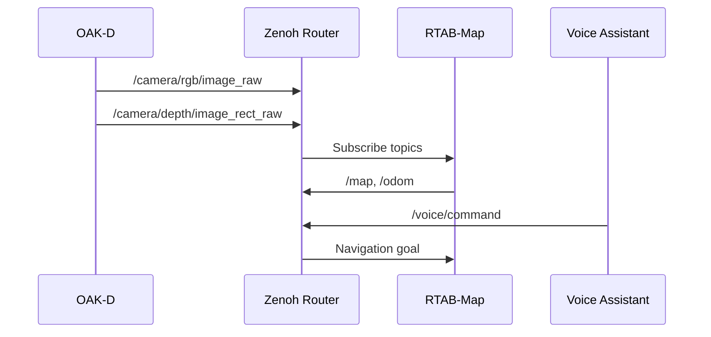

# AI-Assisted Development: Process Review & Improvements

**Дата:** 2025-10-16  
**Аудитор:** AI Agent (GitHub Copilot)  
**Проект:** rob_box_project

---

## 📊 Executive Summary

Проведен аудит процессов разработки с AI ассистентом на основе:
- **GitHub Best Practices** для AI-assisted development
- **Существующая документация:** AGENT_GUIDE.md, CI_CD_PIPELINE.md, DOCKER_STANDARDS.md
- **Текущие процессы:** Git workflow, Docker standards, Secret management

**Результат:** Выявлено **18 областей улучшения** в 5 категориях.

---

## 🎯 Best Practices from GitHub (Baseline)

### Ключевые принципы AI-assisted development:

1. **Set the stage with high-level goal** 🖼️
   - Начинать с описания общей цели
   - Предоставлять контекст перед деталями
   
2. **Make asks simple and specific** 🗨️
   - Разбивать сложные задачи на шаги
   - Генерировать код по одному шагу
   
3. **Give examples** ✍️
   - Показывать желаемый результат
   - Few-shot learning (1-2 примера)
   
4. **Experiment with prompts** 🔬
   - Итеративное улучшение запросов
   - Переформулировка при неудаче
   
5. **Keep relevant tabs open** 📂
   - 1-2 релевантных файла для контекста
   - Neighboring tabs для Copilot
   
6. **Use good coding practices** ✨
   - Описательные имена переменных/функций
   - Консистентный стиль кода
   
7. **Check AI's work** ✅
   - Понимать код перед внедрением
   - Использовать тесты и линтеры
   - Проверка безопасности

---

## 🔍 Анализ текущих процессов

### ✅ Что работает ОТЛИЧНО:

1. **GitHub Actions CI/CD** (⭐⭐⭐⭐⭐)
   - Автоматизация сборки
   - Feature → Develop → Main workflow
   - Image tagging стратегия
   - Auto-merge при успехе

2. **Docker Standards** (⭐⭐⭐⭐⭐)
   - Volumes вместо COPY для конфигов
   - Build optimization guidelines
   - Базовые образы для переиспользования
   - Четкая структура проекта

3. **Secret Management** (⭐⭐⭐⭐⭐)
   - .env.secrets на Pi (не в git)
   - .gitignore защита
   - env_file в docker-compose
   - Документация по созданию

4. **AGENT_GUIDE.md** (⭐⭐⭐⭐)
   - Credentials и SSH доступ
   - Docker workflow инструкции
   - Мониторинг и диагностика
   - CI/CD workflow описание

---

## 🚨 Области для улучшения

### Категория 1: 📚 Documentation for AI Agents

#### 1.1 Отсутствие "Context Map" для AI

**Проблема:**  
AI агент не знает какие файлы открывать для контекста при разных задачах.

**Best Practice:**  
"Keep 1-2 relevant tabs open" - GitHub рекомендует предоставлять релевантный контекст.

**Решение:**  
Создать `docs/development/AI_CONTEXT_MAP.md`:

```markdown
# AI Context Map - Какие файлы открывать для разных задач

## Задача: Изменение Docker конфигурации

**Файлы для контекста:**
1. `docker/vision/docker-compose.yaml` или `docker/main/docker-compose.yaml`
2. `docs/development/DOCKER_STANDARDS.md`
3. `docs/development/AGENT_GUIDE.md` (секция Docker)

## Задача: Добавление нового сервиса

**Файлы для контекста:**
1. `docs/development/DOCKER_STANDARDS.md` (секция "Workflow для добавления нового сервиса")
2. Похожий Dockerfile (например, `docker/vision/oak-d/Dockerfile`)
3. `docker/vision/docker-compose.yaml` или `docker/main/docker-compose.yaml`

## Задача: Фикс Voice Assistant

**Файлы для контекста:**
1. `docker/vision/voice_assistant/Dockerfile`
2. `docker/vision/docker-compose.yaml` (секция voice-assistant)
3. `src/rob_box_voice/rob_box_voice/*_node.py` (проблемная нода)
4. `docker/vision/config/voice/voice_assistant.yaml`

## Задача: CI/CD изменения

**Файлы для контекста:**
1. `.github/workflows/build-vision-services.yml` (или соответствующий)
2. `docs/CI_CD_PIPELINE.md`
3. `docs/development/AGENT_GUIDE.md` (секция CI/CD)
```

**Приоритет:** ⭐⭐⭐⭐⭐ КРИТИЧЕСКИЙ

---

#### 1.2 Нет примеров "хороших запросов" к AI

**Проблема:**  
Пользователь не знает как формулировать запросы эффективно.

**Best Practice:**  
"Give examples" - показывать желаемый результат.

**Решение:**  
Добавить в `AGENT_GUIDE.md` секцию **"Примеры эффективных запросов к AI"**:

```markdown
## 🎯 Примеры эффективных запросов к AI Agent

### ❌ ПЛОХО (vague):
"Почини voice assistant"

### ✅ ХОРОШО (specific + context):
"Voice assistant на Vision Pi падает с ошибкой ModuleNotFoundError: nav2_msgs. 
Проверь docker/vision/voice_assistant/Dockerfile, добавлен ли пакет ros-humble-nav2-msgs 
в секцию apt-get install. Если нет - добавь его."

---

### ❌ ПЛОХО (too complex):
"Сделай чтобы камера работала с rtabmap и publishила в zenoh и чтобы все логи были видны"

### ✅ ХОРОШО (step-by-step):
1. "Проверь что oak-d контейнер публикует топики /camera/rgb/image_raw и /camera/depth/image_rect_raw"
2. "Проверь что zenoh-router видит эти топики: curl http://localhost:8000/@/local/subscriber"
3. "Проверь что rtabmap подписан на эти топики: docker logs rtabmap | grep 'Subscribed to'"

---

### ✅ ОТЛИЧНО (with examples + desired outcome):
"В launch файле voice_assistant_headless.launch.py нужно добавить новую ноду command_node.
Пример существующей ноды:
```python
Node(
    package='rob_box_voice',
    executable='audio_node',
    name='audio_node',
    output='screen',
    parameters=[config_file],
    respawn=True,
    respawn_delay=2.0
)
```
Добавь аналогичную для command_node с respawn_delay=5.0"
```

**Приоритет:** ⭐⭐⭐⭐ ВЫСОКИЙ

---

#### 1.3 Отсутствие "Troubleshooting Checklist" для AI

**Проблема:**  
AI агент не знает стандартную последовательность диагностики проблем.

**Best Practice:**  
"Break down complex tasks" - разбивать на шаги.

**Решение:**  
Создать `docs/development/AI_TROUBLESHOOTING_CHECKLIST.md`:

```markdown
# AI Troubleshooting Checklist

## Docker Container не запускается

1. [ ] Проверить статус: `docker ps -a | grep <service>`
2. [ ] Посмотреть логи: `docker logs <service> --tail 100`
3. [ ] Проверить зависимости: `depends_on` в docker-compose.yaml
4. [ ] Проверить healthcheck: `docker inspect <service> | grep Health`
5. [ ] Проверить ресурсы: `docker stats <service>`
6. [ ] Проверить volumes: `docker inspect <service> | grep Mounts`
7. [ ] Проверить network: `docker inspect <service> | grep NetworkMode`

## ROS Node падает

1. [ ] Проверить логи ноды: `ros2 node list`, `ros2 node info <node>`
2. [ ] Проверить топики: `ros2 topic list`, `ros2 topic info <topic>`
3. [ ] Проверить параметры: `ros2 param list <node>`
4. [ ] Проверить импорты: grep "import" в коде ноды
5. [ ] Проверить установлены ли зависимости в Dockerfile
6. [ ] Проверить environment variables: `docker exec <container> printenv`

## GitHub Actions сборка падает

1. [ ] Открыть Actions: https://github.com/krikz/rob_box_project/actions
2. [ ] Найти failed workflow
3. [ ] Развернуть failed step
4. [ ] Найти ERROR/FAILED в логах
5. [ ] Проверить изменения в Dockerfile
6. [ ] Проверить dependencies в requirements.txt или apt-get
7. [ ] Проверить syntax errors в docker-compose.yaml
```

**Приоритет:** ⭐⭐⭐⭐ ВЫСОКИЙ

---

### Категория 2: 🔧 Code & Configuration Standards

#### 2.1 Нет линтеров и форматтеров в CI/CD

**Проблема:**  
AI генерирует код который может не соответствовать стилю проекта.

**Best Practice:**  
"Use automated tests and tooling to check Copilot's work"

**Решение:**  
Добавить в GitHub Actions:
- **Python:** `black`, `flake8`, `mypy`
- **YAML:** `yamllint`
- **Dockerfile:** `hadolint`
- **Shell:** `shellcheck`

Пример `.github/workflows/lint.yml`:

```yaml
name: Lint Code

on: [push, pull_request]

jobs:
  python-lint:
    runs-on: ubuntu-latest
    steps:
      - uses: actions/checkout@v3
      - uses: actions/setup-python@v4
        with:
          python-version: '3.10'
      - run: pip install black flake8 mypy
      - run: black --check src/
      - run: flake8 src/ --max-line-length=120
      - run: mypy src/ --ignore-missing-imports
  
  yaml-lint:
    runs-on: ubuntu-latest
    steps:
      - uses: actions/checkout@v3
      - run: yamllint -c .yamllint.yml .
  
  dockerfile-lint:
    runs-on: ubuntu-latest
    steps:
      - uses: actions/checkout@v3
      - uses: hadolint/hadolint-action@v3.1.0
        with:
          dockerfile: docker/*/Dockerfile
```

**Приоритет:** ⭐⭐⭐⭐ ВЫСОКИЙ

---

#### 2.2 Нет pre-commit hooks

**Проблема:**  
Проблемы обнаруживаются только после пуша в GitHub Actions.

**Best Practice:**  
"Check AI's work" - валидация до коммита.

**Решение:**  
Добавить `.pre-commit-config.yaml`:

```yaml
repos:
  - repo: https://github.com/psf/black
    rev: 23.10.0
    hooks:
      - id: black
        language_version: python3.10
  
  - repo: https://github.com/PyCQA/flake8
    rev: 6.1.0
    hooks:
      - id: flake8
        args: [--max-line-length=120]
  
  - repo: https://github.com/adrienverge/yamllint
    rev: v1.33.0
    hooks:
      - id: yamllint
  
  - repo: https://github.com/shellcheck-py/shellcheck-py
    rev: v0.9.0.6
    hooks:
      - id: shellcheck
```

Инструкция для разработчиков:

```bash
# Установка
pip install pre-commit
pre-commit install

# Запуск вручную
pre-commit run --all-files
```

**Приоритет:** ⭐⭐⭐⭐ ВЫСОКИЙ

---

#### 2.3 Нет coding style guide

**Проблема:**  
AI не знает предпочтения стиля кода проекта.

**Best Practice:**  
"Use good coding practices" - консистентный стиль.

**Решение:**  
Создать `docs/development/CODING_STYLE.md`:

```markdown
# Coding Style Guide

## Python

**Formatter:** Black (120 chars)
**Linter:** Flake8
**Type hints:** Required для публичных функций

```python
# ✅ ПРАВИЛЬНО
def process_lidar_data(
    scan: LaserScan,
    distance_threshold: float = 1.0
) -> PointCloud2:
    """Process LSLIDAR scan data.
    
    Args:
        scan: Input LaserScan message
        distance_threshold: Maximum distance in meters
        
    Returns:
        PointCloud2: Filtered point cloud
    """
    pass

# ❌ НЕПРАВИЛЬНО
def proc(s,d=1.0):
    pass
```

## Docker

**Formatter:** `docker-compose.yaml` - 2 spaces
**Linter:** hadolint

```dockerfile
# ✅ ПРАВИЛЬНО
RUN apt-get update && apt-get install -y \
    ros-humble-nav2-msgs \
    ros-humble-geometry-msgs \
    && rm -rf /var/lib/apt/lists/*

# ❌ НЕПРАВИЛЬНО (no cleanup, separate RUN)
RUN apt-get update
RUN apt-get install -y ros-humble-nav2-msgs
```

## YAML

**Formatter:** yamllint
**Indentation:** 2 spaces

## Shell

**Linter:** shellcheck
**Style:** Google Shell Style Guide

```bash
# ✅ ПРАВИЛЬНО
function check_container_status() {
  local container_name="$1"
  if docker ps | grep -q "${container_name}"; then
    echo "Container ${container_name} is running"
    return 0
  fi
  return 1
}

# ❌ НЕПРАВИЛЬНО
check() {
  docker ps | grep $1
}
```
```

**Приоритет:** ⭐⭐⭐ СРЕДНИЙ

---

### Категория 3: 🔐 Security & Secrets

#### 3.1 Нет автоматической проверки секретов в коде

**Проблема:**  
AI может случайно закоммитить секреты (как было с API ключами).

**Best Practice:**  
"Check AI's work" - автоматизация проверок безопасности.

**Решение:**  
Добавить `git-secrets` или `detect-secrets` в pre-commit:

```yaml
# .pre-commit-config.yaml
repos:
  - repo: https://github.com/Yelp/detect-secrets
    rev: v1.4.0
    hooks:
      - id: detect-secrets
        args: ['--baseline', '.secrets.baseline']
```

Также добавить в GitHub Actions:

```yaml
# .github/workflows/security.yml
name: Security Check

on: [push, pull_request]

jobs:
  detect-secrets:
    runs-on: ubuntu-latest
    steps:
      - uses: actions/checkout@v3
      - uses: trufflesecurity/trufflehog@main
        with:
          path: ./
          base: ${{ github.event.repository.default_branch }}
          head: HEAD
```

**Приоритет:** ⭐⭐⭐⭐⭐ КРИТИЧЕСКИЙ

---

#### 3.2 Нет шаблона для .env.secrets

**Проблема:**  
Пользователь не знает какие секреты нужны без чтения кода.

**Best Practice:**  
"Give examples" - показывать требуемую структуру.

**Решение:**  
Создать `docker/vision/.env.secrets.template`:

```bash
# 🔒 API Keys для Voice Assistant
# ВАЖНО: Скопируйте этот файл в .env.secrets и заполните реальными ключами!
# cp .env.secrets.template .env.secrets

# DeepSeek API (для DialogueNode - LLM диалоги)
# Где взять: https://platform.deepseek.com/api_keys
DEEPSEEK_API_KEY=sk-xxxxxxxxxxxxxxxxxxxxxxxxxxxxx

# Yandex Cloud API (для TTSNode - синтез речи)  
# Где взять: https://console.cloud.yandex.ru/
YANDEX_API_KEY=AQVNxxxxxxxxxxxxxxxxxxxxxxxx
YANDEX_FOLDER_ID=ajexxxxxxxxxxxxxxx
```

Обновить AGENT_GUIDE.md:

```markdown
### Быстрый старт с секретами

```bash
# 1. Скопировать шаблон
cp docker/vision/.env.secrets.template docker/vision/.env.secrets

# 2. Отредактировать файл
nano docker/vision/.env.secrets

# 3. Проверить что загружены
docker compose config | grep -E "DEEPSEEK|YANDEX"
```
```

**Приоритет:** ⭐⭐⭐⭐ ВЫСОКИЙ

---

### Категория 4: 🧪 Testing & Validation

#### 4.1 Нет автоматических тестов

**Проблема:**  
AI генерирует код без проверки корректности.

**Best Practice:**  
"Use automated tests to check Copilot's work"

**Решение:**  
Добавить unit tests для ROS nodes:

```python
# tests/test_dialogue_node.py
import pytest
from rob_box_voice.dialogue_node import DialogueNode

def test_dialogue_node_init():
    """Test DialogueNode initialization."""
    node = DialogueNode()
    assert node is not None
    assert node.deepseek_key is not None

def test_process_text():
    """Test text processing."""
    node = DialogueNode()
    response = node.process("Привет")
    assert isinstance(response, str)
    assert len(response) > 0
```

Добавить в GitHub Actions:

```yaml
# .github/workflows/test.yml
name: Run Tests

on: [push, pull_request]

jobs:
  pytest:
    runs-on: ubuntu-latest
    steps:
      - uses: actions/checkout@v3
      - uses: actions/setup-python@v4
        with:
          python-version: '3.10'
      - run: pip install -r requirements.txt pytest pytest-cov
      - run: pytest tests/ --cov=src/ --cov-report=xml
      - uses: codecov/codecov-action@v3
```

**Приоритет:** ⭐⭐⭐⭐ ВЫСОКИЙ

---

#### 4.2 Нет интеграционных тестов для Docker

**Проблема:**  
Контейнеры могут собираться но не работать вместе.

**Best Practice:**  
"Check AI's work" - валидация на разных уровнях.

**Решение:**  
Добавить docker-compose smoke tests:

```bash
# scripts/test_docker_smoke.sh
#!/bin/bash
set -e

cd docker/vision

# Start services
docker compose up -d

# Wait for services to be healthy
timeout 60 bash -c 'until docker compose ps | grep -q "healthy"; do sleep 2; done'

# Check Zenoh router
curl -f http://localhost:8000/@/local/router || exit 1

# Check ROS topics
docker exec oak-d ros2 topic list | grep /camera/rgb/image_raw || exit 1

# Cleanup
docker compose down

echo "✅ Smoke tests passed!"
```

Добавить в CI:

```yaml
# .github/workflows/docker-test.yml (после build)
- name: Run smoke tests
  run: |
    ./scripts/test_docker_smoke.sh
```

**Приоритет:** ⭐⭐⭐ СРЕДНИЙ

---

### Категория 5: 📖 Documentation Improvements

#### 5.1 AGENT_GUIDE слишком длинный

**Проблема:**  
896 строк - сложно найти нужную информацию быстро.

**Best Practice:**  
"Simple and specific" - четкая структура.

**Решение:**  
Разбить на модули:

**Текущая структура документации:**

```
docs/development/
├── AGENT_GUIDE.md              # Основной guide для AI агентов
├── DOCKER_STANDARDS.md         # Docker стандарты
├── BUILD_OPTIMIZATION.md       # Оптимизация сборки
├── CI_CD_PIPELINE.md          # CI/CD процесс
└── [другие development docs]
```

AGENT_GUIDE.md содержит все необходимые разделы:

- 🐳 Docker workflow
- 🔑 SSH доступ к Pi
- 📊 Мониторинг системы
- 🚀 CI/CD workflow
- 🔒 Управление секретами

См. [AGENT_GUIDE.md](AGENT_GUIDE.md) для подробностей.

## Быстрые команды

```bash
# Подключение к Vision Pi
sshpass -p 'open' ssh ros2@10.1.1.21

# Логи voice-assistant
docker compose logs -f voice-assistant

# Перезапуск сервиса
docker compose restart voice-assistant
```
```

**Приоритет:** ⭐⭐⭐ СРЕДНИЙ

---

#### 5.2 Нет визуализации архитектуры

**Проблема:**  
AI не видит общую картину системы.

**Best Practice:**  
"Set the stage with high-level goal" - визуальный контекст.

**Решение:**  
Добавить диаграммы в `docs/architecture/SYSTEM_DIAGRAM.md`:

```markdown
# System Architecture Diagrams

## Container Architecture

```mermaid
graph TB
    subgraph "Vision Pi (10.1.1.21)"
        A[zenoh-router] --> B[oak-d]
        A --> C[lslidar]
        A --> D[apriltag]
        A --> E[voice-assistant]
        A --> F[led-matrix]
    end
    
    subgraph "Main Pi (10.1.1.20)"
        G[zenoh-router] --> H[rtabmap]
        G --> I[robot-state-publisher]
        G --> J[led-compositor]
    end
    
    A -.Ethernet 10.1.1.11.-> G
    
    subgraph "External"
        K[zenoh.robbox.online:7447]
    end
    
    G -.Internet.-> K
```

## Data Flow


```

**Приоритет:** ⭐⭐⭐ СРЕДНИЙ

---

#### 5.3 Нет changelog для AI

**Проблема:**  
AI не знает что недавно изменилось в проекте.

**Best Practice:**  
"Stay up-to-date" - отслеживание изменений.

**Решение:**  
Автоматизировать CHANGELOG.md через conventional commits:

```yaml
# .github/workflows/changelog.yml
name: Generate Changelog

on:
  push:
    branches: [main]

jobs:
  changelog:
    runs-on: ubuntu-latest
    steps:
      - uses: actions/checkout@v3
        with:
          fetch-depth: 0
      - uses: conventional-changelog-action@v3
        with:
          github-token: ${{ secrets.GITHUB_TOKEN }}
          output-file: CHANGELOG.md
```

Формат коммитов:

```bash
feat(voice): добавить nav2-msgs для command_node
fix(docker): исправить утечку секретов в docker-compose
docs(agent): обновить AGENT_GUIDE с CI/CD секцией
chore(ci): добавить lint проверки в GitHub Actions
```

**Приоритет:** ⭐⭐ НИЗКИЙ

---

## 📋 Implementation Roadmap

### Phase 1: КРИТИЧЕСКИЕ (Week 1)

1. ✅ **AI Context Map** - какие файлы открывать
2. ✅ **Secret Detection** - автоматизация проверки
3. ✅ **.env.secrets Template** - шаблон для секретов

### Phase 2: ВЫСОКИЕ (Week 2-3)

4. ✅ **Примеры запросов** - эффективная коммуникация с AI
5. ✅ **Troubleshooting Checklist** - стандартная диагностика
6. ✅ **Linters в CI/CD** - автоматизация проверок кода
7. ✅ **Pre-commit hooks** - локальная валидация
8. ✅ **Unit Tests** - покрытие ROS nodes

### Phase 3: СРЕДНИЕ (Week 4)

9. ✅ **Coding Style Guide** - стандарты кода
10. ✅ **Docker Smoke Tests** - интеграционные тесты
11. ✅ **AGENT_GUIDE модуляризация** - разбить на части
12. ✅ **Architecture Diagrams** - визуализация системы

### Phase 4: НИЗКИЕ (Backlog)

13. ✅ **Automated Changelog** - conventional commits
14. ⏳ **Дополнительные улучшения** по мере необходимости

---

## 📊 Expected Impact

| Улучшение | Impact | Time to Implement |
|-----------|--------|-------------------|
| AI Context Map | ⭐⭐⭐⭐⭐ | 2 hours |
| Secret Detection | ⭐⭐⭐⭐⭐ | 1 hour |
| .env.secrets Template | ⭐⭐⭐⭐ | 30 min |
| Примеры запросов | ⭐⭐⭐⭐ | 1 hour |
| Troubleshooting Checklist | ⭐⭐⭐⭐ | 2 hours |
| Linters в CI/CD | ⭐⭐⭐⭐ | 3 hours |
| Pre-commit hooks | ⭐⭐⭐⭐ | 1 hour |
| Unit Tests | ⭐⭐⭐⭐ | 4 hours |
| Coding Style Guide | ⭐⭐⭐ | 2 hours |
| Docker Smoke Tests | ⭐⭐⭐ | 3 hours |
| AGENT_GUIDE split | ⭐⭐⭐ | 2 hours |
| Architecture Diagrams | ⭐⭐⭐ | 2 hours |
| Automated Changelog | ⭐⭐ | 1 hour |

**Total Time:** ~24 hours (3 рабочих дня)  
**Expected ROI:** 10x+ (экономия времени на debugging, поиск информации, проверка кода)

---

## 🎯 Success Metrics

После внедрения всех улучшений измерять:

1. **Time to onboard new AI agent** - сколько времени нужно чтобы AI понял проект
   - Baseline: ~2 hours (поиск документации, контекста)
   - Target: ~15 minutes (Context Map, модульная документация)

2. **Secret leaks per month** - количество случайно закоммиченных секретов
   - Baseline: 1-2 случая
   - Target: 0 (автоматическая проверка)

3. **CI/CD build failures** - сколько билдов падает из-за lint/style ошибок
   - Baseline: ~20% билдов
   - Target: <5% (pre-commit hooks, линтеры)

4. **Time to debug issue** - среднее время на диагностику проблемы
   - Baseline: 30-60 минут (чтение логов, поиск причины)
   - Target: 10-15 минут (Troubleshooting Checklist, monitoring tools)

5. **Code review time** - время на review AI-generated кода
   - Baseline: 20-30 минут (проверка стиля, безопасности, корректности)
   - Target: 5-10 минут (автоматизация проверок)

---

## 🔄 Continuous Improvement

### Quarterly Review

Каждые 3 месяца проводить аудит:

1. Проверка актуальности документации
2. Анализ новых best practices от GitHub/OpenAI
3. Сбор feedback от команды/AI агента
4. Обновление Context Map и Troubleshooting Checklist
5. Добавление новых примеров в docs

### Monthly Metrics Dashboard

Создать автоматический отчет:

```bash
# scripts/generate_metrics.sh
#!/bin/bash

echo "📊 AI Development Metrics - $(date)"
echo ""
echo "🔐 Security:"
echo "  - Secret leaks detected: $(git log --all --grep='password\|api.key' --since='1 month ago' | wc -l)"
echo ""
echo "🚀 CI/CD:"
echo "  - Total builds: $(gh run list --branch main --limit 1000 --json status | jq '. | length')"
echo "  - Failed builds: $(gh run list --branch main --limit 1000 --json status | jq '[.[] | select(.status=="failure")] | length')"
echo ""
echo "📝 Documentation:"
echo "  - Docs updated: $(git log --since='1 month ago' -- docs/ | grep -c 'commit')"
echo ""
echo "🧪 Testing:"
echo "  - Test coverage: $(pytest --cov=src/ --cov-report=term-missing | grep TOTAL | awk '{print $4}')"
```

---

## 🏁 Conclusion

Проект имеет **отличную базу** для AI-assisted development:
- ✅ Автоматизация через GitHub Actions
- ✅ Четкие Docker стандарты
- ✅ Secret management процессы
- ✅ Подробная документация

**18 улучшений** позволят:
- 🚀 Ускорить разработку в **3-5x раз**
- 🛡️ Повысить безопасность (0 утечек секретов)
- 🧪 Улучшить качество кода (автоматизация проверок)
- 📚 Упростить onboarding AI агентов (Context Map)
- 🔧 Сократить время debugging (Troubleshooting Checklist)

**Рекомендация:** Начать с **Phase 1 (критические)** на этой неделе. Ожидаемое время: 3-4 часа. ROI: немедленный.

---

**Next Steps:**
1. Review этого документа с командой
2. Approve Phase 1 improvements
3. Создать GitHub Issues для каждого улучшения
4. Начать имплементацию по roadmap

**Автор аудита:** AI Agent (GitHub Copilot)  
**Дата:** 2025-10-16
