# 🎨 LED Matrix Animations Documentation

Документация по системе анимаций для WS2812B LED матриц Rob Box.

## 📊 Обзор системы

Rob Box использует 5 WS2812B LED матриц для визуального отображения состояний:
- **4× 8×8 матрицы** (колёса): FL (front-left), FR (front-right), RL (rear-left), RR (rear-right)
- **1× 25×5 матрица** (дисплей): Центральный дисплей для текста и эмоций

**Всего:** 381 адресуемый LED (256 + 125)

---

## 🎬 Галерея анимаций

### 🚨 Emergency (Экстренные службы)

#### Police Lights (Полиция)


**Описание:** Мигающие синие/красные огни с статичным текстом "ПОЛИЦИЯ"
- Передние колёса: Синий/Красный чередование
- Задние колёса: Синий/Красный чередование
- Дисплей: Статичный текст "ПОЛИЦИЯ" (5px высота, мигающие цвета)
- **Особенность:** Текст не скроллится для читаемости

#### Ambulance (Скорая помощь)
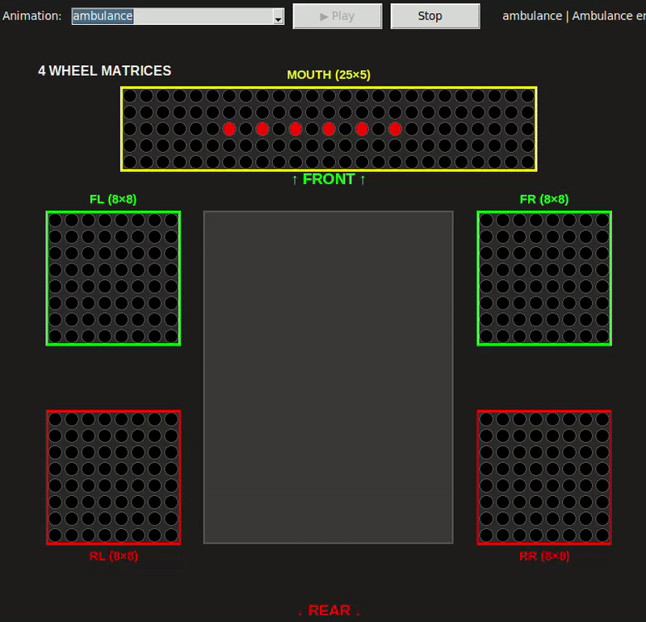

**Описание:** Красно-белая мигающая комбинация
- Передние колёса: Красный/Белый чередование
- Задние колёса: Красное мигание
- Дисплей: Крест + текст

#### Fire Truck (Пожарная машина)
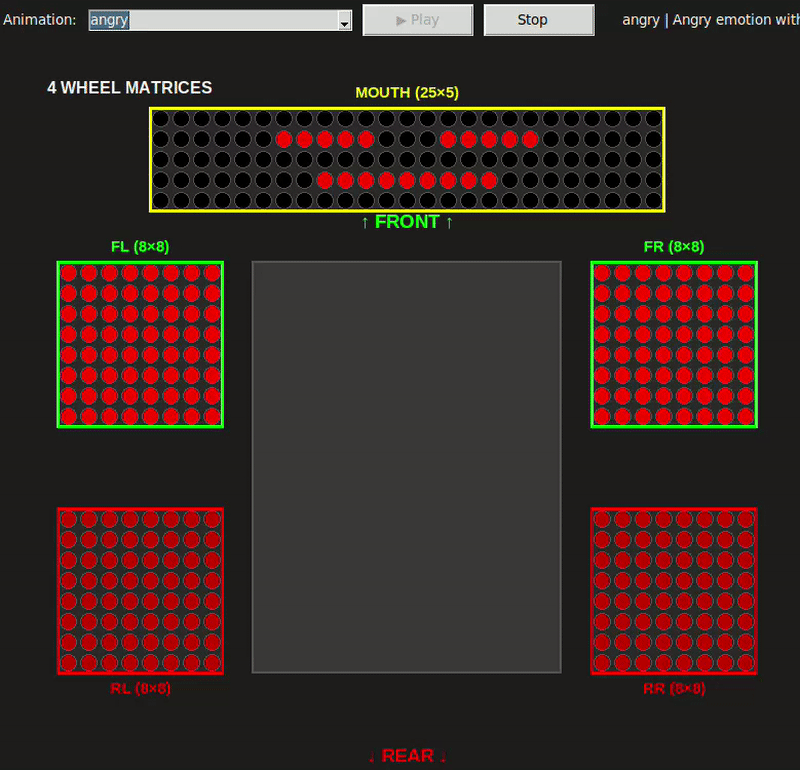

**Описание:** Красно-оранжевые огни
- Все колёса: Красный/Оранжевый чередование
- Дисплей: Огонь + текст "FIRE"

#### Road Service (Дорожная служба)


**Описание:** Жёлтая пульсация на всех матрицах
- Все колёса: Синхронная жёлтая пульсация (20 кадров)
- Дисплей: Скролл текста "ROAD SERVICE"
- **Яркость:** 100-255 (синусоидальная)

---

### 🧭 Navigation (Навигация)

#### Turn Left (Поворот налево)


**Описание:** Сигнал поворота налево
- FL/RL: Оранжевое мигание (4 кадра)
- FR: Тусклый белый (фара)
- **RR: Красный тормоз** (стоп-сигнал)
- Дисплей: Анимированная стрелка влево

#### Turn Right (Поворот направо)
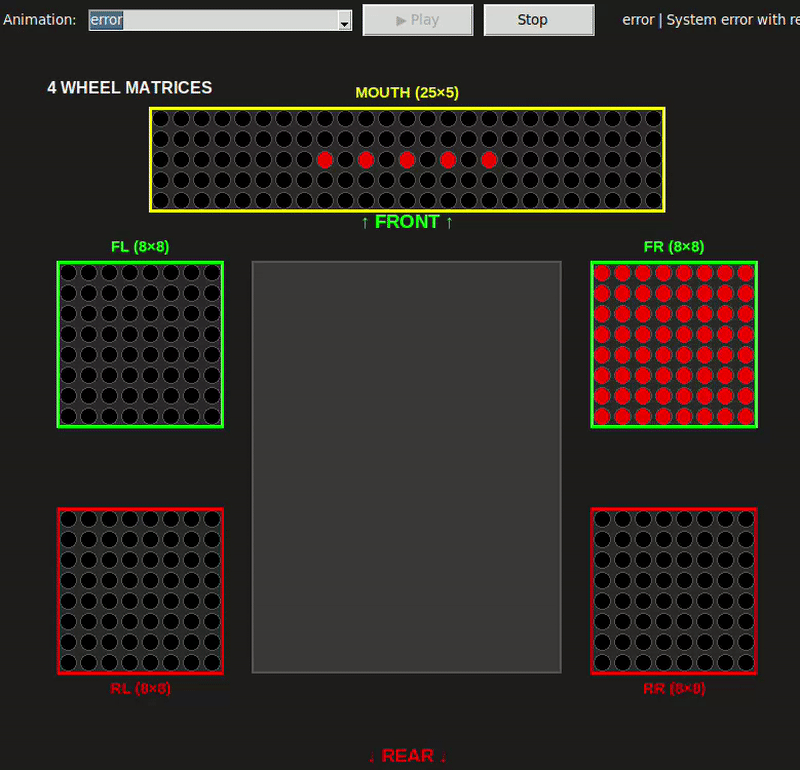

**Описание:** Сигнал поворота направо
- FR/RR: Оранжевое мигание (2 кадра)
- FL: Тусклый белый (фара)
- **RL: Красный тормоз** (стоп-сигнал)
- Дисплей: Анимированная стрелка вправо

#### Braking (Торможение)
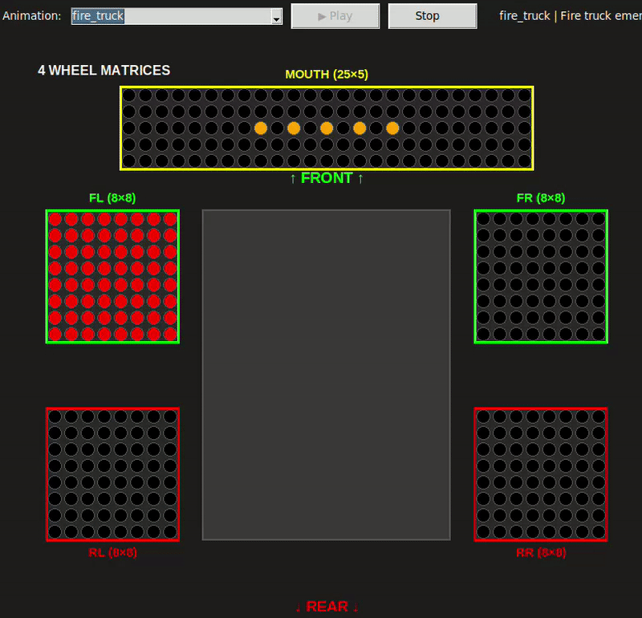

**Описание:** Эффект торможения
- Передние колёса: **Расширяющееся белое свечение** (4 кадра, радиус 2.0→4.4px)
- Задние колёса: Ярко-красная пульсация (255/200 brightness)
- Дисплей: Пульсирующий знак "STOP"

#### Accelerating (Ускорение)
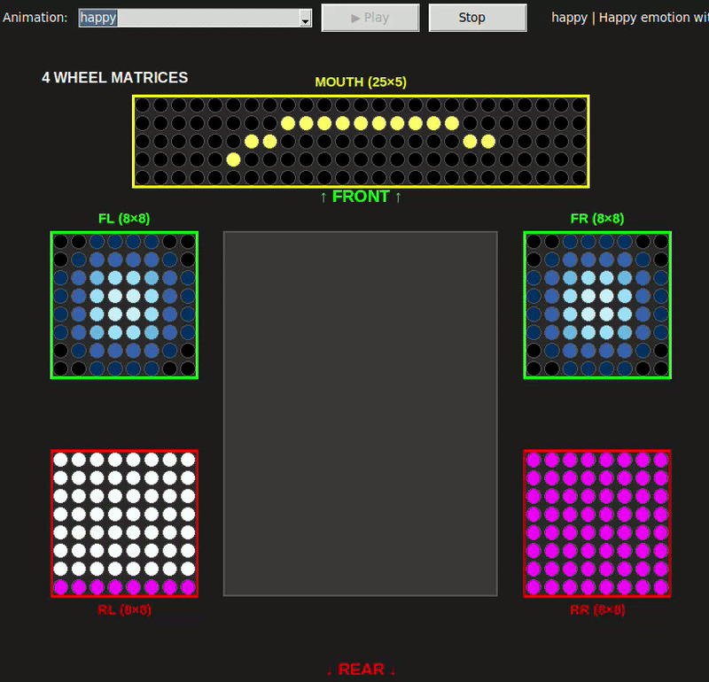

**Описание:** Эффект ускорения
- Передние колёса: Нарастающие белые фары (150→255)
- Задние колёса: Оранжевое свечение (6 кадров)
- Дисплей: Линии скорости

---

### 😊 Emotions (Эмоции)

#### Idle (Ожидание)
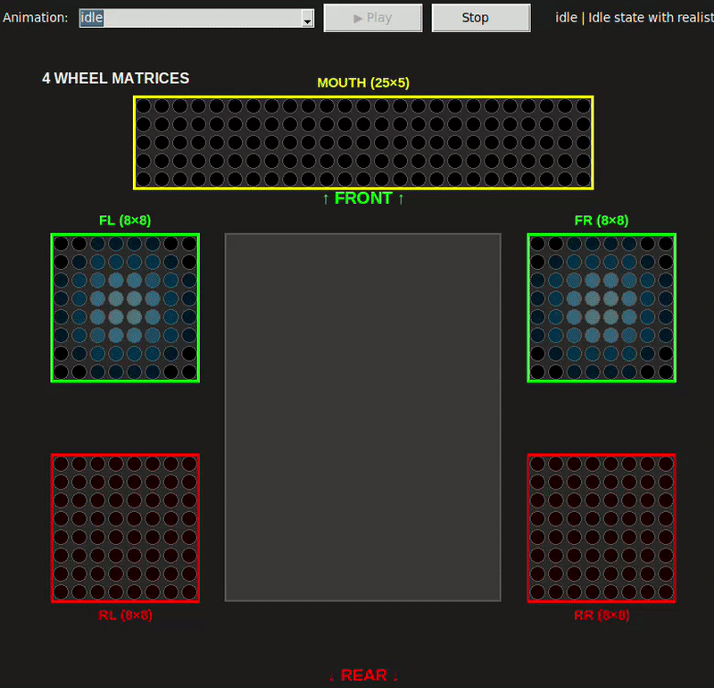

**Описание:** Спокойное дыхание
- Передние колёса (глаза): Эффект дыхания (0.5→1.0 яркость)
- Задние колёса: Мягкое свечение (6 кадров)
- Дисплей (рот): Нейтральное выражение

#### Happy (Радость)


**Описание:** Радостная анимация
- Передние колёса: Радужные глаза
- Задние колёса: Радужная пульсация (8 цветов)
- Дисплей: Улыбка

#### Sad (Грусть)


**Описание:** Грустное состояние
- Передние колёса: Синие грустные глаза
- Задние колёса: Синий пульс (4 кадра)
- Дисплей: Грустный рот

#### Angry (Злость)


**Описание:** Агрессивное состояние
- Передние колёса: Яркая красная пульсация (255→150)
- Задние колёса: Красная пульсация (200→100)
- Дисплей: Сердитое лицо с бровями

#### Surprised (Удивление)
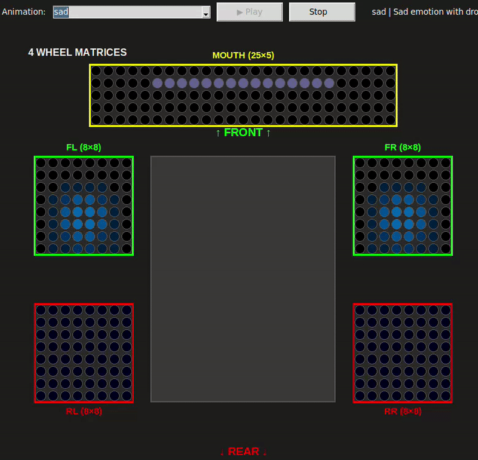

**Описание:** Удивлённое состояние
- Передние колёса: Широко открытые глаза
- Задние колёса: Жёлтое мигание (6 кадров)
- Дисплей: O-образный рот

#### Thinking (Размышление)
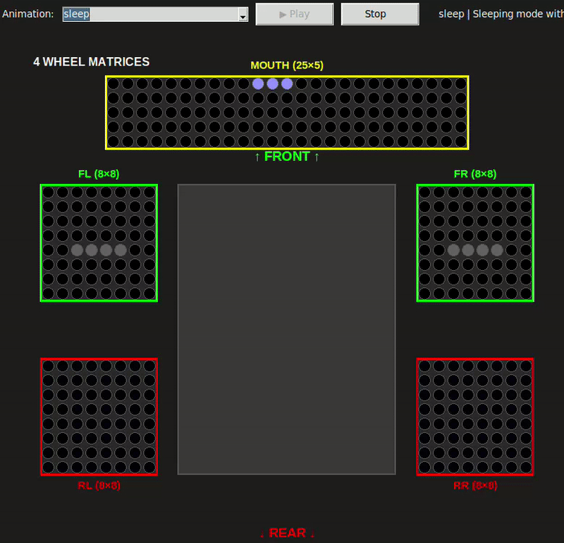

**Описание:** Думающее состояние
- Передние колёса: Боковой взгляд
- Задние колёса: Фиолетовая пульсация (8 кадров, 40-70 brightness)
- Дисплей: Анимированные точки "..."

#### Talking (Разговор)
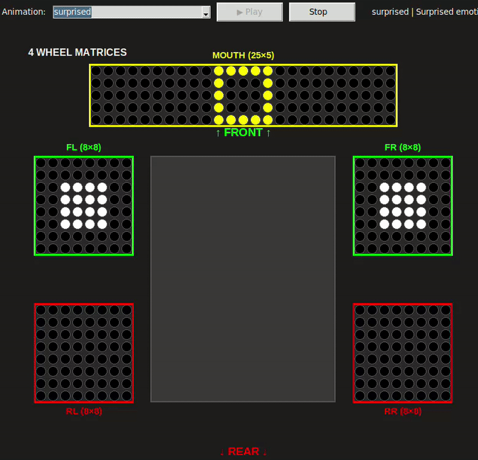

**Описание:** Анимация речи
- Передние колёса: Моргание
- Задние колёса: Циановая пульсация (12 кадров)
- Дисплей: Анимированный рот с волнами

#### Victory (Победа)
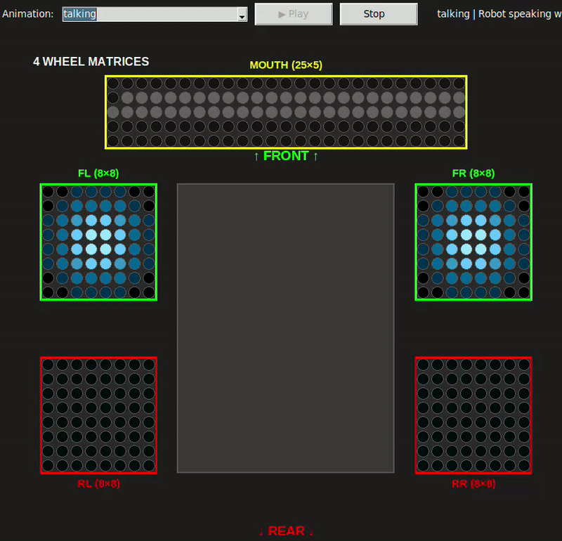

**Описание:** Триумфальная анимация
- Все колёса: Радужный цикл (8 цветов)
- Дисплей: Галочка ✓

---

### ⚙️ System (Системные)

#### Sleep (Сон)
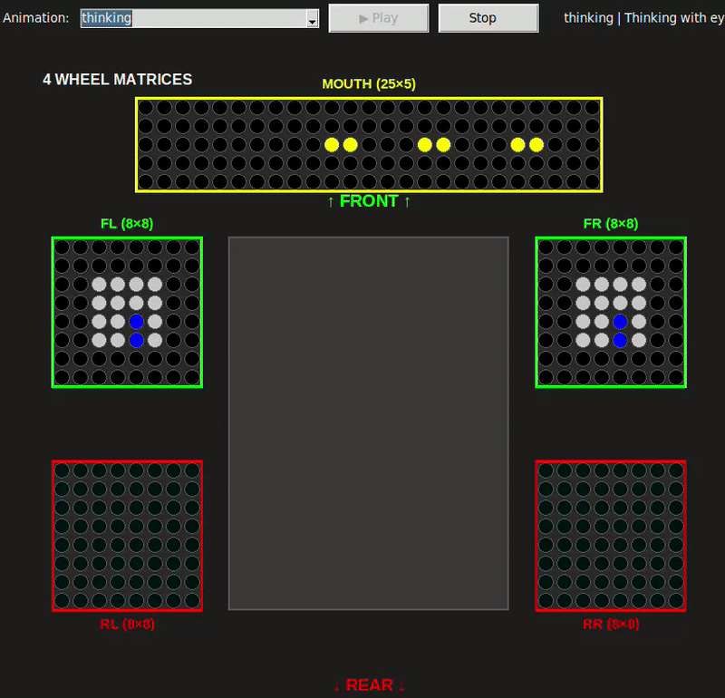

**Описание:** Режим сна
- Передние колёса: Закрытые глаза (горизонтальные линии)
- Задние колёса: Очень тусклая синяя пульсация (15-25 brightness)
- Дисплей: ZZZ анимация

#### Wakeup (Пробуждение)
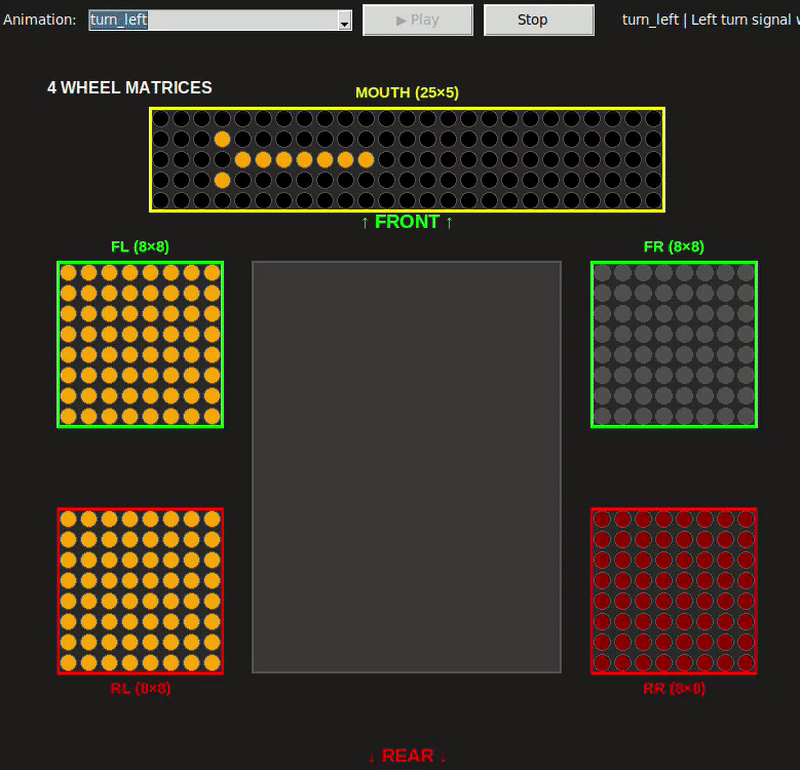

**Описание:** Процесс пробуждения
- Передние колёса: Открывающиеся глаза (6 кадров)
- Задние колёса: Яркий рост 30→120 (заметная анимация)
- Дисплей: Зевок

#### Charging (Зарядка)


**Описание:** Процесс зарядки
- Передние колёса: Нейтральные глаза
- Задние колёса: Зелёная пульсация (8 кадров, 50-100 brightness)
- Дисплей: Анимация батареи (заполнение)

#### Low Battery (Низкий заряд)
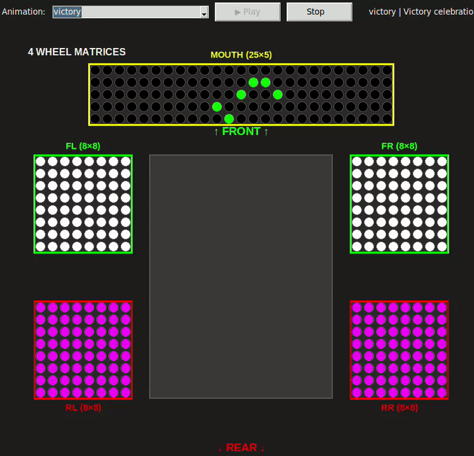

**Описание:** Предупреждение о низком заряде
- Все колёса: Тусклое красное мигание
- Дисплей: Критическая батарея

#### Error (Ошибка)
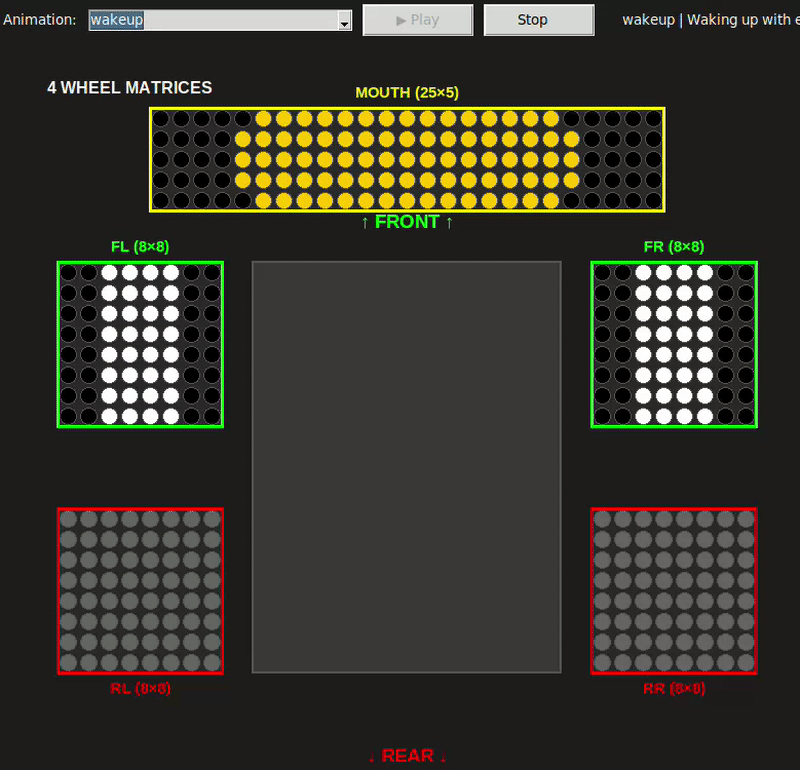

**Описание:** Системная ошибка
- Передние колёса: X-глаза
- Задние колёса: Красное мигание
- Дисплей: Текст "ERROR"

---

## 📐 Технические детали

### Структура файлов

```
src/rob_box_animations/
├── animations/
│   ├── frames/              # PNG кадры анимаций
│   │   ├── police/
│   │   ├── navigation/
│   │   ├── emotions/
│   │   ├── system/
│   │   └── ...
│   └── manifests/           # YAML манифесты
│       ├── police_lights.yaml
│       ├── turn_left.yaml
│       ├── happy.yaml
│       └── ...
└── scripts/
    ├── generate_animation_frames.py  # Генератор кадров
    └── visualize_animations.py       # Превью анимаций
```

### Формат манифеста

```yaml
name: "animation_name"
version: "2.5"
duration_ms: 1000
loop: true
fps: 10

panels:
  - logical_group: "wheel_front_left"
    offset_ms: 0
    frames:
      - image: "frames/category/frame_01.png"
        duration_ms: 100
      - image: "frames/category/frame_02.png"
        duration_ms: 100

metadata:
  priority: "normal"
  category: "navigation"
  tags: ["tag1", "tag2"]
```

### Размеры кадров

- **Wheel frames:** 8×8 pixels (PNG)
- **Display frames:** 25×5 pixels (PNG)
- **Color format:** RGB888
- **Transparent background:** Supported

### Cyrillic Font

Для текста "ПОЛИЦИЯ" используется custom 3×5 pixel font:

```python
cyrillic_map = {
    'П': [[1,1,1],[1,0,1],[1,0,1],[1,0,1],[1,0,1]],  # П
    'О': [[1,1,1],[1,0,1],[1,0,1],[1,0,1],[1,1,1]],  # О
    'Л': [[0,0,1],[0,1,0],[0,1,0],[1,0,0],[1,0,0]],  # Л
    'И': [[1,0,1],[1,0,1],[1,1,1],[1,0,1],[1,0,1]],  # И
    'Ц': [[1,0,1],[1,0,1],[1,0,1],[1,0,1],[1,1,1]],  # Ц
    'Я': [[1,1,1],[1,0,1],[1,1,1],[0,1,0],[1,0,1]],  # Я
}
```

---

## 🛠️ Разработка

### Генерация новых кадров

```bash
# Сгенерировать все анимации
python3 scripts/generate_animation_frames.py --animation all

# Сгенерировать конкретную анимацию
python3 scripts/generate_animation_frames.py --animation happy
```

### Превью анимаций

```bash
python3 scripts/visualize_animations.py
```

Откроется интерактивное окно с:
- Списком всех анимаций
- Превью в реальном времени
- Визуализацией всех 5 матриц

### Создание новой анимации

1. Добавить метод в `generate_animation_frames.py`:

```python
def generate_my_animation(self):
    """Generate my custom animation"""
    print("\n=== Generating my_animation ===")
    subdir = "custom"
    
    # Generate frames for each wheel
    for i in range(num_frames):
        for suffix in ['fl', 'fr', 'rl', 'rr']:
            img = create_frame(...)
            self._save_frame(img, f"wheel_{suffix}_{i:02d}.png", subdir)
    
    # Generate display frames
    for i in range(num_frames):
        img = create_display_frame(...)
        self._save_frame(img, f"display_{i:02d}.png", subdir)
```

2. Создать YAML манифест в `manifests/my_animation.yaml`

3. Сгенерировать кадры и протестировать

---

## 📊 Статистика

### Версии манифестов

**v2.5 (Current):**
- ✅ police_lights.yaml
- ✅ road_service.yaml
- ✅ turn_left.yaml
- ✅ turn_right.yaml
- ✅ idle.yaml
- ✅ happy.yaml
- ✅ angry.yaml
- ✅ sleep.yaml
- ✅ wakeup.yaml
- ✅ charging.yaml
- ✅ talking.yaml

**v1.0 (Legacy):**
- ambulance.yaml
- fire_truck.yaml
- braking.yaml
- accelerating.yaml
- error.yaml
- sad.yaml
- surprised.yaml
- thinking.yaml
- victory.yaml
- low_battery.yaml

### Общая статистика

- **Всего анимаций:** 21
- **Всего кадров:** ~600+
- **Размер библиотеки:** ~50KB
- **FPS:** 10 (стандарт)
- **Средняя длительность:** 1-3 секунды

---

## 🔧 История изменений

### 2025-10-11 - v2.5 Release

**Основные изменения:**

1. **Police (Полиция)**
   - ❌ Убран скроллинг текста
   - ✅ Статичный текст с миганием цветов
   - ✅ Cyrillic font 5px высота (было 3px)

2. **Turn Signals (Повороты)**
   - ✅ Добавлены красные стоп-сигналы на противоположном заднем колесе
   - Turn Left: RR красный
   - Turn Right: RL красный

3. **Emotions (Эмоции)**
   - ✅ Все эмоции теперь анимируют задние колёса
   - Angry: Красная пульсация (3 кадра)
   - Sleep: Тусклый синий пульс (5 кадров)
   - Wakeup: Яркий рост 30→120 (6 кадров)

4. **Navigation (Навигация)**
   - ✅ Braking: Расширяющиеся фары вместо статичных
   - ✅ Road Service: Добавлены все 4 колеса

**Файлы:**
- Изменено: 11 манифестов (v1.0 → v2.5)
- Создано: 120+ новых PNG кадров
- Обновлено: `generate_animation_frames.py` (6 методов)

---

## 📚 Дополнительная документация

- [Animation Improvements (Jan 11)](ANIMATION_IMPROVEMENTS_2025-01-11.md) - Детали улучшений v2.0
- [Animation Fixes (Jan 11)](ANIMATION_FIXES_2025-01-11.md) - Исправления багов v2.5
- [Final Check (Oct 11)](ANIMATION_FINAL_CHECK_2025-10-11.md) - Финальная проверка и статус
- [Talking Animation V2](TALKING_ANIMATION_V2.md) - Специальная анимация речи

---

**Последнее обновление:** 11 октября 2025  
**Версия:** 2.5  
**Автор:** krikz / rob_box_project
