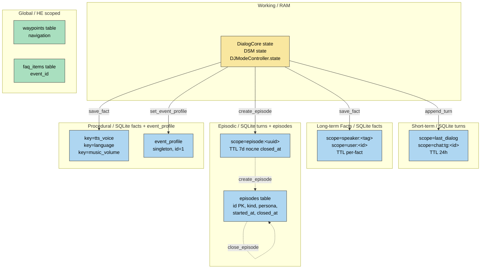

# Memory Layers — диаграмма (ADR-0037)

ASCII-схема и mermaid-вариант для архитектуры слоёв памяти робота.

См. ADR-0037 (docs/adr/0037-memory-layers-persistence.md).

---

## ASCII: пять слоёв + persistence policy

```
┌──────────────────────────────────────────────────────────────────────────┐
│ WORKING  (in-RAM)                                                         │
│   ◆ DialogCore.process_input text/turn/speaker_tag                       │
│   ◆ DJModeController.state (persona, theme, next_transition_at)          │
│   ◆ DSM state (IDLE/LISTENING/DIALOGUE/SILENCED)                         │
│   Persistence: ❌ NONE. Dies with process.                               │
│   Cleanup: при return из handler / tick / event loop.                    │
└──────────────────────────────────────────────────────────────────────────┘
                                   │
                                   ▼ append_turn(scope=last_dialog, ...)
┌──────────────────────────────────────────────────────────────────────────┐
│ SHORT-TERM  (SQLite turns, scope=last_dialog / chat:tg:<id>)             │
│   ◆ Последние N=20 turns текущего диалога                                │
│   Persistence: ✅ SQLite `turns` table.                                  │
│   TTL: 24h по created_at (cron prune_expired).                           │
│   Explicit cleanup: clear_turns("last_dialog") при DJ OFF / session end. │
└──────────────────────────────────────────────────────────────────────────┘
                                   │
                ┌──────────────────┴──────────────────┐
                ▼                                     ▼
┌─────────────────────────────────┐  ┌─────────────────────────────────────┐
│ LONG-TERM FACTS                 │  │ EPISODIC (закрытые сессии)          │
│ (SQLite facts, scope=speaker:42)│  │ (SQLite turns + episodes table)     │
│ ◆ Семантические факты           │  │ ◆ scope=episode:<uuid>              │
│ ◆ Профиль спикера                │  │ ◆ kind = dj|roleplay|event          │
│ Persistence: ✅ facts table.    │  │ ◆ persona, theme, started_at,       │
│ TTL: per-fact (∞ или           │  │   closed_at                         │
│   metadata.ttl_seconds).        │  │ Persistence: ✅ append-only history.│
│ Cleanup: clear_facts(...) или   │  │ TTL: 7d после closed_at.            │
│   user forget.                  │  │ Cleanup: cron DELETE WHERE          │
│                                 │  │   closed_at < now-7d.               │
│                                 │  │ ⚠ НЕ восстанавливаются в working   │
│                                 │  │   при рестарте — episodic = дневник.│
└─────────────────────────────────┘  └─────────────────────────────────────┘
                │                                     │
                └──────────────────┬──────────────────┘
                                   ▼
┌──────────────────────────────────────────────────────────────────────────┐
│ PROCEDURAL  (SQLite facts с TTL + event_profile singleton)              │
│   ◆ tts_voice, language, music_volume, dj_persona (как факты с TTL)     │
│   ◆ event_profile (id=1 CHECK) — текущий «режим» (singleton)            │
│   Persistence: ✅ facts + event_profile tables.                          │
│   TTL: per-key. tts_voice — без TTL. music_volume — 7d.                 │
│   Cleanup: при смене настройки (clear_facts по key).                     │
└──────────────────────────────────────────────────────────────────────────┘
                                   │
                                   ▼
┌──────────────────────────────────────────────────────────────────────────┐
│ GLOBAL (per MemoryStore ABC, НЕ per-scope)                              │
│   ◆ Waypoints (save_waypoint / list_waypoints) — навигация               │
│   ◆ FAQ per-event (load_faq / search_faq) — knowledge base               │
│   Правило: «всё, что не Waypoints и не FAQ — scoped».                   │
└──────────────────────────────────────────────────────────────────────────┘
```

---

## ASCII: что происходит при рестарте (юзерский сценарий #1774)

```
До рестарта (DJ активен):
┌─────────────┐    ┌──────────────────────┐    ┌─────────────────┐
│ DJModeState │    │ turns.scope=         │    │ event_profile   │
│ persona=    │    │   last_dialog        │    │ active_event=   │
│ "Дровосек"  │    │   [привет, ...]      │    │  "dj_session"  │
│ theme=      │    │   turns.scope=       │    │ episode_id=    │
│ "лесная     │    │   episode:dj-uuid-1  │    │  "dj-uuid-1"   │
│  хижина"    │    │   [DJ_AUTO#1...#7]   │    │ persona=       │
│ enabled=True│    │                      │    │  "Дровосек"    │
└─────────────┘    └──────────────────────┘    └─────────────────┘

        ║ systemctl restart rob_box_voice
        ▼

После рестарта:
┌─────────────┐    ┌──────────────────────┐    ┌─────────────────┐
│ DJModeState │    │ turns.scope=         │    │ event_profile   │
│ persona=    │    │   last_dialog        │    │ active_event=   │
│  ""         │    │   [привет, ...]      │    │   NULL или      │
│ enabled=    │    │   turns.scope=       │    │  не содержит    │
│  False      │    │   episode:dj-uuid-1  │    │  active_event   │
│ (NEW, RAM)  │    │   [DJ_AUTO#1...#7]   │    │ (CLOSE_EPISODE  │
└─────────────┘    └──────────────────────┘    │  сбросил)       │
        ▲                   ▲                 └─────────────────┘
        │                   │
        │                   │ load_recent("last_dialog", limit=20)
        │                   │ → [привет, ...] БЕЗ [DJ_AUTO#1...#7]
        │                   │   (другая scope!)
        │                   │
┌───────────────────────────────────────────────────────┐
│ LLM вызывается на «сбацай джаз для Ивана»:           │
│   history = [привет, ..., сбацай джаз для Ивана]      │
│   НЕ видит DJ-промптов → правильно интерпретирует.   │
└───────────────────────────────────────────────────────┘
        │
        ▼
┌───────────────────────────────────────────────────────┐
│ set_dj_mode(enabled=true, persona="Джаз-Иван")        │
│   → create_episode(kind="dj", metadata={...})        │
│   → episode_id="dj-uuid-2"                            │
│   → set_event_profile({active_event: "dj_session",  │
│                         episode_id: "dj-uuid-2",     │
│                         persona: "Джаз-Иван"})       │
│   → DJModeController.state.persona = "Джаз-Иван"     │
│                                                       │
│ Корректный результат: НЕ продолжает «Дровосек»,      │
│ начинает новый DJ-цикл для «Джаз-Иван».             │
└───────────────────────────────────────────────────────┘
```

---

## Mermaid (для docs/diagrams/)



---

## Чистая схема memory isolation (правило «нет query без scope»)

```
┌──────────────────────────────────────────────────────────────┐
│             MemoryStore (ABC)                                │
│                                                              │
│   ┌─────────────────────────────┐                            │
│   │  SCOPED (per scope-string)  │  ← фильтр WHERE scope = ? │
│   │  load_recent(scope)         │                            │
│   │  append_turn(scope)         │                            │
│   │  save_fact(scope)           │                            │
│   │  search_facts(scope)        │                            │
│   │  list_facts(scope)          │                            │
│   │  clear_turns(scope)         │                            │
│   │  clear_facts(scope)         │                            │
│   └─────────────────────────────┘                            │
│                                                              │
│   ┌─────────────────────────────┐                            │
│   │  EPISODIC (per episode_id)  │  ← фильтр через episodes   │
│   │  create_episode(kind)       │                            │
│   │  close_episode(episode_id)  │                            │
│   │  get_active_episode(kind)   │                            │
│   │  prune_expired()            │  cron, hourly              │
│   └─────────────────────────────┘                            │
│                                                              │
│   ┌─────────────────────────────┐                            │
│   │  GLOBAL (НЕ scoped)         │  ← НЕТ фильтра по scope   │
│   │  save_waypoint              │                            │
│   │  list_waypoints             │                            │
│   │  load_faq(event_id)         │  per-event namespace       │
│   │  search_faq(event_id)       │                            │
│   │  set_event_profile          │  singleton (id=1)          │
│   │  get_event_profile          │                            │
│   └─────────────────────────────┘                            │
│                                                              │
│  ПРАВИЛО: на проде нет query «all turns» / «all facts».     │
│  Любой новый метод — default scoped, override для global.   │
└──────────────────────────────────────────────────────────────┘
```

---

## References в коде

- `MemoryStore` ABC: `src/rob_box_harness/rob_box_harness/memory.py:118-258`
- `InMemoryStore`: `src/rob_box_harness/rob_box_harness/memory.py:261-471`
- `SQLiteVoiceMemory` DDL: `src/rob_box_harness/rob_box_harness/memory/sqlite_voice.py:51-110`
- `DJModeController` (working layer): `src/rob_box_voice/rob_box_voice/core/dj_mode.py:65-309`
- `speaker_scope()` helper: `src/rob_box_harness/rob_box_harness/memory.py:484-500`