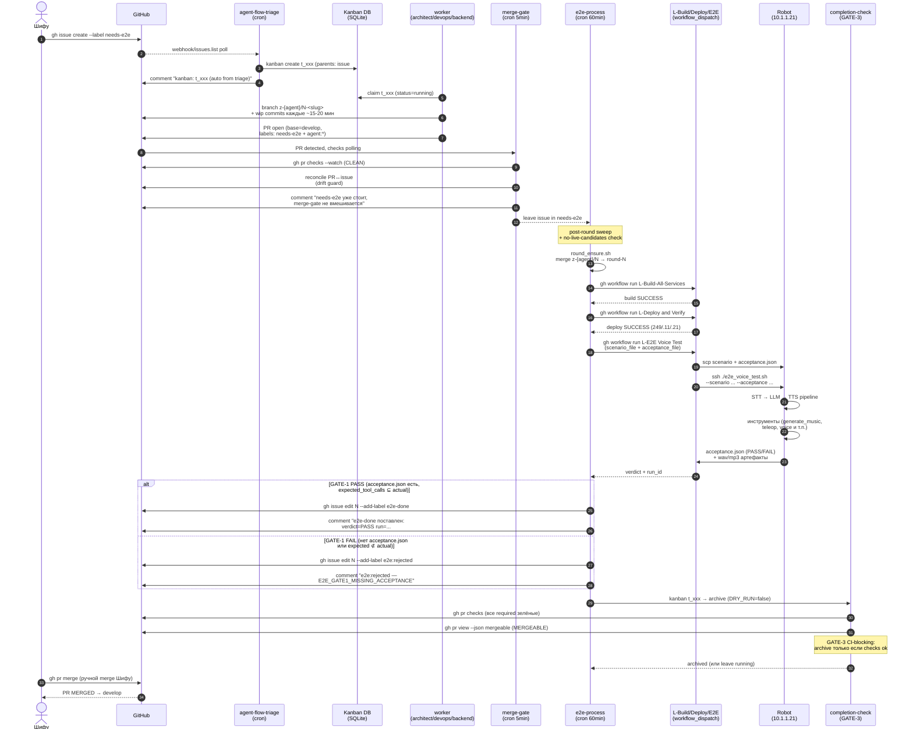

# Process diagrams — ADD-процесс rob_box_project

Этот документ фиксирует **как сейчас работает** наш Agent-Driven Development (ADD)
pipeline: что делают `agent-flow-triage` → worker → `merge-gate` → `e2e-process` →
`L-E2E Voice Test` → `completion-check` (GATE-3), и какие gate'ы стоят на пути к
`e2e-done` + merge в `develop`.

> Источник истины — **код скриптов** в `scripts/agent_flow/` и **ADR**. Диаграммы
> ниже — карта; правки делаются в коде, диаграмма обновляется, когда меняется
> контракт. Любая нетривиальная правка → сопровождается обновлением
> соответствующего ADR.

## TL;DR

- **Issue с `needs-e2e`** → `agent-flow-triage` создаёт kanban-карточку `t_xxx`.
- **Worker** (architect/devops/backend) поднимает `z-{agent}/N-<slug>` ветку, пушит
  wip-коммиты каждые ~15-20 мин, открывает PR.
- **merge-gate** (cron 5min) проверяет `gh pr checks`, reconcile PR↔issue, оставляет
  `needs-e2e` (не ставит повторно).
- **e2e-process** (cron 60min) делает `post-round sweep`, мержит `z-{agent}/N` →
  `round-N+1`, гоняет Build → Deploy → E2E workflows.
- **GATE-1** в `L-E2E Voice Test` требует `acceptance.json` (см. ADR-0022 §4.1).
- **Вердикт** делится на три fail_kind (`feature`/`infra`/`merged`), см.
  `scripts/agent_flow/agent-flow-e2e-process.sh::detect_fail_kind`.
- **completion-check** (GATE-3) — CI-blocking: archive kanban-карточки **только**
  если `gh pr checks` + `mergeable` + `CLEAN`.
- **Merge в `develop`** — ручной (`gh pr merge` от Шифу), никакой auto-merge
  (ADR-0014).

## Sequence diagram (happy-path)



> raw mermaid: [`process-sequence.mmd`](./process-sequence.mmd)

## Flowchart (все ветки и fail_kind)

```mermaid
flowchart TD
    Start([Шифу создаёт issue<br/>с label needs-e2e]) --> Triage{agent-flow-triage<br/>cron 5min}

    Triage -->|новая needs-e2e| CreateK[kanban create t_xxx<br/>parents: issue#N]
    Triage -->|уже has e2e-done или<br/>e2e:rejected| SkipTriage[skip — issue уже в финале]
    Triage -->|нет label agent:*<br/>или assignee| SkipTriage

    CreateK --> Claim{worker claim<br/>t_xxx → running}
    Claim --> Branch[git worktree<br/>z-{agent}/N-slug]
    Branch --> WIP[wip(scope) commits<br/>каждые ~15-20 мин]
    WIP --> PR[gh pr create --base develop<br/>label: needs-e2e + agent:*]

    PR --> MG{merge-gate<br/>cron 5min}
    MG -->|gh pr checks CLEAN<br/>+ MERGEABLE| Reconcile[reconcile PR↔issue<br/>drift guard]
    MG -->|checks red или<br/>drift>threshold| BlockMG[comment + не ставит<br/>needs-e2e повторно]

    Reconcile --> LabelCheck{issue уже имеет<br/>needs-e2e?}
    LabelCheck -->|yes| Idle[leave as-is<br/>→ ждёт e2e-process]
    LabelCheck -->|no| AddNE[gh issue edit N<br/>--add-label needs-e2e]
    AddNE --> Idle
    BlockMG --> Idle

    Idle --> EP{e2e-process<br/>cron 60min}

    EP --> Sweep{post-round sweep}
    Sweep -->|round-N без override,<br/>все кандидаты archived| E2EDone[gh issue edit N<br/>--add-label e2e-done]
    Sweep -->|needs-e2e override<br/>после SUCCESS| SkipSweep[skip — issue в финале]
    Sweep -->|нет live candidates<br/>+ есть pending needs-e2e| RoundCreate[round_ensure.sh<br/>merge z-agent/N → round-N+1]

    RoundCreate --> Build[gh workflow run<br/>L-Build-All-Services]
    Build --> Deploy[gh workflow run<br/>L-Deploy and Verify]
    Deploy --> E2E[gh workflow run<br/>L-E2E Voice Test]

    E2E --> G1{GATE-1<br/>acceptance.json есть?}
    G1 -->|есть и valid| RunHarness[e2e_voice_test.sh<br/>--scenario --acceptance]
    G1 -->|нет / empty<br/>expected_tool_calls| G1Fail[comment: E2E_GATE1_MISSING_ACCEPTANCE<br/>label stays needs-e2e]

    RunHarness --> FKind{detect_fail_kind}
    FKind -->|PASS verdict| PASS[e2e-done<br/>на issue + PR]
    FKind -->|infra: 429, robot down,<br/>SSH fail| InfraFail[e2e:infra-fail<br/>retry next tick]
    FKind -->|feature: expected ⊄ actual| Rejected[e2e:rejected<br/>+ comment blocker]
    FKind -->|merged: PR влит,<br/>acceptance PASS на main| Merged[merged-override<br/>label stays needs-e2e → sweep]

    PASS --> CC{completion-check<br/>GATE-3}
    InfraFail --> CC
    Rejected --> CC
    Merged --> Sweep

    CC -->|gh pr checks all green<br/>+ MERGEABLE + CLEAN| Archive[kanban t_xxx → archive<br/>DRY_RUN=false]
    CC -->|checks red или<br/>не MERGEABLE| LeaveRun[leave running<br/>воркер чинит в той же ветке]

    Archive --> Merge([Шифу: gh pr merge<br/>ручной merge в develop])

    Honesty[/"ADR-0018: честный FAIL<br/>лучше красивого PASS"/]
    G1Fail -.-> Honesty
    Rejected -.-> Honesty
    InfraFail -.-> Honesty

    classDef gate fill:#fff4e1,stroke:#d4791f,color:#000
    classDef fail fill:#ffe1e1,stroke:#c0392b,color:#000
    classDef ok fill:#e1ffe1,stroke:#27ae60,color:#000
    classDef manual fill:#e1e8ff,stroke:#3b5cde,color:#000

    class G1,CC gate
    class G1Fail,Rejected,InfraFail fail
    class PASS,Archive,E2EDone ok
    class Merge manual
```

> raw mermaid: [`process-flowchart.mmd`](./process-flowchart.mmd)

## Gate'ы (ADR-0022)

| Gate | Что блокирует | Где живёт | Что покрывает |
|------|---------------|-----------|---------------|
| **GATE-1** Acceptance.json | `e2e-done` без `acceptance.json` (R1, R6) | `L-E2E Voice Test.yml` + `agent-flow-e2e-process.sh` | прекращает smoke-false-PASS |
| **GATE-2** Двушаговая автозакрывалка | auto-close сразу после `e2e-done` (R4) | `agent-flow-merge-gate.sh` stale-timer | 24h пауза перед close, чтобы user-reopen успел сработать |
| **GATE-3** CI-blocking completion | archive при красных checks или `mergeable!=MERGEABLE` (R5) | `agent-flow-completion-check.sh` | прекращает «лгущий воркер» |

## Участники и их код

| Участник | Cron / entry-point | Зона ответственности |
|----------|-------------------|----------------------|
| Шифу | — | issue create, ручной merge |
| `agent-flow-triage` | `scripts/agent_flow/agent-flow-triage.sh` | issue → kanban create |
| worker (architect/devops/backend) | `kanban_show` → claim t_xxx | код + PR + wip |
| `merge-gate` | `scripts/agent_flow/agent-flow-merge-gate.sh` (cron 5min) | PR↔issue reconcile, user-unlabel guard |
| `e2e-process` | `scripts/agent_flow/agent-flow-e2e-process.sh` (cron 60min) | round_ensure, post-round sweep, fail_kind |
| `completion-check` | `scripts/agent_flow/agent-flow-completion-check.sh` (GATE-3) | CI-blocking archive |
| `L-Build-All-Services` | `.github/workflows/L-Build-All-Services.yml` | сборка docker-образов |
| `L-Deploy and Verify` | `.github/workflows/L-Deploy and Verify.yml` | деплой на 249/.11/.21 |
| `L-E2E Voice Test` | `.github/workflows/L-E2E Voice Test.yml` | GATE-1 + e2e_voice_test.sh |
| Robot 10.1.1.21 | SSH 249 → 10.1.1.21 | voice pipeline + tool calls |

## Связанные документы

- **[ADR-0018 — честность воркера](../adr/0018-agent-honesty-culture.md)** — «честный
  FAIL лучше красивого PASS». Каждый fail_kind на flowchart — это инвариант ADR-0018.
- **[ADR-0022 — gate'ы вокруг `e2e-done`](../adr/0022-process-e2e-done-gates.md)** —
  GATE-1/2/3, acceptance.json contract, `BLOCKER_CONSECUTIVE_FAILS`.
- **[AGENT_FLOW_PROPOSAL.md](../design/AGENT_FLOW_PROPOSAL.md)** — общий дизайн
  процесса (откуда растут все скрипты).
- **[add-research-2026-08-19.md](../../reports/add-research-2026-08-19.md)** §2.2 —
  SASE framework: наши скрипты = LoopScript + AEE.
- **[VALIDATE_HONESTY](../../scripts/agent_flow/validate_honesty.sh)** —
  pre-PR check на голословные «проверил / работает / PASS» без raw evidence.

## Когда обновлять

- Появилась новая метка (`needs-review`, новый fail_kind, новый gate) →
  обновить flowchart + ADR-0022 cross-ref.
- Изменился порядок `merge-gate` (новый reconcile path, новый drift guard) →
  обновить sequence + flowchart, добавить пункт в ADR (или сослаться на новый).
- Появился новый workflow в `.github/workflows/` (вместо одного из
  `L-Build*`/`L-Deploy*`/`L-E2E Voice Test`) → обновить участников + sequence.
- Добавился новый профиль worker'а (architect/devops/backend → ещё один) →
  обновить label `agent:*` и подпись worker в sequence.

## История правок

- **2026-08-19** — initial version (issue #1466, task t_dc38e339). Создал
  sequence + flowchart + этот overview; связал с ADR-0018/0022 и source-скриптами.
