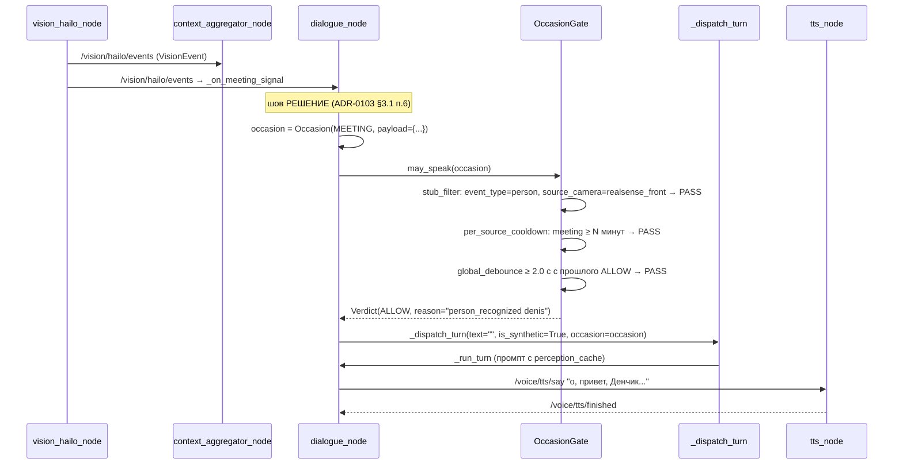

# E2E-сценарий «Денис заходит в мастерскую» — спецификация

> **Статус:** draft / не активный. Спецификация привязана к ADR-0102 §9.6
> («e2e-маркер, после PR-A + PR-F, не блокирует PR-A»). До merge PR-A
> (каркас `core/occasion.py`, ADR-0102 §8) и PR-F (тестовый адаптер
> `_on_meeting_signal`) — **запускать не на чем**: `OccasionGate` ещё
> не существует в коде (подтверждено `git grep "OccasionGate\|may_speak"
> src/` → 0 совпадений, 2026-09-15 13:55 CEST).
>
> **Автор:** tester (kanban t_7f1a4919, parent t_38c55959).
> **Родительский ADR:** ADR-0103 (`e7c9abc6`), ADR-0102 (PR #2581, draft).
> **Issue:** #2536.

---

## 0. Назначение документа

Спецификация e2e-теста, который подтверждает, что сценарий
«Денис входит в мастерскую → робот говорит первым» работает **целиком,
на живом роботе**, через тот же путь, что пользовательский wake-word.

Цель — не просто «текст сказан», а наблюдаемая цепочка
«perception-событие → конструкция `Occasion(MEETING, ...)` →
`may_speak` → `Verdict.ALLOW` → `_dispatch_turn(is_synthetic=True,
occasion=...)` → `_run_turn` → TTS-реплика «о, привет, Денчик…»
→ NO wake-word, NO новый STT-текст, NO инкремент
`_llm_skipped_counter["no_wake_word"]`».

---

## 1. Предусловия (pre-conditions)

### 1.1. Код

|| Артефакт | Где проверять | Статус на 2026-09-15 |
|---|---|---|---|
| ADR-0103 смержен | `git merge-base --is-ancestor e7c9abc6 HEAD` → exit 0 | ✅ merged 2026-09-15 13:37 |
| ADR-0102 принят | `docs/adr/0102-turn-occasion-api-contract.md` в `develop` | ⏳ PR #2581 OPEN |
| `core/occasion.py` существует | `git ls-files src/rob_box_voice/rob_box_voice/core/occasion.py` | ❌ нет (после PR-A) |
| `OccasionGate.may_speak` импортируется | `python -c "from rob_box_voice.core.occasion import OccasionGate"` | ❌ нет (после PR-A) |
| `EventDetector` имеет прода-импортёра | `git grep "from rob_box_perception.core.event_detector import EventDetector" -- src/ \| wc -l` → ≥2 (тест + `core/occasion.py`) | ⏳ (после PR-A, ADR-0103 §6.9) |
| `_on_meeting_signal` callback существует | `git grep "_on_meeting_signal" src/rob_box_voice/rob_box_voice/dialogue_node.py` → ≥1 | ❌ нет (PR-F) |
| `_dispatch_turn(..., occasion=...)` kwarg | `git grep "def _dispatch_turn" src/rob_box_voice/rob_box_voice/dialogue_node.py` → сигнатура с `occasion` | ❌ нет (после PR-A, ADR-0103 §3.3.2) |

**Критерий PASS для запуска теста:** все строки таблицы = ✅.
Сейчас (2026-09-15) — 1 ✅, 6 ⏳ / ❌. Тест **не активен**.

### 1.2. Конфигурация

|| Параметр | Где | Значение |
|---|---|---|
| `wake_words.yaml` в `personality` содержит «роб бокс» / «робот» | `docker/vision/config/wake_words.yaml` | ✅ (подтверждено, файл:1-50) |
| `dialogue_node.yaml.startup_greeting_text` пустая или дефолтная | `docker/vision/config/voice_assistant/dialogue_node.yaml:132-134` | "Я на связи, все системы в норме!" (не пустая) — это **неважно** для сценария, но нужно знать: после деплоя прозвучит startup-реплика ДО теста, ждать её окончания |
| `vision` реальный inference (не StubHEFLoader) | #2398 / #2531 (Взгляд) | ⏳ (PR-F требует реального кадра, иначе стаб-фильтр REFUSE) |
| `stt_node` не в degraded mode (cold-start VAD) | ADR-0029 | пройти ≥5 минут от старта контейнера до теста |
| `ROS_DOMAIN_ID` совпадает у робота и harness | `docker compose ps` | проверить |

### 1.3. Состояние ROS2-графа (обязательно для запуска)

```bash
# Проверить, что dialogue_node жив и подписан:
ros2 node info /dialogue_node 2>&1 | grep -E "Publishers|Subscriptions"
# Ожидаемо в подписках (после PR-F):
#   /vision/hailo/events          (sub)  ← новое в PR-F
#   /perception/context_update    (sub)  ← новое в PR-A
#   /voice/stt/result             (sub)  (existing)
#   /voice/dj_mode                (sub)  (existing)
#   ... (остальные 16 — без изменений)

# Проверить, что vision_hailo_node публикует:
ros2 topic info /vision/hailo/events -v 2>&1 | grep -E "Publisher|Message type"
# Ожидаемо: Publisher count ≥ 1, тип rob_box_perception_msgs/VisionEvent

# Проверить, что perception кэш живой (после PR-A):
ros2 service call /voice/occasion_stats ... # будет введён ADR-0102 §5
# Или через лог: grep "occasion.*stats" /var/log/rob_box/dialogue_node.log
```

### 1.4. Железо

- Робот включён, камера (ReSpeaker AI HAT+ / OAK-D) реально видит сцену.
- В кадре **только один** человек (тестовый актор = Денис, см. §6).
- Динамик и микрофон ReSpeaker не заглушены, `VAD max ≥ 12.0` (иначе реплика робота обрежется, см. `.github/e2e/VOICE_COMMANDS_RESEARCH.md`).

---

## 2. Шаги сценария

### 2.1. Подача perception-события «вижу Дениса»

**Способ 1 (PR-F, тестовый адаптер, основной):**

После PR-F в `dialogue_node` появится режим `test_meeting_inject`, который
позволяет **синтетически** опубликовать `VisionEvent` через CLI или
ROS2-сервис (а не ждать живого человека в кадре). Это важно для CI:
живой человек в кадре в production-тесте недопустим (детерминизм,
этика, скорость).

```bash
# Команда для harness (после PR-F):
ros2 topic pub --once /vision/hailo/events rob_box_perception_msgs/VisionEvent \
  "{header: {stamp: {sec: $(date +%s), nanosec: 0}, frame_id: 'realsense_front'},
   source_camera: 'realsense_front', event_type: 'person',
   class_name: 'person', confidence: 0.94,
   bbox_center_x: 320, bbox_center_y: 240, bbox_width: 200, bbox_height: 400,
   embedding_id: 'denis_8cb84bc9', display_name: 'Денис',
   attributes_json: '{}'}" \
  --qos-durability transient_local --qos-reliability reliable
```

**Способ 2 (живой человек в кадре, ручной тест на железе):**

Денис входит в кадр реально → `vision_hailo_node` с периодом ~250 ms
публикует `VisionEvent` с `event_type='person'`,
`source_camera='realsense_front'`, `embedding_id='denis_8cb84bc9'`,
`display_name='Денис'`, `confidence ≥ 0.85`. Это проверяет, что
**реальный** inference, а не stub. Для CI Способ 2 запрещён.

### 2.2. Ожидаемые потоки данных (по ADR-0102 §4)



### 2.3. Что НЕ должно произойти (regression checks)

- **NO wake-word**: STT не должен слушать фразу робота «о, привет…»
  как вход — проверяется тем, что у робота **нет** свежего
  `/voice/stt/result` между шагами 2.1 и 2.4.
- **NO инкремент `_llm_skipped_counter["no_wake_word"]`**: ключевая
  post-condition брифа. Проверяется в логе:
  `grep "_llm_skipped_counter\[" /var/log/rob_box/dialogue_node.log`
  → 0 совпадений с момента подачи события.
- **NO новый ROS2-топик** `/voice/turn_occasion` — ADR-0102 §9.2.
  Проверяется: `ros2 topic list \| grep turn_occasion` → пусто.
- **NO `/voice/occasion/*` топиков** — ADR-0102 §9.2.
  Проверяется: `ros2 topic list \| grep occasion` → пусто.

### 2.4. Ожидаемая реплика робота

TTS должен произнести фразу вида:

```
о, привет, Денчик, как дела
```

(точная формулировка зависит от LLM-промпта после PR-F и от того,
что LLM видела в `perception_cache` — `current_time_human`,
`time_period`, `memory_summary`.)

**Не должны звучать:** wake-word «робот» в начале фразы робота
(это реплика робота, не пользовательская), никакая
`startup_greeting_text` («Я на связи, все системы в норме!» — этот
флаг уже отстрелян до теста, иначе отрабатывает один раз за uptime
и сбивает ожидания, см. ADR-0103 §1.2 п.4).

---

## 3. Постусловия (post-conditions)

| ID | Условие | Как проверить |
|---|---|---|
| P1 | `_llm_skipped_counter` НЕ инкрементировался (любой ключ) | `grep "skip summary\|_llm_skipped_counter" /var/log/rob_box/dialogue_node.log \| tail -5` → не менялось |
| P2 | `Verdict.reason == "person_recognized"` (или эквивалентное строковое значение, которое разработчик PR-F фиксирует) | `grep "occasion.*ALLOW\|occasion.*reason" /var/log/rob_box/dialogue_node.log` |
| P3 | `Occasion.kind == "meeting"` (или `SourceKind.MEETING`) | лог-уровенька ROS2 |
| P4 | `_run_turn` вызван с `is_synthetic=True` И `occasion=<Occasion(MEETING)>` | `grep "_run_turn\|_dispatch_turn" /var/log/rob_box/dialogue_node.log` (после PR-A добавляется kw `occasion`) |
| P5 | Никаких новых топиков `/voice/turn_occasion*`, `/voice/occasion*` | `ros2 topic list` (см. §2.3) |
| P6 | TTS реплика произнесена и не была обрезана | recording.wav из e2e-recorder, длительность ≥ 1.5с, RMS ≥ −30dB |
| P7 | `perception_cache` обновлён (поле `display_name='Денис'`) | ros2 service /voice/perception_cache_dump (если будет введён) или лог-уровенька |
| P8 | `EventDetector.mark_event_reacted` вызван хотя бы один раз | `git grep` в `core/occasion.py` подтверждает вызов; runtime — через `stats()` |

### 3.1. Замечание про `TurnOccasion.reason == "person_recognized"`

**Бриф карточки** формулирует: «`TurnOccasion.reason` равен
`person_recognized`». Это **устаревшая формулировка**, дочерняя от
ранней версии брифа (когда `TurnOccasion` ещё планировался как
ROS-сообщение). После принятия ADR-0103 и ADR-0102 §3.3 истинный
контракт:

- `Occasion` — Python-объект, не `.msg`.
- Решение выдаёт `Verdict(kind=ALLOW, reason=<string>)`, а не
  `TurnOccasion.reason`.
- Значение `reason="person_recognized"` — **соглашение implementation
  detail** для PR-F; разработчик backend-карточки PR-F должен
  зафиксировать это строковое значение в коде
  (`src/rob_box_voice/rob_box_voice/core/occasion.py`).
- Этот сценарий требует, чтобы **строка была именно
  `"person_recognized"`** (для grep-теста), а не `"meeting"`,
  `"person"`, `"person_seen"`. **Уточнение для PR-F:** строковое
  значение `reason` должно быть стабильным и предсказуемым
  (semver-уровень), чтобы внешние тесты (этот сценарий,
  существующие мониторинги по `/rosout`) могли на него полагаться.

---

## 4. Привязка к фиче-флагам ADR

| § ADR | Что фиксирует | Где в этом сценарии |
|---|---|---|
| ADR-0103 §3.1 | API `OccasionGate.may_speak` | §2.2 шаг 3-7 |
| ADR-0103 §3.2 | `EventDetector` per-source cooldown | §2.2 шаг 5 |
| ADR-0103 §3.3.1 | wake-word байт-в-байт эквивалентен | §2.3 (NO regression) |
| ADR-0103 §3.3.2 | `occasion=...` kwarg в `_dispatch_turn` | §3 P4 |
| ADR-0103 §3.3.3 | `_startup_greeting_fired` остаётся (PR-B) | §2.4 (не путать с тестом) |
| ADR-0103 §3.3.5 | DJ-тик не меняется в PR-A | §2.3 (другой источник повода) |
| ADR-0103 §3.5 п.4 | миграция `_startup_greeting_fired` в PR-B | §2.4 замечание |
| ADR-0103 §3.5 | стаб-фильтр для vision | §2.2 шаг 4, P7 |
| ADR-0102 §3.2 | почему `/voice/turn_occasion` НЕ используется | §2.3, §3 P5 |
| ADR-0102 §3.3 | контракт `Occasion/Verdict/SourceKind` | §2.2, §3 |
| ADR-0102 §3.4 | разделение шва данных vs решения | §2.2 (две подписки на `/vision/hailo/events` не нужны: одна для данных, одна для решения — `_on_meeting_signal` обрабатывает события, `_on_perception_event` обновляет кэш) |
| ADR-0102 §3.5 | `is_synthetic=True + occasion=Occasion(MEETING)` валидно | §3 P4 |
| ADR-0102 §9.1 | никаких `TurnOccasion.msg` | §3 P5 |
| ADR-0102 §9.2 | никаких топиков `/voice/turn_occasion` | §2.3, §3 P5 |
| ADR-0102 §9.3 | in-process API | §2.2 (callback → `may_speak` synchronous) |
| ADR-0102 §9.4 | регрессия на wake-word | §2.3 P1 |
| ADR-0102 §9.5 | `EventDetector` имеет прода-импортёра | §1.1, §3 P8 |
| ADR-0102 §9.6 | этот сценарий = e2e-маркер | весь документ |

---

## 5. JSON-сценарий для e2e-харнесса

После того как PR-F откроет `test_meeting_inject`-режим, этот сценарий
может быть положен в `.github/e2e/scenarios/turn_occasion_meeting_v1.json`:

```json
{
  "name": "turn_occasion_meeting_v1",
  "stability": "expected-red-until-pr-f",
  "_comment": [
    "Сценарий зависит от PR-A (каркас core/occasion.py) + PR-F (_on_meeting_signal, test_meeting_inject).",
    "До merge обоих — статус expected-red. После — этот сценарий становится acceptance-критерием для #2536.",
    "НЕ ставить в блокирующий gate CI, пока PR-A не в develop.",
    "Автор: tester (kanban t_7f1a4919, ADR-0102 §9.6)."
  ],
  "description": "Воспроизводит сценарий «Денис входит в мастерскую → робот говорит первым» через тестовый адаптер.",
  "preconditions": {
    "code": [
      "git ls-files src/rob_box_voice/rob_box_voice/core/occasion.py",
      "git grep -c 'from rob_box_perception.core.event_detector import EventDetector' -- src/ | sort  # ≥ 2"
    ],
    "config": [
      "docker/vision/config/wake_words.yaml содержит personality с 'роб бокс'",
      "ROS_DOMAIN_ID совпадает у робота и harness"
    ],
    "runtime": [
      "ros2 node info /dialogue_node  # подписан на /vision/hailo/events",
      "ros2 topic info /vision/hailo/events -v  # Publisher count ≥ 1, тип rob_box_perception_msgs/VisionEvent",
      "≥5 минут от старта dialogue_node (cold-start VAD, ADR-0029)"
    ]
  },
  "steps": [
    {
      "label": "to01_inject_meeting_event",
      "action": "ros2_topic_pub",
      "topic": "/vision/hailo/events",
      "msg_type": "rob_box_perception_msgs/VisionEvent",
      "payload": {
        "source_camera": "realsense_front",
        "event_type": "person",
        "class_name": "person",
        "confidence": 0.94,
        "embedding_id": "denis_test_inject",
        "display_name": "Денис"
      },
      "qos": {"durability": "transient_local", "reliability": "reliable"},
      "wait_after_s": 3.0,
      "_comment": "Тестовый адаптер PR-F. Без него — живой человек в кадре (запрещено в CI)."
    },
    {
      "label": "to02_expect_occasion_log",
      "wait_for_log_patterns": [
        "occasion.*ALLOW.*reason=person_recognized",
        "Occasion.*MEETING.*display_name=Денис"
      ],
      "wait_for_log_timeout_s": 5.0,
      "_comment": "Проверка, что _on_meeting_signal построил Occasion и may_speak вернул ALLOW."
    },
    {
      "label": "to03_expect_dispatch_turn_synthetic",
      "wait_for_log_patterns": [
        "_dispatch_turn.*is_synthetic=True.*occasion=Occasion.*MEETING"
      ],
      "wait_for_log_timeout_s": 3.0
    },
    {
      "label": "to04_expect_tts_phrase",
      "wait_for_log_patterns": [
        "/voice/tts/say.*привет.*Денчик"
      ],
      "wait_for_log_timeout_s": 15.0,
      "_comment": "Точная фраза зависит от LLM-промпта после PR-F. Паттерн ‘привет.*Денчик’ допускает вариации."
    },
    {
      "label": "to05_expect_no_llm_skipped_increment",
      "wait_for_log_negative_patterns": [
        "_llm_skipped_counter.*no_wake_word.*\\+1",
        "skip summary.*no_wake_word.*≥1"
      ],
      "wait_for_log_timeout_s": 3.0,
      "_comment": "Ключевая post-condition брифа."
    }
  ],
  "postconditions": {
    "ros2_topics_check": [
      "ros2 topic list | grep turn_occasion  # должен быть пустым (ADR-0102 §9.2)"
    ],
    "llm_skipped_counter_delta": 0,
    "verdict_reason_expected": "person_recognized",
    "tts_recording_min_duration_s": 1.5,
    "tts_recording_min_rms_db": -30
  }
}
```

См. также (для сравнения формата, но НЕ копировать слепо):
`.github/e2e/scenarios/dialogue_gap_probe_v1.json` + acceptance-вариант
`.github/e2e/scenarios/dialogue_gap_probe_acceptance_v1.json` —
формат полей и соглашение о `_comment` стабильны.

---

## 6. Тестовый актор «Денис»

Используется `embedding_id='denis_test_inject'` (синтетический, НЕ
`denis_8cb84bc9` — настоящий id зарегистрированного человека, чтобы
не путать acceptance с реальной идентификацией).

В живой e2e-сессии на железе (вне CI) можно использовать настоящий
`denis_8cb84bc9`, но **товарищ Шифу должен дать согласие на
эксперимент со своим профилем**, иначе — синтетический
`denis_test_inject`.

---

## 7. Что делать после merge PR-F

1. Довести `expected-red-until-pr-f` до `expected-green-after-pr-f` в JSON.
2. Прогнать сценарий на железе (run в `e2e-voice-test` workflow).
3. Прикрепить артефакт `e2e-voice-recording-<run_id>` к issue #2536.
4. Снять лейбл `needs-e2e` с issue #2536 (через бота agent-flow-merge-gate
   или вручную товарищем Шифу).

---

## 8. Что НЕ делает этот сценарий

- НЕ тестирует **другие** источники повода: wake-word (уже покрыто
  ADR-0103 §6.1), DJ-tick (уже покрыто отдельной карточкой, ADR-0103
  §3.3.5), startup (PR-B, отдельная карточка). Каждый источник =
  отдельный сценарий.
- НЕ тестирует LLM-качество реплики (LLM может сказать «привет,
  незнакомец» вместо «Денчик» — это не failure этого сценария,
  это другой gate).
- НЕ тестирует vision inference (стаб vs real) — это §1.1
  предусловие, не сам тест. Стаб-фильтр проверяется unit-тестом
  ADR-0103 §6.5.
- НЕ тестирует scenario «двое в кадре» (только один человек) —
  ADR-0103 §3.5 п.1 допускает несколько людей, но это **отдельная**
  проблема (multiface → несколько `embedding_id` → какой выбрать?),
  выходит за scope #2536.

---

## 9. Лицевой путь (issue #2599 PR-C, ADR-0123) — реализовано на 2026-09-22

Всё выше (§1–8) — черновик от 2026-09-15, написанный **до** того, как
появился код. Он угадывал архитектуру: `_dispatch_turn(is_synthetic=True,
occasion=Occasion(source=SourceKind.MEETING, ...))` → `_run_turn` → LLM
сочиняет фразу из `perception_cache` → TTS. Лицевой путь, реализованный
в PR-C (#2599), пошёл **другой дорогой**. Раздел ниже описывает то, что
реально лежит в коде на 2026-09-22, и явно фиксирует, где это разошлось
с черновиком §1–8 и с ADR-0102/ADR-0123.

### 9.1. Главное расхождение с черновиком §1–8

| Черновик (§1–8, 2026-09-15) | Код (2026-09-22) |
|---|---|
| `Occasion` — `dataclass(source: SourceKind, payload, is_user_initiated)` | `core/occasion.py`: `Occasion` — `dataclass(kind: str, payload: dict, is_user_initiated: bool)`. Никакого `SourceKind`-enum нет; `kind` — обычная строка по соглашению («semантика по соглашению», докстринг модуля). |
| Повод идёт через `_dispatch_turn(text="", is_synthetic=True, occasion=...)` → `_run_turn` → LLM генерирует «о, привет, Денчик…» | `dialogue_node._handle_meeting` **не вызывает** ни `_dispatch_turn`, ни `_run_turn`, ни LLM вообще. Фраза собирается детерминированно в `core/meeting.py::MeetingGreeter.compose()` из фиксированного набора русских шаблонов (`_KNOWN_PHRASES`, `_KNOWN_LONG_ABSENCE_PHRASES`, `_UNNAMED_RETURNING_PHRASES`, `_NEW_PERSON_PHRASES`) и публикуется напрямую через `self._publish_response(phrase, animation="happy")`. Это осознанное решение (докстринг `meeting.py`): «приветствие обязано звучать, даже когда у облака кончились деньги» — привязка к LLM здесь была бы ровно тем тихим отказом, от которого предостерегает заметка «Голосовой стек деградирует молча». |
| `Verdict.reason == "person_recognized"` (соглашение, которое §3.1 требовал зафиксировать) | Для `meeting`-повода ALLOW-ветка `OccasionGate.may_speak` возвращает `Verdict(VerdictKind.ALLOW, "ok")` — строка `"ok"`, как и для любого другого разрешённого повода. Строки `"person_recognized"` в коде нет нигде. Весь §3.1 (и постусловие P2 в §3, и лог-паттерн `to02_expect_occasion_log` в §5 JSON) описывает несуществующее поведение. |
| `_publish_response` шлёт в TTS через `/voice/tts/say` (см. sequence-диаграмму §2.2) | `_publish_response` публикует `std_msgs/String` в `/voice/dialogue/response` (`dialogue_node.py:609-610`); `/voice/tts/say` в коде не существует. |

**Следствие**: JSON-сценарий §5 (`turn_occasion_meeting_v1`) и постусловия
P2/P4 в §3 **не подходят** для лицевого пути и не должны использоваться
как acceptance для #2599 — они писались для гипотетической архитектуры
через `_dispatch_turn`/LLM, которая не реализована. Приёмка лицевого
пути — по §9.2–9.6 ниже.

### 9.2. Счастливый путь целиком

Топики и поля — как реально объявлены в коде и в
`docker/vision/config/hailo_models.yaml` (секция `vision_face_node`,
проверено на 2026-09-22).

1. **Камера.** `input_topic: /camera/camera/color/image_raw`
   (`hailo_models.yaml:95`) — тот же кадр, что видит person-детекция.
2. **Детекция.** `vision_face_node` (класс `VisionFaceNode`, файл
   `vision_face_node.py`) гоняет `RetinaFaceLoader` через
   `make_face_loader(...)` с `confidence_threshold: 0.6`,
   `nms_iou_threshold: 0.45` (`hailo_models.yaml:88,91`).
3. **Эмбеддинг + Встреча (`RecognizingFaceLoader.infer` →
   `FaceRecognizer.process`, `face_recognition.py`):**
   - лицо мельче `DEFAULT_MIN_EMBED_PX = 32.0` px по короткой стороне не
     эмбеддится вовсе (`face_recognition.py:59`, это отдельный от
     Встречи порог — просто экономия NPU);
   - кроп — с запасом `DEFAULT_CROP_MARGIN = 0.4` (40 %, ADR-0123 §4.2);
   - ArcFace (`arcface_mobilefacenet.hef`, `arcface_enabled: true`,
     `hailo_models.yaml:115,121`) считает эмбеддинг батчем на кадр;
   - `FaceTracker.update()` (`face_tracker.py`) склеивает детекции в
     трек по IoU ≥ `DEFAULT_IOU_THRESHOLD=0.3`, со «спасением» по
     косинусной близости эмбеддингов ≥ `DEFAULT_EMBEDDING_THRESHOLD=0.5`;
   - трек становится Встречей (`_should_promote`), когда
     **одновременно**: `track.alive_sec(now) >= min_track_sec`
     (параметр ноды `min_track_sec`, дефолт и текущее значение в
     конфиге — **2.0 с**) И `track.max_face_px >= min_face_px`
     (параметр `min_face_px`, дефолт и текущее значение — **48 px**,
     `hailo_models.yaml:149-150`). Промоушн происходит **ровно один
     раз** за жизнь трека (`_Track.promoted`, флаг), пока трек не
     истёк по `max_gap_sec=1.5с` без новых наблюдений (`expire`).
4. **Запись встречи (`FaceRecognizer._on_encounter` →
   `FaceStore.record_encounter`, `face_store.py`):** эмбеддинг Встречи —
   среднее L2-нормированных эмбеддингов лучших `best_n=3` кадров
   трека. `record_encounter` сравнивает его с галереями всех известных
   записей (косинус, best-of-gallery) и относит к существующему
   человеку, если совпадение ≥ `face_identify_threshold` (параметр
   ноды, текущее значение **0.45**, `hailo_models.yaml:142`), иначе
   заводит нового `person_id` (uuid4) и решает, писать ли его на диск
   (`workshop` — да, даже незнакомца; см. §9.4 ниже).
5. **Маркер Встречи.** `_mark_encounter_start` дописывает в ту детекцию
   VisionEvent, что ближе всего по IoU к лучшему кадру Встречи, поля:
   `embedding_id=<person_id>`, `display_name=<name или "">`, и
   `attributes_json` = JSON вида:
   ```json
   {"encounter": "start", "person_id": "...", "name": "...",
    "is_new": true, "similarity": 0.83, "encounter_count": 1,
    "face_px": 96.0, "privacy_mode": "workshop"}
   ```
   Этот маркер ставится **один раз на трек** — не на каждый кадр.
6. **Публикация.** `VisionFaceNode` публикует `VisionEvent`
   (`rob_box_perception_msgs/msg/VisionEvent`) на `/vision/hailo/events`
   с `event_type="face"` — тот же топик, что и person-детекция
   (`vision_hailo_node`), ~5 событий в секунду на лицо, из которых
   только одно (на промоушне) несёт маркер.
7. **`dialogue_node`.** Подписка (`dialogue_node.py:830-839`,
   защищённый импорт — на Main Pi без лицевой ноды тип сообщения может
   отсутствовать, диалог обязан жить без неё):
   ```python
   from rob_box_perception_msgs.msg import VisionEvent as _VisionEvent
   self.create_subscription(_VisionEvent, "/vision/hailo/events",
                             self._on_vision_event, 10, callback_group=cbg)
   ```
   `_on_vision_event` вызывает `parse_meeting_marker(event_type=...,
   attributes_json=..., source_camera=...)` (`core/meeting.py`) —
   дешёвый фильтр, отсекающий все кадры кроме маркера (см. §9.4 про
   негативные ветки). Если маркер есть — `_handle_meeting(marker)`.
8. **`_handle_meeting` (`dialogue_node.py:6709-6769`), три проверки по
   возрастанию цены:**
   1. `self._dsm.current_state != DialogueStateKind.IDLE` → не перебиваем,
      только лог, выход.
   2. `self._meeting_greeter.should_greet(marker)` — per-person кулдаун
      `MeetingGreeter` создан без аргументов
      (`self._meeting_greeter = MeetingGreeter()`, `dialogue_node.py:1218`),
      то есть с дефолтом `DEFAULT_PERSON_COOLDOWN_SEC = 900.0` (15 минут).
   3. `self._occasion.may_speak(Occasion(kind="meeting",
      is_user_initiated=False, payload={"event_type": "face",
      "source_camera": "oak_d", "person_id": ..., "name": ...,
      "is_new": ...}))`. `OccasionGate` создан с
      `source_cooldowns={"meeting": 5.0}` (`dialogue_node.py:1206-1214`)
      и дефолтным `global_debounce_s=2.0` (не переопределён).
9. **Фраза и TTS.** При ALLOW: `phrase =
   self._meeting_greeter.greet(marker)` (шаблон, см. §9.1) →
   `self._publish_response(phrase, animation="happy")` →
   `std_msgs/String` на `/voice/dialogue/response` → дальше по
   существующей цепочке `tts_node` (не меняется этой карточкой) →
   `/voice/tts/finished`.

**Важная неточность в самом коде**, а не только относительно ADR:
payload, который `_handle_meeting` строит для `OccasionGate.may_speak`,
хардкодит `"event_type": "face"` и `"source_camera": "oak_d"` —
**не** значения из реального `VisionEvent`, а буквальные литералы
(`dialogue_node.py:6738-6744`). Практических последствий два:
- Стаб-фильтр `OccasionGate` (`stub_event_type="person"` по умолчанию,
  `core/occasion.py:122`) никогда не сработает для `kind="meeting"`,
  потому что `event_type` в payload всегда `"face"`, а не `"person"`.
  Реальная защита от стаб-событий для лица целиком лежит на слой выше —
  в `parse_meeting_marker` (см. §9.4) — а не в `OccasionGate`, как
  подразумевает ADR-0102 §3.3 (пример кода там пишет в payload
  `msg.event_type`/`msg.source_camera`, то есть настоящие значения).
- `source_camera` в payload не отражает реальную камеру, с которой
  пришла Встреча — если завтра `source_cooldowns`/стаб-фильтр
  расширят на `"meeting"` по `source_camera`, это поле нужно будет
  сначала перестать хардкодить.

### 9.3. Как наблюдать каждый шаг на живом роботе

Проверено 2026-09-22. Контейнеры: **`vision-face`** (образ
`vision-hailo`) — детекция и узнавание, на Vision Pi; **`voice-assistant`**
— диалог, реагирует на маркер Встречи.

**Внутри контейнеров ROS-оверлей лежит в `/ws/install`, не
`/ros2_ws/install`:**

```bash
docker exec vision-face bash -lc \
  'source /opt/ros/humble/setup.bash; source /ws/install/setup.bash; ros2 node list'
docker exec voice-assistant bash -lc \
  'source /opt/ros/humble/setup.bash; source /ws/install/setup.bash; ros2 node list'
```

**`ros2 topic echo` на этом стеке ненадёжен** (`!rclpy.ok()`, дохлый
демон `ros2cli`). Если всё же нужен CLI — обязательно `--no-daemon` и
явный тип сообщения:

```bash
docker exec vision-face bash -lc \
  'source /opt/ros/humble/setup.bash; source /ws/install/setup.bash; \
   ros2 topic echo --no-daemon /vision/hailo/events rob_box_perception_msgs/msg/VisionEvent'
```

Надёжнее — маленький rclpy-подписчик (пример; сохранить внутри
контейнера или подмонтировать):

```python
#!/usr/bin/env python3
import json
import rclpy
from rclpy.node import Node
from rob_box_perception_msgs.msg import VisionEvent

class Watch(Node):
    def __init__(self):
        super().__init__('watch_face_events')
        self.create_subscription(VisionEvent, '/vision/hailo/events', self.cb, 10)

    def cb(self, msg):
        if msg.event_type != 'face' or not msg.attributes_json:
            return
        try:
            attrs = json.loads(msg.attributes_json)
        except ValueError:
            return
        if attrs.get('encounter') == 'start':
            print('ВСТРЕЧА:', msg.source_camera, msg.embedding_id,
                  msg.display_name, attrs)

rclpy.init()
node = Watch()
try:
    rclpy.spin(node)
except KeyboardInterrupt:
    pass
```

```bash
docker exec -it vision-face bash -lc \
  'source /opt/ros/humble/setup.bash; source /ws/install/setup.bash; python3 /path/watch_face_events.py'
```

**Галерея лиц** — `/data/faces/` внутри контейнера, смонтирована с
хоста из `docker/vision/data/faces` (bind mount, не образ — переживает
пересоздание контейнера, ADR-0123 §4/§8):

```bash
ls docker/vision/data/faces/                       # на хосте (Vision Pi)
docker exec vision-face ls /data/faces/<person_id>/  # то же изнутри
docker exec vision-face cat /data/faces/<person_id>/meta.json
scp -r <vision-pi>:~/rob_box/docker/vision/data/faces/<person_id> .   # снимки локально
```

**Логи.** `vision-face` печатает сводку раз в
`STATS_LOG_PERIOD_SEC=60` секунд (`vision_face_node.py:64,313-335`):

```bash
docker logs vision-face 2>&1 | grep '\[лицо\]'
# [лицо] режим=workshop встреч=3 узнано=1 новых=2 слияний=0 ошибок_эмбеддинга=0 треков=1 | в базе: людей=2 с_именем=1
```

`voice-assistant` печатает решение и факт приветствия:

```bash
docker logs voice-assistant 2>&1 | grep -E '👤 \[встреча\]|🗣 \[встреча\]'
# 👤 [встреча] Денис — повод отклонён: source cooldown (5.0s)
# 🗣 [встреча] Денис (person=3f2a9c1b sim=0.812 new=False встреч=7): 'Денис, привет!'
```

### 9.4. Негативные сценарии — приветствие НЕ должно прозвучать

| Случай | Где и как это на самом деле останавливается |
|---|---|
| Стаб-событие (`event_type="stub"`, `source_camera` = `stub`/`unknown`) | Двойная защита. (1) В stub-режиме (`hailo_enabled=false`) `VisionFaceNode._make_loader` вообще не навешивает `RecognizingFaceLoader` — узнавания нет, `event_type` у стаб-детектора `"stub"`, не `"face"` (`vision_hailo_loader.py`, ADR-0089 §2.2). (2) Даже если бы кадр с `event_type="face"` пришёл с `source_camera` в `{"stub", "unknown"}`, `parse_meeting_marker` (`core/meeting.py:83-84`) отбрасывает его до `_handle_meeting` — до `OccasionGate` дело не доходит. Это единственная реальная стаб-защита лицевого пути (см. неточность в §9.2 — `OccasionGate`-стаб-фильтр её не подстраховывает). |
| Лицо мельче `min_face_px` (48 px) или трек короче `min_track_sec` (2.0 с) | `FaceTracker._should_promote` (`face_tracker.py:383-388`) требует ОБА условия одновременно; пока хоть одно не выполнено, трек не попадает в `promoted`, `_on_encounter` не вызывается, маркер не ставится вовсе — робот эту детекцию видит (bbox есть в `VisionEvent`), но Встречи для неё нет. |
| Повторные кадры того же трека | `_Track.promoted` — булев флаг, `FaceTracker.update()` возвращает трек в `promoted` **не больше одного раза за жизнь трека** (докстринг модуля, `face_tracker.py:19-26`); все последующие кадры того же трека продолжают публиковаться, но без `attributes_json`-маркера. |
| Тот же человек внутри per-person кулдауна | `MeetingGreeter.should_greet` (`core/meeting.py:191-196`) — `900` с (15 минут) с последнего `greet()` для этого `person_id`. При отказе лог `👤 [встреча] ... — диалог активен...` **не** пишется (это отдельная ветка) — просто `_handle_meeting` возвращает `None` до вызова `OccasionGate` и без лога вовсе; наблюдать можно только по отсутствию `🗣 [встреча]` в логе и по `MeetingGreeter.stats()['suppressed_total']`, если он когда-нибудь будет выведен наружу (сейчас — нет, честно фиксируем: заглянуть в это число с живого робота сегодня нечем, кроме `python3 -c` внутри процесса). |
| Идёт диалог (состояние не `IDLE`) | Первая же проверка `_handle_meeting` (`dialogue_node.py:6724-6729`): `self._dsm.current_state != DialogueStateKind.IDLE` → лог `👤 [встреча] ... — диалог активен (<state>), не перебиваю` и выход. Наблюдается прямо в `docker logs voice-assistant`. |

### 9.5. Слияние голос+лицо (ADR-0123 §6)

`VisionFaceNode._subscribe_speaker_result` подписывает лицевую ноду на
`/voice/speaker/result` (`std_msgs/String`, JSON) — топик голосовой
биометрии (`vision_face_node.py:59,264-287`). Когда приходит сообщение
с `is_known=true`, `speaker_id` и `name`, нода зовёт
`FaceRecognizer.note_voice_identification(speaker_id=..., name=...)`
(`face_recognition.py:438-497`), которое:

1. проверяет, что с последнего кадра (`_last_frame_ts`) прошло не
   больше `DEFAULT_VOICE_MERGE_WINDOW_SEC = 6.0` секунд — голос без
   свежего кадра сливать не с кем;
2. требует **ровно одно** лицо в этом кадре
   (`len(self._last_frame_person_ids) != 1` → отказ) — двое в кадре
   слияния не дают, это открытый вопрос ADR-0105 §3 п.4, здесь не
   решается;
3. если у этого `speaker_id` уже есть привязанное лицо (другое) —
   отказ с логом про «дубли профилей, ADR-0123 §9.1» (см. §9.6 ниже);
4. иначе — `FaceStore.attach_name(person_id, name, speaker_id=...)`.

**Как проверить руками**: сказать роботу что-то, что голосовой шов
уверенно опознаёт (штатный флоу распознавания голоса, не в scope этого
документа), стоя перед камерой **одному**, и смотреть:

```bash
docker logs vision-face 2>&1 | grep '🔗 Лицо'
# 🔗 Лицо 3f2a9c1b = «Денис» (по голосу a91cf0.., одно лицо в кадре).
```

Если рядом стоит второй человек — строки не будет, и это ожидаемо, не
баг. `[слияние]`-строка при старте ноды (`vision_face_node.py:279-282`)
подтверждает, что подписка вообще поднялась:

```bash
docker logs vision-face 2>&1 | grep '\[слияние\]'
```

### 9.6. Что в этом сценарии ещё не проверяемо — и почему

- **`face_identify_threshold=0.45` не откалиброван.** И конфиг
  (`hailo_models.yaml:139-142`), и ADR-0123 §6 прямо говорят: порог
  нужно калибровать на реальных данных таблицей sweep, как голосовой
  `identify` в #2348, а не «на глаз». Пока это не сделано, «узнал» vs
  «завёл нового человека» на реальных встречах — не надёжный
  acceptance-критерий: один и тот же человек в разных ракурсах может
  как попасть в старую запись, так и породить нового `person_id`, и
  оба исхода сегодня «корректны» в смысле кода.
- **Дубли голосовых профилей (ADR-0123 §9.1) не разобраны.** На
  16.09.2026 в `speakers.db` у владельца было шесть записей («Денис» ×3,
  «Денчик» ×2, «Зовут» ×1, см. заметку в самом ADR-0123 §6). Слияние
  голос+лицо (§9.5) привязывается к тому `speaker_id`, который прислал
  `/voice/speaker/result` — какой из шести это будет в конкретный
  момент, зависит от голосового шва, не от лицевого кода. Пока дубли не
  слиты в один профиль, воспроизводимость сценария «имя привязалось к
  тому же человеку» не гарантирована.
- **Побочная находка, вне scope #2599, но заслуживает отдельной
  карточки**: комментарий в `hailo_models.yaml:184-190` прямо
  фиксирует, что `embedding_dim: 128`, зафиксированное в
  ADR-0089/ADR-0106/ADR-0123 §4.1, — ошибка; реальный ArcFace HEF на
  Vision Pi отдаёт **512**-мерный вектор (замерено 22.09.2026,
  `hailortcli parse-hef`). `FaceStore._prepare_embedding` эту
  размерность не хардкодит и фиксирует её по первому увиденному
  эмбеддингу, так что код работает корректно и без исправления ADR —
  но текст ADR-0123 §4.1 всё ещё говорит «128-dim», и это стоит
  поправить отдельной правкой ADR, не этим документом.
- **Снимок фигуры (`body_snapshot`, ADR-0123 §4.2) и сравнение
  «было/стало» (§7)** не реализованы этой карточкой (#2599 PR-C
  закрывает только узнавание + Встречу + повод, ADR-0123 §9 пп.3;
  снимок фигуры — п.5, «было/стало» — п.6, обе — отдельные карточки) —
  в этом сценарии их проверять нечем, `record_encounter` всегда
  вызывается с `body_snapshot=None` из `face_recognition.py`.

---

## 10. История

| Дата | Событие |
|---|---|
| 2026-09-15 | draft создан (tester, kanban t_7f1a4919, parent t_38c55959) |
| 2026-09-22 | добавлен §9 «Лицевой путь» (issue #2599 PR-C, ADR-0123): реализация пошла другим путём, чем черновик §1–8 предполагал (нет `_dispatch_turn`/LLM, `Verdict.reason` не `person_recognized`); §1–8 оставлены как есть — они больше не описывают лицевой путь, а исторический черновик до реализации |
| ⏳ | активация после PR-A + PR-F (для НЕ-лицевых источников повода — wake_word/dj_tick/startup, если/когда `_dispatch_turn`+`occasion` когда-нибудь будет реализован для них) |