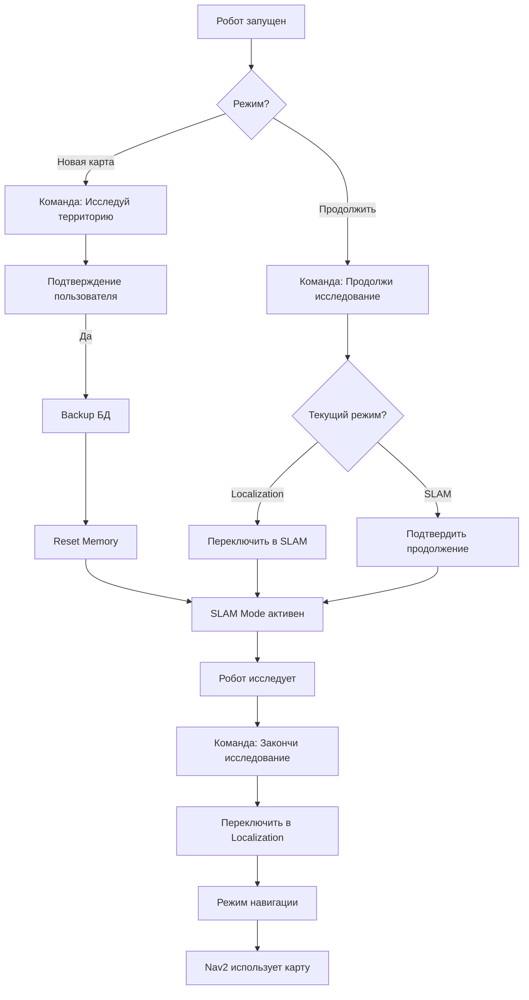

# Резюме: Голосовые команды картографии

## ✅ Что проверено

### RTABMap возможности (из документации и кода):

1. **Режимы работы - ЕСТЬ**:
   - ✅ **SLAM Mode** (Mapping): `Mem/IncrementalMemory: true`
   - ✅ **Localization Mode**: `Mem/IncrementalMemory: false`

2. **ROS2 Сервисы RTABMap**:
   - ✅ `/rtabmap/reset_memory` - сброс БД, новая карта
   - ✅ `/rtabmap/set_mode_mapping` - включить SLAM mode
   - ✅ `/rtabmap/set_mode_localization` - включить Localization mode
   - ✅ `/rtabmap/pause` - пауза
   - ✅ `/rtabmap/resume` - возобновление

3. **База данных**:
   - ✅ Путь: `/maps/rtabmap.db` (volume в docker-compose)
   - ✅ Можно делать backup через `cp`
   - ✅ SQLite формат (можно проверять количество nodes)

## 📋 Три команды для реализации

### 1️⃣ "Исследуй территорию" (Start New Mapping)

**Что делает**:
1. Робот запрашивает подтверждение: "Начать новое исследование? Старая карта будет сохранена."
2. При подтверждении:
   - Backup: `cp rtabmap.db → rtabmap_backup_<timestamp>.db`
   - Сброс БД: `ros2 service call /rtabmap/reset_memory`
   - Переход в SLAM mode (если не в нём)
3. Робот: "Начинаю исследование. Старая карта сохранена."

**Технические детали**:
```python
# В dialogue_node.py
self.reset_memory_client = self.create_client(Empty, '/rtabmap/reset_memory')

# Handler
async def start_new_mapping():
    # 1. Backup через Docker exec
    subprocess.run(['docker', 'exec', 'rtabmap', 'bash', '-c',
                   'cp /maps/rtabmap.db /maps/backups/rtabmap_backup_$(date +%Y%m%d_%H%M%S).db'])
    
    # 2. Reset memory
    await self.reset_memory_client.call_async(Empty.Request())
    
    # 3. Confirm
    return "Начинаю исследование. Старая карта сохранена."
```

---

### 2️⃣ "Продолжи исследование" (Continue Mapping)

**Что делает**:
1. Проверяет текущий режим RTABMap
2. Если в Localization mode → переключает в SLAM mode
3. Если уже в SLAM mode → подтверждает продолжение
4. Робот: "Продолжаю исследование территории."

**Технические детали**:
```python
# В dialogue_node.py
self.set_mode_mapping_client = self.create_client(Empty, '/rtabmap/set_mode_mapping')

# Handler
async def continue_mapping():
    # Проверить режим через параметр
    is_mapping = await self.get_parameter('/rtabmap/rtabmap', 'Mem/IncrementalMemory')
    
    if not is_mapping:
        # Переключить в mapping
        await self.set_mode_mapping_client.call_async(Empty.Request())
        return "Продолжаю исследование. Переключаюсь в режим картографии."
    else:
        return "Исследование уже активно. Продолжаю добавлять новые области."
```

**Особенность**: RTABMap автоматически создаёт новую сессию при перезапуске, но использует существующую БД.

---

### 3️⃣ "Закончи исследование" (Finish → Localization)

**Что делает**:
1. Переключает RTABMap в Localization mode
2. БД сохраняется автоматически
3. Карта становится read-only для навигации
4. Робот: "Заканчиваю исследование. Переключаюсь в режим навигации."

**Технические детали**:
```python
# В dialogue_node.py
self.set_mode_localization_client = self.create_client(Empty, '/rtabmap/set_mode_localization')

# Handler
async def finish_mapping():
    # Переключить в localization
    await self.set_mode_localization_client.call_async(Empty.Request())
    return "Заканчиваю исследование. Переключаюсь в режим навигации по готовой карте."
```

**Преимущества Localization mode**:
- ⚡ Быстрее (не обновляет карту)
- 💾 Меньше нагрузка на CPU
- 🎯 Точная локализация для Nav2

---

## 🔄 Полный workflow



---

## 🎤 Intent Patterns

```python
# В dialogue_node.py - добавить новые intent patterns

MAPPING_INTENTS = {
    'start_mapping': [
        r'исследуй территорию',
        r'начни исследование',
        r'создай новую карту',
        r'начни картографию',
        r'новая карта',
        r'начать сначала',
    ],
    'continue_mapping': [
        r'продолжи исследование',
        r'продолжить картографию',
        r'продолжай карту',
        r'добавь к карте',
        r'продолжи создание карты',
    ],
    'finish_mapping': [
        r'закончи исследование',
        r'завершить картографию',
        r'перейди в навигацию',
        r'режим локализации',
        r'карта готова',
        r'хватит исследовать',
    ],
}
```

---

## 🧪 Тестирование (после реализации)

### 1. Проверка сервисов вручную:

```bash
# На Main Pi (10.1.1.20)
ssh ros2@10.1.1.20

# Проверить доступные сервисы RTABMap
docker exec rtabmap bash -c "source /opt/ros/humble/setup.bash && ros2 service list | grep rtabmap"

# Ожидаемый вывод:
# /rtabmap/reset_memory
# /rtabmap/set_mode_mapping
# /rtabmap/set_mode_localization
# /rtabmap/pause
# /rtabmap/resume
# /rtabmap/trigger_new_map

# Проверить текущий режим
docker exec rtabmap bash -c "source /opt/ros/humble/setup.bash && ros2 param get /rtabmap/rtabmap Mem/IncrementalMemory"
# Output: Boolean value is: true (SLAM mode)
#         Boolean value is: false (Localization mode)
```

### 2. Переключение режимов вручную:

```bash
# Переключить в Localization
docker exec rtabmap bash -c "source /opt/ros/humble/setup.bash && ros2 service call /rtabmap/set_mode_localization std_srvs/srv/Empty"

# Переключить обратно в Mapping
docker exec rtabmap bash -c "source /opt/ros/humble/setup.bash && ros2 service call /rtabmap/set_mode_mapping std_srvs/srv/Empty"

# Сброс памяти (новая карта)
docker exec rtabmap bash -c "source /opt/ros/humble/setup.bash && ros2 service call /rtabmap/reset_memory std_srvs/srv/Empty"
```

### 3. Проверка backup:

```bash
# На Main Pi
ssh ros2@10.1.1.20

# Проверить текущую БД
ls -lh /path/to/maps/rtabmap.db

# Создать backup вручную
docker exec rtabmap bash -c "cp /maps/rtabmap.db /maps/backups/rtabmap_backup_$(date +%Y%m%d_%H%M%S).db"

# Проверить backups
ls -lh /path/to/maps/backups/
```

### 4. Голосовое тестирование:

```
1. "Исследуй территорию"
   → Ожидание: подтверждение, backup, reset, SLAM mode

2. "Продолжи исследование"
   → Ожидание: проверка режима, переключение если нужно

3. "Закончи исследование"
   → Ожидание: переключение в Localization mode

4. Проверить параметр Mem/IncrementalMemory после каждой команды
```

---

## 📦 Что нужно реализовать

### 1. В dialogue_node.py:

```python
# ROS2 Service Clients
self.reset_memory_client = self.create_client(Empty, '/rtabmap/reset_memory')
self.set_mode_mapping_client = self.create_client(Empty, '/rtabmap/set_mode_mapping')
self.set_mode_localization_client = self.create_client(Empty, '/rtabmap/set_mode_localization')

# Intent patterns
self.mapping_intents = MAPPING_INTENTS

# Confirmation system
self.pending_confirmation = None  # 'start_mapping' или None

# Handlers
async def handle_mapping_command(intent, text)
async def backup_rtabmap_db()
async def check_mapping_mode()
```

### 2. Backup script (опционально):

```bash
# docker/main/scripts/rtabmap/backup_rtabmap.sh
#!/bin/bash
BACKUP_DIR="/maps/backups"
mkdir -p "$BACKUP_DIR"
TIMESTAMP=$(date +%Y%m%d_%H%M%S)
cp /maps/rtabmap.db "$BACKUP_DIR/rtabmap_backup_${TIMESTAMP}.db"
# Удалить старые backup (>30 дней)
find "$BACKUP_DIR" -name "rtabmap_backup_*.db" -mtime +30 -delete
```

### 3. Volume в docker-compose.yaml:

```yaml
rtabmap:
  volumes:
    - ./maps:/maps  # ✅ уже есть
    - ./scripts/rtabmap:/scripts:ro  # добавить для backup script
```

---

## ⏱️ Оценка времени реализации

- **Dialogue Node integration**: 2-3 часа
  - Service clients: 30 мин
  - Intent patterns: 20 мин
  - Handlers: 1-1.5 часа
  - Confirmation system: 30 мин
  
- **Backup система**: 1 час
  - Bash script: 20 мин
  - Python integration: 30 мин
  - Тестирование: 10 мин

- **Тестирование**: 1-2 часа
  - Ручное тестирование сервисов: 30 мин
  - Голосовые команды E2E: 1 час
  - Backup/restore: 30 мин

**Итого**: ~4-6 часов работы

---

## 📝 Следующие шаги

1. **Сначала**: Дождаться успешной сборки Docker (11aaa61)
2. **Проверить**: Наличие RTABMap сервисов на Main Pi
3. **Реализовать**: Dialogue Node integration
4. **Протестировать**: Локально, затем на роботе
5. **Документировать**: Примеры использования

---

**Приоритет**: СРЕДНИЙ (после sound effects)  
**Блокеры**: Нет (RTABMap сервисы доступны по умолчанию)  
**Зависимости**: Успешная сборка perception + voice-assistant
