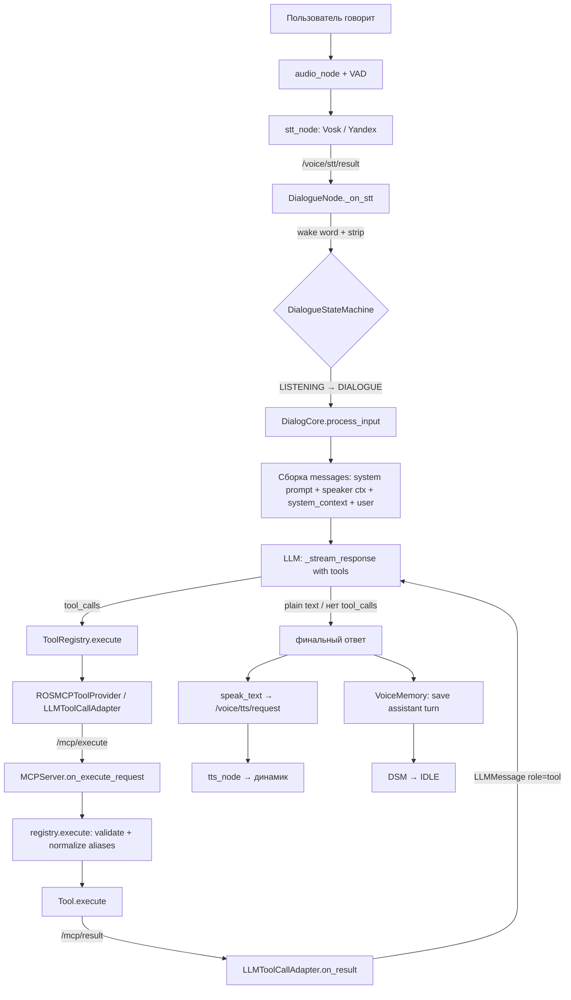

# 🤖 Агентский режим РОББОКС (AGENT MODE)

Единый гайд по агентскому режиму голосового ассистента: как устроен agent cycle,
как LLM управляет роботом через MCP-инструменты, и что делать, когда что-то ломается.

> Пакет: `rob_box_voice` + `rob_box_mcp_tools` + `rob_box_harness`
> Область: STT → DialogueNode → LLM → tool_calls → MCP Server → Tools → Response

---

## 1. Что такое агентский режим

В агентском режиме LLM — **не просто болталка**, а агент, который управляет роботом:
навигацией, картографированием, LED-анимациями, звуками, музыкой (Renardo), памятью,
голосом (TTS/STT), веб-поиском и FAQ.

Вместо того чтобы хардкодить каждую команду, система:

1. Слушает пользователя (STT — Vosk / Yandex).
2. Отправляет распознанный текст в LLM вместе с **системным промптом**
   (`master_prompt_compact.txt`) и **схемами всех инструментов**.
3. LLM решает, какие инструменты вызвать (tool_calls в OpenAI-формате).
4. Инструменты выполняются через **MCP Server** (`rob_box_mcp_tools`).
5. Результаты возвращаются LLM, цикл повторяется, пока LLM не ответит обычным текстом.
6. Ответ озвучивается через TTS (`speak_text` → `/voice/tts/request`).

---

## 2. Agent cycle (пошагово)

Полный цикл обработки одной фразы пользователя:

| # | Шаг | Компонент | Что происходит |
|---|-----|-----------|----------------|
| 1 | Захват звука | `audio_node` + STT | Микрофон → VAD → распознавание речи (Vosk/Yandex) |
| 2 | Публикация текста | `stt_node` | Текст публикуется в `/voice/stt/result`, speaker-инфо — в `/voice/stt/speaker` |
| 3 | Приём STT | `DialogueNode._on_stt` | Фильтр rejected/empty, проверка state (SILENCED), wake-word gate, strip wake word, silence/unsilence команды |
| 4 | Классификация | `DialogueStateMachine` | `IDLE → WAKE_WORD → LISTENING → DIALOGUE` (или команда → `command_node`) |
| 5 | Вызов LLM | `DialogCore.process_input` | Сборка messages: system prompt + speaker context + динамический `<system_context>` + текст юзера; запись user-хода в память |
| 6 | LLM с тулами | `_run_with_tools` | `discover()` → OpenAI tool schemas → `_stream_response(messages, tools)` (complete или stream) |
| 7 | Tool calls | `ToolRegistry.execute` → `ROSMCPToolProvider` | Каждый `ToolCall` выполняется через `LLMToolCallAdapter` → `/mcp/execute` |
| 8 | Выполнение | `MCPServer.on_execute_request` → `registry.execute` | Валидация параметров (с alias-нормализацией), `tool.execute()`, результат → `/mcp/result` |
| 9 | Возврат LLM | `LLMToolCallAdapter.on_result` | Результат → `LLMMessage(role="tool")` → снова `_stream_response` |
| 10 | Завершение цикла | `_run_with_tools` | LLM вернул **plain text без tool_calls** — это финальный ответ (или `_MAX_TOOL_ITERATIONS=8`) |
| 11 | Озвучка | `speak_text` → `tts_node` | Ответ произносится (TTS), параллельно могут играть анимация/звук |
| 12 | Сохранение | `VoiceMemory` / `SQLiteVoiceMemory` | Assistant-ход пишется в память, DSM → `IDLE` |

**Ключевые файлы цикла:**

- `src/rob_box_voice/rob_box_voice/dialogue_node.py` — ROS2-оболочка (pub/sub, цикл, barge-in).
- `src/rob_box_harness/rob_box_harness/core/dialog_core.py` — ядро: `process_input`, `_run_with_tools`, `_stream_response`, tool loop.
- `src/rob_box_harness/rob_box_harness/core/dialogue_state_machine.py` — DSM (IDLE/WAKE_WORD/LISTENING/DIALOGUE/SILENCED).
- `src/rob_box_mcp_tools/rob_box_mcp_tools/llm_adapter.py` — мост LLM → MCP топики.
- `src/rob_box_mcp_tools/rob_box_mcp_tools/mcp_server.py` — MCP сервер, реестр, execute.
- `src/rob_box_mcp_tools/rob_box_mcp_tools/registry.py` — реестр инструментов + alias-нормализация.

---

## 3. Mermaid: поток обработки



---

## 4. ROS 2 интерфейс (топики)

### DialogueNode

| Топик | Тип | Направление | Назначение |
|-------|-----|-------------|------------|
| `/voice/stt/result` | String | in | Распознанный текст (после wake word gate → LLM) |
| `/voice/stt/speaker` | String | in | Speaker-событие (resemblyzer) для `speaker_tag` |
| `/voice/tts/request` | String | out | Запрос озвучки (`speak_text`) |
| `/voice/tts/finished` | String | in | Завершение озвучки чанка |
| `/voice/tts/batch_complete` | String | out | Завершение всего батча speak_text (issue #980) |
| `/voice/tts/batch_registered` | String | out | Предисловие батча (issue #992) |
| `/voice/animation/request` | String | out | Запрос LED-анимации |
| `/voice/sound/trigger` | String | out | Триггер звукового эффекта |
| `/voice/current_dialogue_id` | String | in | Текущий dialogue_id для отбрасывания старых TTS |
| `/mcp/music_cleanup` | String | out | Остановка музыки по завершении диалога |

### MCP Server

| Топик | Тип | Направление | Назначение |
|-------|-----|-------------|------------|
| `/mcp/tools` | String | out | JSON-список доступных инструментов (OpenAI format), публикуется каждые 10с и при старте |
| `/mcp/execute` | String | in | JSON-запрос выполнения инструмента `{tool_name, parameters, request_id}` |
| `/mcp/result` | String | out | JSON-результат `{tool_name, request_id, result}` |
| `/voice/music/state` | String | out | Состояние музыки (`playing`/`idle`) для VAD strict mode |
| `/perception/context_update` | PerceptionEvent | in | Обновление контекста восприятия (если доступно) |

> ⚠️ QoS всех MCP-топиков — **RELIABLE** (BEST_EFFORT терял сообщения в сетевом окружении Zenoh).

---

## 5. MCP-инструменты (43 шт.)

Все инструменты реализуют `MCPTool` (`src/rob_box_mcp_tools/rob_box_mcp_tools/base.py`),
описывают параметры в JSON Schema и возвращают `MCPToolResult {success, data, error, message}`.

Типы выполнения (`ToolExecutionType`):

| Тип | Латентность | Семантика |
|-----|-------------|-----------|
| `INSTANT` | < 100 мс | fire-and-forget, параллельно |
| `FAST` | < 2 с | await completion |
| `MEDIUM` | 2–10 с | await with progress |
| `LONG` | > 10 с | background task с прерыванием |

### 5.1. Навигация (9)

| Инструмент | Параметры | Тип | Пример вызова → выход |
|------------|-----------|-----|------------------------|
| `navigate_to_waypoint` | `waypoint: string` (обяз.) | LONG | `{"waypoint": "кухня"}` → `{"success": true, "message": "Приехал"}` |
| `navigate_to_coordinates` | `x: number` (обяз.), `y: number` (обяз.), `theta: number` (опц., 0.0) | LONG | `{"x": 1.5, "y": 2.0, "theta": 0.0}` → `{"success": true}` |
| `move_direction` | `direction: enum[вперёд,назад,налево,направо]` (обяз.), `distance: number` (опц., 1.0) | LONG | `{"direction": "вперёд", "distance": 2.0}` → `{"success": true, "data": {"direction": "вперёд", "distance": 2.0}}` |
| `stop_navigation` | — | FAST | `{}` → `{"success": true, "message": "Остановлен"}` |
| `list_waypoints` | — | INSTANT | `{}` → `{"success": true, "data": {"waypoints": [{"name": "кухня", "x": 1.0, "y": 2.0}]}}` |
| `save_waypoint` | `name: string` (обяз.) | FAST | `{"name": "кухня"}` → `{"success": true, "data": {"name": "кухня"}}` |
| `delete_waypoint` | `name: string` (обяз.) | INSTANT | `{"name": "кухня"}` → `{"success": true, "message": "Точка удалена"}` |
| `clear_waypoints` | — | INSTANT | `{}` → `{"success": true, "message": "Все точки удалены"}` |
| `get_current_pose` | — | FAST | `{}` → `{"success": true, "data": {"x": 1.0, "y": 2.0, "theta": 1.57}}` |

> Вейпоинты хранятся в `WaypointStore` (SQLite, та же БД с VoiceMemory). `navigate_to_coordinates`
> использует Nav2 `NavigateToPose` action, таймаут 120 с.

### 5.2. Система (5)

| Инструмент | Параметры | Тип | Пример вызова → выход |
|------------|-----------|-----|------------------------|
| `set_volume` | `action: enum[louder,quieter,max,normal]` (обяз.) | FAST | `{"action": "louder"}` → `{"success": true, "data": {"old_volume": -3.0, "new_volume": 0.0}, "message": "Делаю громче"}` |
| `set_pitch` | `action: enum[higher,lower,normal]` (обяз.) | FAST | `{"action": "higher"}` → `{"success": true, "data": {"old_pitch": 1.0, "new_pitch": 1.2}}` |
| `set_speed` | `action: enum[faster,slower,normal]` (обяз.) | FAST | `{"action": "faster"}` → `{"success": true}` |
| `get_robot_status` | — | MEDIUM | `{}` → `{"success": true, "data": {"position": {"x":0,"y":0,"theta":0}, "battery_level": 85.0, "systems": {"navigation": "active"}}}` |
| `get_current_time` | — | MEDIUM | `{}` → `{"success": true, "data": {"datetime": "2026-08-15T12:00:00", "weekday": "суббота"}}` |

> Параметры TTS меняются через сервисы `/tts_node/get_parameters` и `/tts_node/set_parameters`
> (`volume_db`, `pitch_shift`, `yandex_speed`).

### 5.3. Восприятие (2)

| Инструмент | Параметры | Тип | Пример вызова → выход |
|------------|-----------|-----|------------------------|
| `get_perception_context` | — | MEDIUM | `{}` → `{"success": true, "data": {"vision": {...}, "sensors": {...}, "environment": {...}}}` |
| `get_battery_level` | — | FAST | `{}` → `{"success": true, "data": {"battery_level": 85.0, "warning": false}, "message": "Заряд батареи нормальный: 85.0%"}` |

> Контекст восприятия кэшируется в MCP-сервере из подписки `/perception/context_update`;
> батарея — из `/battery_state` (кэш).

### 5.4. Картографирование (5)

| Инструмент | Параметры | Тип | Пример вызова → выход |
|------------|-----------|-----|------------------------|
| `start_mapping` | `map_name: string` (опц.), `new_location: boolean` (опц.) | LONG | `{"map_name": "квартира", "new_location": true}` → `{"success": true, "message": "Начинаю картографирование"}` |
| `continue_mapping` | `map_name: string` (опц.) | MEDIUM | `{"map_name": "квартира"}` → `{"success": true, "message": "Продолжаю карту"}` |
| `finish_mapping` | `map_name: string` (опц.) | MEDIUM | `{"map_name": "квартира"}` → `{"success": true, "message": "Карта сохранена, перехожу в локализацию"}` |
| `optimize_map` | — | LONG | `{}` → `{"success": true, "message": "Карта оптимизирована"}` |
| `load_map` | `map_name: string` (опц.) | LONG | `{"map_name": "квартира"}` → `{"success": true, "message": "Карта загружена, режим локализации"}` |

> `MappingState` — FSM-состояние (`localization` / `mapping`) на диске. `start_mapping` с `new_location=True`
> стирает базу и начинает с нуля.

### 5.5. Анимации (1)

| Инструмент | Параметры | Тип | Пример вызова → выход |
|------------|-----------|-----|------------------------|
| `play_animation` | `animation: string` (обяз.), `duration: number` (опц., 2–30, clamp 2) | INSTANT | `{"animation": "happy", "duration": 5}` → `{"success": true, "message": "Анимация happy запущена"}` |

> Анимации — LED-матрица 381 LED. Псевдонимы нормализуются: `neutral→idle`, `excited→happy`,
> `confused→thinking`, `talk→talking`. Неизвестное имя → warning в лог.

### 5.6. Звук (2)

| Инструмент | Параметры | Тип | Пример вызова → выход |
|------------|-----------|-----|------------------------|
| `play_sound` | `sound: string enum[...]` (обяз., из sound_catalog.json) | INSTANT | `{"sound": "robot_happy"}` → `{"success": true, "message": "Звук robot_happy запущен"}` |
| `get_sound_info` | `sound_name: string` (опц.), `category: enum[base,ui,robot]` (опц.) | MEDIUM | `{"sound_name": "robot_happy"}` → `{"success": true, "data": {"name": "robot_happy", "duration": 1.2, "category": "base", "description": "..."}}` |

> Категории: `base` (эмоции robot_*), `ui` (интерфейс ui_*), `robot` (спецэффекты).
> Звуки fire-and-forget через dmix — параллельно с TTS.

### 5.7. Диалог / голос (4)

| Инструмент | Параметры | Тип | Пример вызова → выход |
|------------|-----------|-----|------------------------|
| `speak_text` | `text: string` (обяз., ≤150 символов на чанк), `animation: string` (опц.) | FAST | `{"text": "Привет, Эйджик!", "animation": "happy"}` → `{"success": true, "message": "TASK_COMPLETE"}` |
| `listen_for_response` | `timeout_seconds: integer` (опц., 30), `prompt_text: string` (опц.) | MEDIUM | `{"timeout_seconds": 30, "prompt_text": "Как тебя зовут?"}` → `{"success": true, "data": {"response": "Меня зовут Денис"}}` |
| `estimate_tts_duration` | `text: string` (обяз.), `chars_per_second: number` (опц.) | FAST | `{"text": "..."}` → `{"success": true, "data": {"estimate_sec": 4.5}}` |
| `register_speaker` | `name: string` (опц., null = спросить), `old_name: string` (опц.) | MEDIUM | `{"name": "Денис"}` → `{"success": true, "data": {"speaker_tag": "speaker:abc123"}}` |

> `speak_text` — главный инструмент: **финальный ответ = уже озвученный текст**. После последнего
> `speak_text` LLM возвращает `done` (plain text) — никаких пост-скриптумов.
> Текст длиннее 150 символов автоматически разбивается на чанки (батч), см. `batch_complete`.

### 5.8. Память (3)

| Инструмент | Параметры | Тип | Пример вызова → выход |
|------------|-----------|-----|------------------------|
| `memory_save` | `fact: string` (обяз.), `category: enum[preference,habit,name,general]` (опц.) | FAST | `{"fact": "Пользователя зовут Алексей", "category": "name"}` → `{"success": true, "data": {"fact_id": 42}}` |
| `memory_search` | `query: string` (обяз.), `limit: integer` (опц., 5, max 20) | MEDIUM | `{"query": "где находится кухня"}` → `{"success": true, "data": {"results": [{"role": "user", "content": "...", "session": "...", "score": 0.9}]}}` |
| `memory_context` | `limit: integer` (опц., 10, max 30), `query: string` (опц.) | MEDIUM | `{"limit": 10}` → `{"success": true, "data": {"recent_turns": [...], "facts": [...], "sessions": 3, "vec_enabled": true}}` |

> `VoiceMemory` — SQLite + FTS5 + опциональный vector search (sqlite-vec + Ollama nomic-embed-text).
> Гибридный поиск: FTS5 → если мало — векторный → merge по score.

### 5.9. FAQ (1)

| Инструмент | Параметры | Тип | Пример вызова → выход |
|------------|-----------|-----|------------------------|
| `faq_search` | `query: string` (обяз.), `limit: integer` (опц., 3, max 10) | MEDIUM | `{"query": "когда начало концерта"}` → `{"success": true, "data": {"results": [{"question": "Когда начало?", "answer": "В 19:00"}]}}` |

### 5.10. Музыка (10)

| Инструмент | Параметры | Тип | Пример вызова → выход |
|------------|-----------|-----|------------------------|
| `execute_music_code` | `code: string` (обяз., Renardo/Python), `pattern_name: string` (опц.), `segments: integer` (опц.), `duration_sec: number` (опц.) | FAST | `{"code": "p1 >> pluck([0, 2, 4], dur=0.5)"}` → `{"success": true, "message": "Паттерн запущен"}` |
| `stop_music` | `pattern_name: string` (опц., 'all' = всё) | FAST | `{"pattern_name": "all"}` → `{"success": true, "message": "Музыка остановлена"}` |
| `set_vibe_preset` | `preset_name: string` (обяз.; alias `preset`) | FAST | `{"preset_name": "chill"}` → `{"success": true, "message": "Пресет chill применён"}` |
| `get_music_state` | — | FAST | `{}` → `{"success": true, "data": {"renardo_available": true, "active_patterns": [...], "preset": "chill"}}` |
| `set_dj_mode` | `enabled: boolean` (обяз.), `next_transition_sec: integer` (опц.), `theme: string` (опц.), `persona: string` (опц.), `plan: string` (опц.) | MEDIUM | `{"enabled": true}` → `{"success": true, "message": "DJ-режим включён"}` |
| `search_samples` | `query: string` (обяз.), `pack: string` (опц.), `case: enum[lower,upper]` (опц.) | FAST | `{"query": "kick"}` → `{"success": true, "data": {"letter": "K", "sample_index": 1, "play_code": "p1 >> play('K1')"}}` |
| `save_track` | `name: string` (обяз., slug), `code: string` (опц.), `description: string` (опц.), `tags: array` (опц.), `rating: integer` (опц. 0–5), `notes: string` (опц.) | FAST | `{"name": "csm_chill_v2", "code": "p1 >> pluck(...)", "tags": ["chill", "90bpm"]}` → `{"success": true, "data": {"track_id": "csm_chill_v2"}}` |
| `list_tracks` | `tag: string` (опц.), `min_rating: integer` (опц. 0–5) | FAST | `{"tag": "chill"}` → `{"success": true, "data": {"tracks": [{"name": "csm_chill_v2", "tags": [...], "rating": 4}]}}` |
| `load_track` | `name: string` (обяз., slug) | FAST | `{"name": "csm_chill_v2"}` → `{"success": true, "message": "Трек играет"}` |
| `delete_track` | `name: string` (обяз., slug) | FAST | `{"name": "csm_chill_v2"}` → `{"success": true, "message": "Трек удалён"}` |

> Музыка — Renardo (FoxDot-совместимый live coding). `set_vibe_preset` принимает алиас `preset`
> → канонический `preset_name` (issue #935 — LLM путал имена). Music safety-net: watchdog
> останавливает музыку при забывчивости LLM (`MUSIC_WATCHDOG_PERIOD_S=5`, `MUSIC_WATCHDOG_ENABLED=true`),
> плюс топик `/mcp/music_cleanup` при завершении диалога.

### 5.11. Веб-поиск (1)

| Инструмент | Параметры | Тип | Пример вызова → выход |
|------------|-----------|-----|------------------------|
| `search_web` | `query: string` (обяз.), `max_results: integer` (опц., 5, max 10) | FAST | `{"query": "погода в Батайске сегодня"}` → `{"success": true, "data": {"query": "...", "results": [{"title": "...", "body": "...", "url": "..."}]}}` |

> DuckDuckGo (ddgs). Для свежих данных: погода, новости, курсы валют, факты. НЕ для музыкального
> ресёрча (есть `search_artist_style` в отдельных скиллах). Сниппет ~280 символов.

---

## 6. Troubleshooting

### 6.1. `_MAX_TOOL_ITERATIONS` — LLM зациклился на tool_calls

**Симптом:** в логе `DialogCore: tool loop hit _MAX_TOOL_ITERATIONS=8; returning the last spoken text as-is`.
Робот отвечает, но «тупит» или повторяет одно и то же. Лимит — `_MAX_TOOL_ITERATIONS = 8`
в `dialog_core.py:57`.

**Причины:**
- LLM не завершает цикл (после `speak_text` снова вызывает тулы).
- LLM вызывает `play_sound`/`play_animation` ПОСЛЕ `speak_text` (запрещено промптом).
- Болтливость: пост-ампл «Вот и всё!», «Хочешь ещё?» — это extra-итерация.

**Что делать:**
1. Проверить финальный ответ LLM — должен быть plain text `done` без tool_calls.
2. Если нарушает RULE #0 / «HOW TO END THE CYCLE» — поправить промпт
   (`src/rob_box_voice/prompts/master_prompt_compact.txt`) и прогнать e2e.
3. `speak_text` + `play_sound`/`play_animation` — ТОЛЬКО в одной итерации вместе.
4. Если лимит мал для легитимных цепочек (например, длинный рэп с 6+ speak_text) — батч
   считается одной итерацией, но проверь, не плодит ли LLM лишние вызовы.

### 6.2. Timeout'ы

| Где | Значение | Симптом | Что делать |
|-----|----------|---------|------------|
| `LLMToolCallAdapter.timeout` | 5.0 с | «Инструмент X не ответил» | Проверить, жив ли mcp_server; QoS RELIABLE; не перегружен ли execute |
| `ROSMCPToolProvider.default_timeout` | 10.0 с | ToolExecutionError timeout | Проверить `/mcp/execute` → `/mcp/result` в логах |
| LLM запрос | 30 с (`llm.timeout_s`) | «Что-то я задумался» | Слабый интернет/провайдер; увеличить `timeout_s` |
| Nav2 `NavigateToPose` | 120 с | «Не доехал до точки» | Проверить Nav2, карту, глобальный план |
| `move_direction` | 60 с | «Не приехал» | Проверить, что робот не заблокирован |
| `listen_for_response` | 30 с | Нет ответа | Штатно — юзер молчит; retry через speak_text |
| AcceptanceGate confirmation | 20 с (`confirmation_timeout_ms`) | «Отменяю, жду указаний» | Штатно, юзер не подтвердил |

**Общие правила:**
- Все MCP-топики — QoS RELIABLE (BEST_EFFORT терял сообщения через Zenoh).
- `/mcp/execute` подписан с `ReentrantCallbackGroup` — иначе ActionClient response callback
  не может выполниться → ложный timeout «Nav2 не ответил».
- Не использовать `rclpy.spin_until_future_complete()` внутри callback
  `MultiThreadedExecutor` — ломает executor. Используется `_wait_future` (threading.Event).

### 6.3. Memory leaks

**Симптом:** рост RSS контейнера / RAM на Pi, медленные ответы, OOM-kill.

**Горячие точки:**
- `SpeakTextTool.pending_speeches` / `pending_batches` — очищаются при `batch_complete`;
  если `/voice/tts/finished` не приходит (tts_node умер/перезапущен), dict растёт.
  Проверяй: в логе «не найден в pending_speeches» — это штатно (чужой TTS), а вот
  «Batch ... не найден при finished» — warning на рассинхронизацию.
- `LLMToolCallAdapter.results_cache` / `pending_requests` — очищаются по результату;
  потерянные request_id (нет `/mcp/result`) копят мусор. Проверь, что mcp_server
  публикует результат всегда (в т.ч. `_publish_error` при невалидном запросе).
- `VoiceMemory` — SQLite WAL + Lock; ходы чистятся по `history_max_turns` (20 пар).
  Если база растёт — проверить, не пишутся ли DJ-переходы (исправлено: `is_dj_auto` не пишет).
- Ollama embedder — lazy + backoff 60с после ошибки; если Ollama недоступна, векторный
  поиск отключается, FTS5 продолжает работать.

**Что делать:**
1. `docker stats` / `htop` — смотреть RSS voice-assistant контейнера.
2. Логи на `pending_batches`/`pending_speeches` — если растут, чини tts_node или рестартни MCP.
3. Для глубокого поиска — tracemalloc/heap_snapshot на диалоговом процессе (см. задачи
   devops по OOM killer).
4. Если подозрение на утечку в стороннем коде (Renardo/SuperCollider) — рестарт музыки.

### 6.4. Deadlock'и

**Симптом:** робот «завис», execute не отвечает, но процессы живы.

**Известные причины и фиксы:**
- **ActionClient + MutuallyExclusiveCallbackGroup** → deadlock «Nav2 не ответил».
  Фикс: `/mcp/execute` подписан с `ReentrantCallbackGroup` (mcp_server.py:154).
- **`spin_until_future_complete` внутри callback** → ломает executor, все подписки замолкают.
  Фикс: `_wait_future` (navigation.py, system.py) — threading.Event + done_callback.
- **Async executor LONG задач** — `InterruptibleTask.cancel()` с interrupt_event;
  если задача игнорирует cancel, она продолжит в фоне — не блокирует цикл.
- **Barge-in / отмена LLM stream** — при новом STT во время ответа DialogueNode
  отменяет стрим (CancelledError на каждом чанке); если стрим не отменяется — см.
  `dialog_core._stream_response` и `t_a586ede6`.

**Что делать при зависании:**
1. `ros2 topic echo /mcp/result` — идут ли результаты.
2. `ros2 topic echo /mcp/execute` — приходят ли запросы.
3. Проверить логи mcp_server: `on_execute_request` → `tool.execute` — где застряло.
4. Рестарт ноды (mcp_server или dialogue_node) — но сначала найди причину по логам.

---

## 7. Связанные файлы

| Файл | Назначение |
|------|------------|
| `src/rob_box_voice/prompts/master_prompt_compact.txt` | Системный промпт LLM-агента: RULE #0 (no metalanguage), RULE #LANG, RULE #SYSCTX, HOW TO END THE CYCLE, BREVITY |
| `src/rob_box_mcp_tools/rob_box_mcp_tools/llm_adapter.py` | LLMToolCallAdapter: мост tool_calls ↔ `/mcp/execute` ↔ `/mcp/result`, sync/async, timeout 5с |
| `src/rob_box_voice/rob_box_voice/core/voice_memory.py` | VoiceMemory: SQLite + FTS5 + sqlite-vec + Ollama embeddings, hybrid search |
| `src/rob_box_mcp_tools/rob_box_mcp_tools/mcp_server.py` | MCPServer: регистрация 43 инструментов, `/mcp/tools|execute|result`, music watchdog |
| `src/rob_box_mcp_tools/rob_box_mcp_tools/registry.py` | MCPToolRegistry: register/execute, валидация, alias-нормализация (issue #935) |
| `src/rob_box_mcp_tools/rob_box_mcp_tools/base.py` | MCPTool/MCPToolParameter/MCPToolResult, ToolExecutionType |
| `src/rob_box_harness/rob_box_harness/core/dialog_core.py` | DialogCore: process_input, `_run_with_tools`, `_MAX_TOOL_ITERATIONS=8` |
| `src/rob_box_voice/rob_box_voice/dialogue_node.py` | DialogueNode: ROS2-оболочка, `_on_stt`, wake-word gate, barge-in, TTS |
| `src/rob_box_mcp_tools/rob_box_mcp_tools/tools/*.py` | Реализации инструментов по категориям (navigation, system, mapping, music, ...) |
| `src/rob_box_mcp_tools/rob_box_mcp_tools/async_executor.py` | AsyncToolExecutor, ToolCallAccumulator, InterruptibleTask |

---

## 8. Быстрый старт для разработчика

```bash
# 1. Промпт правится здесь (и сразу тестируй через e2e-voice)
code src/rob_box_voice/prompts/master_prompt_compact.txt

# 2. Новый инструмент — по образцу в tools/:
#    класс XxxTool(MCPTool) → name/description/parameters/execution_type/execute
#    зарегистрировать в mcp_server.py:_register_tools

# 3. Локальная проверка без железа:
python -m pytest src/rob_box_mcp_tools/test/ -x -q

# 4. Диагностика живого робота:
ros2 topic echo /mcp/tools      # список инструментов, которые видит LLM
ros2 topic echo /mcp/result     # результаты выполнения
ros2 topic echo /voice/tts/request  # что озвучивается
```

---

**Навигация:** [docs/packages/](../README.md) · [rob_box_voice](../../src/rob_box_voice/README.md)
